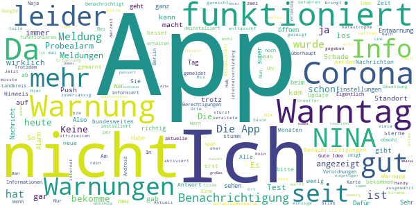

# NINA - Die Warn-App des BBK
App version ``3.2.1.2720``

Analyzed with [covid-apps-observer](http://github.com/covid-apps-observer) project, version ``0.1``

## App overview
| | |
|-------------------------|-------------------------| 
| **Name**&nbsp;&nbsp;&nbsp;&nbsp;&nbsp;&nbsp;&nbsp;&nbsp;&nbsp;&nbsp;&nbsp;&nbsp;&nbsp;&nbsp;&nbsp;&nbsp;&nbsp;&nbsp;&nbsp;&nbsp;&nbsp;&nbsp;&nbsp;&nbsp;&nbsp;&nbsp;&nbsp;&nbsp;&nbsp;&nbsp;&nbsp;&nbsp;&nbsp;&nbsp;&nbsp;&nbsp;&nbsp;&nbsp;&nbsp;&nbsp;  | NINA - Die Warn-App des BBK |
| **Unique identifier** | de.materna.bbk.mobile.app |
| **Link to Google Play** | [https://play.google.com/store/apps/details?id=de.materna.bbk.mobile.app](https://play.google.com/store/apps/details?id=de.materna.bbk.mobile.app) |
| **Summary**  | Die Notfall-Informations- und Nachrichten-App des BBK |
| **Privacy policy** | [http://www.bbk.bund.de/NINA-Datenschutz](http://www.bbk.bund.de/NINA-Datenschutz) |
| **Latest version** | 3.2.1.2720 |
| **Last update** | 2020-05-27 10:41:48 |
| **Recent changes** | - Einbindung einer Karte zur Corona-Ausbreitung - Fehlerbehebung |
| **Installs**  | 1.000.000+ |
| **Category** | Nachrichten & Zeitschriften |
| **First release** | 22.05.2015 |
| **Size**  | 24M |
| **Supported Android version**  | 4.4 oder höher |

### Description
> Die Warn-App NINA (Notfall-Informations- und Nachrichten-App) warnt Sie deutschlandweit vor Gefahren, auf Wunsch auch für Ihren aktuellen Standort. Die App wird vom Bundesamt für Bevölkerungsschutz und Katastrophenhilfe (BBK) bereitgestellt.
 Technischer Ausgangspunkt für NINA ist das modulare Warnsystem des Bundes (MoWaS). Dieses wird vom BBK für bundesweite Warnungen des Zivilschutzes betrieben. Seit 2013 können auch alle Lagezentren der Länder und viele bereits angeschlossenen Leitstellen von Städten und Kommunen das Warnsystem nutzen (http://www.bbk.bund.de/DE/NINA/Warnung/Warnung.html). 
 <b>Hinweis: nicht überall sind auch Warnmeldungen zu lokalen Ereignissen erhältlich. Bitte informieren Sie sich bei Ihrem Landkreis oder Ihrer Stadt, welche Möglichkeiten zur Warnung der Bevölkerung dort eingesetzt werden.</b>
 Mit NINA erhalten Sie:
 •	Warnmeldungen des Bevölkerungsschutzes mit Handlungsempfehlungen 
 •	Wetterwarnungen des DWD (deutschlandweit für alle Landkreis und Städte)
 •	Hochwasserinformationen (deutschlandweit auf Bundeslandebene)
 •	allgemeine Notfalltipps, damit Sie sich und andere vor möglichen Gefahren schützen können.
 Mit NINA können Sie Orte auswählen, für die Sie Warnmeldungen erhalten möchten. Diese werden in der Übersicht „Meine Orte“ angezeigt. Im Einstellungsmenü können Sie festlegen, bei welcher Warnstufe Sie per Push-Benachrichtigung informiert werden sollen. Optional können Sie auch Warnmeldungen für Ihren aktuellen Standort erhalten. Dabei werden keine Standortdaten auf unseren Servern gespeichert. Bitte beachten Sie: Um standortbezogene Warnungen korrekt darstellen zu können, muss NINA Ihren Standort bestimmen können. Bei schlechtem Empfang kann es zu fehlerhaften Anzeigen kommen.
 Das Gefahrengebiet einer Warnmeldung kann in der Kartenansicht angezeigt werden. Die Hochwasserinformationen werden aktuell nur auf Bundeslandebene herausgegeben. In der Karte werden alle vorliegenden Warnmeldungen angezeigt, auch wenn Sie den Ort nicht ausgewählt haben.
 Die Notfalltipps enthalten Empfehlungen zu Themen wie Hochwasser, Unwetter, Stromausfall, Feuer und besondere Gefahrenlagen. Informieren Sie sich, wie Sie sich auf solche Ereignisse vorbereiten können. Ebenso finden Sie Verhaltenshinweise für den Fall, dass Sie von einem Ereignis betroffen sind. Mit den praktischen Checklisten können Sie gleich loslegen.
 Hinweise zu den Berechtigungen in der App:
 Zugriff auf den Speicher (Android 8 und höher): Die Warn-App NINA bietet die Möglichkeit den bekannten Sirenenton auf das Smartphone zu kopieren. Um dieses kopieren zu ermöglichen wird diese Berechtigung benötigt. Nach dem Abschluss des Kopiervorgang kann die Berechtigung wieder entfernt werden. Für eine Funktion der Warn-App ist die Berechtigung nicht erforderlich.
 Eigener Standort: Warnmeldungen für Ihren aktuellen Standort sind nur bei Nutzung von GPS, WLAN und anderen Geolokalisierungsdiensten möglich. Haben Sie diese Dienste auf Ihrem Gerät deaktiviert, können Sie keine standortbezogenen Warnmeldungen erhalten.
 Sie haben Fragen zur Warn-App NINA oder möchten uns Ihr Feedback geben? Dann wenden Sie sich bitte an nina@bbk.bund.de. Weitere Informationen erhalten Sie auch unter http://www.bbk.bund.de/NINA.
 Wichtig:
 Warnungen und Informationen können Sie nur mit einer Datenverbindung (per WLAN oder mobil) empfangen. Verfügt Ihr Gerät über keine Datenverbindung, wird der letzte auf dem Gerät gespeicherte Stand angezeigt.

### User interface
The developers of the app provide the following screenshots in the Google play store.
| | | |
|:-------------------------:|:-------------------------:|:-------------------------:|
 |   |   |   | 
 |   |   |   | 
 |   |   |   | 
 |   |   |   | 
 |   |   |   | 
 |   |   |   | 

## Development team
In the following we report the main information provided by the development team in the Google play store.

| | |
|-------------------------|-------------------------|
| **Developer**  | Bundesamt für Bevölkerungsschutz (Deutschland) |
| **Website**  | [http://www.bbk.bund.de/DE/NINA/Warn-App_NINA_node.html](http://www.bbk.bund.de/DE/NINA/Warn-App_NINA_node.html) |
| **Email** | nina@bbk.bund.de |
| **Physical address**  | [Provinzialstr. 93 53127 Bonn](https://www.google.com/maps/search/Provinzialstr.%2093%2053127%20Bonn) (Google Maps) |
| **Other developed apps**  | [https://play.google.com/store/apps/developer?id=Bundesamt+f%C3%BCr+Bev%C3%B6lkerungsschutz+(Deutschland)](https://play.google.com/store/apps/developer?id=Bundesamt+f%C3%BCr+Bev%C3%B6lkerungsschutz+(Deutschland)) |

## Android support

| | |
|-------------------------|-------------------------|
| **Declared target Android version**  | Android10, version 10 (API level 29) |
| **Effective target Android version**  | Android10, version 10 (API level 29) |
| **Minimum supported Android version**  | KitKat, version 4.4 - 4.4.4 (API level 19) |
| **Maximum target Android version**  | - |

The larger the difference between the minimum and maximum supported Android versions, the better. A larger difference means a wider audience. For example, old phones have a very low Android version, so a high minimum supported Android version means that the app cannot be used by users with old phones, thus leading to accessibility problems. 

## Requested permissions

In the following we report the complete list of the permissions requested by the app. 

| **Permission** | **Protection level** | **Description** | 
|-------------------------|-------------------------|-------------------------|
 **android.permission ACCESS_BACKGROUND_LOCATION** | :warning:**Dangerous** | Allows an app to access location in the background. 
 **android.permission ACCESS_COARSE_LOCATION** | :warning:**Dangerous** | Allows an app to access approximate location. 
 **android.permission ACCESS_FINE_LOCATION** | :warning:**Dangerous** | Allows an app to access precise location. 
 **android.permission ACCESS_NETWORK_STATE** | Normal | Allows applications to access information about networks. 
 **android.permission FOREGROUND_SERVICE** | Normal | Allows a regular application to use Service.startForeground. 
 **android.permission INTERNET** | Normal | Allows applications to open network sockets. 
 **android.permission VIBRATE** | Normal | Allows access to the vibrator. 
 **android.permission WAKE_LOCK** | Normal | Allows using PowerManager WakeLocks to keep processor from sleeping or screen from dimming. 
 **android.permission WRITE_EXTERNAL_STORAGE** | :warning:**Dangerous** | Allows an application to write to external storage. 
 **com.google.android.c2dm.permission RECEIVE** | - | - 
 **com.google.android.finsky.permission BIND_GET_INSTALL_REFERRER_SERVICE** | - | - 

## Mentioned servers

| **Server** | **Registrant** | **Registrant country** | **Creation date** | 
|-------------------------|-------------------------|-------------------------|-------------------------|
 | googlesyndication.com | Google LLC | :us: US | 2003-01-21 06:17:24 |
 | google.com | Google LLC | :us: US | 1997-09-15 04:00:00 |
 | app-measurement.com | Google LLC | :us: US | 2015-06-19 20:13:31 |
 | googleapis.com | Google LLC | :us: US | 2005-01-25 17:52:26 |
 | crashlytics.com | Google LLC | :us: US | 2011-01-21 15:30:40 |
 | googleadservices.com | Google LLC | :us: US | 2003-06-19 16:34:53 |

## Security analysis 

Below we report the main security warnings raised by our execution of the [Androwarn](https://github.com/maaaaz/androwarn) security analysis tool.

**Connection interfaces exfiltration**
> - This application reads details about the currently active data network 

**Suspicious connection establishment**
> - This application opens a Socket and connects it to the remote address '' on the 'N/A' port  
> - This application opens a Socket and connects it to the remote address 'Ljava/lang/StringBuilder;->toString()Ljava/lang/String;' on the 'N/A' port  
> - This application opens a Socket and connects it to the remote address 'Ljava/net/Proxy;->type()Ljava/net/Proxy$Type;' on the 'N/A' port  
> - This application opens a Socket and connects it to the remote address 'timeout' on the 'N/A' port  

**Code execution**
> - This application loads a native library: 'crashlytics' 
> - This application executes a UNIX command containing this argument: 'logcat -b main -d' 

## User ratings and reviews

Below we provide information about how end users are reacting to the app in terms of ratings and reviews in the Google Play store.

### Ratings

The NINA - Die Warn-App des BBK app has been installed by more than **1000000** times. At this time, **18182** rated the app and its average score is **1.8828105**. Below we show the distribution of the ratings across the usual star-based rating of Google Play

:star::star::star::star::star:: 1904

:star::star::star::star:: 975

:star::star::star:: 1763

:star::star:: 1980

:star:: 11560

### Reviews 

#### 5-star reviews

> Plötzlich alle Corona Benachrichtigungen vom letzten 3/4 jahr noch mal erhalten. Erst nachdem die Benachrichtigungen deaktiviert wurden war Schluss... Weiter gibt es wohl Probleme beim Update der Nachrichten über WLAN. Über mobiles Netz keinerlei Problem. Ipv6 Problem?  :date: __2020-11-23 07:07:15__

> Sehr gut  :date: __2020-11-22 17:13:19__

> In welper Feuer nachts Nina hat's gemeldet und enttarnt super  :date: __2020-11-21 18:47:56__

> Ich finde die App gut  :date: __2020-11-21 02:25:20__

> Total cool app bin sehr zufrieden damit  :date: __2020-11-20 20:55:51__

> Optimale Benachrichtigung !  :date: __2020-11-16 18:55:31__

> Sehr gute app sehr wichtig  :date: __2020-11-15 13:12:57__

> Funktioniert wieder einwandfrei!  :date: __2020-11-13 20:59:26__

> Funktioniert nur wenn sie will  :date: __2020-11-13 16:16:12__

> seit langer Zeit kein Update...sonst gut...letzte Corana Info 14.10....merkwürdig  :date: __2020-11-03 11:28:07__

#### 4-star reviews

> 50+ MB Daten bei 35 MB App-Größe – warum und wofür so viele Daten?  :date: __2020-11-19 10:48:01__

> Keine Info beim Probealarm am 10.09.2020. Über einen Fehlalarm im Raum KA wurde ich informiert. Es wurde auch am 01.11.2020 über die geänderten Corona Verordnung in BaWü informiert.  :date: __2020-11-11 09:15:23__

> Die App an sich funktioniert meiner Erfahrung nach eigentlich noch am besten im Vergleich zu anderen Warn-Apps, die ich bisher probiert habe. Das definieren der Bereiche, für die man Warnungen erhalten möchte, geht unkompliziert und problemlos. Alles anderen hängt halt auch ein Stück weit davon ab, was die lokalen Behörden als Warnungen in das System einpflegen. Aber darauf hat ja die App an sich keinen Einfluss.  :date: __2020-11-06 10:56:44__

> Eine gute App mit einem Haken. Ich habe mehrere Orte bei Nina eingegeben, leider lässt sich die Sirene für diese Orte nicht ausschalten. Ich will nicht über einen Ort der nicht in meiner Nähe ist, per Sirene informiert werden. Vielleicht lässt sich da noch etwas verbessern. Danke!  :date: __2020-11-02 08:56:07__

> Einziger Kritik Punkt. Es sind nicht von Anfang an alle Alarme aktiviert. Das wäre aber praktischer.  :date: __2020-11-01 21:23:03__

> Wenn ich die App öffne , kommt als erstes "Es liegen keine Warnmeldungen vor". Besser wäre: "wird geladen".  :date: __2020-11-01 09:31:51__

> Okai  :date: __2020-10-31 23:24:49__

> Am 18.02.2019 war hier in Nürnberg ein Bombenfund einer 250kg-Fliegerbombe mit entsprechendem Medienecho. Die Bombe wurde vor Ort gesprengt. Katastrophenalarm wurde ausgerufen in Nürnberg und Fürth. Keinerlei Benachrichtigung durch NINA. Habe noch nie eine Warnung erhalten, vielleicht gab's nichts zu warnen? Nachtrag: Nach Kontakt mit dem Bundesamt wurden einige Einstellungen an meinem Huawei-Telefon geändert. Alles funktioniert jetzt wie es soll.  :date: __2020-10-25 09:08:27__

> Eigentlich eine gute App aber wo der sirenen test war habe ich erst eine halbe Stunde später eine Nachricht bekommen das der test ist aber ansonsten ist die app gut  :date: __2020-10-24 22:29:21__

> Finde könnte die Fallzahlen andersgesagt Infiziertenzahlen beifügen sonst nix auszusetzen  :date: __2020-10-23 16:02:42__

#### 3-star reviews

> Heute kam mal wieder eine Meldung nach langer Zeit, für die kleinen Bereiche scheint zu klappen. Nach dem Löschen der letzten neuen Meldung ist das Badgesymbol weg. Nur die alte Coronameldung macht dem Symbol nichts.Corona da, Badgesymbol weg. Seltsam scheint die unterschiedliche Behandlung.  :date: __2020-11-22 16:09:05__

> Ok  :date: __2020-11-22 13:58:01__

> Wäre schön, wenn die Warnungen für den Landkreis Harburg, aus den Warnungen für Hamburg "verschwinden" könnten. Hamburg-Harburg (Stadtbezirk der Freien und Hansestadt Hamburg) hat nichts mit dem Landkreis Harburg (WL/Winsen Luhe) in Niedersachsen zu tun.  :date: __2020-11-16 14:47:36__

> Man glaubt es kaum aber diese App kann echt auch Warnungen raus geben 😎 habe die App seit Jahren und dieses mal die erste Warnung herhalten 😉 es wird ja was 👍  :date: __2020-11-15 19:09:26__

> Hängt nur noch hinterher.....teilweise kommen nach Tagen Entwarnungen....ohne das vorher überhaupt gewarnt wurde.....diese Warnungen kommen meisst dann kurz nach (!!) den Entwarnungen.  :date: __2020-11-14 19:23:16__

> Die Warnungen kommen meistens zu spät an.  :date: __2020-11-12 20:33:20__

> Eigentlich gute App, aber leider werden aktuelle Ereignisse erst zu spät aktualisiert, zb. bei Coronamassnahmen der Bundesländer öfter mal updaten.  :date: __2020-11-11 13:48:19__

> Wenn Sie besser warnen würde dann 5 so nur 3  :date: __2020-11-11 11:12:46__

> Manchmal funktioniert die App super, leider meistens nicht so gut. Wir wohnen relativ dicht an der Grenze zwischen RP und HE ich bekomme mehr Meldungen zu Hessen die mich Null interessieren weil es einfach nicht mein Bundesland ist. Wenn aber in unserer Stadt was los ist, dann bekomme ich keine Warnung will der Umkreis nicht die ganze Stadt umfasst.  :date: __2020-11-10 12:59:47__

> Zu großer Speicherverbrauch: Wozu über 50MB Benutzerdaten und 50MB Cache? Coronameldungen machen alles unübersichtlich und so übersieht man die wirklich wichtigen Informationen. Wenn man mehrere unterschiedliche Orte anzeigen lässt und nach unten scrollt werden die nach oben aus dem sichtbaren Bereich verschwundenen Orte eingeklappt und beim wieder hoch scrollen nur noch die Ortsnamen angezeigt.  :date: __2020-11-06 10:59:23__

#### 2-star reviews

> Bei Wettervoraussagen ist die App bei uns Recht zuverlässig. Stallpflicht im Landkreis Harburg als Dauerinformation und für Hamburg kommt keine Nachricht, nur eine Empfehlung. Dabei ist ab dem 13.11. schon Stall PFLICHT, gut das die Post noch funktioniert und der Brief nur drei Tage später kam...  :date: __2020-11-23 08:06:37__

> Am offiziellen Warntag 2020 blieb die App stumm und nun gab es wegen "Migrationsarbeiten" gleich 68 (alte) Warnungen im Sekundentakt, echt ganz großes Kino! Man stellt ja doch einen markanten Ton für diese App ein, war dadurch recht "spaßig"  :date: __2020-11-21 00:20:13__

> Push Notifications könnt Ihr... NICHT! Auf einmal alle Meldungen auf einmal neu schicken ist super. Teilen einer Warnung sollte über den Link auch zur Warnung führen und nicht nur auf die Startseite...  :date: __2020-11-20 12:22:48__

> Leider keine Warnungen für meinen Standort und meine eingetragen Favoriten, ich muss die App immer per Hand öffnen um sie zu sehen. Dafür werde ich genervt mit Warnungen für Orte 100km entfernt.  :date: __2020-11-19 08:03:05__

> War einmal eine super App, wurde aber mit jedem Update verschlimmbessert. Ich finde die App ist kompliziert in der Bedienung geworden und ich finde mich auch nicht mehr so gut zurecht.  :date: __2020-11-18 16:38:27__

> An sich eine super tolle App und wirklich sinnvoll, leider bekomme auch ich seit ein paar Monaten gar keine Benachrichtigung mehr. Das ist sehr schade und ärgerlich... Daher nur zwei Sterne  :date: __2020-11-18 08:31:47__

> Leider funktioniert die App nicht mehr braucht. Findet keinen Standort mehr, auch nicht nach neu Installation.  :date: __2020-11-15 20:27:25__

> Selbst als in der Nachbarschaft ein Haus gebrannt hat, gab es keine Meldung. Dabei hätte ich gerne gewusst dass ich da nicht lang fahren darf, weil die Straße verqualmt und gesperrt ist. Es steht ein bisschen was zu Corona drin, das war es aber auch schon. Wo ist die Information wo ich sehen kann, was ich in der Umgebung nicht darf? Für eine Katastrophen App ist es eine Katastrophe. Die Bedienung ist dafür sehr gut. Sie braucht nur Speicher und nutzt wenig. Das ist schade!  :date: __2020-11-13 03:48:16__

> Keine Benachrichtigungen oder lange nach Katwarn, wenn überhaupt. Im Notfall eher unbrauchbar im jetzigen Entwicklungsstand...  :date: __2020-11-12 21:42:09__

> Es ist sehr traurig, dass die WarnApp Meldungen verbreitet, die nicht stimmen, zum Beispiel einen 24-stündigen Ausfall der 112 in Cuxhaven, der nach 30 Minuten erledigt war. Aber das muss man dann googeln und online bei der örtlichen Zeitung nachlesen.  :date: __2020-11-11 21:09:07__

#### 1-star reviews

> Meine app ist ständig abgestürzt jetzt hab ich sie neu runter geladen und ich kann den Qr Code nicht mehr nutzen woher soll ich jetzt wissen wie mein Ergebnis ist?  :date: __2020-11-22 15:14:12__

> Ich habe die App schon länger installiert. Leider erhalte ich nie Meldungen, obwohl die Funktion aktiviert ist: weder kürzlich bei dem bundesweiten Probealarm noch heute Nacht bei einem Großbrand 400 m von meiner Wohnung entfernt!  :date: __2020-11-22 10:26:05__

> Dauer fehler.... Dauer abstürze nach Update keine Auslösung und kein Sirenenton mehr verfügbar unbrauchbar seit mind 1 jahr Update.... es hat sich sogut wie nichts geändert.... keine auslösung keine Warnung .... schrott unbrauchbar note 6  :date: __2020-11-21 13:38:19__

> Ich habe heute die "Neuigkeiten", im Zusammenhang mit Corona, der letzten 2 Monate bekommen. Schnelle Information sieht anders aus. Auch die anderen möglichen Warnungen kommen mit erheblicher Verspätung. Ich habe diese untaugliche App jetzt zum 2. Mal deinstalliert. Diesmal entgültig!  :date: __2020-11-20 18:34:30__

> Die App hat mal sehr gut funktioniert. Jedoch bekomme ich seit bestimmt 2 Monaten keine Meldungen mehr angezeigt.  :date: __2020-11-20 14:32:25__

> Warnmeldungen (oder zumindest die push-Benachrichtigungen dafür) kommen leider meistens stark verzögert an. Bei einer Warn-App ist das eigentlich schon ein KO Kriterium. Habe die Bewertung gerade von zwei auf einen Stern reduziert. Heute (20.11.) wurden mir sämtliche Nachrichten die seit Juni kamen nochmal als neu angezeigt. Führte dazu dass im Meeting plötzlich mehrere Handys ca. 30 Sekunden Warngeräusche von sich gaben. Fühlte sich nach Katastrophenlage an🙄  :date: __2020-11-20 12:41:09__

> Meine App hat soeben 15 Minuten (!!!) ununterbrochen Corona-Meldungen gebracht und dabei genauso lange das Smartphone vibrieren lassen. Wenn ihr wollt, dass jeder diese App genervt deinstalliert, dann nur weiter so. Klasse, ganz großes Kino!  :date: __2020-11-20 12:25:34__

> Brummt seit 5 Minuten ununterbrochen und pusht steinalte Meldungen durch  :date: __2020-11-20 12:23:49__

> Die App hat gerade ALLE Pushnachtichten die es je gab neu gesendet. Mein Handy hat gerade 5 Minuten durchvibriert. Eine staatliche App mit solchem Verhalten ist untragbar.  :date: __2020-11-20 12:23:48__

> Was soll das. Seit 10min bekomme ich im Sekundentakt alte und neue Meldungen, hört gar nicht mehr auf. HALLLOOOO das soll eine Warnapp sein und kein Spammbooster. Wurde soeben deinstalliert !  :date: __2020-11-20 12:23:09__

