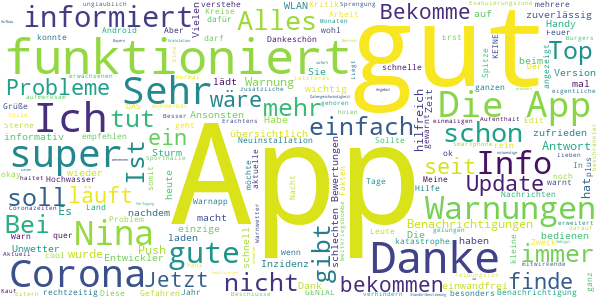
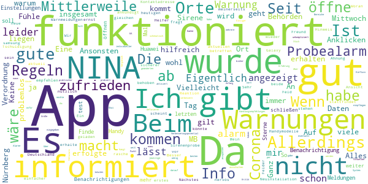
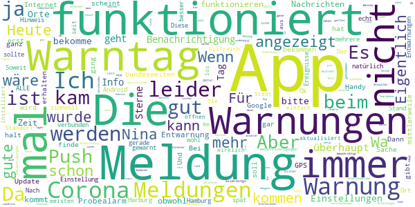

# NINA - Die Warn-App des BBK
App version ``3.3.0.2978``

Analyzed with [covid-apps-observer](http://github.com/covid-apps-observer) project, version ``0.1``

## App overview
| | |
|-------------------------|-------------------------| 
| **Name**&nbsp;&nbsp;&nbsp;&nbsp;&nbsp;&nbsp;&nbsp;&nbsp;&nbsp;&nbsp;&nbsp;&nbsp;&nbsp;&nbsp;&nbsp;&nbsp;&nbsp;&nbsp;&nbsp;&nbsp;&nbsp;&nbsp;&nbsp;&nbsp;&nbsp;&nbsp;&nbsp;&nbsp;&nbsp;&nbsp;&nbsp;&nbsp;&nbsp;&nbsp;&nbsp;&nbsp;&nbsp;&nbsp;&nbsp;&nbsp;  | NINA - Die Warn-App des BBK |
| **Unique identifier** | de.materna.bbk.mobile.app |
| **Link to Google Play** | [https://play.google.com/store/apps/details?id=de.materna.bbk.mobile.app](https://play.google.com/store/apps/details?id=de.materna.bbk.mobile.app) |
| **Summary**  | Die Notfall-Informations- und Nachrichten-App des BBK |
| **Privacy policy** | [http://www.bbk.bund.de/NINA-Datenschutz](http://www.bbk.bund.de/NINA-Datenschutz) |
| **Latest version** | 3.3.0.2978 |
| **Last update** | 2020-12-07 15:50:59 |
| **Recent changes** | Mit der Version 3.3.0 wird Android 6 oder höher benötigt  - Jeder abonnierte Ort enthält nun zusätzlich Informationen zu lokalen Corona-Regelungen auf Kreisebene - Die Warn-App kann ab jetzt in den Sprachen: Deutsch, Deutsch (Leichte Sprache), Englisch, Französisch, Polnisch, Russisch, Spanisch, Türkisch und Arabisch genutzt werden - Mit der neuen Sortierfunktion können Warnmeldungen innerhalb einer Ortskachel neu angeordnet werden |
| **Installs**  | 1.000.000+ |
| **Category** | Nachrichten & Zeitschriften |
| **First release** | 22.05.2015 |
| **Size**  | 28M |
| **Supported Android version**  | 6.0 oder höher |

### Description
> Die Warn-App NINA (Notfall-Informations- und Nachrichten-App) warnt Sie deutschlandweit vor Gefahren, auf Wunsch auch für Ihren aktuellen Standort. Die App wird vom Bundesamt für Bevölkerungsschutz und Katastrophenhilfe (BBK) bereitgestellt.
 Technischer Ausgangspunkt für NINA ist das modulare Warnsystem des Bundes (MoWaS). Dieses wird vom BBK für bundesweite Warnungen des Zivilschutzes betrieben. Seit 2013 können auch alle Lagezentren der Länder und viele bereits angeschlossenen Leitstellen von Städten und Kommunen das Warnsystem nutzen (http://www.bbk.bund.de/DE/NINA/Warnung/Warnung.html). 
 <b>Hinweis: nicht überall sind auch Warnmeldungen zu lokalen Ereignissen erhältlich. Bitte informieren Sie sich bei Ihrem Landkreis oder Ihrer Stadt, welche Möglichkeiten zur Warnung der Bevölkerung dort eingesetzt werden.</b>
 Mit NINA erhalten Sie:
 •	Warnmeldungen des Bevölkerungsschutzes mit Handlungsempfehlungen 
 •	Wetterwarnungen des DWD (deutschlandweit für alle Landkreis und Städte)
 •	Hochwasserinformationen (deutschlandweit auf Bundeslandebene)
 •	allgemeine Notfalltipps, damit Sie sich und andere vor möglichen Gefahren schützen können.
 Mit NINA können Sie Orte auswählen, für die Sie Warnmeldungen erhalten möchten. Diese werden in der Übersicht „Meine Orte“ angezeigt. Im Einstellungsmenü können Sie festlegen, bei welcher Warnstufe Sie per Push-Benachrichtigung informiert werden sollen. Optional können Sie auch Warnmeldungen für Ihren aktuellen Standort erhalten. Dabei werden keine Standortdaten auf unseren Servern gespeichert. Bitte beachten Sie: Um standortbezogene Warnungen korrekt darstellen zu können, muss NINA Ihren Standort bestimmen können. Bei schlechtem Empfang kann es zu fehlerhaften Anzeigen kommen.
 Das Gefahrengebiet einer Warnmeldung kann in der Kartenansicht angezeigt werden. Die Hochwasserinformationen werden aktuell nur auf Bundeslandebene herausgegeben. In der Karte werden alle vorliegenden Warnmeldungen angezeigt, auch wenn Sie den Ort nicht ausgewählt haben.
 Die Notfalltipps enthalten Empfehlungen zu Themen wie Hochwasser, Unwetter, Stromausfall, Feuer und besondere Gefahrenlagen. Informieren Sie sich, wie Sie sich auf solche Ereignisse vorbereiten können. Ebenso finden Sie Verhaltenshinweise für den Fall, dass Sie von einem Ereignis betroffen sind. Mit den praktischen Checklisten können Sie gleich loslegen.
 Hinweise zu den Berechtigungen in der App:
 Zugriff auf den Speicher (Android 8 und höher): Die Warn-App NINA bietet die Möglichkeit den bekannten Sirenenton auf das Smartphone zu kopieren. Um dieses kopieren zu ermöglichen wird diese Berechtigung benötigt. Nach dem Abschluss des Kopiervorgang kann die Berechtigung wieder entfernt werden. Für eine Funktion der Warn-App ist die Berechtigung nicht erforderlich.
 Eigener Standort: Warnmeldungen für Ihren aktuellen Standort sind nur bei Nutzung von GPS, WLAN und anderen Geolokalisierungsdiensten möglich. Haben Sie diese Dienste auf Ihrem Gerät deaktiviert, können Sie keine standortbezogenen Warnmeldungen erhalten.
 Sie haben Fragen zur Warn-App NINA oder möchten uns Ihr Feedback geben? Dann wenden Sie sich bitte an nina@bbk.bund.de. Weitere Informationen erhalten Sie auch unter http://www.bbk.bund.de/NINA.
 Wichtig:
 Warnungen und Informationen können Sie nur mit einer Datenverbindung (per WLAN oder mobil) empfangen. Verfügt Ihr Gerät über keine Datenverbindung, wird der letzte auf dem Gerät gespeicherte Stand angezeigt.

### User interface
The developers of the app provide the following screenshots in the Google play store.
| | | |
|:-------------------------:|:-------------------------:|:-------------------------:|
 |   |   |   | 
 |   |   |   | 
 |   |   |   | 
 |   |   |   | 
 |   |   |   | 
 |   |   |   | 

## Development team
In the following we report the main information provided by the development team in the Google play store.

| | |
|-------------------------|-------------------------|
| **Developer**  | Bundesamt für Bevölkerungsschutz (Deutschland) |
| **Website**  | [http://www.bbk.bund.de/DE/NINA/Warn-App_NINA_node.html](http://www.bbk.bund.de/DE/NINA/Warn-App_NINA_node.html) |
| **Email** | nina@bbk.bund.de |
| **Physical address**  | [Provinzialstr. 93 53127 Bonn](https://www.google.com/maps/search/Provinzialstr.%2093%2053127%20Bonn) (Google Maps) |
| **Other developed apps**  | [https://play.google.com/store/apps/developer?id=Bundesamt+f%C3%BCr+Bev%C3%B6lkerungsschutz+(Deutschland)](https://play.google.com/store/apps/developer?id=Bundesamt+f%C3%BCr+Bev%C3%B6lkerungsschutz+(Deutschland)) |

## Android support

| | |
|-------------------------|-------------------------|
| **Declared target Android version**  | Android10, version 10 (API level 29) |
| **Effective target Android version**  | Android10, version 10 (API level 29) |
| **Minimum supported Android version**  | KitKat, version 4.4 - 4.4.4 (API level 19) |
| **Maximum target Android version**  | - |

The larger the difference between the minimum and maximum supported Android versions, the better. A larger difference means a wider audience. For example, old phones have a very low Android version, so a high minimum supported Android version means that the app cannot be used by users with old phones, thus leading to accessibility problems. 

## Requested permissions

In the following we report the complete list of the permissions requested by the app. 

| **Permission** | **Protection level** | **Description** | 
|-------------------------|-------------------------|-------------------------|
 **android.permission ACCESS_BACKGROUND_LOCATION** | :warning:**Dangerous** | Allows an app to access location in the background. 
 **android.permission ACCESS_COARSE_LOCATION** | :warning:**Dangerous** | Allows an app to access approximate location. 
 **android.permission ACCESS_FINE_LOCATION** | :warning:**Dangerous** | Allows an app to access precise location. 
 **android.permission ACCESS_NETWORK_STATE** | Normal | Allows applications to access information about networks. 
 **android.permission FOREGROUND_SERVICE** | Normal | Allows a regular application to use Service.startForeground. 
 **android.permission INTERNET** | Normal | Allows applications to open network sockets. 
 **android.permission VIBRATE** | Normal | Allows access to the vibrator. 
 **android.permission WAKE_LOCK** | Normal | Allows using PowerManager WakeLocks to keep processor from sleeping or screen from dimming. 
 **android.permission WRITE_EXTERNAL_STORAGE** | :warning:**Dangerous** | Allows an application to write to external storage. 
 **com.google.android.c2dm.permission RECEIVE** | - | - 
 **com.google.android.finsky.permission BIND_GET_INSTALL_REFERRER_SERVICE** | - | - 

## Mentioned servers

| **Server** | **Registrant** | **Registrant country** | **Creation date** | 
|-------------------------|-------------------------|-------------------------|-------------------------|
 | googlesyndication.com | Google LLC | :us: US | 2003-01-21 06:17:24 |
 | google.com | Google LLC | :us: US | 1997-09-15 04:00:00 |
 | app-measurement.com | Google LLC | :us: US | 2015-06-19 20:13:31 |
 | googleapis.com | Google LLC | :us: US | 2005-01-25 17:52:26 |
 | crashlytics.com | Google LLC | :us: US | 2011-01-21 15:30:40 |
 | googleadservices.com | Google LLC | :us: US | 2003-06-19 16:34:53 |

## Security analysis 

Below we report the main security warnings raised by our execution of the [Androwarn](https://github.com/maaaaz/androwarn) security analysis tool.

**Connection interfaces exfiltration**
> - This application reads details about the currently active data network 

**Suspicious connection establishment**
> - This application opens a Socket and connects it to the remote address '' on the 'N/A' port  
> - This application opens a Socket and connects it to the remote address 'Ljava/lang/StringBuilder;->toString()Ljava/lang/String;' on the 'N/A' port  
> - This application opens a Socket and connects it to the remote address 'Ljava/net/Proxy;->type()Ljava/net/Proxy$Type;' on the 'N/A' port  
> - This application opens a Socket and connects it to the remote address 'timeout' on the 'N/A' port  

**Code execution**
> - This application loads a native library: 'crashlytics' 
> - This application executes a UNIX command containing this argument: 'logcat -b main -d' 

## User ratings and reviews

Below we provide information about how end users are reacting to the app in terms of ratings and reviews in the Google Play store.

### Ratings

The NINA - Die Warn-App des BBK app has been installed by more than **1000000** times. At this time, **18375** rated the app and its average score is **1.9659398**. Below we show the distribution of the ratings across the usual star-based rating of Google Play

:star::star::star::star::star:: 2278

:star::star::star::star:: 1017

:star::star::star:: 1783

:star::star:: 2017

:star:: 11280

### Reviews 

#### 5-star reviews

> Besser als die eigentliche Corona App!  :date: __2020-12-13 20:22:07__

> App funktioniert seit Monaten reibungslos.  :date: __2020-12-13 18:55:39__

> Gut gelungen! Danke für die zusätzliche Corona-Infos. Macht weiter so und haltet die Infos Aktuell wie z. B. Beschlüsse von heute 13.12.2020 Danke an alle mitwirkende  :date: __2020-12-13 18:37:20__

> Eine unglaublich tolle App. Meines Erachtens nach gehören NINA und Warnwetter (letzteres um den einmaligen In-App-Kauf erweitert) auf das Smartphone jedes erwachsenen Bürgers in diesem Land. Dank der App konnte ich meine Eltern darauf aufmerksam machen dass ihr Haus in der Evakuierungszone bei der Sprengung einer Weltkriegsbombe liegt, sie rechtzeitig zu mir holen und somit zu Coronazeiten den Aufenthalt in einer Sporthalle verhindern. Vielen lieben Dank für ihre Arbeit!  :date: __2020-12-13 18:35:57__

> Alles Super & läuft wieder normal :-)  :date: __2020-12-13 17:35:26__

> App ist wunderbar auch bei beschränkter Datengeschwindigkeit schneller Aufbau auch im Bereich des Browsers Daten-Angebot übersichtlich besonders zu Benennen ist die Standortbestimmung auch bei deaktivierten App Immer sofort notwendige Infos zur Verfügung Gratulation weiter So !!! Grüße aus Bayern 👍👍👍🍀🍀🍀🍀🍀  :date: __2020-12-13 17:02:04__

> Funktioniert  :date: __2020-12-13 16:33:03__

> Sehrgut Beste!!!  :date: __2020-12-13 14:47:47__

> Die App funktioniert bei mir ohne Probleme und ist zuverlässig. Vermutlich haben die meisten Leute hier wieder die obligatorischen Layer-8-Probleme - eine kleine Hinweiszusammenfassung für euch: - Android hintert die App daran, im Hintergrund zu arbeiten, wenn der Energiesparmodus aktiviert ist (App-Info -> Akkuverbrauch nicht optimieren) - Die App benötigt zwingend Internet - Wenn der RAM "bereinigt" wird, wird auch Nina beendet und funktioniert nicht mehr (hört auf, Cleaning-Apps zu nutzen!)  :date: __2020-12-12 15:06:52__

> Alles top  :date: __2020-12-12 14:26:20__

#### 4-star reviews

> Wenn ich die App öffne , kommt als erstes "Es liegen keine Warnmeldungen vor". Besser wäre: "wird geladen". Das scheint behoben zu zu sein. Nächstes: Wenn ich es aktuell öffne, kommen 3 Felder. Das 1. mit den aktuellen Regeln (?) das 2. mit der Info, dass ab Mittwoch eine neue Verordnung gilt. Beim 1. Feld sollte nach dem Anklicken da stehen, dass es für den heutigen Tag gilt und dass es ab Mittwoch andere Regeln gibt.  :date: __2020-12-13 17:28:38__

> Ein einfacher Helfer  :date: __2020-12-13 16:26:11__

> An sich funktioniert die App sehr gut aber ich erhalte keine corona Regeln in der Ansicht auch nach einer Neuinstallation nicht. Mein Freund sehr wohl. Wir haben beide die gleichen Handymodelle Galaxy von samsung. Woran kann das liegen?  :date: __2020-12-13 10:31:05__

> Fühle mich sicherer seit ich die App habe. Sehr nützlich und kann sie nur jedem in Deutschland empfehlen. Allerdings wird man nicht immer informiert, was einen betreffen könnte. Mittlerweile macht es mich nervös, wenn Sirenenprobe stattfindet und NINA es nicht ankündigt. Da fragt man sich dann "Ist es ernst?" Ansonsten sehr zufrieden.  :date: __2020-12-12 10:11:20__

> Ganz hilfreich  :date: __2020-12-11 17:04:40__

> Tschuldigung meinerseits, jetzt funktioniert es wieder... keine Ahnung warum.  :date: __2020-12-11 11:08:53__

> App funktioniert bei mir problemlos und gut. Auf einen Hinweis an die Kontaktadresse erfolgte eine rasche Reaktion. Die Warnungen und Handlungsempfehlungen sind insgesamt ein wenig schematisch, da gäbe es eventuell noch Verbesserungspotential, sie etwas individueller an die jeweilige Situation anzupassen - aber insgesamt ist die App sehr hilfreich.  :date: __2020-12-09 16:06:46__

> 50+ MB Daten bei 35 MB App-Größe – warum und wofür so viele Daten?  :date: __2020-11-19 10:48:01__

> Keine Info beim Probealarm am 10.09.2020. Über einen Fehlalarm im Raum KA wurde ich informiert. Es wurde auch am 01.11.2020 über die geänderten Corona Verordnung in BaWü informiert.  :date: __2020-11-11 09:15:23__

> Die App an sich funktioniert meiner Erfahrung nach eigentlich noch am besten im Vergleich zu anderen Warn-Apps, die ich bisher probiert habe. Das definieren der Bereiche, für die man Warnungen erhalten möchte, geht unkompliziert und problemlos. Alles anderen hängt halt auch ein Stück weit davon ab, was die lokalen Behörden als Warnungen in das System einpflegen. Aber darauf hat ja die App an sich keinen Einfluss.  :date: __2020-11-06 10:56:44__

#### 3-star reviews

> Leichte Sprache. Ah ja, natürlich, jetzt ist alles klar. Was das wohl bedeuten soll? Ist das die Einstellung für's Rotlichtviertel??  :date: __2020-12-13 19:14:11__

> Was bedeuten die Zahlen hinter den corona regeln? Mal steht da eine 2. Mal eine 1 und dan mal garnichts!  :date: __2020-12-13 19:08:27__

> Funktioniert soweit, aber die Push-Einstellung für Corona-News ist zu versteckt bzw. sollte automatisch abgefragt werden, ob man das will. Zusammenarbeit mit KatWarn ist sehr sinnvoll. Meiner Meinung nach sollten aber mehr Infos kommen (aber natürlich nicht wg. jeder Kleinigkeit, sonst liest es keiner mehr).  :date: __2020-12-13 15:21:31__

> Könnt ihr bitte die Funktion einfügen, ALLE Warnungen hinzuzufügen 1. Weltweit 2. Auf bestimmte Länder begrenzt.  :date: __2020-12-13 13:37:23__

> Ich habe 2 Orte (Landkreise) eingetragen. Warum werden Bundesweite Meldungen bei jedem Ort angezeigt? Wenn jemand 10 Orte einträgt hätte er 10 mal dieselbe Meldungen. Es wäre besser und übersichtlicher die Bundesweiten Meldungen auch ohne Ortsangabe anzuzeigen. Dann natürlich nur einmal. Ggf wenn dann ein Ort hinzugefügt wird auch ein gemeinsamer Eintrag für das Land. Dann gäbe es keine doppelmeldungen.  :date: __2020-12-13 13:17:17__

> Irgendwas stimmt nicht. Eingegebene Orte lassen sich nicht entfernen!  :date: __2020-12-13 06:06:01__

> Der aktuelle Stand wird immer zu spät erwähnt..  :date: __2020-12-12 15:11:31__

> Für Zeiten wie Pandemien in Ordnung. Für Warnungen in normalen Zeiten eher ungeeignet bzw. nicht notwendig es zu brauchen.  :date: __2020-12-09 21:47:12__

> Die Erweiterung der App um die Corona-Regeln ist sinnvoll, nur dass gegenüber der üblichen Risikoeinstufung eine neue Skalierung mit 100 -250 angefangen wird ist nicht zielführend. Besser wäre die allgemeine Regel >50,>100, 100-200 pro 100.000 EW.  :date: __2020-12-09 16:09:07__

> Funktioniert bei meinem Handy (BJ 2014) irgendwie nicht mehr. Beim Start zeigt es immer einen Hinweis, dass die App gerade noch eingerichtet wird. Dies funktioniert letzendlich nicht. App ist somit für mich nicht nutzbar.  :date: __2020-12-06 09:10:10__

#### 2-star reviews

> Letzte Aktualisierung 14.10.20 das ist nicht hilfreich. Von einer " warn App" erwarte ich mehr brauchbare Hinweise gerade in der jetzigen Situation. Zum Beispiel aktuelle Zahlen zu Infektionen Regional. In meinem Fall Greifswald. Zu Anfang war es so.  :date: __2020-12-13 20:50:25__

> Die App informiert nur wenn man sie öffnet. Einen Alarm mit Ton und Pop up hatte ich nie!  :date: __2020-12-13 16:34:37__

> Sehr schade ist, dass Google play Dienste benötigt werden. Dass unser Staat das auch unterstützt und sich gleichzeitig beschwert, dass Konzerne wie Google defacto keine Steuern in Europa bezahlen spricht für sich.  :date: __2020-12-13 08:41:01__

> Zumindest für Corona unbrauchbar. Als Beispiel nehmen wir mal Jena. Da wird nur auf die thüringer Landesseite verwiesen. Dabei hat die Stadt viel weitreichende Einschränkungen wie Maskenoflicht in der Innenstadt.  :date: __2020-12-13 08:37:03__

> "Stallpflicht für Vögel"...im nicht ausgewählten Nachbarlandkreis, Maskenpflicht an einem 60 km entfernten Bahnhof, Verwendung von Google Maps statt der freien OpenStreetMap. Der erste Eindruck ist ernüchternd.  :date: __2020-12-13 08:15:14__

> Warnungen kommen oft viel zu spät bzw. ließt man manchmal schneller in der Presse von Vorfällen wie Bränden. Ich bin skeptisch ob die App bei einem wirklichen Katastrophenfall wirklich zuverlässig funktionieren würde  :date: __2020-12-13 07:55:59__

> Diese App war einmal gut, aber ungefähr seit dem Warntesttag September 2020 macht sie einfach nichts mehr. Die Corona-Infos sind einfach nur dauerhaft gelistet, benennen aber nicht im geringsten Änderungen an den aktuellen Bestimmungen, und wenn mich zu unerwarteten Zeiten die nahe Feuerwehr nun mit Probealarm vom Sofa wirft, weiß die App von nichts. Ebenso Wetterwarnungen - gibt es wohl gar nicht mehr. Wozu ist sie da? Deinstalliert, sinnlos. Zwei Sterne dafür, dass sie ja mal besser war.  :date: __2020-12-12 10:30:46__

> Anweisung befolgt, Warngebiete und Einstellungen überarbeitet. App kringelt nach dem Öffnen immer noch, aber evtl. gibt es gerade keine Warnmeldung?  :date: __2020-12-09 19:30:15__

> Update: Hab ja keine Fehlermeldung und eine Gefahren-Warn-App neu installieren zu müssen, damit sie funktioniert ist grenzwertig und irgendwie am Ziel vorbeiprogrammiert. Wenigstens sind Sie sehr bemüht, dafür den zweiten mitleids-Stern. Update: Nach der Neuinstallation geht es erst mal wieder.  :date: __2020-12-09 18:07:42__

> Wenig vertrauenserwckend, aktuell heute kam zuerst die Meldung: "Dies ist die Entwarnung zur Warnung "Katstrophenfall in Bayern" vom 09.12.2020 12:49:04 gesendet durch LZ Land BY (DEU, München). Die Warnung ist aufgehoben." Kurze Zeit später dann diese Meldung: "Katastrophenfall in Bayern". Mit solch konfusen Meldungen werden Nutzer mehr verwirrt als gewarnt. PS.: aktuell, um zu sagen rechtsseitig ist bisher noch nie eine Benachrichtigung herein gekommen. !Sozial Media ist deutlich schneller!!  :date: __2020-12-09 16:05:41__

#### 1-star reviews

> Funktioniert nicht mit einem Huawei P40  :date: __2020-12-13 20:36:31__

> Google Karte, Google Dienste, Google Daten, eine freie und firmenunabhängige App-Entwicklung sieht heutzutage anders aus, hierfür gibt es mittlerweile zahlreiche und auch gelungene Beispiele  :date: __2020-12-13 19:57:29__

> Läuft instabil. Stürzt laufend ab.  :date: __2020-12-13 19:34:57__

> Seit einem Jahr getest , bekomme kaum Nachrichten. Seit Corona geht ja garnix mehr. Also weg damit.  :date: __2020-12-13 18:59:16__

> Leider bekomme ich auf meinem Huawei P40l,weder die Corona App noch Nina installiert. Schade.  :date: __2020-12-13 13:00:24__

> Seit Monaten: Stellen Sie sicher, dass Sie mit dem Internet verbunden sind. Warte Wie habe ich gerade diese Bewertung versendet?  :date: __2020-12-13 06:40:19__

> Nicht zufriedenstellend  :date: __2020-12-12 17:57:09__

> Es wird nur ein Stern vergeben, eigentlich will ich keinen Stern schucken. Da das aber nicht möglich ist also "Stern - 1". Von dem Programm kann man mehr erwarten als "keine Neuigkeiten", gerade in COVID-Zeiten.  :date: __2020-12-12 13:08:41__

> Wenn es so weiter geht, löschen!!!  :date: __2020-12-12 11:55:57__

> Wo ist denn der kopierte Sirenenton? Und wenn Nina den Probealarm nicht erkennt ist die nichts wert. Wo ist der Sirenenton? Hab Huawei p20.  :date: __2020-12-12 10:13:21__

