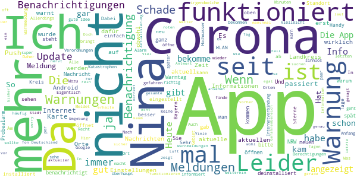

# NINA - Die Warn-App des BBK
App version ``3.3.0.2980``

Analyzed with [covid-apps-observer](http://github.com/covid-apps-observer) project, version ``0.1``

## App overview
| | |
|-------------------------|-------------------------| 
| **Name**&nbsp;&nbsp;&nbsp;&nbsp;&nbsp;&nbsp;&nbsp;&nbsp;&nbsp;&nbsp;&nbsp;&nbsp;&nbsp;&nbsp;&nbsp;&nbsp;&nbsp;&nbsp;&nbsp;&nbsp;&nbsp;&nbsp;&nbsp;&nbsp;&nbsp;&nbsp;&nbsp;&nbsp;&nbsp;&nbsp;&nbsp;&nbsp;&nbsp;&nbsp;&nbsp;&nbsp;&nbsp;&nbsp;&nbsp;&nbsp;  | NINA - Die Warn-App des BBK |
| **Unique identifier** | de.materna.bbk.mobile.app |
| **Link to Google Play** | [https://play.google.com/store/apps/details?id=de.materna.bbk.mobile.app](https://play.google.com/store/apps/details?id=de.materna.bbk.mobile.app) |
| **Summary**  | Die Notfall-Informations- und Nachrichten-App des BBK |
| **Privacy policy** | [http://www.bbk.bund.de/NINA-Datenschutz](http://www.bbk.bund.de/NINA-Datenschutz) |
| **Latest version** | 3.3.0.2980 |
| **Last update** | 2020-12-14 11:02:57 |
| **Recent changes** | Mit der Version 3.3.1 wird Android 6 oder höher benötigt  - Jeder abonnierte Ort enthält nun zusätzlich Informationen zu lokalen Corona-Regelungen auf Kreisebene - Die Warn-App kann ab jetzt in den Sprachen: Deutsch, Deutsch (Leichte Sprache), Englisch, Französisch, Polnisch, Russisch, Spanisch, Türkisch und Arabisch genutzt werden - Mit der neuen Sortierfunktion können Warnmeldungen innerhalb einer Ortskachel neu angeordnet werden |
| **Installs**  | 1.000.000+ |
| **Category** | Nachrichten & Zeitschriften |
| **First release** | 22.05.2015 |
| **Size**  | 28M |
| **Supported Android version**  | 6.0 oder höher |

### Description
> Die Warn-App NINA (Notfall-Informations- und Nachrichten-App) warnt Sie deutschlandweit vor Gefahren, auf Wunsch auch für Ihren aktuellen Standort. Die App wird vom Bundesamt für Bevölkerungsschutz und Katastrophenhilfe (BBK) bereitgestellt.
 Technischer Ausgangspunkt für NINA ist das modulare Warnsystem des Bundes (MoWaS). Dieses wird vom BBK für bundesweite Warnungen des Zivilschutzes betrieben. Seit 2013 können auch alle Lagezentren der Länder und viele bereits angeschlossenen Leitstellen von Städten und Kommunen das Warnsystem nutzen (http://www.bbk.bund.de/DE/NINA/Warnung/Warnung.html). 
 <b>Hinweis: nicht überall sind auch Warnmeldungen zu lokalen Ereignissen erhältlich. Bitte informieren Sie sich bei Ihrem Landkreis oder Ihrer Stadt, welche Möglichkeiten zur Warnung der Bevölkerung dort eingesetzt werden.</b>
 Mit NINA erhalten Sie:
 •	Warnmeldungen des Bevölkerungsschutzes mit Handlungsempfehlungen 
 •	Wetterwarnungen des DWD (deutschlandweit für alle Landkreis und Städte)
 •	Hochwasserinformationen (deutschlandweit auf Bundeslandebene)
 •	allgemeine Notfalltipps, damit Sie sich und andere vor möglichen Gefahren schützen können.
 Mit NINA können Sie Orte auswählen, für die Sie Warnmeldungen erhalten möchten. Diese werden in der Übersicht „Meine Orte“ angezeigt. Im Einstellungsmenü können Sie festlegen, bei welcher Warnstufe Sie per Push-Benachrichtigung informiert werden sollen. Optional können Sie auch Warnmeldungen für Ihren aktuellen Standort erhalten. Dabei werden keine Standortdaten auf unseren Servern gespeichert. Bitte beachten Sie: Um standortbezogene Warnungen korrekt darstellen zu können, muss NINA Ihren Standort bestimmen können. Bei schlechtem Empfang kann es zu fehlerhaften Anzeigen kommen.
 Das Gefahrengebiet einer Warnmeldung kann in der Kartenansicht angezeigt werden. Die Hochwasserinformationen werden aktuell nur auf Bundeslandebene herausgegeben. In der Karte werden alle vorliegenden Warnmeldungen angezeigt, auch wenn Sie den Ort nicht ausgewählt haben.
 Die Notfalltipps enthalten Empfehlungen zu Themen wie Hochwasser, Unwetter, Stromausfall, Feuer und besondere Gefahrenlagen. Informieren Sie sich, wie Sie sich auf solche Ereignisse vorbereiten können. Ebenso finden Sie Verhaltenshinweise für den Fall, dass Sie von einem Ereignis betroffen sind. Mit den praktischen Checklisten können Sie gleich loslegen.
 Hinweise zu den Berechtigungen in der App:
 Zugriff auf den Speicher (Android 8 und höher): Die Warn-App NINA bietet die Möglichkeit den bekannten Sirenenton auf das Smartphone zu kopieren. Um dieses kopieren zu ermöglichen wird diese Berechtigung benötigt. Nach dem Abschluss des Kopiervorgang kann die Berechtigung wieder entfernt werden. Für eine Funktion der Warn-App ist die Berechtigung nicht erforderlich.
 Eigener Standort: Warnmeldungen für Ihren aktuellen Standort sind nur bei Nutzung von GPS, WLAN und anderen Geolokalisierungsdiensten möglich. Haben Sie diese Dienste auf Ihrem Gerät deaktiviert, können Sie keine standortbezogenen Warnmeldungen erhalten.
 Sie haben Fragen zur Warn-App NINA oder möchten uns Ihr Feedback geben? Dann wenden Sie sich bitte an nina@bbk.bund.de. Weitere Informationen erhalten Sie auch unter http://www.bbk.bund.de/NINA.
 Wichtig:
 Warnungen und Informationen können Sie nur mit einer Datenverbindung (per WLAN oder mobil) empfangen. Verfügt Ihr Gerät über keine Datenverbindung, wird der letzte auf dem Gerät gespeicherte Stand angezeigt.

### User interface
The developers of the app provide the following screenshots in the Google play store.
| | | |
|:-------------------------:|:-------------------------:|:-------------------------:|
 |   |   |   | 
 |   |   |   | 
 |   |   |   | 
 |   |   |   | 
 |   |   |   | 
 |   |   |   | 

## Development team
In the following we report the main information provided by the development team in the Google play store.

| | |
|-------------------------|-------------------------|
| **Developer**  | Bundesamt für Bevölkerungsschutz (Deutschland) |
| **Website**  | [http://www.bbk.bund.de/DE/NINA/Warn-App_NINA_node.html](http://www.bbk.bund.de/DE/NINA/Warn-App_NINA_node.html) |
| **Email** | nina@bbk.bund.de |
| **Physical address**  | [Provinzialstr. 93 53127 Bonn](https://www.google.com/maps/search/Provinzialstr.%2093%2053127%20Bonn) (Google Maps) |
| **Other developed apps**  | [https://play.google.com/store/apps/developer?id=Bundesamt+f%C3%BCr+Bev%C3%B6lkerungsschutz+(Deutschland)](https://play.google.com/store/apps/developer?id=Bundesamt+f%C3%BCr+Bev%C3%B6lkerungsschutz+(Deutschland)) |

## Android support

| | |
|-------------------------|-------------------------|
| **Declared target Android version**  | - |
| **Effective target Android version**  | - |
| **Minimum supported Android version**  | Marshmallow, version 6.0 (API level 23) |
| **Maximum target Android version**  | - |

The larger the difference between the minimum and maximum supported Android versions, the better. A larger difference means a wider audience. For example, old phones have a very low Android version, so a high minimum supported Android version means that the app cannot be used by users with old phones, thus leading to accessibility problems. 

## Requested permissions

In the following we report the complete list of the permissions requested by the app. 

| **Permission** | **Protection level** | **Description** | 
|-------------------------|-------------------------|-------------------------|
 **android.permission ACCESS_BACKGROUND_LOCATION** | :warning:**Dangerous** | Allows an app to access location in the background. 
 **android.permission ACCESS_COARSE_LOCATION** | :warning:**Dangerous** | Allows an app to access approximate location. 
 **android.permission ACCESS_FINE_LOCATION** | :warning:**Dangerous** | Allows an app to access precise location. 
 **android.permission ACCESS_NETWORK_STATE** | Normal | Allows applications to access information about networks. 
 **android.permission ACCESS_WIFI_STATE** | Normal | Allows applications to access information about Wi-Fi networks. 
 **android.permission FOREGROUND_SERVICE** | Normal | Allows a regular application to use Service.startForeground. 
 **android.permission INTERNET** | Normal | Allows applications to open network sockets. 
 **android.permission REQUEST_IGNORE_BATTERY_OPTIMIZATIONS** | Normal | Permission an application must hold in order to use Settings.ACTION_REQUEST_IGNORE_BATTERY_OPTIMIZATIONS. 
 **android.permission VIBRATE** | Normal | Allows access to the vibrator. 
 **android.permission WAKE_LOCK** | Normal | Allows using PowerManager WakeLocks to keep processor from sleeping or screen from dimming. 
 **android.permission WRITE_EXTERNAL_STORAGE** | :warning:**Dangerous** | Allows an application to write to external storage. 
 **com.google.android.c2dm.permission RECEIVE** | - | - 
 **com.google.android.finsky.permission BIND_GET_INSTALL_REFERRER_SERVICE** | - | - 

## Mentioned servers

| **Server** | **Registrant** | **Registrant country** | **Creation date** | 
|-------------------------|-------------------------|-------------------------|-------------------------|
 | google.com | Google LLC | :us: US | 1997-09-15 04:00:00 |
 | app-measurement.com | Google LLC | :us: US | 2015-06-19 20:13:31 |
 | googleapis.com | Google LLC | :us: US | 2005-01-25 17:52:26 |
 | googlesyndication.com | Google LLC | :us: US | 2003-01-21 06:17:24 |
 | crashlytics.com | Google LLC | :us: US | 2011-01-21 15:30:40 |
 | googleadservices.com | Google LLC | :us: US | 2003-06-19 16:34:53 |

## Security analysis 

Below we report the main security warnings raised by our execution of the [Androwarn](https://github.com/maaaaz/androwarn) security analysis tool.

**Connection interfaces exfiltration**
> - This application reads details about the currently active data network 

**Suspicious connection establishment**
> - This application opens a Socket and connects it to the remote address ' returned no addresses for  ; port is out of range' on the 'N/A' port  
> - This application opens a Socket and connects it to the remote address '' on the 'N/A' port  
> - This application opens a Socket and connects it to the remote address 'Ljava/net/Proxy;->type()Ljava/net/Proxy$Type;' on the 'N/A' port  
> - This application opens a Socket and connects it to the remote address 'timeout' on the 'N/A' port  

**Code execution**
> - This application loads a native library: 'crashlytics' 
> - This application executes a UNIX command containing this argument: 'logcat -b main -d' 

## User ratings and reviews

Below we provide information about how end users are reacting to the app in terms of ratings and reviews in the Google Play store.

### Ratings

The NINA - Die Warn-App des BBK app has been installed by more than **1000000** times. At this time, **18510** rated the app and its average score is **2.6833246**. Below we show the distribution of the ratings across the usual star-based rating of Google Play

:star::star::star::star::star:: 4995

:star::star::star::star:: 1850

:star::star::star:: 1976

:star::star:: 1675

:star:: 8014

### Reviews 

#### 5-star reviews

> Alles top  :date: __2021-01-23 00:55:47__

> ♥️♥️Super App (Update 0.3 = 7.1.21) = ⚠️Ständiges Dauerladen, trotz 100% Internet-Verbindung. Update 0.3.1 (13.1.21) = Früheres Problem: Habe die Push Nachrichten erhalten, aber wenn ich direkt in die App hineingehen wollte, da ging gar nichts!! Update 0.3.2 (18.1.21) = Wdh. Problem!! Update 0.3.3 (22.1.21) = Der Standort kann nicht geladen werden. Die App funktioniert zu 100% nicht mehr. Optimieren Sie bitte komplett ihre App!!  :date: __2021-01-22 22:04:09__

> Is ganz nützlich  :date: __2021-01-22 15:33:57__

> *Vor Maik Thiele Dreme Anhalt *  :date: __2021-01-22 11:59:05__

> Gut  :date: __2021-01-22 08:06:35__

> ist sicherlich weiter zu empfehlen.  :date: __2021-01-21 22:08:49__

> Voll gut 👍  :date: __2021-01-21 09:10:32__

> Sehr gut diese App.  :date: __2021-01-20 20:14:20__

> Super, gerade auch während der Corona-Pandemie. Hat stets die aktuellen Regelungen für den eigenen Standort 👍  :date: __2021-01-19 22:25:39__

> Sollte man in der heutigen Zeit auf dem Handy oder Tablet haben.  :date: __2021-01-16 08:18:33__

#### 4-star reviews

> Die App macht was sie verspricht. Bin zufrieden.  :date: __2021-01-19 08:49:11__

> Keine Warnungen und keine Aktualisierung mehr!! Nur der Kreisel der eine laufende Aktualisierung anzeigt aber nie zum Abschluss kommt. Ich habe die App heute deinstalliert und wieder neu installiert. Keine Besserung. Also ab sofort leider nutzlos. UPDATE: Dank schneller Reaktion des Supports mit entsprechendem Hinweis konnte mein Problem mit NINA gelöst werden.  :date: __2021-01-18 19:21:38__

> Im BBK weht seit dem Führungswechsel jetzt offensichtlich ein frischer Wind, NINA funtioniert bei mir wieder. Bitte auch die 15-km-Grenzen mit einarbeiten und statt Google Maps dafür das freie Open Street Maps verwenden! Und endlich auch zwingend Cellbroadcast (EU-Alert) unterstützen für alle, die kein Smartphone besitzen!  :date: __2021-01-17 10:47:25__

> Richtig gute App  :date: __2021-01-17 09:44:47__

> Ja, beim Probealarm im letzten Herbst hat die App, wie auch alle örtlichen Warnsysteme und Sirenen komplett versagt. Aber die Corona news sind hundertprozentig besser als die der Corona App. Dafür gäbe es glatt 5 Sterne 🌟  :date: __2021-01-12 07:51:28__

> Bietet viel Potential ist aber noch nicht wirklich zuverlässig.  :date: __2021-01-08 23:55:14__

> Eigentlich ganz gute App, auf zwei Handys getestet und funktioniert einwandfrei. Aber Viren, Wetter oder Massenvernichtungswaffen etc. geben nicht viel auf Linien von Landkarten. Daher sollte man unbedingt alle an Deutschland angrenzenden Länder einbinden!  :date: __2021-01-06 15:08:58__

> ganz gut und brauchbar.. mittlerweile ist der Nutzwert der App deutlich gestiegen, insbesondere zwecks Info über Corona und andere Katastrophen  :date: __2021-01-06 15:06:45__

> Informativ!  :date: __2021-01-05 15:33:18__

> Erfasst leider nicht alle Informationen zu den Corona-Beschränkungen. Zum Beispiel wurde die Ausgangssperre zw. 20 und 5 Uhr in Baden-Württemberg nicht erfasst.  :date: __2021-01-01 15:12:16__

#### 3-star reviews

> Ich habe nicht wirklich Ahnung von Nina  :date: __2021-01-22 00:51:57__

> Ich bin nicht sonderlich begeistert darüber, in letzter Zeit mehrfach Pressemitteilungen zu lesen, statt vor Gefahren gewarnt zu werden. Die Aufgabe einer Warn-App ist m.E. nicht, Verlautbarungen der Bundeskanzlerin oder andere Nachrichten ohne direkten Warnwert zu streuen, schon gar nicht zu nachtschlafender Zeit. Eine Einstellung, dies zu verhindern, habe ich nicht gefunden. Ich bin mir sehr sicher, dass dieses Vorgehen der Akzeptanz der App nicht hilft.  :date: __2021-01-21 16:02:24__

> Habe die App runtergeladen weil es auf der Webseite der Bundesregierung hieß, dass ich dort alle Regeln zu Corona angezeigt bekommen würde. In der App sind tatsächlich auch all die umfangreichen und unübersichtlichen Beschlüsse aufgelistet aber keine einzige Übersicht die mir in kurzer Zeit verrät was ich aktuell beachten muss. Ich suche mir die Infos dann weiterhin selbst zusammen und versuche den Überblick zu behalten.  :date: __2021-01-21 09:17:22__

> Zu kompliziert 😢  :date: __2021-01-19 20:21:51__

> Es wäre wichtig zu wissen, dass NINA ebenso wie die Corona Warnapp auf die GOOGLE PLAY DIENSTE angewiesen ist. Vllt könnte man darauf besser mal an prominenter Stelle hinweisen.  :date: __2021-01-17 11:32:23__

> Die app wird Stück für Stück besser. Aber leider kommen die Benachrichtigungen noch sehr verzögert im Vergleich zu katwarn. Kleiner Tipp: vielleicht sollten sie die Kategorie Notfalltipps (und andere) so programmieren, dass sie auch im offline Modus verfügbar ist? Dass es überhaupt einen offline Modus gibt ist ja schon mal sehr gut... Aber bisher ohne erkennbaren Mehrwert.  :date: __2021-01-15 16:31:56__

> Heute kam mal wieder eine Meldung nach langer Zeit, für die kleinen Bereiche scheint zu klappen. Nach dem Löschen der letzten neuen Meldung ist das Badgesymbol weg. Nur die alte Coronameldung macht dem Symbol nichts.Corona da, Badgesymbol weg. Seltsam scheint die unterschiedliche Behandlung. Sorry, da ist nichts in der App zum nach unten wischen😩 Jetzt einen Tag später, kam Meldung nochmal und kann zur Seite weggewischt werden und das Badgesymbol ist weg.🤔  :date: __2021-01-13 13:30:27__

> Einen Stern Abzug, weil ich mir etwas mehr Selektiermöglichkeiten der Art der Benachrichtigungen auf bestimmte Zonen und nicht nur Landkreise/Städte wünschen würde. In einer riesigen Großstadt/Stadtstaat ist halt nicht alles was am anderen Ende der Stadt passiert wirklich für die eigene Zone interessant, für mich vibriert das Handy nur unnötig jede halbe Stunde. Ein weiterer Stern für das Probetag Disaster. Diesen Stern gibt es zurück, sobald sich da Verbesserung bewiesen hat.  :date: __2021-01-13 08:49:12__

> Die App hat täglich Probleme mit der Standortanalyse. Das kenne ich von vorher nicht.  :date: __2021-01-13 05:29:23__

> grundsätzlich gute app, aber warum kann man bei Bevölkerungsschutzwarnungen nicht Vibration deaktivieren?  :date: __2021-01-13 04:28:44__

#### 2-star reviews

> Trotz aktuellem Update, kommen keine aktuellen Informationen, letzte Meldung war 14.10.2020, Warum? Daher ist die App nicht zu gebrauche.  :date: __2021-01-14 10:22:11__

> Kein Mensch braucht eine "Katastrophen-" App die einen mit Warnungen vor Blitzeis und betrügerischen Anrufen zuspammt.  :date: __2021-01-12 23:38:24__

> Recht untätige App wie ich finde. Hier könnte man soviel an Informationen bündeln aber das ist vielleicht gar nicht so sehr erwünscht!  :date: __2021-01-09 23:45:12__

> Noch verbesserungswürdig bei gutem Ansatz.  :date: __2021-01-09 18:44:53__

> Habe die App unter anderem damit ich aktuelle Coronaregeln habe. Heute (8.1.) Steht da immer noch Treffen von 5 Personen möglich. Stimmt doch gar nicht. Also nicht aktuell....überflüssig.  :date: __2021-01-08 20:58:06__

> Nach Handywechsel und somit Update habe ich leider immer nur noch einen aktuellen Standort. Blöd, denn ich bräuchte auch die aktuellen Warnmeldung der umliegenden Orte. Klappt leider nicht mehr. Ich bitte um Nachbesserung der App, denn früher konnte man die Orte in einer Liste eintragen.  :date: __2021-01-07 22:31:57__

> Seit Wochen keine Aktualisierung der Corona regeln, diese haben jeden mehrfach geändert im Laufe der der letzten Wochen.  :date: __2021-01-07 11:25:25__

> Seit dem neusten Update zeigt die App keine neuen Informationen mehr an. Die letzten die ich bekam, zum Thema Corona, waren im Oktober des letzten Jahres.  :date: __2021-01-05 11:17:06__

> Eben war in Mönchengladbach probealarm, habe keine Benachrichtigung bekommen.  :date: __2021-01-02 11:16:38__

> Zuerst musste ich die App öffnen, um eine Warnung zu bekommen Nun läd die App bei 5x öffnen 4xnicht, weil angeblich kein Internet zur Verfügung steht, alle anderen Apps und der Browser können aber 1A auf das Internet zugreifen  :date: __2020-12-30 18:51:11__

#### 1-star reviews

> Nicht hilfreich. Die Corona-Regeln sind unvollständig. Zur Ausgangssperre findet man zum Beispiel nichts.  :date: __2021-01-22 10:30:23__

> Warum wird die App nicht auf den neusten Stand gebracht , bzgl der neuen Corona Regeln. Steht immer noch das Alte  :date: __2021-01-22 05:09:48__

> Funktioniert nicht mehr, lädt nur aber zeigt nix an. Mi Note 10 Pro mit Android 11.  :date: __2021-01-21 21:33:50__

> Keine Push-Warnungen, dafür ist die App doch da  :date: __2021-01-21 19:09:53__

> Die app mag ja äußerst sinnvoll sein(ohne Frage!)aber Tipps die man über die app auf's Handy bekommt sind so schön klein abgedruckt,daß man die texte nicht mal mit einer Lupe lesen kann!!Wenn dann die Vergrößerung übers Lupensymbol auch noch kleiner ist wie die vorherige Version dann taugt die ganze Info nichts!!Dabei wollte ich doch nur lesen,zu welcher Gruppe ich gehöre+wann ich vielleicht mal dran denken könnte,mir von irgend woher einen impftermin zu besorgen.  :date: __2021-01-21 17:02:05__

> Auf Android 10/11 ohne die proprietären Google Play Services nicht ausführbar. Closed Source und die Abhängigkeit zu Google Play-Diensten ist bei durch Steuern finanzierten Apps von Bundesbehörden absolut inakzeptabel. Darüber hinaus werden hierdurch und aus technischer Sicht völlig unnötigerweise viele Nutzer ausgeschlossen. Sollte nicht eine größtmögliche Reichweite bei dieser App ein besonderes Interesse des BBK sein?  :date: __2021-01-21 14:45:40__

> Heute Sturm in NRW, App hat nicht gewarnt. Vermutlich derselbe Planer welcher auch für den Berliner Flughafen verantwortlich war.  :date: __2021-01-21 13:44:53__

> Diese app war einmal echt klasse und von Update zu Update wurde sie immer schlechter und man bekommt keine Meldungen mehr und keine Erneurungen von covid 19 ... Wenn es sich nichts ändert wird diese app gelöscht  :date: __2021-01-21 11:56:07__

> Also Warnung vor Corona muss sein, sehe ich auch ein... aber was ist mit dem Sturmtief das heute hier lang gezogen ist? wieso gibt es für Wetter bzw. Unwetter keine Warnung mehr? Ist doch Mist  :date: __2021-01-21 11:50:27__

> Seit längerer Zeit funktioniert die Benachrichtigung der App nicht mehr. Schade eigentlich. Hat ja noch gut funktioniert vor ein paar Monaten. Fehler konnte wohl bis dato nicht behoben werden  :date: __2021-01-21 10:17:41__

