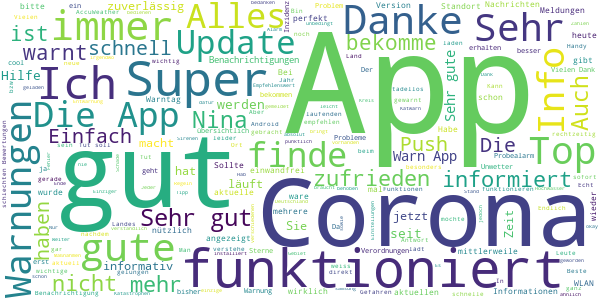
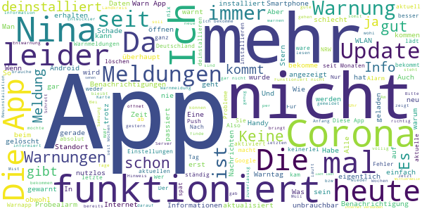

# NINA - Die Warn-App des BBK
App version ``3.3.0.2980``

Analyzed with [covid-apps-observer](http://github.com/covid-apps-observer) project, version ``0.1``

## App overview
| | |
|-------------------------|-------------------------| 
| **Name**&nbsp;&nbsp;&nbsp;&nbsp;&nbsp;&nbsp;&nbsp;&nbsp;&nbsp;&nbsp;&nbsp;&nbsp;&nbsp;&nbsp;&nbsp;&nbsp;&nbsp;&nbsp;&nbsp;&nbsp;&nbsp;&nbsp;&nbsp;&nbsp;&nbsp;&nbsp;&nbsp;&nbsp;&nbsp;&nbsp;&nbsp;&nbsp;&nbsp;&nbsp;&nbsp;&nbsp;&nbsp;&nbsp;&nbsp;&nbsp;  | NINA - Die Warn-App des BBK |
| **Unique identifier** | de.materna.bbk.mobile.app |
| **Link to Google Play** | [https://play.google.com/store/apps/details?id=de.materna.bbk.mobile.app](https://play.google.com/store/apps/details?id=de.materna.bbk.mobile.app) |
| **Summary**  | Die Notfall-Informations- und Nachrichten-App des BBK |
| **Privacy policy** | [http://www.bbk.bund.de/NINA-Datenschutz](http://www.bbk.bund.de/NINA-Datenschutz) |
| **Latest version** | 3.3.0.2980 |
| **Last update** | 2020-12-14 11:02:57 |
| **Recent changes** | Mit der Version 3.3.1 wird Android 6 oder höher benötigt  - Jeder abonnierte Ort enthält nun zusätzlich Informationen zu lokalen Corona-Regelungen auf Kreisebene - Die Warn-App kann ab jetzt in den Sprachen: Deutsch, Deutsch (Leichte Sprache), Englisch, Französisch, Polnisch, Russisch, Spanisch, Türkisch und Arabisch genutzt werden - Mit der neuen Sortierfunktion können Warnmeldungen innerhalb einer Ortskachel neu angeordnet werden |
| **Installs**  | 1.000.000+ |
| **Category** | Nachrichten & Zeitschriften |
| **First release** | 22.05.2015 |
| **Size**  | 28M |
| **Supported Android version**  | 6.0 oder höher |

### Description
> Die Warn-App NINA (Notfall-Informations- und Nachrichten-App) warnt Sie deutschlandweit vor Gefahren, auf Wunsch auch für Ihren aktuellen Standort. Die App wird vom Bundesamt für Bevölkerungsschutz und Katastrophenhilfe (BBK) bereitgestellt.
 Technischer Ausgangspunkt für NINA ist das modulare Warnsystem des Bundes (MoWaS). Dieses wird vom BBK für bundesweite Warnungen des Zivilschutzes betrieben. Seit 2013 können auch alle Lagezentren der Länder und viele bereits angeschlossenen Leitstellen von Städten und Kommunen das Warnsystem nutzen (http://www.bbk.bund.de/DE/NINA/Warnung/Warnung.html). 
 <b>Hinweis: nicht überall sind auch Warnmeldungen zu lokalen Ereignissen erhältlich. Bitte informieren Sie sich bei Ihrem Landkreis oder Ihrer Stadt, welche Möglichkeiten zur Warnung der Bevölkerung dort eingesetzt werden.</b>
 Mit NINA erhalten Sie:
 •	Warnmeldungen des Bevölkerungsschutzes mit Handlungsempfehlungen 
 •	Wetterwarnungen des DWD (deutschlandweit für alle Landkreis und Städte)
 •	Hochwasserinformationen (deutschlandweit auf Bundeslandebene)
 •	allgemeine Notfalltipps, damit Sie sich und andere vor möglichen Gefahren schützen können.
 Mit NINA können Sie Orte auswählen, für die Sie Warnmeldungen erhalten möchten. Diese werden in der Übersicht „Meine Orte“ angezeigt. Im Einstellungsmenü können Sie festlegen, bei welcher Warnstufe Sie per Push-Benachrichtigung informiert werden sollen. Optional können Sie auch Warnmeldungen für Ihren aktuellen Standort erhalten. Dabei werden keine Standortdaten auf unseren Servern gespeichert. Bitte beachten Sie: Um standortbezogene Warnungen korrekt darstellen zu können, muss NINA Ihren Standort bestimmen können. Bei schlechtem Empfang kann es zu fehlerhaften Anzeigen kommen.
 Das Gefahrengebiet einer Warnmeldung kann in der Kartenansicht angezeigt werden. Die Hochwasserinformationen werden aktuell nur auf Bundeslandebene herausgegeben. In der Karte werden alle vorliegenden Warnmeldungen angezeigt, auch wenn Sie den Ort nicht ausgewählt haben.
 Die Notfalltipps enthalten Empfehlungen zu Themen wie Hochwasser, Unwetter, Stromausfall, Feuer und besondere Gefahrenlagen. Informieren Sie sich, wie Sie sich auf solche Ereignisse vorbereiten können. Ebenso finden Sie Verhaltenshinweise für den Fall, dass Sie von einem Ereignis betroffen sind. Mit den praktischen Checklisten können Sie gleich loslegen.
 Hinweise zu den Berechtigungen in der App:
 Zugriff auf den Speicher (Android 8 und höher): Die Warn-App NINA bietet die Möglichkeit den bekannten Sirenenton auf das Smartphone zu kopieren. Um dieses kopieren zu ermöglichen wird diese Berechtigung benötigt. Nach dem Abschluss des Kopiervorgang kann die Berechtigung wieder entfernt werden. Für eine Funktion der Warn-App ist die Berechtigung nicht erforderlich.
 Eigener Standort: Warnmeldungen für Ihren aktuellen Standort sind nur bei Nutzung von GPS, WLAN und anderen Geolokalisierungsdiensten möglich. Haben Sie diese Dienste auf Ihrem Gerät deaktiviert, können Sie keine standortbezogenen Warnmeldungen erhalten.
 Sie haben Fragen zur Warn-App NINA oder möchten uns Ihr Feedback geben? Dann wenden Sie sich bitte an nina@bbk.bund.de. Weitere Informationen erhalten Sie auch unter http://www.bbk.bund.de/NINA.
 Wichtig:
 Warnungen und Informationen können Sie nur mit einer Datenverbindung (per WLAN oder mobil) empfangen. Verfügt Ihr Gerät über keine Datenverbindung, wird der letzte auf dem Gerät gespeicherte Stand angezeigt.

### User interface
The developers of the app provide the following screenshots in the Google play store.
| | | |
|:-------------------------:|:-------------------------:|:-------------------------:|
 |   |   |   | 
 |   |   |   | 
 |   |   |   | 
 |   |   |   | 
 |   |   |   | 
 |   |   |   | 

## Development team
In the following we report the main information provided by the development team in the Google play store.

| | |
|-------------------------|-------------------------|
| **Developer**  | Bundesamt für Bevölkerungsschutz (Deutschland) |
| **Website**  | [http://www.bbk.bund.de/DE/NINA/Warn-App_NINA_node.html](http://www.bbk.bund.de/DE/NINA/Warn-App_NINA_node.html) |
| **Email** | nina@bbk.bund.de |
| **Physical address**  | [Provinzialstr. 93 53127 Bonn](https://www.google.com/maps/search/Provinzialstr.%2093%2053127%20Bonn) (Google Maps) |
| **Other developed apps**  | [https://play.google.com/store/apps/developer?id=Bundesamt+f%C3%BCr+Bev%C3%B6lkerungsschutz+(Deutschland)](https://play.google.com/store/apps/developer?id=Bundesamt+f%C3%BCr+Bev%C3%B6lkerungsschutz+(Deutschland)) |

## Android support

| | |
|-------------------------|-------------------------|
| **Declared target Android version**  | - |
| **Effective target Android version**  | - |
| **Minimum supported Android version**  | Marshmallow, version 6.0 (API level 23) |
| **Maximum target Android version**  | - |

The larger the difference between the minimum and maximum supported Android versions, the better. A larger difference means a wider audience. For example, old phones have a very low Android version, so a high minimum supported Android version means that the app cannot be used by users with old phones, thus leading to accessibility problems. 

## Requested permissions

In the following we report the complete list of the permissions requested by the app. 

| **Permission** | **Protection level** | **Description** | 
|-------------------------|-------------------------|-------------------------|
 **android.permission ACCESS_BACKGROUND_LOCATION** | :warning:**Dangerous** | Allows an app to access location in the background. 
 **android.permission ACCESS_COARSE_LOCATION** | :warning:**Dangerous** | Allows an app to access approximate location. 
 **android.permission ACCESS_FINE_LOCATION** | :warning:**Dangerous** | Allows an app to access precise location. 
 **android.permission ACCESS_NETWORK_STATE** | Normal | Allows applications to access information about networks. 
 **android.permission ACCESS_WIFI_STATE** | Normal | Allows applications to access information about Wi-Fi networks. 
 **android.permission FOREGROUND_SERVICE** | Normal | Allows a regular application to use Service.startForeground. 
 **android.permission INTERNET** | Normal | Allows applications to open network sockets. 
 **android.permission REQUEST_IGNORE_BATTERY_OPTIMIZATIONS** | Normal | Permission an application must hold in order to use Settings.ACTION_REQUEST_IGNORE_BATTERY_OPTIMIZATIONS. 
 **android.permission VIBRATE** | Normal | Allows access to the vibrator. 
 **android.permission WAKE_LOCK** | Normal | Allows using PowerManager WakeLocks to keep processor from sleeping or screen from dimming. 
 **android.permission WRITE_EXTERNAL_STORAGE** | :warning:**Dangerous** | Allows an application to write to external storage. 
 **com.google.android.c2dm.permission RECEIVE** | - | - 
 **com.google.android.finsky.permission BIND_GET_INSTALL_REFERRER_SERVICE** | - | - 

## Mentioned servers

| **Server** | **Registrant** | **Registrant country** | **Creation date** | 
|-------------------------|-------------------------|-------------------------|-------------------------|
 | google.com | Google LLC | :us: US | 1997-09-15 04:00:00 |
 | app-measurement.com | Google LLC | :us: US | 2015-06-19 20:13:31 |
 | googleapis.com | Google LLC | :us: US | 2005-01-25 17:52:26 |
 | googlesyndication.com | Google LLC | :us: US | 2003-01-21 06:17:24 |
 | crashlytics.com | Google LLC | :us: US | 2011-01-21 15:30:40 |
 | googleadservices.com | Google LLC | :us: US | 2003-06-19 16:34:53 |

## Security analysis 

Below we report the main security warnings raised by our execution of the [Androwarn](https://github.com/maaaaz/androwarn) security analysis tool.

**Connection interfaces exfiltration**
> - This application reads details about the currently active data network 

**Suspicious connection establishment**
> - This application opens a Socket and connects it to the remote address ' returned no addresses for  ; port is out of range' on the 'N/A' port  
> - This application opens a Socket and connects it to the remote address '' on the 'N/A' port  
> - This application opens a Socket and connects it to the remote address 'Ljava/net/Proxy;->type()Ljava/net/Proxy$Type;' on the 'N/A' port  
> - This application opens a Socket and connects it to the remote address 'timeout' on the 'N/A' port  

**Code execution**
> - This application loads a native library: 'crashlytics' 
> - This application executes a UNIX command containing this argument: 'logcat -b main -d' 

## User ratings and reviews

Below we provide information about how end users are reacting to the app in terms of ratings and reviews in the Google Play store.

### Ratings

The NINA - Die Warn-App des BBK app has been installed by more than **1000000** times. At this time, **18510** rated the app and its average score is **2.6833246**. Below we show the distribution of the ratings across the usual star-based rating of Google Play

:star::star::star::star::star:: 4995

:star::star::star::star:: 1850

:star::star::star:: 1976

:star::star:: 1675

:star:: 8014

### Reviews 

#### 5-star reviews

> Sehr informativ  :date: __2021-02-06 19:48:38__

> Alles top  :date: __2021-02-06 18:42:34__

> Gut  :date: __2021-02-06 03:48:38__

> Die App läuft bei mir ohne Probleme! Sehr gute Gliederung der Informationen, was sie leicht verständlich macht. Auch eine gute Entwicklung der App bis jetzt. Cool wäre es noch, wenn man eine Testwarnung durchführen könnte.  :date: __2021-02-05 21:30:24__

> Sehr gut  :date: __2021-02-05 20:39:48__

> Super App. Warnungen werden gemeldet und bei Ende auch. Nur zum empfehlen. 👍🏻  :date: __2021-02-05 17:26:13__

> Hat bisher noch nix angezeigt  :date: __2021-02-05 15:05:13__

> Leider bekomme ich keine Warnungen. Nur, wenn ich die App manuell aufmachen, sehe ich die Meldungen. Ich habe mehrmals meine Einstellungen geprüft und die sind in Ordnung. Echt schade, das die App nicht warnt! Update: Danke für Ihre Hilfe, jetzt funktioniert die App richtig :)  :date: __2021-02-04 11:22:23__

> Echt cool  :date: __2021-02-03 19:54:39__

> update: Seitdem ich die app erst deinstalliert hab, dann nach einiger Zeit direkt ohne WLAN herunter geladen habe, funktionierten die Benachrichtigungen wieder. der Hersteller hatte hier irgendwo diesen Tipp gegeben. (davor; samsung s8 , Android Version 9 app warnt seit einiger Zeit nicht mehr durch Töne bzw Icon in der statusleistr. Bei Öffnen der App sind die Meldungen aber vorhanden. Berechtigungen sind erteilt.)  :date: __2021-02-03 18:12:12__

#### 4-star reviews

> Ist informativ besonders zum Thema Corona. Allerdings habe ich die Sirene wieder abgewählt nachdem ich einen riesen Schrecken bekam als diese losging. Dabei war es nur ne Sturmwarnung.  :date: __2021-02-06 15:39:23__

> Lebswichtig im Leben  :date: __2021-02-04 16:42:22__

> Bekomme die App, nachdem ich sie wegen fehlender Push-Benachrichtigungen deinstalliert habe, nicht mehr auf einem Samsung Galaxy S8+ installiert. Nach mehrmaligen Versuchen - blieb immer wieder hängen - bekam ich die Neuinstallation hin, scheint auch wieder so zu funktionieren wie es soll.  :date: __2021-02-04 11:01:52__

> Derzeit Hochwasser-Nachrichten-Spam, mehrere Meldungen täglich. Es wird immer auf eine NRW-Seite verwiesen mit einem PDF zur Lage, in dem man dann suchen muss, damit man weiß, ob die Info überhaupt relevant ist. ...... Edit: Man kann Hochwasser einzeln abstellen, das hilft zumindest, allerdings ist meine Stadt durchaus genannt, auch wenn mein Ortsteil ein ganzes Stück höher liegt als der Fluss. Also nicht wirklich ideal. Bessere Warnungen kommen dann hoffentlich.  :date: __2021-02-02 18:09:07__

> Tolle App, funktioniert einwandfrei und warnt rechtzeitig. Leider funktioniert die Verwendung des Standortes absolut nicht. Ich habe 3 Städte in 3 Bundesländern hinzugefügt und den Zugriff auf den Standort genehmigt und bekommt dennoch von allen 3 Orten die Meldungen...  :date: __2021-02-01 10:54:47__

> Bin sehr zufrieden. Manchmal etwas verzögert, aber akzeptabel. Corona-Info auch gut. Was fehlt, sind regionale Kennzahlen wie Neuinfektion, Sterbefälle, Inzidenz usw., wäre eine sinnvolle Ergänzung.  :date: __2021-02-01 09:15:17__

> Ich habe die App seit 2 Wochen installiert, nachdem ich eine Doku über Feuerwehreinsätze gesehen habe, in der ein Feuerwehrkommandant die App erwähnt hat. Es hieß, das man über diese App Informationen zum Bevölkerungsschutz bekommt. Bisher kann ich nichts negatives sagen. Funktioniert einwandfrei. Habe mir meinen aktuellen Standort und 2 Gebiete im Norden von Deutschland anzeigen lassen. Funktioniert. Leider kann man die App nicht als Tipp teilen - das wäre noch eine gute Sache.  :date: __2021-01-28 00:10:32__

> Funktioniert oft nicht. Man bekommt eine Warnung und wenn man sie anklickt, dann schaut man dem Ladekringel beim kringeln zu. Jetzt gehen die Links nicht, auf denen man nachlesen soll wie man sich zu verhalten hat. Selbst nach dem Update funktioniert es nicht. Das kostet mich Nerven und der App ihr letztes Sternchen. "Neuland" eben... Vielleicht sollte man doch wieder auf berittene Boten zurück greifen? Update: wieder gut!  :date: __2021-01-27 15:25:26__

> Gut zu wissen.  :date: __2021-01-26 18:51:47__

> Die App macht was sie verspricht. Bin zufrieden.  :date: __2021-01-19 08:49:11__

#### 3-star reviews

> Deinstalliert. Die Idee ist gut aber wenn ich 8mal am Tag über Hochwasser verrückt gemacht werde, obwohl dank GPS die App weiß wo ich bin, nervt das. Vielleicht installiere ich es wieder im Sommer wenn das Hochwasser weg ist.  :date: __2021-02-03 20:20:16__

> Hallo, ich habe die Wlan Verbindung ausgemacht und es geht wieder. Dachte das, es auch über Wlan geht. Falsch gedacht. 😀  :date: __2021-02-02 23:07:31__

> Nach den ich Nina installiert habe zum Sirenenalarm, der nicht klappte , hab ich nun was zur Sturmflutwarnung, Datum Zeit des Hochwassers und wieviel über NN alles nur Xxx. Das ist total unnütz.  :date: __2021-02-01 13:06:42__

> Ist das jetzt eine Kringel-App? Lädt und lädt.  :date: __2021-01-31 18:37:49__

> Ich weiß nicht, ob das wirklich notwendig ist, die Menschen um 2:26 Uhr mit der Warnung aus dem Tiefschlaf reißen, bloß weil es Tauwetter gibt. Oder könnte man mit der Warnung bis zu den Morgenstunden warten? So hat das keinen Sinn. Ich meine, ja, Menschen aus dem Tiefschlaf reißen, wenn das Haus brennen würde. Oder gerade ein Atomreaktor hochgegangen wäre. Aber wegen bisschen Schneeschmelze und paar Tropfen Regen?? Man sollte vielleicht abwägen, ob das jetzt nutzen soll oder eher schaden?  :date: __2021-01-30 02:40:02__

> Push Benachrichtigung funktionieren einfach nicht! WhatsApp und andere Dienste bekommen das doch auch ohne Probleme und vor allem mehrmals am Tag hin. Zusätzlich funktioniert sie dann bei einen Test nicht auf den man sich vorbereiten kann?! Vielleicht sollte man in etwas zuverlässigere Server investieren.  :date: __2021-01-30 00:31:56__

> Funktioniert wieder, aber Informationen sind teilweise falsch. Unter Kontaktbestimmungen steht beispielsweise in NRW 1 Haushalt + 1 Person. Doch das gilt nur für den öffentlichen Bereich, für den privaten Bereich gibt es Empfehlungen, aber keine rechtlichen Vorgaben. Ist das ein Fehler oder bewusste Falschinformation?  :date: __2021-01-29 22:50:49__

> Wie kann man downgraden, damit die App auch mit Android Version 4 noch funktioniert?  :date: __2021-01-24 14:39:41__

> Ich habe nicht wirklich Ahnung von Nina  :date: __2021-01-22 00:51:57__

> Habe die App runtergeladen weil es auf der Webseite der Bundesregierung hieß, dass ich dort alle Regeln zu Corona angezeigt bekommen würde. In der App sind tatsächlich auch all die umfangreichen und unübersichtlichen Beschlüsse aufgelistet aber keine einzige Übersicht die mir in kurzer Zeit verrät was ich aktuell beachten muss. Ich suche mir die Infos dann weiterhin selbst zusammen und versuche den Überblick zu behalten.  :date: __2021-01-21 09:17:22__

#### 2-star reviews

> Ist ja schön das Warnungen wie ein Brand in der Umgebung oder wie jetzt Unwetter angezeigt werden, aber wenn ich keine Warnungen als Pop-up angezeigt bekomme bringt die App nicht viel, da ich nicht ständig rein gucke.. alle Berechtigungen für die App sind gegeben und in der App selbst sind auch alle Einstellungen so das ich eigentlich benachrichtigt werden sollte aber nix passiert... Schade  :date: __2021-02-06 14:39:46__

> Ich kann seit geraumer Zeit Nina nicht nutzen. Wenn ich erhaltene Nachrichten ansehen möchte, funktioniert die App, warum auch immer, nicht. 😒  :date: __2021-02-04 13:41:26__

> Ich tippe auf Karte. Dann wird mir Deutschland mit einer Karte angezeigt, in der verschiedene Regionen in unterschiedlichen roten Farbtönen dargestellt werden. Und jetzt? Was soll das bedeuten? Wo ist die Legende dazu? Klickt man dann auf das Nina Symbol, klappen Symbole auf, die mehr aber eher weniger selbsterklärend sind. Hochwasser ist nur pro Bundesland möglich. Man merkt, dass ein deutsches Amt sein Finger im Spiel hat. Warum seid ihr Beamten nur so inkompetent. 🤦🏻‍♂️  :date: __2021-02-04 12:49:19__

> Die App scheint den angegebenen Ort zu ignorieren und informiert einen über alles mögliche was im Bundesland passiert. Dabei ist es wohl egal, dass ich nur den 9km Radius eingestellt habe. Darüber hinaus sendet es bei jeder noch so kleinen Aktualisierung eine Nachricht, was bei einer Hochwasserwarnung alle fünf Minuten der Fall sein kann!  :date: __2021-02-03 11:28:54__

> Update zur Rückmeldung: Holt die Infos doch einfach per Pull ab sobald es eine Meldung gibt. Machen andere Apps ja auch, siehe "Meine Pegel" des LUBW. Nachrichten verzögert, dafür oft wiederholt. Wieso kann man den Hochwasserpegel für den Hinterlegten Ort nicht direkt einblenden statt auf irgendwelche externen Quellen und PDFs zu verweisen? Merkt keiner der Entwickler, dass das eine miese Usebility ist?  :date: __2021-02-03 11:19:30__

> Alle 4 Stunden Hochwasserwarnung in ganz NRW.. Und das seit einer Woche :D Dan Handy vibriert übertrieben gesagt durch :)  :date: __2021-02-02 11:57:41__

> Eigentlich eine gute Idee, aber Nina wird nicht vernünftig eingesetzt! Anstatt für den Ort, an dem man sich befindet, die gerade gültigen Corona Auflagen anzuzeigen, werden irgendwelche Mitteilung unserer Bundesregierung zur Impfstoffversorgung gemeldet. Sowas hat in einer Gefahrenwarnapp nicht zu suchen, sondern gehört in eine Nachichensendung.  :date: __2021-02-02 08:15:29__

> Die App nervt. Jedesmal bekomme ich gesagt ich habe kein Internet. Das stimmt nicht. Bitte beheben.  :date: __2021-01-29 17:57:31__

> Grundsätzlich ist diese App empfehlenswert, jedoch funktioniert seit einigen Tagen absolut nichts mehr! Ich bekomme Push-Warnneldungen, wenn ich jedoch auf diese tippe lädt die App "stundenlang" ohne jedoch bei den gespeicherten Orten eine Meldung anzuzeigen. Eine Neuinstallation brachte keinen Erfolg.  :date: __2021-01-27 17:51:24__

> Mal wieder wird man nicht benachrichtigt, obwohl alle Berechtigungen erteilt wurden.  :date: __2021-01-26 20:13:10__

#### 1-star reviews

> Update 06.02.2021: habe App wie geraten, de- und wieder installiert. Nun hat Nina dreimal gemeldet, aber beim Seitenaufruf werden lt. Meldung nicht alle Daten geladen, egal um welche Warnungen es geht!! Allerdings wird überhaupt nichts geladen. Beim manuellen Aufruf werden garkeine Meldungen geladen, es ist nur die Deutschlandkarte zu sehen... Schade !! MfG, Fleur  :date: __2021-02-06 15:58:23__

> Die App benachrichtigt einen nicht, man muss die App aufrufen um Infos zu erhalten. Anstehende unwetter warnungen werden in der App sehr spät angezeigt, da ist es sinnvoller Nachrichten zu schauen.  :date: __2021-02-06 13:48:06__

> Die App funktioniert nicht mehr!!!! Warum bekommt man keine Benachrichtigungen mehr???? Der Fehler dauert nun seit Monaten!!! Wann behebt ihr dies????  :date: __2021-02-06 12:00:01__

> Einfach nur schlecht  :date: __2021-02-05 18:15:37__

> Hallo Nina Team... Wie oft soll man den die app eurer Meinung nach deinstallieren? Kann doch nicht sein das man jeden Monat die app neu runter und rauf laden muss damit sie vernünftig funktioniert.... lg.  :date: __2021-02-05 17:31:01__

> Leider funktioniert diese APP seit ich sie auf meinem neuen Smartphone habe, überhaupt nicht mehr. Obwohl ich alle Berechtigungen erteilt habe, habe ich seit Dezember nicht eine einzige Benachrichtigung erhalten. Ich habe sie schon mindestens 5x deinstalliert und neu draufgespielt. Alles war vergebens. Sie funktioniert einfach nicht. Das ist sehr enttäuschend!!! Was taugt eine Warn- APP, wenn sie nicht warnt? Übrigens, mein Mann und einige Bekannte haben sie auch vergebens ausprobiert. Schade!  :date: __2021-02-05 17:07:14__

> Warum kann Ich bei Hochwasserwarnung nicht sehen welcher Fluss gemeint ist? Sondern nur allgemein NRW,aber nicht zum Beispiel die Wupper .  :date: __2021-02-05 13:31:32__

> nicht Barrierefrei - für Menschen mit Sehbehinder, nicht nutzbar. Die Spacherkennung, erfasst einige Schaltflächen / Textfelder nicht. Aufgrund der schwachen Schriftfarbe, kaum lesbar auf dem weißen Hintergrund. Hier wäre ein " dunkel Modus" sehr hilfreich. Das sollte, in der heutigen Zeit, kein Problem darstellen. Hoffe auf Verbesserung. Danke  :date: __2021-02-05 09:36:27__

> Nicht so  :date: __2021-02-05 08:54:15__

> Ich bekomme eine Warnung und dann sieht man nur Ladekringel. Nichts geschieht. Nach dem Kontakt mit dem Support habe ich die App über mobile Daten neu installiert. Momentan funktioniert alles.  :date: __2021-02-04 06:53:21__

