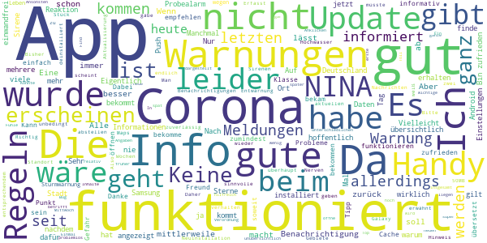

# NINA - Die Warn-App des BBK
App version ``3.3.0.2980``

Analyzed with [covid-apps-observer](http://github.com/covid-apps-observer) project, version ``0.1``

## App overview
| | |
|-------------------------|-------------------------| 
| **Name**&nbsp;&nbsp;&nbsp;&nbsp;&nbsp;&nbsp;&nbsp;&nbsp;&nbsp;&nbsp;&nbsp;&nbsp;&nbsp;&nbsp;&nbsp;&nbsp;&nbsp;&nbsp;&nbsp;&nbsp;&nbsp;&nbsp;&nbsp;&nbsp;&nbsp;&nbsp;&nbsp;&nbsp;&nbsp;&nbsp;&nbsp;&nbsp;&nbsp;&nbsp;&nbsp;&nbsp;&nbsp;&nbsp;&nbsp;&nbsp;  | NINA - Die Warn-App des BBK |
| **Unique identifier** | de.materna.bbk.mobile.app |
| **Link to Google Play** | [https://play.google.com/store/apps/details?id=de.materna.bbk.mobile.app](https://play.google.com/store/apps/details?id=de.materna.bbk.mobile.app) |
| **Summary**  | Die Notfall-Informations- und Nachrichten-App des BBK |
| **Privacy policy** | [http://www.bbk.bund.de/NINA-Datenschutz](http://www.bbk.bund.de/NINA-Datenschutz) |
| **Latest version** | 3.3.0.2980 |
| **Last update** | 2020-12-14 11:02:57 |
| **Recent changes** | Mit der Version 3.3.1 wird Android 6 oder höher benötigt  - Jeder abonnierte Ort enthält nun zusätzlich Informationen zu lokalen Corona-Regelungen auf Kreisebene - Die Warn-App kann ab jetzt in den Sprachen: Deutsch, Deutsch (Leichte Sprache), Englisch, Französisch, Polnisch, Russisch, Spanisch, Türkisch und Arabisch genutzt werden - Mit der neuen Sortierfunktion können Warnmeldungen innerhalb einer Ortskachel neu angeordnet werden |
| **Installs**  | 1.000.000+ |
| **Category** | Nachrichten & Zeitschriften |
| **First release** | 22.05.2015 |
| **Size**  | 28M |
| **Supported Android version**  | 6.0 oder höher |

### Description
> Die Warn-App NINA (Notfall-Informations- und Nachrichten-App) warnt Sie deutschlandweit vor Gefahren, auf Wunsch auch für Ihren aktuellen Standort. Die App wird vom Bundesamt für Bevölkerungsschutz und Katastrophenhilfe (BBK) bereitgestellt.
 Technischer Ausgangspunkt für NINA ist das modulare Warnsystem des Bundes (MoWaS). Dieses wird vom BBK für bundesweite Warnungen des Zivilschutzes betrieben. Seit 2013 können auch alle Lagezentren der Länder und viele bereits angeschlossenen Leitstellen von Städten und Kommunen das Warnsystem nutzen (http://www.bbk.bund.de/DE/NINA/Warnung/Warnung.html). 
 <b>Hinweis: nicht überall sind auch Warnmeldungen zu lokalen Ereignissen erhältlich. Bitte informieren Sie sich bei Ihrem Landkreis oder Ihrer Stadt, welche Möglichkeiten zur Warnung der Bevölkerung dort eingesetzt werden.</b>
 Mit NINA erhalten Sie:
 •	Warnmeldungen des Bevölkerungsschutzes mit Handlungsempfehlungen 
 •	Wetterwarnungen des DWD (deutschlandweit für alle Landkreis und Städte)
 •	Hochwasserinformationen (deutschlandweit auf Bundeslandebene)
 •	allgemeine Notfalltipps, damit Sie sich und andere vor möglichen Gefahren schützen können.
 Mit NINA können Sie Orte auswählen, für die Sie Warnmeldungen erhalten möchten. Diese werden in der Übersicht „Meine Orte“ angezeigt. Im Einstellungsmenü können Sie festlegen, bei welcher Warnstufe Sie per Push-Benachrichtigung informiert werden sollen. Optional können Sie auch Warnmeldungen für Ihren aktuellen Standort erhalten. Dabei werden keine Standortdaten auf unseren Servern gespeichert. Bitte beachten Sie: Um standortbezogene Warnungen korrekt darstellen zu können, muss NINA Ihren Standort bestimmen können. Bei schlechtem Empfang kann es zu fehlerhaften Anzeigen kommen.
 Das Gefahrengebiet einer Warnmeldung kann in der Kartenansicht angezeigt werden. Die Hochwasserinformationen werden aktuell nur auf Bundeslandebene herausgegeben. In der Karte werden alle vorliegenden Warnmeldungen angezeigt, auch wenn Sie den Ort nicht ausgewählt haben.
 Die Notfalltipps enthalten Empfehlungen zu Themen wie Hochwasser, Unwetter, Stromausfall, Feuer und besondere Gefahrenlagen. Informieren Sie sich, wie Sie sich auf solche Ereignisse vorbereiten können. Ebenso finden Sie Verhaltenshinweise für den Fall, dass Sie von einem Ereignis betroffen sind. Mit den praktischen Checklisten können Sie gleich loslegen.
 Hinweise zu den Berechtigungen in der App:
 Zugriff auf den Speicher (Android 8 und höher): Die Warn-App NINA bietet die Möglichkeit den bekannten Sirenenton auf das Smartphone zu kopieren. Um dieses kopieren zu ermöglichen wird diese Berechtigung benötigt. Nach dem Abschluss des Kopiervorgang kann die Berechtigung wieder entfernt werden. Für eine Funktion der Warn-App ist die Berechtigung nicht erforderlich.
 Eigener Standort: Warnmeldungen für Ihren aktuellen Standort sind nur bei Nutzung von GPS, WLAN und anderen Geolokalisierungsdiensten möglich. Haben Sie diese Dienste auf Ihrem Gerät deaktiviert, können Sie keine standortbezogenen Warnmeldungen erhalten.
 Sie haben Fragen zur Warn-App NINA oder möchten uns Ihr Feedback geben? Dann wenden Sie sich bitte an nina@bbk.bund.de. Weitere Informationen erhalten Sie auch unter http://www.bbk.bund.de/NINA.
 Wichtig:
 Warnungen und Informationen können Sie nur mit einer Datenverbindung (per WLAN oder mobil) empfangen. Verfügt Ihr Gerät über keine Datenverbindung, wird der letzte auf dem Gerät gespeicherte Stand angezeigt.

### User interface
The developers of the app provide the following screenshots in the Google play store.
| | | |
|:-------------------------:|:-------------------------:|:-------------------------:|
 |   |   |   | 
 |   |   |   | 
 |   |   |   | 
 |   |   |   | 
 |   |   |   | 
 |   |   |   | 

## Development team
In the following we report the main information provided by the development team in the Google play store.

| | |
|-------------------------|-------------------------|
| **Developer**  | Bundesamt für Bevölkerungsschutz (Deutschland) |
| **Website**  | [http://www.bbk.bund.de/DE/NINA/Warn-App_NINA_node.html](http://www.bbk.bund.de/DE/NINA/Warn-App_NINA_node.html) |
| **Email** | nina@bbk.bund.de |
| **Physical address**  | [Provinzialstr. 93 53127 Bonn](https://www.google.com/maps/search/Provinzialstr.%2093%2053127%20Bonn) (Google Maps) |
| **Other developed apps**  | [https://play.google.com/store/apps/developer?id=Bundesamt+f%C3%BCr+Bev%C3%B6lkerungsschutz+(Deutschland)](https://play.google.com/store/apps/developer?id=Bundesamt+f%C3%BCr+Bev%C3%B6lkerungsschutz+(Deutschland)) |

## Android support

| | |
|-------------------------|-------------------------|
| **Declared target Android version**  | - |
| **Effective target Android version**  | - |
| **Minimum supported Android version**  | Marshmallow, version 6.0 (API level 23) |
| **Maximum target Android version**  | - |

The larger the difference between the minimum and maximum supported Android versions, the better. A larger difference means a wider audience. For example, old phones have a very low Android version, so a high minimum supported Android version means that the app cannot be used by users with old phones, thus leading to accessibility problems. 

## Requested permissions

In the following we report the complete list of the permissions requested by the app. 

| **Permission** | **Protection level** | **Description** | 
|-------------------------|-------------------------|-------------------------|
 **android.permission ACCESS_BACKGROUND_LOCATION** | :warning:**Dangerous** | Allows an app to access location in the background. 
 **android.permission ACCESS_COARSE_LOCATION** | :warning:**Dangerous** | Allows an app to access approximate location. 
 **android.permission ACCESS_FINE_LOCATION** | :warning:**Dangerous** | Allows an app to access precise location. 
 **android.permission ACCESS_NETWORK_STATE** | Normal | Allows applications to access information about networks. 
 **android.permission ACCESS_WIFI_STATE** | Normal | Allows applications to access information about Wi-Fi networks. 
 **android.permission FOREGROUND_SERVICE** | Normal | Allows a regular application to use Service.startForeground. 
 **android.permission INTERNET** | Normal | Allows applications to open network sockets. 
 **android.permission REQUEST_IGNORE_BATTERY_OPTIMIZATIONS** | Normal | Permission an application must hold in order to use Settings.ACTION_REQUEST_IGNORE_BATTERY_OPTIMIZATIONS. 
 **android.permission VIBRATE** | Normal | Allows access to the vibrator. 
 **android.permission WAKE_LOCK** | Normal | Allows using PowerManager WakeLocks to keep processor from sleeping or screen from dimming. 
 **android.permission WRITE_EXTERNAL_STORAGE** | :warning:**Dangerous** | Allows an application to write to external storage. 
 **com.google.android.c2dm.permission RECEIVE** | - | - 
 **com.google.android.finsky.permission BIND_GET_INSTALL_REFERRER_SERVICE** | - | - 

## Mentioned servers

| **Server** | **Registrant** | **Registrant country** | **Creation date** | 
|-------------------------|-------------------------|-------------------------|-------------------------|
 | google.com | Google LLC | :us: US | 1997-09-15 04:00:00 |
 | app-measurement.com | Google LLC | :us: US | 2015-06-19 20:13:31 |
 | googleapis.com | Google LLC | :us: US | 2005-01-25 17:52:26 |
 | googlesyndication.com | Google LLC | :us: US | 2003-01-21 06:17:24 |
 | crashlytics.com | Google LLC | :us: US | 2011-01-21 15:30:40 |
 | googleadservices.com | Google LLC | :us: US | 2003-06-19 16:34:53 |

## Security analysis 

Below we report the main security warnings raised by our execution of the [Androwarn](https://github.com/maaaaz/androwarn) security analysis tool.

**Connection interfaces exfiltration**
> - This application reads details about the currently active data network 

**Suspicious connection establishment**
> - This application opens a Socket and connects it to the remote address ' returned no addresses for  ; port is out of range' on the 'N/A' port  
> - This application opens a Socket and connects it to the remote address '' on the 'N/A' port  
> - This application opens a Socket and connects it to the remote address 'Ljava/net/Proxy;->type()Ljava/net/Proxy$Type;' on the 'N/A' port  
> - This application opens a Socket and connects it to the remote address 'timeout' on the 'N/A' port  

**Code execution**
> - This application loads a native library: 'crashlytics' 
> - This application executes a UNIX command containing this argument: 'logcat -b main -d' 

## User ratings and reviews

Below we provide information about how end users are reacting to the app in terms of ratings and reviews in the Google Play store.

### Ratings

The NINA - Die Warn-App des BBK app has been installed by more than **1000000** times. At this time, **18510** rated the app and its average score is **2.6833246**. Below we show the distribution of the ratings across the usual star-based rating of Google Play

:star::star::star::star::star:: 4995

:star::star::star::star:: 1850

:star::star::star:: 1976

:star::star:: 1675

:star:: 8014

### Reviews 

#### 5-star reviews

> Sehr gute App. Nützlich.  :date: __2021-01-08 00:11:10__

> ♥️♥️Super App (Update 0.3 = 7.1.21) = ⚠️Ständiges Dauerladen, trotz 100% Internet-Verbindung. Bitte mal Überprüfen!! (seit: 4.1.21) Die App ist immer auf dem aktuellsten Stand. Aber was nützt es, wenn man die Infos nicht nachlesen kann?!  :date: __2021-01-07 04:48:37__

> Liebes NINA Warn App Team ein Vorschlag an euch ihr solltet mit den Wetterdienst AccuWeather zusammenarbeiten beide Apps sind Farblich gleich und AccuWeather ist immer noch eine sehr gute und genaue Wetter App . Auch AccuWeather arbeitet mit dem Deutschen Wetterdienst zusammen.  :date: __2021-01-06 21:01:32__

> Top app, alles funktioniert einwandfrei und man ist sofort gewarnt wenn etwas im Ort geschehen ist.  :date: __2021-01-06 12:06:35__

> Funktioniert einwandfrei.  :date: __2021-01-05 19:27:52__

> Super  :date: __2021-01-05 11:37:48__

> Sehr gut  :date: __2021-01-05 10:18:11__

> Julian Gall und  :date: __2021-01-04 14:49:29__

> Sehr gute Hinweise  :date: __2021-01-04 11:14:06__

> Gut  :date: __2021-01-04 08:05:20__

#### 4-star reviews

> Bietet viel Potential ist aber noch nicht wirklich zuverlässig.  :date: __2021-01-08 23:55:14__

> Eigentlich ganz gute App, auf zwei Handys getestet und funktioniert einwandfrei. Aber Viren, Wetter oder Massenvernichtungswaffen etc. geben nicht viel auf Linien von Landkarten. Daher sollte man unbedingt alle an Deutschland angrenzenden Länder einbinden!  :date: __2021-01-06 15:08:58__

> ganz gut und brauchbar.. mittlerweile ist der Nutzwert der App deutlich gestiegen, insbesondere zwecks Info über Corona und andere Katastrophen  :date: __2021-01-06 15:06:45__

> Informativ!  :date: __2021-01-05 15:33:18__

> Erfasst leider nicht alle Informationen zu den Corona-Beschränkungen. Zum Beispiel wurde die Ausgangssperre zw. 20 und 5 Uhr in Baden-Württemberg nicht erfasst.  :date: __2021-01-01 15:12:16__

> Die Entwarnung müsste verändert werden. Wegen Corona lass heute wieder Entwarnung. Doch es wurde überhaupt nichts entwarnt. Das war doch etwas verwirrend.  :date: __2020-12-31 14:37:16__

> Zu großer Speicherverbrauch: Wozu über 50MB Benutzerdaten und 50MB Cache? Coronameldungen machen alles unübersichtlich und so übersieht man die wirklich wichtigen Informationen.  :date: __2020-12-26 18:07:21__

> Find ich recht klasse. Gibt wichtige Infos, geht mir aber nicht auf die Nerven mit überflüssigwm Zeug. Könnte aber zuverlässiger und aktueller sein manchmal  :date: __2020-12-23 12:09:26__

> Alles funktioniert gut. Nur bei den Push-Nachrichten stört mich etwas, dass man nie weiß, für wo die Warnung gilt, wenn man mehrere Regionen hinterlegt hat. Dabei müsste man mit den jetzt schon existieren Infos plus Ortsangabe gut leben können und bräuchte nur zu näheren Infos die App öffnen. Ein kurzer Blick auf Always On Display oder Smartwatch und man wüsste: Sturm Warnung betrifft mich. Augenblicklich muss ich in die App um zu sehen, die Sturmwarnung betrifft meine Eltern.  :date: __2020-12-21 11:49:05__

> In den letzten Wochen sind sehr viele gute Änderungen aufgetaucht. Die Entwicklung geht jetzt in die richtige Richtung.  :date: __2020-12-19 11:46:54__

#### 3-star reviews

> Ausbaufähig  :date: __2021-01-07 12:59:27__

> Prompte Reaktion bei Unstimmigkeiten!  :date: __2021-01-06 10:34:07__

> Hat beim letzten Probealarm überhaupt nicht funktioniert.  :date: __2020-12-28 20:25:12__

> Warum sehe ich die einzelnen Orte nicht mehr , die ich eingegebenen habe? Was interessiert mich der ganze Landkreis! Es heißt immer nur, dass der Ort bereits hinzugefügt wurde aber es wird"nur" der Landkreis angezeigt.  :date: __2020-12-27 08:53:10__

> Grundidee ist mega ABER Meldungen kommen mal oder garned oder viel zu spät. Also wenn man sich auf diese App verlässt bisch heee  :date: __2020-12-22 18:25:45__

> Grundsätzlich eine gute App,aber da ich keine Lust dazu habe ständig und überall "Corona" zu lesen habe ich mich zur Deinstallation der App entschlossen.  :date: __2020-12-21 01:18:34__

> Anja das erste mal nicht funktioniert  :date: __2020-12-18 08:45:44__

> Läuft  :date: __2020-12-16 21:56:17__

> Corona-Warn hat gezeigt, wie man mit open source das Vertrauen der Öffentlichkeit gewinnt. Ganz nebenbei wurde ganz ohne Kosten für den Staat zu verursachen eine Fork erstellt, um weitere Geräte zu unterstützen. Daran sollte sich auch das BBK ein Beispiel nehmen.  :date: __2020-12-15 21:10:21__

> Bei den Corona-Regeln wird durch die Zahlen (1, 2, 3, ...) angezeigt durch WELCHE Verordnung (Kreis, Land, Bund) diese Regel angeordnet wird. Aus meiner Sicht wäre es sinnvoll, diese Zahlen fest zuzuordnen. Derzeit ist es so, dass die Kreisverordnung auf Nummer 1 steht, Land und Bund dann auf 2 und 3. Wenn nun aber kein Bezug auf eine Kreisverordnung besteht, rutschen Landes- und Bundes-Verordnung auf 1 und 2. Das ist verwirrend und sicherlich leicht besser zu machen. Ich bitte darum  :date: __2020-12-14 20:48:53__

#### 2-star reviews

> Noch verbesserungswürdig bei gutem Ansatz.  :date: __2021-01-09 18:44:53__

> Habe die App unter anderem damit ich aktuelle Coronaregeln habe. Heute (8.1.) Steht da immer noch Treffen von 5 Personen möglich. Stimmt doch gar nicht. Also nicht aktuell....überflüssig.  :date: __2021-01-08 20:58:06__

> Nach Handywechsel und somit Update habe ich leider immer nur noch einen aktuellen Standort. Blöd, denn ich bräuchte auch die aktuellen Warnmeldung der umliegenden Orte. Klappt leider nicht mehr. Ich bitte um Nachbesserung der App, denn früher konnte man die Orte in einer Liste eintragen.  :date: __2021-01-07 22:31:57__

> Seit Wochen keine Aktualisierung der Corona regeln, diese haben jeden mehrfach geändert im Laufe der der letzten Wochen.  :date: __2021-01-07 11:25:25__

> Seit dem neusten Update zeigt die App keine neuen Informationen mehr an. Die letzten die ich bekam, zum Thema Corona, waren im Oktober des letzten Jahres.  :date: __2021-01-05 11:17:06__

> Eben war in Mönchengladbach probealarm, habe keine Benachrichtigung bekommen.  :date: __2021-01-02 11:16:38__

> Zuerst musste ich die App öffnen, um eine Warnung zu bekommen Nun läd die App bei 5x öffnen 4xnicht, weil angeblich kein Internet zur Verfügung steht, alle anderen Apps und der Browser können aber 1A auf das Internet zugreifen  :date: __2020-12-30 18:51:11__

> Und Mal wieder lassen sich die Reiter nicht zusammen klappen der Orte, ist alt bekanntes Problem  :date: __2020-12-30 11:39:40__

> Ab heute, den 27.12.2020, sollten offiziell die Anti Corona Impfzentren💉😷 in der Republik ihr Arbeitet aufnehmen. Hier, in der App, stehen diese lokal immer noch nicht in den dafür vorgesehenen Teil. Lediglich ein wager Hinweis dazu ist erwähnt. 👎😡👎😷🖖🏥  :date: __2020-12-27 11:27:28__

> 4 Tage nach Inkrafttreten der aktuellen Rechtsverordnung keine Aktualisierung in der App.  :date: __2020-12-18 22:07:13__

#### 1-star reviews

> Corona, Corona, Corona - aber wenn es Unwetter gibt kommen entweder keine Meldungen oder viel zu Spät. Wenn uns 48 Stunden Schneefall und glatte Straßen bevor stehen könnte da ruhig mal was kommen. Dagen brauche ich keine Meldung mehr dass Sturm heran zieht, wenn der schon längst da ist und ich befürchten muss dass mir das Dach wegfliegt... Ich warte jetzt mal den Monat noch ab, wenn sich nix tut, dann weg. Gibt ja schließlich auch noch Radio... Gruß aus der Nordeifel  :date: __2021-01-08 22:01:05__

> Wo bleiben die neuesten Aktualisierungen ???  :date: __2021-01-08 20:17:10__

> Die Corona-Informationen begrenzen sich auf die allgemeinen Informationstexte von Bund und Land und sind veraltet. Keine Informationen zu den neuen Regeln ab dem 10.01., keine Infos zum lokalen Inzidenzwert obwohl der für die 15 km Regel wichtig wäre. Als Info-Medium zum Thema Corona absolut unbrauchbar, die Webseiten lokaler Radiosender bieten bessere Daten.  :date: __2021-01-08 15:48:06__

> Die App ist ohne Google Dienste nicht lauffähig. Aufgrund von immer mehr US Sanktionen gegen immer mehr Firmen darf sowas nicht passieren.  :date: __2021-01-08 09:25:34__

> Purer Schrott 👎👎 da hab ich Hochwasser in der Hütte, Bakterien oder Seuchen vor dem Haus, und ne Bombe 💣 fliegt mir auf die Rübe, aber die App macht keinen Pfurz 💨 na danke 😂 DEINSTALLIERT 🥱 da vertraue ich lieber auf Medien TV Radio  :date: __2021-01-07 20:37:21__

> Warnmeldungen zu spät. Coronabestimmungen veraltet  :date: __2021-01-07 13:27:12__

> Es kommen schon seit langer Zeit keine Warnmeldungen.  :date: __2021-01-07 11:35:31__

> Keine aktualisierund der Lage. Immer alter stand.  :date: __2021-01-07 07:20:47__

> Kann keine Meldungen mehr Empfangen !  :date: __2021-01-07 00:16:36__

> Update 06.01.20: Nina hat nun sogar Schwierigkeiten, sich zu öffnen... selbst bei manuellen Versuchen = nichts!!! Update: erneut meldet Nina nicht, egal um welche Warnungen es geht!! Beim manuellen Aufruf können oft nicht alle Meldungen geladen werden ... Schade !! _ In der Vergangenheit war ich mit der App zufrieden, nach einigen Updates meldet Nina nur noch sporadisch Sturm etc. Leider gibt es auch keinen Sirenenton mehr zum Einstellen, sondern nur noch Töne von Android. Schade. MfG, Fleur  :date: __2021-01-06 23:58:45__

