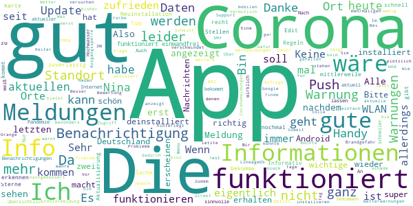

# NINA - Die Warn-App des BBK
App version ``3.3.2.3001``

Analyzed with [covid-apps-observer](http://github.com/covid-apps-observer) project, version ``0.1``

## App overview
| | |
|-------------------------|-------------------------| 
| **Name**&nbsp;&nbsp;&nbsp;&nbsp;&nbsp;&nbsp;&nbsp;&nbsp;&nbsp;&nbsp;&nbsp;&nbsp;&nbsp;&nbsp;&nbsp;&nbsp;&nbsp;&nbsp;&nbsp;&nbsp;&nbsp;&nbsp;&nbsp;&nbsp;&nbsp;&nbsp;&nbsp;&nbsp;&nbsp;&nbsp;&nbsp;&nbsp;&nbsp;&nbsp;&nbsp;&nbsp;&nbsp;&nbsp;&nbsp;&nbsp;  | NINA - Die Warn-App des BBK |
| **Unique identifier** | de.materna.bbk.mobile.app |
| **Link to Google Play** | [https://play.google.com/store/apps/details?id=de.materna.bbk.mobile.app](https://play.google.com/store/apps/details?id=de.materna.bbk.mobile.app) |
| **Summary**  | Die Notfall-Informations- und Nachrichten-App des BBK |
| **Privacy policy** | [http://www.bbk.bund.de/NINA-Datenschutz](http://www.bbk.bund.de/NINA-Datenschutz) |
| **Latest version** | 3.3.2.3001 |
| **Last update** | 2021-03-17 08:30:15 |
| **Recent changes** | - Es wurde ein Fehler behoben, der beim Nachladen für Ruckler im Dashboard gesorgt hat - Fehler bei abonnieren der Standortes behoben - Weitere Fehlerbehebung |
| **Installs**  | 1.000.000+ |
| **Category** | Nachrichten & Zeitschriften |
| **First release** | 22.05.2015 |
| **Size**  | 28M |
| **Supported Android version**  | 6.0 oder höher |

### Description
> Die Warn-App NINA (Notfall-Informations- und Nachrichten-App) warnt Sie deutschlandweit vor Gefahren, auf Wunsch auch für Ihren aktuellen Standort. Die App wird vom Bundesamt für Bevölkerungsschutz und Katastrophenhilfe (BBK) bereitgestellt.
 Technischer Ausgangspunkt für NINA ist das modulare Warnsystem des Bundes (MoWaS). Dieses wird vom BBK für bundesweite Warnungen des Zivilschutzes betrieben. Seit 2013 können auch alle Lagezentren der Länder und viele bereits angeschlossenen Leitstellen von Städten und Kommunen das Warnsystem nutzen (http://www.bbk.bund.de/DE/NINA/Warnung/Warnung.html). 
 <b>Hinweis: nicht überall sind auch Warnmeldungen zu lokalen Ereignissen erhältlich. Bitte informieren Sie sich bei Ihrem Landkreis oder Ihrer Stadt, welche Möglichkeiten zur Warnung der Bevölkerung dort eingesetzt werden.</b>
 Mit NINA erhalten Sie:
 •	Warnmeldungen des Bevölkerungsschutzes mit Handlungsempfehlungen 
 •	Wetterwarnungen des DWD (deutschlandweit für alle Landkreis und Städte)
 •	Hochwasserinformationen (deutschlandweit auf Bundeslandebene)
 •	allgemeine Notfalltipps, damit Sie sich und andere vor möglichen Gefahren schützen können.
 Mit NINA können Sie Orte auswählen, für die Sie Warnmeldungen erhalten möchten. Diese werden in der Übersicht „Meine Orte“ angezeigt. Im Einstellungsmenü können Sie festlegen, bei welcher Warnstufe Sie per Push-Benachrichtigung informiert werden sollen. Optional können Sie auch Warnmeldungen für Ihren aktuellen Standort erhalten. Dabei werden keine Standortdaten auf unseren Servern gespeichert. Bitte beachten Sie: Um standortbezogene Warnungen korrekt darstellen zu können, muss NINA Ihren Standort bestimmen können. Bei schlechtem Empfang kann es zu fehlerhaften Anzeigen kommen.
 Das Gefahrengebiet einer Warnmeldung kann in der Kartenansicht angezeigt werden. Die Hochwasserinformationen werden aktuell nur auf Bundeslandebene herausgegeben. In der Karte werden alle vorliegenden Warnmeldungen angezeigt, auch wenn Sie den Ort nicht ausgewählt haben.
 Die Notfalltipps enthalten Empfehlungen zu Themen wie Hochwasser, Unwetter, Stromausfall, Feuer und besondere Gefahrenlagen. Informieren Sie sich, wie Sie sich auf solche Ereignisse vorbereiten können. Ebenso finden Sie Verhaltenshinweise für den Fall, dass Sie von einem Ereignis betroffen sind. Mit den praktischen Checklisten können Sie gleich loslegen.
 Hinweise zu den Berechtigungen in der App:
 Zugriff auf den Speicher (Android 8 und höher): Die Warn-App NINA bietet die Möglichkeit den bekannten Sirenenton auf das Smartphone zu kopieren. Um dieses kopieren zu ermöglichen wird diese Berechtigung benötigt. Nach dem Abschluss des Kopiervorgang kann die Berechtigung wieder entfernt werden. Für eine Funktion der Warn-App ist die Berechtigung nicht erforderlich.
 Eigener Standort: Warnmeldungen für Ihren aktuellen Standort sind nur bei Nutzung von GPS, WLAN und anderen Geolokalisierungsdiensten möglich. Haben Sie diese Dienste auf Ihrem Gerät deaktiviert, können Sie keine standortbezogenen Warnmeldungen erhalten.
 Sie haben Fragen zur Warn-App NINA oder möchten uns Ihr Feedback geben? Dann wenden Sie sich bitte an nina@bbk.bund.de. Weitere Informationen erhalten Sie auch unter http://www.bbk.bund.de/NINA.
 Wichtig:
 Warnungen und Informationen können Sie nur mit einer Datenverbindung (per WLAN oder mobil) empfangen. Verfügt Ihr Gerät über keine Datenverbindung, wird der letzte auf dem Gerät gespeicherte Stand angezeigt.

### User interface
The developers of the app provide the following screenshots in the Google play store.
| | | |
|:-------------------------:|:-------------------------:|:-------------------------:|
 |   |   |   | 
 |   |   |   | 
 |   |   |   | 
 |   |   |   | 
 |   |   |   | 
 |   |   |   | 

## Development team
In the following we report the main information provided by the development team in the Google play store.

| | |
|-------------------------|-------------------------|
| **Developer**  | Bundesamt für Bevölkerungsschutz (Deutschland) |
| **Website**  | [http://www.bbk.bund.de/DE/NINA/Warn-App_NINA_node.html](http://www.bbk.bund.de/DE/NINA/Warn-App_NINA_node.html) |
| **Email** | nina@bbk.bund.de |
| **Physical address**  | [Provinzialstr. 93 53127 Bonn](https://www.google.com/maps/search/Provinzialstr.%2093%2053127%20Bonn) (Google Maps) |
| **Other developed apps**  | [https://play.google.com/store/apps/developer?id=Bundesamt+f%C3%BCr+Bev%C3%B6lkerungsschutz+(Deutschland)](https://play.google.com/store/apps/developer?id=Bundesamt+f%C3%BCr+Bev%C3%B6lkerungsschutz+(Deutschland)) |

## Android support

| | |
|-------------------------|-------------------------|
| **Declared target Android version**  | - |
| **Effective target Android version**  | - |
| **Minimum supported Android version**  | Marshmallow, version 6.0 (API level 23) |
| **Maximum target Android version**  | - |

The larger the difference between the minimum and maximum supported Android versions, the better. A larger difference means a wider audience. For example, old phones have a very low Android version, so a high minimum supported Android version means that the app cannot be used by users with old phones, thus leading to accessibility problems. 

## Requested permissions

In the following we report the complete list of the permissions requested by the app. 

| **Permission** | **Protection level** | **Description** | 
|-------------------------|-------------------------|-------------------------|
 **android.permission ACCESS_BACKGROUND_LOCATION** | :warning:**Dangerous** | Allows an app to access location in the background. 
 **android.permission ACCESS_COARSE_LOCATION** | :warning:**Dangerous** | Allows an app to access approximate location. 
 **android.permission ACCESS_FINE_LOCATION** | :warning:**Dangerous** | Allows an app to access precise location. 
 **android.permission ACCESS_NETWORK_STATE** | Normal | Allows applications to access information about networks. 
 **android.permission ACCESS_WIFI_STATE** | Normal | Allows applications to access information about Wi-Fi networks. 
 **android.permission FOREGROUND_SERVICE** | Normal | Allows a regular application to use Service.startForeground. 
 **android.permission INTERNET** | Normal | Allows applications to open network sockets. 
 **android.permission REQUEST_IGNORE_BATTERY_OPTIMIZATIONS** | Normal | Permission an application must hold in order to use Settings.ACTION_REQUEST_IGNORE_BATTERY_OPTIMIZATIONS. 
 **android.permission VIBRATE** | Normal | Allows access to the vibrator. 
 **android.permission WAKE_LOCK** | Normal | Allows using PowerManager WakeLocks to keep processor from sleeping or screen from dimming. 
 **android.permission WRITE_EXTERNAL_STORAGE** | :warning:**Dangerous** | Allows an application to write to external storage. 
 **com.google.android.c2dm.permission RECEIVE** | - | - 
 **com.google.android.finsky.permission BIND_GET_INSTALL_REFERRER_SERVICE** | - | - 

## Mentioned servers

| **Server** | **Registrant** | **Registrant country** | **Creation date** | 
|-------------------------|-------------------------|-------------------------|-------------------------|
 | google.com | Google LLC | :us: US | 1997-09-15 04:00:00 |
 | app-measurement.com | Google LLC | :us: US | 2015-06-19 20:13:31 |
 | googleapis.com | Google LLC | :us: US | 2005-01-25 17:52:26 |
 | googlesyndication.com | Google LLC | :us: US | 2003-01-21 06:17:24 |
 | crashlytics.com | Google LLC | :us: US | 2011-01-21 15:30:40 |
 | googleadservices.com | Google LLC | :us: US | 2003-06-19 16:34:53 |

## Security analysis 

Below we report the main security warnings raised by our execution of the [Androwarn](https://github.com/maaaaz/androwarn) security analysis tool.

**Connection interfaces exfiltration**
> - This application reads details about the currently active data network 

**Suspicious connection establishment**
> - This application opens a Socket and connects it to the remote address ' returned no addresses for  ; port is out of range' on the 'N/A' port  
> - This application opens a Socket and connects it to the remote address '' on the 'N/A' port  
> - This application opens a Socket and connects it to the remote address 'Ljava/net/Proxy;->type()Ljava/net/Proxy$Type;' on the 'N/A' port  
> - This application opens a Socket and connects it to the remote address 'timeout' on the 'N/A' port  

**Code execution**
> - This application loads a native library: 'crashlytics' 
> - This application executes a UNIX command containing this argument: 'logcat -b main -d' 

## User ratings and reviews

Below we provide information about how end users are reacting to the app in terms of ratings and reviews in the Google Play store.

### Ratings

The NINA - Die Warn-App des BBK app has been installed by more than **1000000** times. At this time, **19429** rated the app and its average score is **3.2960122**. Below we show the distribution of the ratings across the usual star-based rating of Google Play

:star::star::star::star::star:: 7937

:star::star::star::star:: 2503

:star::star::star:: 1867

:star::star:: 1619

:star:: 5503

### Reviews 

#### 5-star reviews

> 👍  :date: __2021-04-03 08:38:43__

> Vielen Dank für Ihre umgehende Rückmeldung und Erläuterung!  :date: __2021-03-31 17:18:26__

> Sehr gut  :date: __2021-03-30 12:06:52__

> Super die aktuelle Darstellung örtlicher Coronabestimmungen. So etwas braucht es. Dankeschön  :date: __2021-03-30 07:50:44__

> Habe vorgestern erst entdeckt, dass es hier eine Übersicht der aktuellen Corona-Regeln für den aktuellen Standort gibt inkl. Link zur Website des Landkreises. 👍  :date: __2021-03-28 23:58:08__

> Tolle übersichtliche Landkreis Beschreibung für die vielen verschiedenen corona Regeln nach Inzidenz  :date: __2021-03-28 22:00:47__

> Seit der letzten Aktualisierung funktioniert NINA auch wieder auf meinem Tablet. 😊  :date: __2021-03-27 09:38:19__

> Gut aber nicht immer aktuell oder zu langsam  :date: __2021-03-27 00:33:48__

> Nicht zu viele und nicht zu wenige Meldungen. Sehr hilfreich für lokale Ereignisse.  :date: __2021-03-26 21:06:50__

> Sehr Gut  :date: __2021-03-26 15:31:41__

#### 4-star reviews

> Der Benachrichtigungspunkt am Appsymbol auf dem Homescreen bei Android 11 verschwindet erst, wenn man direkt in die Benachrichtigung (über das Dropdown Menü oder durch gedrückt halten des Icons) geht. Wenn man die App öffnet und dann zur aktuellen Benachrichtigung navigiert, bleibt der Punkt am Appsymbol erhalten, so als ob die Benachrichtigung noch ungelesen wäre. Das könnte man bei Gelegenheit mal ändern  :date: __2021-04-03 11:10:53__

> Aktuelle Inzidenzwerte werden sowohl unter Ortsfavoriten und aktuellem Standort nicht aktualisiert. Bitte beheben. Hat sich erledigt! Werte werden wohl im Laufe des Tages aktualisiert!  :date: __2021-03-24 16:03:54__

> Habe noch nicht so viel Erfahrung. Bislang aber empfehlenswert. Darauf sollte niemand Verzichten. Kann MENSCHENLEBEN RETTEN.👍👍👍👍  :date: __2021-03-23 14:44:46__

> Keine Benachrichtigung am Warntag erhalten.  :date: __2021-03-22 22:00:52__

> Bitte Aktueller Standort und Ort zusammenfügen, wenn aktueller Ort einem Ort in "Meine Orte" entspricht. Das würde die Orte etwas übersichtlicher machen. Vor allem, wenn man zw zwei Orten/Gemeinden wohnt. Danke  :date: __2021-03-22 15:00:12__

> Anzeige in anderen Sprachen, z.B. Russisch, ist gut geint, leider sind zum Teil nur die Menüüberschriften übersetzt. Weitere Infos oder sogar die Warnungen selbst erscheinen weiterhin auf Deutsch. Gut wäre es, wenn zumindest die Standard-Warnungen wie Unwettet und Windstärke übersetzt erscheinen würden.  :date: __2021-03-13 12:36:31__

> Die App funktioniert an sich gut, aber ich frage mich ernsthaft, warum sie teilweise riesige Cache-Daten speichert. Schwiegermutter hat heute 6GB gelöscht, Freund hatte letztens über 1GB. Kann doch echt nicht sein.  :date: __2021-03-12 18:12:33__

> öffnen sich nicht ...Samsung S4 mit 5.0.1....Notfalltipps funktionieren! 11.3.2021 11Uhr...keine Reaktion der App! Wuppertal Elberfeld  :date: __2021-03-11 11:20:15__

> Die App funktioniert soweit ganz gut. Die von vielen erwähnten Probleme habe ich (Android 8) zum Glück nicht.  :date: __2021-03-11 02:11:32__

> Habe Benachrichtigung nur bei höchster Gefahr eingestellt. Trotzdem bekomme ich gefühlt 3 Mal die Woche irgendwelche nebensächlichen Corona Neuigkeiten aufs Handy. Tipp von Entwickler bekommen dass man die Push Benachrichtigung unter dem Punkt Corona abschalten kann. Danke!  :date: __2021-02-21 23:04:34__

#### 3-star reviews

> Die App ist ganz gut, die Meldungen hingegen nicht. Die Informationen sind viel zu allgemein und ungenau. Kurz und knapp wäre deutlich besser.  :date: __2021-04-04 05:11:25__

> Grundsätzlich gut, aber akustische Signale nicht zuverlässig  :date: __2021-03-31 22:26:11__

> da ich Verwandschaft in anderen Bundesländern habe, sind auch versch. Orte eingegeben ... Problem nur: das ich unter Android 10 mit Galaxy A50 nur aktuelle Info, wenn überhaupt (hinkt des öfteren hinterher) für mein Bundesland bekomme  :date: __2021-03-28 12:14:48__

> Die App ist so weit Top nur ein wundert mich, wie hier wird angezeigt das die Schulen und Kitas geschlossen sind aber in Wirklichkeit sind Schulen und Kitas offen,  :date: __2021-03-27 22:16:47__

> Eigentlich reicht es, wenn man 1x über Unwetter informiert wird und nicht gefühlt jede Stunde  :date: __2021-03-27 11:32:13__

> Vom Ansatz her eine gute Idee. Nur sind viele Infos Monate alt, was ok sein kann, jedoch wären Datumsangaben top. Die Meldung Sturm von 7:00 bis 16:00 ist sicher ok, nur laut DWD erst morgen. Sowas sollte einfach mit da stehen. Also Stichwort Datum der Meldung, das wäre schon gut.  :date: __2021-03-26 20:38:36__

> Wow nach über einem Jahr funktioniert die App wieder soweit. Dankeschön gibt gleich mal ⭐⭐ dazu  :date: __2021-03-24 18:43:50__

> Trotz manueller Deaktivierung der Stromspar Optimierung der App in den Huawei Einstellungen, habe ich heute weder eine Warnung doch die Entwarnung als Meldung erhalten. Auch Corona Warnung habe ich in den letzten Monaten nie als Push Erhalten. Lediglich einmal eine Unwetter Warnung. So leider eher eine Gefahr als eine Hilfe  :date: __2021-03-23 20:39:16__

> Bei der letzten Alarmierung nicht regiert  :date: __2021-03-22 13:06:04__

> Wie bereits von anderen Benutzern berichtet, funktionieren die optischen und akkustischen Benachrichtigungen nicht, obwohl alle Berechtigungen erteilt sind und die schriftlichen Informationen ankomme. (Android 10, G7ThinQ). Damit erfüllt diese App ihren Hauptzweck (Alarmierung der Bevölkerung) nicht! Ich sehe gerade: Die Entwickler sitzen in der Provinzialstrasse! Lach! Das erklärt wohl so manches. Vermutlich sind sie noch für weitere Bundes-Apps verantwortlich ...  :date: __2021-03-21 13:27:14__

#### 2-star reviews

> Wenn Benachrichtigungen erscheinen erfüllt die App durchaus ihren Zweck. Leider erscheinen die Benachrichtigungen extrem selten. Zum Beispiel wurde vergangene Woche in einem der von mir abonnierten Landkreise eine Bombe aus dem zweiten Weltkrieg gefunden. Eine Benachrichtigung blieb komplett aus. Heute war Probealarm der Feuerwehr. Ich habe keine Benachrichtigung bekommen, sondern nur die Sirenen gehört. Daraufhin habe ich in die App geschaut. Hier war der Probealarm vermerkt. Das geht besser!  :date: __2021-04-03 12:15:46__

> Ich bekomme keine Meldung mehr letzte Meldung liegen bei mir zurück Stand Februar.2021 ist das normal?  :date: __2021-03-28 12:30:54__

> Das was Nina soll funktioniert nicht... Ständig nur Corona Gelaber, dafür brauche ich diese App nicht  :date: __2021-03-27 23:12:14__

> Ich bekomme keine Benachrichtigungen obwohl es neue Meldungen gibt. Jegliche Benachrichtigungen sind aktiviert. Die App wird auch nicht in Standby oder sonst was versetzt. Alle Einstellungen sind korrekt aber sie ist durchweg ruhig.  :date: __2021-03-25 21:54:16__

> ☝☹ Letztendliche kann man die App erst abschließend beurteilen, wenn rechtzeitig eine Warnung erfolgt ist. Sehr gut sind die Notfalltipps. Leider funktioniert die App nicht immer 🙈 Beim Probealarm bleibt die App stumm.🙈  :date: __2021-03-24 08:57:56__

> Die App warnt nicht oder zu spät oder redundant und widersprüchlich. In der Praxis bisher kaum brauchbar.  :date: __2021-03-17 16:27:57__

> Anfangs noch irgendwie halbwegs funktioniert, mittlerweile kommen z.B. für ein Gebiet gar keine Aktualisierungen. Für ein anderes Gebiet dann schon, aber auch nicht der aktuelle Stand. Schade...  :date: __2021-03-16 13:50:02__

> Meldet viel zu selten, oft erst nach Beendigung der Gefahrenlage  :date: __2021-03-13 15:18:03__

> Keine Push Benachrichtigung über die heutige Sieren Warnung und auch sonst keine Warnung  :date: __2021-03-11 16:34:29__

> Schon mehrmals gestorben. Meldet häufig viel zu spät oder gar nicht. Viel Glück!  :date: __2021-03-11 15:50:40__

#### 1-star reviews

> Super App ...eigentlich aber seitdem der Corona Quatsch da drin steht nervt es gewaltig. .....und Tschüß App...gibt noch andere  :date: __2021-04-04 11:38:40__

> "Fehler bei der Registrierung". Der nicht benannte Fehler existiert schon viele Monate. App hat noch nie funktioniert. Bitte achten Sie darauf die App ohne Bedingung an Werbeserver zu programmieren. App wird jetzt gelöscht.  :date: __2021-04-03 23:30:05__

> Beim Thema corona impfen und testen mindestens 3 Monate nicht mehr aktuellisiert worden. Andererseits ist unsere Bundesregierung ja nach 13 Monaten auch nicht weiter.  :date: __2021-04-03 22:20:50__

> Taugt nix bringt alle 3 monate eine sinnlose meldung  :date: __2021-04-03 17:08:13__

> Die App warnt nicht und zeigt ständig an, dass die Standorteinstellungen fehlerhaft seien, obwohl offenbar gar kein Fehler vorliegt. Folgt man den Anweisungen ändert sich zudem trotzdem nichts.  :date: __2021-04-02 11:56:01__

> Seit Februar funktioniert App nicht mehr, sie lädt nur immer und findet keine Ergebnisse. Auch nach löschen und Neuinstallation (mit und ohne WLAN) funktioniert App nicht mehr. Also in meinen Augen jetzt unbrauchbar.Seit März liegt auch Stuttgart, Halle Saale, Konstanz nicht mehr in Deutschland und kann nicht mehr geladen werden!!!!  :date: __2021-04-01 21:46:53__

> Trotz Einstellung Landkreis Weimar wird die 7 Tage Inzidenz von Stadt Weimar angezeigt. Leider kaum verlässlich. Außerdem sind die angezeigten Gefahrinformationen nun schon 5 Monate alt. Diese App ist eine gute Idee, leider mit mangelhafter Umsetzung.  :date: __2021-04-01 10:27:03__

> Ich habe ein altes SPT-900 Baustellen Smartphone, ein unkaputtbares Teil. Mit Android 4.4.2 das sich nicht mehr updaten lässt. Seit einen Update vor einigen Monaten funktioniert die App nicht mehr. Zumindest Staatliche Einrichtungrn sollten neue Apps Abwärtskompaktibel zu alten Betriebssysremversionen programmieren. Schließlich hat nicht jeder das Geld oder die Gewissenlosigkeit gegebüber der Umwelt sich jedes Jahr ein neues Gerät zu kaufen.  :date: __2021-03-31 12:12:26__

> noch nie ne warnung bekommen bei bekannten quäkt die app bei jedem mückenfurz, fliegt wieder runter das leben ging und geht auch ohne diesen quatsch weiter  :date: __2021-03-30 16:45:16__

> Die App läuft ohne Probleme. Nur leider sind seit einem Jahr die gleichen drei Themen bei jedem Ort. So geraten wirklich wichtige Meldungen in den Hintergrund. Die Angaben waren bis dahin immer super aber Solang es nur noch um Corona geht, bringt mir die app nix. 6x die gleichen Meldungen. Danke nein. NINA fliegt leider raus. Die wichtigen Infos über Wetter und eventuelle Unwetterwarnungen kommen besser über Proplanta.  :date: __2021-03-28 14:18:54__

