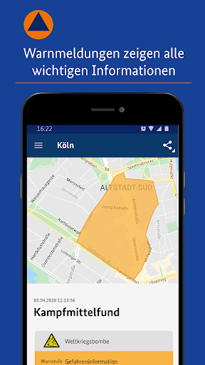
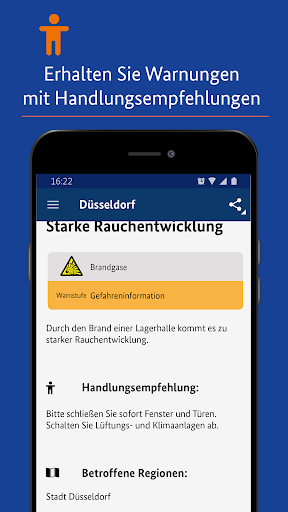

# NINA - Die Warn-App des BBK
App version ``3.3.2.3001``

Analyzed with [covid-apps-observer](http://github.com/covid-apps-observer) project, version ``0.1``

## App overview
| | |
|-------------------------|-------------------------| 
| **Name**&nbsp;&nbsp;&nbsp;&nbsp;&nbsp;&nbsp;&nbsp;&nbsp;&nbsp;&nbsp;&nbsp;&nbsp;&nbsp;&nbsp;&nbsp;&nbsp;&nbsp;&nbsp;&nbsp;&nbsp;&nbsp;&nbsp;&nbsp;&nbsp;&nbsp;&nbsp;&nbsp;&nbsp;&nbsp;&nbsp;&nbsp;&nbsp;&nbsp;&nbsp;&nbsp;&nbsp;&nbsp;&nbsp;&nbsp;&nbsp;  | NINA - Die Warn-App des BBK |
| **Unique identifier** | de.materna.bbk.mobile.app |
| **Link to Google Play** | [https://play.google.com/store/apps/details?id=de.materna.bbk.mobile.app](https://play.google.com/store/apps/details?id=de.materna.bbk.mobile.app) |
| **Summary**  | Die Notfall-Informations- und Nachrichten-App des BBK |
| **Privacy policy** | [http://www.bbk.bund.de/NINA-Datenschutz](http://www.bbk.bund.de/NINA-Datenschutz) |
| **Latest version** | 3.3.2.3001 |
| **Last update** | 2021-03-17 08:30:15 |
| **Recent changes** | - Es wurde ein Fehler behoben, der beim Nachladen für Ruckler im Dashboard gesorgt hat - Fehler bei abonnieren der Standortes behoben - Weitere Fehlerbehebung |
| **Installs**  | 1.000.000+ |
| **Category** | Nachrichten & Zeitschriften |
| **First release** | 22.05.2015 |
| **Size**  | 28M |
| **Supported Android version**  | 6.0 oder höher |

### Description
> Die Warn-App NINA (Notfall-Informations- und Nachrichten-App) warnt Sie deutschlandweit vor Gefahren, auf Wunsch auch für Ihren aktuellen Standort. Die App wird vom Bundesamt für Bevölkerungsschutz und Katastrophenhilfe (BBK) bereitgestellt.
 Technischer Ausgangspunkt für NINA ist das modulare Warnsystem des Bundes (MoWaS). Dieses wird vom BBK für bundesweite Warnungen des Zivilschutzes betrieben. Seit 2013 können auch alle Lagezentren der Länder und viele bereits angeschlossenen Leitstellen von Städten und Kommunen das Warnsystem nutzen (http://www.bbk.bund.de/DE/NINA/Warnung/Warnung.html). 
 <b>Hinweis: nicht überall sind auch Warnmeldungen zu lokalen Ereignissen erhältlich. Bitte informieren Sie sich bei Ihrem Landkreis oder Ihrer Stadt, welche Möglichkeiten zur Warnung der Bevölkerung dort eingesetzt werden.</b>
 Mit NINA erhalten Sie:
 •	Warnmeldungen des Bevölkerungsschutzes mit Handlungsempfehlungen 
 •	Wetterwarnungen des DWD (deutschlandweit für alle Landkreis und Städte)
 •	Hochwasserinformationen (deutschlandweit auf Bundeslandebene)
 •	allgemeine Notfalltipps, damit Sie sich und andere vor möglichen Gefahren schützen können.
 Mit NINA können Sie Orte auswählen, für die Sie Warnmeldungen erhalten möchten. Diese werden in der Übersicht „Meine Orte“ angezeigt. Im Einstellungsmenü können Sie festlegen, bei welcher Warnstufe Sie per Push-Benachrichtigung informiert werden sollen. Optional können Sie auch Warnmeldungen für Ihren aktuellen Standort erhalten. Dabei werden keine Standortdaten auf unseren Servern gespeichert. Bitte beachten Sie: Um standortbezogene Warnungen korrekt darstellen zu können, muss NINA Ihren Standort bestimmen können. Bei schlechtem Empfang kann es zu fehlerhaften Anzeigen kommen.
 Das Gefahrengebiet einer Warnmeldung kann in der Kartenansicht angezeigt werden. Die Hochwasserinformationen werden aktuell nur auf Bundeslandebene herausgegeben. In der Karte werden alle vorliegenden Warnmeldungen angezeigt, auch wenn Sie den Ort nicht ausgewählt haben.
 Die Notfalltipps enthalten Empfehlungen zu Themen wie Hochwasser, Unwetter, Stromausfall, Feuer und besondere Gefahrenlagen. Informieren Sie sich, wie Sie sich auf solche Ereignisse vorbereiten können. Ebenso finden Sie Verhaltenshinweise für den Fall, dass Sie von einem Ereignis betroffen sind. Mit den praktischen Checklisten können Sie gleich loslegen.
 Hinweise zu den Berechtigungen in der App:
 Zugriff auf den Speicher (Android 8 und höher): Die Warn-App NINA bietet die Möglichkeit den bekannten Sirenenton auf das Smartphone zu kopieren. Um dieses kopieren zu ermöglichen wird diese Berechtigung benötigt. Nach dem Abschluss des Kopiervorgang kann die Berechtigung wieder entfernt werden. Für eine Funktion der Warn-App ist die Berechtigung nicht erforderlich.
 Eigener Standort: Warnmeldungen für Ihren aktuellen Standort sind nur bei Nutzung von GPS, WLAN und anderen Geolokalisierungsdiensten möglich. Haben Sie diese Dienste auf Ihrem Gerät deaktiviert, können Sie keine standortbezogenen Warnmeldungen erhalten.
 Sie haben Fragen zur Warn-App NINA oder möchten uns Ihr Feedback geben? Dann wenden Sie sich bitte an nina@bbk.bund.de. Weitere Informationen erhalten Sie auch unter http://www.bbk.bund.de/NINA.
 Wichtig:
 Warnungen und Informationen können Sie nur mit einer Datenverbindung (per WLAN oder mobil) empfangen. Verfügt Ihr Gerät über keine Datenverbindung, wird der letzte auf dem Gerät gespeicherte Stand angezeigt.

### User interface
The developers of the app provide the following screenshots in the Google play store.
| | | |
|:-------------------------:|:-------------------------:|:-------------------------:|
 |   |   |   | 
 |   |   |   | 
 |   |   |   | 
 |   |   |   | 
 |   |   |   | 
 |   |   |   | 

## Development team
In the following we report the main information provided by the development team in the Google play store.

| | |
|-------------------------|-------------------------|
| **Developer**  | Bundesamt für Bevölkerungsschutz (Deutschland) |
| **Website**  | [http://www.bbk.bund.de/DE/NINA/Warn-App_NINA_node.html](http://www.bbk.bund.de/DE/NINA/Warn-App_NINA_node.html) |
| **Email** | nina@bbk.bund.de |
| **Physical address**  | [Provinzialstr. 93 53127 Bonn](https://www.google.com/maps/search/Provinzialstr.%2093%2053127%20Bonn) (Google Maps) |
| **Other developed apps**  | [https://play.google.com/store/apps/developer?id=Bundesamt+f%C3%BCr+Bev%C3%B6lkerungsschutz+(Deutschland)](https://play.google.com/store/apps/developer?id=Bundesamt+f%C3%BCr+Bev%C3%B6lkerungsschutz+(Deutschland)) |

## Android support

| | |
|-------------------------|-------------------------|
| **Declared target Android version**  | - |
| **Effective target Android version**  | - |
| **Minimum supported Android version**  | Marshmallow, version 6.0 (API level 23) |
| **Maximum target Android version**  | - |

The larger the difference between the minimum and maximum supported Android versions, the better. A larger difference means a wider audience. For example, old phones have a very low Android version, so a high minimum supported Android version means that the app cannot be used by users with old phones, thus leading to accessibility problems. 

## Requested permissions

In the following we report the complete list of the permissions requested by the app. 

| **Permission** | **Protection level** | **Description** | 
|-------------------------|-------------------------|-------------------------|
 **android.permission ACCESS_BACKGROUND_LOCATION** | :warning:**Dangerous** | Allows an app to access location in the background. 
 **android.permission ACCESS_COARSE_LOCATION** | :warning:**Dangerous** | Allows an app to access approximate location. 
 **android.permission ACCESS_FINE_LOCATION** | :warning:**Dangerous** | Allows an app to access precise location. 
 **android.permission ACCESS_NETWORK_STATE** | Normal | Allows applications to access information about networks. 
 **android.permission ACCESS_WIFI_STATE** | Normal | Allows applications to access information about Wi-Fi networks. 
 **android.permission FOREGROUND_SERVICE** | Normal | Allows a regular application to use Service.startForeground. 
 **android.permission INTERNET** | Normal | Allows applications to open network sockets. 
 **android.permission REQUEST_IGNORE_BATTERY_OPTIMIZATIONS** | Normal | Permission an application must hold in order to use Settings.ACTION_REQUEST_IGNORE_BATTERY_OPTIMIZATIONS. 
 **android.permission VIBRATE** | Normal | Allows access to the vibrator. 
 **android.permission WAKE_LOCK** | Normal | Allows using PowerManager WakeLocks to keep processor from sleeping or screen from dimming. 
 **android.permission WRITE_EXTERNAL_STORAGE** | :warning:**Dangerous** | Allows an application to write to external storage. 
 **com.google.android.c2dm.permission RECEIVE** | - | - 
 **com.google.android.finsky.permission BIND_GET_INSTALL_REFERRER_SERVICE** | - | - 

## Mentioned servers

| **Server** | **Registrant** | **Registrant country** | **Creation date** | 
|-------------------------|-------------------------|-------------------------|-------------------------|
 | google.com | Google LLC | :us: US | 1997-09-15 04:00:00 |
 | app-measurement.com | Google LLC | :us: US | 2015-06-19 20:13:31 |
 | googleapis.com | Google LLC | :us: US | 2005-01-25 17:52:26 |
 | googlesyndication.com | Google LLC | :us: US | 2003-01-21 06:17:24 |
 | crashlytics.com | Google LLC | :us: US | 2011-01-21 15:30:40 |
 | googleadservices.com | Google LLC | :us: US | 2003-06-19 16:34:53 |

## Security analysis 

Below we report the main security warnings raised by our execution of the [Androwarn](https://github.com/maaaaz/androwarn) security analysis tool.

**Connection interfaces exfiltration**
> - This application reads details about the currently active data network 

**Suspicious connection establishment**
> - This application opens a Socket and connects it to the remote address ' returned no addresses for  ; port is out of range' on the 'N/A' port  
> - This application opens a Socket and connects it to the remote address '' on the 'N/A' port  
> - This application opens a Socket and connects it to the remote address 'Ljava/net/Proxy;->type()Ljava/net/Proxy$Type;' on the 'N/A' port  
> - This application opens a Socket and connects it to the remote address 'timeout' on the 'N/A' port  

**Code execution**
> - This application loads a native library: 'crashlytics' 
> - This application executes a UNIX command containing this argument: 'logcat -b main -d' 

## User ratings and reviews

Below we provide information about how end users are reacting to the app in terms of ratings and reviews in the Google Play store.

### Ratings

The NINA - Die Warn-App des BBK app has been installed by more than **1000000** times. At this time, **19429** rated the app and its average score is **3.2960122**. Below we show the distribution of the ratings across the usual star-based rating of Google Play

:star::star::star::star::star:: 7937

:star::star::star::star:: 2503

:star::star::star:: 1867

:star::star:: 1619

:star:: 5503

### Reviews 

#### 5-star reviews

> Funktioniert bei mir sehr gut!  :date: __2021-07-01 13:58:50__

> Gut  :date: __2021-07-01 11:53:47__

> Hilfreich  :date: __2021-06-30 17:53:36__

> Coole App  :date: __2021-06-29 13:53:55__

> Wäre eigentlich gut, aber immer öfter wird mein Standort nicht gefunden, obwohl alle Einstellungen stimmen. Und dann gibt es natürlich auch keine Meldungen. Unzuverlässig und deshalb zur Zeit nutzlos. 29.06.: Problem besteht nach Neuinstallation zur Zeit nicht mehr. Bewertung angepasst. Danke für Support.  :date: __2021-06-29 09:25:46__

> Gut  :date: __2021-06-27 10:04:34__

> Die Informationen sind zügig auf Rechner. Ist positiv zu bewerten  :date: __2021-06-26 19:38:47__

> Hier sind die Daten von offizieller Stelle bereit gestellt und nicht von irgendeinem Meinungsmacher.  :date: __2021-06-26 18:29:36__

> Eine sehr gute App  :date: __2021-06-24 14:42:15__

> Gute Sache  :date: __2021-06-23 20:21:34__

#### 4-star reviews

> Beim heutigen Probealarm kam keine Warnung, obwohl alle Berechtigungen eingestellt waren. Funktioniert die App überhaupt?  :date: __2021-07-04 14:31:21__

> Wenn die App geöffnet wird ( wlan ) sucht und findet sie keine Daten. Bei mobilen Daten keine Probleme.  :date: __2021-06-30 08:27:25__

> Urspr. 1*Bewertung: App tut nicht das, was sie soll: warnen. Weder bei den letzten landesweiten Probealarmen, noch bei tatsächlichen Gefahrenlagen und Unwettern. Alle Berechtigungen erteilt, im Hintergrund aktiviert, aber es kommen einfach keine Pushbenachrichtigungen. EDIT: nun 4 Sterne, da Warnungen wieder durchkommen. Neuinstallation brachte nichts, dafür folgendes: Hintergrundaktivität von automatisch auf "manuell verwalten" stellen, dann klappt es.  :date: __2021-06-28 15:49:53__

> Nina warnt zuverlässig und schnell.  :date: __2021-06-28 15:42:23__

> Die Warnmeldungen bei den eingetragenen Städten sowie vom aktuellen Standort funktionieren Recht gut! Meldungen von Produktrückrufen, Vermisstenmeldungen und Cybersicherheit wären noch wünschenswert!  :date: __2021-06-24 07:19:56__

> Gute App, aber es gibt einen großen Makel: wenn ich in der Benachrichtigungsleiste eine Meldung bekomme und sie anklicke, dann erfolgt in der App erst nochmal eine Server-Anfrage. Eigentlich sollte die Meldung doch direkt verfügbar sein und keine weitere Anfrage benötigen. Wenn ich zwischen Empfang einer Warnung und Aufruf offline gehe, kann ich die Meldung in der App nicht sehen.  :date: __2021-06-23 17:46:34__

> 3r34ist war noch t4433 r345  :date: __2021-06-22 17:28:54__

> Ganz im Anfang war es eine tolle Sache, aber eine Warn App, die keine Warnung anzeigt, ist wenig hilfreich. Über die aktuelle Trinkwasser Verunreinigung in meinem Kreis habe ich die Info erst über Facebook gelesen, dann bei Nina geschaut, wo sie schlummernd und still stand. Trotz aller aktivierten Benachrichtigungsoptionen. Hier muss dringend nachgebessert werden. UPDATE: Nachdem ich die App deinstalliert und dann wieder neu installiert habe, funktioniert sie wieder wie sie soll.  :date: __2021-06-20 15:22:10__

> Neue Bewertung: Die App an sich scheint gut zu funktionieren. Die eingepflegten Daten sind nicht immer so gut. Bsp: Meldung: "Amtliche Warnung vor extremer Hitze" Handlungsempfehlung: "Heute ist der dritte Tag in Folge". Bin kein Linguist, aber nach meinen Verständnis sollte da sowas wie viel trinken und im Schatten laufen stehen. Ansonsten werden Die Daten ganz gut Angezeigt.  :date: __2021-06-19 17:28:01__

> Alle eigentlich ganz geil so mit Wetterwarnung und Überflutungswarnungen, was jetzt aber nachmal richtig gut währe währe auch eine Option für Brandgefahr. Grad bei so heißem Wetter nicht grade Unnütz. Kommt n Reiter für Brandgefahr kommt hier auch der fünfte Stern.  :date: __2021-06-18 12:48:12__

#### 3-star reviews

> Was bringt mir ne App, die mich erst ne halbe Std. nach dem Express vor der Gefahrenlage warnt?! Hatten hier 2 mal nen Grossbrand und jedesmal wurde ich durch die Presse wesentlich früher gewarnt und darauf hingewiesen die Fenster und Türen zu schließen, als von NINA. DAS SOLLTE DOCH ANDERS HERUM SEIN?!  :date: __2021-07-03 18:27:41__

> Die Coronameldung ist leider immer noch da. Andere Fehler sind behoben immer noch. Wäre schön, wenn die mal verschwinden würden. Dann gibt es auch 5 Sterne.  :date: __2021-07-02 20:41:57__

> Soweit funktioniert die App gut. Ich musste gerade aber feststellen das die App bei mir 6Gb gross ist?!  :date: __2021-07-02 13:03:16__

> Die Wetterwarnungen funktionieren seit dem Update nicht mehr. Nur noch Push Benachrichtigung dazu. Und nein, es liegt nicht an der schnellen Entwarnung.  :date: __2021-06-30 06:33:00__

> Bei Einstellung 'Wetterwarnungen' ab 'markantes Wetter' werd' ich irre. Teilweise werden mehrere Meldungen pro Tag ausgegeben, aber das Ereignis tritt nur sehr selten ein. Falls doch, ist es bisher kein Unwetter gewesen, nicht mal markantes Wetter. Lasst das mit den Wettermeldungen bleiben, damit demontiert ihr nur die Glaubwürdigkeit der App.  :date: __2021-06-29 16:18:57__

> leider stimmen die angegebenen Infektionsgefahrstufen nicht mehr. Unser Kreis ist seit Wochen in Warnstufe 1,jetzt plötzlich in Stufe 2 eingestuft, obwohl die Inzidenz gesunken ist.  :date: __2021-06-28 18:14:13__

> mal abwarten ob die App auch warnt, ansonsten bekommt diese App ein Freiflug Ticket  :date: __2021-06-27 15:43:40__

> Ja, beim Probealarm im letzten Herbst hat die App, wie auch alle örtlichen Warnsysteme und Sirenen komplett versagt. Aber die Corona news sind hundertprozentig besser als die der Corona App. Dafür gäbe es glatt 5 Sterne 🌟 Jedoch LK Böblingen, seit Wochen unter Inzidenz 10, Warnstufe 2? Also insgesamt 3 ⭐  :date: __2021-06-27 09:04:06__

> Die Corona Warnstufe bei mir im Kreis wird als Stufe 2 angezeigt. Dabei ist die Inzidenz schon seit mehr als 7 Tagen unter 10! Das macht für mich keinen Sinn.  :date: __2021-06-27 09:03:23__

> Die Unwetterwarnungen funktionieren mal. Manche Meldungen über Verkehr sieht man nur in Push-Nachricht. Nähere Details in App fehlen dazu dann.  :date: __2021-06-25 21:59:02__

#### 2-star reviews

> Zwei Punkte stören mich sehr an der App: 1. Ganz Deutschland hat nun bereits seit mehr als einem Jahr und 3 Monaten eine Warnung bzgl. Corona laufen. Das betrifft auch die Kartendarstellung. Um die App korrekt nutzen zu können, muss man die bekannten Coronahinweise, auch in der Karte, deaktivieren können. Dies überschattet sonst jede andere Gefahr. Gerne können neue C.-Meldungen dann wieder auftauchen. 2. Ich bekomme keine Warnungen bzgl. markanten Wetters/Unwetters zugestellt. Mit WO geht es.  :date: __2021-07-03 23:43:31__

> Ständig zeigt die app unwetter an. In den letzten 48 Stunden ungefähr 10 mal und es war weder Gewitter noch Starkregen  :date: __2021-07-01 16:48:55__

> Die im Grunde nicht schlechte App knallt den Cache zu. 6 GB im Speicher sind einfach zu viel. Cache und App gelöscht, obwohl die App zuverlässig warnt.  :date: __2021-07-01 06:45:13__

> die App war am Anfang richtig gut und umfangreich, leider hat sie sehr nachgelassen und ich bin auf eine andere umgestiegen!  :date: __2021-06-30 00:40:42__

> * informiert überwiegend träge-zeigt die Erfahrung * vor schwerem Unwetter wird nicht gewarnt, sondern mittels DWD informiert, dass das Unwetter angekommen sei (Treppenwitz) * Animationen erzwingen Wartephasen * Meldet stets zuerst "es liegen keine Gefahren vor" statt "Gefahrensituationen wird abgerufen" bei langsamer Internetverbindung (ggf. alte App) * Gefahrenhinweise haben lange Titelzeilen * Ausgewählte Gefahrenhinweise werden erst konkret bei abon.Orten nach wischen der verdeckenden Karte  :date: __2021-06-29 17:30:29__

> Problem immer noch vorhanden.... warnung auf dem screen...angetippt...in der app nix...aber alte corona warnungen vom letzten jahr die man nicht wegbekommt wird deinstalliert ...nicht gerade benutzerfreundlich...allein dieser wirrwarr bei den benachritigungseinstellungen...  :date: __2021-06-28 18:39:24__

> Anscheinend ist zur Zeit irgendwas mit der Verbindung nicht in Ordnung. Ich bekomme keine Warnungen mehr und trotz Netzwerkverbindung Netzwerkfehler angezeigt. Bis vor kurzem lief alles tadellos.  :date: __2021-06-28 16:43:55__

> Es werden keine Wetter warnungen mehr angezeigt.  :date: __2021-06-27 19:11:18__

> Murks  :date: __2021-06-27 08:00:16__

> Zu ungenau, nur auf Landkreisebene  :date: __2021-06-22 22:17:28__

#### 1-star reviews

> Funktioniert nicht bei Meldungen, keine Benachrichtigung, kein Klingelton, samsung galaxy s21plus  :date: __2021-07-04 15:59:29__

> Keine Meldung von Warnungen.  :date: __2021-07-04 15:53:39__

> Eigentlich keine schlechte idee, nur leidet wurde die App nach und nach zu einem schlechten Wetterdienst ausgebaut. Glaubwürdigkeit ist schon längst verfallen. 20 mal am Tag gibts "warnungen" vor "schweren Unwettern" und dann donnert es am ende 2 mal. Überlasst die Wettervorhersagen doch bitte Leuten, die das können und konzipiert die App wieder wofür sie da ist.. Notfälle. Aber getreu nach der Geschichte mit dem Kind und den Wölfen, würde ich mittlerweile gar keinen Notfall mehr mitkriegen  :date: __2021-07-04 15:51:38__

> Sehr schlecht programmiert. Benachrichtigungen sind nach Öffnen der App nicht mehr zu sehen. Bei Alarmen funktioniert sie nicht richtig. Alles in allem wertlos.  :date: __2021-07-04 14:24:57__

> Keine Push-Warnungen, veraltete Corona-Regeln, also unbrauchbar  :date: __2021-07-03 15:10:26__

> Keine Meldungen, egal ob Bombenentschärfung, Feuer bei dem man die Fenster schließen soll, Unwetter, es kommt kein Ton, keine Warnung. Gehe ich aktiv in die App, ist die Warnung zu sehen. So nutzt es leider nichs.  :date: __2021-07-03 09:03:36__

> Nichts geht trotz Neuinstallation  :date: __2021-07-02 16:34:34__

> Ein Jahr später und die Warnsysteme sind nicht in Funktion, sondern der Warntag würde verschoben. m) Katastrophenwarnsysteme kann man ja auch noch eben reparieren, wenn man sie tatsächlich braucht.  :date: __2021-07-01 15:54:58__

> Die App Benachrichtigt mich nicht bei Unwettern oder anderen wichtigen Sachen für die sie ja da ist. App mehrfach neu installiert, Handy Berechtigungen sind alle gegeben und mehrfach geprüft selbst in der App die Benachrichtigungen sind eingestellt aber kein Ton. Ich hab diese App damit sie mich benachrichtigt wenn was ist nicht das ich selbst prüfen muss ob es was neues gibt. Wird deinstalliert und eine andere gesucht. So macht es keinen Sinn.  :date: __2021-07-01 13:04:33__

> Bekomme keine Warnmeldungen mehr auf das Handy  :date: __2021-06-30 23:30:52__

