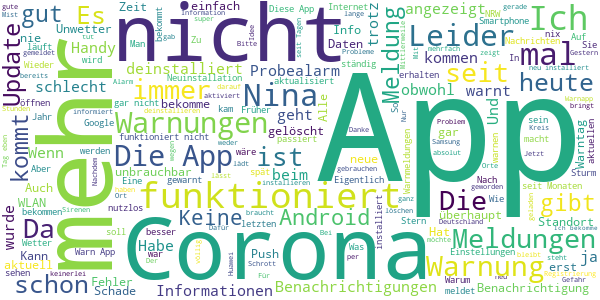

# NINA - Die Warn-App des BBK
App version ``3.3.2.3001``

Analyzed with [covid-apps-observer](http://github.com/covid-apps-observer) project, version ``0.1``

## App overview
| | |
|-------------------------|-------------------------| 
| **Name**&nbsp;&nbsp;&nbsp;&nbsp;&nbsp;&nbsp;&nbsp;&nbsp;&nbsp;&nbsp;&nbsp;&nbsp;&nbsp;&nbsp;&nbsp;&nbsp;&nbsp;&nbsp;&nbsp;&nbsp;&nbsp;&nbsp;&nbsp;&nbsp;&nbsp;&nbsp;&nbsp;&nbsp;&nbsp;&nbsp;&nbsp;&nbsp;&nbsp;&nbsp;&nbsp;&nbsp;&nbsp;&nbsp;&nbsp;&nbsp;  | NINA - Die Warn-App des BBK |
| **Unique identifier** | de.materna.bbk.mobile.app |
| **Link to Google Play** | [https://play.google.com/store/apps/details?id=de.materna.bbk.mobile.app](https://play.google.com/store/apps/details?id=de.materna.bbk.mobile.app) |
| **Summary**  | Die Notfall-Informations- und Nachrichten-App des BBK |
| **Privacy policy** | [http://www.bbk.bund.de/NINA-Datenschutz](http://www.bbk.bund.de/NINA-Datenschutz) |
| **Latest version** | 3.3.2.3001 |
| **Last update** | 2021-03-17 08:30:15 |
| **Recent changes** | - Es wurde ein Fehler behoben, der beim Nachladen für Ruckler im Dashboard gesorgt hat - Fehler bei abonnieren der Standortes behoben - Weitere Fehlerbehebung |
| **Installs**  | 1.000.000+ |
| **Category** | Nachrichten & Zeitschriften |
| **First release** | 22.05.2015 |
| **Size**  | 28M |
| **Supported Android version**  | 6.0 oder höher |

### Description
> Die Warn-App NINA (Notfall-Informations- und Nachrichten-App) warnt Sie deutschlandweit vor Gefahren, auf Wunsch auch für Ihren aktuellen Standort. Die App wird vom Bundesamt für Bevölkerungsschutz und Katastrophenhilfe (BBK) bereitgestellt.
 Technischer Ausgangspunkt für NINA ist das modulare Warnsystem des Bundes (MoWaS). Dieses wird vom BBK für bundesweite Warnungen des Zivilschutzes betrieben. Seit 2013 können auch alle Lagezentren der Länder und viele bereits angeschlossenen Leitstellen von Städten und Kommunen das Warnsystem nutzen (http://www.bbk.bund.de/DE/NINA/Warnung/Warnung.html). 
 <b>Hinweis: nicht überall sind auch Warnmeldungen zu lokalen Ereignissen erhältlich. Bitte informieren Sie sich bei Ihrem Landkreis oder Ihrer Stadt, welche Möglichkeiten zur Warnung der Bevölkerung dort eingesetzt werden.</b>
 Mit NINA erhalten Sie:
 •	Warnmeldungen des Bevölkerungsschutzes mit Handlungsempfehlungen 
 •	Wetterwarnungen des DWD (deutschlandweit für alle Landkreis und Städte)
 •	Hochwasserinformationen (deutschlandweit auf Bundeslandebene)
 •	allgemeine Notfalltipps, damit Sie sich und andere vor möglichen Gefahren schützen können.
 Mit NINA können Sie Orte auswählen, für die Sie Warnmeldungen erhalten möchten. Diese werden in der Übersicht „Meine Orte“ angezeigt. Im Einstellungsmenü können Sie festlegen, bei welcher Warnstufe Sie per Push-Benachrichtigung informiert werden sollen. Optional können Sie auch Warnmeldungen für Ihren aktuellen Standort erhalten. Dabei werden keine Standortdaten auf unseren Servern gespeichert. Bitte beachten Sie: Um standortbezogene Warnungen korrekt darstellen zu können, muss NINA Ihren Standort bestimmen können. Bei schlechtem Empfang kann es zu fehlerhaften Anzeigen kommen.
 Das Gefahrengebiet einer Warnmeldung kann in der Kartenansicht angezeigt werden. Die Hochwasserinformationen werden aktuell nur auf Bundeslandebene herausgegeben. In der Karte werden alle vorliegenden Warnmeldungen angezeigt, auch wenn Sie den Ort nicht ausgewählt haben.
 Die Notfalltipps enthalten Empfehlungen zu Themen wie Hochwasser, Unwetter, Stromausfall, Feuer und besondere Gefahrenlagen. Informieren Sie sich, wie Sie sich auf solche Ereignisse vorbereiten können. Ebenso finden Sie Verhaltenshinweise für den Fall, dass Sie von einem Ereignis betroffen sind. Mit den praktischen Checklisten können Sie gleich loslegen.
 Hinweise zu den Berechtigungen in der App:
 Zugriff auf den Speicher (Android 8 und höher): Die Warn-App NINA bietet die Möglichkeit den bekannten Sirenenton auf das Smartphone zu kopieren. Um dieses kopieren zu ermöglichen wird diese Berechtigung benötigt. Nach dem Abschluss des Kopiervorgang kann die Berechtigung wieder entfernt werden. Für eine Funktion der Warn-App ist die Berechtigung nicht erforderlich.
 Eigener Standort: Warnmeldungen für Ihren aktuellen Standort sind nur bei Nutzung von GPS, WLAN und anderen Geolokalisierungsdiensten möglich. Haben Sie diese Dienste auf Ihrem Gerät deaktiviert, können Sie keine standortbezogenen Warnmeldungen erhalten.
 Sie haben Fragen zur Warn-App NINA oder möchten uns Ihr Feedback geben? Dann wenden Sie sich bitte an nina@bbk.bund.de. Weitere Informationen erhalten Sie auch unter http://www.bbk.bund.de/NINA.
 Wichtig:
 Warnungen und Informationen können Sie nur mit einer Datenverbindung (per WLAN oder mobil) empfangen. Verfügt Ihr Gerät über keine Datenverbindung, wird der letzte auf dem Gerät gespeicherte Stand angezeigt.

### User interface
The developers of the app provide the following screenshots in the Google play store.
| | | |
|:-------------------------:|:-------------------------:|:-------------------------:|
 |   |   |   | 
 |   |   |   | 
 |   |   |   | 
 |   |   |   | 
 |   |   |   | 
 |   |   |   | 

## Development team
In the following we report the main information provided by the development team in the Google play store.

| | |
|-------------------------|-------------------------|
| **Developer**  | Bundesamt für Bevölkerungsschutz (Deutschland) |
| **Website**  | [http://www.bbk.bund.de/DE/NINA/Warn-App_NINA_node.html](http://www.bbk.bund.de/DE/NINA/Warn-App_NINA_node.html) |
| **Email** | nina@bbk.bund.de |
| **Physical address**  | [Provinzialstr. 93 53127 Bonn](https://www.google.com/maps/search/Provinzialstr.%2093%2053127%20Bonn) (Google Maps) |
| **Other developed apps**  | [https://play.google.com/store/apps/developer?id=Bundesamt+f%C3%BCr+Bev%C3%B6lkerungsschutz+(Deutschland)](https://play.google.com/store/apps/developer?id=Bundesamt+f%C3%BCr+Bev%C3%B6lkerungsschutz+(Deutschland)) |

## Android support

| | |
|-------------------------|-------------------------|
| **Declared target Android version**  | - |
| **Effective target Android version**  | - |
| **Minimum supported Android version**  | Marshmallow, version 6.0 (API level 23) |
| **Maximum target Android version**  | - |

The larger the difference between the minimum and maximum supported Android versions, the better. A larger difference means a wider audience. For example, old phones have a very low Android version, so a high minimum supported Android version means that the app cannot be used by users with old phones, thus leading to accessibility problems. 

## Requested permissions

In the following we report the complete list of the permissions requested by the app. 

| **Permission** | **Protection level** | **Description** | 
|-------------------------|-------------------------|-------------------------|
 **android.permission ACCESS_BACKGROUND_LOCATION** | :warning:**Dangerous** | Allows an app to access location in the background. 
 **android.permission ACCESS_COARSE_LOCATION** | :warning:**Dangerous** | Allows an app to access approximate location. 
 **android.permission ACCESS_FINE_LOCATION** | :warning:**Dangerous** | Allows an app to access precise location. 
 **android.permission ACCESS_NETWORK_STATE** | Normal | Allows applications to access information about networks. 
 **android.permission ACCESS_WIFI_STATE** | Normal | Allows applications to access information about Wi-Fi networks. 
 **android.permission FOREGROUND_SERVICE** | Normal | Allows a regular application to use Service.startForeground. 
 **android.permission INTERNET** | Normal | Allows applications to open network sockets. 
 **android.permission REQUEST_IGNORE_BATTERY_OPTIMIZATIONS** | Normal | Permission an application must hold in order to use Settings.ACTION_REQUEST_IGNORE_BATTERY_OPTIMIZATIONS. 
 **android.permission VIBRATE** | Normal | Allows access to the vibrator. 
 **android.permission WAKE_LOCK** | Normal | Allows using PowerManager WakeLocks to keep processor from sleeping or screen from dimming. 
 **android.permission WRITE_EXTERNAL_STORAGE** | :warning:**Dangerous** | Allows an application to write to external storage. 
 **com.google.android.c2dm.permission RECEIVE** | - | - 
 **com.google.android.finsky.permission BIND_GET_INSTALL_REFERRER_SERVICE** | - | - 

## Mentioned servers

| **Server** | **Registrant** | **Registrant country** | **Creation date** | 
|-------------------------|-------------------------|-------------------------|-------------------------|
 | google.com | Google LLC | :us: US | 1997-09-15 04:00:00 |
 | app-measurement.com | Google LLC | :us: US | 2015-06-19 20:13:31 |
 | googleapis.com | Google LLC | :us: US | 2005-01-25 17:52:26 |
 | googlesyndication.com | Google LLC | :us: US | 2003-01-21 06:17:24 |
 | crashlytics.com | Google LLC | :us: US | 2011-01-21 15:30:40 |
 | googleadservices.com | Google LLC | :us: US | 2003-06-19 16:34:53 |

## Security analysis 

Below we report the main security warnings raised by our execution of the [Androwarn](https://github.com/maaaaz/androwarn) security analysis tool.

**Connection interfaces exfiltration**
> - This application reads details about the currently active data network 

**Suspicious connection establishment**
> - This application opens a Socket and connects it to the remote address ' returned no addresses for  ; port is out of range' on the 'N/A' port  
> - This application opens a Socket and connects it to the remote address '' on the 'N/A' port  
> - This application opens a Socket and connects it to the remote address 'Ljava/net/Proxy;->type()Ljava/net/Proxy$Type;' on the 'N/A' port  
> - This application opens a Socket and connects it to the remote address 'timeout' on the 'N/A' port  

**Code execution**
> - This application loads a native library: 'crashlytics' 
> - This application executes a UNIX command containing this argument: 'logcat -b main -d' 

## User ratings and reviews

Below we provide information about how end users are reacting to the app in terms of ratings and reviews in the Google Play store.

### Ratings

The NINA - Die Warn-App des BBK app has been installed by more than **1000000** times. At this time, **19429** rated the app and its average score is **3.2960122**. Below we show the distribution of the ratings across the usual star-based rating of Google Play

:star::star::star::star::star:: 7937

:star::star::star::star:: 2503

:star::star::star:: 1867

:star::star:: 1619

:star:: 5503

### Reviews 

#### 5-star reviews

> Gut  :date: __2021-06-27 10:04:34__

> Die Informationen sind zügig auf Rechner. Ist positiv zu bewerten  :date: __2021-06-26 19:38:47__

> Hier sind die Daten von offizieller Stelle bereit gestellt und nicht von irgendeinem Meinungsmacher.  :date: __2021-06-26 18:29:36__

> Eine sehr gute App  :date: __2021-06-24 14:42:15__

> Gute Sache  :date: __2021-06-23 20:21:34__

> Toll  :date: __2021-06-23 17:31:42__

> Sehr genau, was Unwetter betrifft. Top  :date: __2021-06-23 13:20:11__

> App funktioniert gut. Warnungen poppen per Benachrichtigung auf, so dass wir uns rechtzeitig auf Sturm einstellen konnten. Vielen Dank an die Entwickler und Betreiber dieser App!  :date: __2021-06-22 09:33:31__

> Tut was sie soll  :date: __2021-06-21 16:03:46__

> Bis vor einigen Wochen wr die App sehr zuverlässig. Leider funktioniert die Warnung nicht mehr. Damit ist sie eigentlich unnütz. Alle Berechtigungen sind erteilt. Woran liegt es? Bitte behebt den Fehler schnell! Ich war immer zufrieden mit der App und habe sie fleißig weiter empfohlen. Wenn ich die App öffne kann ich Warnungen sehen. Ich bekomme leider keine Benachrichtigung mehr...  :date: __2021-06-20 22:47:15__

#### 4-star reviews

> Die Warnmeldungen bei den eingetragenen Städten sowie vom aktuellen Standort funktionieren Recht gut! Meldungen von Produktrückrufen, Vermisstenmeldungen und Cybersicherheit wären noch wünschenswert!  :date: __2021-06-24 07:19:56__

> Gute App, aber es gibt einen großen Makel: wenn ich in der Benachrichtigungsleiste eine Meldung bekomme und sie anklicke, dann erfolgt in der App erst nochmal eine Server-Anfrage. Eigentlich sollte die Meldung doch direkt verfügbar sein und keine weitere Anfrage benötigen. Wenn ich zwischen Empfang einer Warnung und Aufruf offline gehe, kann ich die Meldung in der App nicht sehen.  :date: __2021-06-23 17:46:34__

> 3r34ist war noch t4433 r345  :date: __2021-06-22 17:28:54__

> Ganz im Anfang war es eine tolle Sache, aber eine Warn App, die keine Warnung anzeigt, ist wenig hilfreich. Über die aktuelle Trinkwasser Verunreinigung in meinem Kreis habe ich die Info erst über Facebook gelesen, dann bei Nina geschaut, wo sie schlummernd und still stand. Trotz aller aktivierten Benachrichtigungsoptionen. Hier muss dringend nachgebessert werden. UPDATE: Nachdem ich die App deinstalliert und dann wieder neu installiert habe, funktioniert sie wieder wie sie soll.  :date: __2021-06-20 15:22:10__

> Neue Bewertung: Die App an sich scheint gut zu funktionieren. Die eingepflegten Daten sind nicht immer so gut. Bsp: Meldung: "Amtliche Warnung vor extremer Hitze" Handlungsempfehlung: "Heute ist der dritte Tag in Folge". Bin kein Linguist, aber nach meinen Verständnis sollte da sowas wie viel trinken und im Schatten laufen stehen. Ansonsten werden Die Daten ganz gut Angezeigt.  :date: __2021-06-19 17:28:01__

> Alle eigentlich ganz geil so mit Wetterwarnung und Überflutungswarnungen, was jetzt aber nachmal richtig gut währe währe auch eine Option für Brandgefahr. Grad bei so heißem Wetter nicht grade Unnütz. Kommt n Reiter für Brandgefahr kommt hier auch der fünfte Stern.  :date: __2021-06-18 12:48:12__

> Hat funktioniert ....Danke  :date: __2021-06-18 12:03:26__

> Informativ,  :date: __2021-06-17 17:17:05__

> Soweit ganz gut. Wäre schön wenn in der Push-Nachricht gleich mit angeben wäre für welchen gespeicherten Ort oder ob sie Warnung für den aktuellen Standort gültig ist  :date: __2021-06-14 16:29:57__

> Ich finde die App wichtig und gut! Wie jede App hat sie Vor- & Nachteile. Was mich nervt ist, dass die App ganz Deutschland flächenmäßig in Orange darstellt. Vermutlich in Bezug auf den Gefahrenschutz bzw. wgn. Corona. Leider werden alle anderen Warnungen weitestgehend auch mit oranger Farbe hervorgehoben. Im aktuellen Fall eines Bombenfunds bedeutet das, dass ich den Radius auf der Karte dadurch nicht erkennen kann. Das macht wenig Sinn bzw ist kontraproduktiv. Neu: schön zu hören! Danke!  :date: __2021-06-12 12:25:32__

#### 3-star reviews

> mal abwarten ob die App auch warnt, ansonsten bekommt diese App ein Freiflug Ticket  :date: __2021-06-27 15:43:40__

> Ja, beim Probealarm im letzten Herbst hat die App, wie auch alle örtlichen Warnsysteme und Sirenen komplett versagt. Aber die Corona news sind hundertprozentig besser als die der Corona App. Dafür gäbe es glatt 5 Sterne 🌟 Jedoch LK Böblingen, seit Wochen unter Inzidenz 10, Warnstufe 2? Also insgesamt 3 ⭐  :date: __2021-06-27 09:04:06__

> Die Corona Warnstufe bei mir im Kreis wird als Stufe 2 angezeigt. Dabei ist die Inzidenz schon seit mehr als 7 Tagen unter 10! Das macht für mich keinen Sinn.  :date: __2021-06-27 09:03:23__

> Die Unwetterwarnungen funktionieren mal. Manche Meldungen über Verkehr sieht man nur in Push-Nachricht. Nähere Details in App fehlen dazu dann.  :date: __2021-06-25 21:59:02__

> Benachrichtigungen funktionieren wieder besser, aber immer noch nicht zuverlässig, was man erkennen kann, wenn Nina auf mehreren Geräten installiert ist. Wie bereits gesagt, sind die Energiesparoptionen etc. für Nina korrekt eingestellt. Außerdem fehlt in den Benachrichtigungen immer noch der Ort. "Warnung vor schwerem Gewitter." Ja, aber wo? Das soll direkt der Benachrichtigung entnommen werden können.  :date: __2021-06-25 17:51:02__

> App funktioniert seit gestern nicht mehr. Eine Neuinstallation brachte keine Änderung - die App lädt und lädt, zeigt aber nichts an. Update 25.06. Nach erneuter Installation funktioniert die App wieder wie erwartet.  :date: __2021-06-25 13:56:12__

> Die Unterscheidung der Signale machte schon in früheren Versionen Probleme, langsam aber wird es unerträglich wenn fast jede Info das Bevölkerungsschutzsignal auslöst (habe 3 unterschiedliche Töne ausgewählt). Heute hat die Mitteilung dass KEINE Hochwasserwarnungen vorliegen den höchstmöglichen Alarm ausgelöst ... also keine Verbesserung mit dem Update kürzlich. Update; Es wird, nur mehr Teilnehmer wären nett - ab&zu aufklappmenühängeelr!  :date: __2021-06-22 20:02:47__

> Gut zur Info, aber mir persönlich zu alarmierend (sooo gefährlich ist das meiste nicht..) Warum nach fast zwei Wochen Inzidenzwerte unter 35 immer noch Infektionsstufe 2 gilt, erschließt sich mir nicht... Gut: kurze und knappe Infos zu aktuellen Verhaltensregeln..  :date: __2021-06-21 16:19:49__

> An sich gute App, man wuselt aber mit Google-Maps rum. Was das Öffnen der Karte für mich zu nichte macht. Ist mit Blokada blockiert. Bitte stellt auf Opemstreetmap um. Danke  :date: __2021-06-21 05:00:20__

> Leider werden alle Unwetterereignisse nur in den Benachrichtigung angezeigt (PopUp), die App Oberfläche selbst zeigt die üblichen, meist unveränderten Corona Hinweise an. Ich kann nicht erkennen, ob es alte Wetterhinweis sind, die shcin wieder obsolet sind, ober ob die App diese einfach gar nicht anzeigt. Bitte fixen, nervt ungemein und bringt Verunsicherung!  :date: __2021-06-20 08:49:03__

#### 2-star reviews

> Es werden keine Wetter warnungen mehr angezeigt.  :date: __2021-06-27 19:11:18__

> Murks  :date: __2021-06-27 08:00:16__

> Wäre eigentlich gut, aber immer öfter wird mein Standort nicht gefunden, obwohl alle Einstellungen stimmen. Und dann gibt es natürlich auch keine Meldungen. Unzuverlässig und deshalb zur Zeit nutzlos.  :date: __2021-06-24 07:36:58__

> Zu ungenau, nur auf Landkreisebene  :date: __2021-06-22 22:17:28__

> Standort wird anscheinend nicht korrekt geortet trotz WLAN Ermittlung. Trotz zwei meiner Orte eingegeben kommt derzeit immer nur ein Ort zu Anzeige. Manche Warnungen sind zwar in der selben Stadt aber vollkommen fehl am Platze für die Entfernung. Vermutlich ebenfalls ein Thema der Lokalisierung. Ansonsten ganz nett aber schauen wir mal wenn tatsächlich eine Meldung wichtig wird. Für mich eine App mit Potential.  :date: __2021-06-21 21:02:31__

> Nicht mehr zu empfehlen. Am Anfang war sie ja noch ganz gut, aber jetzt nervt sie nur noch mit Corona-Meldungen. Die Wetter-Warnungen erscheinen als Pop-Up, aber nicht mehr als Hinweis in der App. Ich wünsche mir, dass ich die Warnungen auch rückverfolgen kann. Den Corona-Überbau, kann man unter einem Info-Ordner verschwinden lassen. Wofür gibt es eigentlich die Corona App? Und dass Meldungen verschwinden, wenn sie nicht mehr aktuell sind halte ich für einen Witz.  :date: __2021-06-21 10:20:55__

> Grundsätzlich gute App. Leider werde ich nicht mehr gewarnt. Weder durch ein Signal, noch durch eine entsprechende Nachricht. Dies ist meiner Meinung nach nicht Sinn der Sache...  :date: __2021-06-20 11:42:24__

> Sie hat zwar gestern bei dem Unwetter gewarnt und das wars. Keine Anzeigen auf Gefahren, sie läd und läd. Nur es tut sich nichts. Habe sie neu installiert, das gleiche  :date: __2021-06-20 07:53:50__

> Seit Mai keine Aktualisierung bei Corona, andere Warnungen (zB Unwetter) werden gar nicht angezeigt. Eine Reaktion auf meine Mail erfolgt nicht. Schade. So nutzt die App = 0. Das war mal besser. Nur deshalb noch 2 Sterne.  :date: __2021-06-20 07:46:07__

> Schade ich bekomme überhaupt keine Benachrichtigungen. Weder vom Ton her noch von der Anzeige. Schade... :(  :date: __2021-06-19 23:22:18__

#### 1-star reviews

> Heute ist bundesweiter Warntag, rundherum heulen die Sirenen ... und Nina: schläft friedlich. Wann funktioniert diese App endlich??? 🤬 Update 27.6.21: vorhin mehrfach Push-Warnungen vor extremen Unwettern bekommen, nur in der App wird nix angezeigt ("Es liegen keine Warnmeldungen vor") ... wird nicht besser 🤔  :date: __2021-06-27 23:18:08__

> App öffnet sich zwar und zeigt die gespeicherten Orte an, aber keine Warnmeldungen zu den einzelnen Orten. Es wird dauerhaft ein "Lade-Kreis" angezeigt, welcher keine Meldungen anzeigt. Dies betrifft 3 Geräte... Update: Auf Anraten wurde die Neuinstallation ausgeführt. Problem besteht per wlan weiterhin. Wlan wurde überprüft und funktioniert bei allen anderen Apps einwandfrei.  :date: __2021-06-27 15:45:38__

> Leider fehlt unter Android 11 der Corona Button in der Leiste. Sehr schade!  :date: __2021-06-26 21:45:49__

> Jetzt ist das Maß an Fehlalarmen voll. Deinstalliere jetzt. Vorhersage von Hagel, Sturm, Regen unbrauchbar. Warnte in den letzten Tagen mehrmals vor Gewitter und Hagel obwohl sonniges Wetter war. Warnung vor Hochwasser unübersichtlich weil es auf verschiedene Stellen verweist. Typisches Behördenwirrwar. Das gehört nicht nur hier abgeschafft. Bin aber pessimistisch.  :date: __2021-06-24 18:16:56__

> Kann mit der App momentan nichts anfangen. Bekomme Benachrichtigungen von Wetter, Corona. Kann diese aber nicht öffnen. Es dreht sich nur der Kreis. Neuinstallation erfolglos. Sollte es nicht behoben werden ist diese nutzlos.  :date: __2021-06-24 15:04:32__

> Am anfang war sehr gut , jetzt ist sehr schlecht, Warnung stimmt nicht mehr und ist sehr instabil. Schade.  :date: __2021-06-24 14:23:00__

> Bin sehr unzufrieden mit der App. Gestern starkes Unwetter, Nina hat aber erst nach dem Unwetter die höchste Warnstufe gesandt. Dafür brauche ich die App nicht.  :date: __2021-06-24 11:13:04__

> Kann ich nicht auf mein Huawei Installieren bringt immer Fehlermeldung  :date: __2021-06-24 10:24:16__

> Kann keinen weiteren Ort hinzufügen. 4:00 morgens eine tolle Zeit eine Unwettwarnung loszuschicken deinstalliert  :date: __2021-06-24 04:08:36__

> Installiert seit dem Bundesweiten Probealarm ... anfangs war es auch gut. Doch seit Corona baut die App sukzessive ab. Einmal sind die Daten zu den Regeln vor Ort nicht vollständig und noch wichtiger sämtliche Unwetterwarnungen kommen zu spät. Die App soll warnen (und das heißt bei vgl. Planbaren Ereignissen wie dem Wetter (tagaktuell) nicht erst 5 min oder während des Gewitters zu warnen. Sondern die Meldung möglichst vormittags rauszugeben und sei es darum, dass höher gestuft wird ...  :date: __2021-06-24 00:27:05__

