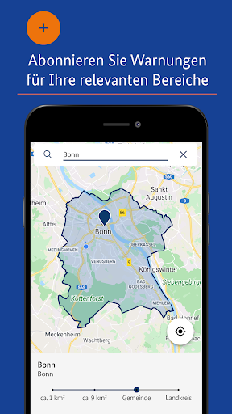

# NINA - Die Warn-App des BBK
App version ``3.3.2.3001``

Analyzed with [covid-apps-observer](http://github.com/covid-apps-observer) project, version ``0.1``

## App overview
| | |
|-------------------------|-------------------------| 
| **Name**&nbsp;&nbsp;&nbsp;&nbsp;&nbsp;&nbsp;&nbsp;&nbsp;&nbsp;&nbsp;&nbsp;&nbsp;&nbsp;&nbsp;&nbsp;&nbsp;&nbsp;&nbsp;&nbsp;&nbsp;&nbsp;&nbsp;&nbsp;&nbsp;&nbsp;&nbsp;&nbsp;&nbsp;&nbsp;&nbsp;&nbsp;&nbsp;&nbsp;&nbsp;&nbsp;&nbsp;&nbsp;&nbsp;&nbsp;&nbsp;  | NINA - Die Warn-App des BBK |
| **Unique identifier** | de.materna.bbk.mobile.app |
| **Link to Google Play** | [https://play.google.com/store/apps/details?id=de.materna.bbk.mobile.app](https://play.google.com/store/apps/details?id=de.materna.bbk.mobile.app) |
| **Summary**  | Die Notfall-Informations- und Nachrichten-App des BBK |
| **Privacy policy** | [http://www.bbk.bund.de/NINA-Datenschutz](http://www.bbk.bund.de/NINA-Datenschutz) |
| **Latest version** | 3.3.2.3001 |
| **Last update** | 2021-03-17 08:30:15 |
| **Recent changes** | - Es wurde ein Fehler behoben, der beim Nachladen für Ruckler im Dashboard gesorgt hat - Fehler bei abonnieren der Standortes behoben - Weitere Fehlerbehebung |
| **Installs**  | 1.000.000+ |
| **Category** | Nachrichten & Zeitschriften |
| **First release** | 22.05.2015 |
| **Size**  | 28M |
| **Supported Android version**  | 6.0 oder höher |

### Description
> Die Warn-App NINA (Notfall-Informations- und Nachrichten-App) warnt Sie deutschlandweit vor Gefahren, auf Wunsch auch für Ihren aktuellen Standort. Die App wird vom Bundesamt für Bevölkerungsschutz und Katastrophenhilfe (BBK) bereitgestellt.
 Technischer Ausgangspunkt für NINA ist das modulare Warnsystem des Bundes (MoWaS). Dieses wird vom BBK für bundesweite Warnungen des Zivilschutzes betrieben. Seit 2013 können auch alle Lagezentren der Länder und viele bereits angeschlossenen Leitstellen von Städten und Kommunen das Warnsystem nutzen (http://www.bbk.bund.de/DE/NINA/Warnung/Warnung.html). 
 <b>Hinweis: nicht überall sind auch Warnmeldungen zu lokalen Ereignissen erhältlich. Bitte informieren Sie sich bei Ihrem Landkreis oder Ihrer Stadt, welche Möglichkeiten zur Warnung der Bevölkerung dort eingesetzt werden.</b>
 Mit NINA erhalten Sie:
 •	Warnmeldungen des Bevölkerungsschutzes mit Handlungsempfehlungen 
 •	Wetterwarnungen des DWD (deutschlandweit für alle Landkreis und Städte)
 •	Hochwasserinformationen (deutschlandweit auf Bundeslandebene)
 •	allgemeine Notfalltipps, damit Sie sich und andere vor möglichen Gefahren schützen können.
 Mit NINA können Sie Orte auswählen, für die Sie Warnmeldungen erhalten möchten. Diese werden in der Übersicht „Meine Orte“ angezeigt. Im Einstellungsmenü können Sie festlegen, bei welcher Warnstufe Sie per Push-Benachrichtigung informiert werden sollen. Optional können Sie auch Warnmeldungen für Ihren aktuellen Standort erhalten. Dabei werden keine Standortdaten auf unseren Servern gespeichert. Bitte beachten Sie: Um standortbezogene Warnungen korrekt darstellen zu können, muss NINA Ihren Standort bestimmen können. Bei schlechtem Empfang kann es zu fehlerhaften Anzeigen kommen.
 Das Gefahrengebiet einer Warnmeldung kann in der Kartenansicht angezeigt werden. Die Hochwasserinformationen werden aktuell nur auf Bundeslandebene herausgegeben. In der Karte werden alle vorliegenden Warnmeldungen angezeigt, auch wenn Sie den Ort nicht ausgewählt haben.
 Die Notfalltipps enthalten Empfehlungen zu Themen wie Hochwasser, Unwetter, Stromausfall, Feuer und besondere Gefahrenlagen. Informieren Sie sich, wie Sie sich auf solche Ereignisse vorbereiten können. Ebenso finden Sie Verhaltenshinweise für den Fall, dass Sie von einem Ereignis betroffen sind. Mit den praktischen Checklisten können Sie gleich loslegen.
 Hinweise zu den Berechtigungen in der App:
 Zugriff auf den Speicher (Android 8 und höher): Die Warn-App NINA bietet die Möglichkeit den bekannten Sirenenton auf das Smartphone zu kopieren. Um dieses kopieren zu ermöglichen wird diese Berechtigung benötigt. Nach dem Abschluss des Kopiervorgang kann die Berechtigung wieder entfernt werden. Für eine Funktion der Warn-App ist die Berechtigung nicht erforderlich.
 Eigener Standort: Warnmeldungen für Ihren aktuellen Standort sind nur bei Nutzung von GPS, WLAN und anderen Geolokalisierungsdiensten möglich. Haben Sie diese Dienste auf Ihrem Gerät deaktiviert, können Sie keine standortbezogenen Warnmeldungen erhalten.
 Sie haben Fragen zur Warn-App NINA oder möchten uns Ihr Feedback geben? Dann wenden Sie sich bitte an nina@bbk.bund.de. Weitere Informationen erhalten Sie auch unter http://www.bbk.bund.de/NINA.
 Wichtig:
 Warnungen und Informationen können Sie nur mit einer Datenverbindung (per WLAN oder mobil) empfangen. Verfügt Ihr Gerät über keine Datenverbindung, wird der letzte auf dem Gerät gespeicherte Stand angezeigt.

### User interface
The developers of the app provide the following screenshots in the Google play store.
| | | |
|:-------------------------:|:-------------------------:|:-------------------------:|
 |   |   |   | 
 |   |   |   | 
 |   |   |   | 
 |   |   |   | 
 |   |   |   | 
 |   |   |   | 

## Development team
In the following we report the main information provided by the development team in the Google play store.

| | |
|-------------------------|-------------------------|
| **Developer**  | Bundesamt für Bevölkerungsschutz (Deutschland) |
| **Website**  | [http://www.bbk.bund.de/DE/NINA/Warn-App_NINA_node.html](http://www.bbk.bund.de/DE/NINA/Warn-App_NINA_node.html) |
| **Email** | nina@bbk.bund.de |
| **Physical address**  | [Provinzialstr. 93 53127 Bonn](https://www.google.com/maps/search/Provinzialstr.%2093%2053127%20Bonn) (Google Maps) |
| **Other developed apps**  | [https://play.google.com/store/apps/developer?id=Bundesamt+f%C3%BCr+Bev%C3%B6lkerungsschutz+(Deutschland)](https://play.google.com/store/apps/developer?id=Bundesamt+f%C3%BCr+Bev%C3%B6lkerungsschutz+(Deutschland)) |

## Android support

| | |
|-------------------------|-------------------------|
| **Declared target Android version**  | - |
| **Effective target Android version**  | - |
| **Minimum supported Android version**  | Marshmallow, version 6.0 (API level 23) |
| **Maximum target Android version**  | - |

The larger the difference between the minimum and maximum supported Android versions, the better. A larger difference means a wider audience. For example, old phones have a very low Android version, so a high minimum supported Android version means that the app cannot be used by users with old phones, thus leading to accessibility problems. 

## Requested permissions

In the following we report the complete list of the permissions requested by the app. 

| **Permission** | **Protection level** | **Description** | 
|-------------------------|-------------------------|-------------------------|
 **android.permission ACCESS_BACKGROUND_LOCATION** | :warning:**Dangerous** | Allows an app to access location in the background. 
 **android.permission ACCESS_COARSE_LOCATION** | :warning:**Dangerous** | Allows an app to access approximate location. 
 **android.permission ACCESS_FINE_LOCATION** | :warning:**Dangerous** | Allows an app to access precise location. 
 **android.permission ACCESS_NETWORK_STATE** | Normal | Allows applications to access information about networks. 
 **android.permission ACCESS_WIFI_STATE** | Normal | Allows applications to access information about Wi-Fi networks. 
 **android.permission FOREGROUND_SERVICE** | Normal | Allows a regular application to use Service.startForeground. 
 **android.permission INTERNET** | Normal | Allows applications to open network sockets. 
 **android.permission REQUEST_IGNORE_BATTERY_OPTIMIZATIONS** | Normal | Permission an application must hold in order to use Settings.ACTION_REQUEST_IGNORE_BATTERY_OPTIMIZATIONS. 
 **android.permission VIBRATE** | Normal | Allows access to the vibrator. 
 **android.permission WAKE_LOCK** | Normal | Allows using PowerManager WakeLocks to keep processor from sleeping or screen from dimming. 
 **android.permission WRITE_EXTERNAL_STORAGE** | :warning:**Dangerous** | Allows an application to write to external storage. 
 **com.google.android.c2dm.permission RECEIVE** | - | - 
 **com.google.android.finsky.permission BIND_GET_INSTALL_REFERRER_SERVICE** | - | - 

## Mentioned servers

| **Server** | **Registrant** | **Registrant country** | **Creation date** | 
|-------------------------|-------------------------|-------------------------|-------------------------|
 | google.com | Google LLC | :us: US | 1997-09-15 04:00:00 |
 | app-measurement.com | Google LLC | :us: US | 2015-06-19 20:13:31 |
 | googleapis.com | Google LLC | :us: US | 2005-01-25 17:52:26 |
 | googlesyndication.com | Google LLC | :us: US | 2003-01-21 06:17:24 |
 | crashlytics.com | Google LLC | :us: US | 2011-01-21 15:30:40 |
 | googleadservices.com | Google LLC | :us: US | 2003-06-19 16:34:53 |

## Security analysis 

Below we report the main security warnings raised by our execution of the [Androwarn](https://github.com/maaaaz/androwarn) security analysis tool.

**Connection interfaces exfiltration**
> - This application reads details about the currently active data network 

**Suspicious connection establishment**
> - This application opens a Socket and connects it to the remote address ' returned no addresses for  ; port is out of range' on the 'N/A' port  
> - This application opens a Socket and connects it to the remote address '' on the 'N/A' port  
> - This application opens a Socket and connects it to the remote address 'Ljava/net/Proxy;->type()Ljava/net/Proxy$Type;' on the 'N/A' port  
> - This application opens a Socket and connects it to the remote address 'timeout' on the 'N/A' port  

**Code execution**
> - This application loads a native library: 'crashlytics' 
> - This application executes a UNIX command containing this argument: 'logcat -b main -d' 

## User ratings and reviews

Below we provide information about how end users are reacting to the app in terms of ratings and reviews in the Google Play store.

### Ratings

The NINA - Die Warn-App des BBK app has been installed by more than **1000000** times. At this time, **19429** rated the app and its average score is **3.2960122**. Below we show the distribution of the ratings across the usual star-based rating of Google Play

:star::star::star::star::star:: 7937

:star::star::star::star:: 2503

:star::star::star:: 1867

:star::star:: 1619

:star:: 5503

### Reviews 

#### 5-star reviews

> Sehr gute und nützliche APP  :date: __2021-07-10 18:21:15__

> Immer aktuell  :date: __2021-07-10 09:35:21__

> Ich benutze NINA seit der ersten Stunde. Bin zufrieden und macht was sie soll. Benutze NINA für meinen Dienst in der Feuerwehr und im Katastrophenschutz. Für die Leute die alles schlecht reden und machen : Das Wetter macht was es will. BBK in Bonn macht die Warungen nicht, sondern bekommt sie von den Behörden von den Bundesländer , Kreisverwaltung , DWD , etc. Wenn NINA nicht klingeln , Bedienerfehl , Smartphone richtig einstellen. Die Sirene als Warnton muss man sich kostenlos herunterladen.  :date: __2021-07-08 17:04:39__

> Der eigentliche Warnton geht auf dem S9 nicht  :date: __2021-07-08 10:11:09__

> Super ap  :date: __2021-07-07 13:59:15__

> Sehr gut  :date: __2021-07-06 13:56:03__

> Immer Top aktuell  :date: __2021-07-04 23:46:17__

> Funktioniert bei mir sehr gut!  :date: __2021-07-01 13:58:50__

> Gut  :date: __2021-07-01 11:53:47__

> Hilfreich  :date: __2021-06-30 17:53:36__

#### 4-star reviews

> Also die Wetterwarnungen sind gut und treffen meistens zu. Bei den Corona Informationen muss aber nochmal nachgebessert werden. Die letzte Aktualisierung ist von Mitte Juni. Mir wird immer noch Infektionsstufe 2 angezeigt. Die Regeln sind andere. Also wenn man es anbietet sollte es auf dem laufenden gehalten werden.  :date: __2021-07-08 20:18:50__

> Wenn die App geöffnet wird ( wlan ) sucht und findet sie keine Daten. Bei mobilen Daten keine Probleme.  :date: __2021-06-30 08:27:25__

> Urspr. 1*Bewertung: App tut nicht das, was sie soll: warnen. Weder bei den letzten landesweiten Probealarmen, noch bei tatsächlichen Gefahrenlagen und Unwettern. Alle Berechtigungen erteilt, im Hintergrund aktiviert, aber es kommen einfach keine Pushbenachrichtigungen. EDIT: nun 4 Sterne, da Warnungen wieder durchkommen. Neuinstallation brachte nichts, dafür folgendes: Hintergrundaktivität von automatisch auf "manuell verwalten" stellen, dann klappt es.  :date: __2021-06-28 15:49:53__

> Nina warnt zuverlässig und schnell.  :date: __2021-06-28 15:42:23__

> Die Warnmeldungen bei den eingetragenen Städten sowie vom aktuellen Standort funktionieren Recht gut! Meldungen von Produktrückrufen, Vermisstenmeldungen und Cybersicherheit wären noch wünschenswert!  :date: __2021-06-24 07:19:56__

> Gute App, aber es gibt einen großen Makel: wenn ich in der Benachrichtigungsleiste eine Meldung bekomme und sie anklicke, dann erfolgt in der App erst nochmal eine Server-Anfrage. Eigentlich sollte die Meldung doch direkt verfügbar sein und keine weitere Anfrage benötigen. Wenn ich zwischen Empfang einer Warnung und Aufruf offline gehe, kann ich die Meldung in der App nicht sehen.  :date: __2021-06-23 17:46:34__

> 3r34ist war noch t4433 r345  :date: __2021-06-22 17:28:54__

> Ganz im Anfang war es eine tolle Sache, aber eine Warn App, die keine Warnung anzeigt, ist wenig hilfreich. Über die aktuelle Trinkwasser Verunreinigung in meinem Kreis habe ich die Info erst über Facebook gelesen, dann bei Nina geschaut, wo sie schlummernd und still stand. Trotz aller aktivierten Benachrichtigungsoptionen. Hier muss dringend nachgebessert werden. UPDATE: Nachdem ich die App deinstalliert und dann wieder neu installiert habe, funktioniert sie wieder wie sie soll.  :date: __2021-06-20 15:22:10__

> Neue Bewertung: Die App an sich scheint gut zu funktionieren. Die eingepflegten Daten sind nicht immer so gut. Bsp: Meldung: "Amtliche Warnung vor extremer Hitze" Handlungsempfehlung: "Heute ist der dritte Tag in Folge". Bin kein Linguist, aber nach meinen Verständnis sollte da sowas wie viel trinken und im Schatten laufen stehen. Ansonsten werden Die Daten ganz gut Angezeigt.  :date: __2021-06-19 17:28:01__

> Alle eigentlich ganz geil so mit Wetterwarnung und Überflutungswarnungen, was jetzt aber nachmal richtig gut währe währe auch eine Option für Brandgefahr. Grad bei so heißem Wetter nicht grade Unnütz. Kommt n Reiter für Brandgefahr kommt hier auch der fünfte Stern.  :date: __2021-06-18 12:48:12__

#### 3-star reviews

> Seit Monaten werden probealarme nicht mehr mitgeteilt  :date: __2021-07-09 18:38:50__

> Irgendwie werden die Stufen falsch angezeigt. Lauter Verordnung andere Stufen der Inzidenzwerte.  :date: __2021-07-09 10:14:32__

> Leider muss ich jetzt vorübergehend erst einmal 2 meiner 5 Sterne der Bewertung abziehen. In der letzten Zeit kommen so viele identische Warnmeldungen zum Wetter rein, dass man die App mittlerweile grundsätzlich ignoriert. Bspw. macht es keinen Sinn, dass wenn der aktuelle Ort auch ein gespeicherter Ort unter Beobachtung ist, jede Meldung doppelt per Push ausgegeben wird.  :date: __2021-07-08 18:26:54__

> Wieviel Unwetterwarnungen wollt ihr denn noch bei leichtem Regen rausgeben ? 3 in einer Stunde reicht doch. Ihr nervt.  :date: __2021-07-08 18:11:53__

> Bis vor zwei Wochen war ich super zufrieden. Nun stelle ich fest, dass sich die App im Wlan nicht mehr aktualisiert. Ich muss erst in die mobilen Daten wechseln, dann bekomme ich z.B. die aus der Benachrichtigung angekündigte Warnung angezeigt. Hab die App schon bereingt, also Cache und Daten gelöscht, aber keine Veränderung. Schade!  :date: __2021-07-08 10:33:46__

> Die Wetterwarnungen funktionieren seit dem Update nicht mehr. Nur noch Push Benachrichtigung dazu. Und nein, es liegt nicht an der schnellen Entwarnung. Mittlerweile funktioniert es wieder. Ich verwende ein OnePlus N10, Android 10.  :date: __2021-07-04 21:18:34__

> Was bringt mir ne App, die mich erst ne halbe Std. nach dem Express vor der Gefahrenlage warnt?! Hatten hier 2 mal nen Grossbrand und jedesmal wurde ich durch die Presse wesentlich früher gewarnt und darauf hingewiesen die Fenster und Türen zu schließen, als von NINA. DAS SOLLTE DOCH ANDERS HERUM SEIN?!  :date: __2021-07-03 18:27:41__

> Die Coronameldung ist leider immer noch da. Andere Fehler sind behoben immer noch. Wäre schön, wenn die mal verschwinden würden. Dann gibt es auch 5 Sterne.  :date: __2021-07-02 20:41:57__

> Soweit funktioniert die App gut. Ich musste gerade aber feststellen das die App bei mir 6Gb gross ist?!  :date: __2021-07-02 13:03:16__

> Bei Einstellung 'Wetterwarnungen' ab 'markantes Wetter' werd' ich irre. Teilweise werden mehrere Meldungen pro Tag ausgegeben, aber das Ereignis tritt nur sehr selten ein. Falls doch, ist es bisher kein Unwetter gewesen, nicht mal markantes Wetter. Lasst das mit den Wettermeldungen bleiben, damit demontiert ihr nur die Glaubwürdigkeit der App.  :date: __2021-06-29 16:18:57__

#### 2-star reviews

> Nicht so gut  :date: __2021-07-11 09:49:12__

> Funktioniert seid 3 Tagen nicht mehr richtig Warnung kommt an aber mein Gebiet wenn ich anklicken will zeigt er fehler  :date: __2021-07-08 17:17:41__

> Zu wenig warnungen  :date: __2021-07-08 11:37:34__

> Sehr gute Idee, Ausführung auch ganz gut, aber die Aktualisierung der Gefahrinformationen erfolgt trödelig oder überhaupt nicht! Beispiel: Corona-Infos vom Oktober letzten Jahres werden immer noch angezeigt! Da guckt doch keiner mehr hin! Manfred Märtens  :date: __2021-07-06 13:35:20__

> Bei Verwendung des aktuellen Standortes tritt immer wieder ein Standortfehler auf. "Die Ortungsfunktionen sind nicht korrekt eingestellt!" Weitere Informationen zu diesem Fehler erhält man nicht.  :date: __2021-07-05 15:57:36__

> Bei Verwendung des aktuellen Standortes tritt immer wieder ein Standortefehler auf. "Die Ortungsfunktionen sind nicht korrekt eingestellt!" Weitere Informationen zu diesem Fehler erhält man nicht.  :date: __2021-07-05 15:55:01__

> Bekomme Unwetterwarnung aber da steht nichts von. Nur corona ohne Ende. Und löschen kann man die alten Meldungen nicht.  :date: __2021-07-04 22:00:09__

> Zwei Punkte stören mich sehr an der App: 1. Ganz Deutschland hat nun bereits seit mehr als einem Jahr und 3 Monaten eine Warnung bzgl. Corona laufen. Das betrifft auch die Kartendarstellung. Um die App korrekt nutzen zu können, muss man die bekannten Coronahinweise, auch in der Karte, deaktivieren können. Dies überschattet sonst jede andere Gefahr. Gerne können neue C.-Meldungen dann wieder auftauchen. 2. Ich bekomme keine Warnungen bzgl. markanten Wetters/Unwetters zugestellt. Mit WO geht es.  :date: __2021-07-03 23:43:31__

> Ständig zeigt die app unwetter an. In den letzten 48 Stunden ungefähr 10 mal und es war weder Gewitter noch Starkregen  :date: __2021-07-01 16:48:55__

> Die im Grunde nicht schlechte App knallt den Cache zu. 6 GB im Speicher sind einfach zu viel. Cache und App gelöscht, obwohl die App zuverlässig warnt.  :date: __2021-07-01 06:45:13__

#### 1-star reviews

> Ich habe seit dem Update ebenfalls das Problem, dass sich der Link zur eigentlichen Warnung nicht mehr öffnen lässt.  :date: __2021-07-11 10:59:33__

> Warnt vor gar nix Völlig unbrauchbar  :date: __2021-07-09 20:39:05__

> Leider viele Fehlalarme. Vor Allem in Bezug auf Unwetter.  :date: __2021-07-09 18:01:55__

> Seit dem letzten Update funktioniert die App nicht mehr richtig. Sie teilt zwar eine Warnung mit, kann sie aber nicht mehr anzeigen.  :date: __2021-07-09 16:43:11__

> Warnungen kommen viel zu spät! Unwetterwarnungen Nachdem das unwetter bereits durchgezogen ist. Und und und. Für mich ist die App ziemlich sinnfrei.  :date: __2021-07-09 14:00:14__

> Ich habe seit Monaten keine Alarmmeldung bekommen, nicht mal wegen dem Wetter! Die letzte Meldung kam am 14.10.2020, obwohl ich im Januar aktualisiert habe. Gut gemeint, schlecht gemacht! Unnütze App  :date: __2021-07-07 19:39:00__

> Eigentlich ganz nett. Aber da man die sicherlich allgemein bekannte Corona-Maßnahmen-Situation nicht ausblenden kann gehen wichtige (heißt neue, aktuelle) Situationen unter. Damit aktuell unbrauchbar. Wenn Corona interessiert nutzt man auch die Corona-Apps, das hat in dieser App nichts zu suchen.  :date: __2021-07-07 15:53:38__

> Seitenweise komische Corona Texte, für solchen Quatsch habe ich diese App nicht auf dem Handy. Bitte bereinigt diese App von diesen Virus Informationen im Auftrag der Regierung und Pharmaindustrie. Hier in Rudolstadt ging eben die Sirene 6x und dazu gibt es keine Information in der App? Sinnlos! Sirene 6x heißt Warnung der Bevölkerung vor einer Katastrophe. Sinnlos denn es war nix los!  :date: __2021-07-05 23:28:19__

> Keine Push-Warnungen, veraltete Corona-Regeln, also unbrauchbar. Galaxy A70, Android 11, Standort immer aktiviert  :date: __2021-07-05 14:37:58__

> Funktioniert nicht bei Meldungen, keine Benachrichtigung, kein Klingelton, samsung galaxy s21plus,Android11,mobile Daten ist on,trotzdem keine Benachrichtigung bei meinen Einstellungen zur gefahrenlage, wetter,corona,usw.habe den Sirenenton download gemacht und funktioniert auch nicht.  :date: __2021-07-05 05:01:31__

