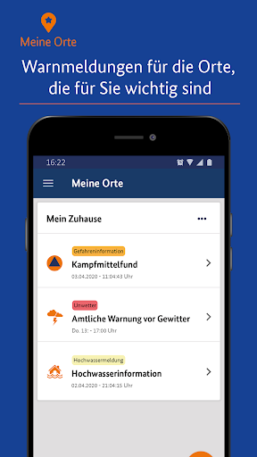

# NINA - Die Warn-App des BBK
App version ``3.3.2.3001``

Analyzed with [covid-apps-observer](http://github.com/covid-apps-observer) project, version ``0.1``

## App overview
| | |
|-------------------------|-------------------------| 
| **Name**&nbsp;&nbsp;&nbsp;&nbsp;&nbsp;&nbsp;&nbsp;&nbsp;&nbsp;&nbsp;&nbsp;&nbsp;&nbsp;&nbsp;&nbsp;&nbsp;&nbsp;&nbsp;&nbsp;&nbsp;&nbsp;&nbsp;&nbsp;&nbsp;&nbsp;&nbsp;&nbsp;&nbsp;&nbsp;&nbsp;&nbsp;&nbsp;&nbsp;&nbsp;&nbsp;&nbsp;&nbsp;&nbsp;&nbsp;&nbsp;  | NINA - Die Warn-App des BBK |
| **Unique identifier** | de.materna.bbk.mobile.app |
| **Link to Google Play** | [https://play.google.com/store/apps/details?id=de.materna.bbk.mobile.app](https://play.google.com/store/apps/details?id=de.materna.bbk.mobile.app) |
| **Summary**  | Die Notfall-Informations- und Nachrichten-App des BBK |
| **Privacy policy** | [http://www.bbk.bund.de/NINA-Datenschutz](http://www.bbk.bund.de/NINA-Datenschutz) |
| **Latest version** | 3.3.2.3001 |
| **Last update** | 2021-03-17 08:30:15 |
| **Recent changes** | - Es wurde ein Fehler behoben, der beim Nachladen für Ruckler im Dashboard gesorgt hat - Fehler bei abonnieren der Standortes behoben - Weitere Fehlerbehebung |
| **Installs**  | 1.000.000+ |
| **Category** | Nachrichten & Zeitschriften |
| **First release** | 22.05.2015 |
| **Size**  | 28M |
| **Supported Android version**  | 6.0 oder höher |

### Description
> Die Warn-App NINA (Notfall-Informations- und Nachrichten-App) warnt Sie deutschlandweit vor Gefahren, auf Wunsch auch für Ihren aktuellen Standort. Die App wird vom Bundesamt für Bevölkerungsschutz und Katastrophenhilfe (BBK) bereitgestellt.
 Technischer Ausgangspunkt für NINA ist das modulare Warnsystem des Bundes (MoWaS). Dieses wird vom BBK für bundesweite Warnungen des Zivilschutzes betrieben. Seit 2013 können auch alle Lagezentren der Länder und viele bereits angeschlossenen Leitstellen von Städten und Kommunen das Warnsystem nutzen (http://www.bbk.bund.de/DE/NINA/Warnung/Warnung.html). 
 <b>Hinweis: nicht überall sind auch Warnmeldungen zu lokalen Ereignissen erhältlich. Bitte informieren Sie sich bei Ihrem Landkreis oder Ihrer Stadt, welche Möglichkeiten zur Warnung der Bevölkerung dort eingesetzt werden.</b>
 Mit NINA erhalten Sie:
 •	Warnmeldungen des Bevölkerungsschutzes mit Handlungsempfehlungen 
 •	Wetterwarnungen des DWD (deutschlandweit für alle Landkreis und Städte)
 •	Hochwasserinformationen (deutschlandweit auf Bundeslandebene)
 •	allgemeine Notfalltipps, damit Sie sich und andere vor möglichen Gefahren schützen können.
 Mit NINA können Sie Orte auswählen, für die Sie Warnmeldungen erhalten möchten. Diese werden in der Übersicht „Meine Orte“ angezeigt. Im Einstellungsmenü können Sie festlegen, bei welcher Warnstufe Sie per Push-Benachrichtigung informiert werden sollen. Optional können Sie auch Warnmeldungen für Ihren aktuellen Standort erhalten. Dabei werden keine Standortdaten auf unseren Servern gespeichert. Bitte beachten Sie: Um standortbezogene Warnungen korrekt darstellen zu können, muss NINA Ihren Standort bestimmen können. Bei schlechtem Empfang kann es zu fehlerhaften Anzeigen kommen.
 Das Gefahrengebiet einer Warnmeldung kann in der Kartenansicht angezeigt werden. Die Hochwasserinformationen werden aktuell nur auf Bundeslandebene herausgegeben. In der Karte werden alle vorliegenden Warnmeldungen angezeigt, auch wenn Sie den Ort nicht ausgewählt haben.
 Die Notfalltipps enthalten Empfehlungen zu Themen wie Hochwasser, Unwetter, Stromausfall, Feuer und besondere Gefahrenlagen. Informieren Sie sich, wie Sie sich auf solche Ereignisse vorbereiten können. Ebenso finden Sie Verhaltenshinweise für den Fall, dass Sie von einem Ereignis betroffen sind. Mit den praktischen Checklisten können Sie gleich loslegen.
 Hinweise zu den Berechtigungen in der App:
 Zugriff auf den Speicher (Android 8 und höher): Die Warn-App NINA bietet die Möglichkeit den bekannten Sirenenton auf das Smartphone zu kopieren. Um dieses kopieren zu ermöglichen wird diese Berechtigung benötigt. Nach dem Abschluss des Kopiervorgang kann die Berechtigung wieder entfernt werden. Für eine Funktion der Warn-App ist die Berechtigung nicht erforderlich.
 Eigener Standort: Warnmeldungen für Ihren aktuellen Standort sind nur bei Nutzung von GPS, WLAN und anderen Geolokalisierungsdiensten möglich. Haben Sie diese Dienste auf Ihrem Gerät deaktiviert, können Sie keine standortbezogenen Warnmeldungen erhalten.
 Sie haben Fragen zur Warn-App NINA oder möchten uns Ihr Feedback geben? Dann wenden Sie sich bitte an nina@bbk.bund.de. Weitere Informationen erhalten Sie auch unter http://www.bbk.bund.de/NINA.
 Wichtig:
 Warnungen und Informationen können Sie nur mit einer Datenverbindung (per WLAN oder mobil) empfangen. Verfügt Ihr Gerät über keine Datenverbindung, wird der letzte auf dem Gerät gespeicherte Stand angezeigt.

### User interface
The developers of the app provide the following screenshots in the Google play store.
| | | |
|:-------------------------:|:-------------------------:|:-------------------------:|
 |   |   |   | 
 |   |   |   | 
 |   |   |   | 
 |   |   |   | 
 |   |   |   | 
 |   |   |   | 

## Development team
In the following we report the main information provided by the development team in the Google play store.

| | |
|-------------------------|-------------------------|
| **Developer**  | Bundesamt für Bevölkerungsschutz (Deutschland) |
| **Website**  | [http://www.bbk.bund.de/DE/NINA/Warn-App_NINA_node.html](http://www.bbk.bund.de/DE/NINA/Warn-App_NINA_node.html) |
| **Email** | nina@bbk.bund.de |
| **Physical address**  | [Provinzialstr. 93 53127 Bonn](https://www.google.com/maps/search/Provinzialstr.%2093%2053127%20Bonn) (Google Maps) |
| **Other developed apps**  | [https://play.google.com/store/apps/developer?id=Bundesamt+f%C3%BCr+Bev%C3%B6lkerungsschutz+(Deutschland)](https://play.google.com/store/apps/developer?id=Bundesamt+f%C3%BCr+Bev%C3%B6lkerungsschutz+(Deutschland)) |

## Android support

| | |
|-------------------------|-------------------------|
| **Declared target Android version**  | - |
| **Effective target Android version**  | - |
| **Minimum supported Android version**  | Marshmallow, version 6.0 (API level 23) |
| **Maximum target Android version**  | - |

The larger the difference between the minimum and maximum supported Android versions, the better. A larger difference means a wider audience. For example, old phones have a very low Android version, so a high minimum supported Android version means that the app cannot be used by users with old phones, thus leading to accessibility problems. 

## Requested permissions

In the following we report the complete list of the permissions requested by the app. 

| **Permission** | **Protection level** | **Description** | 
|-------------------------|-------------------------|-------------------------|
 **android.permission ACCESS_BACKGROUND_LOCATION** | :warning:**Dangerous** | Allows an app to access location in the background. 
 **android.permission ACCESS_COARSE_LOCATION** | :warning:**Dangerous** | Allows an app to access approximate location. 
 **android.permission ACCESS_FINE_LOCATION** | :warning:**Dangerous** | Allows an app to access precise location. 
 **android.permission ACCESS_NETWORK_STATE** | Normal | Allows applications to access information about networks. 
 **android.permission ACCESS_WIFI_STATE** | Normal | Allows applications to access information about Wi-Fi networks. 
 **android.permission FOREGROUND_SERVICE** | Normal | Allows a regular application to use Service.startForeground. 
 **android.permission INTERNET** | Normal | Allows applications to open network sockets. 
 **android.permission REQUEST_IGNORE_BATTERY_OPTIMIZATIONS** | Normal | Permission an application must hold in order to use Settings.ACTION_REQUEST_IGNORE_BATTERY_OPTIMIZATIONS. 
 **android.permission VIBRATE** | Normal | Allows access to the vibrator. 
 **android.permission WAKE_LOCK** | Normal | Allows using PowerManager WakeLocks to keep processor from sleeping or screen from dimming. 
 **android.permission WRITE_EXTERNAL_STORAGE** | :warning:**Dangerous** | Allows an application to write to external storage. 
 **com.google.android.c2dm.permission RECEIVE** | - | - 
 **com.google.android.finsky.permission BIND_GET_INSTALL_REFERRER_SERVICE** | - | - 

## Mentioned servers

| **Server** | **Registrant** | **Registrant country** | **Creation date** | 
|-------------------------|-------------------------|-------------------------|-------------------------|
 | google.com | Google LLC | :us: US | 1997-09-15 04:00:00 |
 | app-measurement.com | Google LLC | :us: US | 2015-06-19 20:13:31 |
 | googleapis.com | Google LLC | :us: US | 2005-01-25 17:52:26 |
 | googlesyndication.com | Google LLC | :us: US | 2003-01-21 06:17:24 |
 | crashlytics.com | Google LLC | :us: US | 2011-01-21 15:30:40 |
 | googleadservices.com | Google LLC | :us: US | 2003-06-19 16:34:53 |

## Security analysis 

Below we report the main security warnings raised by our execution of the [Androwarn](https://github.com/maaaaz/androwarn) security analysis tool.

**Connection interfaces exfiltration**
> - This application reads details about the currently active data network 

**Suspicious connection establishment**
> - This application opens a Socket and connects it to the remote address ' returned no addresses for  ; port is out of range' on the 'N/A' port  
> - This application opens a Socket and connects it to the remote address '' on the 'N/A' port  
> - This application opens a Socket and connects it to the remote address 'Ljava/net/Proxy;->type()Ljava/net/Proxy$Type;' on the 'N/A' port  
> - This application opens a Socket and connects it to the remote address 'timeout' on the 'N/A' port  

**Code execution**
> - This application loads a native library: 'crashlytics' 
> - This application executes a UNIX command containing this argument: 'logcat -b main -d' 

## User ratings and reviews

Below we provide information about how end users are reacting to the app in terms of ratings and reviews in the Google Play store.

### Ratings

The NINA - Die Warn-App des BBK app has been installed by more than **1000000** times. At this time, **19429** rated the app and its average score is **3.2960122**. Below we show the distribution of the ratings across the usual star-based rating of Google Play

:star::star::star::star::star:: 7937

:star::star::star::star:: 2503

:star::star::star:: 1867

:star::star:: 1619

:star:: 5503

### Reviews 

#### 5-star reviews

> Sehr benutzer:innenfreundlich, übersichtlich und hilfreich gestaltet! Auch mit Hinweisen und Hilfen, sowie aktuellen Meldungen zum Thema Corona.  :date: __2021-05-01 11:24:07__

> Sehr schnelle Info bei Gefahr  :date: __2021-05-01 11:04:25__

> Sehr hilfreich, schnell und übersichtlich.  :date: __2021-04-30 21:56:11__

> Super, würde gerne den Quellcode sehen. Wo finde ich den?  :date: __2021-04-29 21:40:50__

> Ich finde die echt gut👍  :date: __2021-04-28 19:31:32__

> Sehr gute App LG Henry  :date: __2021-04-28 09:17:19__

> Gute Erfahrungen... Allerdings: sind aktuell die Kontaktbeschränkungen in Bayern in der Infektionsgefahr Stufe 5 bei "2 Haushalte und 5 Personen", und nicht wie bisher bei "1 Haushalt und 1 Person"? Dachte die Einschränkungen wurden größer... Es sollte in der App eine Art Hotline geben, in der man solche Fragen direkt stellen kann...  :date: __2021-04-27 19:10:58__

> Die Einbindung der Tagesaktuellen Inzidenz der einzelnen Städte wäre toll. Ansonsten läuft die App perfekt  :date: __2021-04-26 12:15:58__

> Die App ist jetzt betreffend der Corona Situation sehr nützlich, da sie in meinem Landkreis die aktuellen Regeln der Regierung anzeigt sowie die 7 Tage Inzidenz des Landkreises und extra noch die des Bundeslandes.  :date: __2021-04-24 10:59:07__

> Super App nur nicht immer auf dem neuesten Stand  :date: __2021-04-24 00:21:14__

#### 4-star reviews

> Seit November gibt es keine datenupdats mehr. Bitte mal überprüfen  :date: __2021-04-28 10:07:53__

> Ich finde die Inhalte gut, und die Aufarbeitung der Coronaregeln sehr hilfreich. Allerdings werden die Informationen nur geladen, wenn ich mein WLAN abschalte. Habe ich mein WLAN an, lädt nichts, und nach einer Weile werde ich gebeten, sicherzustellen, dass ich eine Internetverbindung habe. Das ist vermutlich nicht so gedacht ;)  :date: __2021-04-25 09:50:15__

> Die App funktioniert wieder einwandfrei. Danke an NINA-HD. Derzeit teste ich sie noch auf ihre weiteren Funktionalitäten.  :date: __2021-04-25 07:53:48__

> Gute App, macht was sie soll. Ist aktuell und zeigt die relevanten Informationen an. Die Text Darstellung finde ich nicht gut, es fehen Hervorhebungen, klickbares Inhaltsverzeichnis und Abtrennen der Inhalten mit Überschritten. Zudem wäre eine Suchfunktion super den Info- Text zu durchsuchen. Das Menü verschwindet schneller als ich es lesen kann.  :date: __2021-04-23 10:39:21__

> Prinzipiell gute Idee. Wie kommen aber die starken Abweichungen bei den Inzidenzwerten gegenüber offiziellen Stellen zustande? Heute 22.4.21 für LK Peine in der App ein Wert von 115, offizielle Stellen 192.  :date: __2021-04-22 19:03:02__

> An sich super allerdings sollten bei der Karte die Coronameldungen ausschließlich auf den Corona Reiter beschränkt, da man aufgrund ihrer Farbe keinen Unterschied zu normalen Meldungen erkennen kann.  :date: __2021-04-15 09:00:47__

> Ausbaufähig aber erfüllt seinen Zweck. Vertrauen in richtige push Benachrichtigungen mit angemessener Benachrichtigung habe ich aber verloren.  :date: __2021-04-13 21:32:23__

> Sehr gut gerade bei der Corona Pandemie ich kann sehr schnell sehen wo welche Inzidenz ist und muss nicht ewig im Internet suchen, leider habe ich an dem Warntag keine Benachrichtigung bekommen sehr schade aber an dem darauf! Sehr übersichtlich Bund gut Gestaltet  :date: __2021-04-13 09:09:06__

> macht was es soll  :date: __2021-04-05 16:57:15__

> Okay  :date: __2021-04-05 13:18:06__

#### 3-star reviews

> Bitte die Inzidenzen der letzten 7 Tage auch anzeigen. Die App ist nicht gerade sehr intuitiv. "Meine Orte" bitte kompakter darstellen.  :date: __2021-04-27 18:44:58__

> Die App selbst ist gut gemacht und verdient 5 Sterne. Die Informationen im Bezug auf Corona taugen aber überhaupt nichts. Wozu den Ort suchen bzw. den Kreis, wenn die Infos hauptsächlich vom Land kommen und veraltet sind. Der Ansatz ist wirklich gut, aber dann müssen die Infos auch 100%ig stimmen. Sonst kann man einfacher selbst beim entsprechenden Landratsamt bzw. Bundesland nachschauen, was gerade gilt.  :date: __2021-04-24 15:23:01__

> Es f*kt Mich ab,dass es mich die ganze Zeit nach meinen Standort fragt und mich erschreckt,weil es mich ja alarmieren soll, ob es eine Katastrophe oder so gibt!Bitte behebt dies oder schreibt mir was ich machen soll damit es aufhört!  :date: __2021-04-19 14:22:53__

> Die Warnung zur Sirenenfunktionsprobe nervt. Vor allem wenn mehrere Orte hinterlegt sind. Sie muss je Ort individuell abstellbar sein.  :date: __2021-04-17 12:28:30__

> 7 Tages Inzidenz ist immer 2-3 Tage hinterher. Passt nicht.  :date: __2021-04-17 10:00:07__

> Hatte das Problem, dass sich NINA immer wieder beendete, lag aber nicht an der App. Anscheinend hatte Android das "darf im Hintergrund laufen" nach einem Absturz vergessen. 🤦‍♂️  :date: __2021-04-16 21:16:49__

> Die Einschränkungen für Infektionsstufe 5 sind leider falsch eingetragen. Da sie schwächer sind, als die offiziellen für Niedersachsen, besteht die Gefahr sich Bußgeld einzuhandeln, wenn man sich auf NINA verlässt. Finde ich schade  :date: __2021-04-13 11:58:51__

> Die App ist in Ordnung  :date: __2021-04-13 10:11:37__

> Warum ist diese Benachrichtigungsapp so riesig? 1,8 GB.  :date: __2021-04-09 04:52:19__

> Bildschirm drehen wird automatisch durchgeführt und lässt sich nicht deaktivieren.  :date: __2021-04-09 04:05:35__

#### 2-star reviews

> Bekomme auch keine Benachrichtigungen mehr.  :date: __2021-05-01 14:13:16__

> Leider ziemlich lahm, enthält zum Teil völlig überholte und nicht mehr zutreffende Informationen, schade, aber soll man dann damit?  :date: __2021-04-27 11:07:43__

> Die App ist ganz nützlich je nach dem wo man so wohnt. Trotzdem muss ich immer manuell nachgucken. Warnmeldung gibs in dieser App anscheinend überhaupt nicht. wenn Mal wirklich Krieg ausbricht oder die Welt halb untergeht geht, wird diese App keinen Alarm auslösen. Sinnlos. Wenn ich aus dem Fenster gucke und irgendwas sehe sag ich bescheid 💪😃😁  :date: __2021-04-25 21:28:42__

> Seit Januar keine Aktualisierung der Corona Verordnung in der App. Viel Hype im Herbst, aber jetzt totale Panne.  :date: __2021-04-24 19:03:12__

> Daten veraltet. CORONA informationen stimmen nicht mit denen der Stadt / Kreis / Bund überein.  :date: __2021-04-24 11:26:01__

> Kann keinen weiteren Ort hinzufügen  :date: __2021-04-24 08:11:21__

> Vergisst immer wieder, dass es im Hintergrund aktiv sein sollte, bis man es wieder startet. Im Ernstfall ist man dann wohl tot, soweit überhaupt Funkversorgung noch statt findet.  :date: __2021-04-11 22:31:34__

> Die App ist fett geworden. 120MB installierte Größe nur für Bevölkerungswarnungen sind meinem nicht mehr ganz traufrischen Handy zu viel. Wenn ihr da 100 andere Funktionen einbauen wollt dann bietet doch bitte eine Lite-Version an die genau das tut wofür Nina gedacht war, nämlich warnen.  :date: __2021-04-11 13:28:50__

> Es werden keine Daten mehr im WLAN geladen. Nur noch mit Datenverbindung. Am WLAN liegt es nicht, alles andere funktioniert drüber wunderbar und schnell.  :date: __2021-04-10 12:54:43__

> Hat lange funktioniert, außer Hintergrundwarnungen, aber jetzt flackert sie nur noch und ist unbedienbar. Davor hat mich seit Corona noch genervt, daß interessante Warnungen (Feuer, Chemieunfall, Bomben, Trinkwasser...) nicht mehr zu erkennen waren, weil für jeden Landkreis Corona drüber. Naja, spätestens seit April 20 dürften das alle wissen und es ist blöd wenn man andere Dinge dann nicht mehr mitkriegt. Deinstallieren/Installieren hat funktioniert. Neu starten muß ich die App trotzdem häufig  :date: __2021-04-05 20:35:05__

#### 1-star reviews

> Geht nicht mehr....  :date: __2021-05-01 15:58:21__

> Man kann sich auf diese App absolut nicht verlassen! Heutiger Warntag - Push Notification? Fehlanzeige! Warnung vor Sturm (markantes Wetter)? Fehlanzeige! Man muss proaktiv die App öffnen um an Informationen zu kommen. Bevor der Verdacht aufkommt - nein, alle Einstellungen an meinem Smartphone sind korrekt. Gebiet: NRW (Mönchengladbach) Update 01.05.: Wieder keine Push Notification. Beim iPhone meiner Frau übrigens auch nicht.  :date: __2021-05-01 11:33:07__

> Funktioniert nicht, erneut installiert, die Warn Daten werden nicht geladen!  :date: __2021-04-29 20:10:36__

> Funktioniert seit ein paar Tagen nicht mehr, auch nicht nach Neuinstallation. Mate 10 Pro, EMUI 10. Lösche ich wieder.  :date: __2021-04-28 14:30:45__

> Funktioniert seit 1 Woche nicht mehr! Hab schon deinstalliert und neu geladen,trotzdem funktioniert nichts.ort eingegeben,suchen und dann ist Schluss.  :date: __2021-04-28 03:55:18__

> Super schnell die App. 2 Stunden nachdem wir bescheid wussten, das eine Weltkriegs Bombe gefunden wurde, hat uns NINA drauf hin gewiesen. Und die Bombe lag ca 400 Meter vom Amt für Bevölkerungsschutz entfernt. 400 Meter nur. Dafür braucht ihr 2 Stunden?! Wie lange dauert es, das sie informieren wenn die Gefahr weiter weg ist? 3 Tage?App wird entfernt. Danke für nichts  :date: __2021-04-27 18:00:28__

> Seit Corona ist, ist die App unbrauchbar. Ständig nur allgemeines BlaBla mit dem Hinweis, dass man sich informieren soll! Das soll die App machen! Hab doch den Ort eingegeben! Über anderes wird nicht mehr informiert. Früher kamen mal Hinweise: Bombenfunde, Feuer, Sirenenalarme. Gibt es nicht mehr. Und bei Unwetter wurde immer viel zu spät gewarnt, wenn man schon mitten drin war. Ergebnis: Toll entwickelt, aber schlechte Bedienung durch die Behörden!!! Dadurch nicht zu gebrauchen.  :date: __2021-04-27 12:54:03__

> Seit Wochen wird NINA angehalten, ist also zur Zeit unbrauchbar. Ich bin es leid dauernd zur Abgabe eines Feedback aufgefordert Zu werden,selbst Deinstallation und Neuinstallation helfen nicht weiter.  :date: __2021-04-27 11:45:02__

> Unbrauchbar inzwischen. Da ständig Covid Infos hier geschickt werden für den eigentlichen Zweck ungeeignet, da man die App nicht mehr beachtet  :date: __2021-04-27 11:17:05__

> Die Karola Informationen sind nicht tagesaktuell. Die Infos sind zum Teil unverständlich.  :date: __2021-04-26 12:36:08__

