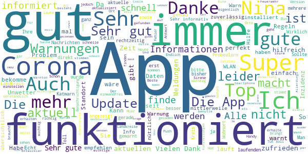

# NINA - Die Warn-App des BBK
App version ``3.3.2.3001``

Analyzed with [covid-apps-observer](http://github.com/covid-apps-observer) project, version ``0.1``

## App overview
| | |
|-------------------------|-------------------------| 
| **Name**&nbsp;&nbsp;&nbsp;&nbsp;&nbsp;&nbsp;&nbsp;&nbsp;&nbsp;&nbsp;&nbsp;&nbsp;&nbsp;&nbsp;&nbsp;&nbsp;&nbsp;&nbsp;&nbsp;&nbsp;&nbsp;&nbsp;&nbsp;&nbsp;&nbsp;&nbsp;&nbsp;&nbsp;&nbsp;&nbsp;&nbsp;&nbsp;&nbsp;&nbsp;&nbsp;&nbsp;&nbsp;&nbsp;&nbsp;&nbsp;  | NINA - Die Warn-App des BBK |
| **Unique identifier** | de.materna.bbk.mobile.app |
| **Link to Google Play** | [https://play.google.com/store/apps/details?id=de.materna.bbk.mobile.app](https://play.google.com/store/apps/details?id=de.materna.bbk.mobile.app) |
| **Summary**  | Die Notfall-Informations- und Nachrichten-App des BBK |
| **Privacy policy** | [http://www.bbk.bund.de/NINA-Datenschutz](http://www.bbk.bund.de/NINA-Datenschutz) |
| **Latest version** | 3.3.2.3001 |
| **Last update** | 2021-03-17 08:30:15 |
| **Recent changes** | - Es wurde ein Fehler behoben, der beim Nachladen für Ruckler im Dashboard gesorgt hat - Fehler bei abonnieren der Standortes behoben - Weitere Fehlerbehebung |
| **Installs**  | 1.000.000+ |
| **Category** | Nachrichten & Zeitschriften |
| **First release** | 22.05.2015 |
| **Size**  | 28M |
| **Supported Android version**  | 6.0 oder höher |

### Description
> Die Warn-App NINA (Notfall-Informations- und Nachrichten-App) warnt Sie deutschlandweit vor Gefahren, auf Wunsch auch für Ihren aktuellen Standort. Die App wird vom Bundesamt für Bevölkerungsschutz und Katastrophenhilfe (BBK) bereitgestellt.
 Technischer Ausgangspunkt für NINA ist das modulare Warnsystem des Bundes (MoWaS). Dieses wird vom BBK für bundesweite Warnungen des Zivilschutzes betrieben. Seit 2013 können auch alle Lagezentren der Länder und viele bereits angeschlossenen Leitstellen von Städten und Kommunen das Warnsystem nutzen (http://www.bbk.bund.de/DE/NINA/Warnung/Warnung.html). 
 <b>Hinweis: nicht überall sind auch Warnmeldungen zu lokalen Ereignissen erhältlich. Bitte informieren Sie sich bei Ihrem Landkreis oder Ihrer Stadt, welche Möglichkeiten zur Warnung der Bevölkerung dort eingesetzt werden.</b>
 Mit NINA erhalten Sie:
 •	Warnmeldungen des Bevölkerungsschutzes mit Handlungsempfehlungen 
 •	Wetterwarnungen des DWD (deutschlandweit für alle Landkreis und Städte)
 •	Hochwasserinformationen (deutschlandweit auf Bundeslandebene)
 •	allgemeine Notfalltipps, damit Sie sich und andere vor möglichen Gefahren schützen können.
 Mit NINA können Sie Orte auswählen, für die Sie Warnmeldungen erhalten möchten. Diese werden in der Übersicht „Meine Orte“ angezeigt. Im Einstellungsmenü können Sie festlegen, bei welcher Warnstufe Sie per Push-Benachrichtigung informiert werden sollen. Optional können Sie auch Warnmeldungen für Ihren aktuellen Standort erhalten. Dabei werden keine Standortdaten auf unseren Servern gespeichert. Bitte beachten Sie: Um standortbezogene Warnungen korrekt darstellen zu können, muss NINA Ihren Standort bestimmen können. Bei schlechtem Empfang kann es zu fehlerhaften Anzeigen kommen.
 Das Gefahrengebiet einer Warnmeldung kann in der Kartenansicht angezeigt werden. Die Hochwasserinformationen werden aktuell nur auf Bundeslandebene herausgegeben. In der Karte werden alle vorliegenden Warnmeldungen angezeigt, auch wenn Sie den Ort nicht ausgewählt haben.
 Die Notfalltipps enthalten Empfehlungen zu Themen wie Hochwasser, Unwetter, Stromausfall, Feuer und besondere Gefahrenlagen. Informieren Sie sich, wie Sie sich auf solche Ereignisse vorbereiten können. Ebenso finden Sie Verhaltenshinweise für den Fall, dass Sie von einem Ereignis betroffen sind. Mit den praktischen Checklisten können Sie gleich loslegen.
 Hinweise zu den Berechtigungen in der App:
 Zugriff auf den Speicher (Android 8 und höher): Die Warn-App NINA bietet die Möglichkeit den bekannten Sirenenton auf das Smartphone zu kopieren. Um dieses kopieren zu ermöglichen wird diese Berechtigung benötigt. Nach dem Abschluss des Kopiervorgang kann die Berechtigung wieder entfernt werden. Für eine Funktion der Warn-App ist die Berechtigung nicht erforderlich.
 Eigener Standort: Warnmeldungen für Ihren aktuellen Standort sind nur bei Nutzung von GPS, WLAN und anderen Geolokalisierungsdiensten möglich. Haben Sie diese Dienste auf Ihrem Gerät deaktiviert, können Sie keine standortbezogenen Warnmeldungen erhalten.
 Sie haben Fragen zur Warn-App NINA oder möchten uns Ihr Feedback geben? Dann wenden Sie sich bitte an nina@bbk.bund.de. Weitere Informationen erhalten Sie auch unter http://www.bbk.bund.de/NINA.
 Wichtig:
 Warnungen und Informationen können Sie nur mit einer Datenverbindung (per WLAN oder mobil) empfangen. Verfügt Ihr Gerät über keine Datenverbindung, wird der letzte auf dem Gerät gespeicherte Stand angezeigt.

### User interface
The developers of the app provide the following screenshots in the Google play store.
| | | |
|:-------------------------:|:-------------------------:|:-------------------------:|
 |   |   |   | 
 |   |   |   | 
 |   |   |   | 
 |   |   |   | 
 |   |   |   | 
 |   |   |   | 

## Development team
In the following we report the main information provided by the development team in the Google play store.

| | |
|-------------------------|-------------------------|
| **Developer**  | Bundesamt für Bevölkerungsschutz (Deutschland) |
| **Website**  | [http://www.bbk.bund.de/DE/NINA/Warn-App_NINA_node.html](http://www.bbk.bund.de/DE/NINA/Warn-App_NINA_node.html) |
| **Email** | nina@bbk.bund.de |
| **Physical address**  | [Provinzialstr. 93 53127 Bonn](https://www.google.com/maps/search/Provinzialstr.%2093%2053127%20Bonn) (Google Maps) |
| **Other developed apps**  | [https://play.google.com/store/apps/developer?id=Bundesamt+f%C3%BCr+Bev%C3%B6lkerungsschutz+(Deutschland)](https://play.google.com/store/apps/developer?id=Bundesamt+f%C3%BCr+Bev%C3%B6lkerungsschutz+(Deutschland)) |

## Android support

| | |
|-------------------------|-------------------------|
| **Declared target Android version**  | - |
| **Effective target Android version**  | - |
| **Minimum supported Android version**  | Marshmallow, version 6.0 (API level 23) |
| **Maximum target Android version**  | - |

The larger the difference between the minimum and maximum supported Android versions, the better. A larger difference means a wider audience. For example, old phones have a very low Android version, so a high minimum supported Android version means that the app cannot be used by users with old phones, thus leading to accessibility problems. 

## Requested permissions

In the following we report the complete list of the permissions requested by the app. 

| **Permission** | **Protection level** | **Description** | 
|-------------------------|-------------------------|-------------------------|
 **android.permission ACCESS_BACKGROUND_LOCATION** | :warning:**Dangerous** | Allows an app to access location in the background. 
 **android.permission ACCESS_COARSE_LOCATION** | :warning:**Dangerous** | Allows an app to access approximate location. 
 **android.permission ACCESS_FINE_LOCATION** | :warning:**Dangerous** | Allows an app to access precise location. 
 **android.permission ACCESS_NETWORK_STATE** | Normal | Allows applications to access information about networks. 
 **android.permission ACCESS_WIFI_STATE** | Normal | Allows applications to access information about Wi-Fi networks. 
 **android.permission FOREGROUND_SERVICE** | Normal | Allows a regular application to use Service.startForeground. 
 **android.permission INTERNET** | Normal | Allows applications to open network sockets. 
 **android.permission REQUEST_IGNORE_BATTERY_OPTIMIZATIONS** | Normal | Permission an application must hold in order to use Settings.ACTION_REQUEST_IGNORE_BATTERY_OPTIMIZATIONS. 
 **android.permission VIBRATE** | Normal | Allows access to the vibrator. 
 **android.permission WAKE_LOCK** | Normal | Allows using PowerManager WakeLocks to keep processor from sleeping or screen from dimming. 
 **android.permission WRITE_EXTERNAL_STORAGE** | :warning:**Dangerous** | Allows an application to write to external storage. 
 **com.google.android.c2dm.permission RECEIVE** | - | - 
 **com.google.android.finsky.permission BIND_GET_INSTALL_REFERRER_SERVICE** | - | - 

## Mentioned servers

| **Server** | **Registrant** | **Registrant country** | **Creation date** | 
|-------------------------|-------------------------|-------------------------|-------------------------|
 | google.com | Google LLC | :us: US | 1997-09-15 04:00:00 |
 | app-measurement.com | Google LLC | :us: US | 2015-06-19 20:13:31 |
 | googleapis.com | Google LLC | :us: US | 2005-01-25 17:52:26 |
 | googlesyndication.com | Google LLC | :us: US | 2003-01-21 06:17:24 |
 | crashlytics.com | Google LLC | :us: US | 2011-01-21 15:30:40 |
 | googleadservices.com | Google LLC | :us: US | 2003-06-19 16:34:53 |

## Security analysis 

Below we report the main security warnings raised by our execution of the [Androwarn](https://github.com/maaaaz/androwarn) security analysis tool.

**Connection interfaces exfiltration**
> - This application reads details about the currently active data network 

**Suspicious connection establishment**
> - This application opens a Socket and connects it to the remote address ' returned no addresses for  ; port is out of range' on the 'N/A' port  
> - This application opens a Socket and connects it to the remote address '' on the 'N/A' port  
> - This application opens a Socket and connects it to the remote address 'Ljava/net/Proxy;->type()Ljava/net/Proxy$Type;' on the 'N/A' port  
> - This application opens a Socket and connects it to the remote address 'timeout' on the 'N/A' port  

**Code execution**
> - This application loads a native library: 'crashlytics' 
> - This application executes a UNIX command containing this argument: 'logcat -b main -d' 

## User ratings and reviews

Below we provide information about how end users are reacting to the app in terms of ratings and reviews in the Google Play store.

### Ratings

The NINA - Die Warn-App des BBK app has been installed by more than **1000000** times. At this time, **19429** rated the app and its average score is **3.2960122**. Below we show the distribution of the ratings across the usual star-based rating of Google Play

:star::star::star::star::star:: 7937

:star::star::star::star:: 2503

:star::star::star:: 1867

:star::star:: 1619

:star:: 5503

### Reviews 

#### 5-star reviews

> Sehr gute App  :date: __2021-05-22 09:12:42__

> Gute App  :date: __2021-05-20 15:24:23__

> Great app for checking Corona Updates.  :date: __2021-05-18 08:53:27__

> Ich bin sehr zufrieden mit dieser App ,warnt mich wenn es nötig ist. Kann mich auf diese App voll und ganz verlassen. Kann ich nur weiterempfehlen.  :date: __2021-05-17 08:52:56__

> Ich hatte lange Zeit Katwarn aber seit fast mehr als ein halbes Jahr ist da Tota Hose, was leider keine Realität ist. Nicht einmal eine Test Warnung um die App als Warnfunktion zu testen. Bei Nina scheint es anders und vileicht besser zu sein. Eingestellt ist alles und bis auf die Not Meldung von Halle ist alles Tag Aktuelle. Die Sirene ist leider für den Städten Alltag etwas zu leise. So das ich mir eine individuelle Lautstärkenregelung wünschen würde.  :date: __2021-05-15 08:55:01__

> Naja Ist eigentlich sehr gut  :date: __2021-05-14 09:09:05__

> Ja mit Katharina App einfach gut.  :date: __2021-05-13 13:11:55__

> Mit lokalen Corona Beschränkungsinfos. Toll. Auch weniger unnötige Alarme als bei Katwarn.  :date: __2021-05-13 11:32:16__

> Ich würde immer richtig gewarnt! Ohne die Unwetterwarnung wäre ich in Schwierigkeiten geraten! Ich kann die App nur empfehlen, gerade für Leute die alleine sind und keine Informationsquelle läuft. Man kann diese App super einstellen, ich empfehle (auch wenn sie von der Regierung ist...) sich die App mal anzusehen! Ich habe damit kein Problem, kenne es aber. Ich habe keine bessere App gefunden!  :date: __2021-05-12 06:41:49__

> Klasse. Informationen kommen schnell und übersichtlich. Eigener Wohnort und der von Freunde und Familie habe ich Eingestellt. Man kann gezielt einen oder mehrere Orte auswählen.  :date: __2021-05-10 21:52:40__

#### 4-star reviews

> Die App funktioniert einwandfrei. Danke an NINA-HD. Die App ist allerdings nicht sehr spezifisch und bietet nur grobe Informationen, maximal auf den jeweiligen Landkreis bezogen. Für detaillierte Informationen muss stets im Internet gesucht werden. Da mich der Corona Kram mittlerweile nur noch nervt, und sonstige Meldungen zu allgemein gehalten sind, habe ich sie wieder deinstalliert.  :date: __2021-05-21 08:20:15__

> Schneller Support bei Problem. Bin mit dieser App sehr zufrieden.  :date: __2021-05-19 19:24:41__

> Funktioniert leider nicht immer so richtig gut...Hochwasseralarm wird nicht gut angezeigt...Ich kann nicht erkennen welche Flüsse Hochwasser haben....  :date: __2021-05-13 07:05:46__

> Besser als gedacht. Rund um Unwetter, Bombenentschärfung und Pandemie gewarnt und aktuell informiert.  :date: __2021-05-10 23:09:52__

> Coole app  :date: __2021-05-08 08:32:47__

> Ich bin mit der App sehr zufrieden. Ich habe dadurch öfter wichtige Informationen zu Gefahren in meiner Umgebung erhalten. (Kampfmittelfunde aus dem 2. Weltkrieg, Wetterwarnungen, Brandereignisse, etc.)  :date: __2021-05-04 14:44:44__

> Seit November gibt es keine datenupdats mehr. Bitte mal überprüfen  :date: __2021-04-28 10:07:53__

> Ich finde die Inhalte gut, und die Aufarbeitung der Coronaregeln sehr hilfreich. Allerdings werden die Informationen nur geladen, wenn ich mein WLAN abschalte. Habe ich mein WLAN an, lädt nichts, und nach einer Weile werde ich gebeten, sicherzustellen, dass ich eine Internetverbindung habe. Das ist vermutlich nicht so gedacht ;)  :date: __2021-04-25 09:50:15__

> Gute App, macht was sie soll. Ist aktuell und zeigt die relevanten Informationen an. Die Text Darstellung finde ich nicht gut, es fehen Hervorhebungen, klickbares Inhaltsverzeichnis und Abtrennen der Inhalten mit Überschritten. Zudem wäre eine Suchfunktion super den Info- Text zu durchsuchen. Das Menü verschwindet schneller als ich es lesen kann.  :date: __2021-04-23 10:39:21__

> Prinzipiell gute Idee. Wie kommen aber die starken Abweichungen bei den Inzidenzwerten gegenüber offiziellen Stellen zustande? Heute 22.4.21 für LK Peine in der App ein Wert von 115, offizielle Stellen 192.  :date: __2021-04-22 19:03:02__

#### 3-star reviews

> Durchaus nützliche App, gerade z.B. für lokale Gefahrenereignisse. Aber: wenn man es "wagt", die Standortbestimmung per WLAN ("Google-Standortbestimmung") zu deaktivieren, wird man täglich(!) vor seinen angeblich "fehlerhaften" Einstellungen gewarnt. Das ist nervig, unverschämt und außerdem schlicht unnötig, da die App eh maximal auf Kreisebene lokalisieren muss. Auf neueren Android-Versionen kann man die Benachrichtigung unterdrücken, immerhin. Aber das ist kein Verdienst der App.  :date: __2021-05-22 14:46:01__

> Alarm unzuverlässig.  :date: __2021-05-21 23:18:54__

> Im Prinzip nicht schlecht wenn es von den meldenden Stellen qualifizierter genutzt würde. NINA bringt mehr Wetterwarnungen als DWD App!?  :date: __2021-05-18 07:31:01__

> Leider ist aus der Inzidenzwerte Anzeige nicht ersichtlich welchen Stand (Datum/Uhrzeit) die App in den einzelnen Kreisen anzeigt. Dies wäre von Vorteil da man dann sich auch wirklich auf die Anzeige verlassen könnte. Verbesserungsvorschlag  :date: __2021-05-17 07:36:25__

> Unsinnige Fehlermeldungen sind bei mir leider die Regel. Regelmäßig poppt die Meldung auf: Standorteinstellungen fehlerhaft - Problemanalyse starten. Klicke ich darauf ist aber immer alles okay, alle fünf Kategorien haben grüne Häkchen. Verschwindet nach wegklicken, bis sich das Ganze irgendwann wiederholt - so ist das unütz. Werde bald die Fehlermeldungen unterdrücken, was an sich nicht der Sinn dahinter sein kann. Standort ist immer an inkl Bluetooth und WLAN. Keine Sim drin. Android (One) 10.  :date: __2021-05-14 23:18:23__

> Einem täglich gibt es ein Fehler zur Standortbestimmung obwohl alle anderen App die GPS benötigen fehlerfrei arbeiten.  :date: __2021-05-12 18:07:35__

> Eigentlich eine gute Idee, wenn die App denn funktionieren würde. Coronazahlen und die entsprechende Warnstufe werden jedoch nicht aktualisiert.(Kreis Unna) Schade eigentlich.  :date: __2021-05-08 08:56:56__

> Die Inzidenzkarte ist gelungen, die Corona-Meldungen werden aber leider zunehmst als Nachrichtenticker missbraucht.  :date: __2021-05-04 23:27:33__

> Wenn sie funktioniert ist sie ganz gut beim Test letztes Jahr hat sie es ja nicht gebracht 🤔  :date: __2021-05-03 18:10:15__

> Bitte die Inzidenzen der letzten 7 Tage auch anzeigen. Die App ist nicht gerade sehr intuitiv. "Meine Orte" bitte kompakter darstellen.  :date: __2021-04-27 18:44:58__

#### 2-star reviews

> Nach dem Update geht gar nix mehr.. es Läd und Läd. Popups kommen aber noch. (Android/galaxy s9+)  :date: __2021-05-21 20:30:18__

> Hilft nicht weiter, wenn die Informationen nicht aktuell sind.  :date: __2021-05-21 11:07:52__

> Seit ein paar Tagen hinkt die App den aktuellen Coronazahlen hinterher.  :date: __2021-05-17 08:33:40__

> Bekomme auch keine Benachrichtigungen mehr. Edit: Huawei P20 pro, Android 10. Hintergrundaktivität ist nicht eingeschränkt für diese App.  :date: __2021-05-16 03:56:48__

> Ich habe leider nur mittelmäßige Erfahrungen gemacht. Einige Alarme kommen fast aktuell. Aktuelle Corona-Informationen gibt es nur sporadisch. So ist in der Regel der Inzidenzwert täglich aktuell, heute allerdings wieder einmal entweder veraltet oder einfach nur falsch angegeben. Maßnahmen werden aktuell auf den Kreis bezogen nicht angegeben, es erfolgt nur ein Verweis auf die grundsätzliche Gesetzeslage, was bei unterschiedlichen Inzidenzen zu erfolgen hat. Das hilft überhaupt nicht!  :date: __2021-05-15 11:45:27__

> Leider nie aktuell, hängt bei Corona Werten um 9:00 immer noch einen Tag zurück  :date: __2021-05-15 08:40:51__

> Keine Details, ich kann nur sehen das in ganz Deutschland Katastrophe ist. Es gibt vor lauter Corona nichts mehr anderes, da wäre es schön wenn ich das was für mich nicht relavant ist ausblenden könnte.  :date: __2021-05-12 18:19:23__

> Eine sehr nützliche App um sich zu über die derzeitige Warnlage zu informieren. Sei es Wettergefahren oder Schadenslagen. Jedoch funktionieren die Push-Benachrichtigung überhaupt nicht. Neues Smartphone, Android 10, frisch vom Playstore geladen. Alle Rechte, keine Akku-Optimierung und darf fröhlich im Hintergrund arbeiten. Macht sie nur leider nicht... Ich freue mich auf die Updates, die das fixen 👍  :date: __2021-05-12 06:51:57__

> Keine Gefahrenzone und keine Warnung bei Bomben entschärfen.  :date: __2021-05-09 18:37:30__

> Bekomme leider keine Benachrichtigungen mehr, keine Ahnung warum. Hat eigentlich immer gut Funktioniert, Schade  :date: __2021-05-06 08:19:45__

#### 1-star reviews

> Nina holt keine Daten ab und behauptet es gibt keine Verbindung zum Internet. Funktioniert also nicht.  :date: __2021-05-22 09:50:23__

> Benachrichtigung immer viel zu spät! Z.B. Strom fällt aus, 12 Stunden später ist der Strom wieder da, weitere 5 Stunden später kommt Alarm von der NINA App wegen Stromausfall.  :date: __2021-05-21 20:35:49__

> Jahre lange gut nun wird die App gelöscht, kommt mir vor als wenn ich eine Corona App installiert habe, was ich nie wollte.  :date: __2021-05-21 09:21:18__

> Heute (11.03.) großer Probealarm um 11.00 Uhr. NINA bleibt, wie beim letzten Mal, wieder stumm. Wozu braucht man eine Warnapp, die nicht warnt? Bevor aber jetzt wieder der Amtsleiter gefeuert wird, sollte man den Programmierern mal Dampf machen. Bin echt enttäuscht!  :date: __2021-05-18 12:57:56__

> Konzept ist gut.. jedoch viel zu viel bla bla Meldungen.. keine Frage Corona ist nicht zu verharmlosen aber von diese App erwarte ich nur Notfall Info's... Und keine Nachrichten zu Corona.  :date: __2021-05-17 21:12:23__

> Diese App tut gar nichts. Corona Meldungen werden nicht gefunden, Dauersanduhr. So nicht zu gebrauchen, steige auf App Katwarn um, die funktioniert. Nachtrag 17.5.21: wieder installiert, 5 Tage probiert, keine Besserung, funktioniert nach wie vor nicht. Samsung S10e, Android 11, Hintergrund Prozesse erlaubt. Standortzugriff verboten. Fliegt wieder runter.  :date: __2021-05-17 18:11:36__

> Warnapp ist eine Katastrophe. Hohe Ladezeiten für Informationen und Textformatierung sehr schlecht!  :date: __2021-05-16 07:24:08__

> 14.05.2021 Ich nutze die App aktuell auf einen Samsung Galaxy J6 mit Android 10. Seit der installation dieser App ist schweigen angesagt, diese App meldet sich nicht und warnt vor gar nichts. Mit jedem neueren Telefonmodell wird es weniger was sie kannn und tut... jedes Radio und Fernsehen leistet mehr. Auch getestet auf Samsung S4 und ZTE (2019), wer eine aktuelle Meldung möchte macht besser das Radio an und lässt sich von Sirenen warnen.  :date: __2021-05-15 08:19:56__

> Man bekommt eine Warnmitteilung aber die App öffnet sich nicht?! Von einer App, die mich vor Gefahren warnen soll, hätte ich mehr erwartet. Liebe Bundesregierung, meldet Euch, wenn ihr eine App habt, die funktioniert!!!  :date: __2021-05-14 18:55:30__

> Nutzlose App. Es werden keine wichtigen Informationen mitgeteilt.  :date: __2021-05-14 18:54:57__

