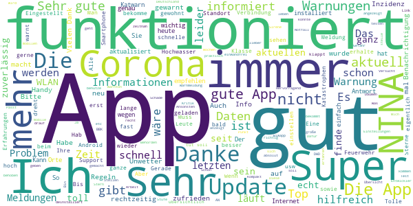
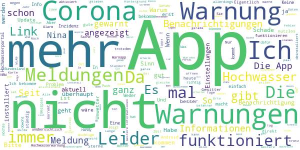

# NINA - Die Warn-App des BBK
App version ``3.3.3``

Analyzed with [covid-apps-observer](http://github.com/covid-apps-observer) project, version ``0.1``

## App overview
| | |
|-------------------------|-------------------------| 
| **Name**&nbsp;&nbsp;&nbsp;&nbsp;&nbsp;&nbsp;&nbsp;&nbsp;&nbsp;&nbsp;&nbsp;&nbsp;&nbsp;&nbsp;&nbsp;&nbsp;&nbsp;&nbsp;&nbsp;&nbsp;&nbsp;&nbsp;&nbsp;&nbsp;&nbsp;&nbsp;&nbsp;&nbsp;&nbsp;&nbsp;&nbsp;&nbsp;&nbsp;&nbsp;&nbsp;&nbsp;&nbsp;&nbsp;&nbsp;&nbsp;  | NINA - Die Warn-App des BBK |
| **Unique identifier** | de.materna.bbk.mobile.app |
| **Link to Google Play** | [https://play.google.com/store/apps/details?id=de.materna.bbk.mobile.app](https://play.google.com/store/apps/details?id=de.materna.bbk.mobile.app) |
| **Summary**  | Die Notfall-Informations- und Nachrichten-App des BBK |
| **Privacy policy** | [http://www.bbk.bund.de/NINA-Datenschutz](http://www.bbk.bund.de/NINA-Datenschutz) |
| **Latest version** | 3.3.3 |
| **Last update** | 2021-07-05 08:58:19 |
| **Recent changes** | - Implementierung des Analysetools Matomo (Opt-In) - Fehlerbehebung |
| **Installs**  | 1.000.000+ |
| **Category** | Nachrichten & Zeitschriften |
| **First release** | 22.05.2015 |
| **Size**  | 35M |
| **Supported Android version**  | 6.0 oder höher |

### Description
> Die Warn-App NINA (Notfall-Informations- und Nachrichten-App) warnt Sie deutschlandweit vor Gefahren, auf Wunsch auch für Ihren aktuellen Standort. Die App wird vom Bundesamt für Bevölkerungsschutz und Katastrophenhilfe (BBK) bereitgestellt.
 Technischer Ausgangspunkt für NINA ist das modulare Warnsystem des Bundes (MoWaS). Dieses wird vom BBK für bundesweite Warnungen des Zivilschutzes betrieben. Seit 2013 können auch alle Lagezentren der Länder und viele bereits angeschlossenen Leitstellen von Städten und Kommunen das Warnsystem nutzen (http://www.bbk.bund.de/DE/NINA/Warnung/Warnung.html). 
 <b>Hinweis: nicht überall sind auch Warnmeldungen zu lokalen Ereignissen erhältlich. Bitte informieren Sie sich bei Ihrem Landkreis oder Ihrer Stadt, welche Möglichkeiten zur Warnung der Bevölkerung dort eingesetzt werden.</b>
 Mit NINA erhalten Sie:
 •	Warnmeldungen des Bevölkerungsschutzes mit Handlungsempfehlungen 
 •	Wetterwarnungen des DWD (deutschlandweit für alle Landkreis und Städte)
 •	Hochwasserinformationen (deutschlandweit auf Bundeslandebene)
 •	allgemeine Notfalltipps, damit Sie sich und andere vor möglichen Gefahren schützen können.
 Mit NINA können Sie Orte auswählen, für die Sie Warnmeldungen erhalten möchten. Diese werden in der Übersicht „Meine Orte“ angezeigt. Im Einstellungsmenü können Sie festlegen, bei welcher Warnstufe Sie per Push-Benachrichtigung informiert werden sollen. Optional können Sie auch Warnmeldungen für Ihren aktuellen Standort erhalten. Dabei werden keine Standortdaten auf unseren Servern gespeichert. Bitte beachten Sie: Um standortbezogene Warnungen korrekt darstellen zu können, muss NINA Ihren Standort bestimmen können. Bei schlechtem Empfang kann es zu fehlerhaften Anzeigen kommen.
 Das Gefahrengebiet einer Warnmeldung kann in der Kartenansicht angezeigt werden. Die Hochwasserinformationen werden aktuell nur auf Bundeslandebene herausgegeben. In der Karte werden alle vorliegenden Warnmeldungen angezeigt, auch wenn Sie den Ort nicht ausgewählt haben.
 Die Notfalltipps enthalten Empfehlungen zu Themen wie Hochwasser, Unwetter, Stromausfall, Feuer und besondere Gefahrenlagen. Informieren Sie sich, wie Sie sich auf solche Ereignisse vorbereiten können. Ebenso finden Sie Verhaltenshinweise für den Fall, dass Sie von einem Ereignis betroffen sind. Mit den praktischen Checklisten können Sie gleich loslegen.
 Hinweise zu den Berechtigungen in der App:
 Zugriff auf den Speicher (Android 8 und höher): Die Warn-App NINA bietet die Möglichkeit den bekannten Sirenenton auf das Smartphone zu kopieren. Um dieses kopieren zu ermöglichen wird diese Berechtigung benötigt. Nach dem Abschluss des Kopiervorgang kann die Berechtigung wieder entfernt werden. Für eine Funktion der Warn-App ist die Berechtigung nicht erforderlich.
 Eigener Standort: Warnmeldungen für Ihren aktuellen Standort sind nur bei Nutzung von GPS, WLAN und anderen Geolokalisierungsdiensten möglich. Haben Sie diese Dienste auf Ihrem Gerät deaktiviert, können Sie keine standortbezogenen Warnmeldungen erhalten.
 Sie haben Fragen zur Warn-App NINA oder möchten uns Ihr Feedback geben? Dann wenden Sie sich bitte an nina@bbk.bund.de. Weitere Informationen erhalten Sie auch unter http://www.bbk.bund.de/NINA.
 Wichtig:
 Warnungen und Informationen können Sie nur mit einer Datenverbindung (per WLAN oder mobil) empfangen. Verfügt Ihr Gerät über keine Datenverbindung, wird der letzte auf dem Gerät gespeicherte Stand angezeigt.

### User interface
The developers of the app provide the following screenshots in the Google play store.
| | | |
|:-------------------------:|:-------------------------:|:-------------------------:|
 |   |   |   | 
 |   |   |   | 
 |   |   |   | 
 |   |   |   | 
 |   |   |   | 
 |   |   |   | 

## Development team
In the following we report the main information provided by the development team in the Google play store.

| | |
|-------------------------|-------------------------|
| **Developer**  | Bundesamt für Bevölkerungsschutz (Deutschland) |
| **Website**  | [http://www.bbk.bund.de/DE/NINA/Warn-App_NINA_node.html](http://www.bbk.bund.de/DE/NINA/Warn-App_NINA_node.html) |
| **Email** | nina@bbk.bund.de |
| **Physical address**  | [Provinzialstr. 93 53127 Bonn](https://www.google.com/maps/search/Provinzialstr.%2093%2053127%20Bonn) (Google Maps) |
| **Other developed apps**  | [https://play.google.com/store/apps/developer?id=Bundesamt+f%C3%BCr+Bev%C3%B6lkerungsschutz+(Deutschland)](https://play.google.com/store/apps/developer?id=Bundesamt+f%C3%BCr+Bev%C3%B6lkerungsschutz+(Deutschland)) |

## Android support

| | |
|-------------------------|-------------------------|
| **Declared target Android version**  | - |
| **Effective target Android version**  | - |
| **Minimum supported Android version**  | Marshmallow, version 6.0 (API level 23) |
| **Maximum target Android version**  | - |

The larger the difference between the minimum and maximum supported Android versions, the better. A larger difference means a wider audience. For example, old phones have a very low Android version, so a high minimum supported Android version means that the app cannot be used by users with old phones, thus leading to accessibility problems. 

## Requested permissions

In the following we report the complete list of the permissions requested by the app. 

| **Permission** | **Protection level** | **Description** | 
|-------------------------|-------------------------|-------------------------|
 **android.permission ACCESS_BACKGROUND_LOCATION** | :warning:**Dangerous** | Allows an app to access location in the background. 
 **android.permission ACCESS_COARSE_LOCATION** | :warning:**Dangerous** | Allows an app to access approximate location. 
 **android.permission ACCESS_FINE_LOCATION** | :warning:**Dangerous** | Allows an app to access precise location. 
 **android.permission ACCESS_NETWORK_STATE** | Normal | Allows applications to access information about networks. 
 **android.permission ACCESS_WIFI_STATE** | Normal | Allows applications to access information about Wi-Fi networks. 
 **android.permission FOREGROUND_SERVICE** | Normal | Allows a regular application to use Service.startForeground. 
 **android.permission INTERNET** | Normal | Allows applications to open network sockets. 
 **android.permission REQUEST_IGNORE_BATTERY_OPTIMIZATIONS** | Normal | Permission an application must hold in order to use Settings.ACTION_REQUEST_IGNORE_BATTERY_OPTIMIZATIONS. 
 **android.permission VIBRATE** | Normal | Allows access to the vibrator. 
 **android.permission WAKE_LOCK** | Normal | Allows using PowerManager WakeLocks to keep processor from sleeping or screen from dimming. 
 **android.permission WRITE_EXTERNAL_STORAGE** | :warning:**Dangerous** | Allows an application to write to external storage. 
 **com.google.android.c2dm.permission RECEIVE** | - | - 
 **com.google.android.finsky.permission BIND_GET_INSTALL_REFERRER_SERVICE** | - | - 

## Mentioned servers

| **Server** | **Registrant** | **Registrant country** | **Creation date** | 
|-------------------------|-------------------------|-------------------------|-------------------------|
 | google.com | Google LLC | :us: US | 1997-09-15 04:00:00 |
 | app-measurement.com | Google LLC | :us: US | 2015-06-19 20:13:31 |
 | googleapis.com | Google LLC | :us: US | 2005-01-25 17:52:26 |
 | googlesyndication.com | Google LLC | :us: US | 2003-01-21 06:17:24 |
 | crashlytics.com | Google LLC | :us: US | 2011-01-21 15:30:40 |
 | googleadservices.com | Google LLC | :us: US | 2003-06-19 16:34:53 |

## Security analysis 

Below we report the main security warnings raised by our execution of the [Androwarn](https://github.com/maaaaz/androwarn) security analysis tool.

**Connection interfaces exfiltration**
> - This application reads details about the currently active data network 

**Suspicious connection establishment**
> - This application opens a Socket and connects it to the remote address ' returned no addresses for  ; port is out of range' on the 'N/A' port  
> - This application opens a Socket and connects it to the remote address '' on the 'N/A' port  
> - This application opens a Socket and connects it to the remote address 'Ljava/net/Proxy;->type()Ljava/net/Proxy$Type;' on the 'N/A' port  
> - This application opens a Socket and connects it to the remote address 'timeout' on the 'N/A' port  

**Code execution**
> - This application loads a native library: 'crashlytics' 
> - This application executes a UNIX command containing this argument: 'logcat -b main -d' 

## User ratings and reviews

Below we provide information about how end users are reacting to the app in terms of ratings and reviews in the Google Play store.

### Ratings

The NINA - Die Warn-App des BBK app has been installed by more than **1000000** times. At this time, **20418** rated the app and its average score is **3.4316406**. Below we show the distribution of the ratings across the usual star-based rating of Google Play

:star::star::star::star::star:: 8684

:star::star::star::star:: 2991

:star::star::star:: 2183

:star::star:: 1575

:star:: 4985

### Reviews 

#### 5-star reviews

> Gut  :date: __2021-07-30 15:30:21__

> Gut  :date: __2021-07-30 11:33:16__

> nicht mehr wegzudenken  :date: __2021-07-30 04:07:56__

> Sie hat beim letzten stark Regen Meldungen abgeben.  :date: __2021-07-28 22:54:06__

> Funktioniert einwandfrei. Ich kann die negativen Rezensionen nicht verstehen. Die erfahren zuverlässig auch wenn man nicht im WLAN ist und mobiles Netz an hat.  :date: __2021-07-28 00:31:22__

> Diese App hatte mich rechtzeitig vor dem Hochwasser (Eifel) gewarnt! DANKE  :date: __2021-07-27 23:58:45__

> Gute Erfindung  :date: __2021-07-27 21:24:40__

> Super und cool. Die ist sehr gut weil dann kann man sich beschützen Vor die Gefahr.  :date: __2021-07-27 18:19:04__

> Sehr gute App habe sie noch nicht lange kann sie aber weiter empfehlen  :date: __2021-07-27 17:58:58__

> mittlerweile echt super!  :date: __2021-07-27 15:06:49__

#### 4-star reviews

> Hochwasserinformationen: der Link zum Länderübergreifenden Hochwasserportal funktioniert nicht  :date: __2021-07-29 08:00:34__

> Diese App ist gut.  :date: __2021-07-28 13:38:17__

> Super App, die auch zuverlässig funktioniert: Für fünf Sterne fehlt mir allerdings die Aktualisierung der Inzidenzstufen für NRW (in NINA werden diese nicht wie vom MAGS NRW angegen). Außerdem wäre es wünschenswert, wenn die Kartenfunktion flüssiger liefe: Sobald ich wo rein zoome, stockt die Karte es und dauert ein paar mehr Sekunden, bis das Zoomen funktioniert hat. Ansonsten haben Sie einen guten Job gemacht!  :date: __2021-07-28 12:05:17__

> Die App ist gut strukturiert und funktioniert einwandfrei. Mir fehlt jedoch ein Berzeichnis von Standorten des Katastrophenschutzes ( THW Feuerwehr) und von medizinischen Einrichtungen.  :date: __2021-07-28 09:15:19__

> Ihr braucht sinnvolle Defaults nach Gefahrengebieten.  :date: __2021-07-27 23:20:22__

> Super, dass es diese App gibt. Die Warntexte enthalten ohne Panikmache viele wichtige Infos und auch Verhaltensanweisungen. Das hilft, zum Beispiel Sirenenwarnung zu spezifizieren, auch wenn gerade kein Radio zur Hand ist. Gebiete, die man im Auge behalten möchte, lassen sich individuell einstellen, die Angaben sind aber sehr großflächig. Ich persönlich finde die Hochwasserwarnung nicht komfortabel. Es wird ja nur ein Link zu einem PDF angezeigt, das zu lesen nicht ganz einfach ist.  :date: __2021-07-27 21:13:15__

> OK.  :date: __2021-07-27 17:28:41__

> Soweit ist die App gut nur mit der Corona Gefahrenstufe kann ich nichts anfangen ist seit 9 Wochen auf 2 obwohl hier Inzidenzstufe 0 ist .... heute steht in der Zeitung Inzidensstufe 1 gilt auch für Kreise mit Stufe 0 ....  :date: __2021-07-27 11:25:36__

> Die App sollte rechtzeitig Warnungen über Wetter-, Hochwasser, Pandemien und andere Gefahren abgeben. Zudem sollten evtl. Hinweise angezeigt werden. Sie sollte weiter verbessert werden. Mit einer sehr guten App und einem guten Warnsystem wären manche Katastrophen vermeidbar. Die App braucht zu viel Speicherplatz. Der Server ist sehr oft nicht erreichbar. Beim Speicherplatz und der Erreichbarkeit sollte noch deutlich nachgebessert werden.  :date: __2021-07-26 21:24:28__

> Gute App, aber warum wird in den Unwetterwarnungen nur der Wochentag und nicht zusätzlich das Datum in der Legende angezeigt?  :date: __2021-07-26 15:54:40__

#### 3-star reviews

> Bei Inzidenz Stufe 1 wird Infektions Gefahr Stufe 2 angezeigt. Wenn Nina sich an die gängige Nomenklatur hielte, wäre ein schneller Blick in die App hilfreicher.  :date: __2021-07-28 21:51:00__

> Diverse Meldungen müßten örtlicher definiert werden. Die Info über die "Infektionsgefahrstufe" wäre beim aktuellen Standort hilfreich, warum wurde sie durch das Update entfernt?  :date: __2021-07-28 06:52:22__

> Gefahrenmeldung heute für Dortmund gut eine Stunde später habe ich diese Meldung erst bekommen. Auch die Entwarnung die in der App ca 17 Uhr stand bekam ich erst um 18:15 Uhr als Nachricht... Ist ja nicht Sinn der Sache wenn man eine Warnung erst über eine Stunde später erhâlt  :date: __2021-07-27 18:19:16__

> Wird erst wieder installiert wenn der ganze Corona Mist draußen ist oder sich ausblenden lässt  :date: __2021-07-27 17:09:10__

> Falsche Angaben zu Corona-Regelungen. Angegeben wird Stufe 2, laut Seite der Stadt und auch vom Land NRW gilt aktuell bei uns Stufe 1. Schön, wenn man sich nicht mal auf so banales verlassen kann.  :date: __2021-07-27 16:13:38__

> #Leverkusen Brand: Warnung und Entwarnung für Kölner Raum 👍 Warum gibt's zB für Hochwasser keine Unterteilung in Warnstufen. Lieber Sirenen und App statt Cell Broadcast ? Was würde wohl eher ankommen ? 🤔 App Daten etwa ? #Neuland Politik 😦  :date: __2021-07-27 14:29:22__

> Verlinkung zum Deutschen Wetterdienst unter "weitere Informationen", bei "Amtlicher Warnung" wäre schön gewesen, vllt. klappt auch die Verlinkung nicht. Über FAQ funktioniert der Link.  :date: __2021-07-27 13:28:09__

> Es gibt leider keine Möglichkeit, bestimmte Warnungen zu unterdrücken. Ich habe die App deaktiviert, weil ich eh nicht mehr hingeschaut habe in der Annahme, ist ja doch wieder nur Corona. Jetzt hab ich halt nur noch die Wetterwarnungen der DWD App.  :date: __2021-07-27 12:03:52__

> Die App ist eigentlich ok. Hätte aber auch noch viel Entwicklungspotential. Im Moment wird die Coronainformation für den Landkreis nicht mehr angezeigt, war immer sehr informativ bzgl. der aktuellen Inzidenz.  :date: __2021-07-27 10:20:55__

> Grundsätzlich eine sehr gute Applikation. Jedoch ist der Link zum länderübergreifenden Hochwasserportal seit mind. zwei Tagen nicht funktionsfähig, wobei der Link zu den Notfalltips funktionsfähig ist.  :date: __2021-07-27 07:10:44__

#### 2-star reviews

> Update Vers. 3.3.3: ein altes Problem ist wieder da: sind mobile Daten ausgeschaltet (z. b. daheim, wo man WLAN hat...) meint die App, es gäbe keine Internetverbindung... Folge: Meldungen werden nicht geladen, weder nach Benachrichtigung noch per Ortsliste... Daneben ist die Ortsübersicht immer noch sehr unübersichtlich, da nicht zuklappbar.  :date: __2021-07-30 12:52:08__

> Die Idee hinter dieser App ist klasse. Das Problem die Benachrichtigungen sind zwar in der App zu lesen, allerdings wird man teilweise erst 30min-1h später per aufploppender Benachrichtigung gewarnt, wenn ja dann quasi schon alles zu spät ist! Gibt es da bestimmte Einstellungen, dass man die Nachricht sofort bekommt und nicht erst eine halbe Ewigkeit später?? Sonst ist man erstickt, ertrunken,.. sonstiges und dann bringt einem die App auch nichts mehr.  :date: __2021-07-28 10:15:12__

> Corona-Warnung läßt sich nicht abstellen, obwohl es in den Einstellungen ausgestellt wurde. Programmierfehler?  :date: __2021-07-28 08:17:50__

> Ein dark mode wäre schön  :date: __2021-07-28 07:28:12__

> Die App ist soo langsam, da ist die Flut die Ahr wieder hoch geflossen... und wenn man dann mal auf eine Warnung klickt... Diese Warnung ist nicht mehr gültig, die gleichlautende ist aber vor Minuten erst veröffentlich worden... Behörden eben, langsam und unzuverlässig... Hochwasser Zentrale: Link nicht anklickbar...  :date: __2021-07-27 23:11:39__

> Die Idee ist gut, die Umsetzung schlecht. Andauernd wird eine Hochwasserwarnung angeblich aktualisiert, aber keine Info, weshalb. Der Link zum Hochwasserportal funktioniert nicht. Es fehlt eine Präzisierung, wo genau das Hochwasser sein soll. In ganz NRW?Entwarnungen, die angeblich über Nina versendet werden, kommen nicht an.  :date: __2021-07-27 21:35:00__

> Zutiefst enttäuschend. 3 Orte eingegeben. Nur Meldungen der höchsten Warnstufe sollen gemeldet werden. An 3 Tagen habe ich 22 Meldungen erhalten. 21 Warnungen vor Corona, 1 Meldung bzgl. Starkregen ginge bei der Flut der "artfremden" Corona-Meldungen. Was sollen diese pauschalen Corona-Warungen? 1. Es gibt andere Portale hierfür 2. Jeden Tag die gleiche Meldung bewirkt das Gegentei, stumpft ab 3. In der Masse dieser gleichartigen C.-Meldung gehen Wichtige unter!  :date: __2021-07-27 21:15:50__

> Ich glaube das Hauptproblem für zu ungenaue Warnungen ist die völlige Unfähigkeit unserer "Diplom"-Mereorologen, die nicht mal in der Lage sind das Wetter für die nächste halbe Stunde richtig vorherzusagen. Im Ernstfall würde ich mich nicht ausschließlich auf diese App verlassen.  :date: __2021-07-27 18:21:31__

> Ich bekomme Corona Warnungen von 2020. Was soll ich mit solchen alten Meldungen. Der Standortdienst meldet auch Fehler! Nutzlos, deshalb wieder deinstalliert.  :date: __2021-07-27 12:59:34__

> Nina gibt bei jedem kleinen Gewitterchen Alarm, also schaltet man den Alarm ab und wird dann nicht mehr geweckt, wenn eine lebensgefährliche Flutwelle kommt.  :date: __2021-07-27 12:33:40__

#### 1-star reviews

> Die App funktioniert wenn sie genug Speicher hat sicherlich. Leider belegt der Cache schon mehr als 50 MB und wenn er gelöscht wird, legt ihn die App sofort wieder an. Wozu braucht sie dazu noch mehr als 60 MB Daten?  :date: __2021-07-29 22:16:43__

> Seit einem Jahr keine Pushs mehr. Weder über WLAN noch Dienste. Android 7, dann Wechsel auf 8.1. Alle Tipps zu Berechtigungen und Hintergrundaktivitäten beherzigt, Alarm schon bei "nur Wetterchen" für 7 Städte eingestellt. Aber keine Meldung zu Hochwasser oder LEV-Explosion. Immer erst, wenn ich die App öffne... Ich gebe auf.  :date: __2021-07-29 21:53:02__

> Die Idee der App ist super. Aber wofür braucht die app durchgängig meinen Standort? Für mich nicht nachvollziehbar. Wenn ich ortschaften auswähle müssen warnungen auch ohne aktiven Standort kommen. Deshalb ist die App für mich leider sinnlos  :date: __2021-07-29 21:24:44__

> Nina funktioniert nicht... trotz deinstallieren und wiederinstallieten...  :date: __2021-07-29 21:06:26__

> Funktioniert nicht. Findet nicht mal den Standort. Corona Informationen veraltet Stand 10/2020. Wer hat den Mist programmiert? Hat bestimmt viel Steuergelder gekostet. Kann man sich sparen  :date: __2021-07-29 13:40:50__

> Wie kann man diesen Corona Müll ausblenden? Ich will akute Gefahren sehen und nicht das, was man sowieso in der Zeitung liest.  :date: __2021-07-28 23:07:59__

> Kein Stern!! Beim ersten Start kommt die Meldung "keine Verbindung zum Registrierungsserver. Fehler" und nur ein Button "Beenden". Toll! Also beendet und sofort deinstalliert. Ernsthaft: wer programmiert so einen Unfug?  :date: __2021-07-28 19:57:59__

> Gute Idee aber sehr schlecht umgesetzt. Warnungen kommen zum Teil erst dann wenn das Unwetter bereits vorbei ist, in den allermeisten Fällen ist es dagegen nur falscher Alarm.  :date: __2021-07-28 19:50:44__

> Popup Benachrichtigungen und Warnungen werden nicht geladen/angezeigt...ständige Fehlermeldungen bei. aufrufen der einzelnen Reiter....kein Wunder, dass die App kaum jemand nutzt...  :date: __2021-07-28 18:13:38__

> Server nie erreichbar, somit unbrauchbar  :date: __2021-07-28 17:35:46__

