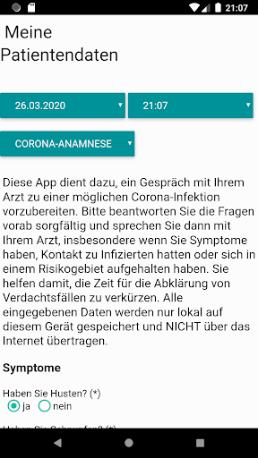
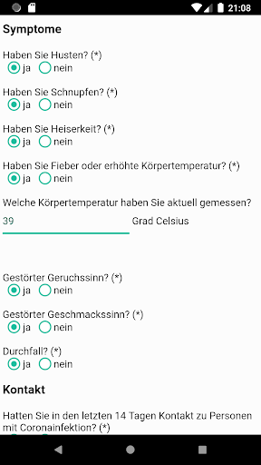
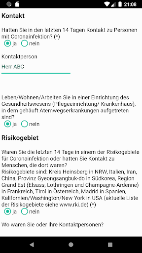
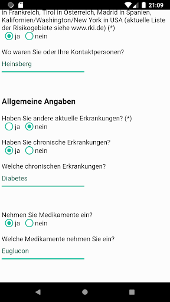
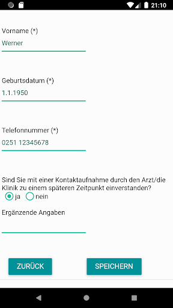
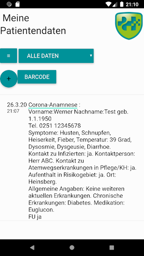
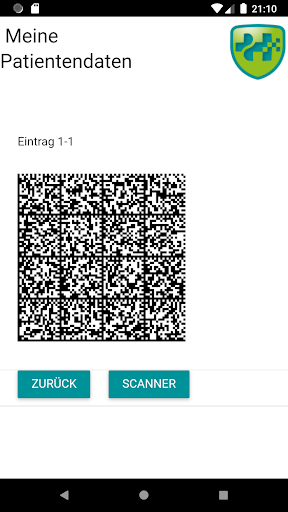
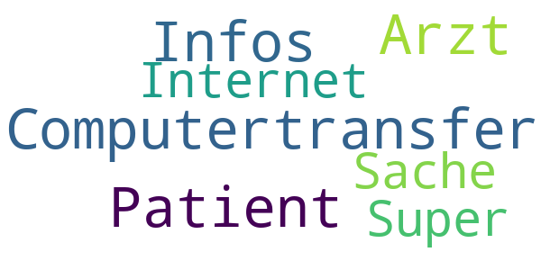

# Meine Patientendaten
App version ``1.3.0``

Analyzed with [covid-apps-observer](http://github.com/covid-apps-observer) project, version ``0.1``

## App overview
| | |
|-------------------------|-------------------------| 
| **Name**&nbsp;&nbsp;&nbsp;&nbsp;&nbsp;&nbsp;&nbsp;&nbsp;&nbsp;&nbsp;&nbsp;&nbsp;&nbsp;&nbsp;&nbsp;&nbsp;&nbsp;&nbsp;&nbsp;&nbsp;&nbsp;&nbsp;&nbsp;&nbsp;&nbsp;&nbsp;&nbsp;&nbsp;&nbsp;&nbsp;&nbsp;&nbsp;&nbsp;&nbsp;&nbsp;&nbsp;&nbsp;&nbsp;&nbsp;&nbsp;  | Meine Patientendaten |
| **Unique identifier** | de.my.patientdata |
| **Link to Google Play** | [https://play.google.com/store/apps/details?id=de.my.patientdata](https://play.google.com/store/apps/details?id=de.my.patientdata) |
| **Summary**  | Speicherung von Patientendaten und Datenaustausch beim Arztbesuch via Barcode. |
| **Privacy policy** | [https://hippokrates-it.de/datenschutz_app.html](https://hippokrates-it.de/datenschutz_app.html) |
| **Latest version** | 1.3.0 |
| **Last update** | 2020-04-14 17:05:06 |
| **Recent changes** | Jetzt mit CE-Kennzeichnung |
| **Installs**  | 500+ |
| **Category** | Medizin |
| **First release** | 14.03.2018 |
| **Size**  | 5,8M |
| **Supported Android version**  | 4.4 oder höher |

### Description
> Diese App dient zur DSGVO-konformen Speicherung Ihrer Patientendaten und zum Datenaustausch beim Arztbesuch. Aktuell wurde die App um einen Fragebogen zur Vorbereitung der Corona-Testung und zur Verlaufsdokumentation ergänzt. Sie können Ihre Symptome oder Ihre Medikamente eingeben und die gesammelten Daten Ihrem Arzt oder Ihrer Ärztin zeigen. Über einen Barcode kann Ihr Arzt diese Daten direkt in sein Computersystem übernehmen OHNE Nutzung des Internets. Umgekehrt können Sie Daten mittels Barcode in diese App einlesen. Ihre Patientendaten werden nur auf Ihrem Smartphone bzw. Tablet in verschlüsselter Form gespeichert. Andere Apps haben keinen Zugang zu Ihren Patientendaten - Sie haben die Kontrolle. Über ein USB-Kabel können Sie eine Sicherheitskopie Ihrer Daten erstellen. Bitte prüfen Sie Ihre Daten auf Vollständigkeit und Korrektheit.

### User interface
The developers of the app provide the following screenshots in the Google play store.
| | | |
|:-------------------------:|:-------------------------:|:-------------------------:|
 |   |   |   | 
 |   |   |   | 
 |  

## Development team
In the following we report the main information provided by the development team in the Google play store.

| | |
|-------------------------|-------------------------|
| **Developer**  | Hippokrates IT GmbH |
| **Website**  | [https://hippokrates-it.de](https://hippokrates-it.de) |
| **Email** | info@hippokrates-it.de |
| **Physical address**  | [D-48163 Münster](https://www.google.com/maps/search/D-48163%20Münster) (Google Maps) |
| **Other developed apps**  | [https://play.google.com/store/apps/developer?id=Hippokrates+IT+GmbH](https://play.google.com/store/apps/developer?id=Hippokrates+IT+GmbH) |

## Android support

| | |
|-------------------------|-------------------------|
| **Declared target Android version**  | Pie, version 9 (API level 28) |
| **Effective target Android version**  | Pie, version 9 (API level 28) |
| **Minimum supported Android version**  | KitKat, version 4.4 - 4.4.4 (API level 19) |
| **Maximum target Android version**  | - |

The larger the difference between the minimum and maximum supported Android versions, the better. A larger difference means a wider audience. For example, old phones have a very low Android version, so a high minimum supported Android version means that the app cannot be used by users with old phones, thus leading to accessibility problems. 

## Requested permissions

In the following we report the complete list of the permissions requested by the app. 

| **Permission** | **Protection level** | **Description** | 
|-------------------------|-------------------------|-------------------------|
 **android.permission ACCESS_COARSE_LOCATION** | :warning:**Dangerous** | Allows an app to access approximate location. 
 **android.permission ACCESS_FINE_LOCATION** | :warning:**Dangerous** | Allows an app to access precise location. 
 **android.permission ACCESS_NETWORK_STATE** | Normal | Allows applications to access information about networks. 
 **android.permission BLUETOOTH** | Normal | Allows applications to connect to paired bluetooth devices. 
 **android.permission BLUETOOTH_ADMIN** | Normal | Allows applications to discover and pair bluetooth devices. 
 **android.permission BODY_SENSORS** | :warning:**Dangerous** | Allows an application to access data from sensors that the user uses to measure what is happening inside his/her body, such as heart rate. 
 **android.permission CAMERA** | :warning:**Dangerous** | Required to be able to access the camera device. 
 **android.permission FLASHLIGHT** | - | - 
 **android.permission INTERNET** | Normal | Allows applications to open network sockets. 
 **android.permission READ_APP_BADGE** | - | - 
 **android.permission READ_PHONE_STATE** | :warning:**Dangerous** | Allows read only access to phone state, including the phone number of the device, current cellular network information, the status of any ongoing calls, and a list of any PhoneAccounts registered on the device. 
 **android.permission RECEIVE_BOOT_COMPLETED** | Normal | Allows an application to receive the Intent.ACTION_BOOT_COMPLETED that is broadcast after the system finishes booting. 
 **android.permission WAKE_LOCK** | Normal | Allows using PowerManager WakeLocks to keep processor from sleeping or screen from dimming. 
 **android.permission WRITE_EXTERNAL_STORAGE** | :warning:**Dangerous** | Allows an application to write to external storage. 
 **com.anddoes.launcher.permission UPDATE_COUNT** | - | - 
 **com.htc.launcher.permission READ_SETTINGS** | - | - 
 **com.htc.launcher.permission UPDATE_SHORTCUT** | - | - 
 **com.huawei.android.launcher.permission CHANGE_BADGE** | - | - 
 **com.huawei.android.launcher.permission READ_SETTINGS** | - | - 
 **com.huawei.android.launcher.permission WRITE_SETTINGS** | - | - 
 **com.majeur.launcher.permission UPDATE_BADGE** | - | - 
 **com.oppo.launcher.permission READ_SETTINGS** | - | - 
 **com.oppo.launcher.permission WRITE_SETTINGS** | - | - 
 **com.sec.android.provider.badge.permission READ** | - | - 
 **com.sec.android.provider.badge.permission WRITE** | - | - 
 **com.sonyericsson.home.permission BROADCAST_BADGE** | - | - 
 **com.sonymobile.home.permission PROVIDER_INSERT_BADGE** | - | - 
 **me.everything.badger.permission BADGE_COUNT_READ** | - | - 
 **me.everything.badger.permission BADGE_COUNT_WRITE** | - | - 

## Mentioned servers

| **Server** | **Registrant** | **Registrant country** | **Creation date** | 
|-------------------------|-------------------------|-------------------------|-------------------------|
 | google.com | Google LLC | :us: US | 1997-09-15 04:00:00 |
 | googleapis.com | Google LLC | :us: US | 2005-01-25 17:52:26 |
 | appspot.com | Google LLC | :us: US | 2005-03-10 02:27:55 |
 | gstatic.com | Google LLC | :us: US | 2008-02-11 15:31:25 |

## Security analysis 

Below we report the main security warnings raised by our execution of the [Androwarn](https://github.com/maaaaz/androwarn) security analysis tool.

**Telephony identifiers leakage**
> - This application reads the ISO country code equivalent for the SIM provider's country code 
> - This application reads the MCC+MNC of the provider of the SIM 
> - This application reads the SIM's serial number 
> - This application reads the Service Provider Name (SPN) 
> - This application reads the constant indicating the state of the device SIM card 
> - This application reads the device phone type value 
> - This application reads the phone number string for line 1, for example, the MSISDN for a GSM phone 
> - This application reads the phone's current state 
> - This application reads the radio technology (network type) currently in use on the device for data transmission 
> - This application reads the software version number for the device, for example, the IMEI/SV for GSM phones 
> - This application reads the type of activity on a data connection 
> - This application reads the unique device ID, i.e the IMEI for GSM and the MEID or ESN for CDMA phones 
> - This application reads the unique subscriber ID, for example, the IMSI for a GSM phone 

**Connection interfaces exfiltration**
> - This application reads details about the currently active data network 
> - This application tries to find out if the currently active data network is metered 

**Telephony services abuse**
> - This application makes phone calls 

**Suspicious connection establishment**
> - This application opens a Socket and connects it to the remote address '' on the 'N/A' port  
> - This application opens a Socket and connects it to the remote address 'Ljava/lang/StringBuilder;->toString()Ljava/lang/String;' on the ': connect, resolve' port  
> - This application opens a Socket and connects it to the remote address 'Ljava/lang/StringBuilder;->toString()Ljava/lang/String;' on the 'N/A' port  
> - This application opens a Socket and connects it to the remote address 'Ljava/net/Proxy;->type()Ljava/net/Proxy$Type;' on the 'N/A' port  
> - This application opens a Socket and connects it to the remote address 'timeout' on the 'N/A' port  

**Pim data leakage**
> - This application accesses data stored in the clipboard 

**Code execution**
> - This application executes a UNIX command 

## User ratings and reviews

Below we provide information about how end users are reacting to the app in terms of ratings and reviews in the Google Play store.

### Ratings

The Meine Patientendaten app has been installed by more than **500** times. At this time, **-** rated the app and its average score is **0.0**. Below we show the distribution of the ratings across the usual star-based rating of Google Play

:star::star::star::star::star:: 0

:star::star::star::star:: 0

:star::star::star:: 0

:star::star:: 0

:star:: 0

### Reviews 

#### 5-star reviews

> Sehr gute App mit den Daten von einem  :date: __2021-07-26 14:29:04__

> Computertransfer von Infos zwischen Patient und Arzt ohne Internet. Super Sache.  :date: __2018-08-30 23:11:14__

#### 4-star reviews

No recent reviews available with 4 stars.

#### 3-star reviews

> Nur mal angeschaut. Kein endgültiges Urteil möglich.  :date: __2021-02-25 21:04:43__

#### 2-star reviews

No recent reviews available with 2 stars.

#### 1-star reviews

> Wozu soll ich etwas notieren wozu das Arztpatientengespäch ist. Dieses kann 
auch in einer Notiz erfasst werden.  :date: __2018-08-20 16:29:07__

