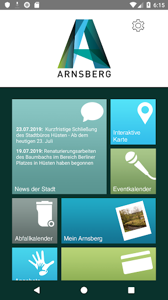
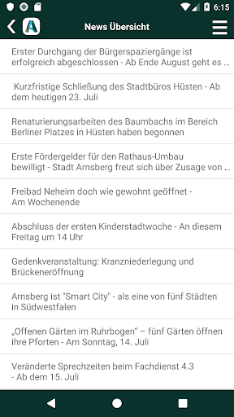

# ArnsbergApp
App version ``2.0.9``

Analyzed with [covid-apps-observer](http://github.com/covid-apps-observer) project, version ``0.1``

## App overview
| | |
|-------------------------|-------------------------| 
| **Name**&nbsp;&nbsp;&nbsp;&nbsp;&nbsp;&nbsp;&nbsp;&nbsp;&nbsp;&nbsp;&nbsp;&nbsp;&nbsp;&nbsp;&nbsp;&nbsp;&nbsp;&nbsp;&nbsp;&nbsp;&nbsp;&nbsp;&nbsp;&nbsp;&nbsp;&nbsp;&nbsp;&nbsp;&nbsp;&nbsp;&nbsp;&nbsp;&nbsp;&nbsp;&nbsp;&nbsp;&nbsp;&nbsp;&nbsp;&nbsp;  | ArnsbergApp |
| **Unique identifier** | de.nexoma.arnsbergapp |
| **Link to Google Play** | [https://play.google.com/store/apps/details?id=de.nexoma.arnsbergapp](https://play.google.com/store/apps/details?id=de.nexoma.arnsbergapp) |
| **Summary**  | ArnsbergApp - ein nützlicher Alltagshelfer für alle Arnsbergerinnen/Arnsberger |
| **Privacy policy** | [https://www.arnsberg.de/datenschutz/apps/arnsberg-app.php](https://www.arnsberg.de/datenschutz/apps/arnsberg-app.php) |
| **Latest version** | 2.0.9 |
| **Last update** | 2020-11-18 18:47:56 |
| **Recent changes** | Solve different bugs found in Android versions greater than 9 like opening the Interactive Map and Publishing Photos in the section &quot;Mein Arnsberg&quot; |
| **Installs**  | 5.000+ |
| **Category** | Reisen & Lokales |
| **First release** | 10.02.2016 |
| **Size**  | 13M |
| **Supported Android version**  | 5.1 oder höher |

### Description
> Die ArnsbergApp enthält aktuelle Veranstaltungstipps für Arnsberg. Hier kann nach Kategorien und Stadtteilen gefiltert werden. Im integrierten Stadtplan werden Orte und Einrichtungen für Kinder und Jugendliche visualisiert dargestellt. Die Informationen der Stadtverwaltung können themenbezogen ausgewählt werden. Die ArnsbergApp ist mit der ÖPNV-Auskunft, dem Kinoprogramm und dem individuellen Abfallkalender auch nützlicher Alltagshelfer. Besitzer der Arnsberger Familienkarte können diese in der App freischalten und das Smartphone als Familienkarte nutzen. Weitere Apps der Stadtverwaltung können hier ebenfalls abgerufen werden.

### User interface
The developers of the app provide the following screenshots in the Google play store.
| | | |
|:-------------------------:|:-------------------------:|:-------------------------:|
 |   |   |   | 
 |   |  

## Development team
In the following we report the main information provided by the development team in the Google play store.

| | |
|-------------------------|-------------------------|
| **Developer**  | Stadt Arnsberg |
| **Website**  | [http://www.nexoma.de](http://www.nexoma.de) |
| **Email** | app-development@nexoma.de |
| **Physical address**  | [Rathausplatz 1 59759 Arnsberg GERMANY](https://www.google.com/maps/search/Rathausplatz%201%2059759%20Arnsberg%20GERMANY) (Google Maps) |
| **Other developed apps**  | [https://play.google.com/store/apps/developer?id=Stadt+Arnsberg](https://play.google.com/store/apps/developer?id=Stadt+Arnsberg) |

## Android support

| | |
|-------------------------|-------------------------|
| **Declared target Android version**  | Pie, version 9 (API level 28) |
| **Effective target Android version**  | Pie, version 9 (API level 28) |
| **Minimum supported Android version**  | Lollipop, version 5.1 (API level 22) |
| **Maximum target Android version**  | - |

The larger the difference between the minimum and maximum supported Android versions, the better. A larger difference means a wider audience. For example, old phones have a very low Android version, so a high minimum supported Android version means that the app cannot be used by users with old phones, thus leading to accessibility problems. 

## Requested permissions

In the following we report the complete list of the permissions requested by the app. 

| **Permission** | **Protection level** | **Description** | 
|-------------------------|-------------------------|-------------------------|
 **android.permission ACCESS_COARSE_LOCATION** | :warning:**Dangerous** | Allows an app to access approximate location. 
 **android.permission ACCESS_FINE_LOCATION** | :warning:**Dangerous** | Allows an app to access precise location. 
 **android.permission ACCESS_NETWORK_STATE** | Normal | Allows applications to access information about networks. 
 **android.permission CAMERA** | :warning:**Dangerous** | Required to be able to access the camera device. 
 **android.permission INTERNET** | Normal | Allows applications to open network sockets. 
 **android.permission READ_EXTERNAL_STORAGE** | :warning:**Dangerous** | Allows an application to read from external storage. 
 **android.permission WAKE_LOCK** | Normal | Allows using PowerManager WakeLocks to keep processor from sleeping or screen from dimming. 
 **android.permission WRITE_EXTERNAL_STORAGE** | :warning:**Dangerous** | Allows an application to write to external storage. 
 **com.google.android.c2dm.permission RECEIVE** | - | - 
 **com.google.android.providers.gsf.permission READ_GSERVICES** | - | - 

## Mentioned servers

| **Server** | **Registrant** | **Registrant country** | **Creation date** | 
|-------------------------|-------------------------|-------------------------|-------------------------|
 | android.com | Google LLC | :us: US | 1997-06-23 04:00:00 |
 | google.com | Google LLC | :us: US | 1997-09-15 04:00:00 |
 | arnsberg.de | - | - | - |
 | xmlpull.org | WhoisGuard, Inc. | PA | 2001-11-26 20:33:08 |
 | googleapis.com | Google LLC | :us: US | 2005-01-25 17:52:26 |
 | hockeyapp.net | Microsoft Corporation | :us: US | 2011-01-23 18:46:43 |
 | adobe.com | Adobe Inc. | :us: US | 1986-11-17 05:00:00 |
 | kino.de | - | - | - |
 | nrw.de | - | - | - |
 | westfalenfahrplan.de | - | - | - |
 | c-trace.de | - | - | - |
 | fake.de | - | - | - |
 | googleapis.com | Google LLC | :us: US | 2005-01-25 17:52:26 |

## Security analysis 

Below we report the main security warnings raised by our execution of the [Androwarn](https://github.com/maaaaz/androwarn) security analysis tool.

**Connection interfaces exfiltration**
> - This application reads details about the currently active data network 
> - This application tries to find out if the currently active data network is metered 

**Telephony services abuse**
> - This application makes phone calls 

**Suspicious connection establishment**
> - This application opens a Socket and connects it to the remote address '' on the 'N/A' port  
> - This application opens a Socket and connects it to the remote address 'Ljava/lang/StringBuilder;->toString()Ljava/lang/String;' on the 'N/A' port  
> - This application opens a Socket and connects it to the remote address 'Ljava/net/Proxy;->type()Ljava/net/Proxy$Type;' on the 'N/A' port  
> - This application opens a Socket and connects it to the remote address 'timeout' on the 'N/A' port  

**Code execution**
> - This application loads a native library 
> - This application loads a native library: 'yuv-decoder' 

## User ratings and reviews

Below we provide information about how end users are reacting to the app in terms of ratings and reviews in the Google Play store.

### Ratings

The ArnsbergApp app has been installed by more than **5000** times. At this time, **32** rated the app and its average score is **4.03125**. Below we show the distribution of the ratings across the usual star-based rating of Google Play

:star::star::star::star::star:: 17

:star::star::star::star:: 9

:star::star::star:: 0

:star::star:: 2

:star:: 4

### Reviews 

#### 5-star reviews

> Gute Idee  :date: __2016-03-11 14:08:14__

> Super sache  :date: __2016-03-06 11:03:08__

> Super  :date: __2016-03-03 23:29:47__

> Man hat alles im Blick. Super App!  :date: __2016-03-02 17:47:49__

#### 4-star reviews

> Die Wochenanzeige funktioniert wieder. Nur für Meschede werden keine Veranstaltungen angezeigt. Haken setzen hat keine Auswirkungen. Der Veranstaltungskalender ist ein Witz. Es sind kaum Veranstaltungen eingetragen. Gerade mal 2-3 Wochen, danach ist gähnende Leere. Was soll die Seitenwahl, wenn auf der 2ten Seite schon nichts mehr steht. Keine zukünftigen Termine von der Kulturschmiede und vom Sauerlandtheater.  :date: __2018-11-05 11:35:36__

> Bei der Familienkarte fehlen z.b. die einzelnen Mitglieder. Ansonsten ist es praktisch diese nun immer parat zu haben.  :date: __2016-07-06 12:36:02__

> Nach den Anfänglichen Schwierigkeiten läuft endlich alles :-)                                              Edit: währe es möglich, den Homescreen scrollbar zu machen? Dann sieht es nicht so zusamnengequetscht aus. Dann gäbe es volle 5 Sterne! :-)  :date: __2016-06-29 17:03:29__

> Man findet Sachen  nur nicht sorgt wieder, sonst sehr praktisch 😆  :date: __2016-04-25 14:31:07__

> Ich wünsche mir einen Menupunkt wo man Öffnungszeiten von Behörden wie Stadtbüro, Jobcenter usw. nachschauen kann :)  :date: __2016-03-15 12:52:08__

> Recht gute Idee. Beim Stadtplan wäre eine Suche nach Strassennamen nützlich.  :date: __2016-03-12 16:34:41__

#### 3-star reviews

No recent reviews available with 3 stars.

#### 2-star reviews

> Wie wäre es den Abfallkalender intuitiver zu erweitern. Mit pushfunktion, und speicherbarer Adresse. Jedesmal die PDF öffnen, da kann ich auch auf den Kalender in Papierform zurückgreifen. Das wäre ein weiterer kleiner digitaler Fortschritt für Arnsberg ;-) Grüße D.Reuther  :date: __2020-12-29 10:55:23__

> Nicht mal alle Events (zum Beispiel der Arnsberger Woche ) sind gelistet. Kein App ist besser als eine lieblos ins Netz gestellte.  Schade, der Ansatz ist gut. Um sich zu informieren braucht es immer noch eine Zeitung  :date: __2017-05-28 10:13:47__

#### 1-star reviews

> App stürzt ab und verlinkte Inhalte sind nicht erreichbar.  :date: __2020-09-30 11:56:17__

> Funktioniert nicht  :date: __2020-01-18 18:55:28__

> Sage mal kann das sein das euch Jugendlichen ins Gehirn geschmissen wurde. Man will nicht wissen wann ein Bibel treffen ist so ein Müll hat nichts auf dem Handy zu suchen  :date: __2016-11-22 18:47:13__

