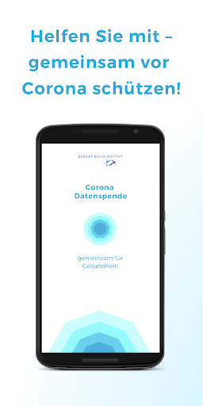
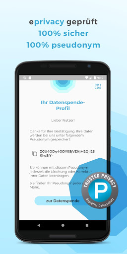
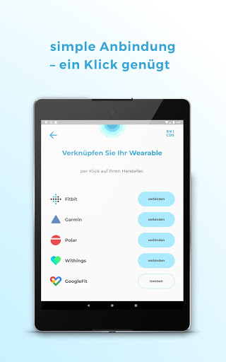
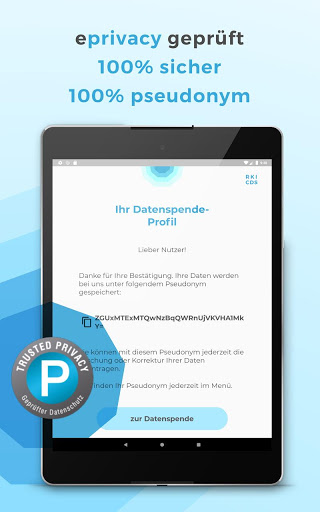
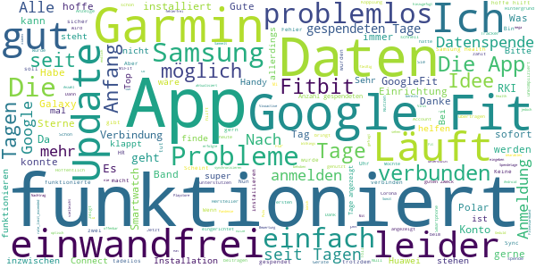
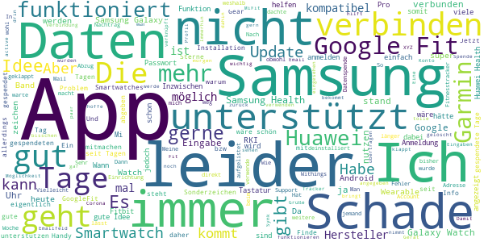
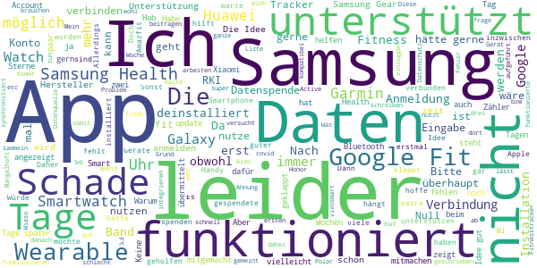

# Corona-Datenspende
App version ``1.1.0``

Analyzed with [covid-apps-observer](http://github.com/covid-apps-observer) project, version ``0.1``

## App overview
| | |
|-------------------------|-------------------------| 
| **Name**&nbsp;&nbsp;&nbsp;&nbsp;&nbsp;&nbsp;&nbsp;&nbsp;&nbsp;&nbsp;&nbsp;&nbsp;&nbsp;&nbsp;&nbsp;&nbsp;&nbsp;&nbsp;&nbsp;&nbsp;&nbsp;&nbsp;&nbsp;&nbsp;&nbsp;&nbsp;&nbsp;&nbsp;&nbsp;&nbsp;&nbsp;&nbsp;&nbsp;&nbsp;&nbsp;&nbsp;&nbsp;&nbsp;&nbsp;&nbsp;  | Corona-Datenspende |
| **Unique identifier** | de.rki.coronadatenspende |
| **Link to Google Play** | [https://play.google.com/store/apps/details?id=de.rki.coronadatenspende](https://play.google.com/store/apps/details?id=de.rki.coronadatenspende) |
| **Summary**  | Unterstützen Sie das Robert-Koch-Institut in der Eindämmung der Covid-Epidemie! |
| **Privacy policy** | [https://corona-datenspende.de/datenschutz-app/](https://corona-datenspende.de/datenschutz-app/) |
| **Latest version** | 1.1.0 |
| **Last update** | 2020-05-10 22:12:36 |
| **Recent changes** | - Anpassungen bei der Statusanzeige der verbundenen Datenquellen - Verschiedene Bugfixes und Layoutanpassungen |
| **Installs**  | 100.000+ |
| **Category** | Gesundheit & Fitness |
| **First release** | 31.03.2020 |
| **Size**  | 15M |
| **Supported Android version**  | 5.0 oder höher |

### Description
> Das Robert Koch-Institut bittet die Bevölkerung um Unterstützung bei der Eindämmung der aktuellen COVID-19 Pandemie. Mit der Corona-Datenspende-App stellen Personen freiwillig dem Robert Koch-Institut Daten ihrer Fitnessarmbänder oder ihrer Smartwatches zur Verfügung. Diese Daten können dabei helfen, die Ausbreitung des Coronavirus besser zu erfassen und zu verstehen.
 Hilft bei der Bekämpfung des Coronavirus
 Freiwillig und pseudonym
 Berücksichtigt den Datenschutz
 In weniger als 3 Minuten eingerichtet
 Bitte beachten Sie, dass für die Nutzung der App Corona-Datenspende ein Fitnessarmband oder eine Smartwatch notwendig ist.
 Unterstützt werden aktuell über GoogleFit und AppleHealth verbundene Geräte sowie Geräte von Fitbit, Garmin, Polar und Withings/Nokia. Die Integration weiterer Geräte wird derzeit geprüft.
 Das Robert Koch-Institut wendet sich an alle Bürgerinnen und Bürger mit geeigneten Fitnessarmbändern oder Smartwatches und bittet um Teilnahme.
 Auf Basis Ihrer Bewegungs-, Schlaf- und Pulswerte können fieberhafte Infektionen erkannt werden. Das Robert Koch-Institut kann mögliche Coronavirus-Infektionen damit tagesaktuell abschätzen und vorhersagen.
 Mit der Corona-Datenspende-App können Sie vollständig pseudonym Informationen zur Verbreitung der Coronavirus-Infektion zur Verfügung stellen.
 Weitere Informationen in den FAQ:
 https://corona-datenspende.de/faq/

### User interface
The developers of the app provide the following screenshots in the Google play store.
| | | |
|:-------------------------:|:-------------------------:|:-------------------------:|
 |   |   |   | 
 |   |   |   | 
 |   |   |   | 
 |   |   |   | 
 |   |   |   | 
 |   |   |   | 

## Development team
In the following we report the main information provided by the development team in the Google play store.

| | |
|-------------------------|-------------------------|
| **Developer**  | Robert Koch-Institut |
| **Website**  | [https://corona-datenspende.de](https://corona-datenspende.de) |
| **Email** | info@corona-datenspende.de |
| **Physical address**  | [Robert Koch-Institut Nordufer 20 13353 Berlin](https://www.google.com/maps/search/Robert%20Koch-Institut%20Nordufer%2020%2013353%20Berlin) (Google Maps) |
| **Other developed apps**  | [https://play.google.com/store/apps/developer?id=Robert+Koch-Institut](https://play.google.com/store/apps/developer?id=Robert+Koch-Institut) |

## Android support

| | |
|-------------------------|-------------------------|
| **Declared target Android version**  | Pie, version 9 (API level 28) |
| **Effective target Android version**  | Pie, version 9 (API level 28) |
| **Minimum supported Android version**  | Lollipop, version 5.0 (API level 21) |
| **Maximum target Android version**  | - |

The larger the difference between the minimum and maximum supported Android versions, the better. A larger difference means a wider audience. For example, old phones have a very low Android version, so a high minimum supported Android version means that the app cannot be used by users with old phones, thus leading to accessibility problems. 

## Requested permissions

In the following we report the complete list of the permissions requested by the app. 

| **Permission** | **Protection level** | **Description** | 
|-------------------------|-------------------------|-------------------------|
 **android.permission ACCESS_NETWORK_STATE** | Normal | Allows applications to access information about networks. 
 **android.permission ACCESS_WIFI_STATE** | Normal | Allows applications to access information about Wi-Fi networks. 
 **android.permission INTERNET** | Normal | Allows applications to open network sockets. 

## Mentioned servers

| **Server** | **Registrant** | **Registrant country** | **Creation date** | 
|-------------------------|-------------------------|-------------------------|-------------------------|
 | google.com | Google LLC | :us: US | 1997-09-15 04:00:00 |

## Security analysis 

Below we report the main security warnings raised by our execution of the [Androwarn](https://github.com/maaaaz/androwarn) security analysis tool.

**Connection interfaces exfiltration**
> - This application reads details about the currently active data network 

**Pim data leakage**
> - This application accesses data stored in the clipboard 

**Code execution**
> - This application loads a native library: 'flutter' 
> - This application executes a UNIX command 

## User ratings and reviews

Below we provide information about how end users are reacting to the app in terms of ratings and reviews in the Google Play store.

### Ratings

The Corona-Datenspende app has been installed by more than **100000** times. At this time, **10938** rated the app and its average score is **2.4322345**. Below we show the distribution of the ratings across the usual star-based rating of Google Play

:star::star::star::star::star:: 2574

:star::star::star::star:: 751

:star::star::star:: 991

:star::star:: 1131

:star:: 5489

### Reviews 

#### 5-star reviews

> Funktioniert problemlos mit meiner Withings Steel HR Sport. Sehr schnell eingerichtet und auch anschließend nie Probleme mit gehabt.  :date: __2020-05-23 10:01:49__

> Ramona Rübasm  :date: __2020-05-22 17:48:13__

> Was tun für die Allgemeinheit.Top.  :date: __2020-05-22 14:30:27__

> Anmeldung Google Fit nicht möglich.... Nachtrag: Bei "Google anmelden" "über das Smartphone anmelden" deaktivieren. Dann geht es.  :date: __2020-05-22 07:30:37__

> Funktioniert mit Fitbit einwandfrei  :date: __2020-05-21 23:16:12__

> Funktioniert super mit 2 Garmin Uhren. Ich habe bereits 43 Tage Daten gespendet. Ja mehr Infos wären schon interessant, was mit den Daten passiert oder welche Schlüsse daraus bislang gezogen wurden.  :date: __2020-05-21 23:16:10__

> Funktioniert nicht mit Google Fit und Samsung Galaxy Watch  :date: __2020-05-21 14:15:21__

> Samsung Gear S3 nutzung möglich, wenn man die Daten mit google sync.  :date: __2020-05-20 11:44:17__

> super mega gut  :date: __2020-05-19 10:56:51__

> Gut  :date: __2020-05-19 00:57:18__

#### 4-star reviews

> Die Samsung Gearfit 2 pro bzw. Samsung Health ist leider nicht aufgeführt, ansonsten sehr gute App,  :date: __2020-05-22 16:49:49__

> Anmeldung funktioniert nun endlich.  :date: __2020-05-14 10:03:20__

> Eigentlich dachte ich einen Beitrag leisten zu können mit dem Zugriff zu meiner Smartwatch. Leider wird zwar eine Verbindung angezeigt, aber der Zähler steht seit ich die App habe auf "0 gespendete Tage" 🤷‍♀️ Dabei sind es jetzt schon 5 Tage. Für die Idee geb ich 2 ⭐ wenn der Zähler irgendwann funktioniert dann mehr. Nachdem ich die App zunächst gellscht und nach einer Weile neu installiert habe funktioniert der Tageszähler. daher auch 4 ⭐. Bitte noch mehr Infos im Menü dann ist's perfekt.  :date: __2020-05-14 05:17:55__

> Mii Bänder sind leider nicht in der Liste enthalten :( Kütt dat noch? Welche Tracker werden als näxtes implementiert? Jibbet da ne Roadmap? Nachtrag: Mi Band wird jetzt per Google fit erkannt...  :date: __2020-05-13 23:29:15__

> Mit der App Health Sync kann man Samsung Health mit Google Fit synchronisieren und damit Samsung Gear Uhren für die Datenspende verwenden  :date: __2020-05-13 15:33:53__

> Läuft so vor sich hin, keine Ahnung ob es hilft...  :date: __2020-05-13 11:10:45__

> Nachdem die App über drei Wochen keine gesammelte Tage angezeigt hatte, trotz erfolgreicher Verbindung mit meinen Garminkonto, scheint das mit dem letzten Update gefixt zu sein und die Tage werden jetzt angezeigt. Ich hoffe das nützt was und ich werde es auf jeden Fall weiter laufen lassen.  :date: __2020-05-12 11:58:35__

> Hat bei mir bislang keine Probleme gemacht. Ein Feedback, ob die gesammelten Daten schon was gebracht haben o.ä. wäre noch ganz gut.  :date: __2020-05-11 19:00:57__

> Ich komme gar nicht erst rein, meine Samsung Galaxy Watch Active ist gar nicht angegeben. Also wird es wohl nicht gehen😔  :date: __2020-05-10 21:23:17__

> Die App gewährt dem RKI lediglich Zugriff auf die Daten des eigenen Fitnesstrackers ohne einen unmittelbaren Mehrwert für den Datenspender. Eine App wäre hierzu nicht notwendig. Die Daten können bei Fitbit, Google Fit u.a. auch auf direkten Wege frei gegeben werden. Ein bißchen Mehrwert für den Nutzer z.B. in Form von Statistikdaten wäre für die Akzeptanz der App sicher hilfreich. Aber was soll man von einer Bundesbehörden wie dem RKI auch anderes erwarten ....  :date: __2020-05-09 08:43:09__

#### 3-star reviews

> Gute Idee, leider gibt es mit Garmin ein Synk Problem APP ist den ganzen Tag im Synk Modus kann so nicht gebraucht werden. Nachtrag, nach nun mehr 2 Tagen am Start gespendete Tage 0 ich warte noch bis morgen ist dann immer noch 0 Tage kommt die APP weg. Geht ja gar nicht.... Nachtrag: Jetzt funktioniert alles super  :date: __2020-05-20 19:00:31__

> Samsung galaxy watch active nicht dabei...tolle Idee...macht da mehr geräte kompatibel.... es ist wichtig ...danke RKI...  :date: __2020-05-19 11:37:52__

> Ich würde gern mitmachen aber meine Huawei Band 4 pro wird noch nicht Unterstützt. Stand 26.4.2020 immer noch kein Support. Ich dachte das alles ist so mega wichtig!? Stand 19.5.2020. Immer noch warte ich auf huawei Support.  :date: __2020-05-19 00:09:05__

> Ich kann diese App nicht verwenden, da ich ein Huawei Band 3 Pro habe.  :date: __2020-05-18 06:43:34__

> Vielleicht arbeitet die app in der Stille...man bekommt vom Datenaustausch oder Stand nichts mit. Ein bisschen unheimlich. Ich hoffe es hilft.  :date: __2020-05-17 21:55:50__

> Die App funktioniert mit meiner Fenix 3HR gut. Aber jetzt hab ich 40Tage gespendet, gibt's auch Mal nen Feedback vom RKI,?  :date: __2020-05-17 17:29:26__

> Update 15.5. Konto verbinden mit Google Fit weiterhin nicht möglich. Anmeldung am Googlekonto mit Email und Passwort nicht möglich, wenn Sonderzeichen im Passwort enthalten sind. Ein Wechsel auf Sonderzeichen via "123" Schaltfläche nicht möglich. Aufgetreten mit Honor 9 Lite, Android 9, Swiftkey Tastatur.  :date: __2020-05-15 12:57:01__

> Wann kann man mit einer "samsung gear fit 2 pro" Verbindung zur App aufnehmen  :date: __2020-05-14 18:10:38__

> Samsung Smartwatches (noch) nicht kompatibel Ich würde gern mit machen allerdings kann ich meine Galaxy Watch nicht verbinden. Es gibt wohl eine kostenpflichtige Möglichkeit über eine sync app seitens Samsung, das muss aber unbedingt auch kostenlos funktionieren!  :date: __2020-05-12 08:34:12__

> Huawei Health wird nicht unterstützt, bis dahin war die App gut zu installieren ;)  :date: __2020-05-11 15:02:24__

#### 2-star reviews

> Wann geht das endlich mit Samsung? Wir brauchen doch nicht über Datensicherheit zu reden, wenn die Daten erst kompliziert über drei unterschiedliche Anbieter synchronisiert werden müssen. In meinem Umfeld nutzt niemand die App, weil keiner eines der unterstützen Geräte besitzt. Aber eine Samsung SmartWatch haben die meisten von denen, die es nutzen würden, wenn es ginge.  :date: __2020-05-22 14:30:45__

> Ich hätte gerne teilgenommen. aber Samsung Fitness Uhr ist nicht aufgeführt. Apple übrigens auch nicht. Ich habe kein Verständnis dafür.  :date: __2020-05-20 00:07:30__

> Guten Tag, ich kann leider diese app auch nicht nutzen da mein Fitness tracker garnich dabei ist.  :date: __2020-05-18 11:49:36__

> Leider funktioniert das verbinden mit GoogleFit auf einen Pixel Smartphone nicht! Die Eingabe ist nur sporadisch in der Abmeldemaske möglich. Kommt man bis zum Kennwort kann man dies auch nicht immer eingehen. Klappt auch dies hängt er danach. (Die Fenster erscheinen akzeptieren aber keine Eingabe)  :date: __2020-05-18 11:24:32__

> Ich finde es doof das ich erst 16 sein muß obwohl man auch ab einen jüngeren alter an covid 19 erkranken kann.!!  :date: __2020-05-15 17:54:38__

> Ist ja mal wieder typisch...nicht durchdacht die App. Warum können Armbänder von Samsung und Xiaomi nicht verwendet werden??!!  :date: __2020-05-14 21:34:57__

> Google login hängt sich auf oder es kann kein @ geschrieben werden  :date: __2020-05-11 21:17:32__

> Keine Ahnung ob die App hilft Daten bzgl. Covid-19 zu sammeln, auswerten oder gar den User warnen kann. Habe sie wieder deinstalliert auf Grund von Datenschutzbedenken (Quellen: z.T. Printmedien, Webseiten, etc.). Sorry RKI.  :date: __2020-05-11 20:12:19__

> Leider werden keine Huawei Geräte unterstützt.  :date: __2020-05-11 20:10:50__

> Eine Samsung Health Unterstützenung wäre mal nicht schlecht wir können wir helfen wenn unsere Geräte nicht unterstützt werden Idee toll und wichtig Ausführung Mangelhaft !  :date: __2020-05-11 19:44:56__

#### 1-star reviews

> Ich hätte gerne geholfen. Mit einem P 30 Pro ist es nicht möglich die Daten für einen Garmin Login einzugeben.  :date: __2020-05-23 12:45:30__

> Seine Daten zu Spenden ist ja gerade wenn man bereit dazu ist in Zeiten der Pandemie durchaus ein nutzvolles Instrument. Allerdings eine App zu entwickeln die sich nur auf ca 4 oder 5 wearables beschränkt ist äußerst ineffizient. Mit zb einer Samsung Gear ist man an dem Punkt an dem diese app direkt keinen nutzen hat. Schade  :date: __2020-05-23 08:25:02__

> Wäre super, wenn man sich in seinen Google Account auch einloggen könnte 🤷‍♂️  :date: __2020-05-22 21:51:32__

> Mit der Samsung Uhr werden die Daten Automatisch mit Samsung Health app auf dem Handy Syncronisiert mit der App Health Sync was ihr in Google playstore bekommt Könnt ihr einstellen das alles von Samsung Healt zu Google fit übertragen wird ihr müsst nur die Datenspende App mit Google fit Verbinden  :date: __2020-05-22 20:48:52__

> Sobald sie funktioniert, würde ich sie wieder installieren. Ich kann mich mit meinem Garmin Account nicht anmelden. Sobald der login abgefragt wird friert der Bildschirm ein.  :date: __2020-05-22 19:08:26__

> Man kommt gar nicht rein  :date: __2020-05-22 18:31:30__

> 07.04. Keine Anmeldung am Google-Dienst möglich. 08.04., 20:20 Uhr. Es gab ein Update der App, die Anmeldung ist aber weiterhin nicht möglich. 09.04., 09:00 Uhr. Ich konnte mich jetzt anmelden. 22.04.: App neu installiert. Die Eingabe vom FIT-Passwort ist nach kurzer Zeit gesperrt. 25.05.: Das heutige Update hat mein Problem nicht behoben. Könnte man doch wenigstens sein PW in das Feld kopieren...aber auch das ist gesperrt. 22.05. Bisher keine Verbesserung  :date: __2020-05-22 18:09:20__

> Leider kann ich meine Fitnessapp (Samsung Helth) nicht verknüpfen. Die voreingestellten Apps habe ich nicht. Schade, ich hätte gerne geholfen.  :date: __2020-05-22 16:37:59__

> Da soll man helfen und kann es nicht da dich man sich nicht mal über google einlogen kann wenn man die adresse eingeben will hängt es sich auf somit kann ich meine hilfe nicht anbieten  :date: __2020-05-22 08:48:36__

> Habe mir extra einen Fitness tracker gekauft, weil ich etwas beitragen wollte. Leider fehlt mir die Analyse der Daten, bzw es war mir nicht möglich Hinweise darauf im Netz zu finden.  :date: __2020-05-22 08:20:14__

