# Corona-Datenspende
App version ``1.2.0``

Analyzed with [covid-apps-observer](http://github.com/covid-apps-observer) project, version ``0.1``

## App overview
| | |
|-------------------------|-------------------------| 
| **Name**&nbsp;&nbsp;&nbsp;&nbsp;&nbsp;&nbsp;&nbsp;&nbsp;&nbsp;&nbsp;&nbsp;&nbsp;&nbsp;&nbsp;&nbsp;&nbsp;&nbsp;&nbsp;&nbsp;&nbsp;&nbsp;&nbsp;&nbsp;&nbsp;&nbsp;&nbsp;&nbsp;&nbsp;&nbsp;&nbsp;&nbsp;&nbsp;&nbsp;&nbsp;&nbsp;&nbsp;&nbsp;&nbsp;&nbsp;&nbsp;  | Corona-Datenspende |
| **Unique identifier** | de.rki.coronadatenspende |
| **Link to Google Play** | [https://play.google.com/store/apps/details?id=de.rki.coronadatenspende](https://play.google.com/store/apps/details?id=de.rki.coronadatenspende) |
| **Summary**  | Unterstützen Sie das Robert-Koch-Institut in der Eindämmung der Covid-Epidemie! |
| **Privacy policy** | [https://corona-datenspende.de/datenschutz-app/](https://corona-datenspende.de/datenschutz-app/) |
| **Latest version** | 1.2.0 |
| **Last update** | 2020-05-28 17:16:35 |
| **Recent changes** | - Anpassungen bei der Verbindung neuer Datenquellen - Link zu Corona-Datenspende-Blog im Menü - Möglichkeit zur Löschung des Accounts im Hauptmenü - Verschiedene Bugfixes |
| **Installs**  | 100.000+ |
| **Category** | Gesundheit & Fitness |
| **First release** | 31.03.2020 |
| **Size**  | 15M |
| **Supported Android version**  | 5.0 oder höher |

### Description
> Das Robert Koch-Institut bittet die Bevölkerung um Unterstützung bei der Eindämmung der aktuellen COVID-19 Pandemie. Mit der Corona-Datenspende-App stellen Personen freiwillig dem Robert Koch-Institut Daten ihrer Fitnessarmbänder oder ihrer Smartwatches zur Verfügung. Diese Daten können dabei helfen, die Ausbreitung des Coronavirus besser zu erfassen und zu verstehen.
 Hilft bei der Bekämpfung des Coronavirus
 Freiwillig und pseudonym
 Berücksichtigt den Datenschutz
 In weniger als 3 Minuten eingerichtet
 Bitte beachten Sie, dass für die Nutzung der App Corona-Datenspende ein Fitnessarmband oder eine Smartwatch notwendig ist.
 Unterstützt werden aktuell über GoogleFit und AppleHealth verbundene Geräte sowie Geräte von Fitbit, Garmin, Polar und Withings/Nokia. Die Integration weiterer Geräte wird derzeit geprüft.
 Das Robert Koch-Institut wendet sich an alle Bürgerinnen und Bürger mit geeigneten Fitnessarmbändern oder Smartwatches und bittet um Teilnahme.
 Auf Basis Ihrer Bewegungs-, Schlaf- und Pulswerte können fieberhafte Infektionen erkannt werden. Das Robert Koch-Institut kann mögliche Coronavirus-Infektionen damit tagesaktuell abschätzen und vorhersagen.
 Mit der Corona-Datenspende-App können Sie vollständig pseudonym Informationen zur Verbreitung der Coronavirus-Infektion zur Verfügung stellen.
 Weitere Informationen in den FAQ:
 https://corona-datenspende.de/faq/

### User interface
The developers of the app provide the following screenshots in the Google play store.
| | | |
|:-------------------------:|:-------------------------:|:-------------------------:|
 |   |   | 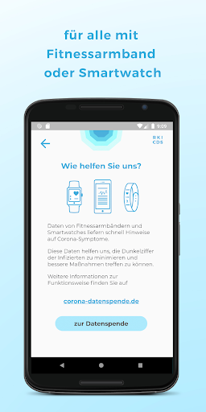  | 
 |   | 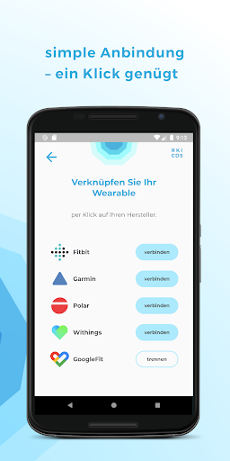  | 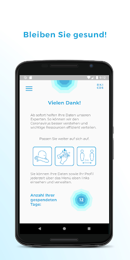  | 
 | 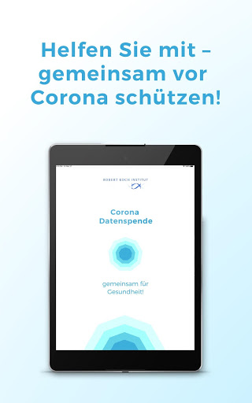  | 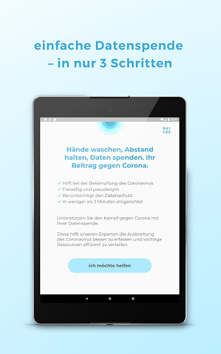  |   | 
 |   |   | 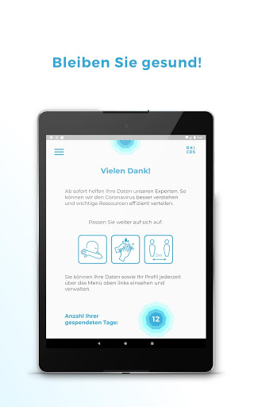  | 
 |   |   | 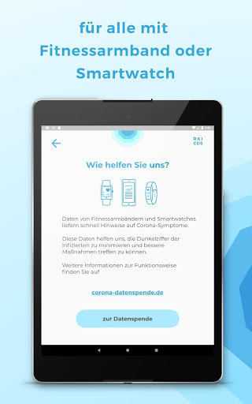  | 
 |   | 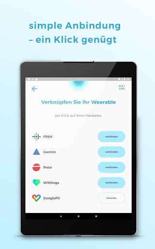  |   | 

## Development team
In the following we report the main information provided by the development team in the Google play store.

| | |
|-------------------------|-------------------------|
| **Developer**  | Robert Koch-Institut |
| **Website**  | [https://corona-datenspende.de](https://corona-datenspende.de) |
| **Email** | info@corona-datenspende.de |
| **Physical address**  | [Robert Koch-Institut Nordufer 20 13353 Berlin](https://www.google.com/maps/search/Robert%20Koch-Institut%20Nordufer%2020%2013353%20Berlin) (Google Maps) |
| **Other developed apps**  | [https://play.google.com/store/apps/developer?id=Robert+Koch-Institut](https://play.google.com/store/apps/developer?id=Robert+Koch-Institut) |

## Android support

| | |
|-------------------------|-------------------------|
| **Declared target Android version**  | Pie, version 9 (API level 28) |
| **Effective target Android version**  | Pie, version 9 (API level 28) |
| **Minimum supported Android version**  | Lollipop, version 5.0 (API level 21) |
| **Maximum target Android version**  | - |

The larger the difference between the minimum and maximum supported Android versions, the better. A larger difference means a wider audience. For example, old phones have a very low Android version, so a high minimum supported Android version means that the app cannot be used by users with old phones, thus leading to accessibility problems. 

## Requested permissions

In the following we report the complete list of the permissions requested by the app. 

| **Permission** | **Protection level** | **Description** | 
|-------------------------|-------------------------|-------------------------|
 **android.permission ACCESS_NETWORK_STATE** | Normal | Allows applications to access information about networks. 
 **android.permission ACCESS_WIFI_STATE** | Normal | Allows applications to access information about Wi-Fi networks. 
 **android.permission INTERNET** | Normal | Allows applications to open network sockets. 

## Mentioned servers

| **Server** | **Registrant** | **Registrant country** | **Creation date** | 
|-------------------------|-------------------------|-------------------------|-------------------------|
 | google.com | Google LLC | :us: US | 1997-09-15 04:00:00 |

## Security analysis 

Below we report the main security warnings raised by our execution of the [Androwarn](https://github.com/maaaaz/androwarn) security analysis tool.

**Connection interfaces exfiltration**
> - This application reads details about the currently active data network 

**Pim data leakage**
> - This application accesses data stored in the clipboard 

**Code execution**
> - This application loads a native library: 'flutter' 
> - This application executes a UNIX command 

## User ratings and reviews

Below we provide information about how end users are reacting to the app in terms of ratings and reviews in the Google Play store.

### Ratings

The Corona-Datenspende app has been installed by more than **100000** times. At this time, **11045** rated the app and its average score is **2.5022666**. Below we show the distribution of the ratings across the usual star-based rating of Google Play

:star::star::star::star::star:: 2793

:star::star::star::star:: 781

:star::star::star:: 981

:star::star:: 1111

:star:: 5377

### Reviews 

#### 5-star reviews

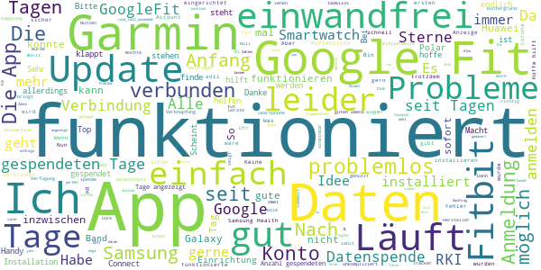

> HANSJÖRG Duhnke ",,  :date: __2020-06-01 10:42:30__

> Macht was es soll.  :date: __2020-05-31 19:40:45__

> Hat zwar lange gedauert, aber sei Ende Mai funktioniert jetzt alles.  :date: __2020-05-31 11:58:46__

> Nach dem ich herausgefunden hatte, dass ich auch im Fitbit Konto den Datenzugriff für die App freigeben muss und nicht nur in der RKI App (schön, dass sich Fitbit nixht so einfach "anzapfen" lässt) funktioniert es jetzt perfekt. 54 Tage "gespendet", nie ein Problem.  :date: __2020-05-31 07:35:36__

> Einer der wenigen Gründe in der Welt Datensammelei, die wirklich einen Zweck für die Allgemeinheit leisten.  :date: __2020-05-30 10:55:29__

> Ich finde sie findet sehr gut, und hilft einem guten Zweck  :date: __2020-05-30 05:42:21__

> Funktioniert inzwischen ohne Probleme. Auch nach Hardwarewechsel funktioniert die Synchronisierung mit dem bisherigen Fitbit Konto schnell.  :date: __2020-05-29 18:19:32__

> Die App bekommt von mir im Interesse des Gemeinwohls einen Vertrauensvorschuss. Ich glaube fest daran, dass die Nutzer als Freunde des RKI von einem Daten-Skandal à la Facebook & Cambridge Analytica verschont bleiben.  :date: __2020-05-29 11:23:38__

> Top Info zur ppandemie  :date: __2020-05-29 08:34:06__

> Nach dem letzten Update endlich Zahlen in der App 😉. Da stellen viele Menschen ihre persönlichsten Daten zur Verfügung und endlich kann man auch die ersten Zahlen im Blog sehen. Für alle Ungeduldigen - jeder halbwegs anständige Fitnesstracker sammelt erst mal 4 Wochen bevor er irgendwelche Empfehlungen ausspricht - und das sollte man dieser App auch zugestehen.... würde mich nicht wundern, wenn das hier langfristig die Tracing App wird, weil sich die Politik nicht verständigen kann 😉.  :date: __2020-05-29 06:07:01__

#### 4-star reviews

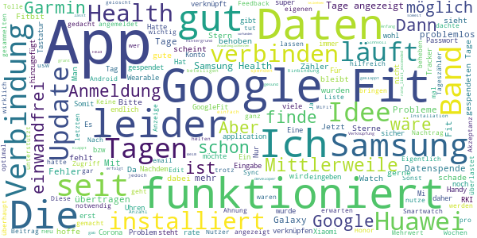

> Ich möchte über GoogleFit teilnehmen, weil mein Tracker nicht unter den Auswahlmöglichkeiten vorhanden ist. Das funktioniert nicht, da sich wohl zu viele Nutzer über GoogleFit angemeldet haben (Fehler 403). Für den Gedanken 2 Sterne, mehr dann, wenn's mal läuft. Update: es läuft problemlos !  :date: __2020-05-25 09:47:51__

> Leider kann ich mich nicht regestrienen bei google fit es wird nach der email gefragt aber ich kann keine eingabe tätigen auch nachdem update unverändert  :date: __2020-05-23 18:30:17__

> Die Samsung Gearfit 2 pro bzw. Samsung Health ist leider nicht aufgeführt, ansonsten sehr gute App,  :date: __2020-05-22 16:49:49__

> Anmeldung funktioniert nun endlich.  :date: __2020-05-14 10:03:20__

> Eigentlich dachte ich einen Beitrag leisten zu können mit dem Zugriff zu meiner Smartwatch. Leider wird zwar eine Verbindung angezeigt, aber der Zähler steht seit ich die App habe auf "0 gespendete Tage" 🤷‍♀️ Dabei sind es jetzt schon 5 Tage. Für die Idee geb ich 2 ⭐ wenn der Zähler irgendwann funktioniert dann mehr. Nachdem ich die App zunächst gellscht und nach einer Weile neu installiert habe funktioniert der Tageszähler. daher auch 4 ⭐. Bitte noch mehr Infos im Menü dann ist's perfekt.  :date: __2020-05-14 05:17:55__

> Mii Bänder sind leider nicht in der Liste enthalten :( Kütt dat noch? Welche Tracker werden als näxtes implementiert? Jibbet da ne Roadmap? Nachtrag: Mi Band wird jetzt per Google fit erkannt...  :date: __2020-05-13 23:29:15__

> Mit der App Health Sync kann man Samsung Health mit Google Fit synchronisieren und damit Samsung Gear Uhren für die Datenspende verwenden  :date: __2020-05-13 15:33:53__

> Läuft so vor sich hin, keine Ahnung ob es hilft...  :date: __2020-05-13 11:10:45__

> Nachdem die App über drei Wochen keine gesammelte Tage angezeigt hatte, trotz erfolgreicher Verbindung mit meinen Garminkonto, scheint das mit dem letzten Update gefixt zu sein und die Tage werden jetzt angezeigt. Ich hoffe das nützt was und ich werde es auf jeden Fall weiter laufen lassen.  :date: __2020-05-12 11:58:35__

> Hat bei mir bislang keine Probleme gemacht. Ein Feedback, ob die gesammelten Daten schon was gebracht haben o.ä. wäre noch ganz gut.  :date: __2020-05-11 19:00:57__

#### 3-star reviews

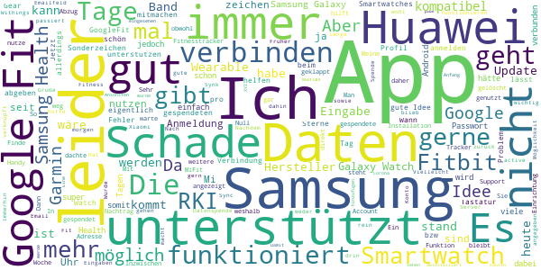

> Es passiert rein gar nichts  :date: __2020-06-01 10:46:57__

> Jetzt funktioniert endlich auch die Anmeldung in Google für den Sync mit Google Fit Daten. Mal warten, ob die Datenspende selbst auch noch funktioniert, die Idee ist ja gut. Ich erfasse die Pulsrate mit einem Xiaomi Mifit 3 Band und der Mi Notify und Fitness App, die ihrerseits täglich die Daten zu Google hoch lädt.  :date: __2020-05-31 06:29:49__

> Ohne einem Wearable oder Fitnesstracker kann diese App nicht genutzt werden. Ich hab das alles nicht.  :date: __2020-05-30 22:17:22__

> Verbinden mit Withings hat nun geklappt. Es bleibt spannend.  :date: __2020-05-30 14:50:27__

> Ich hab die App jetzt seit Version 1.0.1 und eine Fitbit Charge 4 und bis heute lässt sich das FitBit-Konto nicht mit dieser RKI App verknüpfen. Früher waren einfach die Buttons tot, jetzt kommt beim tippen auf z.B Fitbit nur "Server Fehler" - immer. Es geht einfach nicht. Völlig schwach. Die Fitbit hatte ich extra für diese App gekauft.  :date: __2020-05-30 07:16:40__

> Die App funktioniert......aber Transparenz?? Wer programmiert hier eigentlich? "Sie können Ihre Daten sowie Ihr Profil jederzeit über das Menü oben links einsehen und verwalten."....da sind weder Daten noch Profil. Das RKI hat einen Blog, warum kann der nicht z.B. über das RKI-Symbol aufgerufen werden? Alles in allem besser als nichts, wenn es den hilft:-)  :date: __2020-05-28 10:34:38__

> Da die app leider nur wenige Anbieter und Hersteller unterstützt, gehen viele Daten ungenutzt verloren. Ich selbst nutze mapmyrun, samsung health, sowie samsung fitness tracker. Hiervon wird nichts unterstützt und die Verbindung mit der einzigen unterstützten app(google fit) ist mangelhaft, da diese nicht mit den anderen apps synchronisiert. Würde mich freuen wenn ihr hier nachbessert.  :date: __2020-05-26 10:13:02__

> Nachdem keine Daten über eine Samsung Smartwatch möglich sind, habe ich die App wieder gelöscht.  :date: __2020-05-25 16:05:44__

> Ebenso wie bei anderen: Verbindung hergestellt, Tageszahl blieb zunächst lange bei Null. Aktuell werden nun 10 Tage angezeigt.  :date: __2020-05-25 14:18:24__

> Gute Idee, leider gibt es mit Garmin ein Synk Problem APP ist den ganzen Tag im Synk Modus kann so nicht gebraucht werden. Nachtrag, nach nun mehr 2 Tagen am Start gespendete Tage 0 ich warte noch bis morgen ist dann immer noch 0 Tage kommt die APP weg. Geht ja gar nicht.... Nachtrag: Jetzt funktioniert alles super  :date: __2020-05-20 19:00:31__

#### 2-star reviews

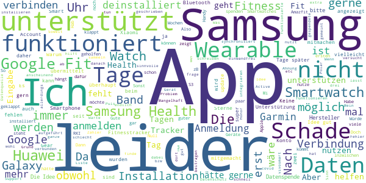

> Ich würde super gerne helfen aber leider wird Samsung noch nicht unterstützt. Wäre super wenn das schnellstmöglich kommt.  :date: __2020-06-01 11:07:04__

> Gute Idee, aber keine Schnittstelle zu Samsung Health, obwohl die Samsung Smartwatches und auch Smartphones sehr verbreitet sind...  :date: __2020-05-30 00:29:03__

> Schade das die App keine Huawei Smartwatch unterstützt. Leider immer noch keine Verbindung zu Huawei oder Samsung.  :date: __2020-05-29 05:43:26__

> Soweit eine sinnvolle App. Aber leider zeigte er am ersten Tag 0 Tage dann wieder 3 und jetzt wieder 0. Also anscheinend funktioniert die App nicht einwandfrei.  :date: __2020-05-28 13:19:58__

> Es fehlt die Anbindung an Huawei Health da Google Fit nicht alle Daten übernimmt (Puls und Gewicht fehlt zb)  :date: __2020-05-25 20:10:46__

> Kein Support für Samsung Wearables, daher macht es keinen Sinn die App zu installieren.  :date: __2020-05-25 17:01:51__

> Gerne würde ich dies unterstützen. Leider fehlenen einige Fitnesstracker (zB Huawei). Ich habe mich nun vor einigen Tagen endlich mit Google Fit anmelden können, hier wird allerdings der Puls nicht synchronosiert. Bis zum 24.5. wurden leider keine weiteren Fitnesstracker aufgenommen, sehr schade!  :date: __2020-05-24 10:38:59__

> Ich kann nicht unterstützen da ich die app flagfit 2 habe  :date: __2020-05-24 09:28:21__

> Wann geht das endlich mit Samsung? Wir brauchen doch nicht über Datensicherheit zu reden, wenn die Daten erst kompliziert über drei unterschiedliche Anbieter synchronisiert werden müssen. In meinem Umfeld nutzt niemand die App, weil keiner eines der unterstützen Geräte besitzt. Aber eine Samsung SmartWatch haben die meisten von denen, die es nutzen würden, wenn es ginge.  :date: __2020-05-22 14:30:45__

> Ich hätte gerne teilgenommen. aber Samsung Fitness Uhr ist nicht aufgeführt. Apple übrigens auch nicht. Ich habe kein Verständnis dafür.  :date: __2020-05-20 00:07:30__

#### 1-star reviews

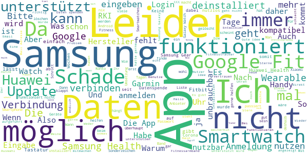

> Da mein Telefon nun nur noch 7 Stunden, statt 1,5 Tage bei stärkerer Nutzung hält, ist die App wieder weg. Auch wenn es schnell gehen muss, kann man sauber programmieren.  :date: __2020-06-01 11:03:52__

> Leider immernoch keine Schnittstelle mit Huawei Health...  :date: __2020-06-01 08:05:20__

> App leider deinstalliert! Die App unterstützt leider nicht meine Gear S3 bzw. Health Daten von der Samsung-App! Wenn es unterstützt wird werde ich sie evtl dann wieder installieren.  :date: __2020-06-01 05:51:02__

> Datenkrake  :date: __2020-05-31 14:30:37__

> Würde ja gerne zur Datenspende beitragen, jedoch wird Samsung Health und Galaxy Watch leider nicht unterstützt. Schade...  :date: __2020-05-31 07:04:54__

> Wäre gerne dabei aber ohne Samsung....  :date: __2020-05-30 23:12:23__

> Leider nicht auf allen Geräten verfügbar. Somit ist die APP Unbrauchbar für manche  :date: __2020-05-29 19:58:29__

> Leider nicht für sammsung gear  :date: __2020-05-29 13:12:36__

> Nach dem Update der App erscheint bei Auswahl eines Herstelles die Meldung: Serverproblem (Android 9) Seit 5 Wo wird jetzt da dran rumgemurkst, immer ein anderer Fehler!  :date: __2020-05-29 08:02:21__

> Installiert und gleich wieder deinstalliert, da meine billige Uhr von 34 Euro da nicht mit aufgeführt ist. Diese Uhre, die da aufgeführt sind kosten ab Hundert Euro bis über 200 Euro.  :date: __2020-05-28 19:56:33__

