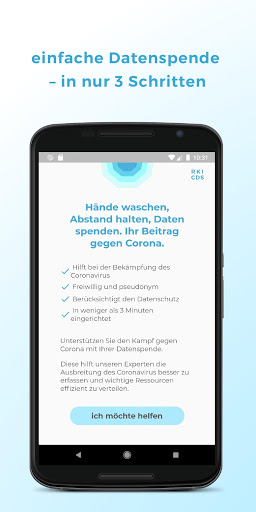
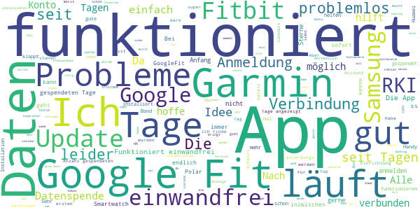
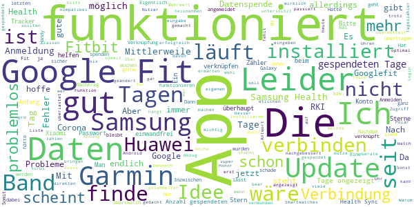
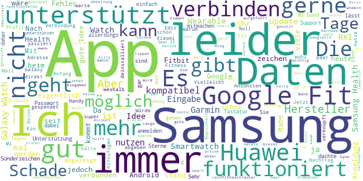
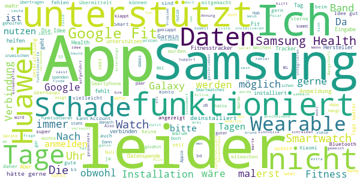
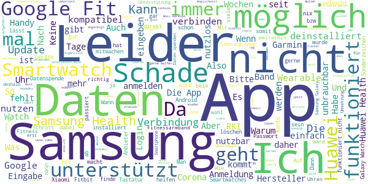

# Corona-Datenspende
App version ``1.2.1``

Analyzed with [covid-apps-observer](http://github.com/covid-apps-observer) project, version ``0.1``

## App overview
| | |
|-------------------------|-------------------------| 
| **Name**&nbsp;&nbsp;&nbsp;&nbsp;&nbsp;&nbsp;&nbsp;&nbsp;&nbsp;&nbsp;&nbsp;&nbsp;&nbsp;&nbsp;&nbsp;&nbsp;&nbsp;&nbsp;&nbsp;&nbsp;&nbsp;&nbsp;&nbsp;&nbsp;&nbsp;&nbsp;&nbsp;&nbsp;&nbsp;&nbsp;&nbsp;&nbsp;&nbsp;&nbsp;&nbsp;&nbsp;&nbsp;&nbsp;&nbsp;&nbsp;  | Corona-Datenspende |
| **Unique identifier** | de.rki.coronadatenspende |
| **Link to Google Play** | [https://play.google.com/store/apps/details?id=de.rki.coronadatenspende](https://play.google.com/store/apps/details?id=de.rki.coronadatenspende) |
| **Summary**  | Unterstützen Sie das Robert-Koch-Institut in der Eindämmung der Covid-Epidemie! |
| **Privacy policy** | [https://corona-datenspende.de/datenschutz-app/](https://corona-datenspende.de/datenschutz-app/) |
| **Latest version** | 1.2.1 |
| **Last update** | 2020-06-03 12:33:09 |
| **Recent changes** | Ergänzungen bei den Datenschutzhinweisen |
| **Installs**  | 100.000+ |
| **Category** | Gesundheit & Fitness |
| **First release** | 31.03.2020 |
| **Size**  | 15M |
| **Supported Android version**  | 5.0 oder höher |

### Description
> Das Robert Koch-Institut bittet die Bevölkerung um Unterstützung bei der Eindämmung der aktuellen COVID-19 Pandemie. Mit der Corona-Datenspende-App stellen Personen freiwillig dem Robert Koch-Institut Daten ihrer Fitnessarmbänder oder ihrer Smartwatches zur Verfügung. Diese Daten können dabei helfen, die Ausbreitung des Coronavirus besser zu erfassen und zu verstehen.
 Hilft bei der Bekämpfung des Coronavirus
 Freiwillig und pseudonym
 Berücksichtigt den Datenschutz
 In weniger als 3 Minuten eingerichtet
 Bitte beachten Sie, dass für die Nutzung der App Corona-Datenspende ein Fitnessarmband oder eine Smartwatch notwendig ist.
 Unterstützt werden aktuell über GoogleFit und AppleHealth verbundene Geräte sowie Geräte von Fitbit, Garmin, Polar und Withings/Nokia. Die Integration weiterer Geräte wird derzeit geprüft.
 Das Robert Koch-Institut wendet sich an alle Bürgerinnen und Bürger mit geeigneten Fitnessarmbändern oder Smartwatches und bittet um Teilnahme.
 Auf Basis Ihrer Bewegungs-, Schlaf- und Pulswerte können fieberhafte Infektionen erkannt werden. Das Robert Koch-Institut kann mögliche Coronavirus-Infektionen damit tagesaktuell abschätzen und vorhersagen.
 Mit der Corona-Datenspende-App können Sie vollständig pseudonym Informationen zur Verbreitung der Coronavirus-Infektion zur Verfügung stellen.
 Weitere Informationen in den FAQ:
 https://corona-datenspende.de/faq/

### User interface
The developers of the app provide the following screenshots in the Google play store.
| | | |
|:-------------------------:|:-------------------------:|:-------------------------:|
 |   |   |   | 
 |   |   |   | 
 |   |   |   | 
 |   |   |   | 
 |   |   |   | 
 |   |   |   | 

## Development team
In the following we report the main information provided by the development team in the Google play store.

| | |
|-------------------------|-------------------------|
| **Developer**  | Robert Koch-Institut |
| **Website**  | [https://corona-datenspende.de](https://corona-datenspende.de) |
| **Email** | info@corona-datenspende.de |
| **Physical address**  | [Robert Koch-Institut Nordufer 20 13353 Berlin](https://www.google.com/maps/search/Robert%20Koch-Institut%20Nordufer%2020%2013353%20Berlin) (Google Maps) |
| **Other developed apps**  | [https://play.google.com/store/apps/developer?id=Robert+Koch-Institut](https://play.google.com/store/apps/developer?id=Robert+Koch-Institut) |

## Android support

| | |
|-------------------------|-------------------------|
| **Declared target Android version**  | Pie, version 9 (API level 28) |
| **Effective target Android version**  | Pie, version 9 (API level 28) |
| **Minimum supported Android version**  | Lollipop, version 5.0 (API level 21) |
| **Maximum target Android version**  | - |

The larger the difference between the minimum and maximum supported Android versions, the better. A larger difference means a wider audience. For example, old phones have a very low Android version, so a high minimum supported Android version means that the app cannot be used by users with old phones, thus leading to accessibility problems. 

## Requested permissions

In the following we report the complete list of the permissions requested by the app. 

| **Permission** | **Protection level** | **Description** | 
|-------------------------|-------------------------|-------------------------|
 **android.permission ACCESS_NETWORK_STATE** | Normal | Allows applications to access information about networks. 
 **android.permission ACCESS_WIFI_STATE** | Normal | Allows applications to access information about Wi-Fi networks. 
 **android.permission INTERNET** | Normal | Allows applications to open network sockets. 

## Mentioned servers

| **Server** | **Registrant** | **Registrant country** | **Creation date** | 
|-------------------------|-------------------------|-------------------------|-------------------------|
 | google.com | Google LLC | :us: US | 1997-09-15 04:00:00 |

## Security analysis 

Below we report the main security warnings raised by our execution of the [Androwarn](https://github.com/maaaaz/androwarn) security analysis tool.

**Connection interfaces exfiltration**
> - This application reads details about the currently active data network 

**Pim data leakage**
> - This application accesses data stored in the clipboard 

**Code execution**
> - This application loads a native library: 'flutter' 
> - This application executes a UNIX command 

## User ratings and reviews

Below we provide information about how end users are reacting to the app in terms of ratings and reviews in the Google Play store.

### Ratings

The Corona-Datenspende app has been installed by more than **100000** times. At this time, **11083** rated the app and its average score is **2.5338752**. Below we show the distribution of the ratings across the usual star-based rating of Google Play

:star::star::star::star::star:: 2903

:star::star::star::star:: 790

:star::star::star:: 941

:star::star:: 1131

:star:: 5316

### Reviews 

#### 5-star reviews

> Läuft bei mir seit 89 Tagen ohne Probleme. Hoffentlich hilft das irgendwie mit.  :date: __2020-07-05 11:44:16__

> Die App funktioniert mit meiner Garmin Fenix 5plus tadellos seit der ersten Minute. Die vielen negativen Kommentare kommen scheinbar oft von Samsung-Usern welche nicht sauber unterstützt werden.  :date: __2020-07-04 09:37:47__

> An die ganzen Schlechtbewerter: Leute, bisschen mehr Geduld! Also bei mir geht alles. Nur eine Frage hätte ich noch: Muss ich meine Smartwatch den ganzen Tag mit dem Smartphon verbunden haben? EDIT: nachdem ich die App schon lange installiert habe, stehe ich immer noch bei 0 gespendete Tage. Was mach ich falsch?  :date: __2020-06-29 11:46:18__

> Die App funktioniert bei mir von Anfang an (bereits seit 77 Tagen) einwandfrei. Die öffentlichen Berichte des RKI über die Auswertung der Zahlen finde ich extrem spannend und lesenswert, da man so einen Bezug zu der Arbeitsweise bekommt. Toll. Ich bin froh dabei zu sein.  :date: __2020-06-28 09:21:13__

> Ok  :date: __2020-06-27 20:31:43__

> Funktioniert gut mit garmin venu und fitbit charge 2, interessanter blog  :date: __2020-06-26 21:27:56__

> Gute App  :date: __2020-06-26 17:42:07__

> achso na dann. also ein fitnessarmband habe ich jetzt nöcht.  :date: __2020-06-26 11:22:25__

> Super App. Über einen Exploit kann man mittels dieser App von außen beliebige Daten aufspielen und/oder auslesen! Seid schön brav und installiert die App. Vielleicht bekommt ihr dann eure Pornos im. Hintergrund umsonst mit drauf. Euch ist sowieso nicht mehr zu helfen. 👍👍👍17 BTW, das RKI hat sich geweigert, mit den Leuten, die diesen Fehler entdeckt haben, zusammenzuarbeiten und ihn zu beheben.  :date: __2020-06-22 12:25:50__

> Man kann helfen, ohne dass es etwas kostet!  :date: __2020-06-20 11:59:57__

#### 4-star reviews

> Leicht zu bedienen  :date: __2020-07-01 12:34:38__

> "Anzahl der gespendeten Tage" nach etlichen Tagen weiter auf Null. Angemeldet mit einer Garmin forerunner 235/SamsungS9.... Und jetzt? Augenscheinlich nix! Läuft die App überhaupt? Ein minderjähriger Informatiker aus Indien auf einem Nagelbrett, hätte das besser programmiert! Da will man helfen und nix passiert .... Nachtrag... funktioniert jetzt...  :date: __2020-07-01 07:07:38__

> Nach einigen Minuten hatte ich die App  :date: __2020-06-25 05:44:40__

> Login funktioniert jetzt auch mit Einfügen des Passworts über die Zwischenablage. Die Verbindung mit meinem Garmin Connect-Konto ist jetzt problemlos möglich. Mehr kann ich zu der App momentan noch nicht sagen.  :date: __2020-06-23 09:56:38__

> Ich hab die App in unter einer Minute eingerichtet und mit meiner Fitbit Charge 4 verbunden. Alles top, aber ich finde es sehr schade, dass ich nicht meine Daten der letzten Wochen spenden kann. Das wäre doch auch praktisch.  :date: __2020-06-18 20:33:57__

> Funktioniert soweit gut. Allerdings einen Stern Abzug für den Fehler, dass beim Wechsel der Datenquelle der Verlauf verloren geht und die App wieder von Tag 1 anfängt zu zählen. Wollte von Googlefit zu Fitbit wechseln, da bei Erstinstallation Fitbit noch nicht verfügbar war. Jetz hab ich wieder Googlefit eingestellt, aber Anzahl der Gespendeten Tage bleibt 0.  :date: __2020-06-18 14:10:02__

> Ist diese App überhaupt noch von nöten, wenn man sich die Corona Warn App auch runtergeladen hat? Beides stammt vom RKI?? Ich bitte um eine Antwort.  :date: __2020-06-18 08:18:15__

> brauche ich diese app jetzt noch wenn seit gestern die aktuelle corona app für den Download bereit steht?  :date: __2020-06-17 12:32:53__

> Hallo ich habe nur mal eine Frage, ich habe die App Installiert aber jetzt bin ich mir nicht sicher ob es Corona App die seit heute zum Installieren ist. Es wäre nett wenn ich eine Antwort bekomme.  :date: __2020-06-16 22:54:31__

> Scheint mit Garmin gut zu funktionieren. Handy und Garmin App läuft weiter stabil  :date: __2020-06-16 10:38:41__

#### 3-star reviews

> Schade, meine Huawei watch GT2 ist nicht dabei. Dabei ist diese Uhr weit verbreitet. Vielleicht bessert ihr noch nach?  :date: __2020-06-24 11:59:11__

> Anfang alles gut. Aber komme beim verbindungen des truker nicht weiter und kommt zu einer sever fehler. Ich habe android 5.1 . wenn mann hilfen soll dann ab 5.0 erstallen  :date: __2020-06-23 13:02:49__

> Warum gibt es keine Unterstützung für Samsung-Geräte? Habe eine Samsung Gear S3 und der Hersteller fehlt.  :date: __2020-06-19 12:44:37__

> Samsung Uhren gehen auch noch nicht  :date: __2020-06-17 10:34:27__

> An sich Recht gut lässt sich aber leider nicht mit der Xiaomi Mi band verbinden das müsste man hinzufügen  :date: __2020-06-16 13:11:03__

> Ich würde gerne, aber wie so viele hab ich Samsung.  :date: __2020-06-16 09:18:27__

> ...Was passiert eigentlich bei missbräuchlichen Anwendung? Person fährt dauerhaft Bus/Bahn in Großstadt und meldet sich fälschlich nach einer Woche als krank?..  :date: __2020-06-16 07:24:01__

> Mein smartwatch ist von Samsung, die mit der App nicht kompatibel ist. Es ist jetzt mit Google fit verbunden, was es aber nur auf meinem Handy gibt... Was auch keinen Sinn ergibt... Schauen wir mal. Nach den anderen Kommentaren zu urteilen funktioniert die App ja bei weitem noch nicht gut. Vielleicht folgen bald mehr Updates  :date: __2020-06-16 06:27:44__

> Habe auch eine Samsung Gear S3... Die Bereitschaft von mir ist da.. Aber so leider nicht! 10 Tage später noch immer kein Support = deinstalliert, Edit 16.06. Jetzt funktioniert anscheinend der Umweg über Google Fit, die ja die Daten von meiner Gear erhält. Mal sehen..  :date: __2020-06-16 03:08:25__

> Was sollen immer die Wörter wie "Bürger:innen" in den Texten der App? Wollen Sie damit modern wirken und die deutsche Sprache mit Füßen treten?  :date: __2020-06-15 18:55:50__

#### 2-star reviews

> Die Installation der App sowie die Verknüpfung zu Fitbit hat funktioniert, sogar nach dem Handywechsel problemlos.... anfangs ... denn nach einiger Zeit fing die Anzahl der gespendeten Tage wieder bei 0 an zu zählen. Ich weiß auch nicht, wie und wo ich meine Daten einsehen kann bzw. die Postleitzahl ändern könnte.  :date: __2020-07-06 21:28:31__

> Seit Wochen steht der Tageszähler auf dem Stand 14 von 14 Tagen. Wann stellt sich der Zählwert im? Die Updates sind auf dem neuesten Stand. Ich frage mich, ob die App überhaupt noch funktioniert.  :date: __2020-07-06 11:20:21__

> Leider immer noch keine Anbindung zu Samsung Health. Dadurch keine Trainingsverfolgung für die Nutzer von Samsung Geräten!!! Und leider wird die App auch nicht gut gepflegt. Ein letztes Update ist gut einen Monat her, am 02.06.20. So stelle ich mir eine verantwortungsvolle Datenpflege nicht vor.  :date: __2020-07-01 22:42:00__

> Für Samsung Endgeräte ist Handerfassung notwendig, daher für mich nicht aussagekräftig.  :date: __2020-07-01 18:47:19__

> leider wird kein Smasung Health unterstützt. Somit kann ich nicht helfen.  :date: __2020-06-29 17:51:01__

> Leider wird meine Amazfit smartwatch nicht unterstützt  :date: __2020-06-16 12:42:40__

> Mein Ixfit ist garnicht zur Verbindung aufgeführt. Also kann ich garnicht weiter. Bereits deinstalliert.  :date: __2020-06-16 09:44:07__

> Die Idee ist super, leider funktioniert sie bei mir nicht, da ich samsung user bin, schade. Hätte meinen Beitrag gern geleistet.  :date: __2020-06-16 09:43:18__

> Ich habe keine Geräte, die meine Vitalfunktionen aufzeichnen. Ich dachte, ich würde dazu beitragen, andere und mich selbst zu schützen. Ich weiß nicht, wofür ich dieses Tool nutzen sollte. Wäre gut, wenn ich darüber informiert werden würde. Ich kann mir vorstellen, dass das anderen ebenso geht! MfG Stefan Sommer  :date: __2020-06-16 08:41:07__

> Was ist denn wenn man keine tolle uhr hat um sich mit der App zu verbinden. Ich komme da ohne uhr jetzt gar nicht weiter... ich hab ein Smartphone das meistens in der nähe ist und das reicht mir!  :date: __2020-06-16 08:36:51__

#### 1-star reviews

> 🙈 wie soll durch mein Aktivitätsniveau, herauskommen ob ich eventuell erkrankt bin. Die App stammt übrigens nicht vom RKI sondern von einem Drittanbieter, wer weiß genau was mit den Daten passiert, jeder pocht immer auf Datenschutz usw. und hier wird eine App hervorgezaubert die sehr frag würdig ist, aber jeder darf selbst entscheiden was er macht, aber bitte nicht wundern wenn irgendwelche Daten im Netz wieder auftauchen, und dann stellt man fest ohhhhh wie konnte sowas nur passieren 🤔🤔🤔🤔  :date: __2020-07-10 12:38:45__

> Sehr gute Idee die App. Aber warum sind die Samsung Wearables nicht enthalten? Zudem hat Google hat ne Sperre rein gehauen für die App. Es kommt die Meldung "Fehler 403: rate_limit_exceeded Bei dieser App wurde die empfohlen Anzahl an Nutzern überschritten" Es wäre schön, wenn Sie Samsung mit integrieren bzw wenigstens für Google mehr Zugriffe zulassen. NACHTRAG 9.7.2020 Da immernoch keine Samsung Geräte integriert sind oder eine Erklärung für das Fehlen gegeben wurde, fliegt die App vom Handy  :date: __2020-07-09 20:55:38__

> Wann kommt die Verbindung zu Suunto?  :date: __2020-07-09 16:40:51__

> Die App kann sich nicht mit meiner Huawei Smartwatch verbinden, also sinnlos bis auf weiteres  :date: __2020-07-09 10:26:51__

> Anton Ritter 07.07.2020  :date: __2020-07-07 16:05:44__

> Würde mich ja gerne beteiligen, aber die App funktioniert nicht mit lokal speichernden Open Source Apps, sondern nur in Zusammenarbeit mit den Cloudservices der jeweiligen Hersteller, denen ich meine Gesundheitsdaten jedoch NICHT anvertraue. Sorry Leute, SO wird das nichts! Schade...  :date: __2020-07-07 10:31:08__

> Einen Teufel werde ich tun und den Verbreitern von fakenews bezüglich Corona Daten zur Verfügung stellen...Stasi 2.0 werde ich nicht unterstützen...niemals!...wer klar denken kann wird es mir nachtun...sofort wieder deinstalliert...!!  :date: __2020-07-06 21:31:34__

> Leider. Habe das falsche System.  :date: __2020-07-04 19:28:44__

> Ja schade, funktioniert nicht mit Samsung SmartWatch  :date: __2020-07-04 16:39:36__

> Eine Samsung Galaxy Unterstützung gibt es leider nicht  :date: __2020-07-04 16:16:52__

