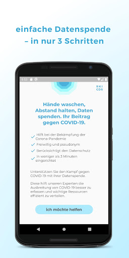
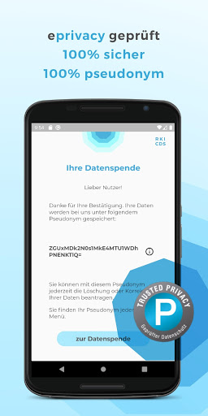
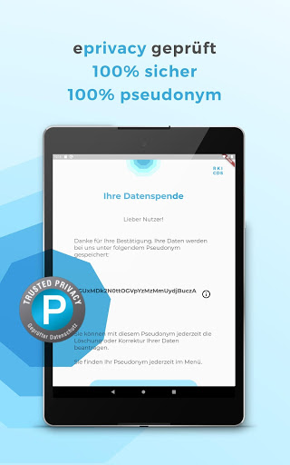
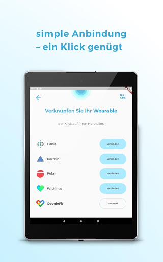
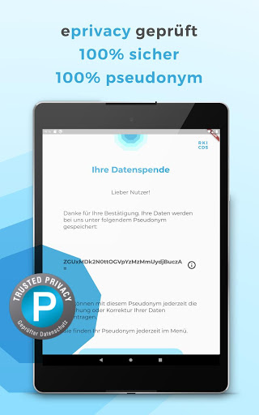
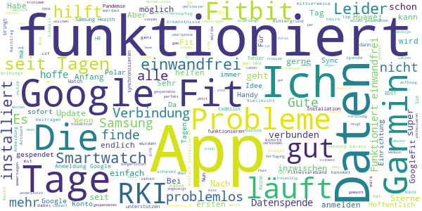
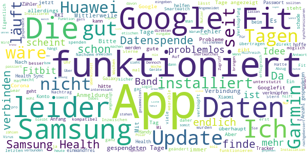
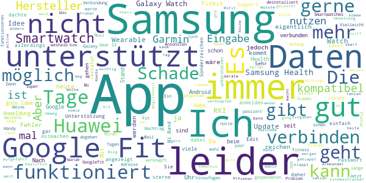
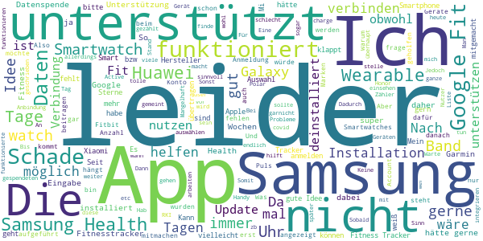
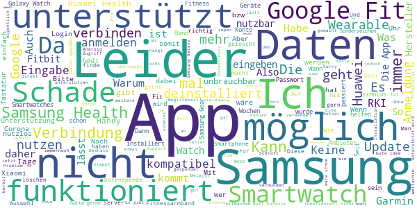

# Corona-Datenspende
App version ``2.0.0``

Analyzed with [covid-apps-observer](http://github.com/covid-apps-observer) project, version ``0.1``

## App overview
| | |
|-------------------------|-------------------------| 
| **Name**&nbsp;&nbsp;&nbsp;&nbsp;&nbsp;&nbsp;&nbsp;&nbsp;&nbsp;&nbsp;&nbsp;&nbsp;&nbsp;&nbsp;&nbsp;&nbsp;&nbsp;&nbsp;&nbsp;&nbsp;&nbsp;&nbsp;&nbsp;&nbsp;&nbsp;&nbsp;&nbsp;&nbsp;&nbsp;&nbsp;&nbsp;&nbsp;&nbsp;&nbsp;&nbsp;&nbsp;&nbsp;&nbsp;&nbsp;&nbsp;  | Corona-Datenspende |
| **Unique identifier** | de.rki.coronadatenspende |
| **Link to Google Play** | [https://play.google.com/store/apps/details?id=de.rki.coronadatenspende](https://play.google.com/store/apps/details?id=de.rki.coronadatenspende) |
| **Summary**  | Unterstützen Sie das Robert-Koch-Institut in der Eindämmung der Covid-Epidemie! |
| **Privacy policy** | [https://corona-datenspende.de/datenschutz-app/](https://corona-datenspende.de/datenschutz-app/) |
| **Latest version** | 2.0.0 |
| **Last update** | 2020-08-14 17:03:49 |
| **Recent changes** | Die Corona-Datenspende-App unterstützt ab jetzt ebenfalls Fitnessarmbänder und Smartwatches von Samsung, Oura und Amazfit (Huami). Zudem wurden die Datenschutzhinweise aktualisiert. |
| **Installs**  | 100.000+ |
| **Category** | Gesundheit & Fitness |
| **First release** | 31.03.2020 |
| **Size**  | 22M |
| **Supported Android version**  | 5.0 oder höher |

### Description
> Das Robert Koch-Institut bittet die Bevölkerung um Unterstützung bei der Eindämmung der aktuellen COVID-19 Pandemie. Mit der Corona-Datenspende-App stellen Personen freiwillig dem Robert Koch-Institut Daten ihrer Fitnessarmbänder oder ihrer Smartwatches zur Verfügung. Diese Daten können dabei helfen, die Ausbreitung des Coronavirus besser zu erfassen und zu verstehen.
 Hilft bei der Bekämpfung des Coronavirus
 Freiwillig und pseudonym
 Berücksichtigt den Datenschutz
 In weniger als 3 Minuten eingerichtet
 Bitte beachten Sie, dass für die Nutzung der App Corona-Datenspende ein Fitnessarmband oder eine Smartwatch notwendig ist.
 Unterstützt werden aktuell über GoogleFit und AppleHealth verbundene Geräte sowie Geräte von Fitbit, Garmin, Polar und Withings/Nokia. Die Integration weiterer Geräte wird derzeit geprüft.
 Das Robert Koch-Institut wendet sich an alle Bürgerinnen und Bürger mit geeigneten Fitnessarmbändern oder Smartwatches und bittet um Teilnahme.
 Auf Basis Ihrer Bewegungs-, Schlaf- und Pulswerte können fieberhafte Infektionen erkannt werden. Das Robert Koch-Institut kann mögliche Coronavirus-Infektionen damit tagesaktuell abschätzen und vorhersagen.
 Mit der Corona-Datenspende-App können Sie vollständig pseudonym Informationen zur Verbreitung der Coronavirus-Infektion zur Verfügung stellen.
 Weitere Informationen in den FAQ:
 https://corona-datenspende.de/faq/

### User interface
The developers of the app provide the following screenshots in the Google play store.
| | | |
|:-------------------------:|:-------------------------:|:-------------------------:|
 |   |   |   | 
 |   |   |   | 
 |   |   |   | 
 |   |   |   | 
 |   |   |   | 
 |   |   |   | 

## Development team
In the following we report the main information provided by the development team in the Google play store.

| | |
|-------------------------|-------------------------|
| **Developer**  | Robert Koch-Institut |
| **Website**  | [https://corona-datenspende.de](https://corona-datenspende.de) |
| **Email** | info@corona-datenspende.de |
| **Physical address**  | [Robert Koch-Institut Nordufer 20 13353 Berlin](https://www.google.com/maps/search/Robert%20Koch-Institut%20Nordufer%2020%2013353%20Berlin) (Google Maps) |
| **Other developed apps**  | [https://play.google.com/store/apps/developer?id=Robert+Koch-Institut](https://play.google.com/store/apps/developer?id=Robert+Koch-Institut) |

## Android support

| | |
|-------------------------|-------------------------|
| **Declared target Android version**  | Pie, version 9 (API level 28) |
| **Effective target Android version**  | Pie, version 9 (API level 28) |
| **Minimum supported Android version**  | Lollipop, version 5.0 (API level 21) |
| **Maximum target Android version**  | - |

The larger the difference between the minimum and maximum supported Android versions, the better. A larger difference means a wider audience. For example, old phones have a very low Android version, so a high minimum supported Android version means that the app cannot be used by users with old phones, thus leading to accessibility problems. 

## Requested permissions

In the following we report the complete list of the permissions requested by the app. 

| **Permission** | **Protection level** | **Description** | 
|-------------------------|-------------------------|-------------------------|
 **android.permission ACCESS_NETWORK_STATE** | Normal | Allows applications to access information about networks. 
 **android.permission ACCESS_WIFI_STATE** | Normal | Allows applications to access information about Wi-Fi networks. 
 **android.permission FOREGROUND_SERVICE** | Normal | Allows a regular application to use Service.startForeground. 
 **android.permission INTERNET** | Normal | Allows applications to open network sockets. 
 **android.permission RECEIVE_BOOT_COMPLETED** | Normal | Allows an application to receive the Intent.ACTION_BOOT_COMPLETED that is broadcast after the system finishes booting. 
 **android.permission WAKE_LOCK** | Normal | Allows using PowerManager WakeLocks to keep processor from sleeping or screen from dimming. 

## Mentioned servers

| **Server** | **Registrant** | **Registrant country** | **Creation date** | 
|-------------------------|-------------------------|-------------------------|-------------------------|
 | google.com | Google LLC | :us: US | 1997-09-15 04:00:00 |

## Security analysis 

Below we report the main security warnings raised by our execution of the [Androwarn](https://github.com/maaaaz/androwarn) security analysis tool.

**Telephony identifiers leakage**
> - This application reads the MCC+MNC of the provider of the SIM 

**Connection interfaces exfiltration**
> - This application reads details about the currently active data network 
> - This application tries to find out if the currently active data network is metered 

**Pim data leakage**
> - This application accesses data stored in the clipboard 

**Code execution**
> - This application loads a native library: 'flutter' 
> - This application executes a UNIX command 

## User ratings and reviews

Below we provide information about how end users are reacting to the app in terms of ratings and reviews in the Google Play store.

### Ratings

The Corona-Datenspende app has been installed by more than **100000** times. At this time, **11463** rated the app and its average score is **2.8855896**. Below we show the distribution of the ratings across the usual star-based rating of Google Play

:star::star::star::star::star:: 3984

:star::star::star::star:: 1001

:star::star::star:: 870

:star::star:: 931

:star:: 4675

### Reviews 

#### 5-star reviews

> Die Idee ist super  :date: __2020-08-23 09:06:11__

> Alles wieder gut. Bin immer noch überzeugt  :date: __2020-08-22 15:45:45__

> O.K.  :date: __2020-08-22 11:24:28__

> Habe auch eine Samsung Gear S3... Die Bereitschaft von mir ist da.. Aber so leider nicht! 10 Tage später noch immer kein Support = deinstalliert, Edit 16.06. Jetzt funktioniert anscheinend der Umweg über Google Fit, die ja die Daten von meiner Gear erhält. Mal sehen..Update 18.08. Jetzt entdeckt, dass nun auch Samsung auch endlich Samsung Health funktioniert. Nun 5 Sterne.  :date: __2020-08-19 15:27:59__

> Juhu! Samsung Health ist dabei! Ich freue mich sehr, sie jetzt auch unterstützen zu können! Aus einem Stern werden 5!  :date: __2020-08-18 13:03:18__

> Danke für die Integration von u.a. Samsung Health, dann muss ich die Daten nicht über zig Server schicken.  :date: __2020-08-17 13:22:16__

> Funktioniert endlich auch mit Samsung Health!  :date: __2020-08-16 21:48:46__

> Wenn hilft klar gerne  :date: __2020-08-16 11:38:30__

> Leider noch nicht für die Samsung watch. Jetzt schon. Super  :date: __2020-08-16 11:06:55__

> Cool  :date: __2020-08-07 20:55:03__

#### 4-star reviews

> Funktioniert scheinbar ...  :date: __2020-08-18 08:02:30__

> Auch nach fast 3 Wochen habe ich 0 Tage gespendet. Warte auf Serverkapazität. Inzwischen läuft sie friedlich vor dich hin.  :date: __2020-08-17 17:34:48__

> Endlich kompatibel mit Samsung. Wird jetzt die nächsten Tage getestet.  :date: __2020-08-16 23:37:55__

> Mit meiner Gear S3 funktioniert es nach dem Update immer noch nicht. Bitte verbessern ich will helfen. Schade das Samsung erst gar nicht auftaucht.  :date: __2020-08-16 22:21:05__

> Endlich geht es direkt mit meiner Samsung Uhr.  :date: __2020-08-16 13:55:20__

> Unterstützt weder Huawei noch Samsung. 2 riesen hersteller von smartwatches und Fitnessarmbänder.  :date: __2020-08-16 10:55:55__

> Nicht für Samsung-wearables... Das hätte ich gern schon vor der Installation gewusst... Update 16.08.2020: Funktioniert jetzt auch für Samsung-wearables.  :date: __2020-08-16 09:32:39__

> Gut  :date: __2020-08-04 06:26:36__

> Auf meinem huawai schaltet sich die Hintergrundaktivität nach einem Ausschalten des Handys wieder aus. Sie jedesmal erneut wieder anschalten zu müssen ist nervig, birgt v.a. aber die Gefahr, es dann doch zu vergessen. Das sollte bitte noch geändert werden.  :date: __2020-07-26 08:56:57__

> Dies App finde ich sehr gut und interessant für mich.  :date: __2020-07-22 19:26:53__

#### 3-star reviews

> Leider wird Samsung Health nicht unterstützt. Edit: Es funktioniert endlich, trotzdem peinlich wie lange es gedauert hat.  :date: __2020-08-17 09:20:43__

> Weitere Fitnessarmbänder fehlen immer noch auch nach über 120 Spendentagen fehlen immer mal wieder Tage dazwischen. Weitergabe der Daten über mehrere Stationen scheint nicht immer zu funktionieren. Ich muss über Googlefit gehen. MeBand 4  :date: __2020-08-13 18:10:46__

> Die Anzahl der gespendeten Tage ging von heute auf morgen von ca. 116 auf 84 Tage zurück !! Wie kann das sein??  :date: __2020-08-09 11:04:23__

> Leider mit Samsung Gear inkompatibel.  :date: __2020-08-03 20:42:04__

> Ich vermisse diverse Fitness-Armbänder / deren Hersteller. Z. B. Honor oder Samung ...  :date: __2020-07-24 14:19:32__

> Würde gerne spenden aber beim Tippen auf Google Fit wird nur ein Fehler angezeigt!  :date: __2020-07-19 02:00:03__

> Ich würde sehr gerne meine Huawei Watch GT2e verknüpfen jedoch wird die Health-App von Huawei nicht unterstützt, wäre es möglich dies zu ändern? Ansonsten kann ich leider keine Unterstützung bieten :/  :date: __2020-07-19 01:52:04__

> Total verBUGed! Keine Anmeldung oder Eingabe von E-Mail/Telefonnummer möglich. Juli 2020: Nach ein paar Updates funktioniert die Anmeldeprozedur, daher meine Bewertung von 1 auf 3 Sterne erhöht. Leider immer noch kaum Devices unterstützt.  :date: __2020-07-18 12:20:05__

> Ich fand die Idee an für sich ganz gut, aber da ich meine Samsung Watch nicht einbinden kann, ist die App für micht nutzbar  :date: __2020-07-13 12:30:27__

> Schade, meine Huawei watch GT2 ist nicht dabei. Dabei ist diese Uhr weit verbreitet. Vielleicht bessert ihr noch nach?  :date: __2020-06-24 11:59:11__

#### 2-star reviews

> Leider immer noch keine wirkliche Unterstützung für das Honor Band 5. Die Daten die ich über Googel Fit an die Corona-Datenspende App übertragen kann sind leider für den Zweck irrelevant. So wird z.B. der Puls und die SaO2 nicht in die Google Fit App übertragen. Das ganze mach so keinen Sinn.  :date: __2020-08-16 11:49:03__

> Bis jetzt finde ich die App gut. Da ich keine SmartWatch / Fitnessuhr von diesen Marken habe, würde ich empfehlen mit mehr Marken zusammen zu arbeiten. Ich habe z.b. eine von VeryFitPro. Die gibt es leider als Auswahl noch nicht. Lg: Jannes  :date: __2020-08-03 10:28:24__

> Irreführend...  :date: __2020-08-02 04:07:32__

> Die App stelle ich mir ganz sinnvoll vor. Leider werden hier nicht alle fitnessbänder und Smartwatches unterstützt. Zum Beispiel kann man leider keine Samsung und Mi Fit Bänder und Smartwatches auswählen. Das macht die App für mich unbrauchbar.  :date: __2020-07-24 17:42:50__

> Ich würde gerne helfen, aber Samsung Health wird nicht angeboten. Sobald das klappt, mache ich mit. Nachfrage: wann wird endlich Samsung Health implementiert?  :date: __2020-07-21 23:58:16__

> Die Installation der App sowie die Verknüpfung zu Fitbit hat funktioniert, sogar nach dem Handywechsel problemlos.... anfangs ... denn nach einiger Zeit fing die Anzahl der gespendeten Tage wieder bei 0 an zu zählen. Ich weiß auch nicht, wie und wo ich meine Daten einsehen kann bzw. die Postleitzahl ändern könnte.  :date: __2020-07-06 21:28:31__

> Seit Wochen steht der Tageszähler auf dem Stand 14 von 14 Tagen. Wann stellt sich der Zählwert im? Die Updates sind auf dem neuesten Stand. Ich frage mich, ob die App überhaupt noch funktioniert.  :date: __2020-07-06 11:20:21__

> Leider immer noch keine Anbindung zu Samsung Health. Dadurch keine Trainingsverfolgung für die Nutzer von Samsung Geräten!!! Und leider wird die App auch nicht gut gepflegt. Ein letztes Update ist gut einen Monat her, am 02.06.20. So stelle ich mir eine verantwortungsvolle Datenpflege nicht vor.  :date: __2020-07-01 22:42:00__

> Für Samsung Endgeräte ist Handerfassung notwendig, daher für mich nicht aussagekräftig.  :date: __2020-07-01 18:47:19__

> leider wird kein Smasung Health unterstützt. Somit kann ich nicht helfen.  :date: __2020-06-29 17:51:01__

#### 1-star reviews

> Irgendwas stimmt mit der app nicht ich kann die gespendete Daten nicht sehen ist ständig auf 0  :date: __2020-08-22 20:29:28__

> Diese App ist schlimmer wie Corona selbst, funktioniert beim neuen Samsung S20 Ultra 5G nicht mal, da hilft nur App löschen. Ich frage mich warum der deutsche Staat in solche Unternehmen Geld rein pumpt wenn hinten nichts raus kommt wie Pfusch.👎👎👎  :date: __2020-08-21 21:44:55__

> Also ich werde jetzt zwei Wochen warten, was die App macht oder nicht macht. Ich Verstehe den Sinn der App nicht, auf meiner Uhr Amazfit Stratos 3 noch die Amazfit App zeigt mir das die App hier was in zusammen halt mit der Amazfit App was auf zeichnen soll tut KP 😏🤔🤨 schauen wir mal. Nachtrag die App macht nichts habe sie drei Tage lang drauf und Aktualisiert und die Tage sind immer noch bei Null 🤔🤨😏👎 Lächerlich und Platz und Daten Killer auf Handy. 😤😡🤬 Deinstalliert und für die 🚮  :date: __2020-08-21 16:28:12__

> 20.08. seit dem letzten Update "kaputt" neue Datenschutzrichtlinie lässt sich reicht anerkennen, nach dem akzeptieren eben jener tut sich nichts mehr.. Server überlastet? Neu installieren hilft auch nicht weiter..  :date: __2020-08-20 11:44:02__

> Die 'Anzahl der gespendeten Tage' verharrt seit Tagen bei Null, obwohl Fitbit problemlos verbunden/aktiviert. // Mit Version 1.0.4 v. 11.04. funktioniert das jetzt. // Mit Version 2.0.0 bleibt die Zahl der Tage bei 127 stehen.  :date: __2020-08-19 06:42:23__

> Samsung wird nicht unterstützt. Daher für mich sinnlos.  :date: __2020-08-12 12:41:42__

> Wieso gibt es diese App nicht für ältere Geräte und zwar Smartphones und nicht Smartwatches? Ich habe heute den Abstrich machen lassen und würde dann gerne auch nach 24h erfahren können, was los ist.  :date: __2020-08-11 16:40:22__

> Ich habe die app eine Zeitlang unterstützt mit Google fit aber da Samsung S Health immer noch nicht unterstützt wird habe ich die app wieder Deeinstalluert  :date: __2020-08-07 00:05:21__

> Idiotenapp fuer dumme menschen  :date: __2020-08-06 16:47:56__

> Nicht kompatibel mit Huawei-Smartwatches. Also sinnlos.  :date: __2020-08-05 11:44:09__

