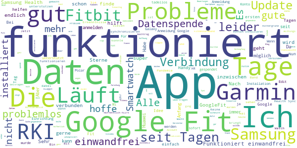
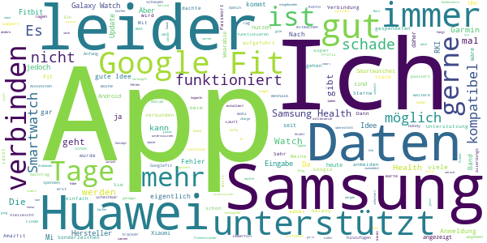

# Corona-Datenspende
App version ``2.1.0``

Analyzed with [covid-apps-observer](http://github.com/covid-apps-observer) project, version ``0.1``

## App overview
| | |
|-------------------------|-------------------------| 
| **Name**&nbsp;&nbsp;&nbsp;&nbsp;&nbsp;&nbsp;&nbsp;&nbsp;&nbsp;&nbsp;&nbsp;&nbsp;&nbsp;&nbsp;&nbsp;&nbsp;&nbsp;&nbsp;&nbsp;&nbsp;&nbsp;&nbsp;&nbsp;&nbsp;&nbsp;&nbsp;&nbsp;&nbsp;&nbsp;&nbsp;&nbsp;&nbsp;&nbsp;&nbsp;&nbsp;&nbsp;&nbsp;&nbsp;&nbsp;&nbsp;  | Corona-Datenspende |
| **Unique identifier** | de.rki.coronadatenspende |
| **Link to Google Play** | [https://play.google.com/store/apps/details?id=de.rki.coronadatenspende](https://play.google.com/store/apps/details?id=de.rki.coronadatenspende) |
| **Summary**  | Unterstützen Sie das Robert-Koch-Institut in der Eindämmung der Covid-Epidemie! |
| **Privacy policy** | [https://corona-datenspende.de/datenschutz-app/](https://corona-datenspende.de/datenschutz-app/) |
| **Latest version** | 2.1.0 |
| **Last update** | 2020-10-05 14:00:57 |
| **Recent changes** | Verbesserung der Barrierefreiheit |
| **Installs**  | 100.000+ |
| **Category** | Gesundheit & Fitness |
| **First release** | 31.03.2020 |
| **Size**  | 24M |
| **Supported Android version**  | 5.0 oder höher |

### Description
> Das Robert Koch-Institut bittet die Bevölkerung um Unterstützung bei der Eindämmung der aktuellen COVID-19 Pandemie. Mit der Corona-Datenspende-App stellen Personen freiwillig dem Robert Koch-Institut Daten ihrer Fitnessarmbänder oder ihrer Smartwatches zur Verfügung. Diese Daten können dabei helfen, die Ausbreitung des Coronavirus besser zu erfassen und zu verstehen.
 Hilft bei der Bekämpfung des Coronavirus
 Freiwillig und pseudonym
 Berücksichtigt den Datenschutz
 In weniger als 3 Minuten eingerichtet
 Bitte beachten Sie, dass für die Nutzung der App Corona-Datenspende ein Fitnessarmband oder eine Smartwatch notwendig ist.
 Unterstützt werden aktuell über GoogleFit und AppleHealth verbundene Geräte sowie Geräte von Fitbit, Garmin, Polar und Withings/Nokia. Die Integration weiterer Geräte wird derzeit geprüft.
 Das Robert Koch-Institut wendet sich an alle Bürgerinnen und Bürger mit geeigneten Fitnessarmbändern oder Smartwatches und bittet um Teilnahme.
 Auf Basis Ihrer Bewegungs-, Schlaf- und Pulswerte können fieberhafte Infektionen erkannt werden. Das Robert Koch-Institut kann mögliche Coronavirus-Infektionen damit tagesaktuell abschätzen und vorhersagen.
 Mit der Corona-Datenspende-App können Sie vollständig pseudonym Informationen zur Verbreitung der Coronavirus-Infektion zur Verfügung stellen.
 Weitere Informationen in den FAQ:
 https://corona-datenspende.de/faq/

### User interface
The developers of the app provide the following screenshots in the Google play store.
| | | |
|:-------------------------:|:-------------------------:|:-------------------------:|
 |   |   |   | 
 |   |   |   | 
 |   |   |   | 
 |   |   |   | 
 |   |   |   | 
 |   |   |   | 

## Development team
In the following we report the main information provided by the development team in the Google play store.

| | |
|-------------------------|-------------------------|
| **Developer**  | Robert Koch-Institut |
| **Website**  | [https://corona-datenspende.de](https://corona-datenspende.de) |
| **Email** | info@corona-datenspende.de |
| **Physical address**  | [Robert Koch-Institut Nordufer 20 13353 Berlin](https://www.google.com/maps/search/Robert%20Koch-Institut%20Nordufer%2020%2013353%20Berlin) (Google Maps) |
| **Other developed apps**  | [https://play.google.com/store/apps/developer?id=Robert+Koch-Institut](https://play.google.com/store/apps/developer?id=Robert+Koch-Institut) |

## Android support

| | |
|-------------------------|-------------------------|
| **Declared target Android version**  | - |
| **Effective target Android version**  | - |
| **Minimum supported Android version**  | Lollipop, version 5.0 (API level 21) |
| **Maximum target Android version**  | - |

The larger the difference between the minimum and maximum supported Android versions, the better. A larger difference means a wider audience. For example, old phones have a very low Android version, so a high minimum supported Android version means that the app cannot be used by users with old phones, thus leading to accessibility problems. 

## Requested permissions

In the following we report the complete list of the permissions requested by the app. 

| **Permission** | **Protection level** | **Description** | 
|-------------------------|-------------------------|-------------------------|
 **android.permission ACCESS_NETWORK_STATE** | Normal | Allows applications to access information about networks. 
 **android.permission ACCESS_WIFI_STATE** | Normal | Allows applications to access information about Wi-Fi networks. 
 **android.permission FOREGROUND_SERVICE** | Normal | Allows a regular application to use Service.startForeground. 
 **android.permission INTERNET** | Normal | Allows applications to open network sockets. 
 **android.permission RECEIVE_BOOT_COMPLETED** | Normal | Allows an application to receive the Intent.ACTION_BOOT_COMPLETED that is broadcast after the system finishes booting. 
 **android.permission WAKE_LOCK** | Normal | Allows using PowerManager WakeLocks to keep processor from sleeping or screen from dimming. 
 **com.google.android.c2dm.permission RECEIVE** | - | - 

## Mentioned servers

| **Server** | **Registrant** | **Registrant country** | **Creation date** | 
|-------------------------|-------------------------|-------------------------|-------------------------|
 | google.com | Google LLC | :us: US | 1997-09-15 04:00:00 |

## Security analysis 

Below we report the main security warnings raised by our execution of the [Androwarn](https://github.com/maaaaz/androwarn) security analysis tool.

**Telephony identifiers leakage**
> - This application reads the MCC+MNC of the provider of the SIM 

**Connection interfaces exfiltration**
> - This application reads details about the currently active data network 
> - This application tries to find out if the currently active data network is metered 

**Pim data leakage**
> - This application accesses data stored in the clipboard 

**Code execution**
> - This application loads a native library: 'flutter' 
> - This application loads a native library: 'log' 
> - This application loads a native library: 'sentry' 
> - This application loads a native library: 'sentry-android' 
> - This application executes a UNIX command 

## User ratings and reviews

Below we provide information about how end users are reacting to the app in terms of ratings and reviews in the Google Play store.

### Ratings

The Corona-Datenspende app has been installed by more than **100000** times. At this time, **11519** rated the app and its average score is **2.9383144**. Below we show the distribution of the ratings across the usual star-based rating of Google Play

:star::star::star::star::star:: 4144

:star::star::star::star:: 1031

:star::star::star:: 860

:star::star:: 940

:star:: 4544

### Reviews 

#### 5-star reviews

> Läuft unauffällig mit meinem Huawei und der Fitbit Uhr mit. Kann keine Probleme melden. Selbst ein Telefonwechsel ging problemlos.  :date: __2020-10-12 09:27:26__

> Prima, endlich geht's auch mit Samsung Health! 178 Tage Datenspende 💪  :date: __2020-10-06 23:47:07__

> Funktioniert gut  :date: __2020-10-06 23:11:09__

> GoogleFit kann nicht angebunden werden: Fehlermeldung 403 rate limit exceeded The developer should contact Google to reactivate the support  :date: __2020-10-06 22:58:50__

> Funktioniert jetzt einwandfrei mit SHealth. Würde aber gerne wissen welche Daten übertragen werden und was damit gemacht wird.  :date: __2020-10-06 21:35:34__

> Sehr nützlich.....  :date: __2020-10-06 20:35:26__

> Eine sehr sinnvolle Sache!  :date: __2020-10-06 20:08:21__

> 6.10.20 Update, funktioniert wieder. 2.10.20 Update. Nach Wechsel auf LineageOS und root funktioniert die App nicht mehr. Schade. War Unterstützer seit Anfang an. Sehr gerne unterstütze ich dieses Projekt. Das verbinden mit Google fit funktioniert inzwischen. Die Daten können über mein Mii-Band. Vielen Dank an die Entwickler.  :date: __2020-10-06 18:57:21__

> Funktioniert tadellos. Hoffe, daß die übersandten Daten eine Hilfe sind.  :date: __2020-09-28 05:26:37__

> Klappt endlich, auch mit den angezeigten Tagen!  :date: __2020-09-13 02:03:00__

#### 4-star reviews

> Funktioniert zwar mit Verzögerung, aber sie zählt fleissig die gespendeten Tage. Wofür auch immer...  :date: __2020-10-10 07:31:30__

> Es ist schon traurig das man es nicht schafft eine funktionierende App herauszubringenn Klappt recht gut  :date: __2020-10-06 22:39:20__

> Hm - durch Handy Wechsel alles wieder NEU  :date: __2020-10-06 22:35:05__

> Gut  :date: __2020-10-01 20:01:06__

> Bitte eine Unterstützung für das Xiaomi Mi-Band 4 einfügen, dann nehme ich gerne teil. Die Idee dahinter ist gut und nützlich.  :date: __2020-08-25 22:31:21__

> Funktioniert scheinbar ...  :date: __2020-08-18 08:02:30__

> Auch nach fast 3 Wochen habe ich 0 Tage gespendet. Warte auf Serverkapazität. Inzwischen läuft sie friedlich vor dich hin.  :date: __2020-08-17 17:34:48__

> Mit meiner Gear S3 funktioniert es nach dem Update immer noch nicht. Bitte verbessern ich will helfen. Schade das Samsung erst gar nicht auftaucht.  :date: __2020-08-16 22:21:05__

> Endlich geht es direkt mit meiner Samsung Uhr.  :date: __2020-08-16 13:55:20__

> Unterstützt weder Huawei noch Samsung. 2 riesen hersteller von smartwatches und Fitnessarmbänder.  :date: __2020-08-16 10:55:55__

#### 3-star reviews

> Lässt sich leider nicht mit huawei app health koppeln  :date: __2020-10-09 17:35:23__

> Gute Idee die ich sehr gerne unterstützen würde. Leider nicht mit meiner Huawei Watch GT und Huawei Health kompatibel.  :date: __2020-10-09 13:41:12__

> Samsung Galaxy Watch ist in den Wearables nicht aufgeführt, daher kann ich leider keine Daten spenden, schade. Update 19.09.20: Samsung Health ist eingebunden. Mal schauen...  :date: __2020-09-19 12:33:32__

> Im Groß und Ganzen läuft die App ja... Aber seit mehr als einer Woche steht der Zähler der gespendeten Tage auf 135... Ist das nun das Maximum??  :date: __2020-09-04 09:32:13__

> Leider für mich nicht zu gebrauchen da mein mifit- Band nicht aufgeführt ist!  :date: __2020-09-02 15:37:44__

> Missing Amazfit health/ sports tracker. So far, only 3 🌟. Even willing to support the fight against covid-19, I can't.  :date: __2020-09-02 08:03:15__

> Nach dem Update hängt die App ewig an allen möglichen Aktualisierungen fest. Datenschutz und Datenquellen laden unendlich. Ich habe nach 40 Minuten aufgegeben.  :date: __2020-09-01 21:58:04__

> Immerhin geht mittlerweile die Verbindung zur Samsung-Smartwatch. Daher jetzt 3 Sterne, jetzt schaue ich mal ob die App auch ohne zu nerven ihre Arbeit tut.  :date: __2020-09-01 19:47:48__

> Da will man nun helfen und installiert die App um festzustellen, das das verwendete Fitnessarmband nicht unterstützt wird? Leute, erst so einen Aufriss machen und dann scheitert das RKI an sich selber, ohne Worte und dann sollen sich die Menschen hier zu Lande auf eure Aussagen verlassen? Nachtrag, es geht bei mir um eine Galaxy Fit und Samsung Health...Update: Samsung Health geht jetzt, mal schauen, ob es auch richtig funktioniert...  :date: __2020-08-26 08:04:46__

> Weitere Fitnessarmbänder fehlen immer noch auch nach über 120 Spendentagen fehlen immer mal wieder Tage dazwischen. Weitergabe der Daten über mehrere Stationen scheint nicht immer zu funktionieren. Ich muss über Googlefit gehen. MeBand 4  :date: __2020-08-13 18:10:46__

#### 2-star reviews

> Hab die App fast seit dem Erscheinungstag auf meinem Handy. Am Anfang hat er mir die Übertragung - in Tagen - angezeigt, bei 122 Tagen blieb die App dann stehen. Ich kann nirgends etwas dazu einstellen oder sehen, ob Daten übertragen werden. Der einzigste Bezugspunkt war immer die Anzahl der angezeigten Tage... ich hab die App daher gelöscht...  :date: __2020-10-15 17:33:40__

> Keine aktuellen Ergebnisse, immer noch closed source... Ich hätte erwartet dass da nach den vielen Monaten die es die App jetzt gibt Schritte hin zu mehr Transparenz unternommen werden  :date: __2020-10-09 09:19:49__

> Gute Idee, tolles Projekt, aber warum wird nach wochenlanger Nutzung nur 1 gespendeter Tag angezeigt. Schade, denn die Tagesanzahl ist das einzige, was der Nutzer als Feedback erhält, und wenn diese Anzeige nicht funktioniert, ist man schnell demotiviert und will am liebsten aufhören. Liebes RKI, lest ihr eigentlich die vielen Kommentare diesbezüglich? Ihr verspielt glaub ich gerade so einiges Vertrauen - wär das nicht total sinnlos? Ich drücke dennoch dem Projekt weiter die Daumen.  :date: __2020-09-03 09:32:29__

> Ich hänge seit mehreren Tagen bei gespendete 122 Tagen fest... Und ein Update gibt es nicht. Was ist da los? .  :date: __2020-08-27 21:00:06__

> Seit vier Tagen installiert, zeigt die App nur 2 Tage als gespendet an. Das erweckt wenig Vertrauen in die ordnungsgemäße Funktionsfähigkeit, zumal die Anzeige der Tage das einzige Feedback an den Nutzer ist. Positiv ist demgegenüber die Erweiterung für Samsung Geräte.  :date: __2020-08-27 19:29:30__

> Leider immer noch keine wirkliche Unterstützung für das Honor Band 5. Die Daten die ich über Googel Fit an die Corona-Datenspende App übertragen kann sind leider für den Zweck irrelevant. So wird z.B. der Puls und die SaO2 nicht in die Google Fit App übertragen. Das ganze mach so keinen Sinn.  :date: __2020-08-16 11:49:03__

> Bis jetzt finde ich die App gut. Da ich keine SmartWatch / Fitnessuhr von diesen Marken habe, würde ich empfehlen mit mehr Marken zusammen zu arbeiten. Ich habe z.b. eine von VeryFitPro. Die gibt es leider als Auswahl noch nicht. Lg: Jannes  :date: __2020-08-03 10:28:24__

> Irreführend...  :date: __2020-08-02 04:07:32__

> Die App stelle ich mir ganz sinnvoll vor. Leider werden hier nicht alle fitnessbänder und Smartwatches unterstützt. Zum Beispiel kann man leider keine Samsung und Mi Fit Bänder und Smartwatches auswählen. Das macht die App für mich unbrauchbar.  :date: __2020-07-24 17:42:50__

> Ich würde gerne helfen, aber Samsung Health wird nicht angeboten. Sobald das klappt, mache ich mit. Nachfrage: wann wird endlich Samsung Health implementiert?  :date: __2020-07-21 23:58:16__

#### 1-star reviews

> Kein huawei watch Unterstützung  :date: __2020-10-16 21:44:18__

> Der nächste Beweis für unnütze Apps ... Nix funktioniert und egal ob anonym oder sonstwas ... wie können zb Schlafdaten und Puls dabei helfen eine Infektion zu erkennen ? Gar nicht und dazu muss ich kein Mediziner sein ... Warum integriert man diese funktionen nicht direkt in die Warn App als feature ? Oder würde das nochmal 60Mio kosten ... ? Sorry Leute aber ihr versaut es euch mit den vertrauen der bürgers ... Kurzum Datenkrake die alles aufsaugt und speichert mehr nicht  :date: __2020-10-14 03:22:43__

> Musste mich erneut anmelden. Also wurden vermutlich seit einiger Zeit keine Daten mehr übertragen. Verstehe aber eh nicht wofür diese App noch nützliche sein soll. Kann man wohl löschen.  :date: __2020-10-08 20:59:21__

> Weit verbreitete Wearables fehlen. Ich würde gerne Daten spenden. Stockt doch bitte einfach Mal die Anzahl der unterstützen Geräte auf, dann kommen wahrscheinlich auch mehr Daten an.  :date: __2020-10-01 11:00:54__

> Lief lange Zeit gut (5 Sterne). Nach irgendeinem automatischen Update hätte ich mich neu anmelden müssen. Bekam leider keine Info und seit dem werden keine Daten mehr gesammelt. App wird deinstalliert!  :date: __2020-09-25 08:24:41__

> Ich habe die APP gerade installiert und schon Anzahl ihrer gesendeten Tage 2 ich hsb die App mit Samsung Health Verbunden  :date: __2020-09-23 22:27:24__

> Ich habe gedacht, dies sei eine App um Geldspenden einzusammeln mit, damit man die Programmierer der Corona-App schmerzfrei entsorgen kann. Aber ich fürchte hier sind hier und da die gleichen am Werke. Also weg mit dem Schrott. Google und Apple haben doch schon alles und bieten sogar eine Gegenleistung dafür. Hier versuchen Corona-Trittbrettfahrer auf ihre Kosten zu kommen und sich eine Daseinsberechtigung zu sichern. Wann wachen die Deutschen mal auf und jagen die Parasiten zum Teufel?  :date: __2020-09-22 23:55:06__

> Bitte endlich die Mi-Bänder (Xiaomi) einbinden.  :date: __2020-09-21 16:33:22__

> Gute Idee, aber ich habe festgestellt das seit Tagen nicht mehr gezählt wird. Bitte beheben, damit es wieder funktioniert.  :date: __2020-09-20 18:56:38__

> Problem ist eine smartwatch von huawei mit der App zu verbinden bin enttäuscht. Kann leider die puls Daten somit nicht zur Verfügung stellen.  :date: __2020-09-18 01:18:25__

