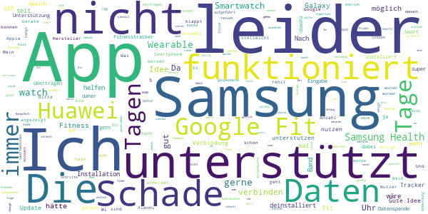

# Corona-Datenspende
App version ``2.1.0``

Analyzed with [covid-apps-observer](http://github.com/covid-apps-observer) project, version ``0.1``

## App overview
| | |
|-------------------------|-------------------------| 
| **Name**&nbsp;&nbsp;&nbsp;&nbsp;&nbsp;&nbsp;&nbsp;&nbsp;&nbsp;&nbsp;&nbsp;&nbsp;&nbsp;&nbsp;&nbsp;&nbsp;&nbsp;&nbsp;&nbsp;&nbsp;&nbsp;&nbsp;&nbsp;&nbsp;&nbsp;&nbsp;&nbsp;&nbsp;&nbsp;&nbsp;&nbsp;&nbsp;&nbsp;&nbsp;&nbsp;&nbsp;&nbsp;&nbsp;&nbsp;&nbsp;  | Corona-Datenspende |
| **Unique identifier** | de.rki.coronadatenspende |
| **Link to Google Play** | [https://play.google.com/store/apps/details?id=de.rki.coronadatenspende](https://play.google.com/store/apps/details?id=de.rki.coronadatenspende) |
| **Summary**  | Unterstützen Sie das Robert-Koch-Institut in der Eindämmung der Covid-Epidemie! |
| **Privacy policy** | [https://corona-datenspende.de/datenschutz-app/](https://corona-datenspende.de/datenschutz-app/) |
| **Latest version** | 2.1.0 |
| **Last update** | 2020-10-05 14:00:57 |
| **Recent changes** | Verbesserung der Barrierefreiheit |
| **Installs**  | 100.000+ |
| **Category** | Gesundheit & Fitness |
| **First release** | 31.03.2020 |
| **Size**  | 24M |
| **Supported Android version**  | 5.0 oder höher |

### Description
> Das Robert Koch-Institut bittet die Bevölkerung um Unterstützung bei der Eindämmung der aktuellen COVID-19 Pandemie. Mit der Corona-Datenspende-App stellen Personen freiwillig dem Robert Koch-Institut Daten ihrer Fitnessarmbänder oder ihrer Smartwatches zur Verfügung. Diese Daten können dabei helfen, die Ausbreitung des Coronavirus besser zu erfassen und zu verstehen.
 Hilft bei der Bekämpfung des Coronavirus
 Freiwillig und pseudonym
 Berücksichtigt den Datenschutz
 In weniger als 3 Minuten eingerichtet
 Bitte beachten Sie, dass für die Nutzung der App Corona-Datenspende ein Fitnessarmband oder eine Smartwatch notwendig ist.
 Unterstützt werden aktuell über GoogleFit und AppleHealth verbundene Geräte sowie Geräte von Fitbit, Garmin, Polar und Withings/Nokia. Die Integration weiterer Geräte wird derzeit geprüft.
 Das Robert Koch-Institut wendet sich an alle Bürgerinnen und Bürger mit geeigneten Fitnessarmbändern oder Smartwatches und bittet um Teilnahme.
 Auf Basis Ihrer Bewegungs-, Schlaf- und Pulswerte können fieberhafte Infektionen erkannt werden. Das Robert Koch-Institut kann mögliche Coronavirus-Infektionen damit tagesaktuell abschätzen und vorhersagen.
 Mit der Corona-Datenspende-App können Sie vollständig pseudonym Informationen zur Verbreitung der Coronavirus-Infektion zur Verfügung stellen.
 Weitere Informationen in den FAQ:
 https://corona-datenspende.de/faq/

### User interface
The developers of the app provide the following screenshots in the Google play store.
| | | |
|:-------------------------:|:-------------------------:|:-------------------------:|
 |   |   |   | 
 |   |   |   | 
 |   |   |   | 
 |   |   |   | 
 |   |   |   | 
 |   |   |   | 

## Development team
In the following we report the main information provided by the development team in the Google play store.

| | |
|-------------------------|-------------------------|
| **Developer**  | Robert Koch-Institut |
| **Website**  | [https://corona-datenspende.de](https://corona-datenspende.de) |
| **Email** | info@corona-datenspende.de |
| **Physical address**  | [Robert Koch-Institut Nordufer 20 13353 Berlin](https://www.google.com/maps/search/Robert%20Koch-Institut%20Nordufer%2020%2013353%20Berlin) (Google Maps) |
| **Other developed apps**  | [https://play.google.com/store/apps/developer?id=Robert+Koch-Institut](https://play.google.com/store/apps/developer?id=Robert+Koch-Institut) |

## Android support

| | |
|-------------------------|-------------------------|
| **Declared target Android version**  | - |
| **Effective target Android version**  | - |
| **Minimum supported Android version**  | Lollipop, version 5.0 (API level 21) |
| **Maximum target Android version**  | - |

The larger the difference between the minimum and maximum supported Android versions, the better. A larger difference means a wider audience. For example, old phones have a very low Android version, so a high minimum supported Android version means that the app cannot be used by users with old phones, thus leading to accessibility problems. 

## Requested permissions

In the following we report the complete list of the permissions requested by the app. 

| **Permission** | **Protection level** | **Description** | 
|-------------------------|-------------------------|-------------------------|
 **android.permission ACCESS_NETWORK_STATE** | Normal | Allows applications to access information about networks. 
 **android.permission ACCESS_WIFI_STATE** | Normal | Allows applications to access information about Wi-Fi networks. 
 **android.permission FOREGROUND_SERVICE** | Normal | Allows a regular application to use Service.startForeground. 
 **android.permission INTERNET** | Normal | Allows applications to open network sockets. 
 **android.permission RECEIVE_BOOT_COMPLETED** | Normal | Allows an application to receive the Intent.ACTION_BOOT_COMPLETED that is broadcast after the system finishes booting. 
 **android.permission WAKE_LOCK** | Normal | Allows using PowerManager WakeLocks to keep processor from sleeping or screen from dimming. 
 **com.google.android.c2dm.permission RECEIVE** | - | - 

## Mentioned servers

| **Server** | **Registrant** | **Registrant country** | **Creation date** | 
|-------------------------|-------------------------|-------------------------|-------------------------|
 | google.com | Google LLC | :us: US | 1997-09-15 04:00:00 |

## Security analysis 

Below we report the main security warnings raised by our execution of the [Androwarn](https://github.com/maaaaz/androwarn) security analysis tool.

**Telephony identifiers leakage**
> - This application reads the MCC+MNC of the provider of the SIM 

**Connection interfaces exfiltration**
> - This application reads details about the currently active data network 
> - This application tries to find out if the currently active data network is metered 

**Pim data leakage**
> - This application accesses data stored in the clipboard 

**Code execution**
> - This application loads a native library: 'flutter' 
> - This application loads a native library: 'log' 
> - This application loads a native library: 'sentry' 
> - This application loads a native library: 'sentry-android' 
> - This application executes a UNIX command 

## User ratings and reviews

Below we provide information about how end users are reacting to the app in terms of ratings and reviews in the Google Play store.

### Ratings

The Corona-Datenspende app has been installed by more than **100000** times. At this time, **11519** rated the app and its average score is **2.9383144**. Below we show the distribution of the ratings across the usual star-based rating of Google Play

:star::star::star::star::star:: 4144

:star::star::star::star:: 1031

:star::star::star:: 860

:star::star:: 940

:star:: 4544

### Reviews 

#### 5-star reviews

> Sehr gut  :date: __2020-11-07 17:35:53__

> Winkelnkemper Hildegard  :date: __2020-11-04 19:54:50__

> Funktioniert auf allen Handys sehr gut. Einfache Installation und genaue Beschreibung. Kontinuierliche Zwischeninformationen über Ergebnisse der Datenspende.  :date: __2020-10-31 12:24:04__

> Beim Anmelden über Google Fit kommt Fehler 403 und rate_limit_exceeded. Update 08.04.20 Anscheinend wurde das Problem behoben, Anmeldung konnte per Google Fit durchgeführt werden. Update 30.10.20, wie ich gesehen habe wird nun Samsung Health direkt unterstützt, sodass man nicht vorher noch mit Google Fit syncen muss. Nun volle 5 Sterne.  :date: __2020-10-30 09:20:53__

> 👍  :date: __2020-10-28 08:47:41__

> Läuft unauffällig mit meinem Huawei und der Fitbit Uhr mit. Kann keine Probleme melden. Selbst ein Telefonwechsel ging problemlos.  :date: __2020-10-12 09:27:26__

> Prima, endlich geht's auch mit Samsung Health! 178 Tage Datenspende 💪  :date: __2020-10-06 23:47:07__

> Funktioniert gut  :date: __2020-10-06 23:11:09__

> GoogleFit kann nicht angebunden werden: Fehlermeldung 403 rate limit exceeded The developer should contact Google to reactivate the support  :date: __2020-10-06 22:58:50__

> Funktioniert jetzt einwandfrei mit SHealth. Würde aber gerne wissen welche Daten übertragen werden und was damit gemacht wird.  :date: __2020-10-06 21:35:34__

#### 4-star reviews

> Bitte noch MiFit zufügen, dann gibt's bessere Daten!  :date: __2020-11-02 10:23:51__

> Unterstützt leider nicht jede SmartWatch, z.b. Horner  :date: __2020-11-01 19:20:53__

> Es ist schon traurig das man es nicht schafft eine funktionierende App herauszubringenn Klappt recht gut  :date: __2020-10-06 22:39:20__

> Hm - durch Handy Wechsel alles wieder NEU  :date: __2020-10-06 22:35:05__

> Gut  :date: __2020-10-01 20:01:06__

> Bitte eine Unterstützung für das Xiaomi Mi-Band 4 einfügen, dann nehme ich gerne teil. Die Idee dahinter ist gut und nützlich.  :date: __2020-08-25 22:31:21__

> Funktioniert scheinbar ...  :date: __2020-08-18 08:02:30__

> Auch nach fast 3 Wochen habe ich 0 Tage gespendet. Warte auf Serverkapazität. Inzwischen läuft sie friedlich vor dich hin.  :date: __2020-08-17 17:34:48__

> Mit meiner Gear S3 funktioniert es nach dem Update immer noch nicht. Bitte verbessern ich will helfen. Schade das Samsung erst gar nicht auftaucht.  :date: __2020-08-16 22:21:05__

> Endlich geht es direkt mit meiner Samsung Uhr.  :date: __2020-08-16 13:55:20__

#### 3-star reviews

> Ich finde, das es eine gute Sache ist. Leider werden Xiaomi/Amazfit nicht unterstützt. Daher für viele vermutlich leider nicht anwendbar.  :date: __2020-11-02 14:56:11__

> Ich befürworte das Konzept hinter der App und würde meine Gesundheitsdaten gerne zur Verfügung stellen. Jedoch würde ich mir wünschen, dass die Probleme bei der Anmeldung über google fit schnellstens gelöst werden, oder zumindest der Mi fit Service zu den unterstützten Services aufgenommen würde. Dann müsste ich mit meiner Xiaomi Amazfit watch gar nicht erst auf google fit ausweichen.  :date: __2020-10-29 10:59:12__

> Läuft endlich, gut stabil und problemfrei Man kann auch leider gar nicht sagen wie viele Tage man spenden möchte. Ich hoffe sehr auf Verbesserungen bis dahin viel Erfolg  :date: __2020-10-28 00:23:25__

> Ich habe die App heruntergeladen und wollte noch anmelden. Angeblich werden die Daten alle anonymisiert übermittelt. Dann jedoch soll ich mich mit meinem Google-Konto dafür anmelden, und jede Menge Daten inklusive meines Namens und Profilbildes sollen auch übermittelt werden. Warum denn das? Kommt mir nicht besonders anonym vor.  :date: __2020-10-26 06:48:39__

> Leider lassen sich zu einem späteren Zeitpunkt die Angaben wie Alter Gewicht etc. nicht mehr anpassen. Schliesslich altert man ja, oder nimmt ab oder zu.  :date: __2020-10-25 08:57:32__

> Anmeldung und Verbinden mit charge 2 hat super schnell funktioniert. Hab die App gestern installiert und heute werden 16 Tage angezeigt. Scheinbar aus der Historie von fitbit. Aber kann ich irgendwie erkennen, was für Daten eingespielt werden?  :date: __2020-10-19 14:36:57__

> Lässt sich leider nicht mit huawei app health koppeln  :date: __2020-10-09 17:35:23__

> Gute Idee die ich sehr gerne unterstützen würde. Leider nicht mit meiner Huawei Watch GT und Huawei Health kompatibel.  :date: __2020-10-09 13:41:12__

> Samsung Galaxy Watch ist in den Wearables nicht aufgeführt, daher kann ich leider keine Daten spenden, schade. Update 19.09.20: Samsung Health ist eingebunden. Mal schauen...  :date: __2020-09-19 12:33:32__

> Im Groß und Ganzen läuft die App ja... Aber seit mehr als einer Woche steht der Zähler der gespendeten Tage auf 135... Ist das nun das Maximum??  :date: __2020-09-04 09:32:13__

#### 2-star reviews

> Gute Idee, aber verbinden über Amazfit war nicht möglich?  :date: __2020-11-02 14:02:57__

> Ich hatte sie installiert um bei dem Versuch meine Smart Watch zu verbinden festzustellen das leider Samsungs Watch nicht unterstützt wird. WANN kann man denn damit rechnen ???  :date: __2020-11-02 13:37:58__

> Auf die Unterstützung anderer Devices (z.b. Samsung Wearable) warte ich nun schon über ein halbes Jahr. Im Text steht immer noch, es werde vorbereitet. So wird das nichts mit uns... Schade, ich würde die App gern nutzen.  :date: __2020-10-24 11:06:35__

> Stört leider meine SmartWatch mit WearOs. Ziffernblatt nicht mehr aufrufbar. Strange. Deinstalliert. Sorry, so nicht.  :date: __2020-10-21 14:19:03__

> Hab die App fast seit dem Erscheinungstag auf meinem Handy. Am Anfang hat er mir die Übertragung - in Tagen - angezeigt, bei 122 Tagen blieb die App dann stehen. Ich kann nirgends etwas dazu einstellen oder sehen, ob Daten übertragen werden. Der einzigste Bezugspunkt war immer die Anzahl der angezeigten Tage... ich hab die App daher gelöscht...  :date: __2020-10-15 17:33:40__

> Keine aktuellen Ergebnisse, immer noch closed source... Ich hätte erwartet dass da nach den vielen Monaten die es die App jetzt gibt Schritte hin zu mehr Transparenz unternommen werden  :date: __2020-10-09 09:19:49__

> Gute Idee, tolles Projekt, aber warum wird nach wochenlanger Nutzung nur 1 gespendeter Tag angezeigt. Schade, denn die Tagesanzahl ist das einzige, was der Nutzer als Feedback erhält, und wenn diese Anzeige nicht funktioniert, ist man schnell demotiviert und will am liebsten aufhören. Liebes RKI, lest ihr eigentlich die vielen Kommentare diesbezüglich? Ihr verspielt glaub ich gerade so einiges Vertrauen - wär das nicht total sinnlos? Ich drücke dennoch dem Projekt weiter die Daumen.  :date: __2020-09-03 09:32:29__

> Ich hänge seit mehreren Tagen bei gespendete 122 Tagen fest... Und ein Update gibt es nicht. Was ist da los? .  :date: __2020-08-27 21:00:06__

> Seit vier Tagen installiert, zeigt die App nur 2 Tage als gespendet an. Das erweckt wenig Vertrauen in die ordnungsgemäße Funktionsfähigkeit, zumal die Anzeige der Tage das einzige Feedback an den Nutzer ist. Positiv ist demgegenüber die Erweiterung für Samsung Geräte.  :date: __2020-08-27 19:29:30__

> Leider immer noch keine wirkliche Unterstützung für das Honor Band 5. Die Daten die ich über Googel Fit an die Corona-Datenspende App übertragen kann sind leider für den Zweck irrelevant. So wird z.B. der Puls und die SaO2 nicht in die Google Fit App übertragen. Das ganze mach so keinen Sinn.  :date: __2020-08-16 11:49:03__

#### 1-star reviews

> Ich würde ja gerne die App nutzen, aber entgegen der FAQ werden Samsung Health Geräte nicht unterstützt.  :date: __2020-11-06 12:49:20__

> Leider sehe ich hier keine Option für Honor-Bänder (Huawei). Über Google mache ich es nicht. Schade. Leider immer noch keine Schnittstelle für Huawei (neben Samsung technologisch führend)...  :date: __2020-11-02 21:45:44__

> Die App bringt nur nichts, wenn sich keine günstigen und wei verbreiteten Fitness-Tracker wie ID115, die mit der Veryfit-Pro App laufen, verbinden lassen :-(  :date: __2020-11-02 18:14:31__

> Für Huawei Health ist Ihre App nicht möglich.  :date: __2020-11-02 13:40:32__

> Nix halbes, nix ganzes! Schlimmer,es ist NIX  :date: __2020-11-01 23:57:51__

> Zeigt nicht die Tage an wo Daten gesendet wurden. Steht seit der Installation bei 0 Tagen  :date: __2020-11-01 21:54:26__

> Die Anzeige der gespendeten Tage in der App stimmt nicht es wird immer Angezeigt 1  :date: __2020-11-01 10:09:22__

> Installiert vor 3 Tagen, verbunden mit POLAR. Datenspende 0 Tage?  :date: __2020-11-01 07:43:06__

> Instabil, nicht lauffähig !  :date: __2020-10-30 09:16:49__

> Und noch eine Spionage App von RKI! Die Deppen sollen endlich ihre Lügen lassen. RKI sind Lügner und Corona die größte Lüge von denen.  :date: __2020-10-28 17:49:46__

