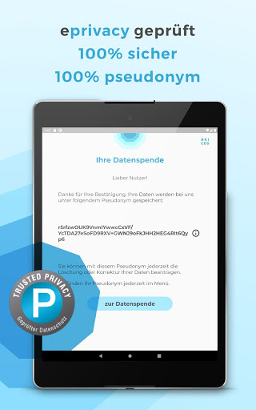
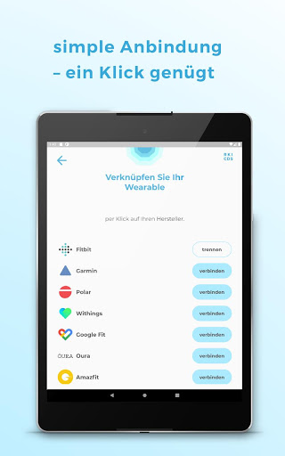
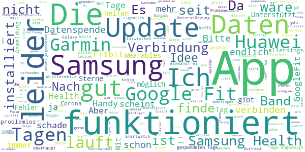
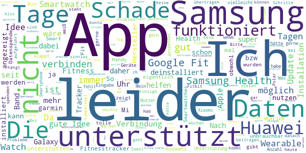

# Corona-Datenspende
App version ``2.2.0``

Analyzed with [covid-apps-observer](http://github.com/covid-apps-observer) project, version ``0.1``

## App overview
| | |
|-------------------------|-------------------------| 
| **Name**&nbsp;&nbsp;&nbsp;&nbsp;&nbsp;&nbsp;&nbsp;&nbsp;&nbsp;&nbsp;&nbsp;&nbsp;&nbsp;&nbsp;&nbsp;&nbsp;&nbsp;&nbsp;&nbsp;&nbsp;&nbsp;&nbsp;&nbsp;&nbsp;&nbsp;&nbsp;&nbsp;&nbsp;&nbsp;&nbsp;&nbsp;&nbsp;&nbsp;&nbsp;&nbsp;&nbsp;&nbsp;&nbsp;&nbsp;&nbsp;  | Corona-Datenspende |
| **Unique identifier** | de.rki.coronadatenspende |
| **Link to Google Play** | [https://play.google.com/store/apps/details?id=de.rki.coronadatenspende](https://play.google.com/store/apps/details?id=de.rki.coronadatenspende) |
| **Summary**  | Unterstützen Sie das Robert-Koch-Institut in der Eindämmung der Covid-Epidemie! |
| **Privacy policy** | [https://corona-datenspende.de/datenschutz-app/](https://corona-datenspende.de/datenschutz-app/) |
| **Latest version** | 2.2.0 |
| **Last update** | 2020-12-18 16:50:28 |
| **Recent changes** | Erweiterung des Hauptbildschirms um den Fiebermonitor (Analyse der Daten der Corona-Datenspende) |
| **Installs**  | 100.000+ |
| **Category** | Gesundheit & Fitness |
| **First release** | 31.03.2020 |
| **Size**  | 23M |
| **Supported Android version**  | 5.0 oder höher |

### Description
> Das Robert Koch-Institut bittet die Bevölkerung um Unterstützung bei der Eindämmung der aktuellen COVID-19 Pandemie. Mit der Corona-Datenspende-App stellen Personen freiwillig dem Robert Koch-Institut Daten ihrer Fitnessarmbänder oder ihrer Smartwatches zur Verfügung. Diese Daten können dabei helfen, die Ausbreitung des Coronavirus besser zu erfassen und zu verstehen.
 Hilft bei der Bekämpfung des Coronavirus
 Freiwillig und pseudonym
 Berücksichtigt den Datenschutz
 In weniger als 3 Minuten eingerichtet
 Bitte beachten Sie, dass für die Nutzung der App Corona-Datenspende ein Fitnessarmband oder eine Smartwatch notwendig ist.
 Unterstützt werden aktuell über GoogleFit und AppleHealth verbundene Geräte sowie Geräte von Fitbit, Garmin, Polar und Withings/Nokia. Die Integration weiterer Geräte wird derzeit geprüft.
 Das Robert Koch-Institut wendet sich an alle Bürgerinnen und Bürger mit geeigneten Fitnessarmbändern oder Smartwatches und bittet um Teilnahme.
 Auf Basis Ihrer Bewegungs-, Schlaf- und Pulswerte können fieberhafte Infektionen erkannt werden. Das Robert Koch-Institut kann mögliche Coronavirus-Infektionen damit tagesaktuell abschätzen und vorhersagen.
 Mit der Corona-Datenspende-App können Sie vollständig pseudonym Informationen zur Verbreitung der Coronavirus-Infektion zur Verfügung stellen.
 Weitere Informationen in den FAQ:
 https://corona-datenspende.de/faq/

### User interface
The developers of the app provide the following screenshots in the Google play store.
| | | |
|:-------------------------:|:-------------------------:|:-------------------------:|
 |   |   |   | 
 |   |   |   | 
 |   |   |   | 
 |   |   |   | 
 |   |   |   | 
 |   |   |   | 

## Development team
In the following we report the main information provided by the development team in the Google play store.

| | |
|-------------------------|-------------------------|
| **Developer**  | Robert Koch-Institut |
| **Website**  | [https://corona-datenspende.de](https://corona-datenspende.de) |
| **Email** | info@corona-datenspende.de |
| **Physical address**  | [Robert Koch-Institut Nordufer 20 13353 Berlin](https://www.google.com/maps/search/Robert%20Koch-Institut%20Nordufer%2020%2013353%20Berlin) (Google Maps) |
| **Other developed apps**  | [https://play.google.com/store/apps/developer?id=Robert+Koch-Institut](https://play.google.com/store/apps/developer?id=Robert+Koch-Institut) |

## Android support

| | |
|-------------------------|-------------------------|
| **Declared target Android version**  | - |
| **Effective target Android version**  | - |
| **Minimum supported Android version**  | Lollipop, version 5.0 (API level 21) |
| **Maximum target Android version**  | - |

The larger the difference between the minimum and maximum supported Android versions, the better. A larger difference means a wider audience. For example, old phones have a very low Android version, so a high minimum supported Android version means that the app cannot be used by users with old phones, thus leading to accessibility problems. 

## Requested permissions

In the following we report the complete list of the permissions requested by the app. 

| **Permission** | **Protection level** | **Description** | 
|-------------------------|-------------------------|-------------------------|
 **android.permission ACCESS_NETWORK_STATE** | Normal | Allows applications to access information about networks. 
 **android.permission ACCESS_WIFI_STATE** | Normal | Allows applications to access information about Wi-Fi networks. 
 **android.permission FOREGROUND_SERVICE** | Normal | Allows a regular application to use Service.startForeground. 
 **android.permission INTERNET** | Normal | Allows applications to open network sockets. 
 **android.permission RECEIVE_BOOT_COMPLETED** | Normal | Allows an application to receive the Intent.ACTION_BOOT_COMPLETED that is broadcast after the system finishes booting. 
 **android.permission WAKE_LOCK** | Normal | Allows using PowerManager WakeLocks to keep processor from sleeping or screen from dimming. 
 **com.google.android.c2dm.permission RECEIVE** | - | - 

## Mentioned servers

| **Server** | **Registrant** | **Registrant country** | **Creation date** | 
|-------------------------|-------------------------|-------------------------|-------------------------|
 | google.com | Google LLC | :us: US | 1997-09-15 04:00:00 |

## Security analysis 

Below we report the main security warnings raised by our execution of the [Androwarn](https://github.com/maaaaz/androwarn) security analysis tool.

**Telephony identifiers leakage**
> - This application reads the MCC+MNC of the provider of the SIM 

**Connection interfaces exfiltration**
> - This application reads details about the currently active data network 
> - This application tries to find out if the currently active data network is metered 

**Pim data leakage**
> - This application accesses data stored in the clipboard 

**Code execution**
> - This application loads a native library: 'flutter' 
> - This application loads a native library: 'log' 
> - This application loads a native library: 'sentry' 
> - This application loads a native library: 'sentry-android' 
> - This application executes a UNIX command 

## User ratings and reviews

Below we provide information about how end users are reacting to the app in terms of ratings and reviews in the Google Play store.

### Ratings

The Corona-Datenspende app has been installed by more than **100000** times. At this time, **11621** rated the app and its average score is **3.0420876**. Below we show the distribution of the ratings across the usual star-based rating of Google Play

:star::star::star::star::star:: 4412

:star::star::star::star:: 1115

:star::star::star:: 919

:star::star:: 900

:star:: 4275

### Reviews 

#### 5-star reviews

> 👍🏻  :date: __2020-12-26 14:40:13__

> Eine sehr gute app erstreckt in dieser Situation in der wir uns alle befinden.  :date: __2020-12-25 21:18:54__

> Installation und Verbindung mit Fitbit hat geklappt. Aber es werden keine Tage der gespendeten Daten angezeigt. Sollten heute 3 Tage sein. Ich habe die dann neu installiert und alles war bestens.  :date: __2020-12-23 11:46:49__

> Samsung Smartwatches sind auswählbar  :date: __2020-12-21 21:17:52__

> Bei Mir funktioniert die app mit Samsung Health konnte Samsung Health ohne Probleme Mit der Datenspende App Verbinden ich spende Schon Seit 48 Tagen ich kann die Beiträge der Poster nicht verstehen die haben einfach keine ahnung und wissen nicht wie das geht  :date: __2020-12-21 19:23:48__

> 21.12. Tut's wieder normal, mittlerweile 92 Tage gespendet.  :date: __2020-12-21 16:26:17__

> ich versuche ständig im intervall die app mit samsung health zu verbinden,seit tagen immer wieder die anzeige integration fehlgeschlagen,so bringt es leider gar nichts! smartphone:huawei p9 smartwatch : samsung gear s3 frontier zwischen smartphone und smartwatch klappt ohne probleme der austausch mit samsung health coroner warn app fast seit einführung installiert und es klappt ohne probleme! update-plötzlich klappt es,ich habe nichts anderes gemacht wie vorher!jetzt werde ich beobachten...  :date: __2020-12-18 15:29:45__

> Nicht für jedes Armband geeignet. Es soll der Puls gemessen werden. Nicht jeder hat einen Pulsmesser im Tracker. Somit wertlos bei mir. Und nicht jeder in Deutschland trägt ein Fitnessarmband. Zumal die nicht ganz billig sind. Funktioniert mit den o.g. erfüllten Vorraussetzungen offenbar ganz gut. Nachdem ich heute aktualisiert habe, sehe ich auch wieder meine gespendeten Tage.  :date: __2020-12-16 16:15:47__

> Da die Funktion der Tastatur vom App eingeschränkt wird, lässt sich keine E-Mail Adresse für die Google Fit Anmeldung eingeben. Schlecht programmiert. App ist unbenutzbar. Update: wenn man die Original Google Tastatur einstellt, funktioniert es. Problem könnte gelöst werden.  :date: __2020-12-12 08:15:38__

> Sehr gute App!  :date: __2020-12-09 15:46:49__

#### 4-star reviews

> An sich eine gute App, die übersichtlich gestaltet ist. Unterstützt leider nur sehr wenige Fitness Apps und meine ist keine davon :(  :date: __2020-12-24 23:15:53__

> Leider kann ich keine Samsung Galaxy Wearables auswählen. Daher Google Fit verknüpft in der Hoffnung das Daten ankommen.  :date: __2020-12-14 10:46:30__

> 12.12. Mittlerweile läuft die App auch auf dem Huawei P20. Bisher wurden an 93 Tagen Daten gespendet. 27.04. Nach erneutem Download: Tastatur springt bei Eingabe der Mail Adresse immernoch um. -> erneut deinstalliert 15.04. 2. Versuch scheitert Fehler: - bei der Eingabe der Mailadresse als auch des Passworts springt die Tastatur direkt zurück. - Verbindung zu GoogleFit nicht möglich Handy: Huawei P20 Smartwatch/Fitnessuhr: Huawei Band 2 Pro 08.04. Verbindung nicht möglich  :date: __2020-12-12 07:32:27__

> Samsung Smartwatches und Wearables werden jetzt unterstützt, deshalb Änderung von 2 auf 4 Sterne. Schön und Hilfreich wäre auch eine Unterstützung von Huawei Wearables, die sind ja auch sehr verbreitet. Ist da was in Planung?  :date: __2020-12-10 22:28:46__

> Ich gebe erstmal nur 4 Sterne, weil ich die Idee oder den Hintergrund ansich sehr gut finde. Ich möchte auch sehr gerne helfen. Leider habe ich mein Band (Honor Band 5-e28) nicht gefunden. Ich hoffe, das mein Band bald dabei ist. Dann gibt es auch den 5. Stern. Bleibt alle gesund! Nach 7 Monaten.... Von Ende April bis Ende November ist es noch immer nicht möglich, Huawei zu wählen. Sehr schade, da diese Marke ja doch von vielen genutzt wird.  :date: __2020-11-30 18:13:48__

> Gute Einsichten in die Forschungsergebnisse. Aber jetzt bekomme ich eine neue Uhr, die ich hier nicht auswählen kann um weiter teilzunehmen.  :date: __2020-11-29 11:18:53__

> Installiert vor 3 Tagen, verbunden mit POLAR. Datenspende 0 Tage? Edit am 14.11.20: endlich werden die gesendeten Tage angezeigt.  :date: __2020-11-14 08:12:25__

> Fehlerhafte App. Es lässt sich keine Verbindung mit einem Google Konto herstellen. Das Konto ist auf Android aktiv, leider schafft es die App nicht darauf zuzugreifen. UPDATE App arbeitet nun im Hintergrund.  :date: __2020-11-11 22:40:29__

> Habe die App seit 5 Tagen und die App hat nach dem 3. Tag aufgehört zu zählen. Das ist schade. Ich hoffe das es trotzdem klappt mit der Übertragung.  :date: __2020-11-09 15:36:29__

> Bitte noch MiFit zufügen, dann gibt's bessere Daten!  :date: __2020-11-02 10:23:51__

#### 3-star reviews

> Bin mir, auch nach den ganzen Monaten, eigentlich gar nicht sicher, was diese App überhaupt macht.  :date: __2020-12-19 14:38:18__

> Funktioniert das alles auch mit einer samsung gear sport?  :date: __2020-12-18 10:36:10__

> Samsung Health kann nicht integriert werden. Diese Fehlermeldung habe ich dauerhaft. Kann leider keine Daten spenden.  :date: __2020-12-17 20:15:14__

> Anscheinend will man von mir nicht mehr wie 66 Tage.. und dies ist schon über 2 Monate her 😒 Update: nachdem ich 120 Tage im Rückstand war, hat sich die App wieder die Tage geholt und ist "auf dem aktuellen Stand" Darstellung und Auswertung könnte ansprechender dargestellt werden..  :date: __2020-12-12 08:33:37__

> Leider kann ich die App nicht, da mein MI Bank und die App dazu nicht auswählbar ist.  :date: __2020-12-06 11:36:38__

> Meine 2 smartwatsces kennt er beide micht  :date: __2020-11-29 03:01:22__

> Guten Tag, wird es möglich sein, künftig auch Huawei-Smartwatches zu koppeln? Ich möchte ungern weiter mit 2 Smartwatches durch die Gegend laufen. Wird die Datenspende überhaupt noch benötigt? Danke.  :date: __2020-11-17 17:02:28__

> Schwer zu beurteilen, da sozusagen passiv  :date: __2020-11-12 17:26:03__

> Ich finde, das es eine gute Sache ist. Leider werden Xiaomi/Amazfit nicht unterstützt. Daher für viele vermutlich leider nicht anwendbar.  :date: __2020-11-02 14:56:11__

> Ich befürworte das Konzept hinter der App und würde meine Gesundheitsdaten gerne zur Verfügung stellen. Jedoch würde ich mir wünschen, dass die Probleme bei der Anmeldung über google fit schnellstens gelöst werden, oder zumindest der Mi fit Service zu den unterstützten Services aufgenommen würde. Dann müsste ich mit meiner Xiaomi Amazfit watch gar nicht erst auf google fit ausweichen.  :date: __2020-10-29 10:59:12__

#### 2-star reviews

> 'Verbindung nicht möglich. Es ist ein Problem mit dem Server aufgetreten.' Leider kann so auch der willigste nicht helfen.  :date: __2020-12-27 11:51:46__

> Einloggen bei Polar nicht möglich. System Huawei P30 Pro. Update : was für eine Fieberkurve wird da angezeigt, meine?  :date: __2020-12-22 07:45:30__

> Ich finde diese App super und es ist eine tolle Idee. Bei mir funktioniert es ohne Probleme. Kleines Update bei mir verschwinden auf einmal so über 100 Tage die gespendet wurden, von gestern auf heute. Davor waren auch auf einmal 30 Tage weg gewesen. Da stimmt was nicht. Deshalb nur noch 2 Sterne.  :date: __2020-12-16 06:13:38__

> Blöd wenn man corona mit positivem test hatte und dann nicht seine daten aus zb dem nachgewiesenen zeitraum spenden kann... den Verlauf konnte man anhand meiner garmin uhr nämlich wirklich gut verfolgen... aber okay bin mit positivem test ja keine schwarze Zahl mehr...  :date: __2020-12-11 20:21:58__

> Postleitzahl wird nicht anerkannt... Komme aus 25813 und nix passiert.  :date: __2020-12-04 08:57:58__

> Scheint nicht mehr zu funktionieren. Bin schon ewig dabei, und zeigt 0 Tage Datenspende an. Ob die App überhaupt was bringt, bezweifle ich langsam, ich werde sie deinstallieren.  :date: __2020-12-04 06:58:50__

> Das ganze sieht gut aus, unterstützt aber keine Huawei watches  :date: __2020-11-22 22:45:35__

> Gute Idee, aber verbinden über Amazfit war nicht möglich?  :date: __2020-11-02 14:02:57__

> Ich hatte sie installiert um bei dem Versuch meine Smart Watch zu verbinden festzustellen das leider Samsungs Watch nicht unterstützt wird. WANN kann man denn damit rechnen ???  :date: __2020-11-02 13:37:58__

> Auf die Unterstützung anderer Devices (z.b. Samsung Wearable) warte ich nun schon über ein halbes Jahr. Im Text steht immer noch, es werde vorbereitet. So wird das nichts mit uns... Schade, ich würde die App gern nutzen.  :date: __2020-10-24 11:06:35__

#### 1-star reviews

> Leider kann ich die App nicht zu ende installieren. Immer wenn ich meine PLZ eingebe, tritt plötzlich ein Fehler auf....  :date: __2020-12-21 18:00:30__

> Idee ist super. Nur kann ich meine Samsung Gear S3 Frontier nicht verknüpfen.  :date: __2020-12-21 04:54:48__

> Leider gibt es auch im Dezember (!) 2020 immer noch keine Unterstützung für die Huawei Health App. Die Daten die über Google Fit an die Datenspende-App übermittelt werden sind leider irrelevant, da Puls und SaO2 nicht übermittelt werden. Darüber hinaus wird das Schlaf-Trecking nach Google Fit falsch übermittelt. So macht das ganze keinen Sinn!  :date: __2020-12-20 16:12:56__

> Funktioniert nicht mit Huawei Watch. Schade.  :date: __2020-12-20 10:19:29__

> Keine Verbindung zu wearables von huawei  :date: __2020-12-17 23:35:41__

> 28 Tage konnte ich meine Daten spenden, bis ich feststellen konnte, dass die Verbindungsoption zu S-Health wieder einmal nicht möglich ist. Ich finde das unfassbar schlecht, seitens der Entwickler.  :date: __2020-12-16 17:57:04__

> Leider keine Verbindung zu mifit möglich. Schade, hätte gerne geholfen. Werde die App wieder deinstallieren  :date: __2020-12-16 09:15:05__

> Nutze weder Fitness-armband noch SmartWatch,daher nutzlos für mich  :date: __2020-12-16 02:43:16__

> Leider ist meine Uhr nicht kompatibel mit der App  :date: __2020-12-13 16:42:59__

> Sehr schlecht  :date: __2020-12-11 16:27:50__

