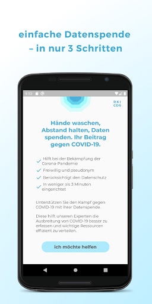
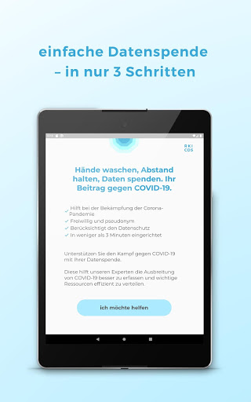
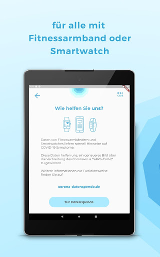
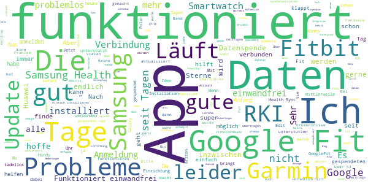
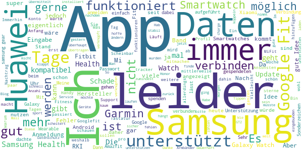
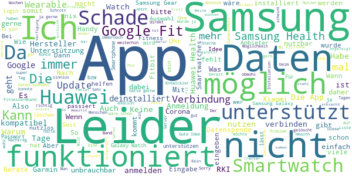

# Corona-Datenspende
App version ``2.2.0``

Analyzed with [covid-apps-observer](http://github.com/covid-apps-observer) project, version ``0.1``

## App overview
| | |
|-------------------------|-------------------------| 
| **Name**&nbsp;&nbsp;&nbsp;&nbsp;&nbsp;&nbsp;&nbsp;&nbsp;&nbsp;&nbsp;&nbsp;&nbsp;&nbsp;&nbsp;&nbsp;&nbsp;&nbsp;&nbsp;&nbsp;&nbsp;&nbsp;&nbsp;&nbsp;&nbsp;&nbsp;&nbsp;&nbsp;&nbsp;&nbsp;&nbsp;&nbsp;&nbsp;&nbsp;&nbsp;&nbsp;&nbsp;&nbsp;&nbsp;&nbsp;&nbsp;  | Corona-Datenspende |
| **Unique identifier** | de.rki.coronadatenspende |
| **Link to Google Play** | [https://play.google.com/store/apps/details?id=de.rki.coronadatenspende](https://play.google.com/store/apps/details?id=de.rki.coronadatenspende) |
| **Summary**  | Unterstützen Sie das Robert-Koch-Institut in der Eindämmung der Covid-Epidemie! |
| **Privacy policy** | [https://corona-datenspende.de/datenschutz-app/](https://corona-datenspende.de/datenschutz-app/) |
| **Latest version** | 2.2.0 |
| **Last update** | 2020-12-18 16:50:28 |
| **Recent changes** | Erweiterung des Hauptbildschirms um den Fiebermonitor (Analyse der Daten der Corona-Datenspende) |
| **Installs**  | 100.000+ |
| **Category** | Gesundheit & Fitness |
| **First release** | 31.03.2020 |
| **Size**  | 23M |
| **Supported Android version**  | 5.0 oder höher |

### Description
> Das Robert Koch-Institut bittet die Bevölkerung um Unterstützung bei der Eindämmung der aktuellen COVID-19 Pandemie. Mit der Corona-Datenspende-App stellen Personen freiwillig dem Robert Koch-Institut Daten ihrer Fitnessarmbänder oder ihrer Smartwatches zur Verfügung. Diese Daten können dabei helfen, die Ausbreitung des Coronavirus besser zu erfassen und zu verstehen.
 Hilft bei der Bekämpfung des Coronavirus
 Freiwillig und pseudonym
 Berücksichtigt den Datenschutz
 In weniger als 3 Minuten eingerichtet
 Bitte beachten Sie, dass für die Nutzung der App Corona-Datenspende ein Fitnessarmband oder eine Smartwatch notwendig ist.
 Unterstützt werden aktuell über GoogleFit und AppleHealth verbundene Geräte sowie Geräte von Fitbit, Garmin, Polar und Withings/Nokia. Die Integration weiterer Geräte wird derzeit geprüft.
 Das Robert Koch-Institut wendet sich an alle Bürgerinnen und Bürger mit geeigneten Fitnessarmbändern oder Smartwatches und bittet um Teilnahme.
 Auf Basis Ihrer Bewegungs-, Schlaf- und Pulswerte können fieberhafte Infektionen erkannt werden. Das Robert Koch-Institut kann mögliche Coronavirus-Infektionen damit tagesaktuell abschätzen und vorhersagen.
 Mit der Corona-Datenspende-App können Sie vollständig pseudonym Informationen zur Verbreitung der Coronavirus-Infektion zur Verfügung stellen.
 Weitere Informationen in den FAQ:
 https://corona-datenspende.de/faq/

### User interface
The developers of the app provide the following screenshots in the Google play store.
| | | |
|:-------------------------:|:-------------------------:|:-------------------------:|
 |   |   |   | 
 |   |   |   | 
 |   |   |   | 
 |   |   |   | 
 |   |   |   | 
 |   |   |   | 

## Development team
In the following we report the main information provided by the development team in the Google play store.

| | |
|-------------------------|-------------------------|
| **Developer**  | Robert Koch-Institut |
| **Website**  | [https://corona-datenspende.de](https://corona-datenspende.de) |
| **Email** | info@corona-datenspende.de |
| **Physical address**  | [Robert Koch-Institut Nordufer 20 13353 Berlin](https://www.google.com/maps/search/Robert%20Koch-Institut%20Nordufer%2020%2013353%20Berlin) (Google Maps) |
| **Other developed apps**  | [https://play.google.com/store/apps/developer?id=Robert+Koch-Institut](https://play.google.com/store/apps/developer?id=Robert+Koch-Institut) |

## Android support

| | |
|-------------------------|-------------------------|
| **Declared target Android version**  | - |
| **Effective target Android version**  | - |
| **Minimum supported Android version**  | Lollipop, version 5.0 (API level 21) |
| **Maximum target Android version**  | - |

The larger the difference between the minimum and maximum supported Android versions, the better. A larger difference means a wider audience. For example, old phones have a very low Android version, so a high minimum supported Android version means that the app cannot be used by users with old phones, thus leading to accessibility problems. 

## Requested permissions

In the following we report the complete list of the permissions requested by the app. 

| **Permission** | **Protection level** | **Description** | 
|-------------------------|-------------------------|-------------------------|
 **android.permission ACCESS_NETWORK_STATE** | Normal | Allows applications to access information about networks. 
 **android.permission ACCESS_WIFI_STATE** | Normal | Allows applications to access information about Wi-Fi networks. 
 **android.permission FOREGROUND_SERVICE** | Normal | Allows a regular application to use Service.startForeground. 
 **android.permission INTERNET** | Normal | Allows applications to open network sockets. 
 **android.permission RECEIVE_BOOT_COMPLETED** | Normal | Allows an application to receive the Intent.ACTION_BOOT_COMPLETED that is broadcast after the system finishes booting. 
 **android.permission WAKE_LOCK** | Normal | Allows using PowerManager WakeLocks to keep processor from sleeping or screen from dimming. 
 **com.google.android.c2dm.permission RECEIVE** | - | - 

## Mentioned servers

| **Server** | **Registrant** | **Registrant country** | **Creation date** | 
|-------------------------|-------------------------|-------------------------|-------------------------|
 | google.com | Google LLC | :us: US | 1997-09-15 04:00:00 |

## Security analysis 

Below we report the main security warnings raised by our execution of the [Androwarn](https://github.com/maaaaz/androwarn) security analysis tool.

**Telephony identifiers leakage**
> - This application reads the MCC+MNC of the provider of the SIM 

**Connection interfaces exfiltration**
> - This application reads details about the currently active data network 
> - This application tries to find out if the currently active data network is metered 

**Pim data leakage**
> - This application accesses data stored in the clipboard 

**Code execution**
> - This application loads a native library: 'flutter' 
> - This application loads a native library: 'log' 
> - This application loads a native library: 'sentry' 
> - This application loads a native library: 'sentry-android' 
> - This application executes a UNIX command 

## User ratings and reviews

Below we provide information about how end users are reacting to the app in terms of ratings and reviews in the Google Play store.

### Ratings

The Corona-Datenspende app has been installed by more than **100000** times. At this time, **11621** rated the app and its average score is **3.0420876**. Below we show the distribution of the ratings across the usual star-based rating of Google Play

:star::star::star::star::star:: 4412

:star::star::star::star:: 1115

:star::star::star:: 919

:star::star:: 900

:star:: 4275

### Reviews 

#### 5-star reviews

> Macht was es soll  :date: __2021-02-04 02:09:57__

> Die App vor 3 Wochen installiert, funktioniert bis jetzt ohne Probleme mit der Fitbit Charge 4. Nun hoffe ich das diese App ihren Zweck erfüllt.  :date: __2021-02-01 13:35:36__

> Leider nicht mit Samsung health verwendbar. Ich versuche das irgendwie mit google fit hinzubekommen. Ich weiß aber nicht wieviele Daten da mit samsung health synchronisiert werden.  :date: __2021-01-29 20:30:32__

> Funktionierte unkompliziert auf meiner Garmin. Bis die Uhr den Geist aufgegeben hat. Mit meiner neuen Huawei Uhr lässt sich die App nicht mehr verbinden.  :date: __2021-01-29 09:26:07__

> Corona Ap  :date: __2021-01-25 21:28:13__

> Auch als Samsung Nutzer (in meinem Fall mit einer Gear S3 Frontier, Verbunden mit Samsung Health auf einem Nokia 7.2) kann man diese App verwenden! Ich hatte erst über eine weitere App (Health Sync) eine Brücke zu Google Fit gelegt, um dann zu sehen dass ich in der Spende-App inzwischen auch SHealth direkt auswählen kann. Somit ist die direkte Nutzung auch für Samsung Nutzer möglich! Aber es wäre gut wenn die App Beschreibung aktualisiert würde!  :date: __2021-01-21 13:43:43__

> Amazfit Integration nun vorhanden. Daher von 3 auf 5 Sterne.  :date: __2021-01-08 16:08:04__

> 👍🏻  :date: __2020-12-26 14:40:13__

> Eine sehr gute app erstreckt in dieser Situation in der wir uns alle befinden.  :date: __2020-12-25 21:18:54__

> Installation und Verbindung mit Fitbit hat geklappt. Aber es werden keine Tage der gespendeten Daten angezeigt. Sollten heute 3 Tage sein. Ich habe die dann neu installiert und alles war bestens.  :date: __2020-12-23 11:46:49__

#### 4-star reviews

> Die App muss einfach Effektiver werden. Ja, ich bin für Datenschutz, aber bin der Meinung das dieser auch unter solchen Umständen Grenzen haben muss.  :date: __2021-01-31 14:46:39__

> Leider keine Unterstützung für Samsung Health. Somit aktuell leider für Besitzer einer Samsung Watch nicht nutzbar. Update 15.01.2021 Inzwischen auch mit Samsung Health nutzbar.  :date: __2021-01-15 14:21:05__

> An sich eine gute App, die übersichtlich gestaltet ist. Unterstützt leider nur sehr wenige Fitness Apps und meine ist keine davon :(  :date: __2020-12-24 23:15:53__

> Leider kann ich keine Samsung Galaxy Wearables auswählen. Daher Google Fit verknüpft in der Hoffnung das Daten ankommen.  :date: __2020-12-14 10:46:30__

> 12.12. Mittlerweile läuft die App auch auf dem Huawei P20. Bisher wurden an 93 Tagen Daten gespendet. 27.04. Nach erneutem Download: Tastatur springt bei Eingabe der Mail Adresse immernoch um. -> erneut deinstalliert 15.04. 2. Versuch scheitert Fehler: - bei der Eingabe der Mailadresse als auch des Passworts springt die Tastatur direkt zurück. - Verbindung zu GoogleFit nicht möglich Handy: Huawei P20 Smartwatch/Fitnessuhr: Huawei Band 2 Pro 08.04. Verbindung nicht möglich  :date: __2020-12-12 07:32:27__

> Samsung Smartwatches und Wearables werden jetzt unterstützt, deshalb Änderung von 2 auf 4 Sterne. Schön und Hilfreich wäre auch eine Unterstützung von Huawei Wearables, die sind ja auch sehr verbreitet. Ist da was in Planung?  :date: __2020-12-10 22:28:46__

> Ich gebe erstmal nur 4 Sterne, weil ich die Idee oder den Hintergrund ansich sehr gut finde. Ich möchte auch sehr gerne helfen. Leider habe ich mein Band (Honor Band 5-e28) nicht gefunden. Ich hoffe, das mein Band bald dabei ist. Dann gibt es auch den 5. Stern. Bleibt alle gesund! Nach 7 Monaten.... Von Ende April bis Ende November ist es noch immer nicht möglich, Huawei zu wählen. Sehr schade, da diese Marke ja doch von vielen genutzt wird.  :date: __2020-11-30 18:13:48__

> Gute Einsichten in die Forschungsergebnisse. Aber jetzt bekomme ich eine neue Uhr, die ich hier nicht auswählen kann um weiter teilzunehmen.  :date: __2020-11-29 11:18:53__

> Installiert vor 3 Tagen, verbunden mit POLAR. Datenspende 0 Tage? Edit am 14.11.20: endlich werden die gesendeten Tage angezeigt.  :date: __2020-11-14 08:12:25__

> Fehlerhafte App. Es lässt sich keine Verbindung mit einem Google Konto herstellen. Das Konto ist auf Android aktiv, leider schafft es die App nicht darauf zuzugreifen. UPDATE App arbeitet nun im Hintergrund.  :date: __2020-11-11 22:40:29__

#### 3-star reviews

> Bisher wurden meine Daten mit Garmin übertragen, das hat auch super funktioniert und ich würde auch gerne weiter meine Daten zur Verfügung stellen. Leider funktioniert das mit meiner Huawei Watch nicht, auf die ich mittlerweile umgestiegen bin, da die Daten deutlich genauer sind als bei Garmin. Huawei Health wird leider nicht unterstützt, es wäre super, wenn das geändert werden würde. So muss ich mich leider verabschieden...  :date: __2021-01-16 11:59:43__

> Bin mir, auch nach den ganzen Monaten, eigentlich gar nicht sicher, was diese App überhaupt macht.  :date: __2020-12-19 14:38:18__

> Funktioniert das alles auch mit einer samsung gear sport?  :date: __2020-12-18 10:36:10__

> Samsung Health kann nicht integriert werden. Diese Fehlermeldung habe ich dauerhaft. Kann leider keine Daten spenden.  :date: __2020-12-17 20:15:14__

> Anscheinend will man von mir nicht mehr wie 66 Tage.. und dies ist schon über 2 Monate her 😒 Update: nachdem ich 120 Tage im Rückstand war, hat sich die App wieder die Tage geholt und ist "auf dem aktuellen Stand" Darstellung und Auswertung könnte ansprechender dargestellt werden..  :date: __2020-12-12 08:33:37__

> Leider kann ich die App nicht, da mein MI Bank und die App dazu nicht auswählbar ist.  :date: __2020-12-06 11:36:38__

> Meine 2 smartwatsces kennt er beide micht  :date: __2020-11-29 03:01:22__

> Guten Tag, wird es möglich sein, künftig auch Huawei-Smartwatches zu koppeln? Ich möchte ungern weiter mit 2 Smartwatches durch die Gegend laufen. Wird die Datenspende überhaupt noch benötigt? Danke.  :date: __2020-11-17 17:02:28__

> Schwer zu beurteilen, da sozusagen passiv  :date: __2020-11-12 17:26:03__

> Ich finde, das es eine gute Sache ist. Leider werden Xiaomi/Amazfit nicht unterstützt. Daher für viele vermutlich leider nicht anwendbar.  :date: __2020-11-02 14:56:11__

#### 2-star reviews

> das App Prinzip ist eigentlich gut, aber leider werden die gängigsten Uhren Hersteller, wie Apple und Samsung nicht unterstützt. Daher war die App für mich unbrauchbar. Ich kann leider nicht verstehen, warum diese Marken nicht angeboten werden, da doch eigentlich 70 % aller SmartWatch Träger Apple oder Samsung Uhren besitzen.  :date: __2021-02-05 00:00:18__

> Leider kann ich meine Huawei GT2 Smartwatch nicht mit der App verbinden, da dies scheinbar gar nicht kompatibel ist. Somit ist sie leider für mich unbrauchbar.  :date: __2021-01-23 15:26:05__

> Hallo, kann ich meine Daten auch per Fax schicken?  :date: __2021-01-15 20:11:57__

> Solang Huawei Health bei euch nicht eingebunden wird ist die App für mich leider unbrauchbar....  :date: __2021-01-13 14:14:15__

> Auf Grund meiner Erfahrungen mit der corona warn app u der Meldung ; sie können mit Tan ..... sehe ich es als sinnlos an diese u die corona warn app auf meinem Handy zu lasen wenn diese ee nicht sinn u Zweck erfüllen sondern mehr Aufwand bringen! Sorry aber die sind für den A..! U wenn zu was nutze ,nur für reine Bewegungs Erfassung für irgendein Bundesamt zu betrachten! Danke für die verarsche u Zeit Verschwendung  :date: __2021-01-11 14:33:14__

> An sich eine gute Idee und ich hätte gerne auch Daten gespendet, aber mein Armband bzw. die App Mi Fit gibt es in der Auswahl leider nicht.  :date: __2021-01-07 22:05:29__

> Leider werden Smartwatches von Samsung nicht unterstützt, daher kann ich leider keine Daten spenden  :date: __2020-12-29 13:27:44__

> 'Verbindung nicht möglich. Es ist ein Problem mit dem Server aufgetreten.' Leider kann so auch der willigste nicht helfen.  :date: __2020-12-27 11:51:46__

> Einloggen bei Polar nicht möglich. System Huawei P30 Pro. Update : was für eine Fieberkurve wird da angezeigt, meine?  :date: __2020-12-22 07:45:30__

> Ich finde diese App super und es ist eine tolle Idee. Bei mir funktioniert es ohne Probleme. Kleines Update bei mir verschwinden auf einmal so über 100 Tage die gespendet wurden, von gestern auf heute. Davor waren auch auf einmal 30 Tage weg gewesen. Da stimmt was nicht. Deshalb nur noch 2 Sterne.  :date: __2020-12-16 06:13:38__

#### 1-star reviews

> Warum wird Kein huawei watch gt2pro Unterstützung?  :date: __2021-02-02 19:35:02__

> Da Europa sowieso als reiner Datensammler zwischen Amerika und China enden wird. Sollte es einer Institution wie Ihnen gelingen 95% aller SmartWatches abzudecken. Bei einer reinen Datensammler App. Meine Empfehlung: 6, Thema verfehlt, setzen.  :date: __2021-01-31 10:28:26__

> Würde ja gerne meine Daten zu ferfügung stellen. Da ich ein Mi Band besitze und mit diesem Problem nicht alleine bin frage ich mich wann Xiaomi in die Liste der kompatiblen Geräte mit aufgenommen wird.  :date: __2021-01-31 09:54:05__

> Ich wollte es nicht glauben, aber Xiaomi als einer der drei größten Hersteller von Fitnesstrackern fehlt ja wirklich. Das ist ja, als wenn man eine Studie zur Autonutzung macht und den VW Konzern nicht anklicken kann. Oder Studie zur Smartphone Nutzung und Apple steht nicht dabei.  :date: __2021-01-30 09:00:36__

> Deinstalliert!! RKI-akademische Datenspielerei 🤔 ohne Transparenz weil voll wenn aber vielleicht vorausgesetzt daß mit für den user undefinierten Fakten,Algorithmen, Ergebnis/Folgerungen ist Geheimnis der RKI Akademiker. Wie von unterschiedlichen Smartwatches u Fitclouds die Daten u in z bsp Google fit nur teilw. angekommen bleibt ein Geheimnis u ist nicht reproduzierbar. RKI gibt diese Daten für politische Entscheidungen, ganz schlimm. Ebenso die sinnlose App zu Corona Kontakten deaktiviert.  :date: __2021-01-27 09:27:07__

> Ich hätte die App gerne genutzt um zu helfen, leider funktioniert die App nicht mit Mi Fit. Ich habe sie deinstalliert und hoffe, dass es diesbezüglich bald eine Erweiterung gibt . Dann bin ich gerne dabei  :date: __2021-01-27 00:11:55__

> Gelöscht  :date: __2021-01-25 11:31:20__

> Ungenügende Auswahl. Weitverbreitet sind Xiaomi, Honor, Huawei Bänder und Uhren. Tauchen leider nicht auf... Dann muss man sich nicht wundern,wenn das nicht funktioniert. Ich interessiere mich sehr stark für wearables und anderen smarten Sachen... Oura hab ich noch nie gehört, wird aber in der Liste aufgeführt... Vielleicht klappt's ja noch mit Mi fit und Huawei health.😉  :date: __2021-01-24 14:24:05__

> Warum vertraut ihr dem Staat das RKI Robert Koch Institut hat sich schon blamiert mit den falsch informierten Infektions ich bin 18 wollt ihr es wirklich provozieren ich bin so hard durch trainiert das ich gerne dies als Gewalt missbrauchen werde wenn ihr stehts damit nicht aufhört propaganda an inkompetenten Menschen glauben zu lassen die alles glauben 🤣 witzig aber anderer seits seid ihr schuld für Arbeitslosigkeit dafür kriegt ihr das zurück vertraut Natur ist das was nie vergisst I FEEL 365  :date: __2021-01-20 11:52:09__

> Keine mi fit Unterstützung  :date: __2021-01-17 23:40:59__

