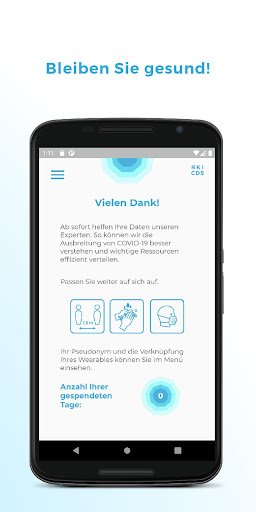
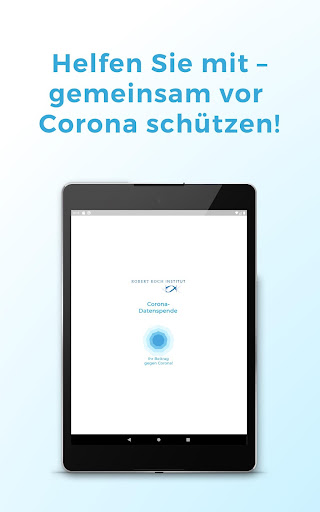
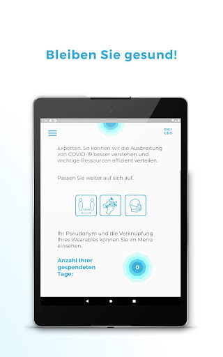
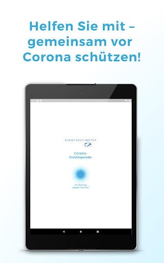
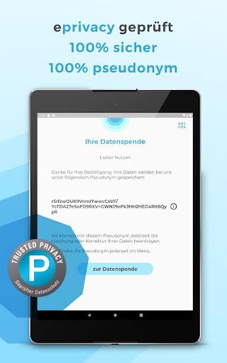
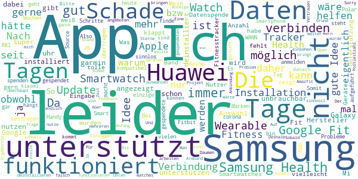

# Corona-Datenspende
App version ``2.2.1``

Analyzed with [covid-apps-observer](http://github.com/covid-apps-observer) project, version ``0.1``

## App overview
| | |
|-------------------------|-------------------------| 
| **Name**&nbsp;&nbsp;&nbsp;&nbsp;&nbsp;&nbsp;&nbsp;&nbsp;&nbsp;&nbsp;&nbsp;&nbsp;&nbsp;&nbsp;&nbsp;&nbsp;&nbsp;&nbsp;&nbsp;&nbsp;&nbsp;&nbsp;&nbsp;&nbsp;&nbsp;&nbsp;&nbsp;&nbsp;&nbsp;&nbsp;&nbsp;&nbsp;&nbsp;&nbsp;&nbsp;&nbsp;&nbsp;&nbsp;&nbsp;&nbsp;  | Corona-Datenspende |
| **Unique identifier** | de.rki.coronadatenspende |
| **Link to Google Play** | [https://play.google.com/store/apps/details?id=de.rki.coronadatenspende](https://play.google.com/store/apps/details?id=de.rki.coronadatenspende) |
| **Summary**  | Unterstützen Sie das Robert-Koch-Institut in der Eindämmung der Covid-Epidemie! |
| **Privacy policy** | [https://corona-datenspende.de/datenschutz-app/](https://corona-datenspende.de/datenschutz-app/) |
| **Latest version** | 2.2.1 |
| **Last update** | 2021-02-16 12:34:58 |
| **Recent changes** | Verschiedene Bugfixes und Verbesserung der Stabilität |
| **Installs**  | 100.000+ |
| **Category** | Gesundheit & Fitness |
| **First release** | 31.03.2020 |
| **Size**  | 23M |
| **Supported Android version**  | 5.0 oder höher |

### Description
> Das Robert Koch-Institut bittet die Bevölkerung um Unterstützung bei der Eindämmung der aktuellen COVID-19 Pandemie. Mit der Corona-Datenspende-App stellen Personen freiwillig dem Robert Koch-Institut Daten ihrer Fitnessarmbänder oder ihrer Smartwatches zur Verfügung. Diese Daten können dabei helfen, die Ausbreitung des Coronavirus besser zu erfassen und zu verstehen.
 Hilft bei der Bekämpfung des Coronavirus
 Freiwillig und pseudonym
 Berücksichtigt den Datenschutz
 In weniger als 3 Minuten eingerichtet
 Bitte beachten Sie, dass für die Nutzung der App Corona-Datenspende ein Fitnessarmband oder eine Smartwatch notwendig ist.
 Unterstützt werden aktuell über GoogleFit und AppleHealth verbundene Geräte sowie Geräte von Fitbit, Garmin, Polar und Withings/Nokia. Die Integration weiterer Geräte wird derzeit geprüft.
 Das Robert Koch-Institut wendet sich an alle Bürgerinnen und Bürger mit geeigneten Fitnessarmbändern oder Smartwatches und bittet um Teilnahme.
 Auf Basis Ihrer Bewegungs-, Schlaf- und Pulswerte können fieberhafte Infektionen erkannt werden. Das Robert Koch-Institut kann mögliche Coronavirus-Infektionen damit tagesaktuell abschätzen und vorhersagen.
 Mit der Corona-Datenspende-App können Sie vollständig pseudonym Informationen zur Verbreitung der Coronavirus-Infektion zur Verfügung stellen.
 Weitere Informationen in den FAQ:
 https://corona-datenspende.de/faq/

### User interface
The developers of the app provide the following screenshots in the Google play store.
| | | |
|:-------------------------:|:-------------------------:|:-------------------------:|
 |   |   |   | 
 |   |   |   | 
 |   |   |   | 
 |   |   |   | 
 |   |   |   | 
 |   |   |   | 

## Development team
In the following we report the main information provided by the development team in the Google play store.

| | |
|-------------------------|-------------------------|
| **Developer**  | Robert Koch-Institut |
| **Website**  | [https://corona-datenspende.de](https://corona-datenspende.de) |
| **Email** | info@corona-datenspende.de |
| **Physical address**  | [Robert Koch-Institut Nordufer 20 13353 Berlin](https://www.google.com/maps/search/Robert%20Koch-Institut%20Nordufer%2020%2013353%20Berlin) (Google Maps) |
| **Other developed apps**  | [https://play.google.com/store/apps/developer?id=Robert+Koch-Institut](https://play.google.com/store/apps/developer?id=Robert+Koch-Institut) |

## Android support

| | |
|-------------------------|-------------------------|
| **Declared target Android version**  | - |
| **Effective target Android version**  | - |
| **Minimum supported Android version**  | Lollipop, version 5.0 (API level 21) |
| **Maximum target Android version**  | - |

The larger the difference between the minimum and maximum supported Android versions, the better. A larger difference means a wider audience. For example, old phones have a very low Android version, so a high minimum supported Android version means that the app cannot be used by users with old phones, thus leading to accessibility problems. 

## Requested permissions

In the following we report the complete list of the permissions requested by the app. 

| **Permission** | **Protection level** | **Description** | 
|-------------------------|-------------------------|-------------------------|
 **android.permission ACCESS_NETWORK_STATE** | Normal | Allows applications to access information about networks. 
 **android.permission FOREGROUND_SERVICE** | Normal | Allows a regular application to use Service.startForeground. 
 **android.permission INTERNET** | Normal | Allows applications to open network sockets. 
 **android.permission RECEIVE_BOOT_COMPLETED** | Normal | Allows an application to receive the Intent.ACTION_BOOT_COMPLETED that is broadcast after the system finishes booting. 
 **android.permission WAKE_LOCK** | Normal | Allows using PowerManager WakeLocks to keep processor from sleeping or screen from dimming. 
 **com.google.android.c2dm.permission RECEIVE** | - | - 

## Mentioned servers

| **Server** | **Registrant** | **Registrant country** | **Creation date** | 
|-------------------------|-------------------------|-------------------------|-------------------------|
 | google.com | Google LLC | :us: US | 1997-09-15 04:00:00 |

## Security analysis 

Below we report the main security warnings raised by our execution of the [Androwarn](https://github.com/maaaaz/androwarn) security analysis tool.

**Telephony identifiers leakage**
> - This application reads the MCC+MNC of the provider of the SIM 

**Connection interfaces exfiltration**
> - This application reads details about the currently active data network 
> - This application tries to find out if the currently active data network is metered 

**Pim data leakage**
> - This application accesses data stored in the clipboard 

**Code execution**
> - This application loads a native library: 'flutter' 
> - This application loads a native library: 'log' 
> - This application loads a native library: 'sentry' 
> - This application loads a native library: 'sentry-android' 
> - This application executes a UNIX command 

## User ratings and reviews

Below we provide information about how end users are reacting to the app in terms of ratings and reviews in the Google Play store.

### Ratings

The Corona-Datenspende app has been installed by more than **100000** times. At this time, **11660** rated the app and its average score is **3.113255**. Below we show the distribution of the ratings across the usual star-based rating of Google Play

:star::star::star::star::star:: 4598

:star::star::star::star:: 1144

:star::star::star:: 958

:star::star:: 900

:star:: 4060

### Reviews 

#### 5-star reviews

> Sehr großartige App sehr gut weiter verbessern und entwickeln vielen Dank. Könnt ihr bitte antworten vielen Dank.  :date: __2021-03-10 21:40:03__

> Sinnvolle App, endlich ist die Verknüpfung zu Samsung Health hergestellt. Jetzt nutze ich gerne die App.  :date: __2021-03-02 21:36:32__

> Optimierung der Onlinefrequenzen und einer Tag genauen Information gibt diese App eine neue Version von Sicherheit auch beim Onlineshopping.  :date: __2021-02-22 16:56:31__

> Ich würde ja gerne die App nutzen, aber entgegen der FAQ werden Samsung Health Geräte nicht unterstützt. Update: Nach Installation auf neuem Handy geht es plötzlich  :date: __2021-02-18 18:12:05__

> Mittlerweile kann sich die App auch mit Samsung Health verbinden  :date: __2021-02-18 10:56:31__

> funktioniert alles perfekt  :date: __2021-02-18 10:11:25__

> Vorann: Google Fit syncronisierung funktioniert Mittlerweile ohne Probleme! Sehr gute App! Genauso sowas brauchen wir. Innovative Forschung über digitale Medien! Bitte alle mitmachen und helfen!  :date: __2021-02-12 20:52:13__

> Macht was es soll  :date: __2021-02-04 02:09:57__

> Die App vor 3 Wochen installiert, funktioniert bis jetzt ohne Probleme mit der Fitbit Charge 4. Nun hoffe ich das diese App ihren Zweck erfüllt.  :date: __2021-02-01 13:35:36__

> Leider nicht mit Samsung health verwendbar. Ich versuche das irgendwie mit google fit hinzubekommen. Ich weiß aber nicht wieviele Daten da mit samsung health synchronisiert werden.  :date: __2021-01-29 20:30:32__

#### 4-star reviews

> Die App muss einfach Effektiver werden. Ja, ich bin für Datenschutz, aber bin der Meinung das dieser auch unter solchen Umständen Grenzen haben muss.  :date: __2021-01-31 14:46:39__

> Leider keine Unterstützung für Samsung Health. Somit aktuell leider für Besitzer einer Samsung Watch nicht nutzbar. Update 15.01.2021 Inzwischen auch mit Samsung Health nutzbar.  :date: __2021-01-15 14:21:05__

> An sich eine gute App, die übersichtlich gestaltet ist. Unterstützt leider nur sehr wenige Fitness Apps und meine ist keine davon :(  :date: __2020-12-24 23:15:53__

> Leider kann ich keine Samsung Galaxy Wearables auswählen. Daher Google Fit verknüpft in der Hoffnung das Daten ankommen.  :date: __2020-12-14 10:46:30__

> 12.12. Mittlerweile läuft die App auch auf dem Huawei P20. Bisher wurden an 93 Tagen Daten gespendet. 27.04. Nach erneutem Download: Tastatur springt bei Eingabe der Mail Adresse immernoch um. -> erneut deinstalliert 15.04. 2. Versuch scheitert Fehler: - bei der Eingabe der Mailadresse als auch des Passworts springt die Tastatur direkt zurück. - Verbindung zu GoogleFit nicht möglich Handy: Huawei P20 Smartwatch/Fitnessuhr: Huawei Band 2 Pro 08.04. Verbindung nicht möglich  :date: __2020-12-12 07:32:27__

> Samsung Smartwatches und Wearables werden jetzt unterstützt, deshalb Änderung von 2 auf 4 Sterne. Schön und Hilfreich wäre auch eine Unterstützung von Huawei Wearables, die sind ja auch sehr verbreitet. Ist da was in Planung?  :date: __2020-12-10 22:28:46__

> Ich gebe erstmal nur 4 Sterne, weil ich die Idee oder den Hintergrund ansich sehr gut finde. Ich möchte auch sehr gerne helfen. Leider habe ich mein Band (Honor Band 5-e28) nicht gefunden. Ich hoffe, das mein Band bald dabei ist. Dann gibt es auch den 5. Stern. Bleibt alle gesund! Nach 7 Monaten.... Von Ende April bis Ende November ist es noch immer nicht möglich, Huawei zu wählen. Sehr schade, da diese Marke ja doch von vielen genutzt wird.  :date: __2020-11-30 18:13:48__

> Gute Einsichten in die Forschungsergebnisse. Aber jetzt bekomme ich eine neue Uhr, die ich hier nicht auswählen kann um weiter teilzunehmen.  :date: __2020-11-29 11:18:53__

> Installiert vor 3 Tagen, verbunden mit POLAR. Datenspende 0 Tage? Edit am 14.11.20: endlich werden die gesendeten Tage angezeigt.  :date: __2020-11-14 08:12:25__

> Fehlerhafte App. Es lässt sich keine Verbindung mit einem Google Konto herstellen. Das Konto ist auf Android aktiv, leider schafft es die App nicht darauf zuzugreifen. UPDATE App arbeitet nun im Hintergrund.  :date: __2020-11-11 22:40:29__

#### 3-star reviews

> Sehr gute Idee. Daher ein Stern. Aber leider ist die App nicht zu gebrauchen. Samsung, Huawei oder auch Apple werden leider nicht unterstützt. Fitbit und GoogleFit sind allein nicht aussagekräftig genug. Sehr schlecht Umsetzung des Robert Koch Instituts. Habe eigentlich mehr erwartet. Heute 3.März neuer Versuch. Nun werden auch andere Hersteller unterstützt. Huawei und Apple fehlen aber leider immer noch.  :date: __2021-03-03 20:40:51__

> Wäre schön, wenn die App direkt mit Huawei Health gekoppelt werden könnte und nicht nur über den Umweg über Google Fit. Dann würden mehr Daten automatisch zur Verfügung stehen, z.B. Sauerstoff Sättigung, Puls, Gewicht (Ich benutze ein Huawei Band 4 Pro). LG  :date: __2021-02-21 12:28:32__

> Es ist immernoch nicht möglich die honor health app zu koppeln. Man muss nach wie vor den Umweg über google fit gehen. Google fit überträgt die Daten allerdings nicht zuverlässig. Schade.  :date: __2021-02-20 13:17:54__

> Die App funktioniert anscheinend... Ist allerdings nur eine Annahme, weil man nicht viel Feedback über die Auswertung der Daten bekommt. Die angezeigte Fieberkurve ist leider nicht wirklich aufschlussreich. Ich würde mir wünschen mehr Einsicht über die Resultate der Datenspende zu bekommen. Eine Landkarte mit örtlicher Auswertung, Korrelation mit tatsächlichen Covid Statistiken, usw. Da diese Daten sicherlich alle existieren sollte es kein Hexenwerk sein, diese auch innerhalb der App zu zeigen.  :date: __2021-02-19 12:03:34__

> Vermutlich tut sie was sie soll. Allerdings wäre es mega praktisch, wenn nicht bloß eine reine Fieberkurve in der App angezeigt wird, sondern direkt dazu, ein zuschaltbarer Verlauf der tatsächlichen Coronazahlen und Tests, Maßnahmen etc. Damit ich als interessierter Spender auch sehe, wofür ich das mache, und nicht über Google an erster Stelle Beiträge von April 2020 finde.  :date: __2021-02-16 20:02:00__

> Bisher wurden meine Daten mit Garmin übertragen, das hat auch super funktioniert und ich würde auch gerne weiter meine Daten zur Verfügung stellen. Leider funktioniert das mit meiner Huawei Watch nicht, auf die ich mittlerweile umgestiegen bin, da die Daten deutlich genauer sind als bei Garmin. Huawei Health wird leider nicht unterstützt, es wäre super, wenn das geändert werden würde. So muss ich mich leider verabschieden...  :date: __2021-01-16 11:59:43__

> Bin mir, auch nach den ganzen Monaten, eigentlich gar nicht sicher, was diese App überhaupt macht.  :date: __2020-12-19 14:38:18__

> Funktioniert das alles auch mit einer samsung gear sport?  :date: __2020-12-18 10:36:10__

> Samsung Health kann nicht integriert werden. Diese Fehlermeldung habe ich dauerhaft. Kann leider keine Daten spenden.  :date: __2020-12-17 20:15:14__

> Anscheinend will man von mir nicht mehr wie 66 Tage.. und dies ist schon über 2 Monate her 😒 Update: nachdem ich 120 Tage im Rückstand war, hat sich die App wieder die Tage geholt und ist "auf dem aktuellen Stand" Darstellung und Auswertung könnte ansprechender dargestellt werden..  :date: __2020-12-12 08:33:37__

#### 2-star reviews

> Eigentlich eine prima Idee. Leider kann ich nicht beitragen, da Huawei nicht unterstützt wird.  :date: __2021-02-27 14:19:43__

> Leider mal wieder so eine halbgare und unispirierte Neuland-Anwendung, die so ziemlich alles falsch macht, was man falsch machen kann. Obwohl mit Steuergeldern finanziert nicht Open Source. Nur im Google Store erhältlich und nur mit Google-Diensten zu benutzen. Nur eine Handvoll teurer Tracker werden unterstützt. Der Benutzer erfährt seine Ergebnisse nicht (ja, ich weiss, dass ist noch Forschung... TROTZDEM!) Kurzum: Das gewohnte Elend, wenn Behörden was planen. Schade :-(  :date: __2021-02-17 11:56:23__

> das App Prinzip ist eigentlich gut, aber leider werden die gängigsten Uhren Hersteller, wie Apple und Samsung nicht unterstützt. Daher war die App für mich unbrauchbar. Ich kann leider nicht verstehen, warum diese Marken nicht angeboten werden, da doch eigentlich 70 % aller SmartWatch Träger Apple oder Samsung Uhren besitzen.  :date: __2021-02-05 00:00:18__

> Leider kann ich meine Huawei GT2 Smartwatch nicht mit der App verbinden, da dies scheinbar gar nicht kompatibel ist. Somit ist sie leider für mich unbrauchbar.  :date: __2021-01-23 15:26:05__

> Hallo, kann ich meine Daten auch per Fax schicken?  :date: __2021-01-15 20:11:57__

> Solang Huawei Health bei euch nicht eingebunden wird ist die App für mich leider unbrauchbar....  :date: __2021-01-13 14:14:15__

> Auf Grund meiner Erfahrungen mit der corona warn app u der Meldung ; sie können mit Tan ..... sehe ich es als sinnlos an diese u die corona warn app auf meinem Handy zu lasen wenn diese ee nicht sinn u Zweck erfüllen sondern mehr Aufwand bringen! Sorry aber die sind für den A..! U wenn zu was nutze ,nur für reine Bewegungs Erfassung für irgendein Bundesamt zu betrachten! Danke für die verarsche u Zeit Verschwendung  :date: __2021-01-11 14:33:14__

> An sich eine gute Idee und ich hätte gerne auch Daten gespendet, aber mein Armband bzw. die App Mi Fit gibt es in der Auswahl leider nicht.  :date: __2021-01-07 22:05:29__

> Leider werden Smartwatches von Samsung nicht unterstützt, daher kann ich leider keine Daten spenden  :date: __2020-12-29 13:27:44__

> 'Verbindung nicht möglich. Es ist ein Problem mit dem Server aufgetreten.' Leider kann so auch der willigste nicht helfen.  :date: __2020-12-27 11:51:46__

#### 1-star reviews

> Server fehler  :date: __2021-03-08 20:25:53__

> Totaler Schmarrn. Könne ihr euch sparen.  :date: __2021-03-04 21:40:05__

> Die Idee ist super, die Ausführung vor allen Dingen die Kompatibilität noch sehr dünn, für die mi-band Fitness Tracker unbrauchbar. Da gibt es wohl noch Hoffnung eine App zu bekommen die nicht mit heißer Nadel gestrickt wurde. Bis jetzt 22. 02.2021 ist nichts geschehen für Mifit. Warum eigentlich???  :date: __2021-02-22 10:29:11__

> Mittlerweile einfach nur noch peinlich! Immernoch keine Unterstützung der Huawei health App! Die App ist schon fast 1 Jahr verfügbar, obwohl die Ressourcen da sind wird nichts verbessert angepasst oder geändert. Die Bewertungen und Meinungen der Probanden sind anscheinend nichtig.  :date: __2021-02-19 23:02:18__

> Ich würde ja gerne meine Daten spenden nur lässt mich die app nicht. Seit Monaten heißt es immer der Server wäre nicht erreichbar. Ich gebs jetzt auf.  :date: __2021-02-18 23:00:05__

> Die Fieberkurve Dreht sich bei.mir nur der Kreis nichts Passiert und es Steht beim Gespendete Tage 0 Tage Samsung Galaxy A51  :date: __2021-02-11 14:41:34__

> Warum wird Kein huawei watch gt2pro Unterstützung?  :date: __2021-02-02 19:35:02__

> Da Europa sowieso als reiner Datensammler zwischen Amerika und China enden wird. Sollte es einer Institution wie Ihnen gelingen 95% aller SmartWatches abzudecken. Bei einer reinen Datensammler App. Meine Empfehlung: 6, Thema verfehlt, setzen.  :date: __2021-01-31 10:28:26__

> Würde ja gerne meine Daten zu ferfügung stellen. Da ich ein Mi Band besitze und mit diesem Problem nicht alleine bin frage ich mich wann Xiaomi in die Liste der kompatiblen Geräte mit aufgenommen wird.  :date: __2021-01-31 09:54:05__

> Ich wollte es nicht glauben, aber Xiaomi als einer der drei größten Hersteller von Fitnesstrackern fehlt ja wirklich. Das ist ja, als wenn man eine Studie zur Autonutzung macht und den VW Konzern nicht anklicken kann. Oder Studie zur Smartphone Nutzung und Apple steht nicht dabei.  :date: __2021-01-30 09:00:36__

