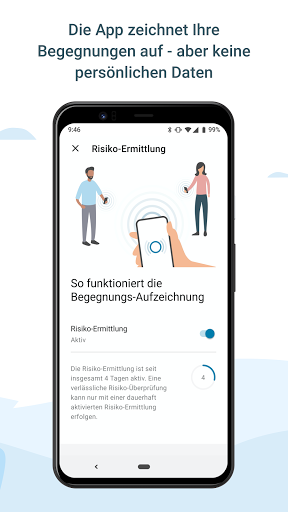
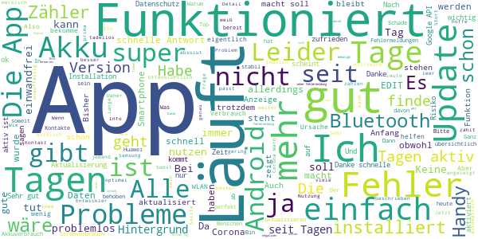
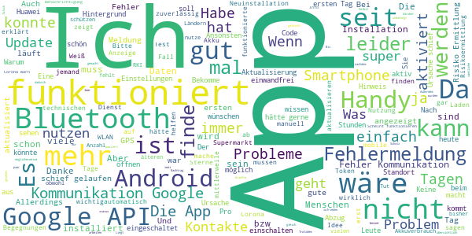
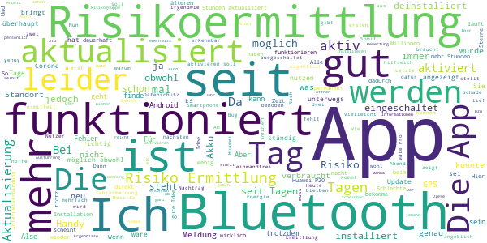
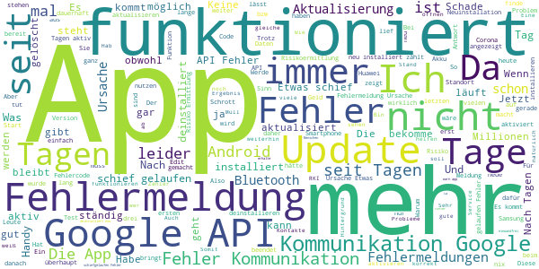

# Corona-Warn-App
App version ``1.0.4``

Analyzed with [covid-apps-observer](http://github.com/covid-apps-observer) project, version ``0.1``

## App overview
| | |
|-------------------------|-------------------------| 
| **Name**&nbsp;&nbsp;&nbsp;&nbsp;&nbsp;&nbsp;&nbsp;&nbsp;&nbsp;&nbsp;&nbsp;&nbsp;&nbsp;&nbsp;&nbsp;&nbsp;&nbsp;&nbsp;&nbsp;&nbsp;&nbsp;&nbsp;&nbsp;&nbsp;&nbsp;&nbsp;&nbsp;&nbsp;&nbsp;&nbsp;&nbsp;&nbsp;&nbsp;&nbsp;&nbsp;&nbsp;&nbsp;&nbsp;&nbsp;&nbsp;  | Corona-Warn-App |
| **Unique identifier** | de.rki.coronawarnapp |
| **Link to Google Play** | [https://play.google.com/store/apps/details?id=de.rki.coronawarnapp](https://play.google.com/store/apps/details?id=de.rki.coronawarnapp) |
| **Summary**  | Gemeinsam Corona bekämpfen |
| **Privacy policy** | [https://www.coronawarn.app/assets/documents/cwa-privacy-notice-de.pdf](https://www.coronawarn.app/assets/documents/cwa-privacy-notice-de.pdf) |
| **Latest version** | 1.0.4 |
| **Last update** | 2020-06-20 16:18:13 |
| **Recent changes** | Kleinere Verbesserungen |
| **Installs**  | 5.000.000+ |
| **Category** | Gesundheit & Fitness |
| **First release** | 12.06.2020 |
| **Size**  | 31M |
| **Supported Android version**  | 6.0 oder höher |

### Description
> Das Robert Koch-Institut (RKI) als zentrale Einrichtung des Bundes im Bereich der Öffentlichen Gesundheit und als nationales Public-Health-Institut veröffentlicht die Corona-Warn-App für die deutsche Bundesregierung und für die Bundesrepublik Deutschland. Die App fungiert als digitale Ergänzung zu Abstandhalten, Hygiene und Alltagsmaske. Wer sie nutzt, hilft, Infektionsketten schnell nachzuverfolgen und zu durchbrechen. Die App merkt sich dezentral unsere Begegnungen mit anderen und informiert uns digital, wenn wir Begegnungen mit nachweislich infizierten Personen hatten. Dabei sammelt sie jedoch zu keiner Zeit Informationen zur Identität ihrer Nutzerinnen und Nutzer. Wer wir sind und wo wir sind, bleibt geheim – und unsere Privatsphäre bestens geschützt.
 WIE DIE APP FUNKTIONIERT
 Sind wir unterwegs, sollte die Risiko-Ermittlung immer aktiviert sein. Denn sie ist das Herzstück der Software. Wann immer sich Nutzerinnen und Nutzer begegnen, tauschen ihre Smartphones über Bluetooth verschlüsselte Zufallscodes aus. 
 Diese geben nur Auskunft darüber, über welche Dauer und mit welchem Abstand eine Begegnung stattfand. Welche Person sich hinter einem Code verbirgt, ist für niemanden nachvollziehbar. Die Corona-Warn-App erhebt keine Informationen über den Ort der Begegnung oder den Standort der Nutzerinnen und Nutzer.
 Entsprechend der maximalen Corona-Inkubationszeit werden alle Zufallscodes, die unser Smartphone sammelt, für 14 Tage auf dem Smartphone gespeichert – und dann gelöscht. 
 Nur wenn eine Person sich über die App freiwillig als nachweislich infiziert meldet, erhalten daraufhin alle früheren Begegnungen eine Warnung auf ihr Smartphone. 
 Niemand erfährt, wann, wo oder mit wem eine entsprechende Risiko-Begegnung stattfand. Die infizierte Person bleibt anonym.
 Mit der Benachrichtigung erhalten die betroffenen Nutzer/-innen klare Handlungsempfehlungen. Wichtig: Auch die Daten der Benachrichtigten sind zu keiner Zeit einsehbar.
 WIE DIE DATEN SICHER BLEIBEN
 Die Corona-Warn-App soll uns zwar täglich begleiten. Sie wird uns jedoch nie kennenlernen. Dadurch kann sie niemandem verraten, wer wir sind. Der Datenschutz bleibt über die gesamte Nutzungsdauer zu 100 Prozent gewahrt.
 • Keine Anmeldung: Es müssen keine E-Mail-Adresse und kein Name hinterlegt werden.
 • Keine Rückschlüsse auf Identitäten: Bei einer Begegnung mit einem anderen Menschen tauschen die Smartphones nur Zufallscodes aus. Diese messen, über welche Dauer und mit welchem Abstand ein Kontakt stattfand. Sie lassen aber keine Rückschlüsse auf Personen und Standorte zu. 
 • Dezentrale Speicherung: Die Daten werden nur auf dem Smartphone gespeichert und nach 14 Tagen gelöscht.
 • Keine Einsicht für Dritte: Sowohl die Personen, die eine nachgewiesene Infektion melden, als auch die Benachrichtigten sind nicht nachverfolgbar – nicht für die Bundesregierung, nicht für das Robert Koch-Institut, nicht für andere User und auch nicht für die Betreiber der App-Stores.

### User interface
The developers of the app provide the following screenshots in the Google play store.
| | | |
|:-------------------------:|:-------------------------:|:-------------------------:|
 |   |   |   | 
 |   |   |   | 
 |   |  

## Development team
In the following we report the main information provided by the development team in the Google play store.

| | |
|-------------------------|-------------------------|
| **Developer**  | Robert Koch-Institut |
| **Website**  | [https://www.coronawarn.app](https://www.coronawarn.app) |
| **Email** | CoronaWarnApp@rki.de |
| **Physical address**  | [Robert Koch-Institut Nordufer 20 13353 Berlin](https://www.google.com/maps/search/Robert%20Koch-Institut%20Nordufer%2020%2013353%20Berlin) (Google Maps) |
| **Other developed apps**  | [https://play.google.com/store/apps/developer?id=Robert+Koch-Institut](https://play.google.com/store/apps/developer?id=Robert+Koch-Institut) |

## Android support

| | |
|-------------------------|-------------------------|
| **Declared target Android version**  | Android10, version 10 (API level 29) |
| **Effective target Android version**  | Android10, version 10 (API level 29) |
| **Minimum supported Android version**  | Marshmallow, version 6.0 (API level 23) |
| **Maximum target Android version**  | - |

The larger the difference between the minimum and maximum supported Android versions, the better. A larger difference means a wider audience. For example, old phones have a very low Android version, so a high minimum supported Android version means that the app cannot be used by users with old phones, thus leading to accessibility problems. 

## Requested permissions

In the following we report the complete list of the permissions requested by the app. 

| **Permission** | **Protection level** | **Description** | 
|-------------------------|-------------------------|-------------------------|
 **android.permission ACCESS_NETWORK_STATE** | Normal | Allows applications to access information about networks. 
 **android.permission BLUETOOTH** | Normal | Allows applications to connect to paired bluetooth devices. 
 **android.permission CAMERA** | :warning:**Dangerous** | Required to be able to access the camera device. 
 **android.permission FOREGROUND_SERVICE** | Normal | Allows a regular application to use Service.startForeground. 
 **android.permission INTERNET** | Normal | Allows applications to open network sockets. 
 **android.permission RECEIVE_BOOT_COMPLETED** | Normal | Allows an application to receive the Intent.ACTION_BOOT_COMPLETED that is broadcast after the system finishes booting. 
 **android.permission WAKE_LOCK** | Normal | Allows using PowerManager WakeLocks to keep processor from sleeping or screen from dimming. 

## Mentioned servers

| **Server** | **Registrant** | **Registrant country** | **Creation date** | 
|-------------------------|-------------------------|-------------------------|-------------------------|
 | google.com | Google LLC | :us: US | 1997-09-15 04:00:00 |
 | t-online.de | - | - | - |

## Security analysis 

Below we report the main security warnings raised by our execution of the [Androwarn](https://github.com/maaaaz/androwarn) security analysis tool.

**Connection interfaces exfiltration**
> - This application reads details about the currently active data network 
> - This application tries to find out if the currently active data network is metered 

**Telephony services abuse**
> - This application makes phone calls 

**Suspicious connection establishment**
> - This application opens a Socket and connects it to the remote address '; port is out of range' on the 'N/A' port  
> - This application opens a Socket and connects it to the remote address 'Lcom/android/tools/r8/GeneratedOutlineSupport;->outline19(Ljava/lang/String;)Ljava/lang/StringBuilder;' on the 'N/A' port  
> - This application opens a Socket and connects it to the remote address 'Ljava/net/Proxy;->type()Ljava/net/Proxy$Type;' on the 'N/A' port  
> - This application opens a Socket and connects it to the remote address 'Method sendUrgentData() is not supported.' on the 'N/A' port  
> - This application opens a Socket and connects it to the remote address 'Method setHandshakeTimeout() is not supported.' on the 'N/A' port  
> - This application opens a Socket and connects it to the remote address 'Method setOOBInline() is not supported.' on the 'N/A' port  
> - This application opens a Socket and connects it to the remote address 'Method setSoWriteTimeout() is not supported.' on the 'N/A' port  
> - This application opens a Socket and connects it to the remote address 'Socket closed' on the 'N/A' port  
> - This application opens a Socket and connects it to the remote address 'Socket is closed' on the 'N/A' port  
> - This application opens a Socket and connects it to the remote address 'Socket is closed.' on the 'N/A' port  
> - This application opens a Socket and connects it to the remote address 'Socket is not connected.' on the 'N/A' port  
> - This application opens a Socket and connects it to the remote address 'socket is closed' on the 'N/A' port  
> - This application opens a Socket and connects it to the remote address 'timeout' on the 'N/A' port  

**Code execution**
> - This application loads a native library 
> - This application loads a native library: 'conscrypt_gmscore_jni' 
> - This application loads a native library: 'conscrypt_jni' 

## User ratings and reviews

Below we provide information about how end users are reacting to the app in terms of ratings and reviews in the Google Play store.

### Ratings

The Corona-Warn-App app has been installed by more than **5000000** times. At this time, **41850** rated the app and its average score is **3.8755238**. Below we show the distribution of the ratings across the usual star-based rating of Google Play

:star::star::star::star::star:: 25891

:star::star::star::star:: 2908

:star::star::star:: 2661

:star::star:: 2723

:star:: 7664

### Reviews 

#### 5-star reviews

> Totaler Schwachsinn  :date: __2020-06-28 18:50:49__

> Top, es werden keine Daten gespeichert und es kann viel bewegen.  :date: __2020-06-28 18:49:43__

> Funktioniert wie sie soll.  :date: __2020-06-28 18:47:36__

> Verantwortung gegenüber seinen Mitmenschen tragen!  :date: __2020-06-28 18:41:47__

> Sollten alle mitmachen,finde dir App sehr wichtig  :date: __2020-06-28 18:40:11__

> Ich glaube, dass die App uns wirklich helfen kann, mal gucken!  :date: __2020-06-28 18:40:08__

> Wichtig! Auch für Aluhutträger.  :date: __2020-06-28 18:37:18__

> Läuft absolut reibungslos. Zumindest meldet mein Smartphone keinerlei Fehlermeldungen. Akkuverbrauch so gut wie nicht feststellbar. Alles wie immer. Dafür leiste ich gerne meinen Teil zur Eindämmung der Pandemie. Lob an die Entwickler.  :date: __2020-06-28 18:34:53__

> Funktioniert einwandfrei! Da ich ohnehin mein Handy meist mit dem Fitnessband oder Bluetoothkopfhörern verbunden habe, spüre ich keinen merkbaren unterschied der Akkulaifzeit, obwohl die App im Hintergrund ja ständig läuft.  :date: __2020-06-28 18:22:30__

> Einfach und unkompliziert.  :date: __2020-06-28 18:15:23__

#### 4-star reviews

> Es sollte auf die Stromspareinstellungen von Android hingewiesen werden, falls der Dienst im Hintergrund beendet werden kann. Außerdem ist es wichtig, sein Handy bei sich zu tragen.  :date: __2020-06-28 18:28:08__

> Habe einen Corona Test in einer Reha gemacht und war negativ, kann dies aber nicht in der App eingeben, hab auch nicht's schriftlich darüber, was kann ich machen ????  :date: __2020-06-28 17:38:44__

> Bekomme Fehlermeldung über die Kommunikation mit Google API (10). Liegt das möglicherweise an Android 6.0? Danke vorab für ihre Antwort.  :date: __2020-06-28 16:45:49__

> Die App sollte ein Kontaktprotokoll anzeigen, wann sie für wie lange andere Token gesehen hat. Die Token selbst müssen nicht unbedingt angezeigt werden. Interessant wäre auch zu wissen, ob ein Token die Schwelle überschritten hat, um bei der Risikoermittlung berücksichtigt zu werden oder werden immer alle bereücksichtigt?  :date: __2020-06-28 16:45:22__

> Mein Problem: Smartphone zeigt seit Stunden an : Wird installiert, passiert aber nichts. Weiß nicht, was ich falsch mache!  :date: __2020-06-28 16:36:44__

> Funktioniert sehr gut bis auf die Fehlermeldung Google API (10) die immer kommt  :date: __2020-06-28 16:33:09__

> Lief zwei Tage ohne Probleme. Ab dann ging gar nix mehr, ein Status war nicht mehr abrufbar. Selbst nachdem sämtliche Ernergiesparmodi abgestellt wurden. Auch Löschung der Daten und des Cache brachte keine Besserung. Wenn das die beste Corona Warn App sein soll, was soll dann wirklich schlecht sein? Ich werde es nach Neuinstallation und Erteilung diverser Berechtigungen nochmals versuchen. Nachtrag: nach erneuter Installation nun vier Tage im Einsatz, keine Einschränkungen mehr.  :date: __2020-06-28 15:28:59__

> Einfach und übersichtlich. Leider hab ich meinen Test versehentlich gelöscht. Wollte ich wieder per QRCode scannen, war aber nicht möglich. Meldung: Code/Tan bereits vergeben. Ich hätte den Test schon gern wieder in der App. Bitte um Hilfe, wie es geht.  :date: __2020-06-28 15:27:02__

> Funktioniert anscheinend ohne Probleme. Es wäre schön, wenn man angezeigt bekäme, wie viele Kontakte von der App aufgezeichnet wurden.  :date: __2020-06-28 15:26:15__

> Übersichtlich, einfach erklärt, es wird Bluetooth benötigt. Update: Nach 11 Tagen Benutzung kann ich sagen das Bluetooth angeschaltet bleiben muss, es also auch aktiviert werden sollte dadurch wird die Laufzeit meines Handys deutlich verkürzt, Akku geht schneller leer. Eine Rückmeldung push-up ob der Schutz noch da ist wenn ich z. B Bluetooth automatisch ausschaltet wäre besser. Trotzdem zufrieden und werde diese App weiter nutzen. Je mehr Leute desto besser.  :date: __2020-06-28 15:19:29__

#### 3-star reviews

> Die App sendet nach längerer Zeit ohne Geräte Neustart keine BLE Signale mehr und empfängt diese nur noch, die App zeigt dies jedoch nicht an sondern die Risikoermittlung wird weiterhin als aktiv gekennzeichnet. D.h. selbst bei allen erlaubten Rechten ist die Funktion eingeschränkt. Dies trat auf bei einem Huawei P20 nach dem Update auf Android 10! Ermittelt wurde dies mit dem BLE Mapper Ramble!  :date: __2020-06-28 18:03:38__

> Leider hat die App im Zusammenhang mit dauerhaft aktiviertem Bluetooth nach einem halben Tag mein Handy extrem warm werden lassen und den Akku stark entleert. Warte auf ein Update.  :date: __2020-06-28 17:40:37__

> Die App überhitzt mein Mate 9 extrem. Die App habe ich deinstalliert und kein Fehler. Also bitte den Fehler beheben. Es kann sein die app viele Handies beschädigen!!!!  :date: __2020-06-28 17:26:25__

> Eine App, in der man ungefragt mit "Du" angesprochen wird, ist für mich nicht akzeptabel - und mag die Aufgabe der App noch so sinnvoll sein.  :date: __2020-06-28 16:53:01__

> Toll, dass Apple GPS nicht braucht, Android aber schon. Und das zusätzlich zu Bluetooth dauerhaft. Da ist der Akku ja gefühlt sofort leer. App wird also nicht installiert, ohne Akku bringt die ja eh nix.  :date: __2020-06-28 16:34:04__

> Ich finde die Idee der Corona app super. Mit Technik gegen die Seuche, ein Vorteil für alle. Mich stört aber Googles Zwang sehr, GPS anschalten zu müssen. Damit macht Google die Nutzung kaputt. Shame on you, Google.  :date: __2020-06-28 16:33:48__

> Die Idee der App ist wohl gut, aber: Wenn jemand positiv getestet wird, wird er das auch in die App eintragen, ganz bestimmt nicht! Wer positiv getestet wurde, hat er dann nicht eh eine Ausgangssperre und hat im öffentlichen Leben nichts zu suchen? Also wie soll er dann jemanden warnen, wenn er in Quarantäne ist? Der richtige Weg währe, demjenigen einen Chip unter die Haut zu pflanzen der solange Signale an die Umgebung sendet, bis Tests wieder negativ sind. Ist nur meine Meinung. Deinstalliert!  :date: __2020-06-28 16:18:10__

> Loö  :date: __2020-06-28 15:59:54__

> Risikoermittlung funktioniert nicht. Irgendein Fehler mit Google api 10.  :date: __2020-06-28 15:42:57__

> Funktioniert nach 10 Tagen nicht mehr. Was ist "Ursache 3"? Keine für Laien verständliche Information. Dasselbe Problem tritt nicht nur bei mir auf. Auch Neuinstallation behob das Problem nicht. Und jetzt? Danke für Ihre Rückmeldung: Fehlercode 10 Danke und baldigen Erfolg  :date: __2020-06-28 15:37:17__

#### 2-star reviews

> Hatte die App noch am Tag des Erscheinens installiert und sie lief 1 Woche reibungslos... jetzt geht gar nichts mehr. Mehrfach de- und neuinstalliert, kein Erfolg. Ursache 3, Fehler bei Kommunikation mit Google API(10). Wann läuft die App auf Huawei- Handys?  :date: __2020-06-28 18:01:43__

> Seit Tagen ist eine Fehlermeldung vorhanden welche die Funktion behindert!  :date: __2020-06-28 18:01:16__

> Mit 20 Mio zu teuer und warum wird mir nicht angezeigt mit wieviel anderen Appinstallationen ich schon Kontakt hatte. Erst dann würde ich mich überzeugt fühlen. Aber müsste sowas nicht auch ausgeschrieben werden? Oder irre ich mich wegen Pandemieregeln?  :date: __2020-06-28 17:52:46__

> Die User-Erahrung lässt zu wünschen übrig. Beispielsweise wäre eine direkt zugängliche Statistik über die aufgezeichneten Begegnungen mit anderen Teilnehmer hilfreich, um zu zeigen, dass sie richtig arbeitet. Darüber hinaus ist das Rechtemanagement intransparent. Deaktivieren ich die Ortungsdienste, wird dauerhaft ein Hinweis angezeigt, dass ich dieses wieder aktivieren muss, wenn ich die Benachrichtigungsfunktion nutzen will. Der Zusammenhang scheint bekannt und in Kauf genommen; seltsam.  :date: __2020-06-28 17:49:38__

> Schon Mist, habs mir schon gedacht, üppige App an MB und kein native 2 SD. ICH HABE EIN ALTES GALAXY S5 UND KEINE LUST DIE ANDEREN APPS ZU DEINSTALLIEREN NUR DAMIT ICH DIESE APP NUTZEN KANN TUT MIR LEID. NATIVE APP 2 SD IST ZWINGEND ERFORDERLICH! 15MB IST NATÜRLICH AUCH EIN WEG... BIN JA MAL GESPANNT. WANN IST DAS NÄCHSTE UPDATE GEPLANT? UND DANKE FÜR DIE ERKLÄRUNG.  :date: __2020-06-28 17:35:45__

> Nach 8 Tagen braucht man eine Genehmigung für Android! Sobald alles normal funktioniert gibt es mehr sterne!  :date: __2020-06-28 16:00:07__

> Bleibt ständig stehen, trotz deaktivierten Energieeinstellungen. "4 von 14 Tagen aktiv". So ists nichtmal ne halbe Sache.  :date: __2020-06-28 15:57:46__

> Ich habe die ganze Zeit ein "Fehler mit der Google API" weswegen ich die app nicht nutzen kann und ich habe eigentlich die aktuellste Android Version auf meinem Samsung S9 Edit: Danke für die Antwort aber ich habe alle Möglichkeiten im faq gecheckt und eigentlich sollte alles passen aber trotzdem geht es nicht Zu Edit4: Es steht da "Ursache: 3" und am ende der Nachricht hinter dem faq link steht "(17)"  :date: __2020-06-28 15:28:48__

> Schön und gut...aber ich habe nur gesehen, dass Bluetooth die ganze Zeit dafür an sein muss ?!😂 Dann kann ich ja direkt eine 30.000 mAh Powerbank mit mir rumschleppen...Ansich gute Idee...aber dauerhaft Bluetooth an? Nein danke.  :date: __2020-06-28 14:44:49__

> Glaub nicht das diese app funktioniert. Habe die App seit einiger Zeit installiert sowie auch einige Kollegen und meine Famiele. Es wurde aber in den Aufzeichnungen und Anzahl der Schlüssel und Anzahl der Treffer noch kein einziger Schlüssel registriert, obwohl ich lange und nahe in Kontakt war.  :date: __2020-06-28 14:35:07__

#### 1-star reviews

> nach Deinstallation/Neuinstallation läuft die App auf einen API Fehler. Samsung Android.  :date: __2020-06-28 18:51:19__

> Ich habe die App nun zum dritten Mal de- und wieder neu installiert, weil sie sich nicht öffnen lässt. Vielleicht klappt es ja diesmal...  :date: __2020-06-28 18:40:26__

> Was soll diese app bringen wenn ich corona ab geh ich in quarantäne und die app kann daran nichts ändern diese app ist so sinnlos wie ein auto ohne sprit  :date: __2020-06-28 18:39:52__

> Blockiert die Verbindung zu anderen Bluetooth Geräten. Viel gerede für eine teure App. Dazu unbrauchbar, da viel zu wenig mitgemacht wird. Das Geld sollte besser investiert werden und dem RKI abgezogen werden!  :date: __2020-06-28 18:39:41__

> Ich würde mindestens einen täglichen Bericht erwarten, wieviele und welcher Art Kontakte erfasst wurden: welcher Abstand, welche Zeitdauer? Solange die App nur geheimnisvoll im Hintergrund arbeitet und ich keine Informationen über die Aktivitäten bekomme, traue ich der App überhaupt nicht; gibt es das was zu verbergen, das ich nicht wissen soll? So geheimnisvoll und intransparent bzgl. der durchgeführten Aktionen wie sie jetzt ist, will ich die App nicht auf meinem Smartphone!  :date: __2020-06-28 18:25:47__

> Da die App immer wieder nach der Berechtigung Standortdienst (GPS) fragt, obwohl es nicht notwendig ist, habe ich die App wieder gelöscht. Ein Verweis auf die FAQ reicht nicht, weil trotzdem das Warnsymbol auf Standortdienst an ist. Wenn die App nur Bluetooth benötigt, soll die App oder Google nicht mit Standort (Gps) nerven. Wenn das behoben ist, installiere ich die App gern wieder.  :date: __2020-06-28 18:21:16__

> Wie kann es ein, daß in der enrgieverwaltung angezeigt wird, dass die App GPS nutzt. Jedoch niemals auf Bluetooth zugegriffen hat? Und nein es liegt nicht an BLE. Andere Apps welche BLE nutzen zeigen es auch an.  :date: __2020-06-28 18:20:03__

> Wie kann es denn sein dass sich die Risiko Ermittlung ohne Warnung selbstständig ausschaltet?  :date: __2020-06-28 18:18:00__

> Die App ist ordnungsgemäß Installiert doch funktioniert nicht. Als Fehlermeldung bekomme ich :Leider fehlen ihrem Smartphone die Benachrichtigungen zu möglicher Begegnung mit Covid-19 infizierten. Ziemlich schade, dass diese App nicht bei jedem Handy funktioniert ( habe ein Huawei P8 lite 2017)  :date: __2020-06-28 18:16:00__

> Gleich beim Start eine Fehlermeldung. Das schafft kein Vertrauen...  :date: __2020-06-28 18:00:15__

