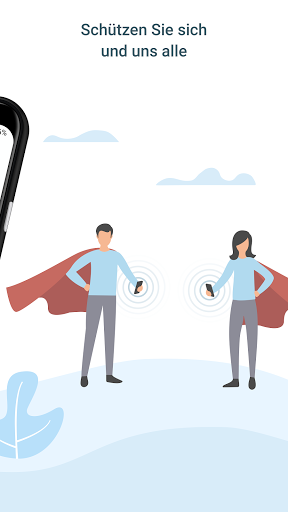
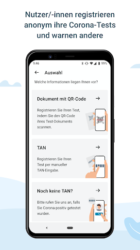
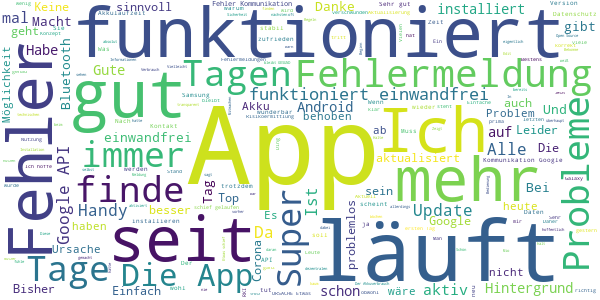
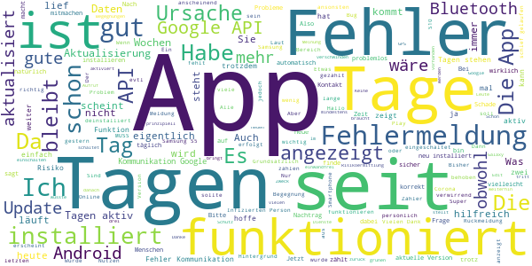
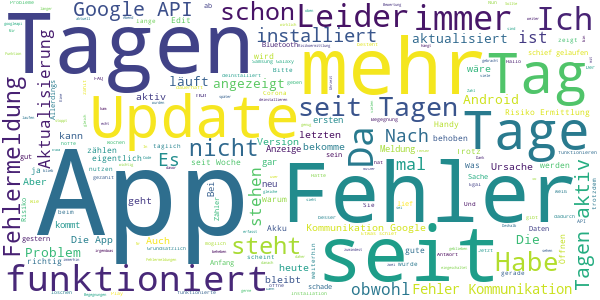
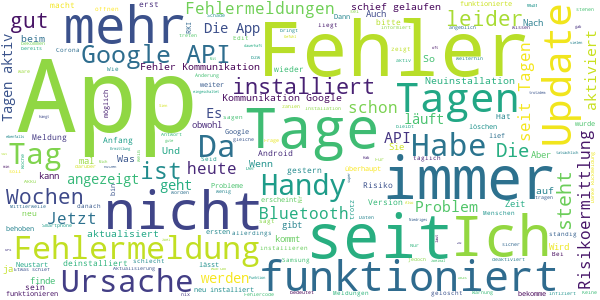

# Corona-Warn-App
App version ``1.0.5``

Analyzed with [covid-apps-observer](http://github.com/covid-apps-observer) project, version ``0.1``

## App overview
| | |
|-------------------------|-------------------------| 
| **Name**&nbsp;&nbsp;&nbsp;&nbsp;&nbsp;&nbsp;&nbsp;&nbsp;&nbsp;&nbsp;&nbsp;&nbsp;&nbsp;&nbsp;&nbsp;&nbsp;&nbsp;&nbsp;&nbsp;&nbsp;&nbsp;&nbsp;&nbsp;&nbsp;&nbsp;&nbsp;&nbsp;&nbsp;&nbsp;&nbsp;&nbsp;&nbsp;&nbsp;&nbsp;&nbsp;&nbsp;&nbsp;&nbsp;&nbsp;&nbsp;  | Corona-Warn-App |
| **Unique identifier** | de.rki.coronawarnapp |
| **Link to Google Play** | [https://play.google.com/store/apps/details?id=de.rki.coronawarnapp](https://play.google.com/store/apps/details?id=de.rki.coronawarnapp) |
| **Summary**  | Gemeinsam Corona bekämpfen |
| **Privacy policy** | [https://www.coronawarn.app/assets/documents/cwa-privacy-notice-de.pdf](https://www.coronawarn.app/assets/documents/cwa-privacy-notice-de.pdf) |
| **Latest version** | 1.0.5 |
| **Last update** | 2020-07-07 20:43:26 |
| **Recent changes** | Kleinere Verbesserungen |
| **Installs**  | 5.000.000+ |
| **Category** | Gesundheit & Fitness |
| **First release** | 12.06.2020 |
| **Size**  | 31M |
| **Supported Android version**  | 6.0 oder höher |

### Description
> Das Robert Koch-Institut (RKI) als zentrale Einrichtung des Bundes im Bereich der Öffentlichen Gesundheit und als nationales Public-Health-Institut veröffentlicht die Corona-Warn-App für die deutsche Bundesregierung und für die Bundesrepublik Deutschland. Die App fungiert als digitale Ergänzung zu Abstandhalten, Hygiene und Alltagsmaske. Wer sie nutzt, hilft, Infektionsketten schnell nachzuverfolgen und zu durchbrechen. Die App merkt sich dezentral unsere Begegnungen mit anderen und informiert uns digital, wenn wir Begegnungen mit nachweislich infizierten Personen hatten. Dabei sammelt sie jedoch zu keiner Zeit Informationen zur Identität ihrer Nutzerinnen und Nutzer. Wer wir sind und wo wir sind, bleibt geheim – und unsere Privatsphäre bestens geschützt.
 WIE DIE APP FUNKTIONIERT
 Sind wir unterwegs, sollte die Risiko-Ermittlung immer aktiviert sein. Denn sie ist das Herzstück der Software. Wann immer sich Nutzerinnen und Nutzer begegnen, tauschen ihre Smartphones über Bluetooth verschlüsselte Zufallscodes aus. 
 Diese geben nur Auskunft darüber, über welche Dauer und mit welchem Abstand eine Begegnung stattfand. Welche Person sich hinter einem Code verbirgt, ist für niemanden nachvollziehbar. Die Corona-Warn-App erhebt keine Informationen über den Ort der Begegnung oder den Standort der Nutzerinnen und Nutzer.
 Entsprechend der maximalen Corona-Inkubationszeit werden alle Zufallscodes, die unser Smartphone sammelt, für 14 Tage auf dem Smartphone gespeichert – und dann gelöscht. 
 Nur wenn eine Person sich über die App freiwillig als nachweislich infiziert meldet, erhalten daraufhin alle früheren Begegnungen eine Warnung auf ihr Smartphone. 
 Niemand erfährt, wann, wo oder mit wem eine entsprechende Risiko-Begegnung stattfand. Die infizierte Person bleibt anonym.
 Mit der Benachrichtigung erhalten die betroffenen Nutzer/-innen klare Handlungsempfehlungen. Wichtig: Auch die Daten der Benachrichtigten sind zu keiner Zeit einsehbar.
 WIE DIE DATEN SICHER BLEIBEN
 Die Corona-Warn-App soll uns zwar täglich begleiten. Sie wird uns jedoch nie kennenlernen. Dadurch kann sie niemandem verraten, wer wir sind. Der Datenschutz bleibt über die gesamte Nutzungsdauer zu 100 Prozent gewahrt.
 • Keine Anmeldung: Es müssen keine E-Mail-Adresse und kein Name hinterlegt werden.
 • Keine Rückschlüsse auf Identitäten: Bei einer Begegnung mit einem anderen Menschen tauschen die Smartphones nur Zufallscodes aus. Diese messen, über welche Dauer und mit welchem Abstand ein Kontakt stattfand. Sie lassen aber keine Rückschlüsse auf Personen und Standorte zu. 
 • Dezentrale Speicherung: Die Daten werden nur auf dem Smartphone gespeichert und nach 14 Tagen gelöscht.
 • Keine Einsicht für Dritte: Sowohl die Personen, die eine nachgewiesene Infektion melden, als auch die Benachrichtigten sind nicht nachverfolgbar – nicht für die Bundesregierung, nicht für das Robert Koch-Institut, nicht für andere User und auch nicht für die Betreiber der App-Stores.
 Diese App ist nicht zum Gebrauch außerhalb Deutschlands bestimmt. Die Corona-Warn-App ist die zentrale COVID-19 App für Deutschland und sie ist an das deutsche Gesundheitssystem angeschlossen. Trotzdem ist die Corona-Warn-App auch in diesem Land verfügbar. Sie ist gedacht für alle, die in Deutschland leben, arbeiten, Urlaub machen oder sich regelmäßig oder über längere Zeit in Deutschland aufhalten.

### User interface
The developers of the app provide the following screenshots in the Google play store.
| | | |
|:-------------------------:|:-------------------------:|:-------------------------:|
 |   |   |   | 
 |   |   |   | 
 |   |  

## Development team
In the following we report the main information provided by the development team in the Google play store.

| | |
|-------------------------|-------------------------|
| **Developer**  | Robert Koch-Institut |
| **Website**  | [https://www.coronawarn.app](https://www.coronawarn.app) |
| **Email** | CoronaWarnApp@rki.de |
| **Physical address**  | [Robert Koch-Institut Nordufer 20 13353 Berlin](https://www.google.com/maps/search/Robert%20Koch-Institut%20Nordufer%2020%2013353%20Berlin) (Google Maps) |
| **Other developed apps**  | [https://play.google.com/store/apps/developer?id=Robert+Koch-Institut](https://play.google.com/store/apps/developer?id=Robert+Koch-Institut) |

## Android support

| | |
|-------------------------|-------------------------|
| **Declared target Android version**  | Android10, version 10 (API level 29) |
| **Effective target Android version**  | Android10, version 10 (API level 29) |
| **Minimum supported Android version**  | Marshmallow, version 6.0 (API level 23) |
| **Maximum target Android version**  | - |

The larger the difference between the minimum and maximum supported Android versions, the better. A larger difference means a wider audience. For example, old phones have a very low Android version, so a high minimum supported Android version means that the app cannot be used by users with old phones, thus leading to accessibility problems. 

## Requested permissions

In the following we report the complete list of the permissions requested by the app. 

| **Permission** | **Protection level** | **Description** | 
|-------------------------|-------------------------|-------------------------|
 **android.permission ACCESS_NETWORK_STATE** | Normal | Allows applications to access information about networks. 
 **android.permission BLUETOOTH** | Normal | Allows applications to connect to paired bluetooth devices. 
 **android.permission CAMERA** | :warning:**Dangerous** | Required to be able to access the camera device. 
 **android.permission FOREGROUND_SERVICE** | Normal | Allows a regular application to use Service.startForeground. 
 **android.permission INTERNET** | Normal | Allows applications to open network sockets. 
 **android.permission RECEIVE_BOOT_COMPLETED** | Normal | Allows an application to receive the Intent.ACTION_BOOT_COMPLETED that is broadcast after the system finishes booting. 
 **android.permission WAKE_LOCK** | Normal | Allows using PowerManager WakeLocks to keep processor from sleeping or screen from dimming. 

## Mentioned servers

| **Server** | **Registrant** | **Registrant country** | **Creation date** | 
|-------------------------|-------------------------|-------------------------|-------------------------|
 | google.com | Google LLC | :us: US | 1997-09-15 04:00:00 |
 | t-online.de | - | - | - |

## Security analysis 

Below we report the main security warnings raised by our execution of the [Androwarn](https://github.com/maaaaz/androwarn) security analysis tool.

**Connection interfaces exfiltration**
> - This application reads details about the currently active data network 
> - This application tries to find out if the currently active data network is metered 

**Telephony services abuse**
> - This application makes phone calls 

**Suspicious connection establishment**
> - This application opens a Socket and connects it to the remote address '; port is out of range' on the 'N/A' port  
> - This application opens a Socket and connects it to the remote address 'Lcom/android/tools/r8/GeneratedOutlineSupport;->outline19(Ljava/lang/String;)Ljava/lang/StringBuilder;' on the 'N/A' port  
> - This application opens a Socket and connects it to the remote address 'Ljava/net/Proxy;->type()Ljava/net/Proxy$Type;' on the 'N/A' port  
> - This application opens a Socket and connects it to the remote address 'Method sendUrgentData() is not supported.' on the 'N/A' port  
> - This application opens a Socket and connects it to the remote address 'Method setHandshakeTimeout() is not supported.' on the 'N/A' port  
> - This application opens a Socket and connects it to the remote address 'Method setOOBInline() is not supported.' on the 'N/A' port  
> - This application opens a Socket and connects it to the remote address 'Method setSoWriteTimeout() is not supported.' on the 'N/A' port  
> - This application opens a Socket and connects it to the remote address 'Socket closed' on the 'N/A' port  
> - This application opens a Socket and connects it to the remote address 'Socket is closed' on the 'N/A' port  
> - This application opens a Socket and connects it to the remote address 'Socket is closed.' on the 'N/A' port  
> - This application opens a Socket and connects it to the remote address 'Socket is not connected.' on the 'N/A' port  
> - This application opens a Socket and connects it to the remote address 'socket is closed' on the 'N/A' port  
> - This application opens a Socket and connects it to the remote address 'timeout' on the 'N/A' port  

**Code execution**
> - This application loads a native library 
> - This application loads a native library: 'conscrypt_gmscore_jni' 
> - This application loads a native library: 'conscrypt_jni' 

## User ratings and reviews

Below we provide information about how end users are reacting to the app in terms of ratings and reviews in the Google Play store.

### Ratings

The Corona-Warn-App app has been installed by more than **5000000** times. At this time, **60462** rated the app and its average score is **3.4688234**. Below we show the distribution of the ratings across the usual star-based rating of Google Play

:star::star::star::star::star:: 28021

:star::star::star::star:: 6171

:star::star::star:: 6708

:star::star:: 5249

:star:: 14309

### Reviews 

#### 5-star reviews

> Mal im Ernst, wer heute noch Android 6 nutzt hat sicher auch noch Windows 98 auf seinem Computer laufen. Die App läuft ohne Probleme seit Anbeginn der Installation (Android 9). Selber noch keine Warnung hinsichtlich eines Kontaktes bekommen, bin aber auch eher ein vorsichtiger Mensch. Ich finde gut, dass diese App entwickelt wurde und dazu beiträgt den Virus einzudämmen.  :date: __2020-07-10 14:42:08__

> Wichtig  :date: __2020-07-10 14:19:06__

> Bin sogar schon gewarnt worden. Bzw. Es gab eine Risiko-Begegnung. Wenn viele die App haben und im Fall des Falls ihre Infektionen melden dann läuft es  :date: __2020-07-10 14:18:29__

> Läuft ohne Probleme....  :date: __2020-07-10 14:11:15__

> sollten alle nutzen  :date: __2020-07-10 14:00:31__

> Gut  :date: __2020-07-10 13:49:05__

> Die App finde ich sehr gut. Einfach zu bedienen. Ich empfehle sie jedem! Sehr wichtig für alle!  :date: __2020-07-10 13:46:28__

> Der Akku leidet spürbar. Aber es ist wichtig, dass man die App nutzt  :date: __2020-07-10 12:57:09__

> Also seit Wochen keinerlei Probleme. Frisst auch nicht übermäßig den Akku leer, wie oft behauptet wird. Schalte Bluetooth aus wenn ich daheim bin. An der Wohnungstür hängt ein Zettelchen mit dem Bluetooth-Symbol das mich ans Einschlten erinnert. Gute App die problemlos funktioniert..  :date: __2020-07-10 12:56:21__

> Funktioniert super  :date: __2020-07-10 12:37:06__

#### 4-star reviews

> Die App ist super, aber bei mir und meinen Familienmitgliedern hängt das irgendwie? Tag 13 von 14 steht da schon seit ein paar Tagen bei mir dran. Gleiches Problem haben meine Angehörigen auch. Das verunsichert irgendwie. Ansonsten finde ich die App echt gut, sie saugt kaum Akku.  :date: __2020-07-10 14:13:45__

> Eigentlich eine gute Idee. Nach ca. 3 Wochen meldete die App heute "Fehler: Ursache 3 ..." und ich konnte die Risikoermittlung nicht mehr aktualisieren... Update: die Antwort von den Entwicklern kam sehr schnell. Die App scheint zu funktionieren und die Anzeige wird zumindest sporadisch aktualisiert. Daher jetzt 4 Sterne.  :date: __2020-07-10 13:31:46__

> Die App wird ihren Zweck erfüllen. Es ist aber unklar, warum die App auch nach fast 4 Wochen Nutzung immer noch anzeigt, dass die App erst 14 von 14 Tagen in Nutzung ist. Damit lässt sich nicht nachvollziehen, ob die Daten auch wirklich nach 14 Tagen wieder von meinem Handy verschwunden sind. Bitte nachbessern oder erklären.  :date: __2020-07-10 13:19:29__

> Aktuell keine Fehlermeldung bekommen  :date: __2020-07-10 12:43:26__

> Die App funktioniert einwandfrei, bis auf der Tatsache, dass sie sich manchmal beim öffnen aufhängt Leider zeigt die App keine weiteren Fehler an! Neustart hat leider auch nichts gebracht, der Fehler tritt in der Github Testversion nicht auf. Bei der neusten verfügbaren Version ist es "besser" geworden, denn sie Startet jetzt zu ca. 50% korrekt, beiden anderen 50% muss man sie erneut starten.  :date: __2020-07-10 12:37:46__

> Cool  :date: __2020-07-10 11:43:20__

> So ist es ja ganz gut aber stehe schon fast seit ner Woche auf 13 Tagen  :date: __2020-07-10 10:51:55__

> Prinzipiell läuft die App problemlos im Hintergrund und erfüllt vermutlich ihren Zweck. Ob das tatsächlich so ist, sieht man wohl erst, wenn mal ein Kontakt positiv ist, und man ein Feedback erhält. Ich fände es sehr aufschlussreich, wenn man eine persönliche Statistik auslesen könnte: Sie hatten heute x angemeldete Kontakte. Vielleicht mit einer Empfehlung, meiden sie größere Menschenmengen. Oder ich sitze mit Arbeitskollegen in einer Besprechung, 8 Leute, aber nur 1 Appkontakt...  :date: __2020-07-10 10:28:14__

> Die App scheint zu funktionieren. Allerdings steht sie seit über 1 Woche auf 14/14 Tagen aktiv auf meinem Android Handy. Ich halte die App für gelungen.  :date: __2020-07-10 10:12:50__

> Mein Eindruck. App zählt nicht mehr. In der Zeitung las ich das das Problem bekannt sein soll und ein Update geplant sei. Bisher keins erhalten. Ist dem so? 😷 Die Zählung ist für mich nicht mehr sichtbar. Seit Tagen steht dort 14 von 14. Ist das so korrekt? 😤  :date: __2020-07-10 09:04:28__

#### 3-star reviews

> Nach 6 Tagen einwandfreiem Betrieb jetzt nur noch Anzeige:Fehler 3. Habe gegoogelt und alle Lösungsvorschläge probiert ohne Erfolg API 10  :date: __2020-07-10 14:44:57__

> Anfangs super! Allerdings erhalte ich inzwischen den Fehlerhinweis Ursache:3, und dies seit 3.7.. Wieso läuft es bei anderen seit heute wieder? Was ist zu tun? 39508  :date: __2020-07-10 14:33:30__

> Ist das Absicht, dass man vom eigenen Risikostatus keinen Screenshot machen kann (komplett schwarzes Bild)? Akku-Verbrauch geling.  :date: __2020-07-10 14:29:41__

> Schöne Ided, aber musste die App deinstalieren und wieder neu runterladen, da sie nach 14 Tagen nicht weiter lief. Nach der Neuinstalation zählt sie wieder von vorne und die Daten vom vorherigen Download scheinen weg zu sein. Ausserdem wäre es gerade im Sommer gut, wenn die App auch auf der S.artWatch laufen wūrde,da ich mangels Taschen an lrichter Sommerbkleidung oft ohne Handy, aber mit Smart Watch unterwegs bin.  :date: __2020-07-10 14:26:43__

> Hallo, ich benutze ein Cat S60, Androidversion 6.0.1, Baseband Version 0.038.00, Build Nummer LTE_D0201121.0_S60_0.038.00 Bekomme seit dem letzten Update die Fehlermeldung: Ursache: 3 Fehler bei der Kommunikation mit der Google API (39508) Bis zum Update, welches gestern Abend (09.07.2020) durchgeführt wurde, funktionierte die App ohne Probleme!  :date: __2020-07-10 13:59:22__

> Vielen Dank für Ihre Antwort! Die App lässt sich gar nicht mehr öffnen. Ich bekomme keine Fehlermeldung mehr. Sie öffnet nicht richtig, es sieht kurz aus, als ob sie startet, dann bricht sie ab und schließt sich. Nach einem Neustart besteht das Problem weiter. Zuvor gan es den bekannten Anroid 6.0 API Fehler. Was kann das Bedeuten ?MfG! Mit vielem Dank und vielen Grüßen!  :date: __2020-07-10 13:10:29__

> Seit dem letzten Update hängt die Anzeige auf 13 von 14 Tagen. Davor war es immer 14 von 14 Tagen  :date: __2020-07-10 13:04:47__

> 20200629 - edit: [...] Du hast mehrere Benutzerkonten auf Deinem Gerät, und die App wird für einen nicht-primären User (ohne Administrationsrechte) ausgeführt. [...] 20200630 - edit: Dauerhaft nicht, das Gerät läuft i. d. R. nur unter einem Sekundäruser (policy decision). 20200710 - edit: Die App läuft nun als owner. Allerdings ist nicht sichergestellt, dass sie damit auch im Normalbetrieb dauerhaft aktiv ist. Alerts kommen beim User so selbstverständlich nicht an.  :date: __2020-07-10 12:08:08__

> Etwas mehr Transparenz wäre schön. Was sind denn "kleinere Verbesserungen"? Außerdem würde ich es begrüßen, wenn ich sehen kann, wie viele Kennungen die Applikation aktuell gespeichert hat. Wir haben in der Verwandtschaft einen Risikopatienten und legen bei Besuchen extra die Telefone nebeneinander, damit das im Notfall zählt. Aber ich würde schon gerne sehen können, wenn die Applikation das registriert hat.  :date: __2020-07-10 11:59:56__

> Funktion nicht so wirkĺich  :date: __2020-07-10 11:16:22__

#### 2-star reviews

> Risikobewertung hat am Anfang nicht funktioniert. -> Energiespareinstellungen der App verändert, danach Ok. App aktualisiert sich nicht selbst -> Autostart-Einstellungen der App geändert, danach Ok. Jetzt Fehler 39508 -> Warten auf Google-API/App-Update. App hat max. Beta-Stadium. Enttäuschend.  :date: __2020-07-10 14:19:14__

> Prinzipiell finde ich die App gut. Leider kommt bei mir trotz dreimaliger Neuinstallation immer die Meldung: Etwas ist schief gelaufen. Fehler bei Kommunikation mit Google API (10)  :date: __2020-07-10 14:15:35__

> Auch ich bekomme trotz gestrigem Update weiterhin die Fehlermeldung „URSACHE: 3 Etwas ist schief gelaufen. Fehler bei Kommunikation mit Google API (10)“. Und zwar sowohl auf meinem Huawei P8 Lite mit Android 6.0 als auch auf einem Samsung Galaxy S5 neo mit Android 6.0.1. Und frage mich dabei, warum in vergleichbaren Rezensionen meist als Antwort steht, dass die Kontakte trotzdem aufgezeichnet werden....  :date: __2020-07-10 13:50:56__

> Die App hatte anfangs problemlos funktioniert, nun bekomme ich ständig Fehlermeldungen. Das gestrige Update konnte die Fehler leider auch nicht korrigieren. Ursache 3 Es ist etwas schiefgelaufen. Fehler bei der Kommunikation mit Google API (10)  :date: __2020-07-10 13:42:44__

> Idee der App und Ansatz ist gut. Der einzige Mangel ist der Zähler. Der steht schon eine Weile bei 14 Tagen.. Noch interessanter wäre die App natürlich wenn diese zusätzlich mit einer Karte arbeiten würde wie katwarn wo man in einem Gebiet sieht wieviel Infizierte da aktiv sind Bsp. Stadtteil Silberhöhe von Halle Saale oder Stadt Eisleben also Umkreis 5 - 10 km... Mit man weiß wie vorsichtig man sein sollte 👍  :date: __2020-07-10 13:30:54__

> Am Anfang echt ok aber dann bleibt es bei Tag 14 stehen und seit kurzem geht gar nix mehr. Und dafür hat man so viele Millionen Euro investiert.  :date: __2020-07-10 13:22:47__

> Hatte App gleich installiert. Sie lief die ersten 10 Tage auch einwandfrei. Dann tauchte die Fehlermeldung API (39508) durchgehend auf. Auch Neuinstallation half nicht. Seit dem 1.7. ist jetzt keine Aktualisierung mehr erfolgt. Seit gestern wird jetzt die Fehlermeldung API (10) angezeigt. P.S. Auch der update vom 10.7. hat nicht geholfen  :date: __2020-07-10 13:06:58__

> Seit dem 1.Juli funktioniert meine App nicht mehr. Der Grund ist ein Kommunikation Problem mit Google, so die Information beim Öffnen der App. Ich überlege, die Corona-Warn-App wieder zu entfernen, da das Problem scheinbar nicht behoben wird. Nachdem die App zwei Tage wieder funktionierte, ist nun wieder seit Tagen der Fehler "3" bei Google aufgetaucht und ich bekomme keine aktuellen Rückmeldungen der Corona App. Immer nur die Fehlermeldung.  :date: __2020-07-10 13:06:43__

> Fehler api10 leider auch nach Neuinstallation, Update, usw. Ich finde die App prinzipiell gut, schütze gerne andere, motiviere andere zum Mitmachen... aber so bringt das nix. Keine tägliche Aktualisierung möglich...seit dem 3. Tag. Habe sie sofort zu Beginn inst. Wie kann die Entwicklung so viel kosten, intelligente Entwickler, Programmierer einbeziehen...und dann kommt es nicht zum Ziel. Wie ein Fußballspiel ohne Tor. Schade...ich hoffe es wird noch besser... Aktuell höchstens 2 Sterne...  :date: __2020-07-10 13:05:57__

> Die App zeigt seit 7 Tagen, Tag 13 von 14 ???? Hier ist Optimierung erforderlich  :date: __2020-07-10 13:00:43__

#### 1-star reviews

> Sehr schlecht! Folgende Fehlermeldung: Ursache 3 Etwas ist schief gelaufen Fehler bei der Kommunikation mit Google API (10) Risiko-Ermittlung nicht möglich Risiko-Ermittlung konnte seit mehr als 24 Std. nicht mehr aktualisiert werden. Diese Meldung habe ich seit 1. Juli. 20.07.2020 Bereits zum 2. Mal konnte die App mehrere Tage lang nicht aktualisiert werden. Wieder mit der oben beschriebenen Fehlermeldung. Auf diese Weise erreicht mich keine Warnung über einen Kontakt mit einem Infizierten.  :date: __2020-07-10 14:40:34__

> Seit der Aktualisierung Fehler 3. Kein Statusbericht mehr. Fehlermeldung: google api 39508 10.7.2020 Nachdem die Fehlermeldung immer noch auftritt macht das Ganze für mich keinen Sinn mehr. Werde die App löschen - ausser sie können mich noch vom Gegenteil überzeugen.  :date: __2020-07-10 14:32:59__

> Corona App funktioniert nicht schon seit Wochen. Es gibt jedes mal eine Fehlermeldung.Ursache3.Fehler bei Kommunikation mit Google API(10)  :date: __2020-07-10 14:32:46__

> Leider immer Google API Fehler. Totaler Schrott!!!  :date: __2020-07-10 14:28:35__

> Der Fehler API 39508 taucht immer wieder auf wird er nicht bald behoben dann ist die Apple unbrauchbar  :date: __2020-07-10 14:26:40__

> Lässt sich nicht richtig öffnen  :date: __2020-07-10 14:18:37__

> Bei mir leider auch seit 2 Wochen die Fehlermeldung API(10) und API(39508). Dieser Fehler ist offensichtlich seit längerem bekannt und immer noch keine Lösung! Das finde ich ziemlich schlapp bei einem so wichtigen Tool. Die Schuld bzw. Zuständigkeit an diesem Desaster Google zuzuweisen lenkt m.E. unzulässiger Weise von der Tatsache unzureichender Tests vor der Veröffentlichung der App ab. Die nachstehende Antwort hatte ich schon zig-mal gelesen. Wann kommen Ergebnisse?!  :date: __2020-07-10 14:11:30__

> Die App funktionierte ca. 1 Woche. seit dem erhalte ich die Meldung "Ursache 3", Fehler bei Kommunikation mit der Google API (39508) Tipps wie CACHE löschen haben nichts geholfen. Selbst nach einer Neuinstallation kommt immer der selbe Fehler.  :date: __2020-07-10 14:07:18__

> Ständig Fehlermeldungen  :date: __2020-07-10 14:07:01__

> Permanent Probleme. Kryptische Fehlermeldung "Ursache 3... Fehler bei Kommunikation mit Google API (39508). Was soll das mir als Nutzer sagen? Funktioniert die App oder nicht? Probleme bleibt nach Neuinstallation bestehen.  :date: __2020-07-10 14:03:04__

