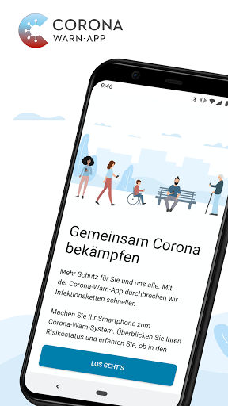
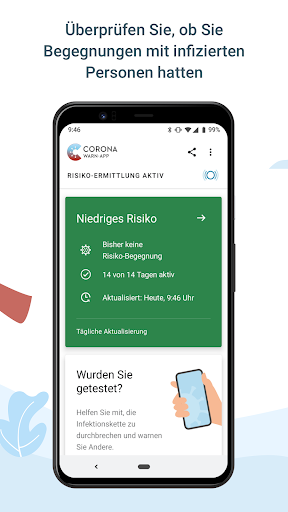
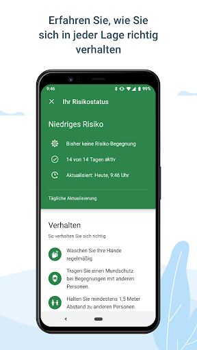
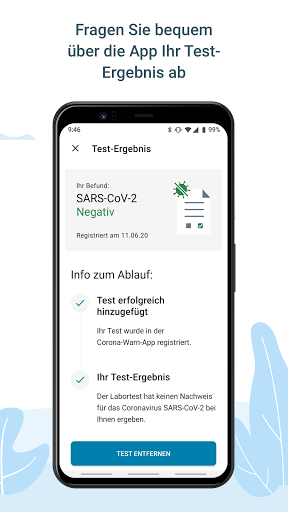
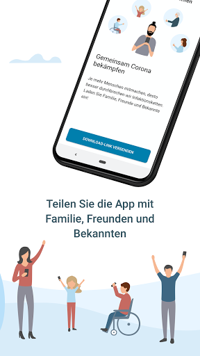
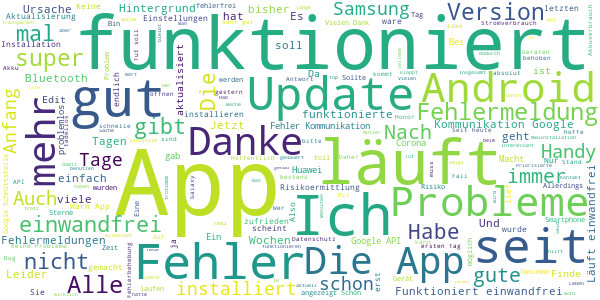
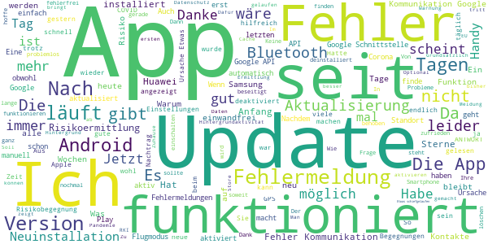
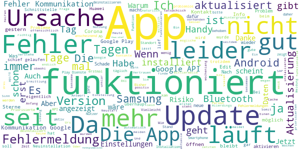
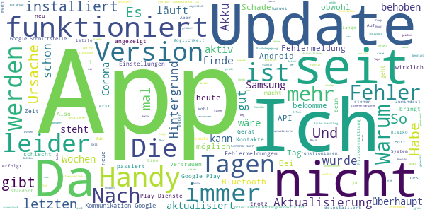
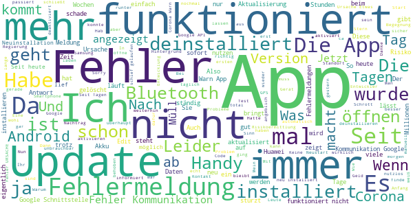

# Corona-Warn-App
App version ``1.1.1``

Analyzed with [covid-apps-observer](http://github.com/covid-apps-observer) project, version ``0.1``

## App overview
| | |
|-------------------------|-------------------------| 
| **Name**&nbsp;&nbsp;&nbsp;&nbsp;&nbsp;&nbsp;&nbsp;&nbsp;&nbsp;&nbsp;&nbsp;&nbsp;&nbsp;&nbsp;&nbsp;&nbsp;&nbsp;&nbsp;&nbsp;&nbsp;&nbsp;&nbsp;&nbsp;&nbsp;&nbsp;&nbsp;&nbsp;&nbsp;&nbsp;&nbsp;&nbsp;&nbsp;&nbsp;&nbsp;&nbsp;&nbsp;&nbsp;&nbsp;&nbsp;&nbsp;  | Corona-Warn-App |
| **Unique identifier** | de.rki.coronawarnapp |
| **Link to Google Play** | [https://play.google.com/store/apps/details?id=de.rki.coronawarnapp](https://play.google.com/store/apps/details?id=de.rki.coronawarnapp) |
| **Summary**  | Gemeinsam Corona bekämpfen |
| **Privacy policy** | [https://www.coronawarn.app/assets/documents/cwa-privacy-notice-de.pdf](https://www.coronawarn.app/assets/documents/cwa-privacy-notice-de.pdf) |
| **Latest version** | 1.1.1 |
| **Last update** | 2020-07-20 20:24:58 |
| **Recent changes** | Mit diesem Update stehen Ihnen Erweiterungen für die Risiko-Ermittlung und verbesserte Texte zur Verfügung. Die Barrierefreiheit wurde verbessert. Die Corona-Warn-App ist nun auch in türkischer Sprache verfügbar. Das Update behebt die Anzeige der aktiven Tage, die Meldung zum nicht ausreichenden Speicher sowie einen Zeitzonen-Fehler. Einen detaillierten Überblick über die Änderungen finden Sie in den Release Notes in Github: https://github.com/corona-warn-app/cwa-app-android/releases/tag/1.1.1 |
| **Installs**  | 5.000.000+ |
| **Category** | Gesundheit & Fitness |
| **First release** | 12.06.2020 |
| **Size**  | 31M |
| **Supported Android version**  | 6.0 oder höher |

### Description
> Das Robert Koch-Institut (RKI) als zentrale Einrichtung des Bundes im Bereich der Öffentlichen Gesundheit und als nationales Public-Health-Institut veröffentlicht die Corona-Warn-App für die deutsche Bundesregierung und für die Bundesrepublik Deutschland. Die App fungiert als digitale Ergänzung zu Abstandhalten, Hygiene und Alltagsmaske. Wer sie nutzt, hilft, Infektionsketten schnell nachzuverfolgen und zu durchbrechen. Die App merkt sich dezentral unsere Begegnungen mit anderen und informiert uns digital, wenn wir Begegnungen mit nachweislich infizierten Personen hatten. Dabei sammelt sie jedoch zu keiner Zeit Informationen zur Identität ihrer Nutzerinnen und Nutzer. Wer wir sind und wo wir sind, bleibt geheim – und unsere Privatsphäre bestens geschützt.
 WIE DIE APP FUNKTIONIERT
 Sind wir unterwegs, sollte die Risiko-Ermittlung immer aktiviert sein. Denn sie ist das Herzstück der Software. Wann immer sich Nutzerinnen und Nutzer begegnen, tauschen ihre Smartphones über Bluetooth verschlüsselte Zufallscodes aus. 
 Diese geben nur Auskunft darüber, über welche Dauer und mit welchem Abstand eine Begegnung stattfand. Welche Person sich hinter einem Code verbirgt, ist für niemanden nachvollziehbar. Die Corona-Warn-App erhebt keine Informationen über den Ort der Begegnung oder den Standort der Nutzerinnen und Nutzer.
 Entsprechend der maximalen Corona-Inkubationszeit werden alle Zufallscodes, die unser Smartphone sammelt, für 14 Tage auf dem Smartphone gespeichert – und dann gelöscht. 
 Nur wenn eine Person sich über die App freiwillig als nachweislich infiziert meldet, erhalten daraufhin alle früheren Begegnungen eine Warnung auf ihr Smartphone. 
 Niemand erfährt, wann, wo oder mit wem eine entsprechende Risiko-Begegnung stattfand. Die infizierte Person bleibt anonym.
 Mit der Benachrichtigung erhalten die betroffenen Nutzer/-innen klare Handlungsempfehlungen. Wichtig: Auch die Daten der Benachrichtigten sind zu keiner Zeit einsehbar.
 WIE DIE DATEN SICHER BLEIBEN
 Die Corona-Warn-App soll uns zwar täglich begleiten. Sie wird uns jedoch nie kennenlernen. Dadurch kann sie niemandem verraten, wer wir sind. Der Datenschutz bleibt über die gesamte Nutzungsdauer zu 100 Prozent gewahrt.
 • Keine Anmeldung: Es müssen keine E-Mail-Adresse und kein Name hinterlegt werden.
 • Keine Rückschlüsse auf Identitäten: Bei einer Begegnung mit einem anderen Menschen tauschen die Smartphones nur Zufallscodes aus. Diese messen, über welche Dauer und mit welchem Abstand ein Kontakt stattfand. Sie lassen aber keine Rückschlüsse auf Personen und Standorte zu. 
 • Dezentrale Speicherung: Die Daten werden nur auf dem Smartphone gespeichert und nach 14 Tagen gelöscht.
 • Keine Einsicht für Dritte: Sowohl die Personen, die eine nachgewiesene Infektion melden, als auch die Benachrichtigten sind nicht nachverfolgbar – nicht für die Bundesregierung, nicht für das Robert Koch-Institut, nicht für andere User und auch nicht für die Betreiber der App-Stores.
 Diese App ist nicht zum Gebrauch außerhalb Deutschlands bestimmt. Die Corona-Warn-App ist die zentrale COVID-19 App für Deutschland und sie ist an das deutsche Gesundheitssystem angeschlossen. Trotzdem ist die Corona-Warn-App auch in diesem Land verfügbar. Sie ist gedacht für alle, die in Deutschland leben, arbeiten, Urlaub machen oder sich regelmäßig oder über längere Zeit in Deutschland aufhalten.

### User interface
The developers of the app provide the following screenshots in the Google play store.
| | | |
|:-------------------------:|:-------------------------:|:-------------------------:|
 |   |   |   | 
 |   |   |   | 
 |   |  

## Development team
In the following we report the main information provided by the development team in the Google play store.

| | |
|-------------------------|-------------------------|
| **Developer**  | Robert Koch-Institut |
| **Website**  | [https://www.coronawarn.app](https://www.coronawarn.app) |
| **Email** | CoronaWarnApp@rki.de |
| **Physical address**  | [Robert Koch-Institut Nordufer 20 13353 Berlin](https://www.google.com/maps/search/Robert%20Koch-Institut%20Nordufer%2020%2013353%20Berlin) (Google Maps) |
| **Other developed apps**  | [https://play.google.com/store/apps/developer?id=Robert+Koch-Institut](https://play.google.com/store/apps/developer?id=Robert+Koch-Institut) |

## Android support

| | |
|-------------------------|-------------------------|
| **Declared target Android version**  | Android10, version 10 (API level 29) |
| **Effective target Android version**  | Android10, version 10 (API level 29) |
| **Minimum supported Android version**  | Marshmallow, version 6.0 (API level 23) |
| **Maximum target Android version**  | - |

The larger the difference between the minimum and maximum supported Android versions, the better. A larger difference means a wider audience. For example, old phones have a very low Android version, so a high minimum supported Android version means that the app cannot be used by users with old phones, thus leading to accessibility problems. 

## Requested permissions

In the following we report the complete list of the permissions requested by the app. 

| **Permission** | **Protection level** | **Description** | 
|-------------------------|-------------------------|-------------------------|
 **android.permission ACCESS_NETWORK_STATE** | Normal | Allows applications to access information about networks. 
 **android.permission BLUETOOTH** | Normal | Allows applications to connect to paired bluetooth devices. 
 **android.permission CAMERA** | :warning:**Dangerous** | Required to be able to access the camera device. 
 **android.permission FOREGROUND_SERVICE** | Normal | Allows a regular application to use Service.startForeground. 
 **android.permission INTERNET** | Normal | Allows applications to open network sockets. 
 **android.permission RECEIVE_BOOT_COMPLETED** | Normal | Allows an application to receive the Intent.ACTION_BOOT_COMPLETED that is broadcast after the system finishes booting. 
 **android.permission REQUEST_IGNORE_BATTERY_OPTIMIZATIONS** | Normal | Permission an application must hold in order to use Settings.ACTION_REQUEST_IGNORE_BATTERY_OPTIMIZATIONS. 
 **android.permission WAKE_LOCK** | Normal | Allows using PowerManager WakeLocks to keep processor from sleeping or screen from dimming. 

## Mentioned servers

| **Server** | **Registrant** | **Registrant country** | **Creation date** | 
|-------------------------|-------------------------|-------------------------|-------------------------|
 | google.com | Google LLC | :us: US | 1997-09-15 04:00:00 |
 | t-online.de | - | - | - |

## Security analysis 

Below we report the main security warnings raised by our execution of the [Androwarn](https://github.com/maaaaz/androwarn) security analysis tool.

**Connection interfaces exfiltration**
> - This application reads details about the currently active data network 
> - This application tries to find out if the currently active data network is metered 

**Telephony services abuse**
> - This application makes phone calls 

**Suspicious connection establishment**
> - This application opens a Socket and connects it to the remote address '; port is out of range' on the 'N/A' port  
> - This application opens a Socket and connects it to the remote address 'Lcom/android/tools/r8/GeneratedOutlineSupport;->outline19(Ljava/lang/String;)Ljava/lang/StringBuilder;' on the 'N/A' port  
> - This application opens a Socket and connects it to the remote address 'Ljava/net/Proxy;->type()Ljava/net/Proxy$Type;' on the 'N/A' port  
> - This application opens a Socket and connects it to the remote address 'Method sendUrgentData() is not supported.' on the 'N/A' port  
> - This application opens a Socket and connects it to the remote address 'Method setHandshakeTimeout() is not supported.' on the 'N/A' port  
> - This application opens a Socket and connects it to the remote address 'Method setOOBInline() is not supported.' on the 'N/A' port  
> - This application opens a Socket and connects it to the remote address 'Method setSoWriteTimeout() is not supported.' on the 'N/A' port  
> - This application opens a Socket and connects it to the remote address 'Socket closed' on the 'N/A' port  
> - This application opens a Socket and connects it to the remote address 'Socket is closed' on the 'N/A' port  
> - This application opens a Socket and connects it to the remote address 'Socket is closed.' on the 'N/A' port  
> - This application opens a Socket and connects it to the remote address 'Socket is not connected.' on the 'N/A' port  
> - This application opens a Socket and connects it to the remote address 'socket is closed' on the 'N/A' port  
> - This application opens a Socket and connects it to the remote address 'timeout' on the 'N/A' port  

**Code execution**
> - This application loads a native library 
> - This application loads a native library: 'conscrypt_gmscore_jni' 
> - This application loads a native library: 'conscrypt_jni' 

## User ratings and reviews

Below we provide information about how end users are reacting to the app in terms of ratings and reviews in the Google Play store.

### Ratings

The Corona-Warn-App app has been installed by more than **5000000** times. At this time, **68198** rated the app and its average score is **3.340661**. Below we show the distribution of the ratings across the usual star-based rating of Google Play

:star::star::star::star::star:: 29943

:star::star::star::star:: 7274

:star::star::star:: 6278

:star::star:: 5473

:star:: 19227

### Reviews 

#### 5-star reviews

> Super App, kann ich nur weiter empfehlen.  :date: __2020-07-28 10:52:57__

> Mit meinem neuen Handy funktioniert es tadellos!  :date: __2020-07-28 10:52:55__

> Gut gelungen.  :date: __2020-07-28 10:50:53__

> Hat von Beginn an einwandfrei gearbeitet. Aus- und Anschalten von BT und GPS hat die SW nicht beeindruckt. Automatisch updaten hat mit der 1.0.5 nicht funktioniert, aber solche Kinderkrankheiten sind vernachlässigbar. Interessant wäre mal zu wissen, wie viele positive Fälle schon gefunden wurden.  :date: __2020-07-28 10:29:12__

> Ok  :date: __2020-07-28 10:15:39__

> Bis jetzt gut  :date: __2020-07-28 10:06:27__

> Funktionierte anfangs gut und gibt seit Wochen nur noch Fehler: 13.7.20 Fehler Kommunikation mit Google API (10) dann API (39508) 26.7.: stabil und funktioniert gut .... schön, dass die Probleme gelöst sind.  :date: __2020-07-28 10:05:25__

> Installation auf A50 ist normal. Ohne Standortabfrage ist die Funktion nichts wert, muss also sein. BT hat eine Reichweite von etwa 10m innerhalb der Bebauung. Damit muss einem der Infizierte fast auf'm Schoß sitzen. Wer sich als infiziert outet, klebt sich den "Gelben Stern" an die digitale Brust. Sollte man sich verinnerlichen. HFS Update 02JUL20 Konnte heute für meine Kospet Prime Smartwatch die Corona-App für den Datenaustausch freischalten. Der Mitarbeiterin an der Hotline gebührt Lob++.  :date: __2020-07-28 09:57:26__

> Habe dadurch ein etwas besseres Gefühl.  :date: __2020-07-28 09:44:59__

> Leider funktioniert die App auf meinem Handy (Huawei p 8 lite) nicht mehr. Sie lief 10 Tage, jetzt kommen immer wechselnde Fehlermeldungen. Auch nach Neuinstallation. Leider klappt bei mir immer noch nichts. Komme auch mit dem empfohlenen Links nicht weiter. Aktualisiert ist auch alles. Guten Morgen , leider kann ich seit gestern die App nicht meht öffnen. Ich habe die Version 1.1.1. Habe auch schon mehrere Neustarts gemacht.  :date: __2020-07-28 09:25:58__

#### 4-star reviews

> Jetzt scheint es ja zu klappen mit der App. Hat ja auch lange genug gedauert...  :date: __2020-07-28 10:24:37__

> Update 1.1.1 installiert. Einen Tag funktionierte die Coronawarn -App nicht. Jetzt aber schon 5 Tage ohne Fehlermeldung. In einer separaten Datenbank COVID-19 die Verbindung mit der coronawarn - APP hat, habe ich den Begriff -Schlüssel - gefunden. Was bedeutet das?  :date: __2020-07-28 08:57:59__

> Nochmal die Frage: ich habe eine Nachricht der Begegnungen der letzten 14 Tage bekommen, keine Risikobegegnung. Wo kann ich diese nochmals auf meinem Smartphone finden ?  :date: __2020-07-28 08:31:18__

> Seit dem Update auf die Version 1.1.1 läuft die App wieder problemlos +++++++++ Nachdem die App anfangs einwandfrei funktioniert hat, habe ich seit nunmehr elf Tagen nur noch Fehlermeldungen (alle schon bekannt laut FAQ), ohne dass jedoch eine Besserung in Sicht ist. Das ist sehr unbefriedigend. Heute ist es vorrangig die Fehlernummer 39508. Allerdings habe ich alternierend auch mit den Nummern 3 und 10 Kontakt.  :date: __2020-07-28 07:26:22__

> Nachdem ich dank neuem Smartphone die App installieren könnte, läuft sie problemlos. Dass sie auf dem alten Android 5 System nicht installierbar war, ist echt Mist. Gerade viele Jugendliche werden nicht extra ein neues Phone kaufen, dabei wäre gerade bei denen die App hilfreich.  :date: __2020-07-28 04:25:49__

> Soweit ich das beurteilen kann, läuft die App fehlerfrei bei mir..  :date: __2020-07-27 20:29:04__

> Finde ich prima!  :date: __2020-07-27 20:22:37__

> Update: Neuinstallation zum 27.07. - keine Fehler mehr. Danke für die schnelle Verbesserung! --- Es gibt dauerhaft eine Fehlermeldung = Ursache: 3 "Fehler bei der Kommunikation mit der Google Schnittstelle (39508)"  :date: __2020-07-27 20:07:07__

> Seit letztem Update funktioniert soweit alles! Danke für die Unterstützung!  :date: __2020-07-27 19:22:23__

> Funktioniert alles wie versprochen  :date: __2020-07-27 19:17:57__

#### 3-star reviews

> Letzte Überprüfung auf eine mögliche Begegnung mit einer infizierten Person: gestern um 22:23 Da hab ich im Bett gelegen, geschlafen und das Telefon lag aufm Nachttisch. Wie da eine weitere Person mit Telefon aufgetaucht sein soll, das ist mir unklar. Vielleicht war es ein Einbrecher. Wäre es schönes, neues Szenario für die App. Theoretisch netter Ansatz, das ganze Ding. Aber...  :date: __2020-07-28 10:57:33__

> Mist...  :date: __2020-07-28 10:01:22__

> Irgendwie bekomme ich Infos über mögliche Positive Kontakte. Merkwürdig : liege alleine, schlafend in meiner Furzmulle. Sonst scheint alles zu laufen. Aktuelle Version  :date: __2020-07-28 09:38:03__

> Die Entwickler betrachten die Sache offensichtlich als Geschenk für Ihren Unternehmensgewinn - die Nutzer werden in den Glauben gelassen, daß die App zuverlässig funktioniert - Notwendige Veränderungen der App werden als erledigt behauptet aber nicht automatisch vorgenommen  :date: __2020-07-28 08:10:48__

> passt, aber leider nicht für Android [<=]5 Geräte. Warum? @rki - natürlich unterstützen quasi alle Android Alt-Gerät neuere Android Versionen. Die fehlende gesetzliche Verpflichtung der Hersteller a.) zur dauerhaften Bereitstellung solcher- bzw. b.) zur Veröffentlichung der tech. Spezifikationen um die Bereitstellung aktueller Versionen durch Dritte zum Ende von Support-Zeiträumen zu ermöglichen ist hier das generelle Problem... [beantwortet auf einem SGS4/i9505 unter LineageOS 16 (Android 9)]  :date: __2020-07-28 08:00:21__

> Trotz aktuellem Update und veränderten Energie Einstellungen muss ich täglich die App öffnen damit Sie sich aktualisiert. Android S9  :date: __2020-07-28 07:53:21__

> Leider funktioniert die automatische Aktualisierung nicht zuverlässig. Aktualisiert sich erst wenn man die App öffnet. Handy ist ein Huawei P30 pro. Automatische Aktualisierung ist aktiv und die Berichtigung für die App stimmen auch. Daher nur drei Sterne.  :date: __2020-07-28 07:13:46__

> Nachtrag: Was nützt es eine App im Open source zu programmieren, wenn man dann nicht auf die Hinweise verschiedener Nutzer reagiert! Und dafür bezahlt die Regierung 20 Mio. Ab SAP und die Telekom! Da Frage ich mich er der größere Loser ist 🙄! Millionen für Schrott auszugeben oder eine einfache App mit Unterstützung von Apple und Google zu programmieren, die nicht geht 🤮...  :date: __2020-07-28 05:31:01__

> Warum wird nur so o selten aktualisiert????  :date: __2020-07-27 23:23:24__

> Risiko-Ermittlung zeigt -1 - 14 Tage auch nach mehreren Tagen an.  :date: __2020-07-27 21:44:42__

#### 2-star reviews

> Ob nutzen oder nicht.. erst nach öffnen erfolgt Aktualisierung.. 90% der Leute in meinem Umfeld hat sie gar nicht erst installiert.. Achja .. besser wäre es immer persönlich auf Emails zu antworten.. automatisierte antworten geben weder vertrauen noch werden damit infektionsketten unterbrochen  :date: __2020-07-28 10:56:38__

> Seit der letzten Aktualisierung meldet die App positive Kontakte wenn ich alleine Zuhause bin!? Völlig verrückt, so wird das nichts. Werde ich deinstallieren wenn nicht umgehend Korrektur erfolgt!  :date: __2020-07-28 10:13:26__

> Da habt Ihr Entwickler monatelang an dem Ding rum-programmiert ... und was kommt raus? Eine App die sich nicht richtig aktualisiert und in der die Tage falsch gezählt werden.. oder dargestellt werden... Alter Schwede - ihr seid echte Profis!  :date: __2020-07-28 10:10:22__

> EDIT 3: Ihre Google Play Dienste sind leider nicht auf dem neusten Stand. Die neue Version heist: ENF 1.5. Damit wurde viele Fehler behoben. Antwort: Ich finde keine Möglichkeit, die Google-Play Dienste zu aktualisieren. Sie erscheinen nicht im Playstore. In der App (Anwendungsmanager->Google Play Dienste) gibt es keinen Knopf zum Aktualisieren. Wo finde ich die neue Version ENF1.5?--- Danke. Läuft jetzt. Die Hauptschwierigkeit bestand darin, die Google Play Dienste zu aktualisieren. Anleitung dazu von Google funktioniert nicht. Ist schließlich mithilfe einer externen App "Fix Play Services 2020" gelungen. Dort gibt es endlich einen Update Knopf.  :date: __2020-07-28 09:53:21__

> Ziemlich unausgereifte Anwendung. Typisch Telekom, teuer und schlecht...  :date: __2020-07-28 09:50:34__

> Diese App funktioniert nicht richtig! Werde laufend ausgeworfen.  :date: __2020-07-28 08:17:11__

> Lief recht gut, seit kurzen heißt es: Risikoermittlung kann nicht durch geführt werden, kein Speicher vorhanden (Ursache 2), was aber nicht sein kann, da 1 GB freier Speicher und ebenso Arbeitsspeicher frei. Beheben bitte, da die App dadurch überhaupt nicht mehr funktioniert.  :date: __2020-07-28 07:29:22__

> Die priorisierte Hintergrundaktivität kann bei meinem Samsung J4+ nicht angeschaltet werden, die Einstellung springt immer wieder auf " aus" zurück  :date: __2020-07-28 06:57:37__

> Man hat keinen Schutz weil man nicht weiß ob Personen angeben wenn sie positiv auf Corona getestet worden.  :date: __2020-07-27 23:28:52__

> Neu: Text geändert in : "Dauerhaft aktiv", schon besser. Hintergrund-Aktivität steht auf manuell und ist so eingeschaltet. 1 grüne Risk.Beg. erhalten. Hotline 1. mal: Die grüne Risik.Beg. wird n. 2 Wochen mit dem entspr. Datensatz gelöscht. Nach 16 Tagen aber immer noch da! Hotline 2. mal: Risik.Beg. werden nie gelöscht!? Wer denkt sich sowas aus? Was soll ich mit der Daueranzeige 1 Risik. Begegnung in grün?? Kann mir bitte irgend jemand von SAP/Telekom den Sinn dahinter erklären? 🤦🤷  :date: __2020-07-27 22:49:58__

#### 1-star reviews

> Mein Viren Schutz Programm sagte ACHTUNG WARNUNG VIRUS Befall  :date: __2020-07-28 10:49:59__

> Ich hab das Update gemacht und trtidzem aktualisiert die App nur, wenn ich sie öffne. Soll das so sein? Edit: Ich hab die Einstellungen angepasst, das Problem besteht weiterhin Edit: Die Hintergrundaktivität ist seit knapp zwei Tagen erlaubt  :date: __2020-07-28 10:23:47__

> Beim öffnen der App kam eine Fehlermeldung "3". Bei Google wurde mir geraten die App neu zu installieren, die Daten würden nicht verloren gehen. Natürlich laufe ich jetzt unter neu aktiviert und alle Daten sind weg  :date: __2020-07-28 10:14:27__

> 68 Mio Euro für ein App, welche nicht richtig funktioniert, ständig Fehler produziert und zudem kein echten Support bietet, wenn man sich die Reaktionen des Robert-Koch-Institut's anschaut. Unterirdisch trifft den Nagel auf den Kopf, aber SAP und die Telekom sind um einiges reicher geworden. Vielleicht lässt man das nächste Mal jemanden programmieren, der sein Handwerk versteht!!!  :date: __2020-07-28 10:11:18__

> Keine automatische Aktualisierung  :date: __2020-07-28 10:07:10__

> Leider stürzt die App nach jedem Öffnen sofort wieder ab, ich weiß nicht woran es liegt... Wenn es sich doch mal öffnen lässt steht dort Usache:9002 ich denke aber dass ich die neueste Version heruntergeladen habe.  :date: __2020-07-28 09:35:51__

> Was für eine Enttäuschung wenn man sich voll draufverlässt und plötzlich wird klar es hat mehrere Wochen nicht richtig funktioniert😡so viel Geld für so ein Schwachsinn also wer schreibt hier dass app kein Unterschied beim Akkuverbrauch macht, hat bestimmt 0 Ahnung vom digitalen Welt. Immer muss bluetooth an sein und bei der Bewegung wird mehrmals am Tag dies aktiviert was auf Verbrauch direkt einwirkt  :date: __2020-07-28 09:33:33__

> Fehler bei google Kommunikation (39508). Auch bei gerade upgedateter App (1.1.1). Die App (in aelterer Version) ging vor einigen Tagen noch einwandfrei.  :date: __2020-07-28 09:30:10__

> Mein Handy zeigt ständig an, "(die App ist mit Ihrem Gerät nicht kompatibel & dadurch nicht verfügbar"), und zeigt auch ständig: Dies ist keine sichere Seite. Hacker könnten versuchen, Ihre Daten von Corona-Warn-App zu stehlen, zum Beispiel Passwörter, Nachrichten oder Kreditkartendaten. , trotz aktiv/aktuell ständig mein Google Dienst ist, mein Betriebssystem ist aktuell/neues Updates ein Windows, sagt mein neues Huawei Y6 & lehnte die App ab! Die App 2x zu installieren keine Chance  :date: __2020-07-28 09:21:36__

> Die Antworten des RKI sind wirklich amüsant.. doze ist bekannt.. komisch dass man es dann vergessen hatte und die app trotzdem schlafen gelegt wurde.. es soll ein fehler auf Android seite sein.. vielleicht sollte man mehr an der app arbeiten als auf Rezensionen zu antworten.... und nach wie vor frage ich wie naiv man sein muß, das die extra geschaffene Schnittstelle keine daten an google liefert..  :date: __2020-07-28 09:19:25__

