# Corona-Warn-App
App version ``1.10.1``

Analyzed with [covid-apps-observer](http://github.com/covid-apps-observer) project, version ``0.1``

## App overview
| | |
|-------------------------|-------------------------| 
| **Name**&nbsp;&nbsp;&nbsp;&nbsp;&nbsp;&nbsp;&nbsp;&nbsp;&nbsp;&nbsp;&nbsp;&nbsp;&nbsp;&nbsp;&nbsp;&nbsp;&nbsp;&nbsp;&nbsp;&nbsp;&nbsp;&nbsp;&nbsp;&nbsp;&nbsp;&nbsp;&nbsp;&nbsp;&nbsp;&nbsp;&nbsp;&nbsp;&nbsp;&nbsp;&nbsp;&nbsp;&nbsp;&nbsp;&nbsp;&nbsp;  | Corona-Warn-App |
| **Unique identifier** | de.rki.coronawarnapp |
| **Link to Google Play** | [https://play.google.com/store/apps/details?id=de.rki.coronawarnapp](https://play.google.com/store/apps/details?id=de.rki.coronawarnapp) |
| **Summary**  | Gemeinsam Corona bekämpfen |
| **Privacy policy** | [https://www.coronawarn.app/assets/documents/cwa-privacy-notice-de.pdf](https://www.coronawarn.app/assets/documents/cwa-privacy-notice-de.pdf) |
| **Latest version** | 1.10.1 |
| **Last update** | 2020-12-21 18:46:22 |
| **Recent changes** | Dieses Update enthält Fehlerbehebungen sowie Anpassungen der App-Texte. Im Kontakt-Tagebuch können Sie für je 14 Tage ein Datum und den Ort, an dem Sie sich aufgehalten haben, oder die Person, der Sie begegnet sind, erfassen. Diese Informationen können Sie im Rahmen der Kontaktnachverfolgung im Falle eines positiven Corona-Tests nutzen. |
| **Installs**  | 10.000.000+ |
| **Category** | Gesundheit & Fitness |
| **First release** | 12.06.2020 |
| **Size**  | 22M |
| **Supported Android version**  | 6.0 oder höher |

### Description
> Das Robert Koch-Institut (RKI) als zentrale Einrichtung des Bundes im Bereich der Öffentlichen Gesundheit und als nationales Public-Health-Institut veröffentlicht die Corona-Warn-App für die deutsche Bundesregierung und für die Bundesrepublik Deutschland. Die App fungiert als digitale Ergänzung zu Abstandhalten, Hygiene und Alltagsmaske. Wer sie nutzt, hilft, Infektionsketten schnell nachzuverfolgen und zu durchbrechen. Die App merkt sich dezentral unsere Begegnungen mit anderen und informiert uns digital, wenn wir Begegnungen mit nachweislich infizierten Personen hatten. Dabei sammelt sie jedoch zu keiner Zeit Informationen zur Identität ihrer Nutzerinnen und Nutzer. Wer wir sind und wo wir sind, bleibt geheim – und unsere Privatsphäre bestens geschützt.
 WIE DIE APP FUNKTIONIERT
 Sind wir unterwegs, sollte die Risiko-Ermittlung immer aktiviert sein. Denn sie ist das Herzstück der Software. Wann immer sich Nutzerinnen und Nutzer begegnen, tauschen ihre Smartphones über Bluetooth verschlüsselte Zufallscodes aus. 
 Diese geben nur Auskunft darüber, über welche Dauer und mit welchem Abstand eine Begegnung stattfand. Welche Person sich hinter einem Code verbirgt, ist für niemanden nachvollziehbar. Die Corona-Warn-App erhebt keine Informationen über den Ort der Begegnung oder den Standort der Nutzerinnen und Nutzer.
 Entsprechend der maximalen Corona-Inkubationszeit werden alle Zufallscodes, die unser Smartphone sammelt, für 14 Tage auf dem Smartphone gespeichert – und dann gelöscht. 
 Nur wenn eine Person sich über die App freiwillig als nachweislich infiziert meldet, erhalten daraufhin alle früheren Begegnungen eine Warnung auf ihr Smartphone. 
 Niemand erfährt, wann, wo oder mit wem eine entsprechende Risiko-Begegnung stattfand. Die infizierte Person bleibt anonym.
 Mit der Benachrichtigung erhalten die betroffenen Nutzer/-innen klare Handlungsempfehlungen. Wichtig: Auch die Daten der Benachrichtigten sind zu keiner Zeit einsehbar.
 WIE DIE DATEN SICHER BLEIBEN
 Die Corona-Warn-App soll uns zwar täglich begleiten. Sie wird uns jedoch nie kennenlernen. Dadurch kann sie niemandem verraten, wer wir sind. Der Datenschutz bleibt über die gesamte Nutzungsdauer zu 100 Prozent gewahrt.
 • Keine Anmeldung: Es müssen keine E-Mail-Adresse und kein Name hinterlegt werden.
 • Keine Rückschlüsse auf Identitäten: Bei einer Begegnung mit einem anderen Menschen tauschen die Smartphones nur Zufallscodes aus. Diese messen, über welche Dauer und mit welchem Abstand ein Kontakt stattfand. Sie lassen aber keine Rückschlüsse auf Personen und Standorte zu. 
 • Dezentrale Speicherung: Die Daten werden nur auf dem Smartphone gespeichert und nach 14 Tagen gelöscht.
 • Keine Einsicht für Dritte: Sowohl die Personen, die eine nachgewiesene Infektion melden, als auch die Benachrichtigten sind nicht nachverfolgbar – nicht für die Bundesregierung, nicht für das Robert Koch-Institut, nicht für andere User und auch nicht für die Betreiber der App-Stores.
 Diese App ist nicht zum Gebrauch außerhalb Deutschlands bestimmt. Die Corona-Warn-App ist die zentrale COVID-19 App für Deutschland und sie ist an das deutsche Gesundheitssystem angeschlossen. Trotzdem ist die Corona-Warn-App auch in diesem Land verfügbar. Sie ist gedacht für alle, die in Deutschland leben, arbeiten, Urlaub machen oder sich regelmäßig oder über längere Zeit in Deutschland aufhalten.
 Es gelten die Nutzungsbedingungen der Corona-Warn-App: https://www.coronawarn.app/assets/documents/cwa-eula-de.pdf. Durch die Installation und Nutzung dieser App stimmen Sie den Nutzungsbedingungen zu.

### User interface
The developers of the app provide the following screenshots in the Google play store.
| | | |
|:-------------------------:|:-------------------------:|:-------------------------:|
 | 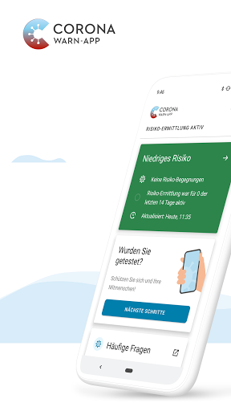  | 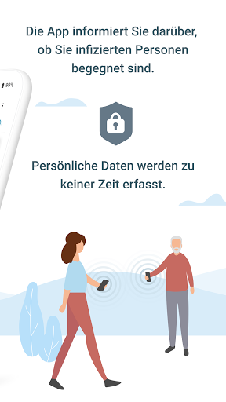  | 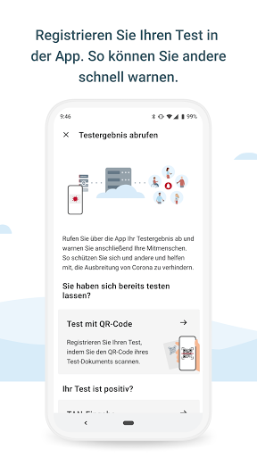  | 
 | 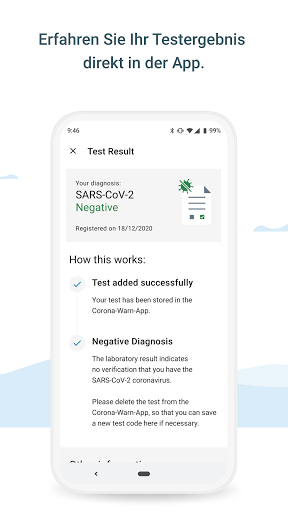  | 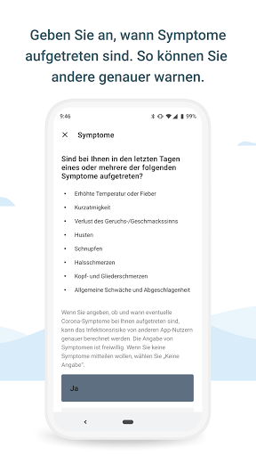  | 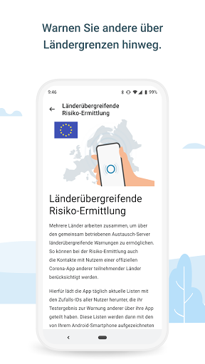  | 
 | 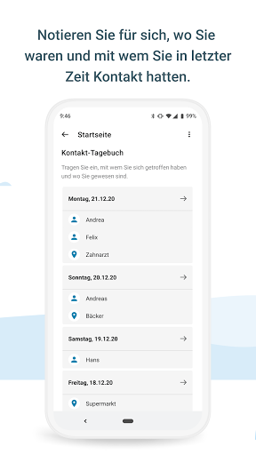 

## Development team
In the following we report the main information provided by the development team in the Google play store.

| | |
|-------------------------|-------------------------|
| **Developer**  | Robert Koch-Institut |
| **Website**  | [https://www.coronawarn.app](https://www.coronawarn.app) |
| **Email** | CoronaWarnApp@rki.de |
| **Physical address**  | [Robert Koch-Institut Nordufer 20 13353 Berlin](https://www.google.com/maps/search/Robert%20Koch-Institut%20Nordufer%2020%2013353%20Berlin) (Google Maps) |
| **Other developed apps**  | [https://play.google.com/store/apps/developer?id=Robert+Koch-Institut](https://play.google.com/store/apps/developer?id=Robert+Koch-Institut) |

## Android support

| | |
|-------------------------|-------------------------|
| **Declared target Android version**  | Android10, version 10 (API level 29) |
| **Effective target Android version**  | Android10, version 10 (API level 29) |
| **Minimum supported Android version**  | Marshmallow, version 6.0 (API level 23) |
| **Maximum target Android version**  | - |

The larger the difference between the minimum and maximum supported Android versions, the better. A larger difference means a wider audience. For example, old phones have a very low Android version, so a high minimum supported Android version means that the app cannot be used by users with old phones, thus leading to accessibility problems. 

## Requested permissions

In the following we report the complete list of the permissions requested by the app. 

| **Permission** | **Protection level** | **Description** | 
|-------------------------|-------------------------|-------------------------|
 **android.permission ACCESS_NETWORK_STATE** | Normal | Allows applications to access information about networks. 
 **android.permission BLUETOOTH** | Normal | Allows applications to connect to paired bluetooth devices. 
 **android.permission CAMERA** | :warning:**Dangerous** | Required to be able to access the camera device. 
 **android.permission FOREGROUND_SERVICE** | Normal | Allows a regular application to use Service.startForeground. 
 **android.permission INTERNET** | Normal | Allows applications to open network sockets. 
 **android.permission RECEIVE_BOOT_COMPLETED** | Normal | Allows an application to receive the Intent.ACTION_BOOT_COMPLETED that is broadcast after the system finishes booting. 
 **android.permission REQUEST_IGNORE_BATTERY_OPTIMIZATIONS** | Normal | Permission an application must hold in order to use Settings.ACTION_REQUEST_IGNORE_BATTERY_OPTIMIZATIONS. 
 **android.permission WAKE_LOCK** | Normal | Allows using PowerManager WakeLocks to keep processor from sleeping or screen from dimming. 

## Mentioned servers

| **Server** | **Registrant** | **Registrant country** | **Creation date** | 
|-------------------------|-------------------------|-------------------------|-------------------------|
 | google.com | Google LLC | :us: US | 1997-09-15 04:00:00 |

## Security analysis 

Below we report the main security warnings raised by our execution of the [Androwarn](https://github.com/maaaaz/androwarn) security analysis tool.

**Connection interfaces exfiltration**
> - This application reads details about the currently active data network 
> - This application tries to find out if the currently active data network is metered 

**Telephony services abuse**
> - This application makes phone calls 

**Suspicious connection establishment**
> - This application opens a Socket and connects it to the remote address '; port is out of range' on the 'N/A' port  
> - This application opens a Socket and connects it to the remote address 'Lcom/android/tools/r8/GeneratedOutlineSupport;->outline20(Ljava/lang/String;)Ljava/lang/StringBuilder;' on the 'N/A' port  
> - This application opens a Socket and connects it to the remote address 'Ljava/net/Proxy;->type()Ljava/net/Proxy$Type;' on the 'N/A' port  
> - This application opens a Socket and connects it to the remote address 'Method sendUrgentData() is not supported.' on the 'N/A' port  
> - This application opens a Socket and connects it to the remote address 'Method setHandshakeTimeout() is not supported.' on the 'N/A' port  
> - This application opens a Socket and connects it to the remote address 'Method setOOBInline() is not supported.' on the 'N/A' port  
> - This application opens a Socket and connects it to the remote address 'Method setSoWriteTimeout() is not supported.' on the 'N/A' port  
> - This application opens a Socket and connects it to the remote address 'Socket closed' on the 'N/A' port  
> - This application opens a Socket and connects it to the remote address 'Socket is closed' on the 'N/A' port  
> - This application opens a Socket and connects it to the remote address 'Socket is closed.' on the 'N/A' port  
> - This application opens a Socket and connects it to the remote address 'Socket is not connected.' on the 'N/A' port  
> - This application opens a Socket and connects it to the remote address 'socket is closed' on the 'N/A' port  
> - This application opens a Socket and connects it to the remote address 'timeout' on the 'N/A' port  

**Code execution**
> - This application loads a native library 
> - This application loads a native library: 'conscrypt_gmscore_jni' 
> - This application loads a native library: 'conscrypt_jni' 

## User ratings and reviews

Below we provide information about how end users are reacting to the app in terms of ratings and reviews in the Google Play store.

### Ratings

The Corona-Warn-App app has been installed by more than **10000000** times. At this time, **105061** rated the app and its average score is **3.0555608**. Below we show the distribution of the ratings across the usual star-based rating of Google Play

:star::star::star::star::star:: 38627

:star::star::star::star:: 10641

:star::star::star:: 10099

:star::star:: 9331

:star:: 36363

### Reviews 

#### 5-star reviews

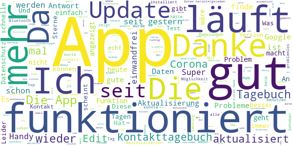

> Leider seit 3 Tagen keine Aktualisierung möglich, obwohl aktiviert Seit dem Update funktioniert es einwandfrei! Mit den Updates verbessert sich die App kontinuierlich. Das neue Tagebuch ist gut zu bedienen und hat eine einfache Struktur. Weiter so.!!!  :date: __2021-01-23 12:26:40__

> Wenn es Menschenleben rettet bin ich dabei. Schaut euch die Datenschutzbestimmungen von jedem beliebigen kostenfreien Handyspiel an - da werden mehr Daten gesammelt.  :date: __2021-01-23 11:42:01__

> Alle in Deutschland sollten sich diese App installieren und aktiv nutzen. Gemeinsam gegen Corona! ✊  :date: __2021-01-23 11:19:40__

> Ich finde sie perfekt gelungen, ich würde es sogar wünschen, beim täglichen Tagebuch wo die Orte einzutragen sind, dies per Standort eintragen zu können.  :date: __2021-01-23 10:37:47__

> Seit dem Update im Dezember wird keine Risikobegegnung mehr angezeigt. Auch bei Freunden nicht. Eine arbeitet in einer Arztpraxis und fährt täglich mit der U-Bahn hin. Sie hat angeblich keine Risikobegegnungen obwohl ihr Handy den ganzen Tag neben ihr an der Rezeption liegt. Ich fürchte die App macht ihren Job nicht mehr. Ich habe die App von Anfang an. Sie lief vorher bei mir ohne Probleme und zeigte nachvollziehbare Kontakte an.  :date: __2021-01-23 10:02:45__

> Muss man haben  :date: __2021-01-23 09:09:49__

> beruhigend  :date: __2021-01-23 07:22:49__

> Original 10/2020:Datenschutz by design. So muss das sein und bleiben. Toll! Ein (skallierbares) Widget, welches die Zahl der Kontate und den aktuellen Status zeigt wäre noch die Kirsche auf der Sahne. Update 01/2021: Fügt doch bitte irgendeine Art von Statistik-Anzeige ein. Der reguläre user möchte irgendwelche Zahlen angezeigt bekommen. Dann muss ich mich von dem Rest der Gesellschaft nicht mehr mit Phrasen wie "die App zeigt nichts an" nerven lassen. Ansonsten bitte weiter so! :)  :date: __2021-01-23 02:20:32__

> funktioniert immer besset  :date: __2021-01-22 23:38:48__

> Hat alles funktioniert  :date: __2021-01-22 20:04:36__

#### 4-star reviews

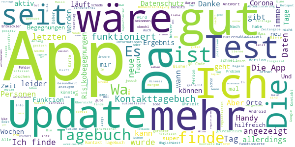

> Wir werden am Arbeitsplatz wöchentlich getestet, nur diesen Test kann man nicht posten  :date: __2021-01-23 13:00:57__

> Es ist ja an sich eine schöne Sache, aber wenn ich getestet werde u. den Code zum Scannen erhalte u. ihn einscannen, gehe ich davon aus, das es dann auch gemeldet ist. Mein Test war positiv (bin wieder gesund) u. da habe ich gewiss kein Kopf dafür ständig in die App zu schauen ob ich da irgendwas ausfüllen muss. Als ich soweit gesund war u. wieder in die App schaute, stand da das ich die anderen ja "nicht warnen wollte". Natürlich wollte ich warnen, deswegen habe ich den Code doch eingescannt!  :date: __2021-01-23 12:16:36__

> Was mich wundert das sich die App nicht öfters am Tag Aktualisiert. Daher ein Stern weniger. Aber Danke für das bereitstellen der App. Und lockert bitte den Datenschutz. Nachtrag: Danke für Ihre Antwort. Traurig und ein Armutszeugnis, dass die Provider sich so haben. Die großen können nicht genug in den Hals bekommen. Ich als kleiner Bürger der eh schon nicht geschätzt wird und in seinem Beruf und den ganzen Tag mit Menschen eng an eng zu tun hat, übernimmt gern die Mobilen Datenkosten.  :date: __2021-01-23 02:11:42__

> Meiner Meinung nach nicht genau genug .  :date: __2021-01-23 00:30:04__

> Ich habe meinen Test von gestern gescannt. Allerdings steht als registriertes Datum immer noch der 12.12.20 (Mein erster Test) - danke für die Antwort. Es ist nicht so das ich verunsichert bin. Vielmehr kann ich mein negatives Ergebnis nicht vorweisen. Zb im Altersheim  :date: __2021-01-22 20:44:31__

> Seit 2 Tagen keine Verbindung zum Server möglich (trotz Bluetooth). Was ist da los?  :date: __2021-01-22 19:07:32__

> Keine  :date: __2021-01-22 17:10:20__

> Muss erst herausfinden wie die Corona app geht.  :date: __2021-01-22 12:42:22__

> Aktuell öffnet sich die App, aber der aktuelle Status wird nicht geladen. Die App vermeldet dauerhaft: "Daten werden heruntergeladen..." Eigentlich finde ich die App gut. Update: Der Status wird wieder geladen.  :date: __2021-01-22 08:51:01__

> Gut  :date: __2021-01-21 23:02:43__

#### 3-star reviews

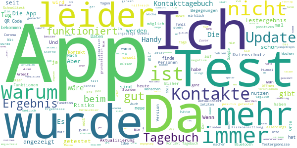

> Es ist nicht schön das man einen test nicht manuell eingeben kann, ich habe z.B. gar keine unterlagen dazu bekommen, sondern nur am Telefon gesagt bekommen ich sei negativ. Wie soll man das dann eintragen? Wird es zukünftig möglich sein die Impfung einzutragen?  :date: __2021-01-23 12:54:59__

> Mein Testergebnis musste ich manuell einfügen lassen, bei Anderen ging dies automatisch. Auch die Warnungen kommen arg zeitversetzt. Traurig dass der Staat für so etwas Millionen ausgegeben hat, ist ja nur unser Geld .  :date: __2021-01-23 12:38:29__

> Pleiten, Pech und Pannen... Seit Wochen wird angezeigt, die App sei am 26.01. aktualisiert worden- heute haben wir erst den 22.01. Auch sonst habe ich nicht den Eindruck, dass sich irgendetwas tut in der App.  :date: __2021-01-23 12:30:27__

> Muss noch bearbeitet werden!!!  :date: __2021-01-23 10:52:16__

> Wäre es nicht auch hilfreich zu alarmieren wenn ich mich in ein erhöhtes Risikogebiet begebe. Diese Daten könnten ja zentral eingespeist werden.  :date: __2021-01-23 10:30:05__

> "Er war stets bemüht" stand früher oft in meinem Zeugnis. Das gilt auch für die App. Sie macht was sie tut, aber das ist leider viel zu wenig. Warum gibt es keine Option, das man mehr Daten angeben oder teilen kann? Ich wäre auf jeden Fall bereit mehr Daten zu teilen, wenn es hilft die Ansteckungskette nachzuvollziehen. Wenn z.B. Google eine WarnApp heraus bringen würde, hätten die schon mehr als ausreichend Daten von der Menschheit verfügbar.  :date: __2021-01-23 10:22:47__

> Update 23.1.2021 musste die App deinstallieren da sie plötzlich nicht mehr funktioniert hat, bin etwas enttäuscht, da ich mit Risikopatienten arbeite und auch selbst dazu zähle 🙈🙈  :date: __2021-01-23 09:56:52__

> Nach 10 Tagen positiv getestet. Eingescannt und den Anweisungen gefolgt. Alles io. Aber dann nach weiteren 5 Tagen negativ getestet. Diesen Test kann ich nicht einscannen da die App sagt ich soll in Quarantäne bleiben und der Bildschirm ändert sich nicht. Ist das Absicht? Da ich wieder raus darf warnt mein Handy obwohl ich negativ bin.  :date: __2021-01-23 09:47:56__

> Eigentlich eine gute Idee, leider scheitert es mal wieder "an den Deutschen" und ihrer Verbohrtheit. Sprich die App ist defacto Augenwischerei. Wäre da nicht die Bürokratie und der Datenschutzwahnsinn in Deutschland, würden auch Familien erfasst werden, müssten die Apps als Pflicht vorinstalliert oder von Google und Apple per Update auf alle Geräte installiert werden dann könnte man auch brauchbare Informationen erhalten.  :date: __2021-01-23 09:15:20__

> Bis Dezember hatten meine Frau, ich und Bekannte regelmäßig niedrige Risikobegegnungen verzeichnet. Dies erschien soweit glaubhaft. Irgendwann hörte es dann vollständig auf, bei allen, Android + iOS. Keine Begegnungen mehr, nie. Ich habe beim RKI über den Wechsel auf ENF2 gelesen. Aber entweder waren vorher alle Begegnungen 100% falsch, oder jetzt funktioniert es gar nicht mehr, so drastisch ist der Unterschied. Wenn ich nun hier lese, wieviele Personen jetzt Probleme mit dem Melden haben...  :date: __2021-01-23 08:04:56__

#### 2-star reviews

> Hab die Bewertung jetzt geändert. Seit Wochen keine Begegnung mehr trotz steigender Infektionen. Bei meinen Bekannten ist es auch so. Sie warnt irgendwie nicht mehr  :date: __2021-01-23 12:18:23__

> Die Ergebnisse werden sehr langsam weitergeleitet an die App.  :date: __2021-01-23 10:43:47__

> Aktuelle Version ist installiert, Risikoermittlung ist aktiv, aber trotzdem gibt es immer wieder Tage, an denen die App meinen Status nicht aktualisiert. Und ich dachte, bei Corona geht es auch um das schnelle reagieren.  :date: __2021-01-23 09:45:44__

> Ich würde auf den Datenschutz gerne verzichten unsere Gesundheit sollte wichtiger sein als persönliche Daten  :date: __2021-01-23 09:34:27__

> Ein Witz, ich hab mich lang gegen die App gesperrt dachte dann aber ok ich installiere sie doch. Aber.......so ein Blödsinn msn muss sich selbst eintragen wenn man ein positives Ergebnis hat ok nur......das ganze ist freiwillig und seit ich persönlich mittlerweile definitiv drei Leute kenn die ganz klar sagen NÖ MACH ICH NICHT GEHT KEINEN WAS AN dann macht es doch gar keinen Sinn???? Somit hab ich die App wieder deinstalliert  :date: __2021-01-23 08:35:35__

> Ich habe die seit fast Anfang an! Der Glaube an der Nutzung dieser App Schwindet!Sie macht so kein Sinn!  :date: __2021-01-23 08:17:28__

> Die App hat eine zulange Übermittlungsdauer. Mein Test wurde positiv angezeigt, und mein Mann hatte 5 Tage später erst die Warnung erhalten das er eine Risikobegegnung hatte. 5 Tage sind zu lang. Desweiteren steht bei mir nachdem ich auf test übermitteln gedrückt habe immer noch vielen Dank. Ich komme da überhaupt nicht mehr zurück. Am 11.01 test übermittelt und bis heute steht da Vielen Dank das Gesundheitsamt meldet sich telefonisch bei Ihnen. Testergebnis nicht downloadbar  :date: __2021-01-23 00:33:21__

> Bin total enttäuscht. Hatte auf mehr gehofft, aber so wie sie ist, bringt die app nicht besonders viel.  :date: __2021-01-22 22:18:45__

> Hat nicht ganz funktoniert  :date: __2021-01-22 21:49:42__

> Nach 14 Tagen immer noch kein Testergebnis eingestellt. Somit kann in einem positiven Fall auch nicht rechtzeitig gewarnt werden...🤷🤷  :date: __2021-01-22 20:53:55__

#### 1-star reviews

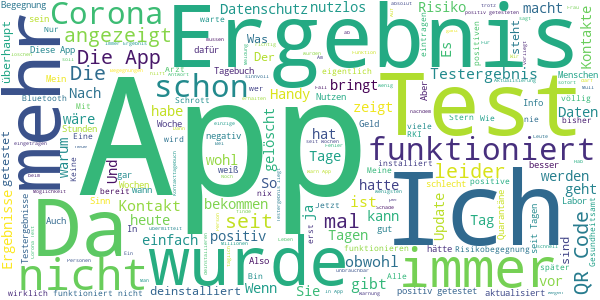

> Schwesig bringt Kohl-Liebchen aus der Fassung. Aber ihr kaltes Herz schlägt (...) weiter. Kohl-Liebchen auf BPK: es sei "nicht interessant, wieviel Impfstoff wir bestellt haben." = Volk, Schnauze! Die Ministerkonf. sind Ermächtigung pur. Es gibt keine epidemische Lage von nationaler Tragweite. Das Kartell aus CDU, CSU, SPD, LINKE=MauermörderSED, B90/GRÜNE, FDP arbeitet seit spät. 2015 gegen Deutschland. Die nächste Sozialismus-Diktatur nimmt Fahrt auf. Alles schon wieder vergessen? _Wahlen_2021_  :date: __2021-01-23 13:07:25__

> Eure Schrott App war von Anfang an ein Flop immer wieder neue Fehler jetzt wird der Akku leer gefressen und andere Apps funktionieren nicht mehr ihr müsst die app zurücknehmen und das Geld zurückzahlen hier werden Steuermittel verschwendet  :date: __2021-01-23 12:59:01__

> Mein mit im Hausstand lebender Partner wurde positiv getestet und hat dies auch in der App angegeben. Bis heute zeigt mir meine App ein niedriges Risiko und keine Risikokontakte an. Bereits vor mehreren Wochen hatte ich plötzlich 7 Risikobegegnungen, eine Pushup Nachricht erhielt ich jedoch nicht, sondern sah die Warnung zufällig beim öffnen der App. Diese Risikobegegnungen stelle ich jedoch aufgrund meiner Kontakte auch in Frage. Gute Idee, funktioniert nur nicht wie sie soll.  :date: __2021-01-23 11:08:16__

> Hatte die App installiert um mein Testergebnis zu erhalten. Selbes Problem wie so oft. Gesundheitsamt hat angerufen aber in der App steht weiterhin das Testergebnis läge nicht vor. Wenn das System nicht funktioniert dann bitte diesen Service auch nicht anbieten. Mir ist klar dass hier wirklich auf Kante gearbeitet wird aber so macht das jedenfalls keinen Sinn.  :date: __2021-01-23 10:46:35__

> Eigentlich null Sterne. Hab mein Ergebnis vom test seit dem 20.01. vom Arzt und in der App steht immernoch Ergebnis liegt noch nicht vor. Wenn man die Pandemie wirskam bekämpfen will muss auch sowas funktionieren.  :date: __2021-01-23 10:34:42__

> Gute Idee bringt aber null. Wenn niemand einträgt das er postiv ist bzw ohne Smartphone einkaufen geht macht das keinen Sinn.  :date: __2021-01-23 10:21:45__

> Die ist bißchen  :date: __2021-01-23 09:39:12__

> Die Risikobewertung besitzt keine Aussagekraft und wiegt den Nutzer in falscher Sicherheit. Ich arbeite beruflich in Coronatestteams und im Rettungsdienst. Trotz ständigem Kontakt mit positiven Patienten werden mir NULL Risikokontakte angezeigt. Ich würde aber Mal behaupten, dass ich einem erhöhten bis hohem Risiko ausgesetzt bin. Der letzte Stern bleibt für die Testfunktion. Die PCR Teste meiner Kontrollabstriche wurden immer einwandfrei erfasst und die Ergebnisse mitgeteilt.  :date: __2021-01-23 09:16:24__

> Ganz ehrlich? Bei mir an der arbeit 9 Fälle, 1 Kollege hat es mindestens eingetragen, aber es wird einfach nichts angezeigt  :date: __2021-01-23 09:14:43__

> Ist schon merkwürdig, hatte Kontakt mit einer Person. Aber es ist alles grün. Naja .Man hat es versucht und der App eine Chance gegeben. Nun heißt es ab in den Müll damit.  :date: __2021-01-23 09:03:19__

