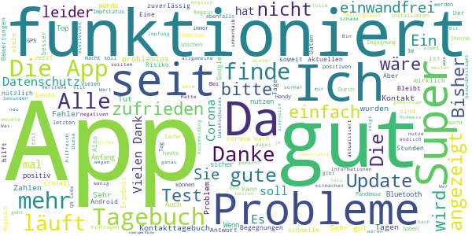
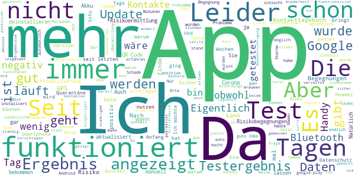
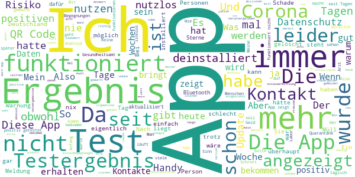

# Corona-Warn-App
App version ``1.10.1``

Analyzed with [covid-apps-observer](http://github.com/covid-apps-observer) project, version ``0.1``

## App overview
| | |
|-------------------------|-------------------------| 
| **Name**&nbsp;&nbsp;&nbsp;&nbsp;&nbsp;&nbsp;&nbsp;&nbsp;&nbsp;&nbsp;&nbsp;&nbsp;&nbsp;&nbsp;&nbsp;&nbsp;&nbsp;&nbsp;&nbsp;&nbsp;&nbsp;&nbsp;&nbsp;&nbsp;&nbsp;&nbsp;&nbsp;&nbsp;&nbsp;&nbsp;&nbsp;&nbsp;&nbsp;&nbsp;&nbsp;&nbsp;&nbsp;&nbsp;&nbsp;&nbsp;  | Corona-Warn-App |
| **Unique identifier** | de.rki.coronawarnapp |
| **Link to Google Play** | [https://play.google.com/store/apps/details?id=de.rki.coronawarnapp](https://play.google.com/store/apps/details?id=de.rki.coronawarnapp) |
| **Summary**  | Gemeinsam Corona bekämpfen |
| **Privacy policy** | [https://www.coronawarn.app/assets/documents/cwa-privacy-notice-de.pdf](https://www.coronawarn.app/assets/documents/cwa-privacy-notice-de.pdf) |
| **Latest version** | 1.10.1 |
| **Last update** | 2020-12-21 18:46:22 |
| **Recent changes** | Dieses Update enthält Fehlerbehebungen sowie Anpassungen der App-Texte. Im Kontakt-Tagebuch können Sie für je 14 Tage ein Datum und den Ort, an dem Sie sich aufgehalten haben, oder die Person, der Sie begegnet sind, erfassen. Diese Informationen können Sie im Rahmen der Kontaktnachverfolgung im Falle eines positiven Corona-Tests nutzen. |
| **Installs**  | 10.000.000+ |
| **Category** | Gesundheit & Fitness |
| **First release** | 12.06.2020 |
| **Size**  | 22M |
| **Supported Android version**  | 6.0 oder höher |

### Description
> Das Robert Koch-Institut (RKI) als zentrale Einrichtung des Bundes im Bereich der Öffentlichen Gesundheit und als nationales Public-Health-Institut veröffentlicht die Corona-Warn-App für die deutsche Bundesregierung und für die Bundesrepublik Deutschland. Die App fungiert als digitale Ergänzung zu Abstandhalten, Hygiene und Alltagsmaske. Wer sie nutzt, hilft, Infektionsketten schnell nachzuverfolgen und zu durchbrechen. Die App merkt sich dezentral unsere Begegnungen mit anderen und informiert uns digital, wenn wir Begegnungen mit nachweislich infizierten Personen hatten. Dabei sammelt sie jedoch zu keiner Zeit Informationen zur Identität ihrer Nutzerinnen und Nutzer. Wer wir sind und wo wir sind, bleibt geheim – und unsere Privatsphäre bestens geschützt.
 WIE DIE APP FUNKTIONIERT
 Sind wir unterwegs, sollte die Risiko-Ermittlung immer aktiviert sein. Denn sie ist das Herzstück der Software. Wann immer sich Nutzerinnen und Nutzer begegnen, tauschen ihre Smartphones über Bluetooth verschlüsselte Zufallscodes aus. 
 Diese geben nur Auskunft darüber, über welche Dauer und mit welchem Abstand eine Begegnung stattfand. Welche Person sich hinter einem Code verbirgt, ist für niemanden nachvollziehbar. Die Corona-Warn-App erhebt keine Informationen über den Ort der Begegnung oder den Standort der Nutzerinnen und Nutzer.
 Entsprechend der maximalen Corona-Inkubationszeit werden alle Zufallscodes, die unser Smartphone sammelt, für 14 Tage auf dem Smartphone gespeichert – und dann gelöscht. 
 Nur wenn eine Person sich über die App freiwillig als nachweislich infiziert meldet, erhalten daraufhin alle früheren Begegnungen eine Warnung auf ihr Smartphone. 
 Niemand erfährt, wann, wo oder mit wem eine entsprechende Risiko-Begegnung stattfand. Die infizierte Person bleibt anonym.
 Mit der Benachrichtigung erhalten die betroffenen Nutzer/-innen klare Handlungsempfehlungen. Wichtig: Auch die Daten der Benachrichtigten sind zu keiner Zeit einsehbar.
 WIE DIE DATEN SICHER BLEIBEN
 Die Corona-Warn-App soll uns zwar täglich begleiten. Sie wird uns jedoch nie kennenlernen. Dadurch kann sie niemandem verraten, wer wir sind. Der Datenschutz bleibt über die gesamte Nutzungsdauer zu 100 Prozent gewahrt.
 • Keine Anmeldung: Es müssen keine E-Mail-Adresse und kein Name hinterlegt werden.
 • Keine Rückschlüsse auf Identitäten: Bei einer Begegnung mit einem anderen Menschen tauschen die Smartphones nur Zufallscodes aus. Diese messen, über welche Dauer und mit welchem Abstand ein Kontakt stattfand. Sie lassen aber keine Rückschlüsse auf Personen und Standorte zu. 
 • Dezentrale Speicherung: Die Daten werden nur auf dem Smartphone gespeichert und nach 14 Tagen gelöscht.
 • Keine Einsicht für Dritte: Sowohl die Personen, die eine nachgewiesene Infektion melden, als auch die Benachrichtigten sind nicht nachverfolgbar – nicht für die Bundesregierung, nicht für das Robert Koch-Institut, nicht für andere User und auch nicht für die Betreiber der App-Stores.
 Diese App ist nicht zum Gebrauch außerhalb Deutschlands bestimmt. Die Corona-Warn-App ist die zentrale COVID-19 App für Deutschland und sie ist an das deutsche Gesundheitssystem angeschlossen. Trotzdem ist die Corona-Warn-App auch in diesem Land verfügbar. Sie ist gedacht für alle, die in Deutschland leben, arbeiten, Urlaub machen oder sich regelmäßig oder über längere Zeit in Deutschland aufhalten.
 Es gelten die Nutzungsbedingungen der Corona-Warn-App: https://www.coronawarn.app/assets/documents/cwa-eula-de.pdf. Durch die Installation und Nutzung dieser App stimmen Sie den Nutzungsbedingungen zu.

### User interface
The developers of the app provide the following screenshots in the Google play store.
| | | |
|:-------------------------:|:-------------------------:|:-------------------------:|
 |   |   |   | 
 |   |   |   | 
 |  

## Development team
In the following we report the main information provided by the development team in the Google play store.

| | |
|-------------------------|-------------------------|
| **Developer**  | Robert Koch-Institut |
| **Website**  | [https://www.coronawarn.app](https://www.coronawarn.app) |
| **Email** | CoronaWarnApp@rki.de |
| **Physical address**  | [Robert Koch-Institut Nordufer 20 13353 Berlin](https://www.google.com/maps/search/Robert%20Koch-Institut%20Nordufer%2020%2013353%20Berlin) (Google Maps) |
| **Other developed apps**  | [https://play.google.com/store/apps/developer?id=Robert+Koch-Institut](https://play.google.com/store/apps/developer?id=Robert+Koch-Institut) |

## Android support

| | |
|-------------------------|-------------------------|
| **Declared target Android version**  | Android10, version 10 (API level 29) |
| **Effective target Android version**  | Android10, version 10 (API level 29) |
| **Minimum supported Android version**  | Marshmallow, version 6.0 (API level 23) |
| **Maximum target Android version**  | - |

The larger the difference between the minimum and maximum supported Android versions, the better. A larger difference means a wider audience. For example, old phones have a very low Android version, so a high minimum supported Android version means that the app cannot be used by users with old phones, thus leading to accessibility problems. 

## Requested permissions

In the following we report the complete list of the permissions requested by the app. 

| **Permission** | **Protection level** | **Description** | 
|-------------------------|-------------------------|-------------------------|
 **android.permission ACCESS_NETWORK_STATE** | Normal | Allows applications to access information about networks. 
 **android.permission BLUETOOTH** | Normal | Allows applications to connect to paired bluetooth devices. 
 **android.permission CAMERA** | :warning:**Dangerous** | Required to be able to access the camera device. 
 **android.permission FOREGROUND_SERVICE** | Normal | Allows a regular application to use Service.startForeground. 
 **android.permission INTERNET** | Normal | Allows applications to open network sockets. 
 **android.permission RECEIVE_BOOT_COMPLETED** | Normal | Allows an application to receive the Intent.ACTION_BOOT_COMPLETED that is broadcast after the system finishes booting. 
 **android.permission REQUEST_IGNORE_BATTERY_OPTIMIZATIONS** | Normal | Permission an application must hold in order to use Settings.ACTION_REQUEST_IGNORE_BATTERY_OPTIMIZATIONS. 
 **android.permission WAKE_LOCK** | Normal | Allows using PowerManager WakeLocks to keep processor from sleeping or screen from dimming. 

## Mentioned servers

| **Server** | **Registrant** | **Registrant country** | **Creation date** | 
|-------------------------|-------------------------|-------------------------|-------------------------|
 | google.com | Google LLC | :us: US | 1997-09-15 04:00:00 |

## Security analysis 

Below we report the main security warnings raised by our execution of the [Androwarn](https://github.com/maaaaz/androwarn) security analysis tool.

**Connection interfaces exfiltration**
> - This application reads details about the currently active data network 
> - This application tries to find out if the currently active data network is metered 

**Telephony services abuse**
> - This application makes phone calls 

**Suspicious connection establishment**
> - This application opens a Socket and connects it to the remote address '; port is out of range' on the 'N/A' port  
> - This application opens a Socket and connects it to the remote address 'Lcom/android/tools/r8/GeneratedOutlineSupport;->outline20(Ljava/lang/String;)Ljava/lang/StringBuilder;' on the 'N/A' port  
> - This application opens a Socket and connects it to the remote address 'Ljava/net/Proxy;->type()Ljava/net/Proxy$Type;' on the 'N/A' port  
> - This application opens a Socket and connects it to the remote address 'Method sendUrgentData() is not supported.' on the 'N/A' port  
> - This application opens a Socket and connects it to the remote address 'Method setHandshakeTimeout() is not supported.' on the 'N/A' port  
> - This application opens a Socket and connects it to the remote address 'Method setOOBInline() is not supported.' on the 'N/A' port  
> - This application opens a Socket and connects it to the remote address 'Method setSoWriteTimeout() is not supported.' on the 'N/A' port  
> - This application opens a Socket and connects it to the remote address 'Socket closed' on the 'N/A' port  
> - This application opens a Socket and connects it to the remote address 'Socket is closed' on the 'N/A' port  
> - This application opens a Socket and connects it to the remote address 'Socket is closed.' on the 'N/A' port  
> - This application opens a Socket and connects it to the remote address 'Socket is not connected.' on the 'N/A' port  
> - This application opens a Socket and connects it to the remote address 'socket is closed' on the 'N/A' port  
> - This application opens a Socket and connects it to the remote address 'timeout' on the 'N/A' port  

**Code execution**
> - This application loads a native library 
> - This application loads a native library: 'conscrypt_gmscore_jni' 
> - This application loads a native library: 'conscrypt_jni' 

## User ratings and reviews

Below we provide information about how end users are reacting to the app in terms of ratings and reviews in the Google Play store.

### Ratings

The Corona-Warn-App app has been installed by more than **10000000** times. At this time, **105061** rated the app and its average score is **3.0555608**. Below we show the distribution of the ratings across the usual star-based rating of Google Play

:star::star::star::star::star:: 38627

:star::star::star::star:: 10641

:star::star::star:: 10099

:star::star:: 9331

:star:: 36363

### Reviews 

#### 5-star reviews

> 👍  :date: __2021-01-16 18:15:41__

> Kein Risiko mehr, liegt vielleicht auch daran das ich meine Kontakte sehr reduziert habe und wir uns quasi nur noch online sehen. Hatte vor einer Woche eine niedrige Begegnung, seitdem alles heruntergefahren und alles Tip top!  :date: __2021-01-16 16:25:53__

> Danke für das Kontakttagebuch  :date: __2021-01-16 16:14:26__

> Installation läuft reibungslos. Die Bedienung und Einstellungen sind leicht und übersichtlich. Hinweis: Die Berechtigung, Fotos zu machen, ist notwendig, um den QR-Code vom Arzt scannen zu können. Edit: Die Energieeinstellungen müssen angepasst werden, damit die App sich weiterhin aktualisiert.  :date: __2021-01-16 14:01:49__

> Alles ok. Kontakttagebuch eine praktische Ergänzung. Besser wäre natürlich, wenn einfach jede/r diese App benutzen würde!  :date: __2021-01-16 13:42:45__

> Bei mir läuft die App einwandfrei. Danke!  :date: __2021-01-16 13:13:30__

> Die App lädt seit Tagen . Up date gibt es nicht. So völlig unbrauchbar. Ps 16.01 App läuft nach Neustart. Danke.  :date: __2021-01-16 10:29:01__

> Super  :date: __2021-01-16 09:46:19__

> Hat zuverlässig gewarnt.  :date: __2021-01-16 03:11:57__

> Läuft gut das App  :date: __2021-01-15 23:27:46__

#### 4-star reviews

> Sollte sie mal fertig werden könnte sie besser sein aber durch Datenschutzbestimmungen sehr eingeschränkt. Die die am lautesten schreien geben aber alles über Twitter Facebook und Paypal ins Netz und haben damit keine Probleme leider oft alles zuzeigen aber lebenswichtigen Schutz für sich und andere da pochen sie auf Datenschutz  :date: __2021-01-16 14:11:26__

> Ohne Datum der Begegnung wenig hilfreich  :date: __2021-01-16 12:36:54__

> Warum gibt es keine Möglichkeit den QR-Code aus E-Mails direkt zu scannen, ohne Kamera. Man braucht immer ein zweites Handy oder einen Rechner an den man die Email erst weiterleitet um die dann von einem anderen Bildschirm scannen zu können. Wäre auch praktisch wenn die App die täglich aktuellen Corona Regeln und Gesetze anzeigen könnte. Am besten für das eigene Bundesland.  :date: __2021-01-15 23:46:41__

> Eine solide App, die ihren Sinn erfüllt. Die Angabe, ob man geimpft wurde wäre vielleicht hilfreich.  :date: __2021-01-15 23:08:47__

> Die Tagebuch-Option ist grundsätzlich prima. Wenn ich aber auch einmalige Kontakte/Orte eintrage (gerade das wäre sehr sinnvoll, die regelmäßigen kennt man ohnehin), wird die Liste unübersichtlich lang. Man müsste einzelne auch wieder aus der Liste löschen können!  :date: __2021-01-15 17:00:24__

> Warn App funktioniert wieder. Danke an RKI für die prompte Antwort. Cache leeren und Smartphone neu starten hat geklappt. Der Fehler war das die App nicht aufhörte Daten zu laden.  :date: __2021-01-15 16:11:15__

> App läuft seit 13.01.2021 ununterbrochen im Überprüfungsmodus. Hielt die App für sinnvoll, aber jetzt werde ich sie löschen, da nur der Akkuverbrauch steigt. Schade, alles nicht wirklich durchdacht.  :date: __2021-01-15 13:05:53__

> Diese App habe ich von Anfang an installiert. Vor ein paar Tagen gab es Schwierigkeiten mit der Überprüfung. Seitdem kann ich in google nicht mehr nachvollziehen, wie viele mögliche Kontakte überprüft werden.  :date: __2021-01-15 10:00:20__

> Das Kontakttagebuch könnte verbessert werden: die angelegten Orte und Personen können, einmal abgespeichert, nicht gelöscht oder korrigiert werden. Und der selbst angelegte Orte-/Personenkatalog läuft schnell voll (auch hier sollte ein Löschen möglich sein. Sonst wird die Auswahl unübersichtlich.  :date: __2021-01-14 20:09:39__

> 1. Daten konnten 1-2 Tage nicht zu Ende heruntergeladen werden, hier wäre ein timeout und eine Fehlermeldung über gestörte Server angebracht. 2. Wahrscheinlichleit dass die App einen Coronafall meldet bei 25% dt. Nutzern: 25% * 25% = nur etwa 6%! Um diesen Wert zu erhöhen, sollten hier u. in der öffentlichen Werbung f. diese App ALLE Voraussetzungen klar aufgelistet werden: min. OS-Version, App ist installiert, Bluetooth u. Ortungsdienste an, Internet 1x täglich an  :date: __2021-01-14 19:45:35__

#### 3-star reviews

> Bring mir nicht viel, dann ist es zu später  :date: __2021-01-16 16:13:34__

> Auch nach Update auf V 1.10.1 am 14.1. aktualisiert sich die App nicht. Letzte Aktualisierung am 12.1.. Android 8.1.0. Hotline ist so was von hilflos, der Rat "Beenden erzwingen und dann läuft sie wieder" hat nichts gebracht.  :date: __2021-01-16 14:43:11__

> Wenn man das Testergebnis löscht ,dann kann man den QR Code auf dem selben Gerät nicht mehr einlesen ,weil dieser abgelaufen oder schon registriert ist. Auf dem selben Gerät sollte dieses schon möglich sein  :date: __2021-01-16 10:10:44__

> Diese App lohnt sich nur beim Einkaufen und Reisen. Wenn Menschen, die zum Beispiel positiv getestet wurden, sofort diese App installieren und ihre aktuellen Daten eingegeben, wäre das gut für die Auswertung.  :date: __2021-01-16 09:35:28__

> Eigentlich ganz okay aber, ich kann nicht meine Ergebnisse eintragen, ich werde in regelmäßigen Abständen von meinem Arbeitgeber angestrichen und im Haus internen Labor wird dann der Abstrich untersucht, ich bekomme dann eine SMS wo ich mein Ergebnis einsehen kann, leider kann eben dieses Ergebnis nicht in die App eintragen! Deswegen nur 3 Sterne  :date: __2021-01-16 03:37:31__

> An sich eine gute Idee. Aber ich denke, dass in Anbetracht der Virusmutationen, die ja eine schnellere Infektion verursachen sollen, die Parameter der Kontaktanalyse (Entfernung, Kontaktdauer) angepasst werden müssen.  :date: __2021-01-15 22:09:12__

> Seit Mittwoch lässt sich die Risiko-Ermittlung nicht mehr aktualisieren. Wie kann der Fehler behoben werden.Wenn  :date: __2021-01-15 22:00:35__

> Ich würde Mal sagen die diese App würde ich mich nie runter laden also  :date: __2021-01-15 20:19:20__

> Hatte heute die Meldung: 1 Begegnung mit niedrigen Risiko. Diese Person wurde auch positiv auf Corona getestet. Nach dem ich das neueste Update gerade geladen habe. Kommt die Meldung: kein Risiko-Begnung. ?? Was stimmt denn nun. Hatte ich eine Begegnung oder nicht ....  :date: __2021-01-15 17:23:23__

> Wenn Sie geht ist sie super  :date: __2021-01-15 16:26:06__

#### 2-star reviews

> Seit November zeigt die immer grün an keine Anzeige mit kein gringer verdacht  :date: __2021-01-16 14:14:00__

> Zur Zeit erscheint bei anschalten nur das Logo und sonst passiert nix. Neu installieren angebracht?  :date: __2021-01-16 13:44:47__

> Keine Ergebniseingabe ohne QR -Code möglich.  :date: __2021-01-16 12:41:41__

> Leider werden die Tests die nicht beim Gesundheitsamt gemacht wurden nicht ausgewertet und man kann sie auch nicht eingeben. Erst wenn man einen Code vom Gesundheitsamt bekommt, kann das positive Ergebnis anzeigt werden. In den meisten Fällen ist man bis dahin wieder genesen. Warum kann das Ergebnis von anderen Laboren nicht eingegeben werden, um einen schnellen Schutz zu zu bieten?  :date: __2021-01-16 12:25:44__

> Die App geht immer nich nicht wieder auf dem S10. Im Play store gibt es auch keine aktuelle Version trotz gegenteiligen Behauptungen von google  :date: __2021-01-16 12:01:33__

> Bei mir läuft die Aktualisierung bis heute (16.1.21) noch nicht wieder. So macht die App keinen Sinn... Danke, der Neustart hat geholfen.  :date: __2021-01-16 09:59:22__

> Sie ist da +3, arbeitet auf meinen Moto Z2 Force +1. Macht Meldungen +1. Meldungen sind irritierend. Ampelsystem entspricht nicht meiner Risikobewertung -1. Hilft nicht eine reflektierte Selbsteinschätzung zu machen -1. Hält seit Monaten technische Schwierigkeiten vor und ändert nichts an der Umsetzung-2 Gestern hatte ich die zweite Begegnung in 14 Tagen und ich weiß noch nicht Mal wann. 2 Sterne  :date: __2021-01-15 22:14:38__

> Naja was soll man sagen... die meisten haben ja schon erwähnt wieso diese App so wenig Sterne bekommt. Bei mir hängt sie immer und lädt nicht und komischerweise seit dem ich die App nicht mehr habe, hält der Akku auch wieder länger .  :date: __2021-01-15 21:23:50__

> "Daten werden heruntergeladen..das kann mehrere Minuten dauern. Vielen Dank für Ihre Geduld." Von wegen Minuten. Meine Geduld wird jetzt seit 3 Tagen getestet. Kein Ende in Sicht. Was soll das?  :date: __2021-01-15 21:00:15__

> Nicht nachvollziehbare Meldungen, keine Hotline verfügbar  :date: __2021-01-15 18:23:19__

#### 1-star reviews

> Der Tiger ohne Zähne.... Schade für das verschwendete Steuergeld.....  :date: __2021-01-16 19:03:11__

> Der letzte Mist. Und hierfür hat der Steuerzahler Millionen bezahlt. Nicht 1 Stern wert. Auf die Frage vom Robert-Koch-Institut..nein ich habe keine Fehlermeldung. Ich kann den Sinn dieser App nicht nachvollziehen. Außer das die App den Speicherplatz meines Handys belegt tut sie sonst nichts. Ich hatte denifitiv Kontakt mit einer positiven Person und was macht die App, sagt mir das ich keine bedrohte Begegnung hatte. Ich habe einen Test gemacht. Alles o.k. Also was hat die App gemacht....nichts!  :date: __2021-01-16 18:58:05__

> Totaler Schrott. Seit Wochen Fehler 4000. Fehler tritt wohl auf, wenn auf den RKI Server zugegriffen wird und dieser null liefert. 65 Mio. sind nicht schlecht für eine APP, die stoisch immer die gleiche Fehlermeldung liefert . War leider bei der Einbindung von SAP und den Telekomikern zu erwarten. Hab mir jetzt mal die anderen Rezessionen angesehen. Macht wohl keinen Sinn mehr, den Schrott weiterlaufen zu lassen. Werde die APP jetzt löschen. Schämt euch für den Schrott.  :date: __2021-01-16 18:48:39__

> Sinnlose App. Nach hochgelobten Updates werden keine Kontakte mehr angezeigt was angesichts der Lage in Sachsen sehr unwahrscheinlich ist wenn man mit dem öpnv fahren muss. Da ich mich an Kontaktbeschrännumgem halte brauch ich diese sinnlos-app nicht mehr...nach 9 Monaten deinstalliert  :date: __2021-01-16 18:28:58__

> Völlig unzureichend! 3 Familienmitglieder positiv und es wird mir nicht angezeigt. Ich war in unmittelbarer Nähe.  :date: __2021-01-16 17:40:33__

> Bringt nichts Gutes, gar nichts.  :date: __2021-01-16 17:37:19__

> App bringt nichts. Infektionsraten steigen und steigen. Update: Einfach nur Wahnsinn wie die Steuergelder verschwendet wurden und SAP sich eine goldene Nase verdient  :date: __2021-01-16 17:32:28__

> Grottenschlecht gemacht. Hauptsache der Datenschutz wird beachtet. Wer macht sich denn die Mühe und gibt ein positives Testergebnis ein? Der deutsche Besserwisser, der trotz Quarantäne im Discounter einkauft bestimmt nicht.  :date: __2021-01-16 16:47:04__

> Dient dem Start hauptsächlich als Überwachungs App und wird dem user die sich für die app entscheidet unter einem anderen Vorwand als ich früh warn App angeben In Wirklichkeit erhält der staat weitere Informationen die dazu beitragen weitere schlimmere Maßnahmen durch zu setzen wie man ja mittlerweile feststellen an den sinnlosen überzogen Massnahmen Eigentlich wollte ich gar keinen bewertungsstern aber aber sonst hätte ich keine Bewertungen schreiben können  :date: __2021-01-16 15:52:15__

> Habe die Corona-Warn-App seit dem Erscheinen im letzten Jahr nun zum vierten Mal auf meinem Samsung S20 deinstalliert und wieder neu installiert. Grund: Seit 2 Tagen lief nun schon die Aktualisierung der Daten!!! Dies ist wirklich sehr enttäuschend ☹! Ganz zu schweigen vom Aufwand, fehlen nun wieder alle Kontakte der letzten 14 Tage! Wie soll uns diese App wirklich bei der Bekämpfung der Pandemie helfen???  :date: __2021-01-16 15:51:38__

