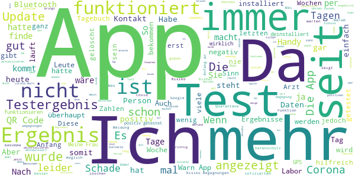

# Corona-Warn-App
App version ``1.10.1``

Analyzed with [covid-apps-observer](http://github.com/covid-apps-observer) project, version ``0.1``

## App overview
| | |
|-------------------------|-------------------------| 
| **Name**&nbsp;&nbsp;&nbsp;&nbsp;&nbsp;&nbsp;&nbsp;&nbsp;&nbsp;&nbsp;&nbsp;&nbsp;&nbsp;&nbsp;&nbsp;&nbsp;&nbsp;&nbsp;&nbsp;&nbsp;&nbsp;&nbsp;&nbsp;&nbsp;&nbsp;&nbsp;&nbsp;&nbsp;&nbsp;&nbsp;&nbsp;&nbsp;&nbsp;&nbsp;&nbsp;&nbsp;&nbsp;&nbsp;&nbsp;&nbsp;  | Corona-Warn-App |
| **Unique identifier** | de.rki.coronawarnapp |
| **Link to Google Play** | [https://play.google.com/store/apps/details?id=de.rki.coronawarnapp](https://play.google.com/store/apps/details?id=de.rki.coronawarnapp) |
| **Summary**  | Gemeinsam Corona bekämpfen |
| **Privacy policy** | [https://www.coronawarn.app/assets/documents/cwa-privacy-notice-de.pdf](https://www.coronawarn.app/assets/documents/cwa-privacy-notice-de.pdf) |
| **Latest version** | 1.10.1 |
| **Last update** | 2020-12-21 18:46:22 |
| **Recent changes** | Dieses Update enthält Fehlerbehebungen sowie Anpassungen der App-Texte. Im Kontakt-Tagebuch können Sie für je 14 Tage ein Datum und den Ort, an dem Sie sich aufgehalten haben, oder die Person, der Sie begegnet sind, erfassen. Diese Informationen können Sie im Rahmen der Kontaktnachverfolgung im Falle eines positiven Corona-Tests nutzen. |
| **Installs**  | 10.000.000+ |
| **Category** | Gesundheit & Fitness |
| **First release** | 12.06.2020 |
| **Size**  | 22M |
| **Supported Android version**  | 6.0 oder höher |

### Description
> Das Robert Koch-Institut (RKI) als zentrale Einrichtung des Bundes im Bereich der Öffentlichen Gesundheit und als nationales Public-Health-Institut veröffentlicht die Corona-Warn-App für die deutsche Bundesregierung und für die Bundesrepublik Deutschland. Die App fungiert als digitale Ergänzung zu Abstandhalten, Hygiene und Alltagsmaske. Wer sie nutzt, hilft, Infektionsketten schnell nachzuverfolgen und zu durchbrechen. Die App merkt sich dezentral unsere Begegnungen mit anderen und informiert uns digital, wenn wir Begegnungen mit nachweislich infizierten Personen hatten. Dabei sammelt sie jedoch zu keiner Zeit Informationen zur Identität ihrer Nutzerinnen und Nutzer. Wer wir sind und wo wir sind, bleibt geheim – und unsere Privatsphäre bestens geschützt.
 WIE DIE APP FUNKTIONIERT
 Sind wir unterwegs, sollte die Risiko-Ermittlung immer aktiviert sein. Denn sie ist das Herzstück der Software. Wann immer sich Nutzerinnen und Nutzer begegnen, tauschen ihre Smartphones über Bluetooth verschlüsselte Zufallscodes aus. 
 Diese geben nur Auskunft darüber, über welche Dauer und mit welchem Abstand eine Begegnung stattfand. Welche Person sich hinter einem Code verbirgt, ist für niemanden nachvollziehbar. Die Corona-Warn-App erhebt keine Informationen über den Ort der Begegnung oder den Standort der Nutzerinnen und Nutzer.
 Entsprechend der maximalen Corona-Inkubationszeit werden alle Zufallscodes, die unser Smartphone sammelt, für 14 Tage auf dem Smartphone gespeichert – und dann gelöscht. 
 Nur wenn eine Person sich über die App freiwillig als nachweislich infiziert meldet, erhalten daraufhin alle früheren Begegnungen eine Warnung auf ihr Smartphone. 
 Niemand erfährt, wann, wo oder mit wem eine entsprechende Risiko-Begegnung stattfand. Die infizierte Person bleibt anonym.
 Mit der Benachrichtigung erhalten die betroffenen Nutzer/-innen klare Handlungsempfehlungen. Wichtig: Auch die Daten der Benachrichtigten sind zu keiner Zeit einsehbar.
 WIE DIE DATEN SICHER BLEIBEN
 Die Corona-Warn-App soll uns zwar täglich begleiten. Sie wird uns jedoch nie kennenlernen. Dadurch kann sie niemandem verraten, wer wir sind. Der Datenschutz bleibt über die gesamte Nutzungsdauer zu 100 Prozent gewahrt.
 • Keine Anmeldung: Es müssen keine E-Mail-Adresse und kein Name hinterlegt werden.
 • Keine Rückschlüsse auf Identitäten: Bei einer Begegnung mit einem anderen Menschen tauschen die Smartphones nur Zufallscodes aus. Diese messen, über welche Dauer und mit welchem Abstand ein Kontakt stattfand. Sie lassen aber keine Rückschlüsse auf Personen und Standorte zu. 
 • Dezentrale Speicherung: Die Daten werden nur auf dem Smartphone gespeichert und nach 14 Tagen gelöscht.
 • Keine Einsicht für Dritte: Sowohl die Personen, die eine nachgewiesene Infektion melden, als auch die Benachrichtigten sind nicht nachverfolgbar – nicht für die Bundesregierung, nicht für das Robert Koch-Institut, nicht für andere User und auch nicht für die Betreiber der App-Stores.
 Diese App ist nicht zum Gebrauch außerhalb Deutschlands bestimmt. Die Corona-Warn-App ist die zentrale COVID-19 App für Deutschland und sie ist an das deutsche Gesundheitssystem angeschlossen. Trotzdem ist die Corona-Warn-App auch in diesem Land verfügbar. Sie ist gedacht für alle, die in Deutschland leben, arbeiten, Urlaub machen oder sich regelmäßig oder über längere Zeit in Deutschland aufhalten.
 Es gelten die Nutzungsbedingungen der Corona-Warn-App: https://www.coronawarn.app/assets/documents/cwa-eula-de.pdf. Durch die Installation und Nutzung dieser App stimmen Sie den Nutzungsbedingungen zu.

### User interface
The developers of the app provide the following screenshots in the Google play store.
| | | |
|:-------------------------:|:-------------------------:|:-------------------------:|
 |   |   |   | 
 |   |   |   | 
 |  

## Development team
In the following we report the main information provided by the development team in the Google play store.

| | |
|-------------------------|-------------------------|
| **Developer**  | Robert Koch-Institut |
| **Website**  | [https://www.coronawarn.app](https://www.coronawarn.app) |
| **Email** | CoronaWarnApp@rki.de |
| **Physical address**  | [Robert Koch-Institut Nordufer 20 13353 Berlin](https://www.google.com/maps/search/Robert%20Koch-Institut%20Nordufer%2020%2013353%20Berlin) (Google Maps) |
| **Other developed apps**  | [https://play.google.com/store/apps/developer?id=Robert+Koch-Institut](https://play.google.com/store/apps/developer?id=Robert+Koch-Institut) |

## Android support

| | |
|-------------------------|-------------------------|
| **Declared target Android version**  | Android10, version 10 (API level 29) |
| **Effective target Android version**  | Android10, version 10 (API level 29) |
| **Minimum supported Android version**  | Marshmallow, version 6.0 (API level 23) |
| **Maximum target Android version**  | - |

The larger the difference between the minimum and maximum supported Android versions, the better. A larger difference means a wider audience. For example, old phones have a very low Android version, so a high minimum supported Android version means that the app cannot be used by users with old phones, thus leading to accessibility problems. 

## Requested permissions

In the following we report the complete list of the permissions requested by the app. 

| **Permission** | **Protection level** | **Description** | 
|-------------------------|-------------------------|-------------------------|
 **android.permission ACCESS_NETWORK_STATE** | Normal | Allows applications to access information about networks. 
 **android.permission BLUETOOTH** | Normal | Allows applications to connect to paired bluetooth devices. 
 **android.permission CAMERA** | :warning:**Dangerous** | Required to be able to access the camera device. 
 **android.permission FOREGROUND_SERVICE** | Normal | Allows a regular application to use Service.startForeground. 
 **android.permission INTERNET** | Normal | Allows applications to open network sockets. 
 **android.permission RECEIVE_BOOT_COMPLETED** | Normal | Allows an application to receive the Intent.ACTION_BOOT_COMPLETED that is broadcast after the system finishes booting. 
 **android.permission REQUEST_IGNORE_BATTERY_OPTIMIZATIONS** | Normal | Permission an application must hold in order to use Settings.ACTION_REQUEST_IGNORE_BATTERY_OPTIMIZATIONS. 
 **android.permission WAKE_LOCK** | Normal | Allows using PowerManager WakeLocks to keep processor from sleeping or screen from dimming. 

## Mentioned servers

| **Server** | **Registrant** | **Registrant country** | **Creation date** | 
|-------------------------|-------------------------|-------------------------|-------------------------|
 | google.com | Google LLC | :us: US | 1997-09-15 04:00:00 |

## Security analysis 

Below we report the main security warnings raised by our execution of the [Androwarn](https://github.com/maaaaz/androwarn) security analysis tool.

**Connection interfaces exfiltration**
> - This application reads details about the currently active data network 
> - This application tries to find out if the currently active data network is metered 

**Telephony services abuse**
> - This application makes phone calls 

**Suspicious connection establishment**
> - This application opens a Socket and connects it to the remote address '; port is out of range' on the 'N/A' port  
> - This application opens a Socket and connects it to the remote address 'Lcom/android/tools/r8/GeneratedOutlineSupport;->outline20(Ljava/lang/String;)Ljava/lang/StringBuilder;' on the 'N/A' port  
> - This application opens a Socket and connects it to the remote address 'Ljava/net/Proxy;->type()Ljava/net/Proxy$Type;' on the 'N/A' port  
> - This application opens a Socket and connects it to the remote address 'Method sendUrgentData() is not supported.' on the 'N/A' port  
> - This application opens a Socket and connects it to the remote address 'Method setHandshakeTimeout() is not supported.' on the 'N/A' port  
> - This application opens a Socket and connects it to the remote address 'Method setOOBInline() is not supported.' on the 'N/A' port  
> - This application opens a Socket and connects it to the remote address 'Method setSoWriteTimeout() is not supported.' on the 'N/A' port  
> - This application opens a Socket and connects it to the remote address 'Socket closed' on the 'N/A' port  
> - This application opens a Socket and connects it to the remote address 'Socket is closed' on the 'N/A' port  
> - This application opens a Socket and connects it to the remote address 'Socket is closed.' on the 'N/A' port  
> - This application opens a Socket and connects it to the remote address 'Socket is not connected.' on the 'N/A' port  
> - This application opens a Socket and connects it to the remote address 'socket is closed' on the 'N/A' port  
> - This application opens a Socket and connects it to the remote address 'timeout' on the 'N/A' port  

**Code execution**
> - This application loads a native library 
> - This application loads a native library: 'conscrypt_gmscore_jni' 
> - This application loads a native library: 'conscrypt_jni' 

## User ratings and reviews

Below we provide information about how end users are reacting to the app in terms of ratings and reviews in the Google Play store.

### Ratings

The Corona-Warn-App app has been installed by more than **10000000** times. At this time, **105061** rated the app and its average score is **3.0555608**. Below we show the distribution of the ratings across the usual star-based rating of Google Play

:star::star::star::star::star:: 38627

:star::star::star::star:: 10641

:star::star::star:: 10099

:star::star:: 9331

:star:: 36363

### Reviews 

#### 5-star reviews

> Ich habe bislang nur gute Erfahrungen mit der App gemacht. Als ich im November einen Test machen musste, lag das Ergebnis abends pünktlich um 20 Uhr vor.  :date: __2021-01-29 21:43:29__

> Daumen hoch 🤞 👍  :date: __2021-01-29 21:20:17__

> Die App funktioniert einwandfrei, ist übersichtlich, mit hilfreichen Erläuterungen und beeinflusst kaum die Akkuleistung. Ebenso werden andere Apps (z. B. für Smartwatch, Fitnesstracker etc.) nicht in ihrer Funktion beeinträchtigt. Wer bei dieser App bedenken wegen Datenschutz, dem Schutz der Privatsphäre... hat, sollte mal die Zugriffsrechte anderer Apps prüfen. Diese werden stets, ohne groß Nachzudenken, genutzt!!  :date: __2021-01-29 20:26:36__

> Funktioniert  :date: __2021-01-29 20:20:28__

> Am Anfang hat's ein bisschen gehapert, aber seit Monaten läuft sie bei mir wie am Schnürchen. Das Kontakttagebuch ist wirklich praktisch und sehr einfach zu nutzen. Toll wäre, wenn man Namen wieder löschen könnte, bei Doppelnennung zB.  :date: __2021-01-29 20:20:05__

> Läuft problemlos  :date: __2021-01-29 20:19:51__

> Testergebnis innerhalb von 24 Stunden angezeigt. Positiv ist auch das Kontakttagebuch!  :date: __2021-01-29 20:16:14__

> Bisher keine Probleme, wünschenswert wäre noch den örtlichen Inzidenzwert zu haben, der allgemeine hat keine Aussage.  :date: __2021-01-29 20:11:14__

> Funktioniert super, Testergebnis wie angekündigt abrufbar. Keine Probleme mit anderen Apps o. ä.  :date: __2021-01-29 20:03:02__

> Top  :date: __2021-01-29 19:55:44__

#### 4-star reviews

> Ist die App perfekt? Bestimmt nicht. Könnte man noch einiges besser machen? Sicher! Aber selbst wenn sie nur wenig nutzt, so nutzt sie doch auf jeden Fall mehr als gar nichts. Und da es die einzige ist die wir haben, sollte jeder die App nutzen. Es sei denn ihr findet Lockdowns richtig super toll.  :date: __2021-01-29 22:19:04__

> Funktioniert soweit Es kommen grüne Wahrnungen. Seit Heute 13.01 kann ich keine Daten empfangen. Die App rödelt nur noch. Update: 12 h später war wieder alles normal.  :date: __2021-01-29 22:00:54__

> Ich nutze gerne das Kontakttagebuch. Es sollte aber möglich sein, nicht mehr benötigte Personen und Orte wieder zu löschen, wenn der Eintrag im Tagebuch abgelaufen ist. Sonst werden die beiden Listen schnell sehr lang und unübersichtlich.  :date: __2021-01-29 21:14:30__

> Funktioniert bei mir einwandfrei, ein paar weitere Features wären wünschenswert. Das Kontakttagebuch ist mehr als hilfreich! Sehr gut.  :date: __2021-01-29 19:42:05__

> Bisher ganz ok auch wenn mein Akku durch Blutooth und dem ewig laufenden GPS am frühen Abend schon den Geist aufgibt. Seit heute jedoch auch mit Fehlermeldung 3 (API 39508) Ich hoffe es wird vor Ferienende behoben sein Edit: app läuft seit der Fehlerbehebung stabil. Testergebnis ließ sich auch ohne Probleme abrufen.  :date: __2021-01-29 18:23:04__

> Beim "7 Tage R Wert" gibt es die Erklärung: bezieht sich auf die letzten fünf Tage. Das halte ich für widersprüchlich. Ich bitte um Änderung.  :date: __2021-01-29 17:50:45__

> Habe heute von NINA die Benachrichtigung für ein neues Update für die Corona-Warn-App erhalten. Leider scheint das aber noch garnicht zur Verfügung zu stehen. Eine Aktualisierung war bisher noch nicht möglich. Wie kann das sein? Ansonsten bin ich zufrieden mit der App.  :date: __2021-01-29 15:04:40__

> Die App ist seit dem ersten Erscheinen verbessert worden.  :date: __2021-01-29 14:06:22__

> Gute Idee, die aktuellen Fallzahlen anzuzeigen. Stiftet damit etwas mehr Sinn für diese App.  :date: __2021-01-29 13:05:55__

> Ich finde die App okay; allerdings fände ich es gut, wenn man die Risikoermittlung genauso wie das Testergebnis aktualisieren könnte. @JeanneGMG: Mein Testergebnis kam am Dienstagabend in der APP; am Mittwochmorgen auf der Website der KVhh und immer noch nicht per Mail (Stand 29.1.2020: Mail immer noch nicht erhalten; haben also vermutlich falsche E-Mail notiert)  :date: __2021-01-29 12:59:03__

#### 3-star reviews

> Zu viel Datenschutz statt Priorität auf Funktionalität und Verlässlichkeit der Warnung  :date: __2021-01-29 22:03:51__

> Obwohl immer Bluetooth an, keine Kontakte gemeldet. Das System reagiert sehr träge!  :date: __2021-01-29 18:33:44__

> Es wird die neue Version angepriesen, aber im Google App Store gibt es keine Möglichkeit, zu aktualisieren, man kann nur öffnen oder deinstallieren..  :date: __2021-01-29 15:12:01__

> Ich wurde bis jetzt zweimal getestet, habe beide Tests hier eingestellt, aber nie wurde das Ergebnis hier veröffentlicht. Das ging nicht nur mur so. Das ist ein eklatanter Mangel an dieser App. Leider... obwohl ich absolut bereit war und bin, das Meine zu tun, um bei Informationen mitzuhelfen  :date: __2021-01-29 12:55:27__

> An sich funktioniert die App so wie sie soll und auch meine Ergebnisse kamen bisher immer schnell an. Ich frage mich aber, ob die Funktionen von den Entwicklern auch verwendet werden. Es kommen ständig sekundär oder nur einmal am Tag relevante Infos dazu. Dafür wandert das Kontakttagebuch immer weiter nach unten. Das gehört sich ganz nach oben!  :date: __2021-01-29 12:47:15__

> Es hätte alles wesentlich besser werden können, wenn der Datenschutz nicht die Funktionalität begrenzt hätte: - Ortstracing mit Zeitangabe mit GPS Genauigkeit - automatische GPS-gestützte Rückverfolgung der Kontakte - Pull Info für das Gesundheitsamt - Echtzeit Benachrichtigung der Kontakte halbautomatisch  :date: __2021-01-29 09:56:25__

> Es ist toll, dass man Personen anlegen kann, die einem vorgeschlagen werden im Kontakt Tagebuch. Aber wie beknackt ist es bitte, dass alle Kontakte mit einer Person gelöscht werden, sobald man diese aus dem Vorschlägen löscht? Ich möchte eine kurze/ übersichtliche Liste von Vorschlägen haben und trotzdem alle Aufzeichnungen behalten! (auch die mit einmaligen Kontakten!)  :date: __2021-01-29 08:14:50__

> Ich bin mir ehrlich gesagt nicht mehr sicher, ob die App seit der letzten Aktualisierung überhaupt noch funktioniert. Ich fahre wochentags jeden Tag insgesamt ca. 2 Stunden mit den Öffentlichen Verkehrsmitteln (mit Umstieg Regio, S-Bahn und U-Bahn) und hatte meistens zwischen 2 und 7 Risikokontakten bei grüner Anzeige. Seit dem Update bin ich konsequent scheinbar niemandem mit positivem Ergebnis mehr begegnet oder aber irgendwas stimmt nicht so recht...  :date: __2021-01-28 22:33:12__

> Seit dem Update im Dezember werden die Begegnungen mit niedrigem Risiko nicht mehr angezeigt. Dies verleitet dazu, sich in vermeintlicher Sicherheit zu wähnen. Kontakttagebuch ist jedoch sinnvoll.  :date: __2021-01-28 21:48:21__

> 07/20 hoffe, daß die app funktioniert. die bedienung u. funktionsweise ist grottenschlecht. ich muss google zwangsweise meinen standort mitteilen. 01/21 : Werbung funktioniert - App immer noch nicht !  :date: __2021-01-28 20:46:09__

#### 2-star reviews

> Seit dem Update auf 1.7.1 soll sich die Risiko-Ermittlung nun mehrmals täglich aktualisieren...tut es auch-aber leider auch zulasten des datenvolumen..... Die app hat heute allein knapp 60 MB geschluckt!!! Das geht mal gar nicht!!!  :date: __2021-01-29 21:43:48__

> Über Nina kommt heute die Info über eine neue Version. Aber herunterladen kann man sie nicht Hier läuft einiges nicht rund.  :date: __2021-01-29 21:25:29__

> Das Corona-Tagebuch ist eine gute Idee. Bloß blöd, dass man den Ort nicht einer Person zuordnen kann. Trifft man am Tag zwei Personen an unterschiedlichen Orten, wird Person, dann Person, dann Ort1 und Ort2 dargestellt. Klingt so ja okay. Aber in Wirklichkeit heißt es ja Klaus, Thomas, Garten, Supermarkt. War Klaus jetzt im Garten oder... Wenn die Daten nach der Reihenfolge der Erfassung dargestellt werden würde, wäre das Problem schon gelöst.  :date: __2021-01-29 21:09:50__

> Seit dem letzten Update im Dezember aktualisieren sich die Risikokontaktermittlung nur noch alle 3 Tage. Anstatt eine bessere Kontrolle über Begegnungen und Gefahren zu haben wird es immer schlechter. Welchen Sinn macht die App, wenn ich nur alle 3 Tage erfahre, dass ich evtl. Kontaktperson gewesen bin. Es wäre toll, wenn man die Kontaktprüfung erzwingen könnte. Ich benütze ein Samsung galaxy A10 Handy. Seit dem 22.1.21 findet keine Risikoermittlung mehr statt. Das sind jetzt 7 Tage. Sehr schade  :date: __2021-01-29 20:48:01__

> Ich musste mich testen lassen, den Test einscannen, was ich natürlich auch tat. Nach 4 Tagen tief mein Arzt mich an und teilte mir das Ergebnis mit. Nach über einer Woche, wird mir in der App angezeigt, daß mein Test noch nicht abgeschlossen ist. Finde die App somit dann doch sehr unglaubwürdig.  :date: __2021-01-29 20:34:43__

> Funktioniert nicht richtig, gelöscht.  :date: __2021-01-29 20:13:07__

> Taugt nichts  :date: __2021-01-29 18:25:41__

> Das Kontakt-Tagebuch war eine sinnvolle Erweiterung der App;ich nutze es täglich. Durch das neue Update ist dieser Button nach unten geschoben worden (auf meinem Handy A20e). Durch die GROßEN FELDER für die aktuellen Fallzahlen muss man jetzt immer nach unten scrollen, das ist ungünstig gelöst. Außerdem muss man bei den Fallzahlen auch waagerecht scrollen um alle Daten sehen zu können. Die einzelnen Felder sollten kleiner angezeigt werden, damit man die Infos auf einen Blick hat.  :date: __2021-01-29 16:32:53__

> Im neuen Update sind die angekündigten Funktionen nicht enthalten. Testergebnis ist nie erschienen.  :date: __2021-01-29 15:44:25__

> Aus der aktuellen FAQ: "Wegen der hohen Dynamik der Pandemie bringt die Corona-Warn-App mit dem Release 1.11. wichtige statistische Kennzahlen zum Infektionsgeschehen zur Anzeige. Diese Zahlen sollen den Anwendern helfen, die aktuelle Situation besser einzuschätzen und das eigene Verhalten anzupassen." Soll das ein Witz sein, dass man nur Deutschland-weite Durchschnittswerte angezeigt bekommt?! Man muss doch sein Bundesland und seinen Landkreis auswählen können, für die genauen Zahlen vor Ort !  :date: __2021-01-29 14:35:23__

#### 1-star reviews

> Von der Idee her sehr gut. Leider absolut schlecht umgesetzt. Den Corona-Test online beim Labor angemeldet und angegeben, dass man die Corona App nutzt. 6h nach dem Abstrich den QR-Code für die App bekommen. Leider 2 Wochen später liegt das Testergebnis noch nicht vor. Auch bei positiv getesteten nicht. Wie soll die App dann warnen? Labor ist Eurofins. E-Mails an die hier so oft genannte eMailadresse werden entweder nicht gelesen oder ignoriert.  :date: __2021-01-29 22:16:24__

> Also irgendwie wird man nicht benachrichtigt. Bleibt man dann aber vier Tage am Stück allein zu Hause bekommt man eine Benachrichtigung dass man einen Risikokontakt hatte. Hab's deinstalliert und verhalte mich wie sonst auch  :date: __2021-01-29 21:54:56__

> Heute habe ich per Zufall etwas gesehen was ich mir lange gewünscht habe: ich möchte die von der App für mich erfassten Kontakte einsehen können. Die App "Warn-App-Companion" kann das wohl, braucht dazu aber Root Rechte. Leider fehlt mir zum Einrichten das entsprechende Know-How. So nutze ich weiterhin die für mehrere Millionen Euro entwickelte CWA obwohl ich vom Nutzen dieser App nicht überzeugt bin. Und warte weiter auf eine entsprechende Weiterentwicklung. PS: Ich habe die Version 1.10.1 installiert. Aber die wichtigsten Zahlen zum Infektionsgeschehen in Deutschland sehe ich trotzdem nicht.  :date: __2021-01-29 21:50:27__

> Hallo, Ich bin kein corona leugner, oder gegen solche Apps, jedoch erfüllt diese nicht ihren Zweck und weiß deshalb nicht warum ich sie nicht deinstallieren sollte. Wir haben einen postiven Kontakt in der Familie und alle unsere Apps zeigen bis heute noch keine Begegnung an, selbst das Diensthandy des positiv getesteten was täglich mit dem privat Handy mitgeführt wird und wurde.  :date: __2021-01-29 21:43:44__

> Nutzlos  :date: __2021-01-29 21:27:17__

> Stimmt hinten wie vorne nicht  :date: __2021-01-29 21:24:27__

> Naja, könnte von Beamten entwickelt sein....  :date: __2021-01-29 21:04:04__

> Obwohl ich Posetiv bin und dieses ist auch in der App hinterlegt, steht bei meinem Mann immer noch kein Risiko!  :date: __2021-01-29 20:58:59__

> Nur installiert um sie wieder zu löschen. 😃 Steuergelder kann man für sinnvollere Sachen investieren als diese sinnlose überteuerte App die kein Mensch brauch und die nicht geht.  :date: __2021-01-29 20:49:22__

> App funktioniert seit dem letzten Update nicht mehr richtig. Keine Risikoermittlung mehr möglich. Somit dann eigentlich nutzlos...  :date: __2021-01-29 20:14:17__

