# Corona-Warn-App
App version ``1.11.0``

Analyzed with [covid-apps-observer](http://github.com/covid-apps-observer) project, version ``0.1``

## App overview
| | |
|-------------------------|-------------------------| 
| **Name**&nbsp;&nbsp;&nbsp;&nbsp;&nbsp;&nbsp;&nbsp;&nbsp;&nbsp;&nbsp;&nbsp;&nbsp;&nbsp;&nbsp;&nbsp;&nbsp;&nbsp;&nbsp;&nbsp;&nbsp;&nbsp;&nbsp;&nbsp;&nbsp;&nbsp;&nbsp;&nbsp;&nbsp;&nbsp;&nbsp;&nbsp;&nbsp;&nbsp;&nbsp;&nbsp;&nbsp;&nbsp;&nbsp;&nbsp;&nbsp;  | Corona-Warn-App |
| **Unique identifier** | de.rki.coronawarnapp |
| **Link to Google Play** | [https://play.google.com/store/apps/details?id=de.rki.coronawarnapp](https://play.google.com/store/apps/details?id=de.rki.coronawarnapp) |
| **Summary**  | Gemeinsam Corona bekämpfen |
| **Privacy policy** | [https://www.coronawarn.app/assets/documents/cwa-privacy-notice-de.pdf](https://www.coronawarn.app/assets/documents/cwa-privacy-notice-de.pdf) |
| **Latest version** | 1.11.0 |
| **Last update** | 2021-01-27 19:01:27 |
| **Recent changes** | Mit diesem Update stellen wir Ihnen Fehlerbehebungen, Verbesserungen in der Barrierefreiheit sowie Anpassungen in den App-Texten zur Verfügung.  Darüber hinaus stehen Ihnen in der App nun die folgenden Informationen zur Verfügung: - Anzahl bestätigter Neuinfektionen - Anzahl warnender Personen - 7-Tage-Inzidenz-Wert - 7-Tage-R-Wert |
| **Installs**  | 10.000.000+ |
| **Category** | Gesundheit & Fitness |
| **First release** | 12.06.2020 |
| **Size**  | 23M |
| **Supported Android version**  | 6.0 oder höher |

### Description
> Das Robert Koch-Institut (RKI) als zentrale Einrichtung des Bundes im Bereich der Öffentlichen Gesundheit und als nationales Public-Health-Institut veröffentlicht die Corona-Warn-App für die deutsche Bundesregierung und für die Bundesrepublik Deutschland. Die App fungiert als digitale Ergänzung zu Abstandhalten, Hygiene und Alltagsmaske. Wer sie nutzt, hilft, Infektionsketten schnell nachzuverfolgen und zu durchbrechen. Die App merkt sich dezentral unsere Begegnungen mit anderen und informiert uns digital, wenn wir Begegnungen mit nachweislich infizierten Personen hatten. Dabei sammelt sie jedoch zu keiner Zeit Informationen zur Identität ihrer Nutzerinnen und Nutzer. Wer wir sind und wo wir sind, bleibt geheim – und unsere Privatsphäre bestens geschützt.
 WIE DIE APP FUNKTIONIERT
 Die Risiko-Ermittlung der App ist das Herzstück der Software und sollte immer aktiviert sein. Wann immer sich Nutzerinnen und Nutzer begegnen, tauschen ihre Smartphones über Bluetooth verschlüsselte Zufalls-IDs aus.
 Diese geben nur Auskunft darüber, über welche Dauer und mit welchem Abstand eine Begegnung stattfand. Welche Person sich hinter einem Code verbirgt, ist für niemanden nachvollziehbar. Die Corona-Warn-App erhebt keine Informationen über den Ort der Begegnung oder den Standort der Nutzerinnen und Nutzer.
 Entsprechend der maximalen Corona-Inkubationszeit werden alle Zufalls-IDs, die unser Smartphone sammelt, für 14 Tage auf dem Smartphone gespeichert – und dann gelöscht.
 Nur wenn eine Person sich über die App freiwillig als nachweislich infiziert meldet, erhalten daraufhin alle früheren Begegnungen eine Warnung auf ihr Smartphone.
 Niemand erfährt, wann, wo oder mit wem eine entsprechende Risiko-Begegnung stattfand. Die infizierte Person bleibt anonym.
 Mit der Benachrichtigung erhalten die betroffenen Nutzer/-innen klare Handlungsempfehlungen. Wichtig: Auch die Daten der Benachrichtigten sind zu keiner Zeit einsehbar.
 WIE DIE DATEN SICHER BLEIBEN
 Die Corona-Warn-App soll uns zwar täglich begleiten, sie wird uns jedoch nie kennenlernen. Dadurch kann sie niemandem verraten, wer wir sind. Der Datenschutz bleibt über die gesamte Nutzungsdauer zu 100 Prozent gewahrt.
 • Keine Anmeldung: Es müssen keine E-Mail-Adresse und kein Name hinterlegt werden.
 • Keine Rückschlüsse auf Identitäten: Bei einer Begegnung mit einem anderen Menschen tauschen die Smartphones nur Zufalls-IDs aus. Diese messen, über welche Dauer und mit welchem Abstand ein Kontakt stattfand. Sie lassen aber keine Rückschlüsse auf Personen und Standorte zu.
 • Dezentrale Speicherung: Die Daten werden nur auf dem Smartphone gespeichert und nach 14 Tagen gelöscht.
 • Keine Einsicht für Dritte: Sowohl die Personen, die eine nachgewiesene Infektion melden, als auch die Benachrichtigten sind nicht nachverfolgbar – nicht für die Bundesregierung, nicht für das Robert Koch-Institut, nicht für andere User und auch nicht für die Betreiber der App-Stores.
 Diese App ist nicht zum Gebrauch außerhalb Deutschlands bestimmt. Die Corona-Warn-App ist die zentrale Corona-App für Deutschland und sie ist an das deutsche Gesundheitssystem angeschlossen. Trotzdem ist die Corona-Warn-App auch in diesem Land verfügbar. Sie ist gedacht für alle, die in Deutschland leben, arbeiten, Urlaub machen oder sich regelmäßig oder über längere Zeit in Deutschland aufhalten.
 Es gelten die Nutzungsbedingungen der Corona-Warn-App: https://www.coronawarn.app/assets/documents/cwa-eula-de.pdf. Durch die Installation und Nutzung dieser App stimmen Sie den Nutzungsbedingungen zu.

### User interface
The developers of the app provide the following screenshots in the Google play store.
| | | |
|:-------------------------:|:-------------------------:|:-------------------------:|
 | 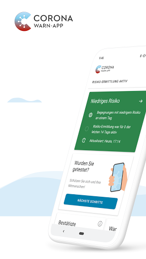  | 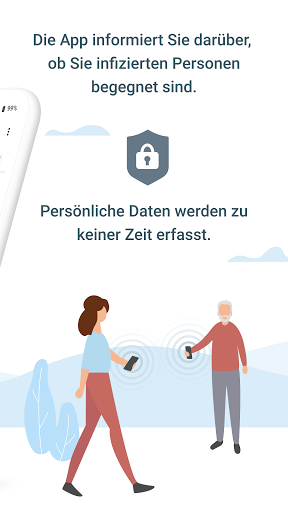  | 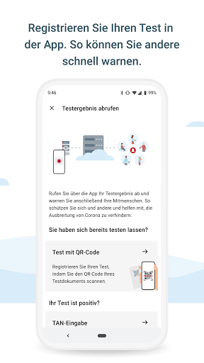  | 
 | 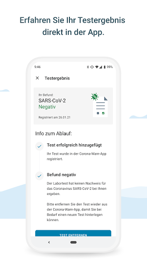  | 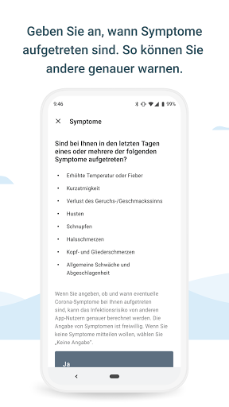  | 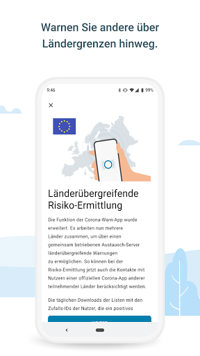  | 
 | 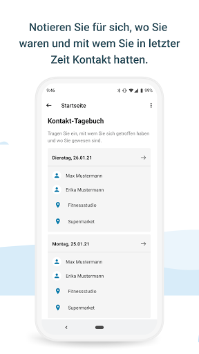  | 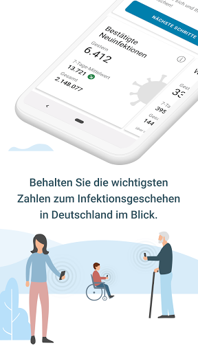 

## Development team
In the following we report the main information provided by the development team in the Google play store.

| | |
|-------------------------|-------------------------|
| **Developer**  | Robert Koch-Institut |
| **Website**  | [https://www.coronawarn.app](https://www.coronawarn.app) |
| **Email** | CoronaWarnApp@rki.de |
| **Physical address**  | [Robert Koch-Institut Nordufer 20 13353 Berlin](https://www.google.com/maps/search/Robert%20Koch-Institut%20Nordufer%2020%2013353%20Berlin) (Google Maps) |
| **Other developed apps**  | [https://play.google.com/store/apps/developer?id=Robert+Koch-Institut](https://play.google.com/store/apps/developer?id=Robert+Koch-Institut) |

## Android support

| | |
|-------------------------|-------------------------|
| **Declared target Android version**  | Android10, version 10 (API level 29) |
| **Effective target Android version**  | Android10, version 10 (API level 29) |
| **Minimum supported Android version**  | Marshmallow, version 6.0 (API level 23) |
| **Maximum target Android version**  | - |

The larger the difference between the minimum and maximum supported Android versions, the better. A larger difference means a wider audience. For example, old phones have a very low Android version, so a high minimum supported Android version means that the app cannot be used by users with old phones, thus leading to accessibility problems. 

## Requested permissions

In the following we report the complete list of the permissions requested by the app. 

| **Permission** | **Protection level** | **Description** | 
|-------------------------|-------------------------|-------------------------|
 **android.permission ACCESS_NETWORK_STATE** | Normal | Allows applications to access information about networks. 
 **android.permission BLUETOOTH** | Normal | Allows applications to connect to paired bluetooth devices. 
 **android.permission CAMERA** | :warning:**Dangerous** | Required to be able to access the camera device. 
 **android.permission FOREGROUND_SERVICE** | Normal | Allows a regular application to use Service.startForeground. 
 **android.permission INTERNET** | Normal | Allows applications to open network sockets. 
 **android.permission RECEIVE_BOOT_COMPLETED** | Normal | Allows an application to receive the Intent.ACTION_BOOT_COMPLETED that is broadcast after the system finishes booting. 
 **android.permission REQUEST_IGNORE_BATTERY_OPTIMIZATIONS** | Normal | Permission an application must hold in order to use Settings.ACTION_REQUEST_IGNORE_BATTERY_OPTIMIZATIONS. 
 **android.permission WAKE_LOCK** | Normal | Allows using PowerManager WakeLocks to keep processor from sleeping or screen from dimming. 

## Mentioned servers

| **Server** | **Registrant** | **Registrant country** | **Creation date** | 
|-------------------------|-------------------------|-------------------------|-------------------------|
 | google.com | Google LLC | :us: US | 1997-09-15 04:00:00 |

## Security analysis 

Below we report the main security warnings raised by our execution of the [Androwarn](https://github.com/maaaaz/androwarn) security analysis tool.

**Connection interfaces exfiltration**
> - This application reads details about the currently active data network 
> - This application tries to find out if the currently active data network is metered 

**Telephony services abuse**
> - This application makes phone calls 

**Suspicious connection establishment**
> - This application opens a Socket and connects it to the remote address '; port is out of range' on the 'N/A' port  
> - This application opens a Socket and connects it to the remote address 'Lcom/android/tools/r8/GeneratedOutlineSupport;->outline20(Ljava/lang/String;)Ljava/lang/StringBuilder;' on the 'N/A' port  
> - This application opens a Socket and connects it to the remote address 'Ljava/net/Proxy;->type()Ljava/net/Proxy$Type;' on the 'N/A' port  
> - This application opens a Socket and connects it to the remote address 'Method sendUrgentData() is not supported.' on the 'N/A' port  
> - This application opens a Socket and connects it to the remote address 'Method setHandshakeTimeout() is not supported.' on the 'N/A' port  
> - This application opens a Socket and connects it to the remote address 'Method setOOBInline() is not supported.' on the 'N/A' port  
> - This application opens a Socket and connects it to the remote address 'Method setSoWriteTimeout() is not supported.' on the 'N/A' port  
> - This application opens a Socket and connects it to the remote address 'Socket closed' on the 'N/A' port  
> - This application opens a Socket and connects it to the remote address 'Socket is closed' on the 'N/A' port  
> - This application opens a Socket and connects it to the remote address 'Socket is closed.' on the 'N/A' port  
> - This application opens a Socket and connects it to the remote address 'Socket is not connected.' on the 'N/A' port  
> - This application opens a Socket and connects it to the remote address 'socket is closed' on the 'N/A' port  
> - This application opens a Socket and connects it to the remote address 'timeout' on the 'N/A' port  

**Code execution**
> - This application loads a native library 
> - This application loads a native library: 'conscrypt_gmscore_jni' 
> - This application loads a native library: 'conscrypt_jni' 

## User ratings and reviews

Below we provide information about how end users are reacting to the app in terms of ratings and reviews in the Google Play store.

### Ratings

The Corona-Warn-App app has been installed by more than **10000000** times. At this time, **109779** rated the app and its average score is **3.0423253**. Below we show the distribution of the ratings across the usual star-based rating of Google Play

:star::star::star::star::star:: 40152

:star::star::star::star:: 11214

:star::star::star:: 10204

:star::star:: 9547

:star:: 38662

### Reviews 

#### 5-star reviews

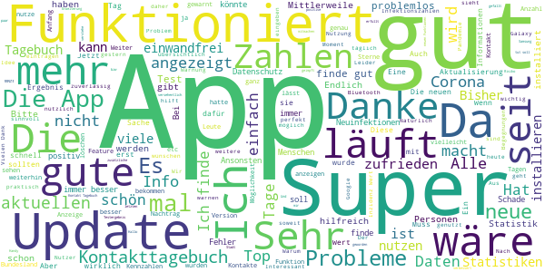

> Hallo, ich habe Mal eine Frage könnte man nicht als zusätzliche Funktion den Inzidenz Wert seines Landkreises bzw der Stadt einbauen? Wäre eine gute Erweiterung! Ansonsten funktioniert die App gut, bei Mir noch keine einzige Risiko Begegnung, aber auch kein Fehlermeldungen bzw Abstürze mehr im Moment. Danke dafür.  :date: __2021-02-06 19:37:17__

> App wird immer besser  :date: __2021-02-06 18:26:07__

> Tut was sie soll  :date: __2021-02-06 17:19:26__

> Ich bin mit der App super zufrieden. Die Aktualisierung funktioniert ohne Probleme und auch das einscannen eines Tests mittels QR-Code. Das Ergebnis war auch pünktlich da.  :date: __2021-02-06 16:57:43__

> Wenn alle mitmachen würden gute Idee  :date: __2021-02-06 16:54:14__

> Sehr gut  :date: __2021-02-06 16:35:48__

> Funktioniert, erfüllt was sie soll. Ich wäre froh wenn mehr Menschen sie nutzen würden.  :date: __2021-02-06 14:31:55__

> Alles bestens  :date: __2021-02-06 13:48:52__

> Funktioniert zuverlässig  :date: __2021-02-06 13:23:10__

> Super idee  :date: __2021-02-06 12:52:33__

#### 4-star reviews

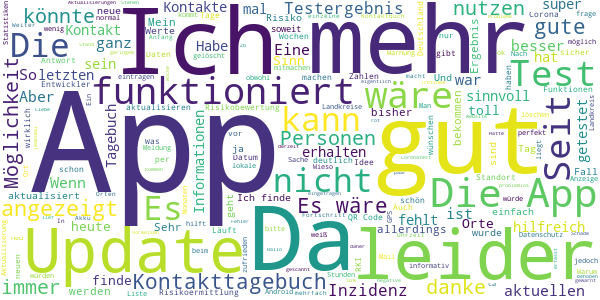

> Informativ: Ein weiterer Fortschritt. Weiter so.  :date: __2021-02-06 17:50:03__

> Die App ist soweit ganz ok, aber das Kontakttagebuch könnte besser sein. Es wäre IMHO sinnvoll, wenn man zu dem Ort eine Uhrzeit mit angeben könnte. Ich mache das im Moment im Ortstext aber so habe ich ein und den selben Ort mehrfach drin.  :date: __2021-02-06 12:09:53__

> Schluckt den Akku 🔋. Bis heute hat die mir nichts gebracht. In meinen Augen macht die keinen Sinn  :date: __2021-02-06 11:59:45__

> Es wäre sehr hilfreich, wenn man den Personen im Kontaktbuch individuelle Orte zuweisen kann oder den Orten im Kontaktbuch einzelne Personen zuordnen kann.  :date: __2021-02-06 11:25:35__

> Warum wird mir ständig erzählt, dass meine Risikoermittlung deaktiviert ist obwohl ich sie nicht ausgeschaltet habe. Wenn ich dann nachschaue ist sie auch noch wirklich aus. 🧐 06.02.2021 von Anfang an dabei Die, bei den Aktualisierungen, neu hinzugefügten Funktionen finde ich toll. Aber nun fehlt noch eine. Die Geimpftenzahlen, die Doppeltgeimpftenzahlen und eine Möglichkeit mit der entsprechenden Indexnummer des Serums, die bei sich beobachteten Nebenwirkungen ein zu tragen.  :date: __2021-02-06 09:37:22__

> Ich habe meinen Test von gestern gescannt. Allerdings steht als registriertes Datum immer noch der 12.12.20 (Mein erster Test) - danke für die Antwort. Es ist nicht so das ich verunsichert bin. Vielmehr kann ich mein negatives Ergebnis nicht vorweisen. Zb im Altersheim // 06.02.21 Fehler behoben Danke  :date: __2021-02-06 07:07:31__

> Funktioniert gut keine Probleme mit der App. Es fehlen ein paar Funktionen das liegt aber am Datenschutz. Schade das nicht mehr mitmachen!!! Es wäre gut wenn man seinen Impfangebot bzw. ein Imptermin über die App bekommen würde.  :date: __2021-02-05 19:12:15__

> Hallo liebes Appteam! Die App habe ich von Anfang an und sie lief bisher problemlos. Ich bin Grenzpendler, daher 1x wöchentlich beim Coronatest in Deutschland. QR-Code wird jedesmal generiert und ich stimme der Übermittlung an die App zu. Seit Monaten werden die Ergebnisse in der App nichtmehr eingetragen! Mein Test von vorletzter Woche (QR-Code erhalten und gescannt als das negative Ergebnis schon bekannt war) ist immernoch 'offen'. Wenn möglich bitte mit den Laboren klären. Liebe Grüße  :date: __2021-02-05 18:43:06__

> Ich habe tatsaechlich noch einen blackberry allerdings mit Android. Ueber Tage konnten immer wieder keine Kontakte erfasst werden, die app zeigte weder grün noch rot an. Das update dauert derzeit sehr, sehr lange. Zurueck auf eine andere website kann ich nur kommen, wenn ich die App deinstalliere. Das hatte ich eigentlich nicht vor. Trotzdem danke für die Lösung.  :date: __2021-02-05 15:05:15__

> Funktioniert soweit ich das nachvollziehen kann recht gut. Allerdings werden die zusätzlichen Informationen aus dem letzten Update von Ende Januar nicht mehr aktualisiert. Stehen auf Stand vom 2.2.2021!  :date: __2021-02-05 12:04:22__

#### 3-star reviews

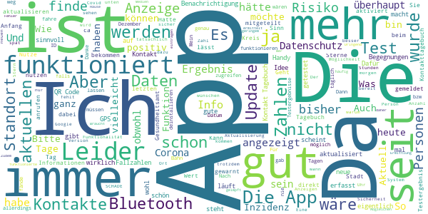

> Die App ist verbesserungswürdig. Zudem haben zu wenige User diese App, daher ist die Zuverlässigkeit der Risiko Ermittlung nicht sehr genau. Gut finde ich das Kontakttagebuch. So ist die Kontaktverfolgung auch länger möglich. Wer kann sich schon 14 Tage an alle seine Kontakte erinnern. Allerdings sind es zur seit ja jeden Tag nur die selben Arbeitskollegen oder die eigene Familie🤔😞  :date: __2021-02-06 15:47:49__

> Regionale Infos fände ich hilfreicher bzw Informativer. Die Bundesweiten Zahlen werden sowieso über sämtliche Medien verbreitet. Da der Standort ermittelt werden muss um die App nutzen zu können, sollte dies auch machbar sein. Dann wären auch 4 oder 5 Sterne drinn.  :date: __2021-02-06 14:00:41__

> Die App funktionierte bisher gut, seit kurzem lässt sich aber die Benachrichtigung zur Standortermittlung nicht mehr entfernen. Das ist sehr lästig, da ich zu Hause Bluetooth und Standort nicht aktivieren möchte um die Akkuladung zu schonen.  :date: __2021-02-06 08:40:27__

> Die App funktioniert nicht einwandfrei. Es werden häufig Fehlermeldungen angezeigt  :date: __2021-02-05 22:12:25__

> GUTE App: Bisher noch keine Gefährdungen ☺  :date: __2021-02-05 21:06:08__

> Abgleichen der Id funktioniert seit Tagen nicht nicht. Dringend beheben.  :date: __2021-02-05 20:52:23__

> Läuft bisher ohne Fehler. Kann man demnächst vielleicht a7ch eintragen ob man geimpft wurde?  :date: __2021-02-05 19:51:53__

> Die App scheint zwar zu laufen, aber die Testergebnisse werden nicht angezeigt, obwohl der Test seit einer Woche ausgewertet ist.  :date: __2021-02-05 16:33:35__

> Braucht viel Speicherplatz  :date: __2021-02-05 16:28:06__

> Es tut mir leid, aber ich kann die App nicht mehr ernstnehmen. Seit ca. Mitte Dezember hat sie mir keine Begegnungen mit geringem Risiko gemeldet. Ja, ich habe meine Bewegungen etwas heruntergefahren und arbeite teilweise im Homeoffice, fahre aber dennoch Bahn, kaufe täglich Lebensmittel usw. Kann mir keiner erzählen, dass da nie kurze Begegnungen mit geringem Risiko waren. Bin drauf und dran, die App zu deinstallieren, da sie so sinnlos ist.  :date: __2021-02-05 16:17:52__

#### 2-star reviews

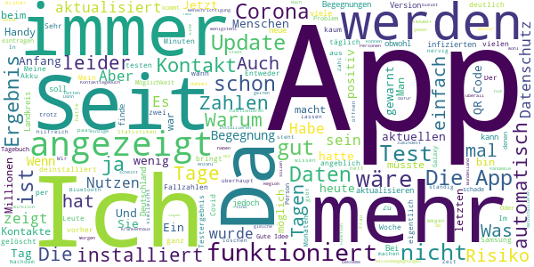

> Die Neuinfektionen werden nicht tagesaktuell angezeigt! Das taugt so nicht viel.  :date: __2021-02-06 20:12:23__

> Zahl der Neuinfizierten wird zu spät aktualisiert! Auch nach Neustart der App keine aktualisierten Zahlen. Sollten doch in der App als erstes zu finden sein und nicht bei der SZ?  :date: __2021-02-06 19:14:53__

> Schon allein wegen den treudoofen Wahlplakaten von Frau Ironman in bw würde ich diese app deinstalliert lassen. Wir wollen nicht alle beschützt werden Frau Dr. Minister.  :date: __2021-02-06 18:15:59__

> Der Nutzen dieser App ist für mich unklar. Im Endeffekt werden zwar Daten gesammelt aber ob die Auswertung am Ende stimmt, mag ich zu bezweifeln.  :date: __2021-02-06 12:19:42__

> Warum kann die App nicht anzeigen, mit wieviel Leuten man z.B. am Tag vorher überhaupt einen Kontakt hatte, vielleicht mit Statistiken. Wäre doch anonym und man hätte eine Selbstkontrolle. Müsste doch die App auch von seinen Möglichkeiten mitbringen. Glaube, das würde Leute überzeugen, diese Apo vermehrt zu benutzen, ansonsten App ok.  :date: __2021-02-06 08:54:21__

> Habe die App eher installiert um guten Willen zu zeigen. An sich kaum wirklichen Nutzen allein wenn man sich die Zahl der "warnenden" ansieht. Gute Idee aber recht mäßig umgesetzt, was auch an Datenschutz und Nutzerverhalten liegen mag. In der existierenden Form kaum eine Hilfe gegen Covid 19, beim längst überfälligen Update hat man noch nicht einmal eine Kategorie für Impfungen vorgesehen. Hohe Kosten für homöopathische Wirkung.  :date: __2021-02-06 04:00:35__

> Ich habe mich vor ca 4 Wochen als positiv gemeldet. Zum Glück bin ich wieder genesen. Meine Quarantäne ist seit ca 1 1/2 Wochen zu Ende, in der App ist es leider nicht möglich sich wieder als gesund zu melden.  :date: __2021-02-06 00:54:13__

> Der Datenschutz wurde hier deutlich übertrieben.  :date: __2021-02-05 19:14:01__

> Lässt sich nicht mehr öffnen 🤷‍♂️ 2x Samsung S10  :date: __2021-02-05 13:59:54__

> Habe Wohnung nicht verlassen. Seit Oktober. Dennoch angeblich 1Risiko Kontakt. Die Anzeige steht schon über 6 Wochen. Funktioniert also nicht!  :date: __2021-02-05 13:27:50__

#### 1-star reviews

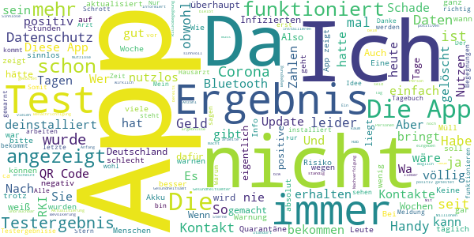

> Eine App die Sinnlos ist weil Sie nichts verhindern kann!  :date: __2021-02-06 19:34:17__

> Keiner redet mehr über die App. Aber Geld fließt sicher weiter. Sie machen die Menschen kirre bis hin zum resignieren. 3 positive u. Keiner nutzt die App, weil das Ding sinnlos ist. 😩Die meisten sind gsd. NICHT auf die Steuerverschwendungsapp reingefallen. Wie kann die Regierung noch ruhig schlafen, wenn Millionen gesunde Kinder d. Lockdown psychisch u. physisch richtig krank werden u. verhaltensauffällig/Entwicklungsverzögert reagieren? Immer verlängert schön. DE ist ja noch nicht ganz alle 😩  :date: __2021-02-06 18:17:14__

> Ich lasse die App nicht im Hintergrund laufen, sondern rufe sie täglich manuell auf. Es passiert häufig, dass "Ihre Begegnungsdaten werden nun geprüft" hängen bleibt. Wenn das aufgetreten ist, bleibt das Verhalten den ganzen Tag so. Erst am nächsten Tag funktioniert es meistens wieder. Ich benutze die App seit ihrem Erscheinen und kann nirgendwo erkennen, ob schon mal Begegnungsdaten aufgezeichnet wurden. Ich habe kein Vertrauen in diese App und bezweifele ihren Nutzen.  :date: __2021-02-06 17:57:32__

> Aufgrund der geringen Anzahl der Nutzer und Unzuverlässigkeit, wieder gelöscht, schade um das viel verschwendete Geld  :date: __2021-02-06 16:43:51__

> Weiss echt nicht was die bringen soll!  :date: __2021-02-06 15:47:07__

> Liebe App Verantwortlichen, ich war von Beginn an eigentlich überzeugt von der App. Nur dass es keinen Austausch mit den Gesundheitsämtern gibt. Und die App quasi total nutzlos ist für die Kontaktverfolgung der Gesundheitsämter muss ich meine Bewertung von5 auf 1 bzw.0 absenken. Es ist wenn es gewollt wäre bestimmt möglich eine automatisierte Kontaktverfolgung unter Einhaltung von Datenschutz zu realisieren. Das Tagebuch ist ebenfalls gut gemeint,aber bringt aktuell 0 Mehrwert als ein Pa-Block!  :date: __2021-02-06 15:24:16__

> Immer noch "Risikoermittlung fehlgeschlagen" !!!! Warum ???? Bei mir wird alle 2 bis 3 Tage "Risikoermittlung fehlgeschlagen" angezeigt, obwohl ich Standort Dienste und Bluetooth aktiviert habe. Woran liegt das? Ist etwas nervig.  :date: __2021-02-06 15:23:01__

> Die Warnanzeige funktioniert nicht korrekt. Bereits mehrfach erlebt . So nicht vertrauenswürdig und in dieser Form kein Instrument um die Pandemie in Schach zu halten bzw. Zu eliminieren.  :date: __2021-02-06 13:59:31__

> Wann hört Rachefeldzug dieser gestörten Frau auf? Was hat der Dicke Anfang d.90' dem trampligen Stasi-Lehrling auf dem Weg von seinem Mädchen zu seiner Mörderin nur angetan? Ruhigstellung mit 2 Ministerposten half nicht. Nach parteilichen Niedermachens folgte die komplette Zerstörung des Dicken ohne erkennbare Gegenwehr u. später die jährliche Grabtieferlegung am TddE durch extremste Nichtbeachtung. Parteispenden? Lächerlich. Gab Rolli sein Abschuß-Ok, um eine Liaison "mit Folgen" zu vertuschen?  :date: __2021-02-06 12:27:19__

> Also ob diese APP wirklich funktioniert zweifle ich an. Mir wurde noch nie eine Risikobegegnung gemeldet!!  :date: __2021-02-06 10:54:29__

