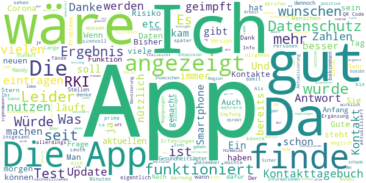
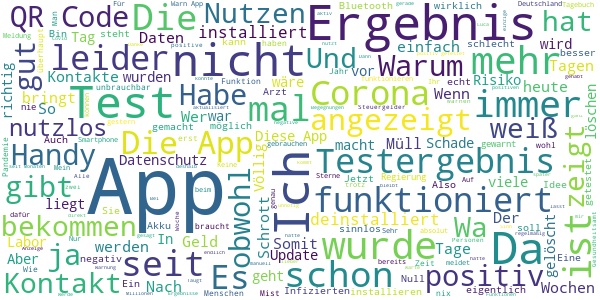

# Corona-Warn-App
App version ``1.12.0``

Analyzed with [covid-apps-observer](http://github.com/covid-apps-observer) project, version ``0.1``

## App overview
| | |
|-------------------------|-------------------------| 
| **Name**&nbsp;&nbsp;&nbsp;&nbsp;&nbsp;&nbsp;&nbsp;&nbsp;&nbsp;&nbsp;&nbsp;&nbsp;&nbsp;&nbsp;&nbsp;&nbsp;&nbsp;&nbsp;&nbsp;&nbsp;&nbsp;&nbsp;&nbsp;&nbsp;&nbsp;&nbsp;&nbsp;&nbsp;&nbsp;&nbsp;&nbsp;&nbsp;&nbsp;&nbsp;&nbsp;&nbsp;&nbsp;&nbsp;&nbsp;&nbsp;  | Corona-Warn-App |
| **Unique identifier** | de.rki.coronawarnapp |
| **Link to Google Play** | [https://play.google.com/store/apps/details?id=de.rki.coronawarnapp](https://play.google.com/store/apps/details?id=de.rki.coronawarnapp) |
| **Summary**  | Gemeinsam Corona bekämpfen |
| **Privacy policy** | [https://www.coronawarn.app/assets/documents/cwa-privacy-notice-de.pdf](https://www.coronawarn.app/assets/documents/cwa-privacy-notice-de.pdf) |
| **Latest version** | 1.12.0 |
| **Last update** | 2021-02-08 22:42:29 |
| **Recent changes** | Dieses Update stellt Fehlerbehebungen, Anpassungen in den App-Texten sowie folgende neuen Funktionen zur Verfügung:  - Nach Update auf eine neue Version zeigt Ihnen die App eine Übersicht der neu hinzugekommenen Funktionen an. Diese Info finden Sie auch unter App-Informationen -&gt; Neue Funktionen. - Das Kontakt-Tagebuch zeigt Ihnen für die letzten 15 Tage an, ob Ihr Risiko-Status erhöht oder niedrig war. Für Tage ohne Risiko-Begegnungen zeigt das Kontakt-Tagebuch keinen Risiko-Status an. |
| **Installs**  | 10.000.000+ |
| **Category** | Gesundheit & Fitness |
| **First release** | 12.06.2020 |
| **Size**  | 23M |
| **Supported Android version**  | 6.0 oder höher |

### Description
> Das Robert Koch-Institut (RKI) als zentrale Einrichtung des Bundes im Bereich der Öffentlichen Gesundheit und als nationales Public-Health-Institut veröffentlicht die Corona-Warn-App für die deutsche Bundesregierung und für die Bundesrepublik Deutschland. Die App fungiert als digitale Ergänzung zu Abstandhalten, Hygiene und Alltagsmaske. Wer sie nutzt, hilft, Infektionsketten schnell nachzuverfolgen und zu durchbrechen. Die App merkt sich dezentral unsere Begegnungen mit anderen und informiert uns digital, wenn wir Begegnungen mit nachweislich infizierten Personen hatten. Dabei sammelt sie jedoch zu keiner Zeit Informationen zur Identität ihrer Nutzerinnen und Nutzer. Wer wir sind und wo wir sind, bleibt geheim – und unsere Privatsphäre bestens geschützt.
 WIE DIE APP FUNKTIONIERT
 Die Risiko-Ermittlung der App ist das Herzstück der Software und sollte immer aktiviert sein. Wann immer sich Nutzerinnen und Nutzer begegnen, tauschen ihre Smartphones über Bluetooth verschlüsselte Zufalls-IDs aus.
 Diese geben nur Auskunft darüber, über welche Dauer und mit welchem Abstand eine Begegnung stattfand. Welche Person sich hinter einem Code verbirgt, ist für niemanden nachvollziehbar. Die Corona-Warn-App erhebt keine Informationen über den Ort der Begegnung oder den Standort der Nutzerinnen und Nutzer.
 Entsprechend der maximalen Corona-Inkubationszeit werden alle Zufalls-IDs, die unser Smartphone sammelt, für 14 Tage auf dem Smartphone gespeichert – und dann gelöscht.
 Nur wenn eine Person sich über die App freiwillig als nachweislich infiziert meldet, erhalten daraufhin alle früheren Begegnungen eine Warnung auf ihr Smartphone.
 Niemand erfährt, wann, wo oder mit wem eine entsprechende Risiko-Begegnung stattfand. Die infizierte Person bleibt anonym.
 Mit der Benachrichtigung erhalten die betroffenen Nutzer/-innen klare Handlungsempfehlungen. Wichtig: Auch die Daten der Benachrichtigten sind zu keiner Zeit einsehbar.
 WIE DIE DATEN SICHER BLEIBEN
 Die Corona-Warn-App soll uns zwar täglich begleiten, sie wird uns jedoch nie kennenlernen. Dadurch kann sie niemandem verraten, wer wir sind. Der Datenschutz bleibt über die gesamte Nutzungsdauer zu 100 Prozent gewahrt.
 • Keine Anmeldung: Es müssen keine E-Mail-Adresse und kein Name hinterlegt werden.
 • Keine Rückschlüsse auf Identitäten: Bei einer Begegnung mit einem anderen Menschen tauschen die Smartphones nur Zufalls-IDs aus. Diese messen, über welche Dauer und mit welchem Abstand ein Kontakt stattfand. Sie lassen aber keine Rückschlüsse auf Personen und Standorte zu.
 • Dezentrale Speicherung: Die Daten werden nur auf dem Smartphone gespeichert und nach 14 Tagen gelöscht.
 • Keine Einsicht für Dritte: Sowohl die Personen, die eine nachgewiesene Infektion melden, als auch die Benachrichtigten sind nicht nachverfolgbar – nicht für die Bundesregierung, nicht für das Robert Koch-Institut, nicht für andere User und auch nicht für die Betreiber der App-Stores.
 Diese App ist nicht zum Gebrauch außerhalb Deutschlands bestimmt. Die Corona-Warn-App ist die zentrale Corona-App für Deutschland und sie ist an das deutsche Gesundheitssystem angeschlossen. Trotzdem ist die Corona-Warn-App auch in diesem Land verfügbar. Sie ist gedacht für alle, die in Deutschland leben, arbeiten, Urlaub machen oder sich regelmäßig oder über längere Zeit in Deutschland aufhalten.
 Es gelten die Nutzungsbedingungen der Corona-Warn-App: https://www.coronawarn.app/assets/documents/cwa-eula-de.pdf. Durch die Installation und Nutzung dieser App stimmen Sie den Nutzungsbedingungen zu.

### User interface
The developers of the app provide the following screenshots in the Google play store.
| | | |
|:-------------------------:|:-------------------------:|:-------------------------:|
 |   |   |   | 
 |   |   |   | 
 |   |  

## Development team
In the following we report the main information provided by the development team in the Google play store.

| | |
|-------------------------|-------------------------|
| **Developer**  | Robert Koch-Institut |
| **Website**  | [https://www.coronawarn.app](https://www.coronawarn.app) |
| **Email** | CoronaWarnApp@rki.de |
| **Physical address**  | [Robert Koch-Institut Nordufer 20 13353 Berlin](https://www.google.com/maps/search/Robert%20Koch-Institut%20Nordufer%2020%2013353%20Berlin) (Google Maps) |
| **Other developed apps**  | [https://play.google.com/store/apps/developer?id=Robert+Koch-Institut](https://play.google.com/store/apps/developer?id=Robert+Koch-Institut) |

## Android support

| | |
|-------------------------|-------------------------|
| **Declared target Android version**  | Android10, version 10 (API level 29) |
| **Effective target Android version**  | Android10, version 10 (API level 29) |
| **Minimum supported Android version**  | Marshmallow, version 6.0 (API level 23) |
| **Maximum target Android version**  | - |

The larger the difference between the minimum and maximum supported Android versions, the better. A larger difference means a wider audience. For example, old phones have a very low Android version, so a high minimum supported Android version means that the app cannot be used by users with old phones, thus leading to accessibility problems. 

## Requested permissions

In the following we report the complete list of the permissions requested by the app. 

| **Permission** | **Protection level** | **Description** | 
|-------------------------|-------------------------|-------------------------|
 **android.permission ACCESS_NETWORK_STATE** | Normal | Allows applications to access information about networks. 
 **android.permission BLUETOOTH** | Normal | Allows applications to connect to paired bluetooth devices. 
 **android.permission CAMERA** | :warning:**Dangerous** | Required to be able to access the camera device. 
 **android.permission FOREGROUND_SERVICE** | Normal | Allows a regular application to use Service.startForeground. 
 **android.permission INTERNET** | Normal | Allows applications to open network sockets. 
 **android.permission RECEIVE_BOOT_COMPLETED** | Normal | Allows an application to receive the Intent.ACTION_BOOT_COMPLETED that is broadcast after the system finishes booting. 
 **android.permission REQUEST_IGNORE_BATTERY_OPTIMIZATIONS** | Normal | Permission an application must hold in order to use Settings.ACTION_REQUEST_IGNORE_BATTERY_OPTIMIZATIONS. 
 **android.permission WAKE_LOCK** | Normal | Allows using PowerManager WakeLocks to keep processor from sleeping or screen from dimming. 

## Mentioned servers

| **Server** | **Registrant** | **Registrant country** | **Creation date** | 
|-------------------------|-------------------------|-------------------------|-------------------------|
 | google.com | Google LLC | :us: US | 1997-09-15 04:00:00 |
 | android.com | Google LLC | :us: US | 1997-06-23 04:00:00 |

## Security analysis 

Below we report the main security warnings raised by our execution of the [Androwarn](https://github.com/maaaaz/androwarn) security analysis tool.

**Connection interfaces exfiltration**
> - This application reads details about the currently active data network 
> - This application tries to find out if the currently active data network is metered 

**Telephony services abuse**
> - This application makes phone calls 

**Suspicious connection establishment**
> - This application opens a Socket and connects it to the remote address '; port is out of range' on the 'N/A' port  
> - This application opens a Socket and connects it to the remote address 'Lcom/android/tools/r8/GeneratedOutlineSupport;->outline21(Ljava/lang/String;)Ljava/lang/StringBuilder;' on the 'N/A' port  
> - This application opens a Socket and connects it to the remote address 'Ljava/net/Proxy;->type()Ljava/net/Proxy$Type;' on the 'N/A' port  
> - This application opens a Socket and connects it to the remote address 'Method sendUrgentData() is not supported.' on the 'N/A' port  
> - This application opens a Socket and connects it to the remote address 'Method setHandshakeTimeout() is not supported.' on the 'N/A' port  
> - This application opens a Socket and connects it to the remote address 'Method setOOBInline() is not supported.' on the 'N/A' port  
> - This application opens a Socket and connects it to the remote address 'Method setSoWriteTimeout() is not supported.' on the 'N/A' port  
> - This application opens a Socket and connects it to the remote address 'Socket closed' on the 'N/A' port  
> - This application opens a Socket and connects it to the remote address 'Socket is closed' on the 'N/A' port  
> - This application opens a Socket and connects it to the remote address 'Socket is closed.' on the 'N/A' port  
> - This application opens a Socket and connects it to the remote address 'Socket is not connected.' on the 'N/A' port  
> - This application opens a Socket and connects it to the remote address 'socket is closed' on the 'N/A' port  
> - This application opens a Socket and connects it to the remote address 'timeout' on the 'N/A' port  

**Code execution**
> - This application loads a native library 
> - This application loads a native library: 'conscrypt_gmscore_jni' 
> - This application loads a native library: 'conscrypt_jni' 

## User ratings and reviews

Below we provide information about how end users are reacting to the app in terms of ratings and reviews in the Google Play store.

### Ratings

The Corona-Warn-App app has been installed by more than **10000000** times. At this time, **110498** rated the app and its average score is **3.0249555**. Below we show the distribution of the ratings across the usual star-based rating of Google Play

:star::star::star::star::star:: 39709

:star::star::star::star:: 11404

:star::star::star:: 10557

:star::star:: 9592

:star:: 39236

### Reviews 

#### 5-star reviews

> Endlich ist sie da. Danke! Und jetzt brauche ich das noch für meine 91 jährige Mutter als eine Art Schlüsselanhänger ohne Handy weil sie das nie mitnimmt. Nachtrag 14.11.2020: Vielleicht können Sie ja eine getrennte App herausgeben mit weniger Datenschutz und mehr Gesundheitsschutz. Dann können wir uns diese installieren und wer Bedenken hat läßt es sein und nutzt nur diese App hier. Meine Mutter hat nun auch Handy mit App und nimmt es mit. Update 13.2.21: 1.Impfung problemlos vertragen.  :date: __2021-02-13 20:21:35__

> Habe die Corona-Warn-App gleich seit Anbeginn. Klappt eigentlich alles, auch evtl. Begegnungen werden ständig angezeigt. Spätestens nach ca. 14 Tage wird alles wieder gelöscht. Mittlerweile habe ich auch bereits den Stand: 1.12.0 installieren lassen. Funktioniert alles perfekt.  :date: __2021-02-13 18:23:13__

> Klasse App. Hatte bei der alten Version einmal eine "grüne" Risikomeldung. Kollegen zeitgleich auch. Das macht sehr aufmerksam. So soll es sein. Mit den neuen Zusatzinfos wie R-Wert Infektionszahlen etc. ist sie zudem eine gute Informationsquelle. Suche mir sonst diese Infos immer im Internet. Geht jetzt einfacher. Auch das Tagebuch finde ich sehr nützlich. Ich hoffe sehr, dass noch sehr viel mehr Menschen diese App nutzen. Es geht um unser aller Gesundheit!  :date: __2021-02-13 17:59:04__

> Seh ich  :date: __2021-02-13 16:30:04__

> innovativ  :date: __2021-02-13 16:25:14__

> Ich bin mit der Warn App soweit zufrieden. Ich nutze auch das Tagebuch. Seit dem letzten Update steht die Priorisierte Hintergrundinfo auf aus, ich kann sie nicht mehr aktivieren??  :date: __2021-02-13 15:34:41__

> Sehr übersichtlich und leocht zu verstehen. Besonders gefällt mir das Kontakttagebuch. Jetzt muss man alle Möglichkeiten an mehr Sicherheit zu kommen nutzen, eine ganz tolle Chance dafür👍👌  :date: __2021-02-13 14:07:43__

> Sehr gute App. Nach Fehlerbehebung sehr informativ und nützlich!  :date: __2021-02-13 11:38:00__

> Top! Sehr gute Informationen zum Geschehen! Schnelle Übermittlung des Testergebnisses  :date: __2021-02-13 11:26:05__

> Die App funktioniert super! Die meisten Menschen, die sich hier über die Bewertungsfunktion beschweren, sind zu inkompetent das eigene Handy zu benutzen.  :date: __2021-02-13 11:09:52__

#### 4-star reviews

> Sehr gut gemacht und außerdem informativ. Kontakttagebuch ist eine gute Idee, aber die luca app macht das besser. Reden Sie doch mal mit den Machern. Cooperation ist immer gut.  :date: __2021-02-13 13:59:07__

> Die Anbindung von Arztpraxen, Laboren und Gesundheitsamt könnte besser sein - aber da kann die App nix dafür. An sich halte ich die App für ne tolle Idee. Ich würde mir wünschen, es würden mehr Leute diese App nutzen.  :date: __2021-02-13 11:11:28__

> Läuft unauffällig im Hintergrund. Die Möglichkeit seine Kontakte in einem Tagebuch zuführen, kommt mir sehr entgegen, da ich geschäftlich unterwegs bin. ABER! Nach dem letzten Update, wurden alle manuellen Kontakt Einträge UND alle angelegten Personen und Orte gelöscht. Damit ist diese Funktion nicht brauchbar. Ich habe somit die Kontrolle der Nachverfolgung im Fall der Fälle verloren. Ein Backup und Restore sollte hierfür eingebaut werden!  :date: __2021-02-13 10:11:35__

> Top Datensicherheit, wenig hilfreich sagen die Gesundheitsämter. Warum kann man nicht per Häkchen seine Daten zur Hilfe der Allgemeinheit frei geben? Alles freiwillig, würden bestimmt viele machen.  :date: __2021-02-13 02:17:57__

> Sehr nützlich um das Testergebnis schnell und unkompliziert einzusehen.  :date: __2021-02-12 21:14:25__

> 👍  :date: __2021-02-12 20:45:37__

> Es wird so langsam. Macht weiter so, dann gibt es auch den 5. STERN  :date: __2021-02-12 19:49:22__

> Die App ist inzwischen positiv überarbeitet worden und hilft jetzt im täglichen Leben. Der tägliche Blick auf die App gehört inzwischen zum Alltag  :date: __2021-02-12 19:28:44__

> fühle mich sicherer! Der hohe Akku er brauch nervt aber  :date: __2021-02-12 16:39:22__

> Das Update verlief einwandfrei. Im Tagebuch wird kein niedriges Risiko (der angezeigten Tage) angezeigt. Auch ein Neustart zeigte keine Änderung.  :date: __2021-02-12 14:58:24__

#### 3-star reviews

> Die App weiß jederzeit wo man ist. Warum weder dann nicht auch die aktuelle regionalen Werte angezeigt?  :date: __2021-02-13 17:03:47__

> Die App ist soweit in Ordnung. Die Personen haben sich Mühe gegeben und alles ist übersichtlich. Jedoch muss man wenn positiv getestet wurde und ein neuen Test scannen will, die Komplette App über die Einstellungen zurück setzten ! Ich vermute da es eine Zeit abhängig ist in der App, ab wann man neue Tests einpflegen kann ?! Ist lediglich störend und aufwendig für Personen die es betrifft.  :date: __2021-02-13 16:10:04__

> Nachdem ich mein positives Ergebnis mitgeteilt bekommen habe, passierte nichts mehr. Da stand nur : Vielen Dank das Gesundheitsamt wird sich bei Ihnen melden. Habe die App deinstalliert und neu geladen, hoffe das es nun wieder läuft.  :date: __2021-02-13 15:30:05__

> Super, bis jetzt keine Risikobegegnung obwohl ich als Krankenpfleger direkten Kontakt mit Covid19-Infizierten hatte. Auch bin ich der Einzige Mensch in meinem Bekanntenkreis der die App nutzt. Die schlappen 68 Millionen Euro sind hier gut angelegt obwohl das andere Länder deutlich günstiger hinkriegen, Telekom und SAP freuen sich über die kleine Finanzspritze😘  :date: __2021-02-13 14:55:05__

> Bisher hat mir die App noch nicht einen einzigen kritischen Kontakt angezeigt. Was mir nach den neuen Updates auffällt: Gut finde ich das Kontakttagebuch. Das könnte im Problemfall sehr nützlich sein. Aber man müsste seine Kontakte editieren können. So habe ich z.B. einmal eine falsche Hausnummer eingetragen, ein anderes Mal die Postleitzahl vergessen. Da die Kontaktdaten nicht editierbar sind, muss man den gesamten Eintrag neu erstellen und kann auch den fehlerhaft erstellten nicht löschen.  :date: __2021-02-13 14:42:11__

> Mein Mann u ich habe gleiche android Handys. Seins wird automatisch aktualisiert, bei meinem muss ich in den playstore. Heute Morgen aktualisiert, jetzt auch Version 1.12.0 aber 4Tage alte Zahlen bei der Statistik. Mein Mann dagegen alle Daten des gestrigen Tages. Alles merkwürdig!!  :date: __2021-02-13 14:13:19__

> Seit mehr als einer Woche reagiert die App überhaupt nicht mehr. Nach dem Öffnen erscheint nur die Kopfzeile und man kann nichts machen weder scrollen noch etwas anwählen. Nachtrag: Nach dem neuen Update funktioniert alles wieder einwandfrei. Vielen Dank für die nette Hilfe an der Hotline.  :date: __2021-02-13 12:46:22__

> Anzeige der Inzidenz im aktuellen Landkreis wäre sehr hilfreich  :date: __2021-02-13 12:45:15__

> KÖNNTE AUCH BESSER SEIN.  :date: __2021-02-13 10:51:33__

> Nach dem letzten Update ist mein Kontakttagebuch leer.  :date: __2021-02-13 08:59:36__

#### 2-star reviews

> Der Grundgedanke ist OK aber Umsetzung sau schlecht! Arbeite ständig mit Positiv getesteten Personen, APP erkennt dies nicht! Mein PCR Test eingescannt aber 3 Wochen kein Ergebnis aber Arbeitgeber sofort vom gleichen Test! Sehr schwache Leistung!!!  :date: __2021-02-13 20:34:58__

> Wie schön, jetzt über die aktuelle Inzidenz informiert zu werden. Das lässt das Risiko abschätzen, einem Infizierten zu begegnen. Aber wieso gibt es die klaffende Differenz zwischen Inzidenz und informierenden Nutzern? Offenbar ist es nötig, die Information über Infektionen verpflichtender zu machen. Wer Kontakte untersagt, kann sich nicht hinter dem Datenschutz in einer lebenswichtigen Angelegenheit verstecken.  :date: __2021-02-13 18:24:51__

> Die App ist eine gute Idee, aber mehr nicht. Datenschutz hin oder her, ich will mein Tagebuch nicht manuell füllen, wenn Google auch schon weiß, an welchen Orten ich mich aufhalte. Für den Seuchenschutz und nur dafür, habe ich kein Problem, wenn die Ortsdaten genutzt werden um festzustellen, wo ich evtl. ein erhöhtes Risiko hatte. Dann könnte jeder Benutzer auch selber verantwortlicher handeln und diese Orte nur mit Bedacht aufsuchen. Die Uhrzeit würde auch schon reichen.  :date: __2021-02-13 18:15:40__

> Grundgedanke ist zwar gut.... aber oft aktualisiert die App nicht, das Testergebnis wird nicht angezeigt (Test am 10.02., QR-Code gescannt am 10.02., telefonisches Ergebnis 11.02., bis heute, 13.02.,erscheint "ihr Testergebnis liegt noch nicht vor"😒). Die Funktion der App an sich erscheint mir mehr als fraglich. Ich habe angeblich noch NIE Kontakt zu einer positiv getesteten Person gehabt und nutze die App seit dem ersten Tag. Für mich nicht überzeugend- daher wird sie jetzt gelöscht  :date: __2021-02-13 18:15:36__

> Diese App taugt nichts  :date: __2021-02-13 18:01:20__

> Update: Fehlermeldungen wurden durch Update behoben. Trotzdem bietet die App weiterhin nicht annähernd den Nutzen vergleichbarer asiatischer Apps. Ich würde gerne meine Daten freigeben, wenn ich dafür weniger Beschränkungen im Alltag hätte. Leider besteht darüber keine Wahlmöglichkeit, noch nicht einmal eine öffentliche Diskussion.  :date: __2021-02-13 14:17:22__

> 13.2.2021: Aus der FAQ: "Wegen der hohen Dynamik der Pandemie bringt die Corona-Warn-App mit dem Release 1.11 wichtige statistische Kennzahlen zum Infektionsgeschehen zur Anzeige. Diese Zahlen sollen den Anwendern helfen, die aktuelle Situation besser einzuschätzen und das eigene Verhalten anzupassen." Soll das ein Witz sein, dass man nur Deutschland-weite Durchschnittswerte angezeigt bekommt?! Man muss doch sein Bundesland und seinen Landkreis auswählen können, für die genauen Zahlen vor Ort !  :date: __2021-02-13 13:01:59__

> Hatte Dienstag einen Corona Test und bis Freitag zeigt die App mir das noch kein Ergebnis vorliegt . Habe am Donnerstag Abend beim Arzt angerufen und die hatten den Befund. Sorry ist für mich nicht zuverlässige.  :date: __2021-02-13 10:31:18__

> 13.02.21 Neues Update der app noch keine Verbesserung im Kontakttagebuch. Es spielt sicher eine Rolle, wann ich wen treffe und wie lange um Kontakte nachzuverfolgen. So wie es jetzt ist werden Personen und Orte einfach unzugeordnet vermerkt. Was für ein Quatsch um eine Nachverfolgung effizient zugestallten, bitte luca app implementieren. 05.01.21Tagebuch ist nicht gut gelöst, da keine Zeiten der Treffen hinterlegt werden können. Bitte einen Blick in luca werfen, da läuft das komfortabel ab.  :date: __2021-02-13 10:24:50__

> Je länger ich die App aktiviert habe, umso mehr erkenne ich das die App überhaupt nichts bringt. Ich bin viel unterwegs, aber nicht ein einziges Mal kam eine Warnung. Solange es diese Datenschutzgesetze gibt kannst die App vergessen.  :date: __2021-02-13 07:51:50__

#### 1-star reviews

> Keine Meldung ob positiv oder negativ.Musste mein Ergebnis in der Praxis erfragen.  :date: __2021-02-13 20:38:56__

> Nutzlos !  :date: __2021-02-13 20:26:04__

> /FakeNews: Was macht eigentlich der rollende Schwarzgeldkoffer? Er gab als hauptverantwortlicher Strippenzieher den Weg frei für des Dicken Stasi-Liebchens zur Diktatorin. Durch die furchtbare, fruchtbare u. auch fruchtende Beziehung zu Beginn der 90' verlor der notgeile Dicke alles. "Es" ließ sich dann später einfach nicht mehr mit Ministerposten beruhigen und abspeisen. Na ja, der echte DocDaddy der weltbesten Physikerin u. Russichsprecherin aus Bln-Adlershof hat auch schon das Weite gesucht.  :date: __2021-02-13 19:50:31__

> Diese App läuft bei mir nur bei eingeschalteten gps. Wer garantiert mir daß dann nicht meine GPS Daten über Google weiter verwendet werden. Genau das wollte ich nicht - ich will nicht permanent von Google getrackt werden .Und nun habe ich diese App im Betrieb, jedenfalls versuche ich es, denn irgendwie zeigt sie nichts an Risiko an, obwohl ich im Klinikbereich unterwegs bin und ständig mit covid Erkrankten zu tun habe. Ohne GPS Aktivierung erscheint bei mir eine Fehlermeldung.  :date: __2021-02-13 19:48:43__

> Diese App ist der größte Witz genau so wie die wo sie eingeführt haben weiß Zeit 10stunden mein Ergebnis und die app zeigt Immer noch keins an  :date: __2021-02-13 19:44:34__

> Diese App ist ohne Funktion. Seit Wochen grün. Dabei gesichert drei Kontakte zu Covid19 Patienten gehabt. Alle drei Patienten haben das Testergebnis per QR-Code eingelesen.  :date: __2021-02-13 19:35:36__

> Keine Benachrichtigung nachdem Bekannter sein positives Testergebnis geteilt hat. Die Handys waren mehrere Stunden im selben Raum. Nutzlos.  :date: __2021-02-13 19:34:50__

> keine Begegnung seit Wochen, taucht nicht  :date: __2021-02-13 19:13:21__

> Hallo Support Ich möchte die App deinstallieren bin total genervt von der App  :date: __2021-02-13 18:53:12__

> Ich löschen jetzt die App, weil sinnlos.  :date: __2021-02-13 18:37:25__

