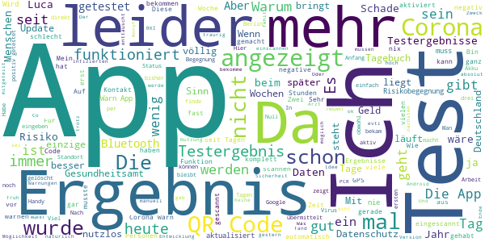

# Corona-Warn-App
App version ``1.12.0``

Analyzed with [covid-apps-observer](http://github.com/covid-apps-observer) project, version ``0.1``

## App overview
| | |
|-------------------------|-------------------------| 
| **Name**&nbsp;&nbsp;&nbsp;&nbsp;&nbsp;&nbsp;&nbsp;&nbsp;&nbsp;&nbsp;&nbsp;&nbsp;&nbsp;&nbsp;&nbsp;&nbsp;&nbsp;&nbsp;&nbsp;&nbsp;&nbsp;&nbsp;&nbsp;&nbsp;&nbsp;&nbsp;&nbsp;&nbsp;&nbsp;&nbsp;&nbsp;&nbsp;&nbsp;&nbsp;&nbsp;&nbsp;&nbsp;&nbsp;&nbsp;&nbsp;  | Corona-Warn-App |
| **Unique identifier** | de.rki.coronawarnapp |
| **Link to Google Play** | [https://play.google.com/store/apps/details?id=de.rki.coronawarnapp](https://play.google.com/store/apps/details?id=de.rki.coronawarnapp) |
| **Summary**  | Gemeinsam Corona bekämpfen |
| **Privacy policy** | [https://www.coronawarn.app/assets/documents/cwa-privacy-notice-de.pdf](https://www.coronawarn.app/assets/documents/cwa-privacy-notice-de.pdf) |
| **Latest version** | 1.12.0 |
| **Last update** | 2021-02-08 22:42:29 |
| **Recent changes** | Dieses Update stellt Fehlerbehebungen, Anpassungen in den App-Texten sowie folgende neuen Funktionen zur Verfügung:  - Nach Update auf eine neue Version zeigt Ihnen die App eine Übersicht der neu hinzugekommenen Funktionen an. Diese Info finden Sie auch unter App-Informationen -&gt; Neue Funktionen. - Das Kontakt-Tagebuch zeigt Ihnen für die letzten 15 Tage an, ob Ihr Risiko-Status erhöht oder niedrig war. Für Tage ohne Risiko-Begegnungen zeigt das Kontakt-Tagebuch keinen Risiko-Status an. |
| **Installs**  | 10.000.000+ |
| **Category** | Gesundheit & Fitness |
| **First release** | 12.06.2020 |
| **Size**  | 23M |
| **Supported Android version**  | 6.0 oder höher |

### Description
> Das Robert Koch-Institut (RKI) als zentrale Einrichtung des Bundes im Bereich der Öffentlichen Gesundheit und als nationales Public-Health-Institut veröffentlicht die Corona-Warn-App für die deutsche Bundesregierung und für die Bundesrepublik Deutschland. Die App fungiert als digitale Ergänzung zu Abstandhalten, Hygiene und Alltagsmaske. Wer sie nutzt, hilft, Infektionsketten schnell nachzuverfolgen und zu durchbrechen. Die App merkt sich dezentral unsere Begegnungen mit anderen und informiert uns digital, wenn wir Begegnungen mit nachweislich infizierten Personen hatten. Dabei sammelt sie jedoch zu keiner Zeit Informationen zur Identität ihrer Nutzerinnen und Nutzer. Wer wir sind und wo wir sind, bleibt geheim – und unsere Privatsphäre bestens geschützt.
 WIE DIE APP FUNKTIONIERT
 Die Risiko-Ermittlung der App ist das Herzstück der Software und sollte immer aktiviert sein. Wann immer sich Nutzerinnen und Nutzer begegnen, tauschen ihre Smartphones über Bluetooth verschlüsselte Zufalls-IDs aus.
 Diese geben nur Auskunft darüber, über welche Dauer und mit welchem Abstand eine Begegnung stattfand. Welche Person sich hinter einem Code verbirgt, ist für niemanden nachvollziehbar. Die Corona-Warn-App erhebt keine Informationen über den Ort der Begegnung oder den Standort der Nutzerinnen und Nutzer.
 Entsprechend der maximalen Corona-Inkubationszeit werden alle Zufalls-IDs, die unser Smartphone sammelt, für 14 Tage auf dem Smartphone gespeichert – und dann gelöscht.
 Nur wenn eine Person sich über die App freiwillig als nachweislich infiziert meldet, erhalten daraufhin alle früheren Begegnungen eine Warnung auf ihr Smartphone.
 Niemand erfährt, wann, wo oder mit wem eine entsprechende Risiko-Begegnung stattfand. Die infizierte Person bleibt anonym.
 Mit der Benachrichtigung erhalten die betroffenen Nutzer/-innen klare Handlungsempfehlungen. Wichtig: Auch die Daten der Benachrichtigten sind zu keiner Zeit einsehbar.
 WIE DIE DATEN SICHER BLEIBEN
 Die Corona-Warn-App soll uns zwar täglich begleiten, sie wird uns jedoch nie kennenlernen. Dadurch kann sie niemandem verraten, wer wir sind. Der Datenschutz bleibt über die gesamte Nutzungsdauer zu 100 Prozent gewahrt.
 • Keine Anmeldung: Es müssen keine E-Mail-Adresse und kein Name hinterlegt werden.
 • Keine Rückschlüsse auf Identitäten: Bei einer Begegnung mit einem anderen Menschen tauschen die Smartphones nur Zufalls-IDs aus. Diese messen, über welche Dauer und mit welchem Abstand ein Kontakt stattfand. Sie lassen aber keine Rückschlüsse auf Personen und Standorte zu.
 • Dezentrale Speicherung: Die Daten werden nur auf dem Smartphone gespeichert und nach 14 Tagen gelöscht.
 • Keine Einsicht für Dritte: Sowohl die Personen, die eine nachgewiesene Infektion melden, als auch die Benachrichtigten sind nicht nachverfolgbar – nicht für die Bundesregierung, nicht für das Robert Koch-Institut, nicht für andere User und auch nicht für die Betreiber der App-Stores.
 Diese App ist nicht zum Gebrauch außerhalb Deutschlands bestimmt. Die Corona-Warn-App ist die zentrale Corona-App für Deutschland und sie ist an das deutsche Gesundheitssystem angeschlossen. Trotzdem ist die Corona-Warn-App auch in diesem Land verfügbar. Sie ist gedacht für alle, die in Deutschland leben, arbeiten, Urlaub machen oder sich regelmäßig oder über längere Zeit in Deutschland aufhalten.
 Es gelten die Nutzungsbedingungen der Corona-Warn-App: https://www.coronawarn.app/assets/documents/cwa-eula-de.pdf. Durch die Installation und Nutzung dieser App stimmen Sie den Nutzungsbedingungen zu.

### User interface
The developers of the app provide the following screenshots in the Google play store.
| | | |
|:-------------------------:|:-------------------------:|:-------------------------:|
 |   |   |   | 
 |   |   |   | 
 |   |  

## Development team
In the following we report the main information provided by the development team in the Google play store.

| | |
|-------------------------|-------------------------|
| **Developer**  | Robert Koch-Institut |
| **Website**  | [https://www.coronawarn.app](https://www.coronawarn.app) |
| **Email** | CoronaWarnApp@rki.de |
| **Physical address**  | [Robert Koch-Institut Nordufer 20 13353 Berlin](https://www.google.com/maps/search/Robert%20Koch-Institut%20Nordufer%2020%2013353%20Berlin) (Google Maps) |
| **Other developed apps**  | [https://play.google.com/store/apps/developer?id=Robert+Koch-Institut](https://play.google.com/store/apps/developer?id=Robert+Koch-Institut) |

## Android support

| | |
|-------------------------|-------------------------|
| **Declared target Android version**  | Android10, version 10 (API level 29) |
| **Effective target Android version**  | Android10, version 10 (API level 29) |
| **Minimum supported Android version**  | Marshmallow, version 6.0 (API level 23) |
| **Maximum target Android version**  | - |

The larger the difference between the minimum and maximum supported Android versions, the better. A larger difference means a wider audience. For example, old phones have a very low Android version, so a high minimum supported Android version means that the app cannot be used by users with old phones, thus leading to accessibility problems. 

## Requested permissions

In the following we report the complete list of the permissions requested by the app. 

| **Permission** | **Protection level** | **Description** | 
|-------------------------|-------------------------|-------------------------|
 **android.permission ACCESS_NETWORK_STATE** | Normal | Allows applications to access information about networks. 
 **android.permission BLUETOOTH** | Normal | Allows applications to connect to paired bluetooth devices. 
 **android.permission CAMERA** | :warning:**Dangerous** | Required to be able to access the camera device. 
 **android.permission FOREGROUND_SERVICE** | Normal | Allows a regular application to use Service.startForeground. 
 **android.permission INTERNET** | Normal | Allows applications to open network sockets. 
 **android.permission RECEIVE_BOOT_COMPLETED** | Normal | Allows an application to receive the Intent.ACTION_BOOT_COMPLETED that is broadcast after the system finishes booting. 
 **android.permission REQUEST_IGNORE_BATTERY_OPTIMIZATIONS** | Normal | Permission an application must hold in order to use Settings.ACTION_REQUEST_IGNORE_BATTERY_OPTIMIZATIONS. 
 **android.permission WAKE_LOCK** | Normal | Allows using PowerManager WakeLocks to keep processor from sleeping or screen from dimming. 

## Mentioned servers

| **Server** | **Registrant** | **Registrant country** | **Creation date** | 
|-------------------------|-------------------------|-------------------------|-------------------------|
 | google.com | Google LLC | :us: US | 1997-09-15 04:00:00 |
 | android.com | Google LLC | :us: US | 1997-06-23 04:00:00 |

## Security analysis 

Below we report the main security warnings raised by our execution of the [Androwarn](https://github.com/maaaaz/androwarn) security analysis tool.

**Connection interfaces exfiltration**
> - This application reads details about the currently active data network 
> - This application tries to find out if the currently active data network is metered 

**Telephony services abuse**
> - This application makes phone calls 

**Suspicious connection establishment**
> - This application opens a Socket and connects it to the remote address '; port is out of range' on the 'N/A' port  
> - This application opens a Socket and connects it to the remote address 'Lcom/android/tools/r8/GeneratedOutlineSupport;->outline21(Ljava/lang/String;)Ljava/lang/StringBuilder;' on the 'N/A' port  
> - This application opens a Socket and connects it to the remote address 'Ljava/net/Proxy;->type()Ljava/net/Proxy$Type;' on the 'N/A' port  
> - This application opens a Socket and connects it to the remote address 'Method sendUrgentData() is not supported.' on the 'N/A' port  
> - This application opens a Socket and connects it to the remote address 'Method setHandshakeTimeout() is not supported.' on the 'N/A' port  
> - This application opens a Socket and connects it to the remote address 'Method setOOBInline() is not supported.' on the 'N/A' port  
> - This application opens a Socket and connects it to the remote address 'Method setSoWriteTimeout() is not supported.' on the 'N/A' port  
> - This application opens a Socket and connects it to the remote address 'Socket closed' on the 'N/A' port  
> - This application opens a Socket and connects it to the remote address 'Socket is closed' on the 'N/A' port  
> - This application opens a Socket and connects it to the remote address 'Socket is closed.' on the 'N/A' port  
> - This application opens a Socket and connects it to the remote address 'Socket is not connected.' on the 'N/A' port  
> - This application opens a Socket and connects it to the remote address 'socket is closed' on the 'N/A' port  
> - This application opens a Socket and connects it to the remote address 'timeout' on the 'N/A' port  

**Code execution**
> - This application loads a native library 
> - This application loads a native library: 'conscrypt_gmscore_jni' 
> - This application loads a native library: 'conscrypt_jni' 

## User ratings and reviews

Below we provide information about how end users are reacting to the app in terms of ratings and reviews in the Google Play store.

### Ratings

The Corona-Warn-App app has been installed by more than **10000000** times. At this time, **110498** rated the app and its average score is **3.0249555**. Below we show the distribution of the ratings across the usual star-based rating of Google Play

:star::star::star::star::star:: 39709

:star::star::star::star:: 11404

:star::star::star:: 10557

:star::star:: 9592

:star:: 39236

### Reviews 

#### 5-star reviews

> Super  :date: __2021-02-23 18:18:04__

> Es hilft Corona zu besiegen🦸‍♀️🦸‍♂️.  :date: __2021-02-23 13:58:31__

> Top  :date: __2021-02-23 10:46:48__

> Danke für das bereitstellen dieser App!  :date: __2021-02-23 07:16:41__

> Am Samstag hat die App mich erinnert sie regelmäßig zu öffnen (was ich jeden Morgen mache). Seit dem aktualisiert sie nicht mehr. Davor ist sie seit Mitte Dezember reibungslos gelaufen  :date: __2021-02-23 07:00:47__

> Idee zur App & Kontakttagebuch: Wie wäre es, wenn man eine Erinnerungshilfe mit optionaler Positivmotivation einbauen würde: Mittels Opt-In meldet sie sich zu vom User festgelegter Zeit mit einem Kontakttagebuch-Formular. Dazu könnte man mit einem oder mehreren Streaming-Diensten zusammenarbeiten. Sie unterstützen für die PR Betrieb & Entwicklung finanziell, sowie stellen eigene Kapazitäten zur Verfügung: Wer z.B. 4 Tage in Folge die F. nutzt, kann Code f. gratis Stream o.ä. abrufen.  :date: __2021-02-23 03:17:11__

> Klasse gemacht, einfach zu verstehen und trägt zur Verbesserung der Situation bei. Mehr Nutzer bedeuten noch mehr Nutzen für alle.  :date: __2021-02-22 19:30:36__

> Durch das tägliche Update wird ma immer auf den aktuellen Stand informiert und die Ergebnisse sind sehr übersichtlich und genau auch falls es zu einer Warnung ⚠ kommt.  :date: __2021-02-22 16:54:19__

> Läuft perfekt  :date: __2021-02-22 16:18:22__

> Die Infos sind hilfreich,wie man reagieren sollte bei positiven kontakt. Danke  :date: __2021-02-22 12:37:00__

#### 4-star reviews

> Leider ist die Zahl der Neuinfektionen immer vom Vortag. Da steht dann immer Neuinfektionen gestern.  :date: __2021-02-23 16:39:59__

> Um diese App richtig nutzen zu können, ist es notwendig sein Smartphone ständig am Körper zu tragen. Für die Erkennung infizierte Personen wäre ein kleiner Sensor, den man immer bei sich tragen kann vorteilhafter, z.B. in der Brieftasche, im Portemonnaie etc.. Das Smartphone lässt man oft in der Jacke/Mantel an der Garderobe oder in der Tasche, im Auto liegen, wo es dann nutzlos ist.  :date: __2021-02-23 08:48:49__

> Ich benutze diese App seit der Erstveröffentlichung und habe seitdem keine Probleme bis auf diesen Anzeigefehler mit den Tagen. Ich würde mir eine Anzeige der bisherigen Kontakte (nur als Anzahl) wünschen um zu sehen was ich an meinem persönlichen Verhalten ändern kann oder muss. Update: Was mich interessieren würde , wird die App an die neuen Mutationen angepasst ,bezüglich der Verweildauer bei Kontakten ?  :date: __2021-02-22 19:55:32__

> Hintergrundaktivität in der App ist aktiviert.  :date: __2021-02-22 08:06:31__

> Von Anfang an habe ich die App installiert. Als ich nun wg einer Not-Op im Krkhs war, hatte ich mehrere Risikobegegnungen. Lange überlegte ich, ob ich das der Station melden soll, weil ich noch höheres Chaos als das vorhandene befürchtete. Als mutiger Staatsbürger habe ich die rote Warnung dann doch gemeldet. Und es kam, wie es kommen musste: Ich wurde in die Isolierstation verlegt und hatte dort auch gleich noch mehrere "Risikobegegnungen". Wer aber das Risiko resp. die Risiken waren?  :date: __2021-02-20 19:49:29__

> 5 Sterne gäbe es, wenn das kontaktagebuch automatisch anzeigen würde, wieviel Leute man in den letzten 16 Tagen gesehen hat  :date: __2021-02-20 18:58:39__

> Nach Update auf 1.11.0 (warum gab es davor 2.0 ?) frage ich mich, was ich mit drei Kennzahlen anfange, die a) nur auf Deutschland insgesamt (und nicht z.B. auf ein Bundesland) bezogen und b) im RKI-Dashboard und an vielen anderen Stellen bereits zu finden sind. Vorschlag: Terminvergabe demnächst über diese App als feste Vorgabe. Vorschlag 2: Integration der Funktionen der Luca-App. Etwas ähnliches haben die Neuseeländer. Und alle sind zufrieden damit.  :date: __2021-02-20 18:21:30__

> Gute App ist meiner meinung nach etwas unübersichtlich aber sonst gut. Bisher hatte ich keine risiko begegnungen, weil ich eh fast den ganzen tag zuhause bin um die bevölkerung zu schützen. Fazit: Eine gute App die eigentlich jeder bürger mit einen Smartphone instaliert haben sollte  :date: __2021-02-19 22:47:42__

> Mir fehlt eine Funktion: Ich würde gerne das Testergebnis für mich und meine Kinder abrufen, es kann aber nur 1 Test-QR-Code zeitgleich beobachtet werden. Würde man einen entfernen, um nach dem nächsten zu schauen, ist der erste nicht wieder abrufbar; zumindest behauptet das eine angezeigte Warnung.  :date: __2021-02-19 19:39:15__

> ich bin arg enttäuscht. Auf meinem vorherigen Huawei war die App von Anfang an installiert. Dies ist seit Dezember !!! 🙈 auf dem neuen Huawei bisher immer noch nicht möglich. Es erscheint Installation Bald möglich. Frage mich wie lange bald, seit Dezember ist? Ich finde das sehr enttäuschend.  :date: __2021-02-19 14:54:24__

#### 3-star reviews

> Zu wenig Leute nutzen die APP so das die eigentlich irrelevant ist.  :date: __2021-02-23 16:55:11__

> Blöd , blöder noch blöder.  :date: __2021-02-23 12:25:05__

> Leider nach 5 Tagen noch keine Testergebniss zum Glück vom Arzt das negative Ergebnis am gleichen Abend noch bekommen!  :date: __2021-02-23 11:53:24__

> Bin grundsätzlich überzeugt, diese App zu nutzen, auch wenn Teilnahme zu gering ist. Bin aber verunsichert,ob die App wirklich läuft, wegen folgender Beobachtung: Sie wurde am 3.2. automatisch aktualisiert, die Info über die Corona-Inzidenzen wird aber nicht aktualisiert, steht seit Tagen auf Datum 31.1. Besten Gruß  :date: __2021-02-22 19:55:26__

> Die Eingabe über das positive Testergebnis ist sehr umständlich, da man die TAN nicht automatisch mit dem Testergebnis mitgeteilt bekommt. Es wäre besser das ganze über eine QR Code zu realisieren. Desweiteren könnte man das Corona Tagebuch um die Eingabemöglichkeiten Temperatur und Symptome erweitern. Diese Daten könnten dann auch gleich an das RKI übertragen werden, so läße sich auch besser herausfinden wieviele positiv getestete, Symptome aufweisen und auch welche Art.  :date: __2021-02-22 10:53:55__

> Bringt bis jetzt nichts. Habe mit vielen Menschen bei der Arbeit zu tun und trotzdem heißt es immer --- niedriger Ansteckung Risiko. Komisch bei so viel Kontakt.  :date: __2021-02-21 19:25:29__

> Die reinen Summen sind nicht aussagekräftig. Wie viel Menschen sind aktuell erkrankt ?! Es sind ja auch sehr viele wieder gesund. Wie viele Verstorbene von allen Verstorbenen z.B. pro Woche. Es sterben im Durchschnitt 22000 Menschen pro Woche in Deutschland ca 2000 an Corona. Corona ist auf Rang 8 der Todesursachen De  :date: __2021-02-21 18:52:52__

> Android 8.1.0 Habe App seit Beginn, alle Aktualisierungen aufgespielt, Es wird zwar die Meldung "Risikoermittlung dauerhaft aktiv" angezeigt, JEDOCH Anzeige im Hintergrund "0 von 14 Tagen" ... Seit einigen Wochen .... Bluetooth/Standort ist ständig an Risikostatus im Kontakttagebuch wird auch nicht angezeigt  :date: __2021-02-20 18:48:29__

> Punkt 1: GPS zieht gut Strom, habe ich also normal aus. Warum keine indirekte Standorterkennung über eingehende WLAN-Signale, Funkmasten etc. ? Punkt 2: Mir fehlt die Möglichkeit, mich als Kontaktperson eintragen oder nachträglich über das Tagebuch einen Kontakt zu einem Positiv-Kontakt zu hinterlegen. Das sollte dringend nachgebessert werden.  :date: __2021-02-20 11:40:50__

> Bei "Überprüfung auf mögliche Begegnungen" kommt "Identität überprüfen". Dann erscheint meine Mailadresse. Ich soll eine PIN eingeben, die nur aus Zahlen besteht. Woher weiß ich diese? Danke für die Antwort. Das hat funktioniert. Nach ca. 3 Monaten Deinstallation. Grund: Menschen, die keine Maske im ÖPNV oder Geschäften tragen, haben meiner Vermutung nach auch nicht diese App aktiv. Für andere Begegnungen benötige ich keine App. Bluetooth und Standort soll lieber aus sein.  :date: __2021-02-20 10:15:14__

#### 2-star reviews

> Im Grunde bin ich zufrieden, aber leider wartet man mitunter vergeblich auf sein Testergebnis. Da liegt inzwischen der nächste Test an und man hat für den letzten Test noch kein Ergebnis. Wenig sinnvoll und sorgt für Verunsicherung.  :date: __2021-02-23 12:23:41__

> Ich werde alle 3 Tage auf der arbeit getestet kann das aber leider in der app nirgends vermerken das ist nicht so toll. Ansonsten bringt mir diese App nur folgende Erkenntnis seit 1 jahr sind meine Orte Zuhause arbeit lebensmittelladen......unfassbar!!!!  :date: __2021-02-23 11:30:34__

> 18.2. Code eingescannt und getestet, bis heute noch kein Ergebnis, habe am 21.2. den Code von Labor in Link eingeben und direkt Ergebnis bekommen, würde ich auf App Ergebnis warten ,würde ich heute noch in Quarantäne sitzen.  :date: __2021-02-23 09:56:51__

> Tja, leider nutzlos. Ich wurde schon zweimal getestet und nie habe ich einen QR-Code bekommen. Nun bin endlich positiv getestet und hochansteckend aber mein örtliches Gesundheitsamt unterstützt die App auch nicht. Viel Glück an alle, die sich mit der App Sicherheit erhoffen. Sehr schade!  :date: __2021-02-22 22:22:21__

> App aktualisiert sich nie selbstständig, obwohl so eingestellt, dies muss stets manuell vom Nutzer erfolgen. Nachtrag. : Wie ich schrieb, habe ich es entsprechend eingestellt und es funktioniert leider trotzdem nicht!!!  :date: __2021-02-22 21:46:17__

> QR Code für den test einscannen nicht möglich Übersichtlichkeit gleich Null Frist akku ohne Ende Leute das geht bestimmt besser.  :date: __2021-02-22 20:36:59__

> Testergebnis nach QR Code Eingabe wurde zwar angezeigt - aber im Gegensatz zum Coronazertifikat welches ich sonst immer bekam steht hier keinerlei Name. Das geht gar nicht. Handys können weitergegeben werden und demnach auch die negativen Testergebnisse. Man kann sich den Test auch nicht als PDF herunterladen- das geht auch nicht finde ich. Ein negatives Ergebnis sollte mit Namen nachweisbar ausdruckbar sein. Hier wird es irgendwie im Hintergrund registriert - völlig nutzlos zum Herzeigen.  :date: __2021-02-22 20:21:01__

> Schauen wir mal  :date: __2021-02-22 11:47:35__

> Test war am 13.02 2021 bis heute liegt noch kein Ergebnis vor in der App...  :date: __2021-02-22 11:18:10__

> Ich hatte die App vom ersten Tag aber jetzt habe ich sie deinstalliert weil die App ein haufen Akku frisst und nix bringt hab ich das gefühl.Von Anfang an wurde mir nicht eine Begegnung angezeigt.. Ich bin zwar sehr vorsichtig halte mich auch an alle Regeln.. Aber ich lebe trotzdem fahre im ÖVB gehe einkaufen geh mit dem Hund.. Die App aktualisiert sich auch nicht mehr von selbst.. Es ist nicht alles gut was auch viel Geld kostet.. Vor allem Steuergeld..  :date: __2021-02-22 10:02:36__

#### 1-star reviews

> Absolut unbrauchbar! Testergebnis eher vom Amt bekommen, als von der App und das will schon was heißen! Weiß mein Ergebnis bereits seit 1Tag und die App zeigt immernoch kein Ergebnis an! Soviel Gelder für sowas auszugeben ist schon frech!  :date: __2021-02-23 18:35:53__

> Eine App die keiner brauch wenn man hofft ein Ergebnis schnell zubekommen. Wurde getestet und habe mir die App runtergeladen in der Hoffnung ein Ergebnis zu bekommen. Nach zweitägigen warten immer noch nix auf der app. Vom Arzt 24 h nach dem test bescheid bekommen negative. App wieder gelöscht.  :date: __2021-02-23 17:49:02__

> Taugt nix, Geld unnötig aus dem Fenster geworfen.  :date: __2021-02-23 17:36:44__

> Die App taugt nichts, ist nur was für das gute Gewissen. Ich bin Positiv getestet worden und versuche seit Sonntagabend bis heute Dienstagabend über die Hotline den TAN zu bekommen. Leider ist die 24 Stunden Hotline Telefon nicht besetzt, es klingelt nur durch und man fühlt sich komplett verarscht. Dann möchte man helfen und die App scharf schalten und dann wird man von der Behörde ausgebremst. Wenn es nicht möglich ist eine App zu unterstützen, wofür soll man diese dann installieren?  :date: __2021-02-23 17:02:04__

> Testergebnisse werden anscheinend nicht übermittelt. Auf die App ist kein Verlass  :date: __2021-02-23 17:01:04__

> Antwort von mir (Dipl. Ing. im IT Bereich): kein Bedarf, APP wird gelöscht, hier wurde Steuergeld ausgegeben, dem kein Nutzen gegenüber steht. Zuviel Abstrichnehmer nutzen die DB nicht, z.b. tausende DRK'ler...  :date: __2021-02-23 16:34:46__

> Warte bis heute vergeblich auf mein Testergebnis....  :date: __2021-02-23 16:03:08__

> Wenn die Labore es nach über einen Jahr nicht hinbekommen in die App die Ergebnisse einzustellen ist dass ganze sehr peinlich wie weit Deutschland doch hinter dem Mond ist.  :date: __2021-02-23 15:58:43__

> Schade das es keine negativen Sterne gibt. - 5 Sterne wäre in anbetracht dieser Verschwendung von Steuergelder mehr als gut bewertet! Die App bringt rein gar nichts!  :date: __2021-02-23 15:48:55__

> Ich verwende die Corona-Warn-App für meine wenigen anonymen engen Kontakte. Im Bekanntenkreis warnen wir uns sinnvollerweise direkt. Leider fehlt ein entsprechender Hinweis in der App. Deshalb nur 1 Stern: Die Corona-Warn-App gibt leider nur die nach wie vor ungenügenden offiziellen Präventions-Ratschläge wieder, statt sie zu ergänzen: In der Corona-Warn-App fehlt die Aufforderung zur sofortigen Selbstisolation bei Symptomen oder nach engen Kontakten mit Corona-Infizierten und sortiger direkter Warnung der engen Kontakte, anschließend Test und Mitteilung des Ergebnisses an die zuvor gewarnten.  :date: __2021-02-23 13:47:40__

