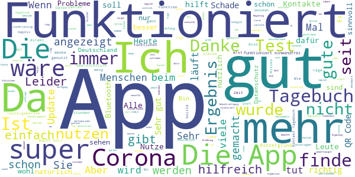

# Corona-Warn-App
App version ``1.12.0``

Analyzed with [covid-apps-observer](http://github.com/covid-apps-observer) project, version ``0.1``

## App overview
| | |
|-------------------------|-------------------------| 
| **Name**&nbsp;&nbsp;&nbsp;&nbsp;&nbsp;&nbsp;&nbsp;&nbsp;&nbsp;&nbsp;&nbsp;&nbsp;&nbsp;&nbsp;&nbsp;&nbsp;&nbsp;&nbsp;&nbsp;&nbsp;&nbsp;&nbsp;&nbsp;&nbsp;&nbsp;&nbsp;&nbsp;&nbsp;&nbsp;&nbsp;&nbsp;&nbsp;&nbsp;&nbsp;&nbsp;&nbsp;&nbsp;&nbsp;&nbsp;&nbsp;  | Corona-Warn-App |
| **Unique identifier** | de.rki.coronawarnapp |
| **Link to Google Play** | [https://play.google.com/store/apps/details?id=de.rki.coronawarnapp](https://play.google.com/store/apps/details?id=de.rki.coronawarnapp) |
| **Summary**  | Gemeinsam Corona bekämpfen |
| **Privacy policy** | [https://www.coronawarn.app/assets/documents/cwa-privacy-notice-de.pdf](https://www.coronawarn.app/assets/documents/cwa-privacy-notice-de.pdf) |
| **Latest version** | 1.12.0 |
| **Last update** | 2021-02-08 22:42:29 |
| **Recent changes** | Dieses Update stellt Fehlerbehebungen, Anpassungen in den App-Texten sowie folgende neuen Funktionen zur Verfügung:  - Nach Update auf eine neue Version zeigt Ihnen die App eine Übersicht der neu hinzugekommenen Funktionen an. Diese Info finden Sie auch unter App-Informationen -&gt; Neue Funktionen. - Das Kontakt-Tagebuch zeigt Ihnen für die letzten 15 Tage an, ob Ihr Risiko-Status erhöht oder niedrig war. Für Tage ohne Risiko-Begegnungen zeigt das Kontakt-Tagebuch keinen Risiko-Status an. |
| **Installs**  | 10.000.000+ |
| **Category** | Gesundheit & Fitness |
| **First release** | 12.06.2020 |
| **Size**  | 23M |
| **Supported Android version**  | 6.0 oder höher |

### Description
> Das Robert Koch-Institut (RKI) als zentrale Einrichtung des Bundes im Bereich der Öffentlichen Gesundheit und als nationales Public-Health-Institut veröffentlicht die Corona-Warn-App für die deutsche Bundesregierung und für die Bundesrepublik Deutschland. Die App fungiert als digitale Ergänzung zu Abstandhalten, Hygiene und Alltagsmaske. Wer sie nutzt, hilft, Infektionsketten schnell nachzuverfolgen und zu durchbrechen. Die App merkt sich dezentral unsere Begegnungen mit anderen und informiert uns digital, wenn wir Begegnungen mit nachweislich infizierten Personen hatten. Dabei sammelt sie jedoch zu keiner Zeit Informationen zur Identität ihrer Nutzerinnen und Nutzer. Wer wir sind und wo wir sind, bleibt geheim – und unsere Privatsphäre bestens geschützt.
 WIE DIE APP FUNKTIONIERT
 Die Risiko-Ermittlung der App ist das Herzstück der Software und sollte immer aktiviert sein. Wann immer sich Nutzerinnen und Nutzer begegnen, tauschen ihre Smartphones über Bluetooth verschlüsselte Zufalls-IDs aus.
 Diese geben nur Auskunft darüber, über welche Dauer und mit welchem Abstand eine Begegnung stattfand. Welche Person sich hinter einem Code verbirgt, ist für niemanden nachvollziehbar. Die Corona-Warn-App erhebt keine Informationen über den Ort der Begegnung oder den Standort der Nutzerinnen und Nutzer.
 Entsprechend der maximalen Corona-Inkubationszeit werden alle Zufalls-IDs, die unser Smartphone sammelt, für 14 Tage auf dem Smartphone gespeichert – und dann gelöscht.
 Nur wenn eine Person sich über die App freiwillig als nachweislich infiziert meldet, erhalten daraufhin alle früheren Begegnungen eine Warnung auf ihr Smartphone.
 Niemand erfährt, wann, wo oder mit wem eine entsprechende Risiko-Begegnung stattfand. Die infizierte Person bleibt anonym.
 Mit der Benachrichtigung erhalten die betroffenen Nutzer/-innen klare Handlungsempfehlungen. Wichtig: Auch die Daten der Benachrichtigten sind zu keiner Zeit einsehbar.
 WIE DIE DATEN SICHER BLEIBEN
 Die Corona-Warn-App soll uns zwar täglich begleiten, sie wird uns jedoch nie kennenlernen. Dadurch kann sie niemandem verraten, wer wir sind. Der Datenschutz bleibt über die gesamte Nutzungsdauer zu 100 Prozent gewahrt.
 • Keine Anmeldung: Es müssen keine E-Mail-Adresse und kein Name hinterlegt werden.
 • Keine Rückschlüsse auf Identitäten: Bei einer Begegnung mit einem anderen Menschen tauschen die Smartphones nur Zufalls-IDs aus. Diese messen, über welche Dauer und mit welchem Abstand ein Kontakt stattfand. Sie lassen aber keine Rückschlüsse auf Personen und Standorte zu.
 • Dezentrale Speicherung: Die Daten werden nur auf dem Smartphone gespeichert und nach 14 Tagen gelöscht.
 • Keine Einsicht für Dritte: Sowohl die Personen, die eine nachgewiesene Infektion melden, als auch die Benachrichtigten sind nicht nachverfolgbar – nicht für die Bundesregierung, nicht für das Robert Koch-Institut, nicht für andere User und auch nicht für die Betreiber der App-Stores.
 Diese App ist nicht zum Gebrauch außerhalb Deutschlands bestimmt. Die Corona-Warn-App ist die zentrale Corona-App für Deutschland und sie ist an das deutsche Gesundheitssystem angeschlossen. Trotzdem ist die Corona-Warn-App auch in diesem Land verfügbar. Sie ist gedacht für alle, die in Deutschland leben, arbeiten, Urlaub machen oder sich regelmäßig oder über längere Zeit in Deutschland aufhalten.
 Es gelten die Nutzungsbedingungen der Corona-Warn-App: https://www.coronawarn.app/assets/documents/cwa-eula-de.pdf. Durch die Installation und Nutzung dieser App stimmen Sie den Nutzungsbedingungen zu.

### User interface
The developers of the app provide the following screenshots in the Google play store.
| | | |
|:-------------------------:|:-------------------------:|:-------------------------:|
 |   |   |   | 
 |   |   |   | 
 |   |  

## Development team
In the following we report the main information provided by the development team in the Google play store.

| | |
|-------------------------|-------------------------|
| **Developer**  | Robert Koch-Institut |
| **Website**  | [https://www.coronawarn.app](https://www.coronawarn.app) |
| **Email** | CoronaWarnApp@rki.de |
| **Physical address**  | [Robert Koch-Institut Nordufer 20 13353 Berlin](https://www.google.com/maps/search/Robert%20Koch-Institut%20Nordufer%2020%2013353%20Berlin) (Google Maps) |
| **Other developed apps**  | [https://play.google.com/store/apps/developer?id=Robert+Koch-Institut](https://play.google.com/store/apps/developer?id=Robert+Koch-Institut) |

## Android support

| | |
|-------------------------|-------------------------|
| **Declared target Android version**  | Android10, version 10 (API level 29) |
| **Effective target Android version**  | Android10, version 10 (API level 29) |
| **Minimum supported Android version**  | Marshmallow, version 6.0 (API level 23) |
| **Maximum target Android version**  | - |

The larger the difference between the minimum and maximum supported Android versions, the better. A larger difference means a wider audience. For example, old phones have a very low Android version, so a high minimum supported Android version means that the app cannot be used by users with old phones, thus leading to accessibility problems. 

## Requested permissions

In the following we report the complete list of the permissions requested by the app. 

| **Permission** | **Protection level** | **Description** | 
|-------------------------|-------------------------|-------------------------|
 **android.permission ACCESS_NETWORK_STATE** | Normal | Allows applications to access information about networks. 
 **android.permission BLUETOOTH** | Normal | Allows applications to connect to paired bluetooth devices. 
 **android.permission CAMERA** | :warning:**Dangerous** | Required to be able to access the camera device. 
 **android.permission FOREGROUND_SERVICE** | Normal | Allows a regular application to use Service.startForeground. 
 **android.permission INTERNET** | Normal | Allows applications to open network sockets. 
 **android.permission RECEIVE_BOOT_COMPLETED** | Normal | Allows an application to receive the Intent.ACTION_BOOT_COMPLETED that is broadcast after the system finishes booting. 
 **android.permission REQUEST_IGNORE_BATTERY_OPTIMIZATIONS** | Normal | Permission an application must hold in order to use Settings.ACTION_REQUEST_IGNORE_BATTERY_OPTIMIZATIONS. 
 **android.permission WAKE_LOCK** | Normal | Allows using PowerManager WakeLocks to keep processor from sleeping or screen from dimming. 

## Mentioned servers

| **Server** | **Registrant** | **Registrant country** | **Creation date** | 
|-------------------------|-------------------------|-------------------------|-------------------------|
 | google.com | Google LLC | :us: US | 1997-09-15 04:00:00 |
 | android.com | Google LLC | :us: US | 1997-06-23 04:00:00 |

## Security analysis 

Below we report the main security warnings raised by our execution of the [Androwarn](https://github.com/maaaaz/androwarn) security analysis tool.

**Connection interfaces exfiltration**
> - This application reads details about the currently active data network 
> - This application tries to find out if the currently active data network is metered 

**Telephony services abuse**
> - This application makes phone calls 

**Suspicious connection establishment**
> - This application opens a Socket and connects it to the remote address '; port is out of range' on the 'N/A' port  
> - This application opens a Socket and connects it to the remote address 'Lcom/android/tools/r8/GeneratedOutlineSupport;->outline21(Ljava/lang/String;)Ljava/lang/StringBuilder;' on the 'N/A' port  
> - This application opens a Socket and connects it to the remote address 'Ljava/net/Proxy;->type()Ljava/net/Proxy$Type;' on the 'N/A' port  
> - This application opens a Socket and connects it to the remote address 'Method sendUrgentData() is not supported.' on the 'N/A' port  
> - This application opens a Socket and connects it to the remote address 'Method setHandshakeTimeout() is not supported.' on the 'N/A' port  
> - This application opens a Socket and connects it to the remote address 'Method setOOBInline() is not supported.' on the 'N/A' port  
> - This application opens a Socket and connects it to the remote address 'Method setSoWriteTimeout() is not supported.' on the 'N/A' port  
> - This application opens a Socket and connects it to the remote address 'Socket closed' on the 'N/A' port  
> - This application opens a Socket and connects it to the remote address 'Socket is closed' on the 'N/A' port  
> - This application opens a Socket and connects it to the remote address 'Socket is closed.' on the 'N/A' port  
> - This application opens a Socket and connects it to the remote address 'Socket is not connected.' on the 'N/A' port  
> - This application opens a Socket and connects it to the remote address 'socket is closed' on the 'N/A' port  
> - This application opens a Socket and connects it to the remote address 'timeout' on the 'N/A' port  

**Code execution**
> - This application loads a native library 
> - This application loads a native library: 'conscrypt_gmscore_jni' 
> - This application loads a native library: 'conscrypt_jni' 

## User ratings and reviews

Below we provide information about how end users are reacting to the app in terms of ratings and reviews in the Google Play store.

### Ratings

The Corona-Warn-App app has been installed by more than **10000000** times. At this time, **110498** rated the app and its average score is **3.0249555**. Below we show the distribution of the ratings across the usual star-based rating of Google Play

:star::star::star::star::star:: 39709

:star::star::star::star:: 11404

:star::star::star:: 10557

:star::star:: 9592

:star:: 39236

### Reviews 

#### 5-star reviews

> Hatte Corona  :date: __2021-02-27 11:29:47__

> Gibt mir Sicherheit.  :date: __2021-02-27 11:20:34__

> Die App wird immer besser. Das Tagebuch ist super easy zu nutzen. Die Zahlen sind hilfreich, eine Eingrenzung auf die eigene Region wäre jetzt noch hilfreich.  :date: __2021-02-27 09:32:01__

> Macht genau das, was sie soll! Um die Gesundheitsämter zu entlasten und eine schnelle Kontaktnachverfolgung zu ermöglichen, müssten aber sehr viel mehr Menschen die App nutzen und positive Testergebnisse freigeben, aber dazu müsste wohl ein Datensammelndes Privatunternehmen dahinter stehen ...  :date: __2021-02-27 09:30:41__

> Wichtiger Baustein in der Pandemieb ekämpfung  :date: __2021-02-27 08:27:16__

> Kritik TROTZ guter Bewertung: es gibt viele Menschen, die aus guten Gründen KEINE automatischen Updates eingeschaltet haben! Deswegen haben viele eine veraltete App! Einschalten von Updates ist KEINE Lösung. Es wäre gut wenn Google es dem Benutzer ermöglicht, nur gewünschte Apps upzudaten.  :date: __2021-02-27 06:45:22__

> Die App habe ich schon länger  :date: __2021-02-26 20:59:19__

> Ok  :date: __2021-02-26 19:29:22__

> keine Probleme, funktioniert wie gewünscht / App von Anfang installiert / beim Test QR-Code bekommen, Ergebnis war innerhalb 22 Stunden (Freitag Vormittag auf Samstag Früh) da / Einführung Tagebuch sehr sinnvoll, Danke dafür, nutze ich nun immer  :date: __2021-02-26 14:57:10__

> Tolle App. Sollte eigentlich jeder benutzen, dann könnte man sogar darauf verlassen, dass man angezeigt bekäme, wenn es eine Risiko Begegnung gab. Aber das ist nicht schuld der App. Auch ohne große Verbreitung ist die App nützlich. Mir hat gut gefallen mein Testergebnis schon am nächsten Tag anrufen zu können - Samstags. Meinen Hausarzt hatte ich da nicht erreicht.  :date: __2021-02-26 14:34:42__

#### 4-star reviews

> Corona App der Bundesregierung, - Lange Entwicklung,... bescheidene Wirkung. Die App ist insgesamt natürlich hilfreich, aber man fühlt sich nicht sicher mit App. Insgesamt würde ich mir mehr Mut wünschen. Vielleicht auch diesmal ein wenig weniger Datenschutz.... In Gedenken und im Gedenken an die, die durch die Corona Pandemie sterben müssen.... Und an die, die aus ihr lernen müssen... Es bleibt viel zu tun... (!)  :date: __2021-02-27 00:23:41__

> Man sollte jetzt auch angeben können, wenn man geimpft wurde.  :date: __2021-02-26 22:38:00__

> Ok  :date: __2021-02-26 17:31:50__

> Könnte man nicht mit der App die Impf-Termine vergeben und somit flexibel reagieren auf Impf-Lieferungen  :date: __2021-02-26 17:13:14__

> Seit einiger Zeit funktioniert die Aktualisierung der Risikobewertung nicht mehr gut. Würde die App ohne Internetzugang aufgerufen, dann wird diese Zeit als Aktualisierungszeit angezeigt. Bei späterem Aufrufen mit Onlinezugang wird dann nichts mehr aktualisiert, oder das zumindest nicht angezeigt. Ansonsten bin ich zufrieden, auch wenn es mE prozentual zu wenige Melder gibt.  :date: __2021-02-26 16:14:14__

> Eigentlich bringt die App nichts. Auch nervt, dass die aktuellen Zahlen häufig erst mittags angezeigt werden obwohl man sie schon morgens um 7 Uhr im Radio und Fernsehen hört. Ihr Antwort ist nicht plausibel. Das würde ja bedeuten, dass das RKI seine Daten veröffentlicht, ohne diese überprüft zu haben.  :date: __2021-02-26 14:44:47__

> Die App ist übersichtlich und strukturiert. Es wird daran erinnert, wenn bspw. Bluetooth ausgeschaltet ist, was sehr nützlich ist. Mein Coronatest wurde nur ca.20 Minuten nach dem Ergebnis im Labor (per Telefon) auch in der App angezeigt. Als besonders praktisch empfinde ich auch die aktuellen Infos über Fallzahlen etc. Einen erhöhten Akkuverbrauch kann ich auch nicht feststellen. Allerdings wäre denke ich eine App für Tizen, WearOS und Apple Watches nochmal ein bedeutender Schritt.  :date: __2021-02-26 12:00:04__

> Ich hatte seit Installieren noch kein erhöhtes Risiko. Das Abrufen der Tests, die ich gemacht habe, klappte nicht. Eine Frage: welchen Nutzen hat die App, wenn ich geimpft bin? Besten Dank für die Antwort  :date: __2021-02-26 06:33:56__

> Die App zeigt bereits seit Wochen keinen einzigen Risikokontakt an, obwohl ich ziemlich viel in der U-Bahn und Stadtzentrum unterwegs war. Das finde ich sehr seltsam. Gleichzeitig frage ich mich, ob es nicht sinnvoll wäre, wenn man auch eintragen könnte wenn man bereits geimpft wurde?  :date: __2021-02-25 13:00:09__

> Die App funktioniert bei mir von Anfang an prima, zieht keinen Akku und ist leicht zu bedienen. Wenn man die aktuellen Zahlen sehen möchte hat man diese unkompliziert auf einen Blick. Ich finde die Tagebuchoption prima, würde mir aber noch eine Rubrik "Notizen" wünschen um dort Dinge wie z.B. Symptome zu vermerken.  :date: __2021-02-25 11:26:44__

#### 3-star reviews

> Hatte ich im Sommer 2020, als es relativ wenig Neuinfektionen gab, ca. 10 Benachrichtigungen über Begegnungen mit niedrigem Risiko erhalten, mit 3 bis zu 7 Personen, so gab es seit Beginn der 2. Welle KEINE EINZIGE! Obwohl ich mich gleich und so oft wie bisher im öffentlichen Raum bewege. Stimmt da mit der Datenerhebung und -verbreitung etwas nicht? Edit: Nach guter Antwort Kommentar geändert.  :date: __2021-02-27 10:59:43__

> Leider kann ich die App nicht updaten  :date: __2021-02-27 10:35:58__

> Könnte noch besser werden  :date: __2021-02-27 08:05:17__

> Hätte mir eine breitere Verwendung der App gewünscht: Wenn bereits seine nächsten Partner nicht mitspielen ist ein großes "Einfallstor" für Viren nicht dokumentiert. Ist kein Problem der App! Das Führen des Tagebuchs ist super-einfach und schnell: ☆☆☆☆ Doof: Habe noch keine Möglichkeit gefunden, seltene / obsolete Kontakte wieder auszutragen. Am liebsten, automatisch, wenn seit mehr als 15 Tagen kein Kontakt mehr bestand. Doof: zu geringe Kompatibilität mit Nachbarstaaten (Frankreich, Belgien)  :date: __2021-02-27 06:11:20__

> Ohne Worte  :date: __2021-02-26 07:36:18__

> Meine Zahlen (Bestätigte Neuinfektionen) sind alle vom 24.02.2021. Warum wird das nicht aktualisiert?  :date: __2021-02-26 07:35:15__

> Habe die App nur über den Umwege NINA gefunden. Läuft auf RedMe S2 Bei meinem Honor X6 kommt immer die Fehlermeldung "Ursache 3 Etwas ist schief gelaufen. Fehler bei Kommunikation bei Google API (8)" 26.02.2021 Versuche seit Tagen das die App wieder läuft. Immer Fehler das Risikoüberprüfung fehlgeschlagen ist wegen Server trotz gutem WLAN.  :date: __2021-02-26 06:02:24__

> Ich habe diese App von Anfang an installiert. Soweit so gut. Nun ist ja ein Kontakt Tagebuch dazu gekommen das ist unter aller... Da schaut euch mal die App Coronika an da könnt ihr noch was lernen die ist wirklich top vielleicht würdet ihr gut daran tun diesen Entwickler mit in euer Team aufzunehmen  :date: __2021-02-25 22:40:29__

> sie liefert leider keine aktuellen Daten  :date: __2021-02-25 15:27:35__

> Ich denke die App könnte richtig gut sein. Offensichtlich ist mir entgangen das die Daten IRGENDWANN am Morgen aktualisiert werden. Ich frage mich zu welcher Uhrzeit? Auf jeden Fall sind die Zahlen aus zweiter Hand (Lokal Radio Gütersloh) morgens um 6 Uhr aktueller wie diese aus der App. Würde im Feld Bestätigte Neuinfektionen das Datum und Uhrzeit der Daten stehen wäre das perfekte.  :date: __2021-02-25 10:09:27__

#### 2-star reviews

> Zu kompliziert das Tagebuch. Wird zu wenig angezeigt. Trotz wissentlichenm Kontakt mit corona, keinerlei Anzeigen. Schade ist so wenig glaubwürdig.  :date: __2021-02-26 22:33:40__

> Wenn gerade mal um die 15% den Status pflegen, um andere zu warnen, ist das wenig. Mal abgesehen, wie viele die App überhaupt installiert haben. Was nützt sie ebenso, wenn jemand Corona hatte, aber kein Smartphone hat? Es gibt noch zahlreiche bremsende Aspekte, die den Sinn und Nutzen verhindern. Schade  :date: __2021-02-26 21:07:12__

> Überzeugend geht anders  :date: __2021-02-26 19:29:43__

> Meldung wie vielen Personen ich begegnet bin, oder überhaupt irgendwas um zu sehen das die App was tut und nicht tot ist ...  :date: __2021-02-26 17:24:28__

> Die App ist ansich okay aber am 23.02 wurde ich getestet und es wird bis heute kein Ergebnis angezeigt. So das ich über mein Laborergebniss schauen musste und dort bekam ich endlich meine Info  :date: __2021-02-26 14:25:50__

> Bin gerade im Klinikum, wo ich das Testergenis von meinem Sohn vorzeigen muss. Leider habe ich den QR-Code schon einmal zu Hause gescannt und geloescht, somit muss ich versuchen den Kinderarzt zu kontaktieren, der dann wieder zurueckrufen muss. Das ist leider eindach nur schlecht! Die Begruendung des Entwicklers aendert leider nichts am Umstand, dass die Usability schlecht ist.  :date: __2021-02-26 12:17:28__

> Man sollte auch negative Testergebnisse eingeben können, damit ich bei weiteren Lockerungen nicht immer den Zettel mitnehmen muss.  :date: __2021-02-26 11:04:56__

> Die App sollte der große Durchbruch sein, letztendlich ist es aber ein stumpfes Schwert. Verbesserungen - verpflichtende positive Testmeldungen durch zentrale Stelle einstellen und nicht freiwillig durch Anwender - Impfpass für Corona integrieren (EU weit vlt) - Test Nachweis integrieren bei Tests in Apotheken - Möglichkeiten zur besseren Rückverfolgung wo die Benutzer waren Die Bürger wollen Freiheiten, dann sollte eine bessere Nachvollziehbarkeit gewährleistet werden durch die App.  :date: __2021-02-26 10:26:45__

> Geht mir tierisch auf den Keks. Habe die App zum Erhalt der Testergebnisse heruntergeladen. Da ich zur Zeit nicht außer Haus arbeite und mir alles andere liefern lasse, müsste ich niemanden von einer positiven Testung warnen. Ebenso muss Bluetooth nicht an sein. Beides moniert die App alle paar Stunden. Ich entscheide, was ich mache und wann ich es mache. Ein oder zwei Hinweise reichen. Aber das ist schlichtweg Psychoterror, der ans Gewissen appelliert. Deinstallation unausweichlich.  :date: __2021-02-26 10:17:42__

> Bringt bis jetzt wenig....  :date: __2021-02-26 06:20:04__

#### 1-star reviews

> Obwohl ich den Test gestern gemacht habe und ich hier mein QR-Code eingescannt habe, meldet die App mir, das mein Test schon mehr als 14 Tage her ist und somit mein Ergebnis nicht mehr verfügbar ist. Wie soll man so wissen ob man positiv ist oder nicht? Dann kann sich das eintragen hier auch schenken und direkt den Arzt konsultieren. Unbrauchbar diese App , was die Testergebnisse betrifft.  :date: __2021-02-27 12:40:26__

> Immer wenn ich die App öffnen kommt steht dort: Risikoermittlung fehlgeschlagen. Hab die aktuelle Version der App, benutztes Handy ist ein Nokia 3,2.  :date: __2021-02-27 11:27:46__

> Obwohl ich in der REHA Einrichting Bad Schmiedeberg mit einer positiv getesteten Physiotherapeutin gearbeitet habe, zeigt diese App keine Risiko Begegnung an. Entweder meldet die Klinik nicht diese Begegnung oder die Gesundheitsämter arbeiten nicht oder die App ist einfach schlecht. Ich werde entlassen und stecke ggf Menschen an. Eine Mitteilung vom Gesundheitsamt liegt auch nicht vor !!  :date: __2021-02-27 11:07:38__

> Durch überzogenen Datenschutz extrem teuer und unbrauchbar gemacht. Ein millionenschwerer Rohrkrepierer.  :date: __2021-02-27 09:11:06__

> Hab vor ein paar Tagen einen test machen müssen. Hab ihn in der app hinterlegt. Ich warte dort immer noch auf das Ergebnis. Hab sicherheitshalber mal versucht das Ergebnis per SMS abzufragen. Naja und siehe da die Antwort hatte ich innerhalb weniger Minuten. Das ist jetzt zwei Tage her und laut der app ist mein test immer noch in Bearbeitung. Deswegen kann ich hier nicht mehr als einen Stern geben. Richtig schlecht gemacht. Wäre ich jetzt positiv dann hätte die app noch niemanden gewarnt.  :date: __2021-02-27 08:30:31__

> eine Woche nach Test kein Ergebnis, also ab in den Müll  :date: __2021-02-27 07:32:24__

> Wann und wo war ein Risikokontakt? Ohne diese Info nutzlos. Auf vielen älteren Smartphones läuft die App nicht. Schrott! PS: Auch nach feedback von RKI: Wenn ich nicht weiß wann/wo der Kontakt war ist das wenig hilfreich. Warum kann man keine Ergebnisse von Schnelltests einpflegen? Ich lass mich vor Livemeetings testen.  :date: __2021-02-27 07:15:55__

> Also das ist ja nun wirklich das Schlechteste was ich in der gesamten Pandemie erlebt habe. Hab mir ja schon die ganze Zeit gedacht das die App nichts taugt. Nun musste ich es aber leider wirklich selbst testen und wusste nun genau das es richtig war die App bisher nicht zu installieren. Seit gestern früh warte ich auf mein Testergebnis aber die App bleibt verstummt. Das ist doch großer Mist. Ganz ehrlich, hier in Deutschland klappt doch nichts. Bin enttäuscht  :date: __2021-02-27 06:32:44__

> Spielerei! Ich fahre beruflich (ärztlich bestätigte!!) Corona-positive Menschen und Verdachtsfälle. Ich bin an vielen verschiedenen Orten, an dem der Abstand regelmäßig unterschritten werden muss. Die "Warn-"App ist seit der Veröffentlichung durchgängig installiert, täglich geöffnet, regelmäßig aktuallisiert. Anzeige der App immer "Keine Risiko-Begegnungen". Bei einigen Personen, die ich transportiert habe weiß ich sicher, dass sie die App installiert hatten und "POSITIV" eingetragen ist.  :date: __2021-02-27 05:20:46__

> Fatal Versagt! War Positiv getestet. Sollte einen QR Code des tests scannen, damit alle die mit mir Kontakt hatten informieren werden. Hat nicht funktioniert. Die app weiß bis heute nicht dass das Gesundheitsamt mich positiv getestet hat. Niemand würde informiert. Einzige Aufgabe der App... total versagt!! 0 Sterne. Und wieder mal durfte der Steuerzahler Millionen zahlen für so einen Mist!  :date: __2021-02-26 23:43:13__

