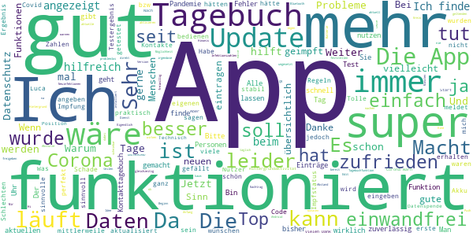
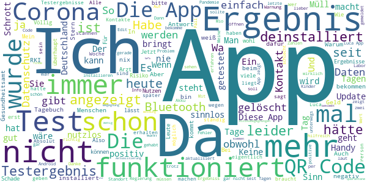

# Corona-Warn-App
App version ``1.14.3``

Analyzed with [covid-apps-observer](http://github.com/covid-apps-observer) project, version ``0.1``

## App overview
| | |
|-------------------------|-------------------------| 
| **Name**&nbsp;&nbsp;&nbsp;&nbsp;&nbsp;&nbsp;&nbsp;&nbsp;&nbsp;&nbsp;&nbsp;&nbsp;&nbsp;&nbsp;&nbsp;&nbsp;&nbsp;&nbsp;&nbsp;&nbsp;&nbsp;&nbsp;&nbsp;&nbsp;&nbsp;&nbsp;&nbsp;&nbsp;&nbsp;&nbsp;&nbsp;&nbsp;&nbsp;&nbsp;&nbsp;&nbsp;&nbsp;&nbsp;&nbsp;&nbsp;  | Corona-Warn-App |
| **Unique identifier** | de.rki.coronawarnapp |
| **Link to Google Play** | [https://play.google.com/store/apps/details?id=de.rki.coronawarnapp](https://play.google.com/store/apps/details?id=de.rki.coronawarnapp) |
| **Summary**  | Gemeinsam Corona bekämpfen |
| **Privacy policy** | [https://www.coronawarn.app/assets/documents/cwa-privacy-notice-de.pdf](https://www.coronawarn.app/assets/documents/cwa-privacy-notice-de.pdf) |
| **Latest version** | 1.14.3 |
| **Last update** | 2021-03-08 18:47:23 |
| **Recent changes** | Dieses Update bietet Ihnen neben Fehlerbehebungen folgende neue Funktionen:  - Erweiterungen des Kontakt-Tagebuchs Sie können nun direkt auf das Kontakt-Tagebuch zugreifen: Tippen Sie 2 Sek auf das App-Icon, dann auf „Tagebuch-Eintrag für heute hinzufügen“. Sie können Notizen und weitere Angaben erfassen. - Sie sehen nun, ob ein erhöhtes Risiko aufgrund mehrerer Begegnungen mit erhöhtem oder niedrigem Risiko angezeigt wird. - Unter https://www.coronawarn.app finden Sie Screenshots zur App. |
| **Installs**  | 10.000.000+ |
| **Category** | Gesundheit & Fitness |
| **First release** | 12.06.2020 |
| **Size**  | 25M |
| **Supported Android version**  | 6.0 oder höher |

### Description
> Das Robert Koch-Institut (RKI) als zentrale Einrichtung des Bundes im Bereich der Öffentlichen Gesundheit und als nationales Public-Health-Institut veröffentlicht die Corona-Warn-App für die deutsche Bundesregierung und für die Bundesrepublik Deutschland. Die App fungiert als digitale Ergänzung zu Abstandhalten, Hygiene und Alltagsmaske. Die App basiert auf Bluetooth-Technologie und der Exposure Notification API von Google. Wer sie nutzt, hilft, Infektionsketten schnell nachzuverfolgen und zu durchbrechen. Die App merkt sich dezentral unsere Begegnungen mit anderen und informiert uns digital, wenn wir Begegnungen mit nachweislich infizierten Personen hatten. Dabei sammelt sie jedoch zu keiner Zeit Informationen zur Identität ihrer Nutzerinnen und Nutzer. Wer wir sind und wo wir sind, bleibt geheim – und unsere Privatsphäre bestens geschützt.
 WIE DIE APP FUNKTIONIERT
 Die Risiko-Ermittlung der App ist das Herzstück der Software und sollte immer aktiviert sein. Wann immer sich Nutzerinnen und Nutzer begegnen, tauschen ihre Smartphones über Bluetooth verschlüsselte Zufalls-IDs aus.
 Diese geben nur Auskunft darüber, über welche Dauer und mit welchem Abstand eine Begegnung stattfand. Welche Person sich hinter einem Code verbirgt, ist für niemanden nachvollziehbar. Die Corona-Warn-App erhebt keine Informationen über den Ort der Begegnung oder den Standort der Nutzerinnen und Nutzer.
 Entsprechend der maximalen Corona-Inkubationszeit werden alle Zufalls-IDs, die unser Smartphone sammelt, für 14 Tage auf dem Smartphone gespeichert – und dann gelöscht.
 Nur wenn eine Person sich über die App freiwillig als nachweislich infiziert meldet, erhalten daraufhin alle früheren Begegnungen eine Warnung auf ihr Smartphone.
 Niemand erfährt, wann, wo oder mit wem eine entsprechende Risiko-Begegnung stattfand. Die infizierte Person bleibt anonym.
 Mit der Benachrichtigung erhalten die betroffenen Nutzer/-innen klare Handlungsempfehlungen. Wichtig: Auch die Daten der Benachrichtigten sind zu keiner Zeit einsehbar.
 WIE DIE DATEN SICHER BLEIBEN
 Die Corona-Warn-App soll uns zwar täglich begleiten, sie wird uns jedoch nie kennenlernen. Dadurch kann sie niemandem verraten, wer wir sind. Der Datenschutz bleibt über die gesamte Nutzungsdauer zu 100 Prozent gewahrt.
 • Keine Anmeldung: Es müssen keine E-Mail-Adresse und kein Name hinterlegt werden.
 • Keine Rückschlüsse auf Identitäten: Bei einer Begegnung mit einem anderen Menschen tauschen die Smartphones nur Zufalls-IDs aus. Diese messen, über welche Dauer und mit welchem Abstand ein Kontakt stattfand. Sie lassen aber keine Rückschlüsse auf Personen und Standorte zu.
 • Dezentrale Speicherung: Die Daten werden nur auf dem Smartphone gespeichert und nach 14 Tagen gelöscht.
 • Keine Einsicht für Dritte: Sowohl die Personen, die eine nachgewiesene Infektion melden, als auch die Benachrichtigten sind nicht nachverfolgbar – nicht für die Bundesregierung, nicht für das Robert Koch-Institut, nicht für andere User und auch nicht für die Betreiber der App-Stores.
 Diese App ist nicht zum Gebrauch außerhalb Deutschlands bestimmt. Die Corona-Warn-App ist die zentrale Corona-App für Deutschland und sie ist an das deutsche Gesundheitssystem angeschlossen. Trotzdem ist die Corona-Warn-App auch in diesem Land verfügbar. Sie ist gedacht für alle, die in Deutschland leben, arbeiten, Urlaub machen oder sich regelmäßig oder über längere Zeit in Deutschland aufhalten.
 Es gelten die Nutzungsbedingungen der Corona-Warn-App: https://www.coronawarn.app/assets/documents/cwa-eula-de.pdf. Durch die Installation und Nutzung dieser App stimmen Sie den Nutzungsbedingungen zu.

### User interface
The developers of the app provide the following screenshots in the Google play store.
| | | |
|:-------------------------:|:-------------------------:|:-------------------------:|
 |   |   |   | 
 |   |   |   | 
 |   |  

## Development team
In the following we report the main information provided by the development team in the Google play store.

| | |
|-------------------------|-------------------------|
| **Developer**  | Robert Koch-Institut |
| **Website**  | [https://www.coronawarn.app](https://www.coronawarn.app) |
| **Email** | CoronaWarnApp@rki.de |
| **Physical address**  | [Robert Koch-Institut Nordufer 20 13353 Berlin](https://www.google.com/maps/search/Robert%20Koch-Institut%20Nordufer%2020%2013353%20Berlin) (Google Maps) |
| **Other developed apps**  | [https://play.google.com/store/apps/developer?id=Robert+Koch-Institut](https://play.google.com/store/apps/developer?id=Robert+Koch-Institut) |

## Android support

| | |
|-------------------------|-------------------------|
| **Declared target Android version**  | Android10, version 10 (API level 29) |
| **Effective target Android version**  | Android10, version 10 (API level 29) |
| **Minimum supported Android version**  | Marshmallow, version 6.0 (API level 23) |
| **Maximum target Android version**  | - |

The larger the difference between the minimum and maximum supported Android versions, the better. A larger difference means a wider audience. For example, old phones have a very low Android version, so a high minimum supported Android version means that the app cannot be used by users with old phones, thus leading to accessibility problems. 

## Requested permissions

In the following we report the complete list of the permissions requested by the app. 

| **Permission** | **Protection level** | **Description** | 
|-------------------------|-------------------------|-------------------------|
 **android.permission ACCESS_NETWORK_STATE** | Normal | Allows applications to access information about networks. 
 **android.permission BLUETOOTH** | Normal | Allows applications to connect to paired bluetooth devices. 
 **android.permission CAMERA** | :warning:**Dangerous** | Required to be able to access the camera device. 
 **android.permission FOREGROUND_SERVICE** | Normal | Allows a regular application to use Service.startForeground. 
 **android.permission INTERNET** | Normal | Allows applications to open network sockets. 
 **android.permission RECEIVE_BOOT_COMPLETED** | Normal | Allows an application to receive the Intent.ACTION_BOOT_COMPLETED that is broadcast after the system finishes booting. 
 **android.permission REQUEST_IGNORE_BATTERY_OPTIMIZATIONS** | Normal | Permission an application must hold in order to use Settings.ACTION_REQUEST_IGNORE_BATTERY_OPTIMIZATIONS. 
 **android.permission WAKE_LOCK** | Normal | Allows using PowerManager WakeLocks to keep processor from sleeping or screen from dimming. 

## Mentioned servers

| **Server** | **Registrant** | **Registrant country** | **Creation date** | 
|-------------------------|-------------------------|-------------------------|-------------------------|
 | google.com | Google LLC | :us: US | 1997-09-15 04:00:00 |
 | android.com | Google LLC | :us: US | 1997-06-23 04:00:00 |

## Security analysis 

Below we report the main security warnings raised by our execution of the [Androwarn](https://github.com/maaaaz/androwarn) security analysis tool.

**Connection interfaces exfiltration**
> - This application reads details about the currently active data network 
> - This application tries to find out if the currently active data network is metered 

**Telephony services abuse**
> - This application makes phone calls 

**Suspicious connection establishment**
> - This application opens a Socket and connects it to the remote address '; port is out of range' on the 'N/A' port  
> - This application opens a Socket and connects it to the remote address 'Lcom/android/tools/r8/GeneratedOutlineSupport;->outline27(Ljava/lang/String;)Ljava/lang/StringBuilder;' on the 'N/A' port  
> - This application opens a Socket and connects it to the remote address 'Ljava/net/Proxy;->type()Ljava/net/Proxy$Type;' on the 'N/A' port  
> - This application opens a Socket and connects it to the remote address 'Method sendUrgentData() is not supported.' on the 'N/A' port  
> - This application opens a Socket and connects it to the remote address 'Method setHandshakeTimeout() is not supported.' on the 'N/A' port  
> - This application opens a Socket and connects it to the remote address 'Method setOOBInline() is not supported.' on the 'N/A' port  
> - This application opens a Socket and connects it to the remote address 'Method setSoWriteTimeout() is not supported.' on the 'N/A' port  
> - This application opens a Socket and connects it to the remote address 'Socket closed' on the 'N/A' port  
> - This application opens a Socket and connects it to the remote address 'Socket is closed' on the 'N/A' port  
> - This application opens a Socket and connects it to the remote address 'Socket is closed.' on the 'N/A' port  
> - This application opens a Socket and connects it to the remote address 'Socket is not connected.' on the 'N/A' port  
> - This application opens a Socket and connects it to the remote address 'socket is closed' on the 'N/A' port  
> - This application opens a Socket and connects it to the remote address 'timeout' on the 'N/A' port  

**Code execution**
> - This application loads a native library 
> - This application loads a native library: 'conscrypt_gmscore_jni' 
> - This application loads a native library: 'conscrypt_jni' 

## User ratings and reviews

Below we provide information about how end users are reacting to the app in terms of ratings and reviews in the Google Play store.

### Ratings

The Corona-Warn-App app has been installed by more than **10000000** times. At this time, **113324** rated the app and its average score is **2.9517379**. Below we show the distribution of the ratings across the usual star-based rating of Google Play

:star::star::star::star::star:: 38783

:star::star::star::star:: 11562

:star::star::star:: 10870

:star::star:: 9622

:star:: 42487

### Reviews 

#### 5-star reviews

> Seit dem letzten Update wird die Statistik nicht mehr aktualisiert. Mein letzter Stand 12.03.21. Danke für den Lösungsvorschlag. Hat funktioniert. Statistik ist jetzt wieder aktuell. Danke  :date: __2021-03-14 13:05:08__

> App tut ihren Dienst sehr unauffällig und gut. Wunsch: Anhand der eingestellten Datenspende/GPS-Position in Kombination mit den aktuellen Inzidenzen auf die an der Position geltenden Regeln hinweisen. Der Wechsel z.B. zwischen "Geschäfte sind geöffnet" zu "Terminvergabe" wäre so für jeden an seiner Position nachvollziehbar.  :date: __2021-03-14 11:53:01__

> Tut, was es soll.  :date: __2021-03-14 09:10:40__

> Die App wird immer besser!!!! Freue mich mehr Möglichkeiten zu haben andere zu warnen! Macht weiter so !! Gemeinsam werden wir die Pandemie schon zerschlagen.  :date: __2021-03-13 23:07:38__

> Top  :date: __2021-03-13 23:01:51__

> Bisher keine Meldungen. Ob die App korrekt ist na ja keine Ahnung. Hab sie halt an. Hab die App jetzt nach Monaten gelöscht ich sehe keinen Sinn in der App. Nun ich bin zu 90% Zuhause und hab Bluetooth aus. Die App meldet penetrant das ich es an machen soll. Es reicht eine Meldung. Das war auch ein Grund der Deinstallation. OK Danke für die Info. Im System Nachrichten deaktivieren , ja das wäre auch gegangen... Nun... Jetzt ist es so.  :date: __2021-03-13 20:51:11__

> Ist doch ne tolle Sache :). Und wenns hilft, gerne!!  :date: __2021-03-13 20:07:49__

> Sehr gut gemachte App. Technisch einwandfrei und robust... gefällt mir. Die neuen Statistiken und Zahlen sind informativ...  :date: __2021-03-13 18:03:29__

> Funktioniert hervorragend!!  :date: __2021-03-13 16:41:10__

> Bin zufrieden  :date: __2021-03-13 15:57:33__

#### 4-star reviews

> Wäre super wenn man mittlerweile seine Impfung eintragen könnte.  :date: __2021-03-14 14:51:16__

> Die Tagebuch Funktion ist hilfreich.  :date: __2021-03-14 12:03:45__

> Wieder keine aktuellen Infektions-Daten. Stand 2 Tage alt. Problem ist nun lange genug bekannt.  :date: __2021-03-14 11:48:30__

> Seit update schlägt die Risiko Überprüfung oft fehl. Ich versteh nicht, warum die nicht jeder installiert  :date: __2021-03-14 00:24:39__

> So langsam wird's ja! Endlich ein vernünftiges Kontakttagebuch! Jetzt vielleicht noch zur Auswahl: "< 1,5 m" bzw. "> 1,5 m" und "gelüftet" bzw. "nicht gelüftet" und dann passts.  :date: __2021-03-13 20:17:53__

> Ganz gut, klasse wer es wenn man die Ergebnisse der Schnelltest irgendwie eingeben kann.  :date: __2021-03-13 18:40:57__

> Ich finde die App soweit gut, nur ich hätte gerne, das man den 7 Tages Inzidenz nicht nur Deutschland weit, sondern per PLZ auch regional sieht. Ich möchte ja gerne wissen wann die Geschäfte bei mir wieder aufmachen. LG  :date: __2021-03-13 14:33:49__

> Bin sehr zufrieden  :date: __2021-03-13 13:12:12__

> Im großen und Ganzen gut. Allerdings ist die digitale Schnittstelle zu den Testzentren nicht ganz reibungsfrei, hier sollte eine einfachere Anbindung des Tests an die App ermöglicht werden. Das Abfotografieren mit nur einem Gerät (z. B. Smartphone) ist schwer zu bewerkstelligen. Man muss da wohl den Code ausdrucken oder an einem Drittgerät abfotografieren...  :date: __2021-03-13 09:55:16__

> Bisher halte ich die App für sinnvoll. Ich habe nix gefunden, was gegen die Installation spricht. Nach dem letzten Update kann man die App nicht mehr auf die SD-Karte verschieben. Sie frisst also nötig Speicher.  :date: __2021-03-13 09:17:49__

#### 3-star reviews

> Am Anfang OK aber im Moment seit Tagen nur noch Fehlermeldungen.  :date: __2021-03-14 13:40:11__

> Ausdruck vom Test Ergebnis für Kita, Schule als Nachweis ist nicht möglich  :date: __2021-03-14 12:15:20__

> Nicht so gut.  :date: __2021-03-13 23:19:00__

> Zu was sollte ich diese App installieren? Das Testergebnis wird mir eh per Brief zugeteilt.... Digitalisierung läuft... Test am 19.10 gemacht, Ergebnis 27.10. App aktualisiert wohl nie... Stand zur Antwort auf meine Email. 'wir bekommen sehr viele Anfragen und können nicht auf jede antworten' somit ist ein Stern aus meiner Sicht immer noch zuviel. Für mich nutzlos... Auch der zweite test, sehr wahrscheinlich ein aderes labor, erscheint nicht in der app...es wird mir auch keine lösung angeboten.  :date: __2021-03-13 20:28:39__

> App finde ich grundsätzlich gut. Aber: wie kann ich die rote Warnmeldung zurücksetzen? Ich wurde negativ getestet, ohne QR Code, ohne TAN. Das scheint nicht vorgesehen zu sein. Jedenfalls steht die Warnmeldung jetzt dauerhaft. Wenn ich neu installiere, sind sicher alle Daten weg und ich muss von vorne anfangen, mit der Datensammlung. Ist irgendwie sinnlos.  :date: __2021-03-13 17:23:50__

> Leider erhalte ich nach dem letzten Update vom 8.3.21 nun ständig im ausgeschalteten Modus - wenn ich nur zu Hause und nicht unter Menschen bin, daher Bluetooth und Standortdienst deaktiviert habe - eine nervige englische Benachrichtigung: Unable to check for ecposures. Das nervt kolossal und ich überlege, die App zu löschen. Wer kann hier helfen?  :date: __2021-03-13 16:21:12__

> Bei der neuen Version kann man verschiedene Optionen wählen. Drinnen, draußen, mit Maske etc. Diese Informationen wird aber beim Namen angezeigt und nicht beim Vorgang. Nicht aussagekräftig.  :date: __2021-03-13 16:10:31__

> Die App hat sich sehr verbessert. Nutze nun seit zwei Tagen die aktuelle Version. Besonders die Tagebuch-Funktion - da bin ich echt überrascht - positiv!! Wenn nun noch die Zeiten auf 10 Miinuten-Intervalle geändert würde statt 15 Minuten. Dann wäre es nahezu perfekt. Das passt besser zu Bereichen wie im Ruhrgebiet wo man nicht 30 Miinuten in der selben S- /U-Bahn fährt. Dagegen hätte man sich die Statistik sparen können. Mich zumindest interessiert es nicht, also warum auf der Startseite?!  :date: __2021-03-13 16:02:38__

> Update klappte mehrfach nicht  :date: __2021-03-13 14:11:15__

> Geht so, habe bisher keinen Mehrwert, da wahrscheinlich zu wenig genutzt, sind die Warnungen bei Risiko Begegnung nicht viel wert,  :date: __2021-03-13 13:54:57__

#### 2-star reviews

> Die alte App war besser die neue ist umständlich sorry 👎  :date: __2021-03-14 15:27:10__

> Abwahl 2021. 6 sozialistische Blockparteien arbeiten gegen Deutschland u. die einzig verbliebene Oppositionspartei. /Bundeswehr im Einsatz für eine chinesische Luxusklinik in Portugal, wurde abgefeiert. /2019, 630 Mio Entwicklungshilfe an China, P4-Labor-Virus funktioniert, danke. Sitzen Chinesen in Berlin schon in der Regierung? /9,3 Mio € Druckkosten für Bons, 27 Mio Porto für deren Versendung, 6,- €/Stück an Apotheker für Masken die es beim Discounter für 1 € gibt. /OP gelungen, Patient tot.  :date: __2021-03-14 13:33:40__

> Um 12:30 immer noch die Zahlen von Vorgestern. Warum keine Regionalen Zahlen in der App?  :date: __2021-03-14 12:33:21__

> Zuviel Datenschutz an falscher Stelle. Von einer breiten Akzeptanz in der Bevölkerung kann nicht gesprochen werden, wenn nur jede 7. Infektion über die App gemeldet wird. Eine App die ihren Zweck erfüllt würde für Akzeptanz sorgen. Datenschutz ist gut, zuviel Datenschutz kann tödlich sein. Nur weil Datenschutzfetischisten am lautesten brüllen, sollte man denen nicht nachgeben, die breite Bevölkerung will eine wirkungsvolle App. Ich benutze die App trotzdem.  :date: __2021-03-14 09:25:13__

> Die wertvollste Neuerung ist wohl, dass, wenn Bluetooth nicht eingeschaltet ist, die Meldung in der Statuszeile jetzt in Englisch erscheint. Wir sind ja so bunt und weltoffen.  :date: __2021-03-13 20:03:26__

> Hiermit möchte ich bitte keinen Teilnehmer!bitte in meinem Privat App nicht mehr zusuchen auf installieren müssen!akzeptiert bitte das danke  :date: __2021-03-13 19:06:12__

> Ganz ehrlich... okay... bis auf ein Manko: Wenn man zu Hause ist oder allein auf weiter Flur. Im Bett oder oder... immer diese bescheuerte Nachricht... es ist nicht aktiv es muss aktiviert werden... Und nein, ich konnte in den letzten Stunden keinen bösen Kontakt haben weil ich nirgends war. Es nervt.  :date: __2021-03-13 18:26:48__

> Ich wollte die App bei einem älteren Bekannten (73) installieren. Die App ist aber nicht mit seinem Handy (huawei LYO-L21) kompatibel....  :date: __2021-03-13 16:18:05__

> Nun ja. Nett gemeint. Bin nun Kontakt ersten Grades. App behauptet immernoch alles i.O. Das liegt daran, das weder der positiv getestete Kollege noch ich sein Testergebnis melden kann. Dadurch leider vollkommen nutzlos!  :date: __2021-03-13 12:30:16__

> Wie kann man im Kontakt Tagebuch falsche oder versehentlich eingetragene Kontakte wieder löschen? Man findet nirgendwo einen Hinweis. Außerdem bekomme ich fast jeden zweiten Tag den Hinweis 'Risikoermittlung fehlgeschlagen".  :date: __2021-03-13 11:12:22__

#### 1-star reviews

> Ich entdecke nun die Thailändische App COSTE, und verstehe, (auch wegen der Flughafen-Organisation hier) warum eine ähnlich grosse Bevölkerung(70mio) offiziell keine 5tsd Positive im ganzen Jahr hat, (50tsd dürfte es eher treffen, Räusper), und wir 🇩🇪 haben nun über 28tsd Positive JEDEN TAG. COSTE darf GPS, Mikrophon und Kamera, und braucht keine "Zettel in Restaurants". Vielleicht lernt man ja mal von den Gegenden, die SARS und Vogelgrippe hatten. (Thai chana kenne ich nicht)  :date: __2021-03-14 15:13:37__

> Ich musste einen test machen und hab mein Ergebnis erst 3 Monate später in App angezeigt bekommen da hatte ich es schon längst vom Arzt. Völliger Schrott die App  :date: __2021-03-14 15:09:39__

> Bei mir erscheint ständig der Hinweis: "Ihre Corona Warn App läuft fehlerfrei. Leider können Sie Ihren Risikostatus im Moment nicht aktualisieren." Nicht sehr hilfreich. Zwischenzeitlich lief die App, aber jetzt, einige Monate später öffnet sie sich von heute auf morgen gar nicht mehr. So etwas braucht kein Mensch.  :date: __2021-03-14 14:50:39__

> Hat die App ein 12 Jähriger programmiert?  :date: __2021-03-14 14:45:48__

> Minus Sterne Absolut Schrott Es ist nix richtig Sofort deinstalliert den dreckigen rotz  :date: __2021-03-14 14:34:59__

> Der größte Schrott von einer App.  :date: __2021-03-14 13:59:24__

> Sie ist einfach nur mist.  :date: __2021-03-14 13:44:26__

> Eigentlich traurig, wofür schweineviel Steuergeld ausgegeben wurde und wird  :date: __2021-03-14 13:25:09__

> Was soll das?  :date: __2021-03-14 12:20:53__

> PCR Test am 09.03 gemacht nun 14.03 Immernoch Kein Egebniss . Das ist Eben Das Problem wenn man nur ein Normaler Bürger / Mensch ist . Da gibt es die 0850 Behandlung nicht das Bonus Spezial Programm . Wäre ich ein Promi oder Jemand Wichtiges Hätte ich das Ergebniss schon am 09.03 . So Läuft eben die Welt und das Gesundheitssystem . Glaubt nicht das die für uns einen Finger Krum Machen . Seit deswegen Vorsichtig ihr seht selbst wie es Abläuft !  :date: __2021-03-14 12:00:24__

