# Corona-Warn-App
App version ``1.15.1``

Analyzed with [covid-apps-observer](http://github.com/covid-apps-observer) project, version ``0.1``

## App overview
| | |
|-------------------------|-------------------------| 
| **Name**&nbsp;&nbsp;&nbsp;&nbsp;&nbsp;&nbsp;&nbsp;&nbsp;&nbsp;&nbsp;&nbsp;&nbsp;&nbsp;&nbsp;&nbsp;&nbsp;&nbsp;&nbsp;&nbsp;&nbsp;&nbsp;&nbsp;&nbsp;&nbsp;&nbsp;&nbsp;&nbsp;&nbsp;&nbsp;&nbsp;&nbsp;&nbsp;&nbsp;&nbsp;&nbsp;&nbsp;&nbsp;&nbsp;&nbsp;&nbsp;  | Corona-Warn-App |
| **Unique identifier** | de.rki.coronawarnapp |
| **Link to Google Play** | [https://play.google.com/store/apps/details?id=de.rki.coronawarnapp](https://play.google.com/store/apps/details?id=de.rki.coronawarnapp) |
| **Summary**  | Gemeinsam Corona bekämpfen |
| **Privacy policy** | [https://www.coronawarn.app/assets/documents/cwa-privacy-notice-de.pdf](https://www.coronawarn.app/assets/documents/cwa-privacy-notice-de.pdf) |
| **Latest version** | 1.15.1 |
| **Last update** | 2021-03-22 18:31:35 |
| **Recent changes** | Dieses Update bietet Ihnen neben Fehlerbehebungen folgende neue und geänderte Funktionen:  - Länderübergreifende Risiko-Ermittlung für die Schweiz   Die verschlüsselte Zufalls-IDs können nun auch mit der offiziellen Warn-App der Schweiz ausgetauscht werden. Somit können Warnungen auch an die App nutzende Personen in der Schweiz geschickt sowie von ihnen empfangen werden. - Auf den Risikokarten entfällt die Anzeige der Anzahl aktiver Tage bzw. dass die App dauerhaft aktiv ist. |
| **Installs**  | 10.000.000+ |
| **Category** | Gesundheit & Fitness |
| **First release** | 12.06.2020 |
| **Size**  | 25M |
| **Supported Android version**  | 6.0 oder höher |

### Description
> Das Robert Koch-Institut (RKI) als zentrale Einrichtung des Bundes im Bereich der Öffentlichen Gesundheit und als nationales Public-Health-Institut veröffentlicht die Corona-Warn-App für die deutsche Bundesregierung und für die Bundesrepublik Deutschland. Die App fungiert als digitale Ergänzung zu Abstandhalten, Hygiene und Alltagsmaske. Die App basiert auf Bluetooth-Technologie und der Exposure Notification API von Google. Wer sie nutzt, hilft, Infektionsketten schnell nachzuverfolgen und zu durchbrechen. Die App merkt sich dezentral unsere Begegnungen mit anderen und informiert uns digital, wenn wir Begegnungen mit nachweislich infizierten Personen hatten. Dabei sammelt sie jedoch zu keiner Zeit Informationen zur Identität ihrer Nutzerinnen und Nutzer. Wer wir sind und wo wir sind, bleibt geheim – und unsere Privatsphäre bestens geschützt.
 WIE DIE APP FUNKTIONIERT
 Die Risiko-Ermittlung der App ist das Herzstück der Software und sollte immer aktiviert sein. Wann immer sich Nutzerinnen und Nutzer begegnen, tauschen ihre Smartphones über Bluetooth verschlüsselte Zufalls-IDs aus.
 Diese geben nur Auskunft darüber, über welche Dauer und mit welchem Abstand eine Begegnung stattfand. Welche Person sich hinter einem Code verbirgt, ist für niemanden nachvollziehbar. Die Corona-Warn-App erhebt keine Informationen über den Ort der Begegnung oder den Standort der Nutzerinnen und Nutzer.
 Entsprechend der maximalen Corona-Inkubationszeit werden alle Zufalls-IDs, die unser Smartphone sammelt, für 14 Tage auf dem Smartphone gespeichert – und dann gelöscht.
 Nur wenn eine Person sich über die App freiwillig als nachweislich infiziert meldet, erhalten daraufhin alle früheren Begegnungen eine Warnung auf ihr Smartphone.
 Niemand erfährt, wann, wo oder mit wem eine entsprechende Risiko-Begegnung stattfand. Die infizierte Person bleibt anonym.
 Mit der Benachrichtigung erhalten die betroffenen Nutzer/-innen klare Handlungsempfehlungen. Wichtig: Auch die Daten der Benachrichtigten sind zu keiner Zeit einsehbar.
 WIE DIE DATEN SICHER BLEIBEN
 Die Corona-Warn-App soll uns zwar täglich begleiten, sie wird uns jedoch nie kennenlernen. Dadurch kann sie niemandem verraten, wer wir sind. Der Datenschutz bleibt über die gesamte Nutzungsdauer zu 100 Prozent gewahrt.
 • Keine Anmeldung: Es müssen keine E-Mail-Adresse und kein Name hinterlegt werden.
 • Keine Rückschlüsse auf Identitäten: Bei einer Begegnung mit einem anderen Menschen tauschen die Smartphones nur Zufalls-IDs aus. Diese messen, über welche Dauer und mit welchem Abstand ein Kontakt stattfand. Sie lassen aber keine Rückschlüsse auf Personen und Standorte zu.
 • Dezentrale Speicherung: Die Daten werden nur auf dem Smartphone gespeichert und nach 14 Tagen gelöscht.
 • Keine Einsicht für Dritte: Sowohl die Personen, die eine nachgewiesene Infektion melden, als auch die Benachrichtigten sind nicht nachverfolgbar – nicht für die Bundesregierung, nicht für das Robert Koch-Institut, nicht für andere User und auch nicht für die Betreiber der App-Stores.
 Diese App ist nicht zum Gebrauch außerhalb Deutschlands bestimmt. Die Corona-Warn-App ist die zentrale Corona-App für Deutschland und sie ist an das deutsche Gesundheitssystem angeschlossen. Trotzdem ist die Corona-Warn-App auch in diesem Land verfügbar. Sie ist gedacht für alle, die in Deutschland leben, arbeiten, Urlaub machen oder sich regelmäßig oder über längere Zeit in Deutschland aufhalten.
 Es gelten die Nutzungsbedingungen der Corona-Warn-App: https://www.coronawarn.app/assets/documents/cwa-eula-de.pdf. Durch die Installation und Nutzung dieser App stimmen Sie den Nutzungsbedingungen zu.

### User interface
The developers of the app provide the following screenshots in the Google play store.
| | | |
|:-------------------------:|:-------------------------:|:-------------------------:|
 | 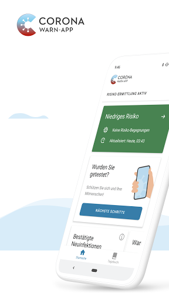  | 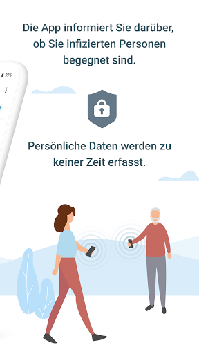  | 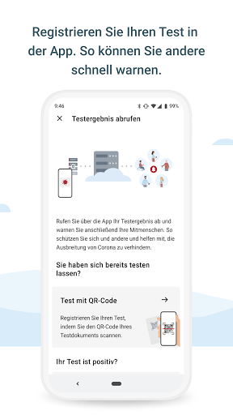  | 
 | 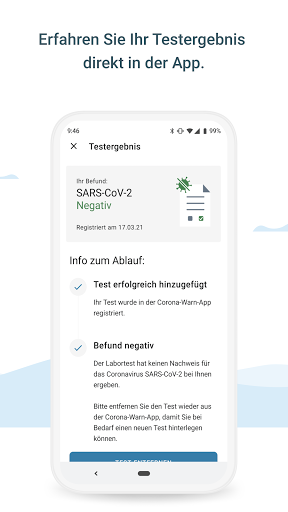  | 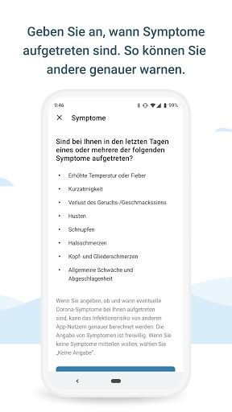  | 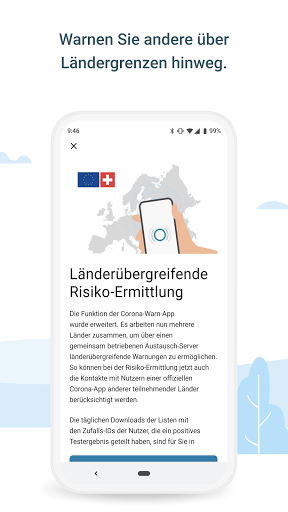  | 
 | 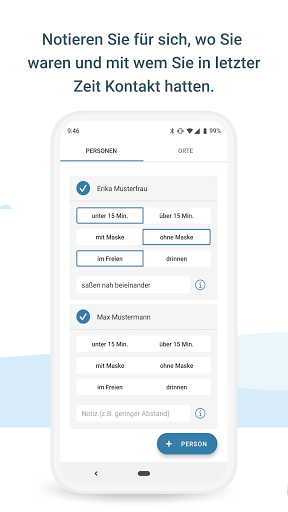  | 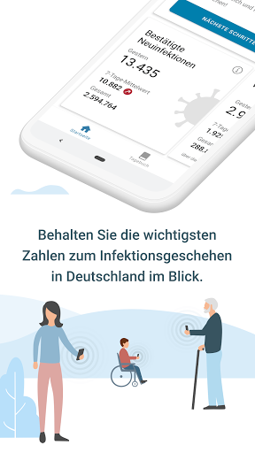 

## Development team
In the following we report the main information provided by the development team in the Google play store.

| | |
|-------------------------|-------------------------|
| **Developer**  | Robert Koch-Institut |
| **Website**  | [https://www.coronawarn.app](https://www.coronawarn.app) |
| **Email** | CoronaWarnApp@rki.de |
| **Physical address**  | [Robert Koch-Institut Nordufer 20 13353 Berlin](https://www.google.com/maps/search/Robert%20Koch-Institut%20Nordufer%2020%2013353%20Berlin) (Google Maps) |
| **Other developed apps**  | [https://play.google.com/store/apps/developer?id=Robert+Koch-Institut](https://play.google.com/store/apps/developer?id=Robert+Koch-Institut) |

## Android support

| | |
|-------------------------|-------------------------|
| **Declared target Android version**  | Android10, version 10 (API level 29) |
| **Effective target Android version**  | Android10, version 10 (API level 29) |
| **Minimum supported Android version**  | Marshmallow, version 6.0 (API level 23) |
| **Maximum target Android version**  | - |

The larger the difference between the minimum and maximum supported Android versions, the better. A larger difference means a wider audience. For example, old phones have a very low Android version, so a high minimum supported Android version means that the app cannot be used by users with old phones, thus leading to accessibility problems. 

## Requested permissions

In the following we report the complete list of the permissions requested by the app. 

| **Permission** | **Protection level** | **Description** | 
|-------------------------|-------------------------|-------------------------|
 **android.permission ACCESS_NETWORK_STATE** | Normal | Allows applications to access information about networks. 
 **android.permission BLUETOOTH** | Normal | Allows applications to connect to paired bluetooth devices. 
 **android.permission CAMERA** | :warning:**Dangerous** | Required to be able to access the camera device. 
 **android.permission FOREGROUND_SERVICE** | Normal | Allows a regular application to use Service.startForeground. 
 **android.permission INTERNET** | Normal | Allows applications to open network sockets. 
 **android.permission RECEIVE_BOOT_COMPLETED** | Normal | Allows an application to receive the Intent.ACTION_BOOT_COMPLETED that is broadcast after the system finishes booting. 
 **android.permission REQUEST_IGNORE_BATTERY_OPTIMIZATIONS** | Normal | Permission an application must hold in order to use Settings.ACTION_REQUEST_IGNORE_BATTERY_OPTIMIZATIONS. 
 **android.permission WAKE_LOCK** | Normal | Allows using PowerManager WakeLocks to keep processor from sleeping or screen from dimming. 

## Mentioned servers

| **Server** | **Registrant** | **Registrant country** | **Creation date** | 
|-------------------------|-------------------------|-------------------------|-------------------------|
 | google.com | Google LLC | :us: US | 1997-09-15 04:00:00 |
 | android.com | Google LLC | :us: US | 1997-06-23 04:00:00 |

## Security analysis 

Below we report the main security warnings raised by our execution of the [Androwarn](https://github.com/maaaaz/androwarn) security analysis tool.

**Connection interfaces exfiltration**
> - This application reads details about the currently active data network 
> - This application tries to find out if the currently active data network is metered 

**Telephony services abuse**
> - This application makes phone calls 

**Suspicious connection establishment**
> - This application opens a Socket and connects it to the remote address '; port is out of range' on the 'N/A' port  
> - This application opens a Socket and connects it to the remote address 'Lcom/android/tools/r8/GeneratedOutlineSupport;->outline26(Ljava/lang/String;)Ljava/lang/StringBuilder;' on the 'N/A' port  
> - This application opens a Socket and connects it to the remote address 'Ljava/net/Proxy;->type()Ljava/net/Proxy$Type;' on the 'N/A' port  
> - This application opens a Socket and connects it to the remote address 'Method sendUrgentData() is not supported.' on the 'N/A' port  
> - This application opens a Socket and connects it to the remote address 'Method setHandshakeTimeout() is not supported.' on the 'N/A' port  
> - This application opens a Socket and connects it to the remote address 'Method setOOBInline() is not supported.' on the 'N/A' port  
> - This application opens a Socket and connects it to the remote address 'Method setSoWriteTimeout() is not supported.' on the 'N/A' port  
> - This application opens a Socket and connects it to the remote address 'Socket closed' on the 'N/A' port  
> - This application opens a Socket and connects it to the remote address 'Socket is closed' on the 'N/A' port  
> - This application opens a Socket and connects it to the remote address 'Socket is closed.' on the 'N/A' port  
> - This application opens a Socket and connects it to the remote address 'Socket is not connected.' on the 'N/A' port  
> - This application opens a Socket and connects it to the remote address 'socket is closed' on the 'N/A' port  
> - This application opens a Socket and connects it to the remote address 'timeout' on the 'N/A' port  

**Code execution**
> - This application loads a native library 
> - This application loads a native library: 'conscrypt_gmscore_jni' 
> - This application loads a native library: 'conscrypt_jni' 

## User ratings and reviews

Below we provide information about how end users are reacting to the app in terms of ratings and reviews in the Google Play store.

### Ratings

The Corona-Warn-App app has been installed by more than **10000000** times. At this time, **115059** rated the app and its average score is **2.8632524**. Below we show the distribution of the ratings across the usual star-based rating of Google Play

:star::star::star::star::star:: 37262

:star::star::star::star:: 11260

:star::star::star:: 10813

:star::star:: 9930

:star:: 45794

### Reviews 

#### 5-star reviews

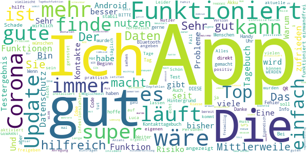

> Mittlerweile sehr nützlich - neben der eigentlichen Warnfunktion gibt es: - ein einfach bedienbares Kontakttagebuch - guter Überblick über das aktuelle Infektionsgeschehen  :date: __2021-03-28 15:07:35__

> Gut gemacht, aber leider völlig unberechtigt von zu vielen Menschen nicht genutzt. Ich werde die App auf jeden Fall so lange wie nötig nutzen und hoffe, dass die Verweigerer den "Knall" auch noch wahrnehmen, vor allen Dingen diejenigen, die in sozialen Medien täglich öffentlich einen kompletten Striptease hinlegen. Hier sind die eigenen Daten mit Sicherheit besser aufgehoben.  :date: __2021-03-28 14:19:07__

> Danke Angela Merkel!  :date: __2021-03-28 13:38:05__

> Macht einen sehr guten Eindruck. Super dass der Code auf Github einsehbar ist. Großes Lob. Schön wäre es wenn man die Inzidenz des eigenen Landkreises und Bundesland sehen könnte.  :date: __2021-03-28 12:55:49__

> One Plus 7 obwohl Bluetooth aktiviert ist, sagt die App nicht aktiviert. Erst Aus-und Wiedereinschalten von Bluetooth wird von der App dann erkannt. App lief bis zum letzten Update jetzt erscheint nur das Logo auf schwarzem Grund. Update: Fehler liegt nicht an der App. Zum Problem kommt es, wenn WLAN verbunden, aber kein Internetzugang existiert. Die App nutzt vorrangig WLAN vor mobiler Verbindung.  :date: __2021-03-28 10:16:02__

> Funktioniert fehlerfrei und macht es sie soll.  :date: __2021-03-28 09:33:29__

> Erfassung von positiven POC-Ergebnissen wäre noch eine sinnvolle Ergänzung  :date: __2021-03-28 09:24:48__

> Einfach Super  :date: __2021-03-28 09:17:08__

> Ich frage sie. Fehlt für Selbsttest für zu Hause, dann Ergebnis. Warum nicht. Empfehlen Sie erstellt neue eintragen. Danke vorraus! Mfg  :date: __2021-03-27 20:48:20__

> 👍  :date: __2021-03-27 20:25:23__

#### 4-star reviews

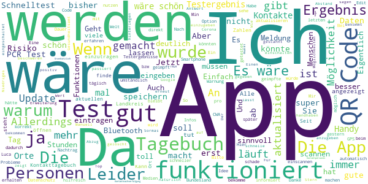

> An sich: Wunderbar. App funktioniert. ABER: Einen Stern Abzug, weil die App sich nicht Manuell aktualisieren lässt. (auf neue Risikobegegnungen). Wir hatten einen Gast, Der sich als positiv herausgestellt hat, und er hat uns auch informiert. Allerdings hat die App bisher nur einen von uns informiert  :date: __2021-03-28 13:16:55__

> Wo ist die Möglichkeit in der App einzugeben, dass man Geimpft wurde?  :date: __2021-03-28 09:00:21__

> Wenn diese App nur jeder nutzen würde. Leider kann man hier nur Tests aus Deutschland eingeben. Für ausländische Tests oder Selbsttests gibt es keine Möglichkeiten diese zu hinterlegen. Danke für die super schnelle Antwort. Einen ausländischen Test zu hinterlegen ist zwar dann gegeben, aber zu kompliziert und nicht intuitiv.  :date: __2021-03-27 20:14:14__

> Funktioniert soweit und hat bis jetzt keine Probleme gemacht. Gute Erweiterung mit dem Kontaktagebuch und zusätzlichen Infos. Eine sinnvoll Ergänzung zu den normalen Vorsichtsmaßnahmen wie Maske, Abstand und Händewaschen.  :date: __2021-03-27 19:39:55__

> Schnelle Regestrierung vor Ort.  :date: __2021-03-27 16:43:22__

> An sich informativ aber ich wurde mehrmals getestet und habe keinen QR Code um das anzugeben. Sehr schade.  :date: __2021-03-27 16:06:56__

> Diese App ist sehr gut. Es wäre schön, wenn wie ich geimpfte mit Code mit in dieser App drin wäre. Habe in der Zeitung gelesen mit Sormas App. Bei Google Play ist was anderes unter Sormas. Wäre super, wenn ich auf diese App auch ein Code bekomme als geimpfte.  :date: __2021-03-27 12:21:54__

> Ich vertehe nicht warum sich manche beschweren das man gebeten wird das GPS und Bluetooth einzuschalten. Die App benötigt dies nunmal. Das einzige was ich zu bemängeln habe ist dass die App nicht aktualisiert. Es wäre schön das wenn ich mein GPS und Bluetooth wieder einschalten die App auch aktualisiert. Das passiert nichtmal nach Stunden wenn alles eingeschaltet ist. Wenn ich also nur zu Hause bin warum sollte ich das alles eingeschaltet lassen?  :date: __2021-03-26 21:37:27__

> Läuft super. Allerdings verstehe ich nicht warum Kontaktdaten der letzten 14 Tage gespeichert werden, wenn das Gesundheitsamt nur nach den letzten zwei Tagen fragt!?! Wie wollen wir so Corona in den Griff bekommen ?  :date: __2021-03-26 18:37:31__

> Einfach toll, man fühlt sich sicherer! Meine Testergebnisse erhalte ich elektronisch, wie soll ich da qr-Codes scannen?  :date: __2021-03-26 18:10:44__

#### 3-star reviews

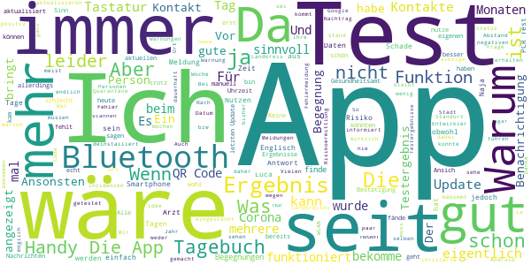

> App ist noch immer ausbaufähig. Warum sehe ich nicht den Inzidenzwert meines Bundeslandes bzw. der Stadt/des Landkreises, in dem ich mich momentan aufhalte? Das Kontakttagebuch ist manuell mühselig. Warum tauscht man nicht ganz einfach qr-Codes gegenseitig aus?  :date: __2021-03-28 11:18:58__

> Kkkimm  :date: __2021-03-28 09:42:38__

> Wäre ja klasse wenn man in dieser App noch den Tagesaktuellen Inzidenzwert für seinen Landkreis/ seine Stadt ablesen könnte. Vielleicht können die App Entwickler da dran arbeiten...  :date: __2021-03-28 09:28:53__

> Naja.... Ich nutze die App seit den ersten Tagen, durch Updates ist die Funktion eigentlich besser geworden. Vor allem das Tagebuch, wenn man es akribisch führt, halte ich für sinnvoll. Was aber gar nichts bringt ist die Tatsache, daß das Gesundheitsamt bei positivem PCR Test anruft und in der App, trotz eingescannt QR Code immer noch kein Testergebnis vorliegt. Auch eine (optionale) Mitteilung an meine Kontakte aus dem Tagebuch fände ich gut.  :date: __2021-03-28 09:02:12__

> Anzahl aktiver Tage ohne Begründung entfernt. Eigentlich schon ne wichtige Info, daher unverständlich.  :date: __2021-03-28 03:34:14__

> Sei kurzem erhalte ich stündlich Nachrichten auf Englisch, die mich darauf aufmerksam machen, dass meine Bluetooth-Funktion ausgeschaltet ist. Ich bin selbst sehr gut in der Lage, darüber zu entscheiden, wann ich diese Funktion brauche. Wenn diese nervtötenden Benachrichtigungen nicht schnellstens wieder abgeschafft werden, deinstalliere ich die App. Und das kann ja wohl nicht im Sinne des Robert-Koch-Institutes sein. Gut gemeint ist eben nicht gut gemacht.  :date: __2021-03-28 01:10:52__

> Ansich eine gute Idee aber wenn man eine Risiko-Begegnung hat wäre es toll zu wissen in welchen ungefähren Zeitraum man eine Infizierte Persom getroffen hat.  :date: __2021-03-27 21:03:37__

> Gute App. Doch leider bringt die Bestätigung eines negativen Tests beim Gesundheitsamt nichts. Die wollen eine schriftliche Bestätigung. Warum wird die PDF nicht mitgeliefert. Nachtrag zu Antwort: Ich meinte nicht die Bestätigung des Befundes, sondern, dass mit der Bestätigung des negativen Ergebnisses kein Schreiben für das GA heruntergeladen werden kann.  :date: __2021-03-27 19:37:35__

> Eigentlich gut und sinnvoll. Ein wichtiger Baustein. Aber wenn ich die Orte bearbeite, kann ich nur bei einem Eintrag mit der Tastatur arbeiten. Bei einem zweiten, dritten, .... bietet mir die App die Tastatur gar nicht an. Ich muss dann warten, warten, warten. Das ist nicht praktisch.  :date: __2021-03-27 10:09:04__

> Was der App fehlt sind Funktionen wie die der luca App. Ein kleiner Bug ist das Großschreiben jedes neuen Wortes mit der Gboard Tastatur im Tagebuch. Eingestellt ist bei mir nur Großschreibung bei neuem Satzanfang.  :date: __2021-03-27 09:20:12__

#### 2-star reviews

> Ich kann nicht nachvollziehen, weshalb man die Schnellteste nicht zusätzlich zu den Pcr Testen erfassen kann... Werde die App dennoch weiter nutzen, sehe mittlerweile aber nicht mehr den Sinn....  :date: __2021-03-28 14:59:41__

> Max. 6 Prozent Trefferquote (weil so wenige Menschen mitmachen), dazu nur auf Deutschland und wenige Nachbarländer beschränkt, zieht dafür erheblich Akku (BLE kann mein Handy nicht) und verursachte die maximal höchsten Entwicklungskosten. SINNLOS! Ein Beispiel dafür, wie die Politik mit ihren Egoismen eine gute und wichtige Idee voll an die Wand fährt! Da ich nicht auf Partys gehe und vom ÖPNV auf's Auto umgestiegen bin, werde ich die App jetzt vor meinem Auslandsurlaub deinstallieren und glaube auch nicht, dass ich sie noch einmal installiere.  :date: __2021-03-28 13:43:03__

> Also, ich habe mich am Freitag 26. Vormittag testen lassen. Meinem Arzt versprach mich ein Ergebnis für Samstag Abend. Heute, Sonntag Nachmittag, habe ich noch nichts "testergebnis liegt noch nicht vor" . Ich müßte nach frankreich um wichtige Formulare zu unterschreiben . Es wird leider nicht mehr möglich sein und dafür habe ich noch ca. 110€ bezahlt. So jetzt, muß ich den Termin verschieben und mich noch einmal testen lassen. Toll!  :date: __2021-03-28 13:00:01__

> Seit dem vorletzten Update erhalte ich mehrere Male am Tag die Meldung "Unable to check for exposures". Ich weiß, dass dies ein Android Problem ist. Dennoch liegt es in Ihrer Verantwortung, da dies nur bei dieser App erscheint. Sehr ärgerlich. Es wäre schön, wenn endlich eine Lösung mit Android gefunden wird. Danke.  :date: __2021-03-28 10:49:39__

> Ich habe meinen Test aus versehen gelöscht. Als den Code nochmal scannen wollte, sei der Code nicht gültig,da er schon mal gescannt wurde. Außerdem fand ich die App total unübersichtlich.  :date: __2021-03-28 10:31:57__

> Die Grundidee ist schon gut. Die Umsetzung allerdings ist kompliziert. Nicht alle Teststationen nutzen diese App zur Auswertung. 2 x von meinem HNO-Arzt getestet, 1 x angezeigt - 1 x habe ich vergebens auf das Testergebnis gewartet (weder positiv, noch negativ, noch Test nicht verwertbar). Hausarzt nutzt ein anderes System. Fazit: Ich sehe keinen Grund, diese App weiter auf meinem Handy zu behalten. Laufend GPS an frisst Strom.  :date: __2021-03-28 10:31:08__

> Aktualisiert: vorgestern!!!! Nach dem letzten Update das gleiche Was soll das? Jetzt kommt die App runter. Samsung S7, Android 8  :date: __2021-03-28 10:27:21__

> Die App ist ehrlich, viele Menschen wollen das wohl nicht. Der Nutzer kann eine Gefährdung verschweigen? Und leider ist es keine einheitliche Version für Europa :(  :date: __2021-03-28 09:57:54__

> Nervt langsam. Seit dem letzten Update ständig Meldungen das Bluetooth nicht eingeschaltet ist. Wenn ich nicht unterwegs bin, brauche ich die Verfolgung nicht. Warum ständig die Abfrage?  :date: __2021-03-28 09:24:15__

> Was ist das für eine "tolle" Sache wenn jetzt private Entwickler mit Luca richten müssen was unsere "großartige" Regierung mit ihre App nicht hinbekommen kann. Unglaublich!  :date: __2021-03-27 17:07:40__

#### 1-star reviews

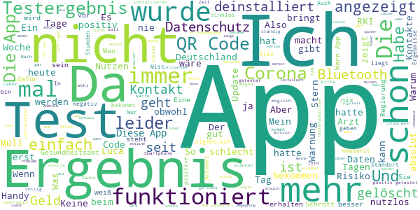

> Diese App bietet mir absolut nichts  :date: __2021-03-28 14:09:48__

> Nicht einmal 20% der Infizierten warnen über die CWA. Diese App ist mindestens ein lahmer Gaul, eher doch ein totes Pferd.  :date: __2021-03-28 13:03:15__

> Was soll der Mist bringen?  :date: __2021-03-28 12:52:27__

> Andauernd nur die Meldung "Risiko-Überprüfung fehlgeschlagen" (Android 7.1) . Telefonisch halte ich für sinnlos, da die App keine genaueren Infos gibt, außer "fehlgeschlagen". Einstellung sind mehrmals geprüft. Es ist schade, dass Geräte mit einem älteren Android so vernachlässigt werden. Update: Nein, nicht behoben. (19.03.2021) Immernoch keine Details zur Fehlermeldung!  :date: __2021-03-28 12:45:38__

> Ich mag kein corona  :date: __2021-03-28 12:29:33__

> Keine genauen Daten  :date: __2021-03-28 12:11:10__

> Auf priv. & Diensthandy installiert, zeigen jedoch unterschiedliches an!  :date: __2021-03-28 12:05:41__

> Obwohl ich "bewussten" Kontakt zu einem nachweislich an Covid19 erkrankten Patienten, der ebenfalls die WarnApp installiert hat, habe ich auch 2 Tage später KEINE Informationen darüber erhalten. (Zum Verständnis, ich arbeite im RD...) Die Tochter teilte mir mit das alle 3 Haushalte diese App nutzen. Und ich hatte jetzt mehrfach Kontakt zu positiven Menschen/Patienten und nicht einmal bekam ich eine Warnung. Ich kann deshalb keine Empfehlung aussprechen.  :date: __2021-03-28 11:42:28__

> Schlecht wenn positive erst eingeben sollten diese in Isolation sein  :date: __2021-03-28 10:24:18__

> Schwuuul  :date: __2021-03-28 10:18:24__

