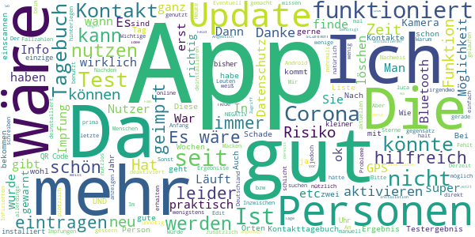
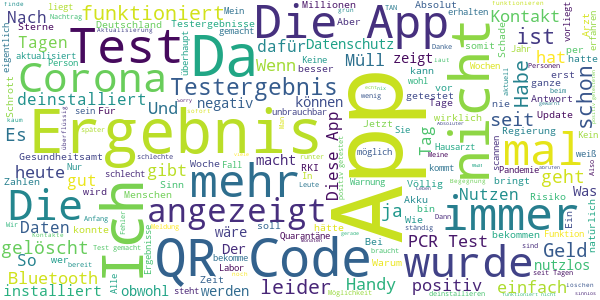

# Corona-Warn-App
App version ``1.15.2``

Analyzed with [covid-apps-observer](http://github.com/covid-apps-observer) project, version ``0.1``

## App overview
| | |
|-------------------------|-------------------------| 
| **Name**&nbsp;&nbsp;&nbsp;&nbsp;&nbsp;&nbsp;&nbsp;&nbsp;&nbsp;&nbsp;&nbsp;&nbsp;&nbsp;&nbsp;&nbsp;&nbsp;&nbsp;&nbsp;&nbsp;&nbsp;&nbsp;&nbsp;&nbsp;&nbsp;&nbsp;&nbsp;&nbsp;&nbsp;&nbsp;&nbsp;&nbsp;&nbsp;&nbsp;&nbsp;&nbsp;&nbsp;&nbsp;&nbsp;&nbsp;&nbsp;  | Corona-Warn-App |
| **Unique identifier** | de.rki.coronawarnapp |
| **Link to Google Play** | [https://play.google.com/store/apps/details?id=de.rki.coronawarnapp](https://play.google.com/store/apps/details?id=de.rki.coronawarnapp) |
| **Summary**  | Gemeinsam Corona bekämpfen |
| **Privacy policy** | [https://www.coronawarn.app/assets/documents/cwa-privacy-notice-de.pdf](https://www.coronawarn.app/assets/documents/cwa-privacy-notice-de.pdf) |
| **Latest version** | 1.15.2 |
| **Last update** | 2021-03-29 19:43:00 |
| **Recent changes** | Mit diesem Update beheben wir einen Fehler. |
| **Installs**  | 10.000.000+ |
| **Category** | Gesundheit & Fitness |
| **First release** | 12.06.2020 |
| **Size**  | 25M |
| **Supported Android version**  | 6.0 oder höher |

### Description
> Das Robert Koch-Institut (RKI) als zentrale Einrichtung des Bundes im Bereich der Öffentlichen Gesundheit und als nationales Public-Health-Institut veröffentlicht die Corona-Warn-App für die deutsche Bundesregierung und für die Bundesrepublik Deutschland. Die App fungiert als digitale Ergänzung zu Abstandhalten, Hygiene und Alltagsmaske. Die App basiert auf Bluetooth-Technologie und der Exposure Notification API von Google. Wer sie nutzt, hilft, Infektionsketten schnell nachzuverfolgen und zu durchbrechen. Die App merkt sich dezentral unsere Begegnungen mit anderen und informiert uns digital, wenn wir Begegnungen mit nachweislich infizierten Personen hatten. Dabei sammelt sie jedoch zu keiner Zeit Informationen zur Identität ihrer Nutzerinnen und Nutzer. Wer wir sind und wo wir sind, bleibt geheim – und unsere Privatsphäre bestens geschützt.
 WIE DIE APP FUNKTIONIERT
 Die Risiko-Ermittlung der App ist das Herzstück der Software und sollte immer aktiviert sein. Wann immer sich Nutzerinnen und Nutzer begegnen, tauschen ihre Smartphones über Bluetooth verschlüsselte Zufalls-IDs aus.
 Diese geben nur Auskunft darüber, über welche Dauer und mit welchem Abstand eine Begegnung stattfand. Welche Person sich hinter einem Code verbirgt, ist für niemanden nachvollziehbar. Die Corona-Warn-App erhebt keine Informationen über den Ort der Begegnung oder den Standort der Nutzerinnen und Nutzer.
 Entsprechend der maximalen Corona-Inkubationszeit werden alle Zufalls-IDs, die unser Smartphone sammelt, für 14 Tage auf dem Smartphone gespeichert – und dann gelöscht.
 Nur wenn eine Person sich über die App freiwillig als nachweislich infiziert meldet, erhalten daraufhin alle früheren Begegnungen eine Warnung auf ihr Smartphone.
 Niemand erfährt, wann, wo oder mit wem eine entsprechende Risiko-Begegnung stattfand. Die infizierte Person bleibt anonym.
 Mit der Benachrichtigung erhalten die betroffenen Nutzer/-innen klare Handlungsempfehlungen. Wichtig: Auch die Daten der Benachrichtigten sind zu keiner Zeit einsehbar.
 WIE DIE DATEN SICHER BLEIBEN
 Die Corona-Warn-App soll uns zwar täglich begleiten, sie wird uns jedoch nie kennenlernen. Dadurch kann sie niemandem verraten, wer wir sind. Der Datenschutz bleibt über die gesamte Nutzungsdauer zu 100 Prozent gewahrt.
 • Keine Anmeldung: Es müssen keine E-Mail-Adresse und kein Name hinterlegt werden.
 • Keine Rückschlüsse auf Identitäten: Bei einer Begegnung mit einem anderen Menschen tauschen die Smartphones nur Zufalls-IDs aus. Diese messen, über welche Dauer und mit welchem Abstand ein Kontakt stattfand. Sie lassen aber keine Rückschlüsse auf Personen und Standorte zu.
 • Dezentrale Speicherung: Die Daten werden nur auf dem Smartphone gespeichert und nach 14 Tagen gelöscht.
 • Keine Einsicht für Dritte: Sowohl die Personen, die eine nachgewiesene Infektion melden, als auch die Benachrichtigten sind nicht nachverfolgbar – nicht für die Bundesregierung, nicht für das Robert Koch-Institut, nicht für andere User und auch nicht für die Betreiber der App-Stores.
 Diese App ist nicht zum Gebrauch außerhalb Deutschlands bestimmt. Die Corona-Warn-App ist die zentrale Corona-App für Deutschland und sie ist an das deutsche Gesundheitssystem angeschlossen. Trotzdem ist die Corona-Warn-App auch in diesem Land verfügbar. Sie ist gedacht für alle, die in Deutschland leben, arbeiten, Urlaub machen oder sich regelmäßig oder über längere Zeit in Deutschland aufhalten.
 Es gelten die Nutzungsbedingungen der Corona-Warn-App: https://www.coronawarn.app/assets/documents/cwa-eula-de.pdf. Durch die Installation und Nutzung dieser App stimmen Sie den Nutzungsbedingungen zu.

### User interface
The developers of the app provide the following screenshots in the Google play store.
| | | |
|:-------------------------:|:-------------------------:|:-------------------------:|
 |   |   |   | 
 |   |   |   | 
 |   |  

## Development team
In the following we report the main information provided by the development team in the Google play store.

| | |
|-------------------------|-------------------------|
| **Developer**  | Robert Koch-Institut |
| **Website**  | [https://www.coronawarn.app](https://www.coronawarn.app) |
| **Email** | CoronaWarnApp@rki.de |
| **Physical address**  | [Robert Koch-Institut Nordufer 20 13353 Berlin](https://www.google.com/maps/search/Robert%20Koch-Institut%20Nordufer%2020%2013353%20Berlin) (Google Maps) |
| **Other developed apps**  | [https://play.google.com/store/apps/developer?id=Robert+Koch-Institut](https://play.google.com/store/apps/developer?id=Robert+Koch-Institut) |

## Android support

| | |
|-------------------------|-------------------------|
| **Declared target Android version**  | Android10, version 10 (API level 29) |
| **Effective target Android version**  | Android10, version 10 (API level 29) |
| **Minimum supported Android version**  | Marshmallow, version 6.0 (API level 23) |
| **Maximum target Android version**  | - |

The larger the difference between the minimum and maximum supported Android versions, the better. A larger difference means a wider audience. For example, old phones have a very low Android version, so a high minimum supported Android version means that the app cannot be used by users with old phones, thus leading to accessibility problems. 

## Requested permissions

In the following we report the complete list of the permissions requested by the app. 

| **Permission** | **Protection level** | **Description** | 
|-------------------------|-------------------------|-------------------------|
 **android.permission ACCESS_NETWORK_STATE** | Normal | Allows applications to access information about networks. 
 **android.permission BLUETOOTH** | Normal | Allows applications to connect to paired bluetooth devices. 
 **android.permission CAMERA** | :warning:**Dangerous** | Required to be able to access the camera device. 
 **android.permission FOREGROUND_SERVICE** | Normal | Allows a regular application to use Service.startForeground. 
 **android.permission INTERNET** | Normal | Allows applications to open network sockets. 
 **android.permission RECEIVE_BOOT_COMPLETED** | Normal | Allows an application to receive the Intent.ACTION_BOOT_COMPLETED that is broadcast after the system finishes booting. 
 **android.permission REQUEST_IGNORE_BATTERY_OPTIMIZATIONS** | Normal | Permission an application must hold in order to use Settings.ACTION_REQUEST_IGNORE_BATTERY_OPTIMIZATIONS. 
 **android.permission WAKE_LOCK** | Normal | Allows using PowerManager WakeLocks to keep processor from sleeping or screen from dimming. 

## Mentioned servers

| **Server** | **Registrant** | **Registrant country** | **Creation date** | 
|-------------------------|-------------------------|-------------------------|-------------------------|
 | google.com | Google LLC | :us: US | 1997-09-15 04:00:00 |
 | android.com | Google LLC | :us: US | 1997-06-23 04:00:00 |

## Security analysis 

Below we report the main security warnings raised by our execution of the [Androwarn](https://github.com/maaaaz/androwarn) security analysis tool.

**Connection interfaces exfiltration**
> - This application reads details about the currently active data network 
> - This application tries to find out if the currently active data network is metered 

**Telephony services abuse**
> - This application makes phone calls 

**Suspicious connection establishment**
> - This application opens a Socket and connects it to the remote address '; port is out of range' on the 'N/A' port  
> - This application opens a Socket and connects it to the remote address 'Lcom/android/tools/r8/GeneratedOutlineSupport;->outline26(Ljava/lang/String;)Ljava/lang/StringBuilder;' on the 'N/A' port  
> - This application opens a Socket and connects it to the remote address 'Ljava/net/Proxy;->type()Ljava/net/Proxy$Type;' on the 'N/A' port  
> - This application opens a Socket and connects it to the remote address 'Method sendUrgentData() is not supported.' on the 'N/A' port  
> - This application opens a Socket and connects it to the remote address 'Method setHandshakeTimeout() is not supported.' on the 'N/A' port  
> - This application opens a Socket and connects it to the remote address 'Method setOOBInline() is not supported.' on the 'N/A' port  
> - This application opens a Socket and connects it to the remote address 'Method setSoWriteTimeout() is not supported.' on the 'N/A' port  
> - This application opens a Socket and connects it to the remote address 'Socket closed' on the 'N/A' port  
> - This application opens a Socket and connects it to the remote address 'Socket is closed' on the 'N/A' port  
> - This application opens a Socket and connects it to the remote address 'Socket is closed.' on the 'N/A' port  
> - This application opens a Socket and connects it to the remote address 'Socket is not connected.' on the 'N/A' port  
> - This application opens a Socket and connects it to the remote address 'socket is closed' on the 'N/A' port  
> - This application opens a Socket and connects it to the remote address 'timeout' on the 'N/A' port  

**Code execution**
> - This application loads a native library 
> - This application loads a native library: 'conscrypt_gmscore_jni' 
> - This application loads a native library: 'conscrypt_jni' 

## User ratings and reviews

Below we provide information about how end users are reacting to the app in terms of ratings and reviews in the Google Play store.

### Ratings

The Corona-Warn-App app has been installed by more than **10000000** times. At this time, **115980** rated the app and its average score is **2.8707762**. Below we show the distribution of the ratings across the usual star-based rating of Google Play

:star::star::star::star::star:: 37774

:star::star::star::star:: 11466

:star::star::star:: 10787

:star::star:: 9904

:star:: 46049

### Reviews 

#### 5-star reviews

> *Sollte nicht längst das Update verfügbar sein? Leider melden nur 15% der Neuinfektionen über die App. Ihr solltet das einmalig zugestimmt automatisieren. Das manuelle Tage Buch ist weiterhin unsinnig. Wie sollte ich die Menschen beim Einkaufen eintragen? Es sollte die Regierung in Restaurants und so weiter integriert werden. Ich brauche sonst noch mehr Apps. Ich habe jetzt die Luca App. Es wäre sinnvoll diese Funktion hier zu integrieren. Mann muss auch über legen wie geimpfte bewertet werden.  :date: __2021-04-18 09:01:43__

> Ist nicht schlecht ist auch die bessere wie alle anderen  :date: __2021-04-18 08:10:35__

> Meeega!!!  :date: __2021-04-18 02:22:54__

> Eine Top App gibt auch nichts zu bemängeln. Ich finde nur das man die Logos von der Corona Warn App und den CoronaMelder anpassen könnte und auch der CoronaMelder könnte das aussehen der Corona Warn App übernehmen.  :date: __2021-04-17 19:38:49__

> Läuft einwandfrei 👍  :date: __2021-04-17 19:26:12__

> Sollte jeder haben  :date: __2021-04-17 18:21:47__

> Macht was sie soll  :date: __2021-04-17 16:20:09__

> App tip top! Test am Do.abend, Ergebnis eben.. NEGATIV  :date: __2021-04-17 15:05:58__

> Diese App ist so gut, wie ihre Nutzer ehrlich... Tagebuch benutzen, testen, informieren. Macht etwas Arbeit, wir haben aber Zeit.  :date: __2021-04-17 14:46:51__

> Sehr gut  :date: __2021-04-17 13:35:18__

#### 4-star reviews

> Richtig und wichtig mit Mängeln. Ich nutze die App von Anfang an, am Anfang war sie schlicht Käse. Inzwischen vernünftig nutzbar, sie müsste nur von mehr Leuten genutzt werden. Da ich meinen Kontakt direkt nachverfolgen kann, war sie jetzt in meinem Fall nicht nötig, aber sie hilft wenigstens anderen. Edit: mehr Leute müssen sie nutzen.  :date: __2021-04-17 18:10:22__

> Update 17.04.21: Danke für die Mitteilung. Es funktioniert wieder! Risikoermittlung seit gestern deaktiviert. Wenn ich wieder aktivieren will, wird es nicht angenommen. Derzeit also nutzlos  :date: __2021-04-17 16:21:27__

> gut gewarnt zu werden  :date: __2021-04-17 10:54:22__

> Es wäre richtig Mega praktisch, wenn man den Testcode von einem z.B. Screenshot in der App einlesen könnte und nicht nur über die aktive Kamera. Das ist eigentlich Standard in Codelese-Apps.  :date: __2021-04-17 08:24:02__

> Das Kontakttagebuch ist eine nützliche Erweiterung. Eventuell die Möglichkeit Zeitspannen bei Orten einzufügen wäre vermutlich noch für ein Kontakt-Tracking nützlich. Das letzte Testergebnis wurde zeitnah übertragen. Das erste mal nun, dass ich vor dem Arzt das Ergebnis hatte. Update: In letzter Zeit ist auffällig, daß ich gar keine positiven Kontakte mehr habe, auch nicht mit geringem Risiko, vor dem Jahreswechsel waren es doch öfter mal ein oder zwei. Kann man diese Funktion irgendwie prüfen?  :date: __2021-04-17 07:12:07__

> im gegensatz zur "luca app" wenigstens safe (siehe "ccc") + funktioniert tadellos, update "mit queck-in-fkt" kommt mit dem nächstem update (mehr davon)  :date: __2021-04-17 06:25:51__

> Was passiert mit die Person die eine vazzin haben Soll in der app eintragen?  :date: __2021-04-16 23:31:47__

> Funktioniert gut, es wäre dennoch schön wenn man seine negativen Test-Ergebnisse über ein PDF-Dokument einspeisen könnte.  :date: __2021-04-16 22:21:09__

> 😜😜😏  :date: __2021-04-16 16:56:55__

> An sich eine gute App. Würde mich freuen, wenn sie auch die Daten vom Dashboard anzeigen könnte. (Also Inzidenz der jew. Landkreise und R-Wert etc.).  :date: __2021-04-16 14:56:38__

#### 3-star reviews

> Ich bin geimpft worden und hätte erwartet, daß diese Angaben hier mit hinterlegt werden könnten (1. und 2. Impfdatum, optional Angabe des Impfstoffes, Hinterlegung QR-Code nach vollständiger Impfung). Kommt hierzu noch ein Update ? Und kann eine Verlinkung zur LUCA-App erfolgen, um ggf. von dort aus einen Warnstatus zu hinterlegen? Danke für Info.  :date: __2021-04-18 10:07:00__

> Warum zeigt die app bei 7 Tage Inzidenz an:162,3 obwohl seit mehr als 7 Tagen der Wert über 230 ist?  :date: __2021-04-18 09:05:13__

> Vorgestern bekam ich die Warnung über ein erhöhtes Risiko. Ich habe den halben Tag damit verbracht, meinen Hausarzt, das Gesundheitsamt, die Notfall-Hotline, den Corona Point, meine Krankenkasse und den HNO-Arzt telefonisch zu erreichen, weil ich einen PCR-Test machen wollte. Leider ergebnislos. Seit dem sitze ich zu Hause! Jetzt kommt es: Heute morgen und heute Abend erhielt ich 2 neue Warnungen. Erst, dass ich an 5 Tagen ein erhöhtes Risiko hatte und vorhin waren es 6 Tage! Und Morgen?  :date: __2021-04-17 21:50:44__

> Dank der App auch Samstags Ergebnis von meinem Test erhalten, da hätte kein Arzt mehr angerufen... Mir wär automatische Weiterleitung positiver Ergebnisse wichtiger als "Datenschutz über alles". Meine Gesundheit ist mir wichtiger!  :date: __2021-04-17 19:32:36__

> Corona-App lässt sich nicht mehr starten bzw. stürzt sofort ab. Es erscheint folgende Fehlermeldung: "Corona-Warn wurde beendet - App wieder öffnen - Feedback geben. Ergänzung 07.12.2020: App funktioniert wieder nach De- bzw. anschließender Neuinstallation. 15.12.2020: stürzt erneut ab (Android 7.1) 17.04.2021: funktioniert mittlerweile einwandfrei - ist aber sicher noch ausbaufähig - siehe Länder wie Südkorea.  :date: __2021-04-17 16:06:13__

> Die App läuft ja mittlerweile recht ordentlich. Aber: Da mein Nachbar unter mir, auf der gegenüberliegenden Seite positiv kürzlich getestet wurde, werden mir seit 9 Tagen täglich Hochrisiko-Begegnungen angezeigt. Das gleiche Spiel hatte ich schonmal vor ca. einem halben Jahr mit dem Nachbar gegenüber auf der gleichen Etage. Ist halt nicht so wirklich sinnvoll. Anscheinend reagiert die App zu sensibel.  :date: __2021-04-17 15:27:46__

> Hier und da will die App gestartet werden. Läuft alles im Hintergrund. Aber sicher fühle ich mich nicht. Was ich nicht verstehe, bin öffter an Orten wo ich eigendlich nichts zu suchen habe. Entweder nutzt dort niemand die App oder alle sind gesund. Wie auch immer, es ist wie es ist. Die Meinungen gehen zu weit auseiander.  :date: __2021-04-17 12:40:35__

> Ich bin sehr froh darüber, dass es die Corona-Warn-App gibt. Mittlerweile habe ich das 2. Mal innerhalb weniger Wochen ein erhöhtes Risiko und kann dank der App einen kostenlosen PCR-Test wahrnehmen. Auch die Rückmeldung des Testergebnis über die App erfolgt einwandfrei. Was mich allerdings verwundert: In beiden Fällen habe ich keine Benachrichtigung erhalten. Ich habe es nur durch einen zufälligen Check jeweils mehrere Tage nach der Meldung rausgefunden. Da ich meine vorerkrankten Eltern pflege, wäre eine sofortige Push-Benachrichtigung bei erkannter Risikobegegnung wirklich sinnvoll. Ich habe sowohl in der App als auch in den Systemeinstellungen nachgeguckt und alle Benachrichtigungen sind bei mir aktiv. Ebenfalls habe ich noch genug freien Speicher. Ich weiß also wirklich nicht, warum das nicht klappt. Ich bekomme bisher nur dann eine Push-Benachrichtigung von der App, wenn ich Bluetooth deaktiviere (Android v11, Pixel 4).  :date: __2021-04-17 09:41:21__

> Ich habe diese App seit sie zur Verfügung steht und sie funktioniert TOP, vielen Dank an die Entwickler!!! Sie hat mich schon das ein oder andere Mal informiert das ich mich in der Nähe eines "Corona positiven Menschen" aufgehalten habe.... Danke fuer die schnelle Antwort auf meine skeptische Nachfrage, dafür gibts1 Stern dazu!!!! Nun habe ich gelesen das diese App auch mit einem QR CODE Scanner ausgerüstet wird, wann kommt 2.0? Will mir jetzt nicht auch noch die "luca-app" aufladen...  :date: __2021-04-17 08:31:27__

> Hallo, wie kann ich denn das negative Testergebnis von mir und meinem Sohn von gestern ausdrucken, um einen Nachweis bei Geschäften vorzulegen? In Bayern ist damit Click and Meet bei bestimmten Inzidenzen möglich.  :date: __2021-04-17 06:47:47__

#### 2-star reviews

> Ich konnte mein Testergebnis nicht über die App abrufen und habe dann, 12h nachdem das Ergebnis da sein sollte, verzweifelt den Arzt angerufen. Das Ergebnis "hohes Risiko" hat mich überrascht und niemand wusste, was zu tun ist, da es ein Treffen mit ffp2 im Supermarkt/UBahn war. Ich bin ein Fan der Idee der App, ich wünsche mir aber klare Regeln, wie mit dem Ergebnis (aktuell) umzugehen ist (Fallbeispiele!) und wann Tests Sinn machen - auch zum Testzeitpunkt ggf bei Mutante.  :date: __2021-04-18 08:55:22__

> Im Ansatz gut gedacht ist man leider auf halbem Weg stehen geblieben: Die App hat Null Mitmachfaktor. Man könnte eigentlich auf sehr einfache Weise einen täglichen Mehrwert schaffen, wenn man zumindest die aktuellen Inzidenzwerte auf kommunaler und Kreisebene anzeigen würde. Der deutschlandweiten Zahlen gibts überall. Das ist für eine solche App ziemlich erbärmlich. Und auf die Luca-App Funktionen warten wir seit 6 Monaten vergeblich.  :date: __2021-04-18 07:00:15__

> Die sinnvolle Tagebuchfunktion verliert nach Neuinstallstion einer neueren Version alle bislang angelegten Orte und Personen.  :date: __2021-04-18 00:49:11__

> Warum können die Ergebnisse von Selbsttests nicht eingegeben werden. Da steht "Wurden Sie getestet?" aber gemeint sind wohl nur PCR Tests Warum kann man nicht eingeben, wenn man geimpft wurde?  :date: __2021-04-17 19:29:46__

> Leider erst nach 4 Tagen Bescheid bekommen, dass ich Kontakt mit einer infizierten Person hatte. Bin aber negativ getestet worden  :date: __2021-04-17 19:21:07__

> Ich bin enttäuscht, dass ich von ca. 20 registrierten Tests nur max 7 Mal das Ergebnis bekommen habe.  :date: __2021-04-17 18:33:35__

> Updates/Gefahrenwarnung kommen deutlich verspätet. 6-10 Tage nach dem "Kontakt". Teilweise war ich an diesen Tagen auch nur Zuhause.  :date: __2021-04-17 16:36:50__

> Nur 2 Sterne, weil der Fortschritt bei dieser App einfach zu langsam geht und das in diesem doch so vortschritlichen großen Land wie Deutschland, dass kann doch keiner verstehen.... Schade.....  :date: __2021-04-17 13:15:41__

> Hätte gestern nicht die Version 2.0 erscheinen sollen? War zumindest so der Presse zu entnehmen. Wieder Fehlanzeige. Schade, für so grosse Unternehmen im Hintergrund ist das echt sehr schwach.  :date: __2021-04-17 11:18:29__

> Ich hab mir die App gleich zu Beginn runtergeladen, nun musste ich das erstmal diese App nutzen, damit ich ein Ergebnis bekomme. Am Mittwoch(14.4.21) wurde bei meinen Kindern ein pcr test gemacht, damit sie wieder zur Schule können, bis heute (Samstag,17.4 21) habe ich kein Ergebnis, damit sie wieder zur Schule können.  :date: __2021-04-17 09:45:02__

#### 1-star reviews

> Einfach der Zeit hinterher !?  :date: __2021-04-18 10:15:27__

> Datenschutz wichtiger als Menschenleben....somit leider komplett nutzlos  :date: __2021-04-18 09:53:51__

> Wenn man ein Dummkopf ist, lädt man sich das runter  :date: __2021-04-18 09:43:01__

> Nicht wirklich zuverlässig.  :date: __2021-04-18 09:30:29__

> Lachhaft , wie die ganze Politik. Nach sechs Tagen immer noch kein Ergebnis. App wieder gelöscht.  :date: __2021-04-18 08:16:09__

> 👎👎👎🖕🖕🖕  :date: __2021-04-18 07:57:49__

> Nicht zu empfehlen.  :date: __2021-04-18 06:39:58__

> Die offizielle Coronawarnapp ist einfach enttäuschend. Nicht staatlich geförderte Luca App ist viel besser. Das Deutschland so eine schlechte Coronawarnapp hat ist einfache schlimm, wenn man sich mal überlegt wie viel Geld man verballert. Meiner Meinung nach ist einfach sinnlos investierte Geld. Naja typisch CDU👎 halt.  :date: __2021-04-18 06:22:00__

> Ergebnis kam bei meiner Partnerin bis heute in der App nicht an  :date: __2021-04-18 03:10:09__

> Fehler Ursache: 3 ist wohl doch noch nicht behoben. Bei mir ist jedenfalls keine Risikoverfolgung mit dem neuen Smartphone möglich.  :date: __2021-04-18 00:45:39__

