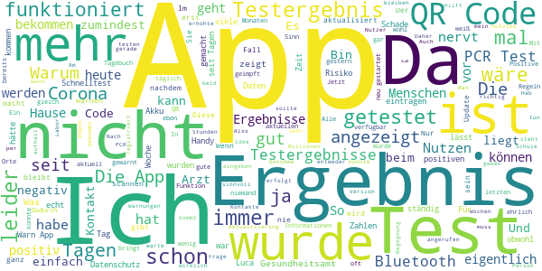

# Corona-Warn-App
App version ``1.15.2``

Analyzed with [covid-apps-observer](http://github.com/covid-apps-observer) project, version ``0.1``

## App overview
| | |
|-------------------------|-------------------------| 
| **Name**&nbsp;&nbsp;&nbsp;&nbsp;&nbsp;&nbsp;&nbsp;&nbsp;&nbsp;&nbsp;&nbsp;&nbsp;&nbsp;&nbsp;&nbsp;&nbsp;&nbsp;&nbsp;&nbsp;&nbsp;&nbsp;&nbsp;&nbsp;&nbsp;&nbsp;&nbsp;&nbsp;&nbsp;&nbsp;&nbsp;&nbsp;&nbsp;&nbsp;&nbsp;&nbsp;&nbsp;&nbsp;&nbsp;&nbsp;&nbsp;  | Corona-Warn-App |
| **Unique identifier** | de.rki.coronawarnapp |
| **Link to Google Play** | [https://play.google.com/store/apps/details?id=de.rki.coronawarnapp](https://play.google.com/store/apps/details?id=de.rki.coronawarnapp) |
| **Summary**  | Gemeinsam Corona bekämpfen |
| **Privacy policy** | [https://www.coronawarn.app/assets/documents/cwa-privacy-notice-de.pdf](https://www.coronawarn.app/assets/documents/cwa-privacy-notice-de.pdf) |
| **Latest version** | 1.15.2 |
| **Last update** | 2021-03-29 19:43:00 |
| **Recent changes** | Mit diesem Update beheben wir einen Fehler. |
| **Installs**  | 10.000.000+ |
| **Category** | Gesundheit & Fitness |
| **First release** | 12.06.2020 |
| **Size**  | 25M |
| **Supported Android version**  | 6.0 oder höher |

### Description
> Das Robert Koch-Institut (RKI) als zentrale Einrichtung des Bundes im Bereich der Öffentlichen Gesundheit und als nationales Public-Health-Institut veröffentlicht die Corona-Warn-App für die deutsche Bundesregierung und für die Bundesrepublik Deutschland. Die App fungiert als digitale Ergänzung zu Abstandhalten, Hygiene und Alltagsmaske. Die App basiert auf Bluetooth-Technologie und der Exposure Notification API von Google. Wer sie nutzt, hilft, Infektionsketten schnell nachzuverfolgen und zu durchbrechen. Die App merkt sich dezentral unsere Begegnungen mit anderen und informiert uns digital, wenn wir Begegnungen mit nachweislich infizierten Personen hatten. Dabei sammelt sie jedoch zu keiner Zeit Informationen zur Identität ihrer Nutzerinnen und Nutzer. Wer wir sind und wo wir sind, bleibt geheim – und unsere Privatsphäre bestens geschützt.
 WIE DIE APP FUNKTIONIERT
 Die Risiko-Ermittlung der App ist das Herzstück der Software und sollte immer aktiviert sein. Wann immer sich Nutzerinnen und Nutzer begegnen, tauschen ihre Smartphones über Bluetooth verschlüsselte Zufalls-IDs aus.
 Diese geben nur Auskunft darüber, über welche Dauer und mit welchem Abstand eine Begegnung stattfand. Welche Person sich hinter einem Code verbirgt, ist für niemanden nachvollziehbar. Die Corona-Warn-App erhebt keine Informationen über den Ort der Begegnung oder den Standort der Nutzerinnen und Nutzer.
 Entsprechend der maximalen Corona-Inkubationszeit werden alle Zufalls-IDs, die unser Smartphone sammelt, für 14 Tage auf dem Smartphone gespeichert – und dann gelöscht.
 Nur wenn eine Person sich über die App freiwillig als nachweislich infiziert meldet, erhalten daraufhin alle früheren Begegnungen eine Warnung auf ihr Smartphone.
 Niemand erfährt, wann, wo oder mit wem eine entsprechende Risiko-Begegnung stattfand. Die infizierte Person bleibt anonym.
 Mit der Benachrichtigung erhalten die betroffenen Nutzer/-innen klare Handlungsempfehlungen. Wichtig: Auch die Daten der Benachrichtigten sind zu keiner Zeit einsehbar.
 WIE DIE DATEN SICHER BLEIBEN
 Die Corona-Warn-App soll uns zwar täglich begleiten, sie wird uns jedoch nie kennenlernen. Dadurch kann sie niemandem verraten, wer wir sind. Der Datenschutz bleibt über die gesamte Nutzungsdauer zu 100 Prozent gewahrt.
 • Keine Anmeldung: Es müssen keine E-Mail-Adresse und kein Name hinterlegt werden.
 • Keine Rückschlüsse auf Identitäten: Bei einer Begegnung mit einem anderen Menschen tauschen die Smartphones nur Zufalls-IDs aus. Diese messen, über welche Dauer und mit welchem Abstand ein Kontakt stattfand. Sie lassen aber keine Rückschlüsse auf Personen und Standorte zu.
 • Dezentrale Speicherung: Die Daten werden nur auf dem Smartphone gespeichert und nach 14 Tagen gelöscht.
 • Keine Einsicht für Dritte: Sowohl die Personen, die eine nachgewiesene Infektion melden, als auch die Benachrichtigten sind nicht nachverfolgbar – nicht für die Bundesregierung, nicht für das Robert Koch-Institut, nicht für andere User und auch nicht für die Betreiber der App-Stores.
 Diese App ist nicht zum Gebrauch außerhalb Deutschlands bestimmt. Die Corona-Warn-App ist die zentrale Corona-App für Deutschland und sie ist an das deutsche Gesundheitssystem angeschlossen. Trotzdem ist die Corona-Warn-App auch in diesem Land verfügbar. Sie ist gedacht für alle, die in Deutschland leben, arbeiten, Urlaub machen oder sich regelmäßig oder über längere Zeit in Deutschland aufhalten.
 Es gelten die Nutzungsbedingungen der Corona-Warn-App: https://www.coronawarn.app/assets/documents/cwa-eula-de.pdf. Durch die Installation und Nutzung dieser App stimmen Sie den Nutzungsbedingungen zu.

### User interface
The developers of the app provide the following screenshots in the Google play store.
| | | |
|:-------------------------:|:-------------------------:|:-------------------------:|
 |   |   |   | 
 |   |   |   | 
 |   |  

## Development team
In the following we report the main information provided by the development team in the Google play store.

| | |
|-------------------------|-------------------------|
| **Developer**  | Robert Koch-Institut |
| **Website**  | [https://www.coronawarn.app](https://www.coronawarn.app) |
| **Email** | CoronaWarnApp@rki.de |
| **Physical address**  | [Robert Koch-Institut Nordufer 20 13353 Berlin](https://www.google.com/maps/search/Robert%20Koch-Institut%20Nordufer%2020%2013353%20Berlin) (Google Maps) |
| **Other developed apps**  | [https://play.google.com/store/apps/developer?id=Robert+Koch-Institut](https://play.google.com/store/apps/developer?id=Robert+Koch-Institut) |

## Android support

| | |
|-------------------------|-------------------------|
| **Declared target Android version**  | Android10, version 10 (API level 29) |
| **Effective target Android version**  | Android10, version 10 (API level 29) |
| **Minimum supported Android version**  | Marshmallow, version 6.0 (API level 23) |
| **Maximum target Android version**  | - |

The larger the difference between the minimum and maximum supported Android versions, the better. A larger difference means a wider audience. For example, old phones have a very low Android version, so a high minimum supported Android version means that the app cannot be used by users with old phones, thus leading to accessibility problems. 

## Requested permissions

In the following we report the complete list of the permissions requested by the app. 

| **Permission** | **Protection level** | **Description** | 
|-------------------------|-------------------------|-------------------------|
 **android.permission ACCESS_NETWORK_STATE** | Normal | Allows applications to access information about networks. 
 **android.permission BLUETOOTH** | Normal | Allows applications to connect to paired bluetooth devices. 
 **android.permission CAMERA** | :warning:**Dangerous** | Required to be able to access the camera device. 
 **android.permission FOREGROUND_SERVICE** | Normal | Allows a regular application to use Service.startForeground. 
 **android.permission INTERNET** | Normal | Allows applications to open network sockets. 
 **android.permission RECEIVE_BOOT_COMPLETED** | Normal | Allows an application to receive the Intent.ACTION_BOOT_COMPLETED that is broadcast after the system finishes booting. 
 **android.permission REQUEST_IGNORE_BATTERY_OPTIMIZATIONS** | Normal | Permission an application must hold in order to use Settings.ACTION_REQUEST_IGNORE_BATTERY_OPTIMIZATIONS. 
 **android.permission WAKE_LOCK** | Normal | Allows using PowerManager WakeLocks to keep processor from sleeping or screen from dimming. 

## Mentioned servers

| **Server** | **Registrant** | **Registrant country** | **Creation date** | 
|-------------------------|-------------------------|-------------------------|-------------------------|
 | google.com | Google LLC | :us: US | 1997-09-15 04:00:00 |
 | android.com | Google LLC | :us: US | 1997-06-23 04:00:00 |

## Security analysis 

Below we report the main security warnings raised by our execution of the [Androwarn](https://github.com/maaaaz/androwarn) security analysis tool.

**Connection interfaces exfiltration**
> - This application reads details about the currently active data network 
> - This application tries to find out if the currently active data network is metered 

**Telephony services abuse**
> - This application makes phone calls 

**Suspicious connection establishment**
> - This application opens a Socket and connects it to the remote address '; port is out of range' on the 'N/A' port  
> - This application opens a Socket and connects it to the remote address 'Lcom/android/tools/r8/GeneratedOutlineSupport;->outline26(Ljava/lang/String;)Ljava/lang/StringBuilder;' on the 'N/A' port  
> - This application opens a Socket and connects it to the remote address 'Ljava/net/Proxy;->type()Ljava/net/Proxy$Type;' on the 'N/A' port  
> - This application opens a Socket and connects it to the remote address 'Method sendUrgentData() is not supported.' on the 'N/A' port  
> - This application opens a Socket and connects it to the remote address 'Method setHandshakeTimeout() is not supported.' on the 'N/A' port  
> - This application opens a Socket and connects it to the remote address 'Method setOOBInline() is not supported.' on the 'N/A' port  
> - This application opens a Socket and connects it to the remote address 'Method setSoWriteTimeout() is not supported.' on the 'N/A' port  
> - This application opens a Socket and connects it to the remote address 'Socket closed' on the 'N/A' port  
> - This application opens a Socket and connects it to the remote address 'Socket is closed' on the 'N/A' port  
> - This application opens a Socket and connects it to the remote address 'Socket is closed.' on the 'N/A' port  
> - This application opens a Socket and connects it to the remote address 'Socket is not connected.' on the 'N/A' port  
> - This application opens a Socket and connects it to the remote address 'socket is closed' on the 'N/A' port  
> - This application opens a Socket and connects it to the remote address 'timeout' on the 'N/A' port  

**Code execution**
> - This application loads a native library 
> - This application loads a native library: 'conscrypt_gmscore_jni' 
> - This application loads a native library: 'conscrypt_jni' 

## User ratings and reviews

Below we provide information about how end users are reacting to the app in terms of ratings and reviews in the Google Play store.

### Ratings

The Corona-Warn-App app has been installed by more than **10000000** times. At this time, **115980** rated the app and its average score is **2.8707762**. Below we show the distribution of the ratings across the usual star-based rating of Google Play

:star::star::star::star::star:: 37774

:star::star::star::star:: 11466

:star::star::star:: 10787

:star::star:: 9904

:star:: 46049

### Reviews 

#### 5-star reviews

> Das Tagebuch hilft. So brauch ich nicht mehr getrennt Buch zu führen. 4.4. 2021 Heute möchte ich ergänzen: Ich freue mich, dass ich nächste Woche endlich einen Impftermin habe. Mit AstraZeneca. Nun wäre es gut eine Möglichkeit zu haben dies zu vermerken und auch eventuelle Nebenwirkungen einzugeben, z.B als Liste zum anklicken, mir Schweregrad und Abstand zur Impfung.  :date: __2021-04-04 13:43:49__

> Sehr gut  :date: __2021-04-04 12:16:51__

> Tolle App funktioniert wie erwartet. Toll wäre noch eine Darstellung des Verlaufs der Infektionszahlen und nicht nur der Tageswert. 👍  :date: __2021-04-04 12:13:27__

> Ich finde nichts schlechtes dran. Zeigt nun auch die aktuellen Zahlen. Toll wäre wenn sie die Zahlen aus meinem Landkreis oder einem optionalen Kreis anzeigen würde.  :date: __2021-04-04 09:15:18__

> Lelele geile app  :date: __2021-04-04 01:17:29__

> Sehr gut  :date: __2021-04-04 00:17:48__

> Wichtig  :date: __2021-04-03 21:53:31__

> Top.Mit dieser App bekommt man kein Corona. Ist die 50 Mio euro wert  :date: __2021-04-03 20:37:40__

> Sehr gut  :date: __2021-04-03 18:51:19__

> Eigentlich eine gute Idee, aber wenn man die Risikowarnung nicht aktivieren kann dann ist es wenig hilfreich  :date: __2021-04-03 18:15:01__

#### 4-star reviews

> Läuft weiter unauffällig. Tagebuch ist ok. Ob die App auch "wirkt", kann man nur vermuten. Unterstützend wären für jeden Nutzer hier zwei statistische Aussagen: 1.) Wie viele Nutzer/Downloads gibt es in Deutschland = Gesamtwirkung? 2.) Wie viele Kontakte wurde zur letzten aktuellen Aussage der App festgestellt und geprüft = Aktuelle Wertigkeit der Aussage ... hier wegen Datenschutz gerne in Zahlengruppen, z.B. kleiner 10, kleiner 50, kleiner 100 ... usw. Ob die Entwickler das hier gelesen haben?  :date: __2021-04-04 09:19:32__

> habe die App seit ca 6 Mon. ich weiss nicht in wie weit sie funktioniert, denn scheinbar hatte ich in dieser Zeit nur eie einzige bemerkenswerte Begegnung. naja, wir werden sehen  :date: __2021-04-04 00:01:19__

> Es ist noch nicht alles super, aber ich finde es gut dass die App immer weiter entwickelt wird.  :date: __2021-04-03 23:36:57__

> Leider nicht korrekt  :date: __2021-04-03 14:05:22__

> Warum verschwinden Kontakte mit niedrigem Risiko nach dem letzten Update???? (Bei mir war der Kontakt erst 8 Tage her, also bei weitem noch relevant) Antworten: 20.3. War eine niedrige Risikobegegnung, die nur bis ca. 29.3. angezeigt wurde. Ich hatte seit Dezember keine angezeigte Begegnung mehr, davor ist mir das nicht aufgefallen, dass welche wegfallen. Danke für das schnelle Feedback. Loggdatei ist versandt. Bei Antwort zum Fehler gibt es wieder 5 Sterne  :date: __2021-04-03 09:16:45__

> Update 1. 4.21: Nach Aktualisierung lädt die App nun nicht mehr. Sie bleibt mit dem Logo auf dem Bildschirm hängen. Möchte sie nicht zurück setzen oder deinstallieren weil sonst meine Daten weg sind. Oneplus 8 Pro Update 3.4.21 App funktioniert wieder problemlos  :date: __2021-04-03 00:15:25__

> Hallo. Ich würde ja gerne den QR Code scannen, um meine Tests ebenfalls zu teilen. Aber warum geht nur scannen mit Kamera? Den Code bekomme ich per Mail. Vorzeigen beim Test mit Smartphone. Das Ergebnis wieder per Mail. Also alles digital über Handy. Den QR Code jedes Mal ausdrucken zum einscannen ist auch doof....  :date: __2021-04-02 18:41:22__

> Gut Informiert  :date: __2021-04-02 17:57:46__

> Insgesamt funktioniert die App. Mehrfach gewarnt bei überprüfbaren Infektionen im Gesundheitswesen. 1 Stern Abzug für trägen Start. Gibts wieder, wenn die Checkin Funktion für Läden verfügbar ist. Das ganze Gemeckere kann ich nicht ganz nachvollziehen.  :date: __2021-04-02 13:47:13__

> Wie wir inzwischen festgestellt haben, sind für die nervigen Poppups bei abgeschaltetem Bluetooth weder die App noch das OS verantwortlich, sondern ein Service bei Goigle selbst. Ein Stern extra für schnelle Reaktion auf die Rezension ohne vorgefertigte Standardtexte.  :date: __2021-04-02 13:15:20__

#### 3-star reviews

> Die Idee finde ich super. Allerdings fände ich die Anzeige der 7-Tage-Inzidenz passend zum aktuellen Standort (oder zumindest zum individuellen Meldeort) inkl. der dort aktuell geltenden Maßnahmen nützlicher als die Anzeige der bundesweiten Daten.  :date: __2021-04-04 13:45:33__

> Die Kennzahlen aktualisieren sich nicht automatisch. Es werden Zahlen von vor einer Woche angegeben.  :date: __2021-04-04 11:59:07__

> Die App arbeitet nicht mit anderen testenden Institutionen zusamnen. Bsp. Bioscientia. Ergebnisse können nicht manuell eingetragen werden. FATAL über die Osterfeiertage! oder andere längere Feiertage.  :date: __2021-04-04 11:24:59__

> Ich bin das erste Mal getestet worden, die ganze Organisation lief digital und um hier das Testergebnis eintragen zu können, muss ich das Ergebnis ausdrucken, nur um den QR Code scannen zu können, um das Blatt dann weg zu verwerfen oder extra den Rechner anschalten?! Tut mir leid, das muss technisch, digital anders gelöst werden, wenn man möchte, daß man die diese Funktion genutzt wird. Man hat doch schon alles.auf dem Smartphone. Ansonsten find ich die Idee der App gut.  :date: __2021-04-04 08:13:23__

> Wäre vielleicht sinnvoll hier auch zu dokumentieren, wann man geimpft wurde. Vielleicht übers Tagebuch, über z. B. Schieberegler (1. und 2. Impfung erhalten) dann Datumseingabe.somit könnte bei Zugangskontrollen oder anderem durch einfaches Vorzeigen der Impfstatus dargestellt werden auf der Startpage, nachdem die beiden Regler gesetzt wurden.  :date: __2021-04-04 07:47:38__

> Nachdem die App vor einem Jahr bei mir mit einer glatten 6 durchgefallen war, habe ich sie nun wieder installiert. Denn es wurde nachgebessert und nun kann man auch den Standort eingeschaltet lassen, da die App die Standorte nicht nutzt. Man kann sie selber eintragen. Besonders das Tagebuch finde ich gut. Habe meine Bewertung nach gebessert. Vielleicht werden es in den nächsten Wochen ja noch mehr Sterne. Gut, das man den Kritiken nachgeht und entsprechend weiterentwickelt. (y)  :date: __2021-04-03 15:41:03__

> Soweit funktioniert ja alles. Allerdings bekam ich keine Benachrichtigung, dass ich Begegnungen mit erhöhtem Risiko hatte. Das wurde mir erst angezeigt, als ich die App geöffnet hatte. Das ist ja irgendwie nicht Sinn der Sache....  :date: __2021-04-03 08:58:02__

> Wäre es möglich über die App den eigenen theoretischen bzw. wahrscheinlichen R-Wert anzuzeigen?  :date: __2021-04-03 01:17:16__

> Wenn man positiv getestet wurde hat man andere Probleme, als herum zu telefonieren, dass der Test freigegeben wird. Beim Test müsste deshalb bereits die freiwillige Freigabe eingeholt werden, dass ein positives Ergebnis automatisch für Dritte freigeschaltet wird. Es ist unverständlich, dass keine Übersicht über Labore und deren Anbindung existiert!!! Die Nutzer sollen die jetzt melden !? Bitte die Verfügbarkeit von App-Updates automatisch melden!  :date: __2021-04-02 23:45:58__

> Die ständigen Fehlermeldungen weil Bluetooth zu Hause ausgeschaltet ist nerven.  :date: __2021-04-02 20:11:09__

#### 2-star reviews

> Warum wird bei der Risokoabfrage nie die reelle Uhrzeit angezeigt?  :date: __2021-04-04 09:49:58__

> Risikostatus aktualisiert sich wieder mal seit Tagen nicht. Alles überprüft, alles an, Handy schon mehrmals neu gestartet - nichts.  :date: __2021-04-04 00:04:14__

> Ist schon doof wenn das Gesundheitsamt anruft und in der Warn App der Test dort immer noch nicht vorliegt .  :date: __2021-04-03 14:42:56__

> Die App muss ständig neu gestartet werden wenn man sie aufmacht. Das nervt und erfüllt bestimmte auch nicht ihren Zweck wenn sie ständig neu gestartet werden muss.  :date: __2021-04-03 10:16:16__

> Funktioniert einfach nicht ordentlich. Aktualisierung läuft nicht ordentlich. Sehe bisher noch keinen Sinn für die App. Die Aktualisierung funktioniert nicht ordentlich. Es vergehen Tag für Tag und immer noch keine Änderungen im Aktualisierungsstatus.  :date: __2021-04-03 09:38:03__

> Anfangs wurden mir regelmäßig Begegnungen mit niedrigem Risiko angezeigt. Da waren die Infektionszahlen noch relativ niedrig. Das signalisierte mir, schön vorsichtig zu bleiben. Seit einiger Zeit bekomme ich keine Begegnungen mehr angezeigt und das bei deutlich höheren Infektionszahlen. Das finde ich nicht hilfreich, da es nicht sehr glaubhaft wirkt.  :date: __2021-04-03 08:33:50__

> Unübersichtlich, unklare Anzeigen und Mitteilungen. Wenig bis keine Information.  :date: __2021-04-02 23:13:01__

> app wird nicht aktualisiert seit 30.3.21  :date: __2021-04-02 23:02:31__

> Mist  :date: __2021-04-02 21:50:34__

> Nach dem schlechten Start ist die App noch schlechter geworden. Zentrale Funktion ist die Gerätesuche per Bluetooth. Vor Installation der App war dieser Funkstandard dauerhaft abgeschaltet. Obwohl bei eingeschaltetem Bluetooth der Akku schnell alle ist, habe ich es für die App ausnahmsweise angeschaltet. Jetzt wurde die App so verändert, dass das deutlich schwerer geht. Ich habe aber eine Lösung gefunden. Wenn man die Warnung abschaltet, gibt es keine nervige Warnmeldung mehr.  :date: __2021-04-02 19:49:13__

#### 1-star reviews

> Unfug! Weil viele Menschen eine Infektion alleine, unerkannt durchmachen. Nur Notfälle kommen in die Klinik! Dann ist die Ansteckung Anderer schon erfolgt!  :date: __2021-04-04 14:11:43__

> Eigentlich gut, schade nur, dass ich bei Aktualisierungen die App öfter de- und dann wieder neu installieren muss. Somit fängt dann alles wieder von vorne an und meine gespeicherten Daten sind alle weg.  :date: __2021-04-04 12:25:48__

> Soviel Geld für wenig Nutzen und kaum Neuentwicklung. Weiterentwicklung? Mehr Details in der näheren Umgebung; Termine für impfungen; Impfstatus und/oder Teststatus: Kontaktverfolgung z. B. per Barcode (Luca App),..... Zumindest in meinem Bekanntenkreis gib es kaum Nutzer dieser App.  :date: __2021-04-04 12:10:10__

> Das Letzte  :date: __2021-04-04 11:51:53__

> Total überflüssig!!!  :date: __2021-04-04 11:51:19__

> Funktioniert gut, aber erst nach ein paar Tagen sieht man ein Ergebnis. Nicht gleich denken, dass die App nicht so toll ist, man braucht etwas Geduld. Bin leider nicht mehr zufrieden mit der App, Ergebnis von eingescanntem Test (negativ) erscheint auch nach 2 Wochen noch nicht. Da sollte dringend nachgebessert werden. Deshalb nur noch 2 Sterne. Nur noch 1 Stern, es kommt immer die Meldung : "Fehler beim Überprüfen der Kontakte". So nützt mir die App reichlich wenig. Ich deinstalliere sie.  :date: __2021-04-04 11:32:25__

> Seit heute mal wieder keine Aktualisierung möglich.  :date: __2021-04-04 11:29:02__

> Gestern auf der Querdenker-Demo hat sich die App dauernd geöffnet. Nervig. Gleich deinstalliert.  :date: __2021-04-04 11:18:47__

> Hab aktuell meinen 2ten Corona Test in die App eingetragen. Aber wie beim ersten Mal, ist bis heute kein Ergebnis in der App verfügbar. Für mich ist die App Reine Geld Verschwendung gewesen wenn man btw bedenkt das wenniger wie 1% der deutschen aktuell an coron erkrankt sie (kein Querdenker).Hätte man lieber Mal die Gelder von der app gespart und damit besser die Gelder bezahlt für die Leute denen Hilfen versprochen wurden die aber bis heute stand 04.04.2021 nicht angekommen sind.  :date: __2021-04-04 11:13:20__

> Nach über einem Jahr Nutzung und nachweislich mehreren Kontakten, die auch hätten angezeigt werden müssen, keine korrekte Anzeige. Dann letzte Woche, an einem Tag wo ich den ganzen Tag im Homeoffice war, plötzlich 14 Risikobegegnungen. Die App ist mit Sicherheit unbrauchbar. Die Idee war gut, die Umsetzung bis heute nicht geglückt. die steuergelder die hier verschwendet worden sind hätte man lieber für Impfdosen ausgeben sollen.  :date: __2021-04-04 10:43:35__

