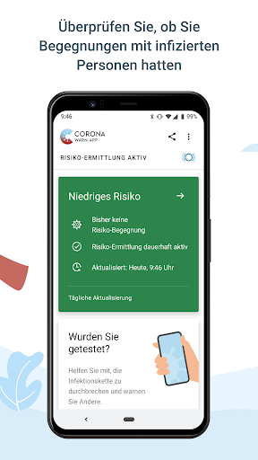
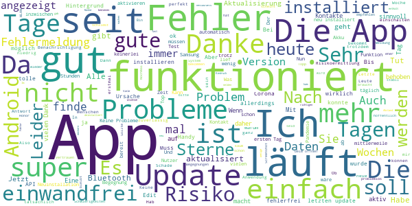
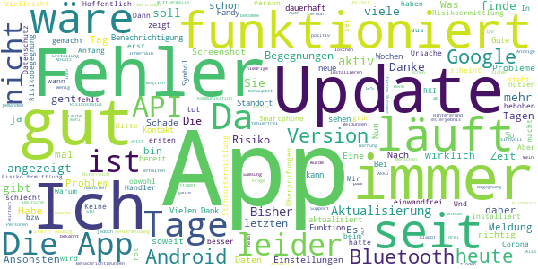
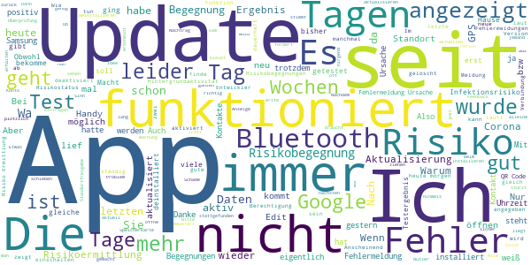
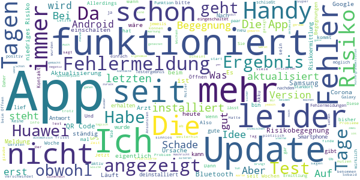
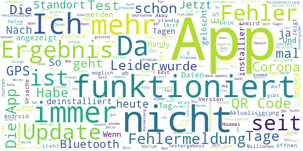

# Corona-Warn-App
App version ``1.2.1``

Analyzed with [covid-apps-observer](http://github.com/covid-apps-observer) project, version ``0.1``

## App overview
| | |
|-------------------------|-------------------------| 
| **Name**&nbsp;&nbsp;&nbsp;&nbsp;&nbsp;&nbsp;&nbsp;&nbsp;&nbsp;&nbsp;&nbsp;&nbsp;&nbsp;&nbsp;&nbsp;&nbsp;&nbsp;&nbsp;&nbsp;&nbsp;&nbsp;&nbsp;&nbsp;&nbsp;&nbsp;&nbsp;&nbsp;&nbsp;&nbsp;&nbsp;&nbsp;&nbsp;&nbsp;&nbsp;&nbsp;&nbsp;&nbsp;&nbsp;&nbsp;&nbsp;  | Corona-Warn-App |
| **Unique identifier** | de.rki.coronawarnapp |
| **Link to Google Play** | [https://play.google.com/store/apps/details?id=de.rki.coronawarnapp](https://play.google.com/store/apps/details?id=de.rki.coronawarnapp) |
| **Summary**  | Gemeinsam Corona bekämpfen |
| **Privacy policy** | [https://www.coronawarn.app/assets/documents/cwa-privacy-notice-de.pdf](https://www.coronawarn.app/assets/documents/cwa-privacy-notice-de.pdf) |
| **Latest version** | 1.2.1 |
| **Last update** | 2020-08-12 21:33:20 |
| **Recent changes** | Mit diesem Update stehen Ihnen verbesserte Texte zur Verfügung. |
| **Installs**  | 5.000.000+ |
| **Category** | Gesundheit & Fitness |
| **First release** | 12.06.2020 |
| **Size**  | 31M |
| **Supported Android version**  | 6.0 oder höher |

### Description
> Das Robert Koch-Institut (RKI) als zentrale Einrichtung des Bundes im Bereich der Öffentlichen Gesundheit und als nationales Public-Health-Institut veröffentlicht die Corona-Warn-App für die deutsche Bundesregierung und für die Bundesrepublik Deutschland. Die App fungiert als digitale Ergänzung zu Abstandhalten, Hygiene und Alltagsmaske. Wer sie nutzt, hilft, Infektionsketten schnell nachzuverfolgen und zu durchbrechen. Die App merkt sich dezentral unsere Begegnungen mit anderen und informiert uns digital, wenn wir Begegnungen mit nachweislich infizierten Personen hatten. Dabei sammelt sie jedoch zu keiner Zeit Informationen zur Identität ihrer Nutzerinnen und Nutzer. Wer wir sind und wo wir sind, bleibt geheim – und unsere Privatsphäre bestens geschützt.
 WIE DIE APP FUNKTIONIERT
 Sind wir unterwegs, sollte die Risiko-Ermittlung immer aktiviert sein. Denn sie ist das Herzstück der Software. Wann immer sich Nutzerinnen und Nutzer begegnen, tauschen ihre Smartphones über Bluetooth verschlüsselte Zufallscodes aus. 
 Diese geben nur Auskunft darüber, über welche Dauer und mit welchem Abstand eine Begegnung stattfand. Welche Person sich hinter einem Code verbirgt, ist für niemanden nachvollziehbar. Die Corona-Warn-App erhebt keine Informationen über den Ort der Begegnung oder den Standort der Nutzerinnen und Nutzer.
 Entsprechend der maximalen Corona-Inkubationszeit werden alle Zufallscodes, die unser Smartphone sammelt, für 14 Tage auf dem Smartphone gespeichert – und dann gelöscht. 
 Nur wenn eine Person sich über die App freiwillig als nachweislich infiziert meldet, erhalten daraufhin alle früheren Begegnungen eine Warnung auf ihr Smartphone. 
 Niemand erfährt, wann, wo oder mit wem eine entsprechende Risiko-Begegnung stattfand. Die infizierte Person bleibt anonym.
 Mit der Benachrichtigung erhalten die betroffenen Nutzer/-innen klare Handlungsempfehlungen. Wichtig: Auch die Daten der Benachrichtigten sind zu keiner Zeit einsehbar.
 WIE DIE DATEN SICHER BLEIBEN
 Die Corona-Warn-App soll uns zwar täglich begleiten. Sie wird uns jedoch nie kennenlernen. Dadurch kann sie niemandem verraten, wer wir sind. Der Datenschutz bleibt über die gesamte Nutzungsdauer zu 100 Prozent gewahrt.
 • Keine Anmeldung: Es müssen keine E-Mail-Adresse und kein Name hinterlegt werden.
 • Keine Rückschlüsse auf Identitäten: Bei einer Begegnung mit einem anderen Menschen tauschen die Smartphones nur Zufallscodes aus. Diese messen, über welche Dauer und mit welchem Abstand ein Kontakt stattfand. Sie lassen aber keine Rückschlüsse auf Personen und Standorte zu. 
 • Dezentrale Speicherung: Die Daten werden nur auf dem Smartphone gespeichert und nach 14 Tagen gelöscht.
 • Keine Einsicht für Dritte: Sowohl die Personen, die eine nachgewiesene Infektion melden, als auch die Benachrichtigten sind nicht nachverfolgbar – nicht für die Bundesregierung, nicht für das Robert Koch-Institut, nicht für andere User und auch nicht für die Betreiber der App-Stores.
 Diese App ist nicht zum Gebrauch außerhalb Deutschlands bestimmt. Die Corona-Warn-App ist die zentrale COVID-19 App für Deutschland und sie ist an das deutsche Gesundheitssystem angeschlossen. Trotzdem ist die Corona-Warn-App auch in diesem Land verfügbar. Sie ist gedacht für alle, die in Deutschland leben, arbeiten, Urlaub machen oder sich regelmäßig oder über längere Zeit in Deutschland aufhalten.

### User interface
The developers of the app provide the following screenshots in the Google play store.
| | | |
|:-------------------------:|:-------------------------:|:-------------------------:|
 |   |   |   | 
 |   |   |   | 
 |   |  

## Development team
In the following we report the main information provided by the development team in the Google play store.

| | |
|-------------------------|-------------------------|
| **Developer**  | Robert Koch-Institut |
| **Website**  | [https://www.coronawarn.app](https://www.coronawarn.app) |
| **Email** | CoronaWarnApp@rki.de |
| **Physical address**  | [Robert Koch-Institut Nordufer 20 13353 Berlin](https://www.google.com/maps/search/Robert%20Koch-Institut%20Nordufer%2020%2013353%20Berlin) (Google Maps) |
| **Other developed apps**  | [https://play.google.com/store/apps/developer?id=Robert+Koch-Institut](https://play.google.com/store/apps/developer?id=Robert+Koch-Institut) |

## Android support

| | |
|-------------------------|-------------------------|
| **Declared target Android version**  | Android10, version 10 (API level 29) |
| **Effective target Android version**  | Android10, version 10 (API level 29) |
| **Minimum supported Android version**  | Marshmallow, version 6.0 (API level 23) |
| **Maximum target Android version**  | - |

The larger the difference between the minimum and maximum supported Android versions, the better. A larger difference means a wider audience. For example, old phones have a very low Android version, so a high minimum supported Android version means that the app cannot be used by users with old phones, thus leading to accessibility problems. 

## Requested permissions

In the following we report the complete list of the permissions requested by the app. 

| **Permission** | **Protection level** | **Description** | 
|-------------------------|-------------------------|-------------------------|
 **android.permission ACCESS_NETWORK_STATE** | Normal | Allows applications to access information about networks. 
 **android.permission BLUETOOTH** | Normal | Allows applications to connect to paired bluetooth devices. 
 **android.permission CAMERA** | :warning:**Dangerous** | Required to be able to access the camera device. 
 **android.permission FOREGROUND_SERVICE** | Normal | Allows a regular application to use Service.startForeground. 
 **android.permission INTERNET** | Normal | Allows applications to open network sockets. 
 **android.permission RECEIVE_BOOT_COMPLETED** | Normal | Allows an application to receive the Intent.ACTION_BOOT_COMPLETED that is broadcast after the system finishes booting. 
 **android.permission REQUEST_IGNORE_BATTERY_OPTIMIZATIONS** | Normal | Permission an application must hold in order to use Settings.ACTION_REQUEST_IGNORE_BATTERY_OPTIMIZATIONS. 
 **android.permission WAKE_LOCK** | Normal | Allows using PowerManager WakeLocks to keep processor from sleeping or screen from dimming. 

## Mentioned servers

| **Server** | **Registrant** | **Registrant country** | **Creation date** | 
|-------------------------|-------------------------|-------------------------|-------------------------|
 | google.com | Google LLC | :us: US | 1997-09-15 04:00:00 |
 | t-online.de | - | - | - |

## Security analysis 

Below we report the main security warnings raised by our execution of the [Androwarn](https://github.com/maaaaz/androwarn) security analysis tool.

**Connection interfaces exfiltration**
> - This application reads details about the currently active data network 
> - This application tries to find out if the currently active data network is metered 

**Telephony services abuse**
> - This application makes phone calls 

**Suspicious connection establishment**
> - This application opens a Socket and connects it to the remote address '; port is out of range' on the 'N/A' port  
> - This application opens a Socket and connects it to the remote address 'Lcom/android/tools/r8/GeneratedOutlineSupport;->outline19(Ljava/lang/String;)Ljava/lang/StringBuilder;' on the 'N/A' port  
> - This application opens a Socket and connects it to the remote address 'Ljava/net/Proxy;->type()Ljava/net/Proxy$Type;' on the 'N/A' port  
> - This application opens a Socket and connects it to the remote address 'Method sendUrgentData() is not supported.' on the 'N/A' port  
> - This application opens a Socket and connects it to the remote address 'Method setHandshakeTimeout() is not supported.' on the 'N/A' port  
> - This application opens a Socket and connects it to the remote address 'Method setOOBInline() is not supported.' on the 'N/A' port  
> - This application opens a Socket and connects it to the remote address 'Method setSoWriteTimeout() is not supported.' on the 'N/A' port  
> - This application opens a Socket and connects it to the remote address 'Socket closed' on the 'N/A' port  
> - This application opens a Socket and connects it to the remote address 'Socket is closed' on the 'N/A' port  
> - This application opens a Socket and connects it to the remote address 'Socket is closed.' on the 'N/A' port  
> - This application opens a Socket and connects it to the remote address 'Socket is not connected.' on the 'N/A' port  
> - This application opens a Socket and connects it to the remote address 'socket is closed' on the 'N/A' port  
> - This application opens a Socket and connects it to the remote address 'timeout' on the 'N/A' port  

**Code execution**
> - This application loads a native library 
> - This application loads a native library: 'conscrypt_gmscore_jni' 
> - This application loads a native library: 'conscrypt_jni' 

## User ratings and reviews

Below we provide information about how end users are reacting to the app in terms of ratings and reviews in the Google Play store.

### Ratings

The Corona-Warn-App app has been installed by more than **5000000** times. At this time, **72331** rated the app and its average score is **3.4141233**. Below we show the distribution of the ratings across the usual star-based rating of Google Play

:star::star::star::star::star:: 33385

:star::star::star::star:: 7897

:star::star::star:: 6331

:star::star:: 4716

:star:: 19999

### Reviews 

#### 5-star reviews

> Ich finde die App ganz gut  :date: __2020-08-17 14:07:18__

> Die App funktioniert einwandfrei. Mehr Details über die besuchten Orte, wo Kontakt war wäre interessant. Ansonsten eine gute App.  :date: __2020-08-17 14:05:32__

> Die Aktualisierung könnte häufiger stattfinden, als einmal täglich, ansonsten gibt es nichts zu bemängeln. Der Akkuverbrauch ist minimal, bei mir unter 0,5% am Tag. Die App an sich ist unkompliziert und enthält trotzdem viele zusätzliche Informationen. Leider ist ein Defizit in der App aufgetreten: Mein altes Handy ist kaputt gegangen, zwar konnte ich die App (inklusive aller restlichen Daten) problemlos auf das neue Gerät übertragen, aber die gespeicherten Daten sind verloren.  :date: __2020-08-17 13:42:32__

> Sehr gut  :date: __2020-08-17 13:24:17__

> \*\**Update am 17.08.: Zwar immer noch die Version 1.2.1, aber heute funktioniert es plötzlich wieder einwandfrei👍 Vielen Dank! || Nach dem neuesten Update zur 1.2.1 ist die Fehlermeldung "Ursache 3" leider wieder da. Ich drücke weiter die Daumen, dass das Problem bald behoben wird🤞  :date: __2020-08-17 11:48:52__

> Alles funktioniert ohne Probleme  :date: __2020-08-17 11:27:39__

> Bei mir funktioniert die App  :date: __2020-08-17 11:23:00__

> Ich hab die App seit dem ersten Tag. Es wird gezeigt niedriges Risiko, keine Begegnungen. Wenn man niedriges Risiko anklickt wird erklärt das man keinerlei Kontakte hatte zu inzwischen Erkrankten und daher das Risiko niedrig sei. Dann schließt sich ein neuer Absatz an der einleitet "daher wird ihr Risiko als erhöht eingestuft.... halten Sie Abstand und nehmen Sie Kontakt zu einem Arzt auf" was stimmt denn nun? Soll das nur die Erklärung sein für erhöhtes Risiko? Sehr verwirrende Darstellung.s10  :date: __2020-08-17 11:11:58__

> Update: Nach Behebung des Fehlers läuft die App bislang ohne Probleme. Daher 5 Sterne Leider taucht seit heute mmer wieder der Fehler " Ursachen etwas ist schief gelaufen. Fehler bei Kommunikation mit Google API 39508" auf. Läuft seit 14 von 14 Tagen und Meldung die aber immer wieder verschwand. Aktualisierung wurde auch durchgeführt. Seit heute keine Aktualisierungen und der Fehler kommt ständig UpdateFehler besteht weiterhin.  :date: __2020-08-17 10:29:29__

> Ich finde die App trotz kleiner Start-Schwierigkeiten super. Dafür, dass das Betriebssystem im Energiesparmodus die App stark einschränkt, kann der Entwickler wenig. Die Handhabung ist extrem einfach und übersichtlich. Insgesamt ist es sehr wenig Aufwand für den erhofften Nutzen. Wenn sie Masken Gegner die App installieren würden, könnte möglicherweise sogar wirklich auf die Maske verzichtet werden.  :date: __2020-08-17 10:03:11__

#### 4-star reviews

> Seit heute aktualisiert sich der Risikostatus der App nicht mehr, mit dem Hinweis, dass die Risikoermittlung jedoch fehlerfrei funktioniert!?  :date: __2020-08-17 12:57:41__

> Die App läuft ohne Fehlermeldungen seit dem ersten Tag. Ob sie auch tut was sie soll, kann man nicht erkennen. Eine Info über Begegnungen wäre hilfreich gewesen, verletzt auch nicht den Datenschutz und zeigt zumindest, daß etwas im Hintergrund passiert.  :date: __2020-08-17 12:11:30__

> Moin RKI Team, zunächst ein dickes Lob an das gesamte RKI. Danke für eure Arbeit in dieser Zeit. Nun zu einem Fehler bei der App. Bei der Aktualisierung wird eine Fehlermeldung angezeigt: Ursache: 3 Mein Phone ist Samsung Galaxy M31. Danke vorab für Klärung. WS Danke für die Rückmeldung. Die genannten weiteren Meldungen habe ich nicht. Auch das Update steht mir noch nicht zur Verfügung. Gruß WS Vielen Dank. Jetzt läuft es wieder.  :date: __2020-08-17 12:10:06__

> Ich bezweifle inzwischen, dass die App vernünftig funktioniert. Die Aktualisierung der Daten funktioniert nicht bzw. eingeschränkt . Hab einen Test gemacht und laut App noch kein Ergebnis, obwohl dieses bereits seit 12.39 Uhr bereit steht. Tage werden gar nicht gezählt, sondern nur die ersten 14 Tage. Und ja, sie ist dauerhaft aktiv. Nein bei mir werden gar keine Tage angezeigt. Es gibt 3 Zeilen: -Bisher keine Risiko-Begegnungen -Risiko-Ermittlung dauerhaft aktiv -Aktualisiert heute um.Support👍  :date: __2020-08-17 10:36:38__

> Nicht runterlade die wollen deine Daten klauen wacht auf 🤣  :date: __2020-08-17 08:56:15__

> Mittlerweile läuft sie ganz gut.  :date: __2020-08-17 08:27:08__

> Bin nicht sicher ob sie jetzt ihren Dienst tut...man mungelt dass es nicht immer auf dem neuesten Stand ist  :date: __2020-08-17 08:17:09__

> Finde es nur nervig, dass ich immer eine Benachrichtigung bekomme, wenn ich mein Bluetooth an oder aus mache. Bitte beheben, dass man das stumm schalten kann bei der Warnung mit Bluetooth  :date: __2020-08-16 22:28:49__

> Bei mir ähnliche Erfahrungen wie bei anderen: 13 Tage lief es gut, dann die letzten Wochen nur noch API Fehler mit wechselnden IDs. Ich werde die App jetzt löschen wg. Frustration. Ich würde gerne die Kollegen/innen vom RKI darum bitten, eine Abschätzung abzugeben, BIS WANN das Problem behoben ist (Wochen, Monate...) Smartphone: Android 6.0.1, Moto G3 Nachtrag: seit Anfang August noch einmal installiert, seither funktioniert die App einwandfrei  :date: __2020-08-16 21:12:06__

> Nachfrage zum Melde-Prozess in der App: Wenn man positiv getestet wurde, ist man bereits dem Gesundheitsamt namentlich bekannt. Aber nicht mal die Hälfte aller Gesundheitsämter drucken im Testergebnis-Bogen einen QR-Code, mit dem man sich in der App anonym als positiv melden kann. Also muss man erst die Hotline anrufen und sich dort ohne Anonymität "outen" - für viele abschreckend ! Warum rufen die Gesundheitsämter(!) nicht die Betroffenen aktiv an, und machen mit ihnen die Meldung in der App ?  :date: __2020-08-16 13:26:23__

#### 3-star reviews

> Ich habe von heute auf morgen 6 Risikobenachrichtigungen obwohl ich nur zu Hause war, ansonsten ok.  :date: __2020-08-17 13:50:22__

> Seit heute meldet die App "Ursache: 3" und aktualisiert den Risikostatus nicht mehr. Lustig ist der Hilfe-Link der auf eine fehlende Seite verweist.  :date: __2020-08-17 12:51:09__

> Obwohl Hintergrundaktivität explizit und definitiv erlaubt, zeigt sie, wenn ich sie öffne an, dass die Risikoermittlung nicht aktiv ist. Gehe dann auf einschalten, ist aber dann an. Erst beim Wechsel zurück zum Startbildschirm bekomme ich den grünen Hinweis. Es ist weiterhin dringender Handlungsbedarf in Sachen Hintergrundaktivität erforderlich! Selbst wenn sie im Hintergrund weiter läuft und nur die Anzeige dazu nicht stimmt, kann das nicht sein. Überzeugung anderer wird schwerer!!!  :date: __2020-08-17 12:02:19__

> Wenige Erklärungen und eine sehr lange Startphase bis die ersten Einschätzungen zum Infektionsrisiko angegeben werden haben zur anfänglichen Verwirrung geführt. Derzeit aber ohne weitere Kritik nutzbar.  :date: __2020-08-17 10:56:46__

> Super funktioniert wieder. Nur nach dem Update habe ich jetzt ein unbekanntes Risiko weil nicht genug Daten vorhanden sind! Also 14 Tage Blindflug... Nicht gut! Nur das Update gemacht und keine neue Installation. Handy ist konstant an. Hatte auch vor 5 Tage einen Risikokontakt mit anschließen Test (negativ) laut App ist die Überwachung nach dem Update erst ein Tag aktiv. Im Konto 57 Überprüfung in 14 Tagen.. Laut App 3 Tage aktiv  :date: __2020-08-17 09:14:09__

> Seit gestern Fehler 404  :date: __2020-08-17 08:41:09__

> Wenn ich auf meine Risiko-Ermittlung aufgrund der erzwungenen Standort-Ermittlung verzichte, aber dennoch die App installiert habe, werde ich dann trotzdem benachrichtigt falls jemand positiv getestet ist und umgekehrt ebenfalls?  :date: __2020-08-17 07:55:51__

> Laut App wird für die Verwendung von Bluetooth die Berechtigung für die Standortermittlung benötigt. Allerdings fordert die App diese Berechtigung offensichtlich nicht an. Stattdessen wird die Berechtigung für die Kamera angefordert. Was stimmt denn nun?  :date: __2020-08-17 07:45:57__

> 11 Tage lief es. Dann kam "Ursache 3 etwas ist schief gelaufen Fehler Kommunikation mit google (API 10)." Nach Neuinstallation gestern kam der Fehler grade wieder. Aktualisierung bzgl. Risiko erfolgt also nicht mehr. Ich halte die App für sinnvoll, WENN sie funktioniert. Schade. Edit 27.7.20: seit 2 Tagen funktioniert die App ohne Fehlermeldungen. Danke. Edit 16.8.20: es gibt wieder die Fehlermeldung "Ursache 3" Aktualisierung nicht möglich.  :date: __2020-08-17 07:26:22__

> Keine Aktualisierung nach 14 Tagen.Auch keine Möglichkeit manuell ein Update zu installieren. Bitte beheben Update 17.8.2020 Obwohl ich die Hintergrundfunktion der App eingeschaltet habe, wird mir jedesmal in der App mitgeteilt, wenn ich sie öffne, dass die Risikoermittlung nicht aktiv ist. Selbst nach beheben des ganzen bekomme ich nach schließen und erneutem Öffnen die gleiche Meldung  :date: __2020-08-17 06:33:31__

#### 2-star reviews

> Mein Labortest wurde in der App hinzugefügt und registriert und ein Ergebnis habe ich über die App noch nicht erhalten obwohl ich die Auswertung schon schriftlich von meinem Arzt erhalten habe . Der Labortest hat ca 24 std. gedauert auf das Ergebnis in der App warte ich jetzt schon 5 Tage......  :date: __2020-08-17 14:17:38__

> nach dem letzten update hängt die aktualisierung galaxy s20 ultra keine fehlermeldung  :date: __2020-08-17 13:57:00__

> nett aber sinnlos. testergebnis wurde uns von unserem arzt sonntag abend mitgeteilt. jetzt ist montagmittag und die app hat noch kein ergebnis aktualisiert. für uns sinnlose app trotz nettem äusseren.  :date: __2020-08-17 13:32:50__

> Eigentlich sehr gut, aber a) seit heute geht die App plötzlich nicht mehr, obwohl ich nichts verändert habe und keine offenen Updates existieren (app: Version 1.2.1, Android: 10, up to date). Fehler 3, 39508 b) so hängt die App dem infektionsgeschehen stets nach, sinnvoller wäre ein weiter Status (z.b. gelb) Kontakt mit mind. 2 (oder 3..), deren Status aufgrund von Risikokontakt rot sind aber (noch) nicht (positiv) getestet sind. Denn diese könnten auch bereits infizieren.  :date: __2020-08-17 13:04:04__

> Ich habe die App erst seit 13.08.20 installiert, kann daher leider noch nichts zur Genauigkeit der Warnung sagen. Jedoch ist Vorsicht geboten beim Scannen eines QR-Codes eines durchgeführten Tests!!! Auf dem Informationszettel zum Ablauf des Abrufs des Testergebnisses in der App oder in der App selbst steht keinerlei Information, dass ein QR-Code nur ein einziges Mal gescannt werden kann und nach einer Löschung, aber noch keiner Ergebnisübermittlung, ungültig wird!  :date: __2020-08-17 12:31:14__

> Test Ergebnis wird trotz gescanntem Qr-Code nicht angezeig. , obwohl ich mein Ergebnis schon lang vom Arzt habe, sagt die App das Ergebnis sei noch nicht verfügbar. Was ist da los, eigentlich soll man das Ergebnis doch möglichst schnell über die App bekommen.  :date: __2020-08-17 10:25:51__

> Die App hat sehr gut funktioniert. Von jetzt auf gleich öffnet sie jedoch nicht und wird vom Handy zwangsgestoppt, da muss ein Update her. Gerät: HTC U11+ Edit: Fehlermeldungen habe ich schon mehrere übermittelt.  :date: __2020-08-17 09:53:45__

> Ich war ein befürworter der App und besitze sie seit dem ersten Tag. Allerdings hatte ich inzwischen schon sechs Risiko Begegnungen mit niedrigen Risiko. Da ich mich weder in Menschenmassen aufhalte, noch neben einer Teststation wohne/arbeite, ich mich vorsichtig verhalte, kann dies statistisch gesehen überhaupt nicht sein. Zumal jede Woche neue dazu kommen und keiner aus meinem Unmfeld das gleiche Phänomen hat. Können Sie mir sagen, woran das liegt?  :date: __2020-08-17 09:47:31__

> Ich bin eigentlich Nutzer aus Überzeugung, aber jetzt zweifle an der Zuverlässigkeit. Donnerstag Mittag beim Kinderarzt einen Test gemacht. Mir wurde gesagt, dass die App das Ergebnis wahrscheinlich schon vor dem Arzt mitteilt, da das Labor unmittelbar das Ergebnis eingibt. Heute ist Montag und bisher erfolgt immer noch die Meldung, dass das Testergebnis noch nicht vorliegen würde... PS: Der erlösende Anruf (Test negativ) vom Kinderarzt kam bereits am Freitag gegen 9.  :date: __2020-08-17 09:25:52__

> Einzelne Risikobegegnung verschwindet seit länger als 14 Tagen nicht.  :date: __2020-08-17 09:00:28__

#### 1-star reviews

> Diese APP ist ein Witz! Ich habe gerade in den Medien erfahren, dass die Daten von Infizierten nicht wie ich der Meinung war zentral von den Gesundheitsbehoerden eingepflegt wird, sondern der jeweils Infizirte das selber melden soll. Ich frage mich dann, wer soooo bloede ist, sich selbst zu outen. Ich habe die APP nun sofort wieder geloescht. Zum durch unseren Rechtsstaat ausspioniert zu werden, will ich sie nicht auf meinem Smartphone haben.  :date: __2020-08-17 14:19:31__

> Mein Sohn wurde getestet. In der App wird das Ergebnis nicht angezeigt. Der Arzt konnte mir das Ergebnis schon sagen. Schlecht ist auch das man nur einen Test einrichten kann. Und nachdem löschen der Test nicht wieder eingerichtet werden. Dafür ist die also Sinnlos.  :date: __2020-08-17 14:02:50__

> Die App ist nicht informativ  :date: __2020-08-17 13:38:19__

> Robert-Cock Institut <3  :date: __2020-08-17 13:15:34__

> Corona App 1.2.1 erhält keinen Zugang auf Standort Ermittlung und funktioniert daher nicht. LineageOS Version 16, Samsung S5  :date: __2020-08-17 13:14:07__

> Also irgendwie verbraucht die App viele Daten, ich bin auch bei den vielen schlechten Bewertungen bicht geneigt sie zu behalten. In Korea hat deren Corona App weitaus besser funktioniert. Vlt sollte man in Zusammenarbeit mit Südkorea an einer guten App arbeiten  :date: __2020-08-17 13:08:27__

> Mittlerweile zeigt es Fehlermeldung 404, deshalb habe ich es wieder deinstalliert.  :date: __2020-08-17 12:47:07__

> Egentlich halte ich die App für sinnvoll, aber... Erste Version: App lief 13 Tage einwandfrei. Danach das bekannte Problem mit der Google API. (Wurde mit Update behoben...) Nach Update: App lief wiederum 13 Tage einwandfrei. Danach Datenbankfehler und Absturz der App direkt nach dem Starten. App deinstalliert und wiederum neu installiert! Meldung: Kommunikationsfehler! Alle vorherigen Daten sind weg. Die App befindet sich in jungfräulichem Zustand und muss neu eingerichtet werden. Ich glaube, es ist nicht Sinn der Sache, daß ich die App alle 13 Tage neu installieren muss. 16.08.20: Und wieder nach 10 Tagen Absturz mit Fehler 9002. Danach startet App nicht mehr. Und dafür wurden etliche Millionen € bezahlt... Wieder einmal verschwendete Steuergelder!  :date: __2020-08-17 12:21:09__

> bin enttäuscht von der Qualität der App. Keine Info wann alles fertig installiert ist! Weiss immer noch nicht ob alles ok ist. Kein ok ob alles i.O. bei der Installation ist - NICHTS! - Glatte 6 für die Benutzerfreundlichkeit! - Die App ist für den Benutzer in der Ausführung und Übersichtlichkeit SCHLECHT! Würde mir eine Listung von Begegnungsgeräten mit Datum und Uhrzeit wünschen. Allein schon um zu sehen ob die App richtig arbeitet. Bleib dabei: nur 1* für diese App  :date: __2020-08-17 12:06:49__

> Nach Update kann ich App nicht mehr öffnen. Neu installieren hat nicht geholfen. Eine Fehlermeldung wird nicht angezeigt l. Bluetooth und Standort waren aktiviert.  :date: __2020-08-17 11:59:15__

