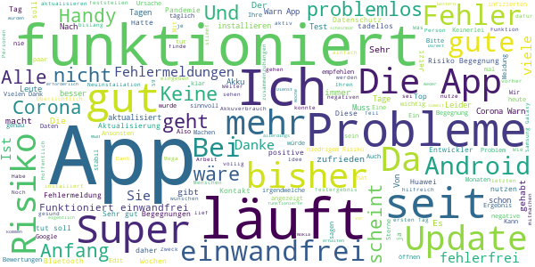
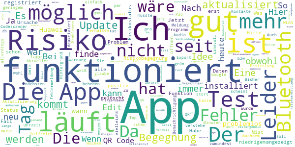
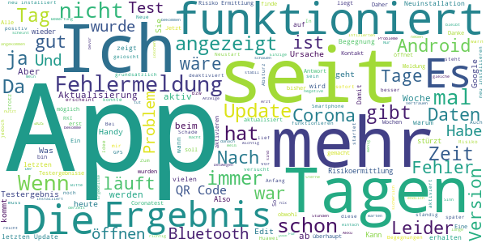
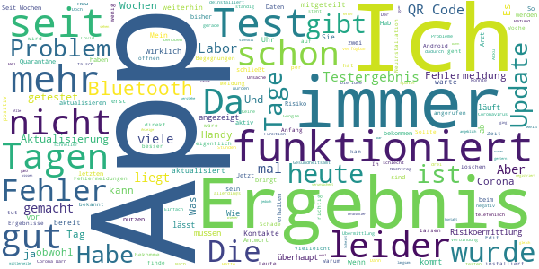
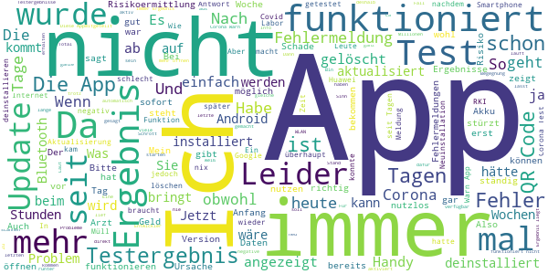

# Corona-Warn-App
App version ``1.3.0``

Analyzed with [covid-apps-observer](http://github.com/covid-apps-observer) project, version ``0.1``

## App overview
| | |
|-------------------------|-------------------------| 
| **Name**&nbsp;&nbsp;&nbsp;&nbsp;&nbsp;&nbsp;&nbsp;&nbsp;&nbsp;&nbsp;&nbsp;&nbsp;&nbsp;&nbsp;&nbsp;&nbsp;&nbsp;&nbsp;&nbsp;&nbsp;&nbsp;&nbsp;&nbsp;&nbsp;&nbsp;&nbsp;&nbsp;&nbsp;&nbsp;&nbsp;&nbsp;&nbsp;&nbsp;&nbsp;&nbsp;&nbsp;&nbsp;&nbsp;&nbsp;&nbsp;  | Corona-Warn-App |
| **Unique identifier** | de.rki.coronawarnapp |
| **Link to Google Play** | [https://play.google.com/store/apps/details?id=de.rki.coronawarnapp](https://play.google.com/store/apps/details?id=de.rki.coronawarnapp) |
| **Summary**  | Gemeinsam Corona bekämpfen |
| **Privacy policy** | [https://www.coronawarn.app/assets/documents/cwa-privacy-notice-de.pdf](https://www.coronawarn.app/assets/documents/cwa-privacy-notice-de.pdf) |
| **Latest version** | 1.3.0 |
| **Last update** | 2020-09-02 20:06:27 |
| **Recent changes** | Mit diesem Update stehen Ihnen Fehlerbehebungen sowie neue und erweiterte Funktionen zur Verfügung. Zur Verbesserung der Barrierefreiheit wurde die Information ergänzt, dass die Hotline Tess-Relay-Dienste unterstützt sowie auf Infos zu leichter Sprache verlinkt. Meldungen und Texte in der App wurden verbessert und korrigiert, u.a. zu QR-Codes, Tests und Risikostatus. Für Fragen und Anregungen steht Ihnen in der App nun ein Link auf ein Kontaktformular zur Verfügung. |
| **Installs**  | 5.000.000+ |
| **Category** | Gesundheit & Fitness |
| **First release** | 12.06.2020 |
| **Size**  | 31M |
| **Supported Android version**  | 6.0 oder höher |

### Description
> Das Robert Koch-Institut (RKI) als zentrale Einrichtung des Bundes im Bereich der Öffentlichen Gesundheit und als nationales Public-Health-Institut veröffentlicht die Corona-Warn-App für die deutsche Bundesregierung und für die Bundesrepublik Deutschland. Die App fungiert als digitale Ergänzung zu Abstandhalten, Hygiene und Alltagsmaske. Wer sie nutzt, hilft, Infektionsketten schnell nachzuverfolgen und zu durchbrechen. Die App merkt sich dezentral unsere Begegnungen mit anderen und informiert uns digital, wenn wir Begegnungen mit nachweislich infizierten Personen hatten. Dabei sammelt sie jedoch zu keiner Zeit Informationen zur Identität ihrer Nutzerinnen und Nutzer. Wer wir sind und wo wir sind, bleibt geheim – und unsere Privatsphäre bestens geschützt.
 WIE DIE APP FUNKTIONIERT
 Sind wir unterwegs, sollte die Risiko-Ermittlung immer aktiviert sein. Denn sie ist das Herzstück der Software. Wann immer sich Nutzerinnen und Nutzer begegnen, tauschen ihre Smartphones über Bluetooth verschlüsselte Zufallscodes aus. 
 Diese geben nur Auskunft darüber, über welche Dauer und mit welchem Abstand eine Begegnung stattfand. Welche Person sich hinter einem Code verbirgt, ist für niemanden nachvollziehbar. Die Corona-Warn-App erhebt keine Informationen über den Ort der Begegnung oder den Standort der Nutzerinnen und Nutzer.
 Entsprechend der maximalen Corona-Inkubationszeit werden alle Zufallscodes, die unser Smartphone sammelt, für 14 Tage auf dem Smartphone gespeichert – und dann gelöscht. 
 Nur wenn eine Person sich über die App freiwillig als nachweislich infiziert meldet, erhalten daraufhin alle früheren Begegnungen eine Warnung auf ihr Smartphone. 
 Niemand erfährt, wann, wo oder mit wem eine entsprechende Risiko-Begegnung stattfand. Die infizierte Person bleibt anonym.
 Mit der Benachrichtigung erhalten die betroffenen Nutzer/-innen klare Handlungsempfehlungen. Wichtig: Auch die Daten der Benachrichtigten sind zu keiner Zeit einsehbar.
 WIE DIE DATEN SICHER BLEIBEN
 Die Corona-Warn-App soll uns zwar täglich begleiten. Sie wird uns jedoch nie kennenlernen. Dadurch kann sie niemandem verraten, wer wir sind. Der Datenschutz bleibt über die gesamte Nutzungsdauer zu 100 Prozent gewahrt.
 • Keine Anmeldung: Es müssen keine E-Mail-Adresse und kein Name hinterlegt werden.
 • Keine Rückschlüsse auf Identitäten: Bei einer Begegnung mit einem anderen Menschen tauschen die Smartphones nur Zufallscodes aus. Diese messen, über welche Dauer und mit welchem Abstand ein Kontakt stattfand. Sie lassen aber keine Rückschlüsse auf Personen und Standorte zu. 
 • Dezentrale Speicherung: Die Daten werden nur auf dem Smartphone gespeichert und nach 14 Tagen gelöscht.
 • Keine Einsicht für Dritte: Sowohl die Personen, die eine nachgewiesene Infektion melden, als auch die Benachrichtigten sind nicht nachverfolgbar – nicht für die Bundesregierung, nicht für das Robert Koch-Institut, nicht für andere User und auch nicht für die Betreiber der App-Stores.
 Diese App ist nicht zum Gebrauch außerhalb Deutschlands bestimmt. Die Corona-Warn-App ist die zentrale COVID-19 App für Deutschland und sie ist an das deutsche Gesundheitssystem angeschlossen. Trotzdem ist die Corona-Warn-App auch in diesem Land verfügbar. Sie ist gedacht für alle, die in Deutschland leben, arbeiten, Urlaub machen oder sich regelmäßig oder über längere Zeit in Deutschland aufhalten.

### User interface
The developers of the app provide the following screenshots in the Google play store.
| | | |
|:-------------------------:|:-------------------------:|:-------------------------:|
 |   |   |   | 
 |   |   |   | 
 |   |  

## Development team
In the following we report the main information provided by the development team in the Google play store.

| | |
|-------------------------|-------------------------|
| **Developer**  | Robert Koch-Institut |
| **Website**  | [https://www.coronawarn.app](https://www.coronawarn.app) |
| **Email** | CoronaWarnApp@rki.de |
| **Physical address**  | [Robert Koch-Institut Nordufer 20 13353 Berlin](https://www.google.com/maps/search/Robert%20Koch-Institut%20Nordufer%2020%2013353%20Berlin) (Google Maps) |
| **Other developed apps**  | [https://play.google.com/store/apps/developer?id=Robert+Koch-Institut](https://play.google.com/store/apps/developer?id=Robert+Koch-Institut) |

## Android support

| | |
|-------------------------|-------------------------|
| **Declared target Android version**  | Android10, version 10 (API level 29) |
| **Effective target Android version**  | Android10, version 10 (API level 29) |
| **Minimum supported Android version**  | Marshmallow, version 6.0 (API level 23) |
| **Maximum target Android version**  | - |

The larger the difference between the minimum and maximum supported Android versions, the better. A larger difference means a wider audience. For example, old phones have a very low Android version, so a high minimum supported Android version means that the app cannot be used by users with old phones, thus leading to accessibility problems. 

## Requested permissions

In the following we report the complete list of the permissions requested by the app. 

| **Permission** | **Protection level** | **Description** | 
|-------------------------|-------------------------|-------------------------|
 **android.permission ACCESS_NETWORK_STATE** | Normal | Allows applications to access information about networks. 
 **android.permission BLUETOOTH** | Normal | Allows applications to connect to paired bluetooth devices. 
 **android.permission CAMERA** | :warning:**Dangerous** | Required to be able to access the camera device. 
 **android.permission FOREGROUND_SERVICE** | Normal | Allows a regular application to use Service.startForeground. 
 **android.permission INTERNET** | Normal | Allows applications to open network sockets. 
 **android.permission RECEIVE_BOOT_COMPLETED** | Normal | Allows an application to receive the Intent.ACTION_BOOT_COMPLETED that is broadcast after the system finishes booting. 
 **android.permission REQUEST_IGNORE_BATTERY_OPTIMIZATIONS** | Normal | Permission an application must hold in order to use Settings.ACTION_REQUEST_IGNORE_BATTERY_OPTIMIZATIONS. 
 **android.permission WAKE_LOCK** | Normal | Allows using PowerManager WakeLocks to keep processor from sleeping or screen from dimming. 

## Mentioned servers

| **Server** | **Registrant** | **Registrant country** | **Creation date** | 
|-------------------------|-------------------------|-------------------------|-------------------------|
 | google.com | Google LLC | :us: US | 1997-09-15 04:00:00 |
 | t-online.de | - | - | - |

## Security analysis 

Below we report the main security warnings raised by our execution of the [Androwarn](https://github.com/maaaaz/androwarn) security analysis tool.

**Connection interfaces exfiltration**
> - This application reads details about the currently active data network 
> - This application tries to find out if the currently active data network is metered 

**Telephony services abuse**
> - This application makes phone calls 

**Suspicious connection establishment**
> - This application opens a Socket and connects it to the remote address '; port is out of range' on the 'N/A' port  
> - This application opens a Socket and connects it to the remote address 'Lcom/android/tools/r8/GeneratedOutlineSupport;->outline19(Ljava/lang/String;)Ljava/lang/StringBuilder;' on the 'N/A' port  
> - This application opens a Socket and connects it to the remote address 'Ljava/net/Proxy;->type()Ljava/net/Proxy$Type;' on the 'N/A' port  
> - This application opens a Socket and connects it to the remote address 'Method sendUrgentData() is not supported.' on the 'N/A' port  
> - This application opens a Socket and connects it to the remote address 'Method setHandshakeTimeout() is not supported.' on the 'N/A' port  
> - This application opens a Socket and connects it to the remote address 'Method setOOBInline() is not supported.' on the 'N/A' port  
> - This application opens a Socket and connects it to the remote address 'Method setSoWriteTimeout() is not supported.' on the 'N/A' port  
> - This application opens a Socket and connects it to the remote address 'Socket closed' on the 'N/A' port  
> - This application opens a Socket and connects it to the remote address 'Socket is closed' on the 'N/A' port  
> - This application opens a Socket and connects it to the remote address 'Socket is closed.' on the 'N/A' port  
> - This application opens a Socket and connects it to the remote address 'Socket is not connected.' on the 'N/A' port  
> - This application opens a Socket and connects it to the remote address 'socket is closed' on the 'N/A' port  
> - This application opens a Socket and connects it to the remote address 'timeout' on the 'N/A' port  

**Code execution**
> - This application loads a native library 
> - This application loads a native library: 'conscrypt_gmscore_jni' 
> - This application loads a native library: 'conscrypt_jni' 

## User ratings and reviews

Below we provide information about how end users are reacting to the app in terms of ratings and reviews in the Google Play store.

### Ratings

The Corona-Warn-App app has been installed by more than **5000000** times. At this time, **76685** rated the app and its average score is **3.1685407**. Below we show the distribution of the ratings across the usual star-based rating of Google Play

:star::star::star::star::star:: 31384

:star::star::star::star:: 7049

:star::star::star:: 6647

:star::star:: 6317

:star:: 25288

### Reviews 

#### 5-star reviews

> Eine sehr gute app  :date: __2020-09-09 17:15:43__

> Vj  :date: __2020-09-09 15:32:47__

> Ich finde die App toll.  :date: __2020-09-09 15:29:02__

> Na wenn's hilft , Top  :date: __2020-09-09 15:10:37__

> Funktioniert super, auf frühere Fragen wurde sehr schnell reagiert. Vielen Dank!  :date: __2020-09-09 14:56:32__

> Mein QR funktioniert nicht. Er gibt keine spezifische Meldung dazu, die kamera erkennt ihn einfach nicht. nach gewissen Zeit kommt dann Fehler 9002 ssl handshake timeout (Android, Samsung s8) Edit: bei Apple iphone 8 fehlermeldung: could not connect to server.  :date: __2020-09-09 13:17:44__

> Sehr gut ich weiß nämlich jz ob Kontakt zu infizierten gehabt hab  :date: __2020-09-09 11:30:14__

> Einfach toll was du da machst! Bin wirklich unfassbar zufrieden mit dem Feedback. Nur der hsv  :date: __2020-09-09 11:25:29__

> Die Begegnungen werden nun wieder aktuell gehalten :)! Fehler und Anmerkungen werden aufgegriffen und behoben. Einfacher kann man nichts zur Gemeinschaft beitragen. Einfach installieren und fertig!  :date: __2020-09-09 10:27:33__

> Habt ihr kaputt gemacht. Bis vor dem letzten Update lief alles bestens. Ursache 3 Etwas ist schiefgelaufen. Version 1.3.0 09.09.2020 Aktualisierungen wieder möglich. Daher wieder alle Fünf.  :date: __2020-09-09 07:31:14__

#### 4-star reviews

> Ich würde Nutzer am Startbildschirm darauf hinweisen, dass er doch bitte die Hintergrundaktualisierung anschalten soll oder die App permanent (im Hintergrund) geöffnet haben soll. Werden Kontakte auch offline aufgezeichnet? Bitte besser aufklären. Aktuell: Risiko-Ermittlung -1 Tage aktiv? Habe die App schon länger aktiv, seit neuestem Update zählt er nicht mehr. Zeichnet sie noch auf? Eine Risikobegegnung, niedr. Risiko. Wo sehe ich wann und wie lange? Gerät: Xperia M5, Android 6.0  :date: __2020-09-09 18:21:36__

> Störanfällig  :date: __2020-09-09 18:13:38__

> App macht was sie soll, Goggle hat die letzte Rezension gelöscht, in der ich hinterfragt habe, warum gps angeschaltet sein muss. Und Google? Wieder löschen?  :date: __2020-09-09 17:01:36__

> Wieso muss den bitte schön das GPS aktiviert sein damit Bluetooth und die Risiko-Ermittlung funktioniert??? Danke für die Beantwortung der Frage. Da es nicht an der App liegt und die App bei mir ohne Problem funktioniert hab die die Bewertung angepasst  :date: __2020-09-09 16:59:08__

> Jaa....mag nicht verkehrt sein die App ,,,aber 237 Begegnungen zum 2 ten Mal(237) kann auf keinen Fall stimmen.Ich habe so gut wie keinen Kontakt und habe beim einkaufen vergessen die App in Betrieb zu setzen.  :date: __2020-09-09 15:21:18__

> Die App hat bisher gut funktioniert. Evtl. habe ich es nicht gefunden, aber beim Wechsel zu einem neuen Smartphone gibt es keine Möglichkeit, den Datensatz zu überspielen. Somit muss das alte Smartphone 2 Wochen weiterlaufen.  :date: __2020-09-09 14:55:35__

> Prinzipiell funktioniert sie, ich hatte auch über die App ein Testergebnis erhalten. Fehlfunktion Version 1.3.0: Dieses hatte ich aber NICHT wieder gelöscht und jetzt steht dort in Dauerschleife "Datenabruf... das Ergebnis wird aktualisiert". Diese Anzeige habe ich schon wochenlang! Die technische Hotline scheint recht inkompetent, riet zur Neuinstallation. Aber dann sind ja auch die aufgezeichneten Begegnungen weg!  :date: __2020-09-09 11:45:34__

> Eigentlich hatte ich keine Beanstandungen. ABER ich muss durch den Job manchmal zu Terminen und benutze dann Googlemaps. Seit ich die Corona-Warn-App installiert hatte, lief die Standortbestimmung nicht mehr richtig. Maps blieb mit der Standort Angabe ständig am Startpunkt hängen. Edit: hatte App von Start bis 10.8. = incl Neustarts Edit 9.9.2020: wenn man der Corona-App die Berechtigung entzieht, vorrangig im Hintergrund zu lau, klappt's auch mit der Standortübertragung bei Googlemaps.  :date: __2020-09-09 10:57:30__

> Wäre schön, wenn die App tatsächlich das Testergebnis mit dem QR-Code anzeigt. Habe mein Ergebnis knapp seit einer Woche und laut App liegt es immer noch nicht vor. Ansonsten kann ich mich nicht beklagen.  :date: __2020-09-09 10:49:22__

> Bis jetzt funktioniert alles einwandfrei, glaube ich zumindest. Kann ich irgendwo erkennen, dass die Risiko-Ermittlung wirklich dauerhaft an war/ist? Es aktualisiert sich immer erst, wenn ich die App öffne. Ist die Ermittlung trotzdem dauerhaft aktiviert?  :date: __2020-09-09 01:01:27__

#### 3-star reviews

> Zeigt über einer Woche nachdem ich das Testergebnis erhalten habe immer noch an, dass das Testergebnis noch nicht vorliegt.  :date: __2020-09-09 16:33:24__

> Funktioniert nicht immer ( alle 24 std)  :date: __2020-09-09 16:27:57__

> War 5 Tage in Köln und die app funktionierte überhaupt nicht.  :date: __2020-09-09 15:10:20__

> Die App läuft problemlos und zeichnet im Hintergrund Begegnungen auf. Nachdem ich am 1.9. einen Coronatest durchgeführt habe, konnte ich problemlos den qr Code des Tests innerhalb der App scannen. Seitdem gibt es allerdings kein Update bezüglich des Ergebnisses, das eigentlich schon seit dem 2.9. feststeht. Daher frage ich mich, inwiefern die App hilft, Risikobegegnungen aufzuzeigen, wenn die Testergebnisse nicht zeitnah eingespielt werden.  :date: __2020-09-09 14:41:16__

> Ich weiss nicht, ob die App wirklich funktioniert. Schalte ich kurz Bluetooth ab, wird mir angezeigt, wieviel Überprüfungen in den letzten 14 Tagen durchgeführt wurden. Aber es zeigt entweder 224 oder 238 Untersuchungen. Und das seit Anfang an. Ich kann mir nicht vorstellen, dass ich innerhalb 14 Tagen immer mit der gleichen Anzahl Personen zusammen komme.  :date: __2020-09-09 14:14:48__

> Hängt sich auf seit heute. Will sie starten dann Absturz Antwort: nein, Fehlermeldung lautet schlicht: coroa warn app wurde wiederholt beendet  :date: __2020-09-09 12:17:01__

> Noch keine Erfahrung  :date: __2020-09-09 11:06:29__

> Heute muss ich mich wieder an Sie wenden, da meine App wieder seit 2 Tagen mit funktioniert! Sie zeigt zwar an, dass alle Funktionen im Hintergrund laufen. Doch aktualisierte wird sie nicht. Ich frage mich, was für einen Nutzen hat so eine App die alle paar Tage nicht aktualisiert wird, nicht anzeigt, ob ich Begegnungen hatte oder nicht? Alle Funkt. laufen, angbl. zu wenig Speicherpl. vorhanden sei und nach Beschwerde innerhalb kurzer Zeit wieder funktioniert??? Danke für Ihre Antwort und Info!  :date: __2020-09-09 10:57:36__

> Grundsätzlich finde ich die App gut. Leider ist der Informationsgehalt bei Risikobegegnung mit geringem Risiko in keinster Weise ausreichend. Ohne Information über Zeitpunkt bzw. wenigstens Tag der Begegnung sowie Entfernung erfüllt diese Angabe keinen Zweck. Das muss dringend nachgebessert werden um die Akzeptanz der App zu erhalten. Ich muss doch nachvollziehen können, wann und wo die Risikobegegnung stattgefunden hat. @RKI: Danke für die Antwort. Laut API-Doc von Google gibt es die Info aber.  :date: __2020-09-09 10:51:02__

> Risiko-Begegnung nach nur 6 Tagen nach dem Upgrade auf Android 11 verschwunden. Das macht Sinn. Nicht. Habe eigentlich erwartet, dass mir das jetzt 14 Tage erhalten bleibt. Bin gespannt auf die nächste tägliche Aktualisierung des Risikos morgen. Edit: Immernoch weg und auch nicht mehr in den Logs zu sehen. Vielleicht ist ja der Begegnungszeitpunkt für die 14 Tage maßgeblich und nicht die Benachrichtigung?  :date: __2020-09-09 08:05:27__

#### 2-star reviews

> Muss ich wirklich ständig online sein, den Standort aktivieren und dann auch noch Bluetooth einschalten..... bin mir nicht sicher ob das alles so richtig ist!  :date: __2020-09-09 15:26:38__

> Ich habe per Post meinen negativen Bescheid schon bekommen, aber in der App wird mir angezeigt das es noch nicht vorliegt. Was nützt mir dann die App, wenn die Post schneller ist als das Internet, bzw. Die App?  :date: __2020-09-09 13:58:24__

> Warum kann man das Testergebnis nicht drucken als Nachweis für den Arbeitgeber???  :date: __2020-09-09 12:35:46__

> Seit ein paar Tagen bekomme ich leider beim aktualisieren des Risikostatus eine Fehlermeldung Ursache: 3 (39508). Hab auf den Link zu den FAQ geklickt, dort aber leider keine Lösung für das Problem gefunden... Edit: die Versionsnummer beginnt mit 1620... Sollte laut dem Link dann ja die aktuellste sein? Ich werde es mal testen und die App 24h geschlossen lassen.  :date: __2020-09-09 09:58:34__

> Ich finde die App grundsätzlich gut und habe sie seit zwei Wochen. Allerdings läuft sie seit Freitag nicht mehr. Es kommt Fehlermeldung 3, keine Verbindung zu Google App Heute ist der 13. Juli, und es gibt immer noch die Fehlermeldung Seit dem Update Anfang September, bekomme ich wieder die Fehlermeldung vom Anfang meiner Nutzungszeit.  :date: __2020-09-09 07:21:54__

> Ich weiß nicht, ob's an der App liegt oder am Labor. Ich habe meinen QR-Code vom Test letzte Woche eingescannt und die App sagt mir immer noch, das Ergebnis liegt nicht vor. Mein Arzt hat bereits zwei Tage später das Ergebnis telefonisch mitgeteilt. Egal ob App oder Labor: Die Systematik scheint nicht ausgereift...  :date: __2020-09-09 06:45:04__

> Darf die Polizei auf diese Daten nutzen um Verbrechen zu klären ?Und wie soll gewährleistet sein dass die Daten sicher sind?  :date: __2020-09-09 01:11:43__

> Ich möchte gerne wissen, wie oft meine App Kontakt mit anderen Geräten hatte Es fehlt jegliche Auswertung Das Kontaktprotokoll zeigt aber leider nur an, wann ich die App aktualisiert habe. Dann kommen genau 14 Zeilen mit der gleichen Uhrzeit. Das ist für mich keine Auswertung der möglichen Kontakte.  :date: __2020-09-08 23:25:26__

> Habe seit Tagen die Anzeige, dass das Risiko nicht ermittelt werden konnte...  :date: __2020-09-08 22:32:57__

> App läuft nicht im Hintergrund. Irgendwann geht sie wohl aus. ZB ist heute der 8.9. Und am 1.9. Hat es das letzte Mal funktioniert... Wie kann das sein? Ich kann doch nicht jeden Tag nachgucken, ob die App arbeitet...  :date: __2020-09-08 21:47:16__

#### 1-star reviews

> Überflüssige Datenkrake mit zweifelhaftem Nutzen!  :date: __2020-09-09 18:42:23__

> Funktioniert nun seit 3.9.20 nicht mehr. ...Zu oft geöffnet als Fehlernachricht, obwohl ich maximal einmal pro Tag nachschaue? ...Bin ich im Schwimmbad oder so, und mein Nachbar im Kleiderschrank nebenan hat seine App auch an, bin ich stundenlang mit einem infizierten zusammen. Gesehen hab ich den Kerl nicht! ...“Diese App ist nicht zum Gebrauch außerhalb Deutschlands bestimmt." So steht es in der App. Zu oft geöffnet, aber wer war das, ich nicht! Schon wieder zu oft geöffnet?!  :date: __2020-09-09 18:36:51__

> Nachdem ich beim Bereitschaftsdienst angerufen da ich"Symptome"der COVID-19 Erkrankung hatte wurde mir ein Test durchgeführt alles lief sehr gut, die Ärzte waren prof. Die Ärzte und die Dame haben mir mitgeteilt, dass die Ergebnisse nach 3 Tagen in der App zu sehen werden. Danach rief ich an um zu fragen wie der aktuelle Stand ist,und ob ich dies per App erfahren werde da hat die Dame vom Bereitschaftsdienst geantwortet, dass die App nicht funktioniert. Jetzt bekam ich Post, dass ich gesund bin.  :date: __2020-09-09 18:07:24__

> App stürzt ab. Auch nach neuer Installation und nach Update. Macht so keinen Sinn!  :date: __2020-09-09 18:03:30__

> Nach Neustart ist Fehlermeldung "Ursache = 4000, http Status 901" verschwunden. Jedoch kommen stattdessen (und in anderen Fällen) 3 Meldungen hintereinander, wobei die ersten beiden falsch und deshalb überflüssig sind: "unbekanntes Risiko" > "0 von 14 Tagen aktiv" > "dauerhaft aktiv". Falls notwendig sollte dort stehen: "Risiko wird ermittelt"  :date: __2020-09-09 17:58:46__

> Es ist eine Katastrophe???!!!  :date: __2020-09-09 17:57:40__

> Unnötig  :date: __2020-09-09 17:51:16__

> Schade dass die App nur vier bis fünf Tage funktioniert! Ich möchte nichts schlechtreden, habe jetzt zum X tenmal die App deinstalliert, wieder Neu installiert mein Handy neu gestartet und habe alles Befolgt was so vorgeschlagen wurde! Und siehe da sie hat jetzt 7 Tage funktioniert!! Liebe Entwickler! Ich gehöre zur absoluten Risikogruppe!!!!!!!  :date: __2020-09-09 17:47:50__

> Ich bin mittlerweile echt entsetzt über diese App. Ich habe sie jetzt lange im Einsatz. Schon der Fehler, dass die Risikoüberprüfung nicht automatisch erfolgt ist für so eine wichtige Sache echt der Hammer. Das ist die Kernfunktion der App. Ok, dann das Update. Das man selber manuell hingehen muss und priorisierte Hintergrunds Aktivität anschalten muss mag als IT-ler ok sein, für einen Standartuser ist es nicht normal. Übrigens: all diese Dinge helfen bei meinem Huawei P10 nicht. Ich muss immer noch jeden Tag die App öffnen und aktualisieren. All dies ist ja noch mit viel gutem Willen und "ich will meinen Beitrag für die Bevölkerung leisten" zu akzeptieren. Das völlige KO kommt aber jetzt: Ich bin Lehrer in NRW und werde nun standartmäßig alle 14 Tage getestet. Für den Abruf der Testergebnis brauchen wir die Covid 19 App. Ich hatte den QR Code aber mit der Corona Warn App eingelesen. Dort steht das Testergebnis nach nun fast 13 Tagen immer noch aus (ich bin aus mündlicher Quelle negativ). Und damit zeigt sich ein riesen Problem. Die beiden Datensysteme sind anscheinend nicht miteinander verknüpft. Was soll das? Es geht doch kein Positiver nach Covid 19 App hin und trägt sich zusätzlich in der Warn App ein. Der Grundgedanke der Warn App andere zu schützen wird durch eine andere App ausgehebelt. Ganz große Klasse. Wie kann man eine so wichtige Sache so dermaßen vergeigen? Das war es für mich mit der App.  :date: __2020-09-09 17:35:58__

> Sorry aber eine App für die wir als Steuerzahler teuer bezahlt haben, so etwas abzuliefern ist schon traurig. Ständig Fehler und Abstürze. Und das nicht mit einem 0815 Smartphone, nein mit einem Google Pixel. Also dem reinsten Android. Fehler Ursache 3, Fehler 39508... 09.09.2020: So habe es jetzt eine Woche lang probiert wieder ans Laufen zu bekommen, jetzt fliegt die App runter und die Daten werden gelöscht. So viel zur Akzeptanz, Sorry.  :date: __2020-09-09 17:31:25__

