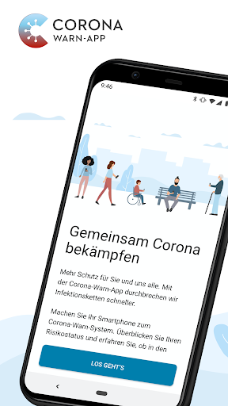
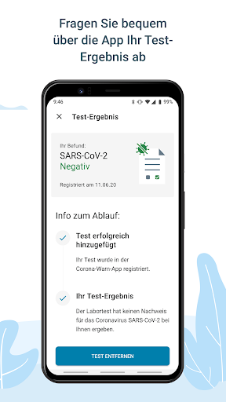
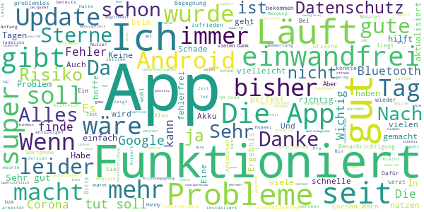
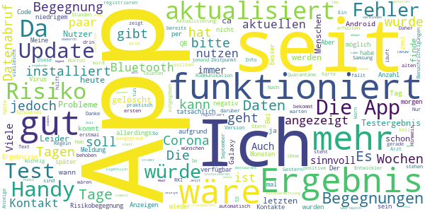
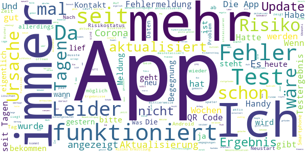
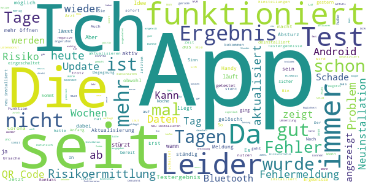
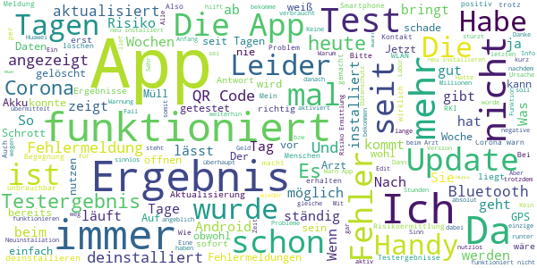

# Corona-Warn-App
App version ``1.3.1``

Analyzed with [covid-apps-observer](http://github.com/covid-apps-observer) project, version ``0.1``

## App overview
| | |
|-------------------------|-------------------------| 
| **Name**&nbsp;&nbsp;&nbsp;&nbsp;&nbsp;&nbsp;&nbsp;&nbsp;&nbsp;&nbsp;&nbsp;&nbsp;&nbsp;&nbsp;&nbsp;&nbsp;&nbsp;&nbsp;&nbsp;&nbsp;&nbsp;&nbsp;&nbsp;&nbsp;&nbsp;&nbsp;&nbsp;&nbsp;&nbsp;&nbsp;&nbsp;&nbsp;&nbsp;&nbsp;&nbsp;&nbsp;&nbsp;&nbsp;&nbsp;&nbsp;  | Corona-Warn-App |
| **Unique identifier** | de.rki.coronawarnapp |
| **Link to Google Play** | [https://play.google.com/store/apps/details?id=de.rki.coronawarnapp](https://play.google.com/store/apps/details?id=de.rki.coronawarnapp) |
| **Summary**  | Gemeinsam Corona bekämpfen |
| **Privacy policy** | [https://www.coronawarn.app/assets/documents/cwa-privacy-notice-de.pdf](https://www.coronawarn.app/assets/documents/cwa-privacy-notice-de.pdf) |
| **Latest version** | 1.3.1 |
| **Last update** | 2020-09-24 14:33:40 |
| **Recent changes** | Mit diesem Update stehen Ihnen Verbesserungen und Fehlerbehebungen zur Verfügung. Auf der Detailkarte zum Risikostatus finden Sie nun zusätzliche Informationen zum niedrigen Infektionsrisiko trotz einer oder mehrerer Begegnungen mit einer positiv auf COVID-19 getesteten Person. |
| **Installs**  | 5.000.000+ |
| **Category** | Gesundheit & Fitness |
| **First release** | 12.06.2020 |
| **Size**  | 31M |
| **Supported Android version**  | 6.0 oder höher |

### Description
> Das Robert Koch-Institut (RKI) als zentrale Einrichtung des Bundes im Bereich der Öffentlichen Gesundheit und als nationales Public-Health-Institut veröffentlicht die Corona-Warn-App für die deutsche Bundesregierung und für die Bundesrepublik Deutschland. Die App fungiert als digitale Ergänzung zu Abstandhalten, Hygiene und Alltagsmaske. Wer sie nutzt, hilft, Infektionsketten schnell nachzuverfolgen und zu durchbrechen. Die App merkt sich dezentral unsere Begegnungen mit anderen und informiert uns digital, wenn wir Begegnungen mit nachweislich infizierten Personen hatten. Dabei sammelt sie jedoch zu keiner Zeit Informationen zur Identität ihrer Nutzerinnen und Nutzer. Wer wir sind und wo wir sind, bleibt geheim – und unsere Privatsphäre bestens geschützt.
 WIE DIE APP FUNKTIONIERT
 Sind wir unterwegs, sollte die Risiko-Ermittlung immer aktiviert sein. Denn sie ist das Herzstück der Software. Wann immer sich Nutzerinnen und Nutzer begegnen, tauschen ihre Smartphones über Bluetooth verschlüsselte Zufallscodes aus. 
 Diese geben nur Auskunft darüber, über welche Dauer und mit welchem Abstand eine Begegnung stattfand. Welche Person sich hinter einem Code verbirgt, ist für niemanden nachvollziehbar. Die Corona-Warn-App erhebt keine Informationen über den Ort der Begegnung oder den Standort der Nutzerinnen und Nutzer.
 Entsprechend der maximalen Corona-Inkubationszeit werden alle Zufallscodes, die unser Smartphone sammelt, für 14 Tage auf dem Smartphone gespeichert – und dann gelöscht. 
 Nur wenn eine Person sich über die App freiwillig als nachweislich infiziert meldet, erhalten daraufhin alle früheren Begegnungen eine Warnung auf ihr Smartphone. 
 Niemand erfährt, wann, wo oder mit wem eine entsprechende Risiko-Begegnung stattfand. Die infizierte Person bleibt anonym.
 Mit der Benachrichtigung erhalten die betroffenen Nutzer/-innen klare Handlungsempfehlungen. Wichtig: Auch die Daten der Benachrichtigten sind zu keiner Zeit einsehbar.
 WIE DIE DATEN SICHER BLEIBEN
 Die Corona-Warn-App soll uns zwar täglich begleiten. Sie wird uns jedoch nie kennenlernen. Dadurch kann sie niemandem verraten, wer wir sind. Der Datenschutz bleibt über die gesamte Nutzungsdauer zu 100 Prozent gewahrt.
 • Keine Anmeldung: Es müssen keine E-Mail-Adresse und kein Name hinterlegt werden.
 • Keine Rückschlüsse auf Identitäten: Bei einer Begegnung mit einem anderen Menschen tauschen die Smartphones nur Zufallscodes aus. Diese messen, über welche Dauer und mit welchem Abstand ein Kontakt stattfand. Sie lassen aber keine Rückschlüsse auf Personen und Standorte zu. 
 • Dezentrale Speicherung: Die Daten werden nur auf dem Smartphone gespeichert und nach 14 Tagen gelöscht.
 • Keine Einsicht für Dritte: Sowohl die Personen, die eine nachgewiesene Infektion melden, als auch die Benachrichtigten sind nicht nachverfolgbar – nicht für die Bundesregierung, nicht für das Robert Koch-Institut, nicht für andere User und auch nicht für die Betreiber der App-Stores.
 Diese App ist nicht zum Gebrauch außerhalb Deutschlands bestimmt. Die Corona-Warn-App ist die zentrale COVID-19 App für Deutschland und sie ist an das deutsche Gesundheitssystem angeschlossen. Trotzdem ist die Corona-Warn-App auch in diesem Land verfügbar. Sie ist gedacht für alle, die in Deutschland leben, arbeiten, Urlaub machen oder sich regelmäßig oder über längere Zeit in Deutschland aufhalten.

### User interface
The developers of the app provide the following screenshots in the Google play store.
| | | |
|:-------------------------:|:-------------------------:|:-------------------------:|
 |   |   |   | 
 |   |   |   | 
 |   |  

## Development team
In the following we report the main information provided by the development team in the Google play store.

| | |
|-------------------------|-------------------------|
| **Developer**  | Robert Koch-Institut |
| **Website**  | [https://www.coronawarn.app](https://www.coronawarn.app) |
| **Email** | CoronaWarnApp@rki.de |
| **Physical address**  | [Robert Koch-Institut Nordufer 20 13353 Berlin](https://www.google.com/maps/search/Robert%20Koch-Institut%20Nordufer%2020%2013353%20Berlin) (Google Maps) |
| **Other developed apps**  | [https://play.google.com/store/apps/developer?id=Robert+Koch-Institut](https://play.google.com/store/apps/developer?id=Robert+Koch-Institut) |

## Android support

| | |
|-------------------------|-------------------------|
| **Declared target Android version**  | Android10, version 10 (API level 29) |
| **Effective target Android version**  | Android10, version 10 (API level 29) |
| **Minimum supported Android version**  | Marshmallow, version 6.0 (API level 23) |
| **Maximum target Android version**  | - |

The larger the difference between the minimum and maximum supported Android versions, the better. A larger difference means a wider audience. For example, old phones have a very low Android version, so a high minimum supported Android version means that the app cannot be used by users with old phones, thus leading to accessibility problems. 

## Requested permissions

In the following we report the complete list of the permissions requested by the app. 

| **Permission** | **Protection level** | **Description** | 
|-------------------------|-------------------------|-------------------------|
 **android.permission ACCESS_NETWORK_STATE** | Normal | Allows applications to access information about networks. 
 **android.permission BLUETOOTH** | Normal | Allows applications to connect to paired bluetooth devices. 
 **android.permission CAMERA** | :warning:**Dangerous** | Required to be able to access the camera device. 
 **android.permission FOREGROUND_SERVICE** | Normal | Allows a regular application to use Service.startForeground. 
 **android.permission INTERNET** | Normal | Allows applications to open network sockets. 
 **android.permission RECEIVE_BOOT_COMPLETED** | Normal | Allows an application to receive the Intent.ACTION_BOOT_COMPLETED that is broadcast after the system finishes booting. 
 **android.permission REQUEST_IGNORE_BATTERY_OPTIMIZATIONS** | Normal | Permission an application must hold in order to use Settings.ACTION_REQUEST_IGNORE_BATTERY_OPTIMIZATIONS. 
 **android.permission WAKE_LOCK** | Normal | Allows using PowerManager WakeLocks to keep processor from sleeping or screen from dimming. 

## Mentioned servers

| **Server** | **Registrant** | **Registrant country** | **Creation date** | 
|-------------------------|-------------------------|-------------------------|-------------------------|
 | google.com | Google LLC | :us: US | 1997-09-15 04:00:00 |
 | t-online.de | - | - | - |

## Security analysis 

Below we report the main security warnings raised by our execution of the [Androwarn](https://github.com/maaaaz/androwarn) security analysis tool.

**Connection interfaces exfiltration**
> - This application reads details about the currently active data network 
> - This application tries to find out if the currently active data network is metered 

**Telephony services abuse**
> - This application makes phone calls 

**Suspicious connection establishment**
> - This application opens a Socket and connects it to the remote address '; port is out of range' on the 'N/A' port  
> - This application opens a Socket and connects it to the remote address 'Lcom/android/tools/r8/GeneratedOutlineSupport;->outline19(Ljava/lang/String;)Ljava/lang/StringBuilder;' on the 'N/A' port  
> - This application opens a Socket and connects it to the remote address 'Ljava/net/Proxy;->type()Ljava/net/Proxy$Type;' on the 'N/A' port  
> - This application opens a Socket and connects it to the remote address 'Method sendUrgentData() is not supported.' on the 'N/A' port  
> - This application opens a Socket and connects it to the remote address 'Method setHandshakeTimeout() is not supported.' on the 'N/A' port  
> - This application opens a Socket and connects it to the remote address 'Method setOOBInline() is not supported.' on the 'N/A' port  
> - This application opens a Socket and connects it to the remote address 'Method setSoWriteTimeout() is not supported.' on the 'N/A' port  
> - This application opens a Socket and connects it to the remote address 'Socket closed' on the 'N/A' port  
> - This application opens a Socket and connects it to the remote address 'Socket is closed' on the 'N/A' port  
> - This application opens a Socket and connects it to the remote address 'Socket is closed.' on the 'N/A' port  
> - This application opens a Socket and connects it to the remote address 'Socket is not connected.' on the 'N/A' port  
> - This application opens a Socket and connects it to the remote address 'socket is closed' on the 'N/A' port  
> - This application opens a Socket and connects it to the remote address 'timeout' on the 'N/A' port  

**Code execution**
> - This application loads a native library 
> - This application loads a native library: 'conscrypt_gmscore_jni' 
> - This application loads a native library: 'conscrypt_jni' 

## User ratings and reviews

Below we provide information about how end users are reacting to the app in terms of ratings and reviews in the Google Play store.

### Ratings

The Corona-Warn-App app has been installed by more than **5000000** times. At this time, **80919** rated the app and its average score is **3.018648**. Below we show the distribution of the ratings across the usual star-based rating of Google Play

:star::star::star::star::star:: 30309

:star::star::star::star:: 6939

:star::star::star:: 7138

:star::star:: 7018

:star:: 29515

### Reviews 

#### 5-star reviews

> Benutze die App seit der Veröffentlichung. Nach anfänglichen Bugs läuft sie nun stabil und tut was sie soll. Sehr übersichtlich und informativ. Kleines Aber: Ich bekam keine Benachrichtigung, dass ich 2 Kontakte mit niedrigem Risiko hatte sondern sah es erst als ich die App öffnete. Da bei niedrigem Risiko kein Handlungsbedarf besteht, ist das vielleicht so gewollt. Ich hätte trotzdem lieber in allen Fällen eine Benachrichtugung.  :date: __2020-10-02 15:16:15__

> rose8287  :date: __2020-10-02 14:50:41__

> sehr toller emulator klappt alles wunderbar  :date: __2020-10-02 14:01:49__

> In  :date: __2020-10-02 12:55:11__

> Bin vollkommen begeistert  :date: __2020-10-02 11:47:08__

> Tut was sie soll. Hatte vor kurzem ein Problem und habe schnelle, fundierte Hilfe bekommen.  :date: __2020-10-02 10:36:40__

> Wer sich und andere schützen möchte sollte u.a. diese App nutzen...  :date: __2020-10-02 10:33:59__

> Sehr schön umgesetzt, vielen Dank!!  :date: __2020-10-02 09:51:05__

> Bei dieser App wurde wirklich gut auf den Datenschutz geachtet, hut ab. Erfolgreich auf all meinen Geräte installiert, läuft ohne Tadel.  :date: __2020-10-02 07:59:59__

> Funktioniert  :date: __2020-10-02 07:36:48__

#### 4-star reviews

> Die App gefällt mir  :date: __2020-10-02 13:34:01__

> Danke für die Rückmeldung. Ich passe meine Bewertung an. Ich finde die App absolut sinnvoll und hoffe, dass noch mehr Menschen sie nutzen. Ich werde sie auch weiterhin nutzen. Bisher sind die Hinweistexte in der App und auch die wöchentlichen Berichte aber so kryptisch formuliert, dass man dies m. E. dringend verbessern sollte, um das Verständnis und Vertrauen der Nutzer zu erhöhen.  :date: __2020-10-02 12:55:43__

> Generell finde ich die App gut. Allerdings wurde mein Testergebnis nicht vom Labor erfasst, so dass aus der Meldung "Testergebnis liegt noch nicht vor" irgendwann eine Endlosschleife wurde, da die App wohl versucht hat, das Ergebnis abrufen. Ein neuer Test hätte somit nicht erfasst werden können. Daher hab ich die App zurückgesetzt. Nun ist diese Endlosschleife zwar weg, aber leider fehlen mir natürlich die letzten 14 Tage der Begegnungen. Das finde ich sehr schade.  :date: __2020-10-02 12:54:16__

> Leider nicht nutzbar auf P8 Lite. Funktioniert 2 Tage und danach nur kurz Startbildschirm und schließt sich sofort wieder. Mehrmals getestet, immer selbes Fehlerbild unter Android 6. EDIT: Ah, Mist. Wieder drauf reingefallen. Die alten Huawei sind ein Quell der Freude. Wird Zeit für was neues. Startet wieder, mal sehen, ob es jetzt dauerhaft läuft. Danke für die Hilfe.  :date: __2020-10-02 11:15:23__

> Die App funktioniert reibungslos,ich habe bis jetzt einmal die Schlüssel als Download in Drive gespeichert,da ich gelesen habe,das viele am meckern sind das nach 14Tage alles weg ist,wenn man es so macht hat man die Daten,war schon hilfreich, sonst funkioniert sie,man sollte auch nur ein Mal ein Update machen,sonst funkioniert die App gar nicht mehr,und über freies W LAN,zb Rewe sollte man ganz sein lassen,am besten immer nur über das Mobilfunknetz dann funkioniert alles reibungslos.  :date: __2020-10-02 10:51:14__

> Ich hatte einen Kontakt mit einer an Covid-19 erkrankten Person am 24.9. Dann noch mal mit weiteren Personen am 28.9. Erst heute, am 2.10. wird mir mitgeteilt, dass ich 3 Kontakte hatte. Ein bisschen spät, oder? Danke für das schnelle Feedback!  :date: __2020-10-02 10:42:33__

> Hi, bin Luxemburg-Pendler und habe dadurch die Möglichkeit mich oft testen zu lassen. Kann ich das Testergebnis aus Luxemburg in die App aufnehmen? Wir bekommen keinen QR oder eine Tan. Danke für ihre Rückmeldung.  :date: __2020-10-02 08:10:31__

> Corona-Warn-App  :date: __2020-10-02 01:06:33__

> Update 1. 10. 1. Unnötig technische Fehlermeldung bei fehlendem Internet wenn App geöffnet. Die User sollten verstehen können, was gerade funktioniert u. was nicht. 2. Wahrscheinlichleit dass die App einen Coronafall meldet bei 25% dt. Nutzern: 25% * 25% = nur etwa 6%! Um diesen Wert zu erhöhen, sollten hier u. in der öffentlichen Werbung f. diese App ALLE Voraussetzungen klar aufgelistet werden: min. OS-Version, App ist installiert, Bluetooth u. Ortungsdienste an, Internet 1x täglich an  :date: __2020-10-01 20:55:31__

> Die App lässt sich seit gestern leider nicht mehr öffnen. Fehlermeldung "App lässt sich nicht mehr öffnen" erscheint. Sollte man sie deinstallieren, oder sind dann potentielle Positiv-Begegnungen gelöscht? Vielen Dank und Grüße  :date: __2020-10-01 16:50:31__

#### 3-star reviews

> Weiss nicht so recht, was ich davon halten soll. Ich hab' sie halt mal.  :date: __2020-10-02 14:02:17__

> Seit Dienstag keine Risikoermittlung möglich.Fehler:3. Internet und Bluetooth sind aktiv und funktionieren. Android 10.Edit 02.10. Seit heute Mittag funktioniert Risikoermittlung wieder.  :date: __2020-10-02 13:49:51__

> Ich würde der gerne meine Hilfe anbieten nur ich bin keine Pflegekraft  :date: __2020-10-02 13:07:02__

> Fehlermeldung: Risikostatus kann nicht aktualisiert werden. Den Energiesparmodus für diese App habe ich ausgeschaltet!  :date: __2020-10-02 12:58:13__

> Keine Risikoermittlung mehr seit letztem Update (Android)  :date: __2020-10-02 12:37:10__

> Update: weil ich jetzt auch noch die Nachricht bekam,dass nur die Hälfte der Datenpakete vorliegt, habe ich neu installiert und fange die Sammlung der Kontakte von vorne an. (davor erhielt ich die Nachricht vom Betreiber: wir arbeiten an dem Problem) Ich wollte das nicht abwarten // Status drei Tage davor :Jetzt bekomme ich leider regelmäßig die Nachricht, dass die App beendet wird. Starten geht nicht. Läuft auf Android 11. Bis vor kurzem: Alles war gut!  :date: __2020-10-02 11:34:02__

> Eigentlich finde ich den Gedanken der App gut! Aber schön wäre es wenn sie auch konsequent funktioniert... momentan schließt sich die App einfach sofort wieder.  :date: __2020-10-02 10:53:32__

> Ich traue den Frieden nicht. Mal sehen ob es funktioniert.  :date: __2020-10-02 09:30:12__

> Bekomme seit heute die Fehler Meldung 39508 soll ich jetzt wieder neu installieren?  :date: __2020-10-02 07:35:34__

> Fehlermeldungen sind weg, hoffentlich sind auch die Fehler weg. Es wäre sehr wünschenswert wenn man die Anzahl der erfassten Kontakte in der App sehen könnte, um zu sehen dass die App überhaupt funktioniert. Die dämliche 14 von 14 Tagen Anzeige ist endlich korrigiert worden  :date: __2020-10-01 22:52:24__

#### 2-star reviews

> Bin seit dem ersten Tag dabei. In letzter Zeit leider immer mehr Fehlermeldungen. Aktuell Fehler Ursache 3 (39508). Schade, dabei würde mich mein Risiko Status interessieren, da ich aktuell Erkältungssymptome habe.  :date: __2020-10-02 15:08:57__

> Bis zum letzten Update hat die App ansich gut funktioniert. Jetzt lässt sich die App nicht mehr öffnen.  :date: __2020-10-02 14:45:18__

> Habe sie deinstalliert, da sie mal funktioniert und mal nicht.  :date: __2020-10-02 13:17:53__

> Ständig wenn ich die App öffne kommt die Meldung, dass seit über 24h keine Risikoermittlung durchgeführt werden konnte. Die Risikoermittlung ist inaktiv. Warum schaltet die sich ständig von alleine aus, trotz dessen, dass ich sie immer wieder einschalte?  :date: __2020-10-02 12:10:08__

> I doubt the usefulness of this app in order to protect myself and others. It can easily be used to track and profile people.  :date: __2020-10-02 11:57:45__

> Ich habe nach 5 Tagen immer noch kein Ergebnis. Normalerweise sollte es nach 48 Stunden feststehen oder sehe ich das falsch. Ansonsten ist die App sehr gut und einfach zu bedienen.  :date: __2020-10-02 11:02:28__

> Funktioniert leider nicht korrekt. Seit Tagen zeigt die App "Ursache: 3. Etwas ist schiefgelaufen." Entfernen und nochmal neu installieren der App hat das Problem auch nicht gelöst. So wird das nix mit der Rückverfolgung von Infektionsketten. Fehler 10 Update 17.07.2020: Die Fehlermeldung ist noch immer die gleiche. Update 02.10.2020.: Nach ca. 2 Monaten ohne Störung funktioniert die Risikoerfassung schon wieder seit 28.09. nicht.  :date: __2020-10-02 09:06:15__

> Ich bekomme seit heute die Fehlermeldung Ursache 3 (30598).  :date: __2020-10-02 07:40:43__

> am 24.9. Test registriert, am 28.9. Ergebnis vom Arzt und bis Heute (2.10.) noch kein Ergebnis in der App. Wenn das mit negativen Ergebnisen auch so läuft, dann wird man ja wirklich rechtzeitig gewarnt.... 👎  :date: __2020-10-02 06:56:11__

> Warum zeigt die Corona Warn-App mein Negativ-Ergebnis nicht an? Wenn sie nur Positiv-Ergebnisse anzeigt, müsste der Informationstext überarbeitet werden......  :date: __2020-10-02 06:39:32__

#### 1-star reviews

> Unnötige Geld investierung vom Staat. 1. Covid-19 test Ergebnisse kommen entweder nie oder sehr verspätet an! 2. Nicht jeder diese App nutzt somit nie 100% Sicherheit. 3. Zockt zu viel kostbaren Akku des Mobilgerätes. 3 gute Gründe die "App Entwickler" nicht zu unterstützen und die Applikation Nicht herunterzuladen!  :date: __2020-10-02 14:58:29__

> Der größte sch\*\**! Würden bis heute noch auf die Testergebnisse warten wenn man sich auf diese App verlässt. Nicht zu empfehlen!  :date: __2020-10-02 14:29:26__

> Unnötige App  :date: __2020-10-02 14:26:10__

> Die beiden Fehlertypen kommen 'bunt gemischt' ohne augenscheinliches System. Seit Mittwoch nun gar keine Aktualisierung mehr möglich. Ich nutze seit Jahren den gleichen Akku und die Corona-app funktioniert mal gut und mal gar nicht. Akku schließe ich daher aus. Lief ja auch bis zum letzten Update überwiegend fehlerfrei nach den bekannten Startschwierigkeiten.  :date: __2020-10-02 14:10:48__

> Warte auf das Ergebnis meines Tests. Es wird aufgezwungen diese App zu nutzen, um das Ergebnis zu bekommen. Warte schon über 24 Stunden. Habe jetzt einen anderen QR Code auf meinem Schein gescannt und über die Pin in der Webseite abgefragt (Wird auf diesem Zettel nirgendwo erklärt, nur wie man die App nutzt). Das Ergebnis ist schon seit 2 Uhr morgens (nach ca. 12 Stunden) bekannt. Während in der App immer noch nichts steht. Edit: Der eingescannte QR Code war mit der App kompatibel gewesen.  :date: __2020-10-02 14:06:06__

> Ich finde die App einfach nur unnötig. Ich brauch sie nur weil ich nächste Woche einen Corona-Test machen muss, wegen beruflichen gründen um das Ergebnis zu erfahren. Sonst würde ich sie sofort löschen  :date: __2020-10-02 14:01:54__

> Was soll die app? Ich hab schon lange die negativ Info vom Arzt. Die app schreibt immer noch der Test wäre noch nicht ausgewertet......würde ja null Sterne geben wenn es gehen würde.....wird deinstalliert!  :date: __2020-10-02 13:51:45__

> Testergebnis wird seit 1 Woche nicht angezeigt, alle Telefone überlastet, Tage später sogar abgeschaltet. Chaos pur, bis heute KEINE ANTWORT vom Test. Tag 6. Glaube wenig dass es übers Wochenende klappt.  :date: __2020-10-02 13:51:44__

> Ich bekomme immer wieder Fehlermeldungen. Habe die App schon mehrmals deinstalliert und wieder installiert. Meine Motivation, mich zu beteiligen, sinkt beträchtlich! Jetzt funktioniert die Risikoermittlung schon seit Tagen nicht!  :date: __2020-10-02 13:39:09__

> Hab die App jetzt deinstalliert. Mein Smartphone konnte sich nach der Installation der Corona App mit keinem Bluetooth Gerät mehr koppeln. Weder mit meinem Privat PKW noch im LKW und auch die Freisprechanlage in meinem Motoradhelm ging nicht mehr. App deinstalliert, alles wieder gut.  :date: __2020-10-02 13:10:55__

