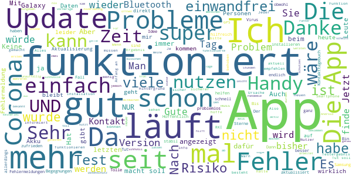
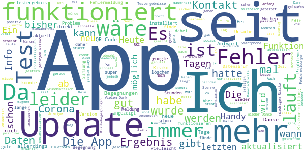
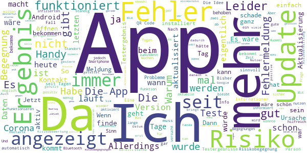
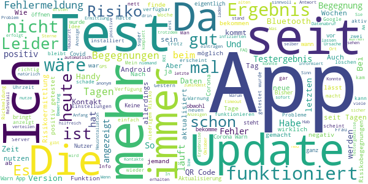
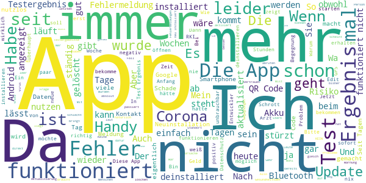

# Corona-Warn-App
App version ``1.5.0``

Analyzed with [covid-apps-observer](http://github.com/covid-apps-observer) project, version ``0.1``

## App overview
| | |
|-------------------------|-------------------------| 
| **Name**&nbsp;&nbsp;&nbsp;&nbsp;&nbsp;&nbsp;&nbsp;&nbsp;&nbsp;&nbsp;&nbsp;&nbsp;&nbsp;&nbsp;&nbsp;&nbsp;&nbsp;&nbsp;&nbsp;&nbsp;&nbsp;&nbsp;&nbsp;&nbsp;&nbsp;&nbsp;&nbsp;&nbsp;&nbsp;&nbsp;&nbsp;&nbsp;&nbsp;&nbsp;&nbsp;&nbsp;&nbsp;&nbsp;&nbsp;&nbsp;  | Corona-Warn-App |
| **Unique identifier** | de.rki.coronawarnapp |
| **Link to Google Play** | [https://play.google.com/store/apps/details?id=de.rki.coronawarnapp](https://play.google.com/store/apps/details?id=de.rki.coronawarnapp) |
| **Summary**  | Gemeinsam Corona bekämpfen |
| **Privacy policy** | [https://www.coronawarn.app/assets/documents/cwa-privacy-notice-de.pdf](https://www.coronawarn.app/assets/documents/cwa-privacy-notice-de.pdf) |
| **Latest version** | 1.5.0 |
| **Last update** | 2020-10-16 19:07:20 |
| **Recent changes** | Mit diesem Update stehen Ihnen Fehlerbehebungen und verbesserte Fehlermeldungen zur Verfügung. Die App-Version unterstützt die länderübergreifende Risiko-Ermittlung, die den Austausch von Zufalls-IDs/Positivkennungen mit teilnehmenden Ländern ermöglicht. Sie können beim Hochladen Ihres Testergebnisses angeben, wann Symptome aufgetreten sind. Die Info zur Verwendung der Standort-Dienste wurde verbessert; auf Android-11-Smartphones mit EN 1.6.1 sind keine aktiven Standort-Dienste mehr notwendig. |
| **Installs**  | 5.000.000+ |
| **Category** | Gesundheit & Fitness |
| **First release** | 12.06.2020 |
| **Size**  | 32M |
| **Supported Android version**  | 6.0 oder höher |

### Description
> Das Robert Koch-Institut (RKI) als zentrale Einrichtung des Bundes im Bereich der Öffentlichen Gesundheit und als nationales Public-Health-Institut veröffentlicht die Corona-Warn-App für die deutsche Bundesregierung und für die Bundesrepublik Deutschland. Die App fungiert als digitale Ergänzung zu Abstandhalten, Hygiene und Alltagsmaske. Wer sie nutzt, hilft, Infektionsketten schnell nachzuverfolgen und zu durchbrechen. Die App merkt sich dezentral unsere Begegnungen mit anderen und informiert uns digital, wenn wir Begegnungen mit nachweislich infizierten Personen hatten. Dabei sammelt sie jedoch zu keiner Zeit Informationen zur Identität ihrer Nutzerinnen und Nutzer. Wer wir sind und wo wir sind, bleibt geheim – und unsere Privatsphäre bestens geschützt.
 WIE DIE APP FUNKTIONIERT
 Sind wir unterwegs, sollte die Risiko-Ermittlung immer aktiviert sein. Denn sie ist das Herzstück der Software. Wann immer sich Nutzerinnen und Nutzer begegnen, tauschen ihre Smartphones über Bluetooth verschlüsselte Zufallscodes aus. 
 Diese geben nur Auskunft darüber, über welche Dauer und mit welchem Abstand eine Begegnung stattfand. Welche Person sich hinter einem Code verbirgt, ist für niemanden nachvollziehbar. Die Corona-Warn-App erhebt keine Informationen über den Ort der Begegnung oder den Standort der Nutzerinnen und Nutzer.
 Entsprechend der maximalen Corona-Inkubationszeit werden alle Zufallscodes, die unser Smartphone sammelt, für 14 Tage auf dem Smartphone gespeichert – und dann gelöscht. 
 Nur wenn eine Person sich über die App freiwillig als nachweislich infiziert meldet, erhalten daraufhin alle früheren Begegnungen eine Warnung auf ihr Smartphone. 
 Niemand erfährt, wann, wo oder mit wem eine entsprechende Risiko-Begegnung stattfand. Die infizierte Person bleibt anonym.
 Mit der Benachrichtigung erhalten die betroffenen Nutzer/-innen klare Handlungsempfehlungen. Wichtig: Auch die Daten der Benachrichtigten sind zu keiner Zeit einsehbar.
 WIE DIE DATEN SICHER BLEIBEN
 Die Corona-Warn-App soll uns zwar täglich begleiten. Sie wird uns jedoch nie kennenlernen. Dadurch kann sie niemandem verraten, wer wir sind. Der Datenschutz bleibt über die gesamte Nutzungsdauer zu 100 Prozent gewahrt.
 • Keine Anmeldung: Es müssen keine E-Mail-Adresse und kein Name hinterlegt werden.
 • Keine Rückschlüsse auf Identitäten: Bei einer Begegnung mit einem anderen Menschen tauschen die Smartphones nur Zufallscodes aus. Diese messen, über welche Dauer und mit welchem Abstand ein Kontakt stattfand. Sie lassen aber keine Rückschlüsse auf Personen und Standorte zu. 
 • Dezentrale Speicherung: Die Daten werden nur auf dem Smartphone gespeichert und nach 14 Tagen gelöscht.
 • Keine Einsicht für Dritte: Sowohl die Personen, die eine nachgewiesene Infektion melden, als auch die Benachrichtigten sind nicht nachverfolgbar – nicht für die Bundesregierung, nicht für das Robert Koch-Institut, nicht für andere User und auch nicht für die Betreiber der App-Stores.
 Diese App ist nicht zum Gebrauch außerhalb Deutschlands bestimmt. Die Corona-Warn-App ist die zentrale COVID-19 App für Deutschland und sie ist an das deutsche Gesundheitssystem angeschlossen. Trotzdem ist die Corona-Warn-App auch in diesem Land verfügbar. Sie ist gedacht für alle, die in Deutschland leben, arbeiten, Urlaub machen oder sich regelmäßig oder über längere Zeit in Deutschland aufhalten.
 Es gelten die Nutzungsbedingungen der Corona-Warn-App: https://www.coronawarn.app/assets/documents/cwa-eula-de.pdf. Durch die Installation und Nutzung dieser App stimmen Sie den Nutzungsbedingungen zu.

### User interface
The developers of the app provide the following screenshots in the Google play store.
| | | |
|:-------------------------:|:-------------------------:|:-------------------------:|
 |   |   |   | 
 |   |   |   | 
 |   |  

## Development team
In the following we report the main information provided by the development team in the Google play store.

| | |
|-------------------------|-------------------------|
| **Developer**  | Robert Koch-Institut |
| **Website**  | [https://www.coronawarn.app](https://www.coronawarn.app) |
| **Email** | CoronaWarnApp@rki.de |
| **Physical address**  | [Robert Koch-Institut Nordufer 20 13353 Berlin](https://www.google.com/maps/search/Robert%20Koch-Institut%20Nordufer%2020%2013353%20Berlin) (Google Maps) |
| **Other developed apps**  | [https://play.google.com/store/apps/developer?id=Robert+Koch-Institut](https://play.google.com/store/apps/developer?id=Robert+Koch-Institut) |

## Android support

| | |
|-------------------------|-------------------------|
| **Declared target Android version**  | Android10, version 10 (API level 29) |
| **Effective target Android version**  | Android10, version 10 (API level 29) |
| **Minimum supported Android version**  | Marshmallow, version 6.0 (API level 23) |
| **Maximum target Android version**  | - |

The larger the difference between the minimum and maximum supported Android versions, the better. A larger difference means a wider audience. For example, old phones have a very low Android version, so a high minimum supported Android version means that the app cannot be used by users with old phones, thus leading to accessibility problems. 

## Requested permissions

In the following we report the complete list of the permissions requested by the app. 

| **Permission** | **Protection level** | **Description** | 
|-------------------------|-------------------------|-------------------------|
 **android.permission ACCESS_NETWORK_STATE** | Normal | Allows applications to access information about networks. 
 **android.permission BLUETOOTH** | Normal | Allows applications to connect to paired bluetooth devices. 
 **android.permission CAMERA** | :warning:**Dangerous** | Required to be able to access the camera device. 
 **android.permission FOREGROUND_SERVICE** | Normal | Allows a regular application to use Service.startForeground. 
 **android.permission INTERNET** | Normal | Allows applications to open network sockets. 
 **android.permission RECEIVE_BOOT_COMPLETED** | Normal | Allows an application to receive the Intent.ACTION_BOOT_COMPLETED that is broadcast after the system finishes booting. 
 **android.permission REQUEST_IGNORE_BATTERY_OPTIMIZATIONS** | Normal | Permission an application must hold in order to use Settings.ACTION_REQUEST_IGNORE_BATTERY_OPTIMIZATIONS. 
 **android.permission WAKE_LOCK** | Normal | Allows using PowerManager WakeLocks to keep processor from sleeping or screen from dimming. 

## Mentioned servers

| **Server** | **Registrant** | **Registrant country** | **Creation date** | 
|-------------------------|-------------------------|-------------------------|-------------------------|
 | google.com | Google LLC | :us: US | 1997-09-15 04:00:00 |

## Security analysis 

Below we report the main security warnings raised by our execution of the [Androwarn](https://github.com/maaaaz/androwarn) security analysis tool.

**Connection interfaces exfiltration**
> - This application reads details about the currently active data network 
> - This application tries to find out if the currently active data network is metered 

**Telephony services abuse**
> - This application makes phone calls 

**Suspicious connection establishment**
> - This application opens a Socket and connects it to the remote address '; port is out of range' on the 'N/A' port  
> - This application opens a Socket and connects it to the remote address 'Lcom/android/tools/r8/GeneratedOutlineSupport;->outline19(Ljava/lang/String;)Ljava/lang/StringBuilder;' on the 'N/A' port  
> - This application opens a Socket and connects it to the remote address 'Ljava/net/Proxy;->type()Ljava/net/Proxy$Type;' on the 'N/A' port  
> - This application opens a Socket and connects it to the remote address 'Method sendUrgentData() is not supported.' on the 'N/A' port  
> - This application opens a Socket and connects it to the remote address 'Method setHandshakeTimeout() is not supported.' on the 'N/A' port  
> - This application opens a Socket and connects it to the remote address 'Method setOOBInline() is not supported.' on the 'N/A' port  
> - This application opens a Socket and connects it to the remote address 'Method setSoWriteTimeout() is not supported.' on the 'N/A' port  
> - This application opens a Socket and connects it to the remote address 'Socket closed' on the 'N/A' port  
> - This application opens a Socket and connects it to the remote address 'Socket is closed' on the 'N/A' port  
> - This application opens a Socket and connects it to the remote address 'Socket is closed.' on the 'N/A' port  
> - This application opens a Socket and connects it to the remote address 'Socket is not connected.' on the 'N/A' port  
> - This application opens a Socket and connects it to the remote address 'socket is closed' on the 'N/A' port  
> - This application opens a Socket and connects it to the remote address 'timeout' on the 'N/A' port  

**Code execution**
> - This application loads a native library 
> - This application loads a native library: 'conscrypt_gmscore_jni' 
> - This application loads a native library: 'conscrypt_jni' 

## User ratings and reviews

Below we provide information about how end users are reacting to the app in terms of ratings and reviews in the Google Play store.

### Ratings

The Corona-Warn-App app has been installed by more than **5000000** times. At this time, **87111** rated the app and its average score is **2.9566262**. Below we show the distribution of the ratings across the usual star-based rating of Google Play

:star::star::star::star::star:: 31523

:star::star::star::star:: 7357

:star::star::star:: 7427

:star::star:: 7427

:star:: 33377

### Reviews 

#### 5-star reviews

> Bin froh das ich sie installiert habe. Jetzt kann ich mich und andere warnen und schützen 👍  :date: __2020-10-24 09:31:50__

> Keine Probleme. Stürzt nicht ab und macht das was sie soll, nicht mehr und nicht weniger.  :date: __2020-10-24 08:43:40__

> Macht was sie soll, verstehe die ganzen schlechten Bewertungen nicht  :date: __2020-10-24 08:34:16__

> Ich werde die App nochmal neu installieren, in der Hoffnung das sie dann funktioniert,  :date: __2020-10-24 07:00:48__

> Die App läuft seit dem ersten Tag störungsfrei und stabil (Samsung A50). Auch auf den Geräten im Familien- und Bekanntenkreis die mir bekannt sind. Die App ist fast ein bisschen zu unauffällig. Toll wäre eine Art "Radar", was im (ungefähren) Umkreis los ist. Die niedrigen Fallzahlen in Südkorea zeigen, dass diese Strategie in der Lage ist Corona effizient zu bekämpfen. Ich hoffe, dass noch viel mehr mitmachen, dann hätten wir eine echte Chance auf ein normales öffentliches Leben.  :date: __2020-10-24 06:58:49__

> Funktioniert ohne Probleme. Schade das die App von sowenigen genutzt wird  :date: __2020-10-24 01:06:20__

> Hab 3 erhöhte risiko begegnungen 1 davon ist meine mutter weiß aber nicht was ich machen muss weil ich die anderen 2 nicht kenne  :date: __2020-10-24 01:01:55__

> Ich verstehe nicht, weshalb mein GPS aktiv sein muss, obwohl mit dem Gegenteiligen für diese App geworben wurde. Wenn einmal die Gefahren Ermittlung automatisch deaktiviert wurde, wie beispielsweise durch das Ausschalten der GPS Funktion, muss dies manuell erneut aktiviert werden. -- Danke für die Aufklärung! +*  :date: __2020-10-24 00:29:09__

> Sehr gut.😅  :date: __2020-10-24 00:02:05__

> Jeder sollte die App haben! Man hat nichts zu verlieren wenn man sie installiert. Man muss lediglich Bluetooth angeschaltet lassen mehr nicht. Je mehr Leute diese App nutzten, umso besser kann man die Verbreitung vom Virus verlangsamen.👍🏻 Lg Melissa  :date: __2020-10-23 23:52:52__

#### 4-star reviews

> Läuft seit Installation ohne Problem, ob sie richtig funktioniert kann ich nicht sagen, alles grün ☺️ Aquaris X5 plus  :date: __2020-10-24 09:24:48__

> Jetzt funktioniert die App bei mir auch und ich bin sehr zufrieden. Vor dem Update ist sie nach spätestens 24 Stunden abgestürzt und ich musste sie ständig neu installieren. Jetzt läuft sie auch auf meinem älteren Huawei Handy seit mehreren Tagen ordentlich.  :date: __2020-10-24 09:12:47__

> Ich habe bisher keine Risikobegenung gehabt,zumindest nicht wissentlich. Als Erweiterung würde ich mir ein Begegnungstagebuch wünschen, wo ich aufschreiben kann, wann ich Leute getroffen habe. Diese Daten sollten natürlich nur mir selbst zur Verfügung stehen. Dann kann ich, im Falle eines Falles, die Leute warnen, die ich getroffen habe.  :date: __2020-10-24 08:00:48__

> Ganz ok kann mich nicht beschweren. Die App funktioniert ohne Fehler, und ich hatte auch schon eine Begegnung mit niedrigem Risiko. Wäre halt interessant ob es möglich ist wann wie und wo dieser Kontakt zustande kam, sodass man evtl den Bereich meidet wo der Kontakt stattgefunden hat sofern dieser öfter besucht wird. (Fitness Studio o.ä)  :date: __2020-10-23 22:26:53__

> Hallo App Entwickler, wenn man einen später getesteten Positiven Kontakt hatte, ,wäre es schön zu wissen, ab welchem Datum dies ungefähr war, damit man zuordnen kann, wo man sich aufgehalten hat.  :date: __2020-10-23 21:46:01__

> Die App hat bei mir bisher problemlos funktioniert, die Testergebnisse waren immer super schnell auf dem Handy. Ich habe den letzten Test aber nicht sofort aus der App gelöscht und nun steht dort seit einigen Tagen "das Ergebnis wird aktualisiert" aber es tut sich nichts und einen neuen Test kann ich nicht hinzufügen (werde berufsbedingt regelmäßig getestet)  :date: __2020-10-23 21:10:24__

> Finde es gut wenn man sich orientieren kann.Ein Schutz ist auf jeden Fall gegeben.Hoffe das es viele nutzen werden.  :date: __2020-10-23 20:37:40__

> App funktioniert nahezu einwandfrei. Hin und wieder seit dem letzten Update dauert es eine Weile, bis die App gestartet ist und die Anzeige der Risikobegegnungen korrekt erscheint. Manchmal kommt "unbekanntes Risiko" und eine kurze Fehlermeldung.  :date: __2020-10-23 19:49:30__

> Es wäre schön, wenn es optional ein "Kontakttagebuch" in der App geben wäre. Dann könnten z.B. Freunde das besser/ einfacher notieren. Es gibt bereits Apps dafür, aber was weiss ich was da mit meinen Daten gemacht wird...  :date: __2020-10-23 19:40:33__

> Grundlegend läuft die App, aber ich bekomme keine sofortige Info, sobald ich "wohl" eine Risikobegegnung habe/hatte. Diese Info wäre für mich, sofort, wünschenswert, als Pushbenachrichtigung oder dass die Nachricht aufploppt, und nicht erst wenn ich die App hin und wieder mal öffne... War mehr als überrascht, dass ich wohl irgendwann in den letzten Tagen 2 Begegnungen mit geringem Risiko hatte..die Info hätte ich gerne schneller und sichtbarer.. //Danke für die Antwort!👍  :date: __2020-10-23 16:53:23__

#### 3-star reviews

> Wenn alle mitmachen würden, könnte das funktionieren. Bezweifle ich aber stark. Warum Teilt man den App Benutzern nicht die aktuelle Situation und ggf. Verbote, für den aktuellen Standort mit? Dann macht die App wieder etwas mehr Sinn.  :date: __2020-10-24 08:34:00__

> Mal eine ernste Frage, warum wird eine App veröffentlicht, die noch nicht ausgereift ist? Die genau so viele Lücken hat, wie das Corona Management in Deutschland? Es wird überall angepriesen dass man diese App runter laden soll... Aber funktionieren tut Sie nicht wirklich stabil, Mal das falsche Betriebssystem,dann Probleme mit Google, mit der API Schnittstelle, mit IOS und verschiedenen Handy-Modellen mit den Energiespareinstellungen und weiß der Kuckuck was noch? Warum?  :date: __2020-10-24 08:11:32__

> [Mit 1.5.0 behoben] Aktualisierung meiner Risiko-Bewertungsdaten wochenlang ausgefallen durch permanente "Fehler bei Kommunikation mit Google API (39508)". Ausgefallene Risikobewertung bedeutet für mich, tagelang kein Austausch/Benachrichtigung mit/von ggf. positive Getestete. (App-Versionen 1.3.1, Android 6.0.1)  :date: __2020-10-24 06:12:51__

> ... Ich finde sie auf einer Seite gut, nur fände ich es schöner, wenn Sie sich in regelmäßigen Abständen aktualisiert und nicht nur 1x mal Tag und dass immer nachts um 3h. Dass macht für mich keinen Sinn...  :date: __2020-10-24 03:52:48__

> Die App läuft. Allerdings wird sie quasi nicht mehr weiterentwickelt. Das ist schade und ist eine verpasste Chance. Die Entwickler*innen sollten sich vielleicht mal Folge 40 des UKW-Podcasts von Tim Pritlove anhören. Dort werden viele, mögliche Verbesserungen der App besprochen, bei denen man sich fragt, warum die App diese eigentlich nicht schon lange hat! OnePlus 5, Android 10  :date: __2020-10-24 01:29:00__

> Ich fände einen Indikator in der Statuszeile gut. Dann wäre man informiert wenn man die App versehentlich beendet hat. Die Funktion könnte über die Benachrichtigungseinstellungen ein/aus schaltbar sein. Update: ich bekomme seit einigen Tagen einen Fehler Ursache 3. Es ist der Fehler 17. Die oben genannten Probleme sind behoben.  :date: __2020-10-24 01:02:01__

> Fände es gut, wenn man einsehen könnte, wann die Risikobegegnung war. Dann könnte man auch selber das Risiko etwas abschätzen.  :date: __2020-10-24 00:12:03__

> Bringt nicht viel, wenn nur vermutlich 60% der positiv Getesteten das Ergebnis einstellen. Das sollte zwangsweise automatisch erfolgen.  :date: __2020-10-24 00:07:27__

> Ich muss von voller Bewertung runter auf schlecht. Wer plant, dass man die automatisch erhaltenen Testergebnisse dann manuell löschen muss, weil sonst die beim Abruf der Testdaten den Geist aufgibt und man sein Testergebnis nicht mehr erfährt? Sagt nicht, man kann nicht einfach das aktuelle Datum abfragen mit dem zuletzt erhaltenen abgleichen und dann die Abfrage automatisch stoppen. Laut Hotline soll ich die App vollständig löschen und neu installieren. Ob das if..then noch eingefügt wird?  :date: __2020-10-23 23:55:24__

> Bisher war ich ganz zufrieden mit der App, aber jetzt habe ich eine schlechte Erfahrung gemacht. Bin vor Kurzem auf Corona getestet worden. Habe einige Tage vorher mein Handy gewechselt. Den Test konnte ich nur auf einem Handy einscannen. Das macht für mich nur wenig Sinn. Sollte ich positiv getestet werden, sind somit alle Kontakte der vergangenen 14 Tage nicht in die Nachverfolgung eingeschlossen. Die App macht also überhaupt keinen Sinn, wenn man das Handy wechselt oder mehrere Handys nutzt.  :date: __2020-10-23 20:12:45__

#### 2-star reviews

> Irgendwie läuft in der App etwas gewaltig schief. Meine Familie und ich sind momentan in Quarantäne weil meine Lebensgefährtin positiv ist. Und wir hatten keinerlei Kontakt zu anderen Menschen. Es wird seit heute in der Risiko Anzeige <2 Begegnungen mit niedrigem Risiko> angezeigt, in den letzten Tagen stand da komischer Weise nichts. Da läuft doch was gewaltig schief! Sollen wir jetzt auf Grund der App Anzeige raus gehen und Covid weiter verbreiten?  :date: __2020-10-24 09:37:42__

> Ist es normal das die app sich nur nachts aktualisiert und keine Meldung anzeigt das man begegnungen hatte ? Und sich niedrige Begegnungen auf ein Handy anzeigt das nur zuhause ist? hab das gefühl die app läuft nicht ganz optimal? vielleicht wäre eine stündliche Aktualisierung sinnvoller  :date: __2020-10-24 09:25:28__

> Die App zeigt willkürlich sich verändernde Warnungen an. Zudem hat eine Freundin von mir jeden Tag 16 bis 20! Risikobegegnungen, weil sie gegenüber von einer Testpraxis wohnt!! Screenshots liegen vor, kann ich Ihnen gerne zukommen lassen. So taugt das alles nix.  :date: __2020-10-23 21:54:41__

> nur hilfreich wenn jeder permanent bluetooth an hat und.auch, wenn positiv getestet, das in der App angibt.  :date: __2020-10-23 21:53:30__

> Warnfunktion scheint zu funktionieren. Risikoarme Begegnungen wurden angezeigt. Aber beim Datenabruf dreht sich nur das Rad dauerhaft, "Das Ergebnis wird aktualisiert..." wird angezeigt, es tut sich aber nichts. Funktion hängt schon seit Wochen und es kommt nie ein Ergebnis. Habe schon 2x Ergebnis von Test nur über andere Apps erhalten.  :date: __2020-10-23 20:29:38__

> Die App hat bisher ihren Zweck erfüllt. Da ich meinen alten Test nicht gelöscht habe, ist er nun in Dauerschleife und ich könnte auch keinen neuen Test eingeben. Die Funktion steht nun nicht mehr zur Verfügung. Sie haben mir geraten in den Einstellungen die App zurückzusetzen. Dann erhalte ich eine Warnmeldung. Ich werde nicht mehr über Risikobegegnungen informiert und ich könne keine anderen Nutzer mehr warnen. Wären dann die Begegnungen der letzten 14 Tage weg? Ob das die richtige Lösung ist?  :date: __2020-10-23 19:50:39__

> Habe sie geladen alles eingegeben, und plötzlich hört mich niemand mehr, wenn ich angerufen werde. Nach der Deinstallation funktioniert mein Handy wunderbar...  :date: __2020-10-23 18:38:03__

> Sie ist sehr gut  :date: __2020-10-23 18:25:30__

> Leider nur 2 Sterne weil man positiv Tests nicht eintragen kann. Erscheint immer eine Fehlermeldung. So macht die App leider kein Sinn  :date: __2020-10-23 17:26:18__

> Seit einiger Zeit habe ich ständige Abstürze der App. Mehrmaliges De- und Neuinstallalieren funktioniert immer nur für kurze Zeit. So bringt die App nichts.  :date: __2020-10-23 16:59:08__

#### 1-star reviews

> Als hätte die Bundesregierung die App direkt beim Praktikanten einer Billig-Agentur in Auftrag gegeben. Funktioniert von Anfang an nicht richtig und seit geraumer Zeit kommt nur noch eine Fehlermeldung. Höchst unprofessionell.  :date: __2020-10-24 09:43:36__

> Test Ergebnis kann nicht eingegeben werden. Mein qr code von der Anmeldung wird als ungültig abgelehnt und auf dem test Ergebnis ist kein qr Code. Wie immer, wenn etwas die öffentliche Hand anfasst klappt es nicht.. Aber wenn man es mit dem BER vergleicht haben sie ja noch 8-9 Jahre Zeit.  :date: __2020-10-24 09:35:31__

> App zwang für zwangs testung verfälscht die hochgelobten downloadzahlen dieser ach so tollen Millionen Euro teuren app in der man nicht mal als Familie alle tests einbinden kann....  :date: __2020-10-24 09:19:44__

> Bin wirklich gewillt die App zu nutzen. Fahre jeden Tag Öffentlich und bewege mich viel im öffentlichen Raum. Aber sie funktioniert einfach nicht! Ständig Fehlermeldungen oder auf einmal wäre plötzlich keine Aktualisierung möglich. Jetzt ein letzter dritter Versuch mit Deinstallation und Neuinstallation. So kann man auch Downloadzahlen generieren .....  :date: __2020-10-24 09:06:14__

> App stürzt ständig beim Starten oder gar der Hintergrund-Prozess ab. Bitte um Behebung (hat zwei Wochen ohne Probleme funktioniert). Selbst bei einer Neuinstallationn der App, stürzt diese wieder nach zwei Wochen kontinuierlich ab und kann nicht mehr geöffnet werden.  :date: __2020-10-24 09:03:15__

> Ständig Probleme bereits 4 mal runtergeschmisssen und wieder neu installiert, funktioniert nicht zuverlässig 😡  :date: __2020-10-24 08:48:25__

> Inzwischen zweifel ich an der App. Habe die Tage die Mitteilung bekommen "Sie hatten eine Begegnung mit einer später Corona-positiv getesteten". Woran soll die App sowas erkennen?  :date: __2020-10-24 08:40:58__

> Ich finde es nicht nützlich, wenn es eine tägliche Aktualisierung gibt. Wäre eher für ne stündliche Aktualisierung. Man stelle sich vor man hat mit jemandem Kontakt, der Corona hat und weiß nicht genau über das Risiko Bescheid. Bis man dann darüber erfährt dauert es 1 Tag. Was passiert an einem Tag alles? Zu viel. Bis dahin steckt man dann unwissentlich mehrere an...  :date: __2020-10-24 08:36:10__

> Warum braucht die App meinen Standort? Schade, wenn es mit inaktivem Standortdienst ginge würde ich sie nutzen.  :date: __2020-10-24 08:23:59__

> Öffnen der App nicht möglich. Keine Fehlermeldung, sondern sofortiges, selbstständiges Schließen der App. Sie hat also derzeit keinen Nutzen.  :date: __2020-10-24 08:16:00__

