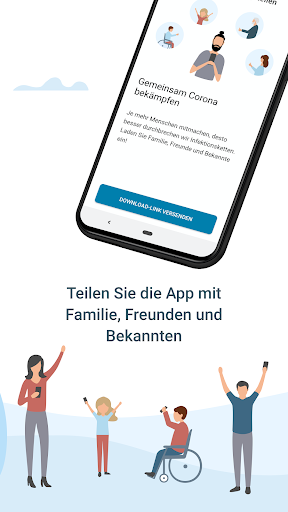
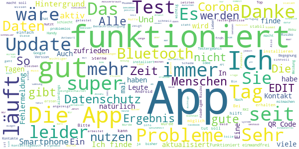
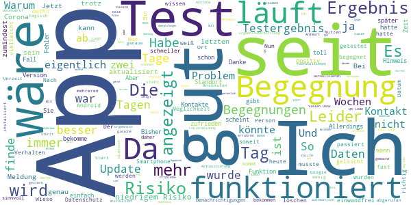
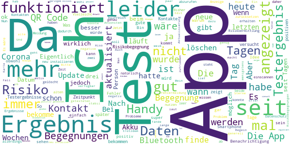
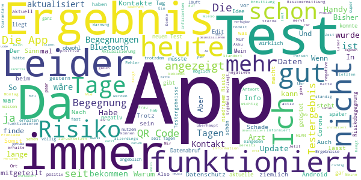
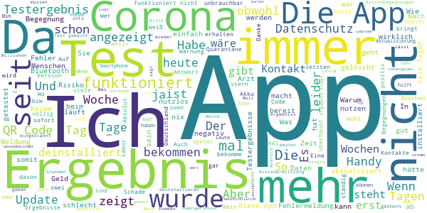

# Corona-Warn-App
App version ``1.5.1``

Analyzed with [covid-apps-observer](http://github.com/covid-apps-observer) project, version ``0.1``

## App overview
| | |
|-------------------------|-------------------------| 
| **Name**&nbsp;&nbsp;&nbsp;&nbsp;&nbsp;&nbsp;&nbsp;&nbsp;&nbsp;&nbsp;&nbsp;&nbsp;&nbsp;&nbsp;&nbsp;&nbsp;&nbsp;&nbsp;&nbsp;&nbsp;&nbsp;&nbsp;&nbsp;&nbsp;&nbsp;&nbsp;&nbsp;&nbsp;&nbsp;&nbsp;&nbsp;&nbsp;&nbsp;&nbsp;&nbsp;&nbsp;&nbsp;&nbsp;&nbsp;&nbsp;  | Corona-Warn-App |
| **Unique identifier** | de.rki.coronawarnapp |
| **Link to Google Play** | [https://play.google.com/store/apps/details?id=de.rki.coronawarnapp](https://play.google.com/store/apps/details?id=de.rki.coronawarnapp) |
| **Summary**  | Gemeinsam Corona bekämpfen |
| **Privacy policy** | [https://www.coronawarn.app/assets/documents/cwa-privacy-notice-de.pdf](https://www.coronawarn.app/assets/documents/cwa-privacy-notice-de.pdf) |
| **Latest version** | 1.5.1 |
| **Last update** | 2020-10-26 17:36:30 |
| **Recent changes** | Diese Version enthält kleinere Fehlerbehebungen. |
| **Installs**  | 10.000.000+ |
| **Category** | Gesundheit & Fitness |
| **First release** | 12.06.2020 |
| **Size**  | 32M |
| **Supported Android version**  | 6.0 oder höher |

### Description
> Das Robert Koch-Institut (RKI) als zentrale Einrichtung des Bundes im Bereich der Öffentlichen Gesundheit und als nationales Public-Health-Institut veröffentlicht die Corona-Warn-App für die deutsche Bundesregierung und für die Bundesrepublik Deutschland. Die App fungiert als digitale Ergänzung zu Abstandhalten, Hygiene und Alltagsmaske. Wer sie nutzt, hilft, Infektionsketten schnell nachzuverfolgen und zu durchbrechen. Die App merkt sich dezentral unsere Begegnungen mit anderen und informiert uns digital, wenn wir Begegnungen mit nachweislich infizierten Personen hatten. Dabei sammelt sie jedoch zu keiner Zeit Informationen zur Identität ihrer Nutzerinnen und Nutzer. Wer wir sind und wo wir sind, bleibt geheim – und unsere Privatsphäre bestens geschützt.
 WIE DIE APP FUNKTIONIERT
 Sind wir unterwegs, sollte die Risiko-Ermittlung immer aktiviert sein. Denn sie ist das Herzstück der Software. Wann immer sich Nutzerinnen und Nutzer begegnen, tauschen ihre Smartphones über Bluetooth verschlüsselte Zufallscodes aus. 
 Diese geben nur Auskunft darüber, über welche Dauer und mit welchem Abstand eine Begegnung stattfand. Welche Person sich hinter einem Code verbirgt, ist für niemanden nachvollziehbar. Die Corona-Warn-App erhebt keine Informationen über den Ort der Begegnung oder den Standort der Nutzerinnen und Nutzer.
 Entsprechend der maximalen Corona-Inkubationszeit werden alle Zufallscodes, die unser Smartphone sammelt, für 14 Tage auf dem Smartphone gespeichert – und dann gelöscht. 
 Nur wenn eine Person sich über die App freiwillig als nachweislich infiziert meldet, erhalten daraufhin alle früheren Begegnungen eine Warnung auf ihr Smartphone. 
 Niemand erfährt, wann, wo oder mit wem eine entsprechende Risiko-Begegnung stattfand. Die infizierte Person bleibt anonym.
 Mit der Benachrichtigung erhalten die betroffenen Nutzer/-innen klare Handlungsempfehlungen. Wichtig: Auch die Daten der Benachrichtigten sind zu keiner Zeit einsehbar.
 WIE DIE DATEN SICHER BLEIBEN
 Die Corona-Warn-App soll uns zwar täglich begleiten. Sie wird uns jedoch nie kennenlernen. Dadurch kann sie niemandem verraten, wer wir sind. Der Datenschutz bleibt über die gesamte Nutzungsdauer zu 100 Prozent gewahrt.
 • Keine Anmeldung: Es müssen keine E-Mail-Adresse und kein Name hinterlegt werden.
 • Keine Rückschlüsse auf Identitäten: Bei einer Begegnung mit einem anderen Menschen tauschen die Smartphones nur Zufallscodes aus. Diese messen, über welche Dauer und mit welchem Abstand ein Kontakt stattfand. Sie lassen aber keine Rückschlüsse auf Personen und Standorte zu. 
 • Dezentrale Speicherung: Die Daten werden nur auf dem Smartphone gespeichert und nach 14 Tagen gelöscht.
 • Keine Einsicht für Dritte: Sowohl die Personen, die eine nachgewiesene Infektion melden, als auch die Benachrichtigten sind nicht nachverfolgbar – nicht für die Bundesregierung, nicht für das Robert Koch-Institut, nicht für andere User und auch nicht für die Betreiber der App-Stores.
 Diese App ist nicht zum Gebrauch außerhalb Deutschlands bestimmt. Die Corona-Warn-App ist die zentrale COVID-19 App für Deutschland und sie ist an das deutsche Gesundheitssystem angeschlossen. Trotzdem ist die Corona-Warn-App auch in diesem Land verfügbar. Sie ist gedacht für alle, die in Deutschland leben, arbeiten, Urlaub machen oder sich regelmäßig oder über längere Zeit in Deutschland aufhalten.
 Es gelten die Nutzungsbedingungen der Corona-Warn-App: https://www.coronawarn.app/assets/documents/cwa-eula-de.pdf. Durch die Installation und Nutzung dieser App stimmen Sie den Nutzungsbedingungen zu.

### User interface
The developers of the app provide the following screenshots in the Google play store.
| | | |
|:-------------------------:|:-------------------------:|:-------------------------:|
 |   |   |   | 
 |   |   |   | 
 |   |  

## Development team
In the following we report the main information provided by the development team in the Google play store.

| | |
|-------------------------|-------------------------|
| **Developer**  | Robert Koch-Institut |
| **Website**  | [https://www.coronawarn.app](https://www.coronawarn.app) |
| **Email** | CoronaWarnApp@rki.de |
| **Physical address**  | [Robert Koch-Institut Nordufer 20 13353 Berlin](https://www.google.com/maps/search/Robert%20Koch-Institut%20Nordufer%2020%2013353%20Berlin) (Google Maps) |
| **Other developed apps**  | [https://play.google.com/store/apps/developer?id=Robert+Koch-Institut](https://play.google.com/store/apps/developer?id=Robert+Koch-Institut) |

## Android support

| | |
|-------------------------|-------------------------|
| **Declared target Android version**  | Android10, version 10 (API level 29) |
| **Effective target Android version**  | Android10, version 10 (API level 29) |
| **Minimum supported Android version**  | Marshmallow, version 6.0 (API level 23) |
| **Maximum target Android version**  | - |

The larger the difference between the minimum and maximum supported Android versions, the better. A larger difference means a wider audience. For example, old phones have a very low Android version, so a high minimum supported Android version means that the app cannot be used by users with old phones, thus leading to accessibility problems. 

## Requested permissions

In the following we report the complete list of the permissions requested by the app. 

| **Permission** | **Protection level** | **Description** | 
|-------------------------|-------------------------|-------------------------|
 **android.permission ACCESS_NETWORK_STATE** | Normal | Allows applications to access information about networks. 
 **android.permission BLUETOOTH** | Normal | Allows applications to connect to paired bluetooth devices. 
 **android.permission CAMERA** | :warning:**Dangerous** | Required to be able to access the camera device. 
 **android.permission FOREGROUND_SERVICE** | Normal | Allows a regular application to use Service.startForeground. 
 **android.permission INTERNET** | Normal | Allows applications to open network sockets. 
 **android.permission RECEIVE_BOOT_COMPLETED** | Normal | Allows an application to receive the Intent.ACTION_BOOT_COMPLETED that is broadcast after the system finishes booting. 
 **android.permission REQUEST_IGNORE_BATTERY_OPTIMIZATIONS** | Normal | Permission an application must hold in order to use Settings.ACTION_REQUEST_IGNORE_BATTERY_OPTIMIZATIONS. 
 **android.permission WAKE_LOCK** | Normal | Allows using PowerManager WakeLocks to keep processor from sleeping or screen from dimming. 

## Mentioned servers

| **Server** | **Registrant** | **Registrant country** | **Creation date** | 
|-------------------------|-------------------------|-------------------------|-------------------------|
 | google.com | Google LLC | :us: US | 1997-09-15 04:00:00 |

## Security analysis 

Below we report the main security warnings raised by our execution of the [Androwarn](https://github.com/maaaaz/androwarn) security analysis tool.

**Connection interfaces exfiltration**
> - This application reads details about the currently active data network 
> - This application tries to find out if the currently active data network is metered 

**Telephony services abuse**
> - This application makes phone calls 

**Suspicious connection establishment**
> - This application opens a Socket and connects it to the remote address '; port is out of range' on the 'N/A' port  
> - This application opens a Socket and connects it to the remote address 'Lcom/android/tools/r8/GeneratedOutlineSupport;->outline19(Ljava/lang/String;)Ljava/lang/StringBuilder;' on the 'N/A' port  
> - This application opens a Socket and connects it to the remote address 'Ljava/net/Proxy;->type()Ljava/net/Proxy$Type;' on the 'N/A' port  
> - This application opens a Socket and connects it to the remote address 'Method sendUrgentData() is not supported.' on the 'N/A' port  
> - This application opens a Socket and connects it to the remote address 'Method setHandshakeTimeout() is not supported.' on the 'N/A' port  
> - This application opens a Socket and connects it to the remote address 'Method setOOBInline() is not supported.' on the 'N/A' port  
> - This application opens a Socket and connects it to the remote address 'Method setSoWriteTimeout() is not supported.' on the 'N/A' port  
> - This application opens a Socket and connects it to the remote address 'Socket closed' on the 'N/A' port  
> - This application opens a Socket and connects it to the remote address 'Socket is closed' on the 'N/A' port  
> - This application opens a Socket and connects it to the remote address 'Socket is closed.' on the 'N/A' port  
> - This application opens a Socket and connects it to the remote address 'Socket is not connected.' on the 'N/A' port  
> - This application opens a Socket and connects it to the remote address 'socket is closed' on the 'N/A' port  
> - This application opens a Socket and connects it to the remote address 'timeout' on the 'N/A' port  

**Code execution**
> - This application loads a native library 
> - This application loads a native library: 'conscrypt_gmscore_jni' 
> - This application loads a native library: 'conscrypt_jni' 

## User ratings and reviews

Below we provide information about how end users are reacting to the app in terms of ratings and reviews in the Google Play store.

### Ratings

The Corona-Warn-App app has been installed by more than **10000000** times. At this time, **89134** rated the app and its average score is **2.9752047**. Below we show the distribution of the ratings across the usual star-based rating of Google Play

:star::star::star::star::star:: 32501

:star::star::star::star:: 7715

:star::star::star:: 7715

:star::star:: 7479

:star:: 33724

### Reviews 

#### 5-star reviews

> Geil  :date: __2020-11-08 14:34:10__

> Bei mir läuft die App gut. Ich empfehle sie auf jeden Fall weiter!  :date: __2020-11-08 14:28:21__

> Gut  :date: __2020-11-08 14:16:26__

> Hier für schon mal ein großes Dankeschön, für die Entwickler😇... Durch arbeitsbedingte Zwangsquarantäne, die App am Vormittag installiert und am Nachmittag zeigte mir die App mein Testergebnis an, schneller geht auf keinen Fall. Bin positiv überrascht😇und überaus dankbar dafür, dass ich durch die App nicht so lange wie viele anderen (oft 5 Tage)auf das Ergebnis warten musste. Bin nun gespannt wie sie in Zukunft, im täglichen Alltag arbeiten wird.  :date: __2020-11-08 11:57:54__

> Funktioniert wie gewünscht. Der Datenschutz ist sehr streng - der Kompromiss zwischen Datenschutz und Pandemiebekämpfung könnte meiner Meinung nach auch Richtung Pandemiebekämpfung verschoben werden.  :date: __2020-11-08 11:39:23__

> Funktioniert tadellos! Ich habe eine Warnung erhalten, dass ich mich vor X Tagen mit einem Risikokontakt getroffen habe & ein erhöhtes Risiko besteht. Ich konnte nachvollziehen, dass ich mich an dem Tag mit jemandem getroffen hatte, der im Anschluss positiv getestet wurde. "Ich möchte wissen wann, wo & wer der Risikokontakt ist" und gleichzeitig Angst wegen Datenschutz haben, passt nicht zusammen!!! WhatsApp, Facebook etc. sind die viel größeren Datenkraken.  :date: __2020-11-08 11:37:27__

> Ich glaube einfacher als mit diesem Download kann man im Moment nicht dazu beitragen, die Pandemie mit einzudämmen.  :date: __2020-11-08 11:02:28__

> Gute App, man muss vor infizierten gewarnt werden.  :date: __2020-11-08 11:02:01__

> Noch keine Warnungen erhalten. Wichtige APP zur Unterstützung der Pandemie Bekämpfung.  :date: __2020-11-08 10:37:14__

> Stabile app  :date: __2020-11-08 10:04:10__

#### 4-star reviews

> Habe die App seit langen installiert und versucht alle Rechte zu geben und bis heute wusste ich nicht sicher ob sie funktioniert. Doch hier ist sie die Warnung... Eine Begegnung mit niedrigem Risiko. Und nun. Hätte es fast verpasst und nun würde ich schon gerne wissen wo es passiert ist. Zuhause, im Supermarkt auf dem Weg zur Arbeit mit dem Fahrrad oder auf der Arbeit. Das würde mir die Möglichkeit geben mein Risiko besser einzuschätzen.  :date: __2020-11-08 13:05:24__

> Bei mir hat die App mein Umfeld gewarnt, wie sie es sollte. Allerdings kann ich mit meiner Positivmeldung meine eigenen Risikokontakte nicht mehr einsehen. Und mein Partner bekommt bei seinen 15 Risikomeldungen nur das Datum der letzten Begegnung (mit mir) angezeigt. Insofern macht es die App leider unmöglich, einen Hinweis auf ein potentielles Superspreadingereignis in einem quirligen Restaurant nachzuvollziehen, wo ich vermute, mich angesteckt zu haben. Das sollte unbedingt geändert werden!  :date: __2020-11-08 10:54:57__

> .....Frage : ich habe diese App ganz neu installiert. Ich versteh nicht genau, die infizierten Personen die mir gemeldet werden,dürften doch in dem Fall in Qarantäne sein und somit nicht in der Öffentlichkeit? Und 2 Wochen danach auch nicht mehr ansteckend ?  :date: __2020-11-08 10:19:19__

> Hab soweit nix zu meckern an der App. Nur wäre es echt von Vorteil und meiner Meinung nach sehr wichtig, dass man den Zeitpunkt einer Risikobegegnung angezeigt bekommt. Dann könnte man eher eingrenzen wo es war.  :date: __2020-11-08 09:43:34__

> App hat gut angeschlagen. Leider geht nun nach Genesung und Quarantäne-Ende der "Vielen Dank fürs Teilen"-Bildschirm nicht weg.  :date: __2020-11-08 07:25:45__

> Wie andere hier schon beschrieben haben, hängt die Funktion "Test anzeigen" gerade in einer Dauerschleife (Datenabruf - Das Ergebnis wird aktualisiert). Der letzte freiwillige Test ist schon eine Weile her, ein nächster noch nicht in Sicht. Aber ich könnte ihn derzeit nicht einscannen. Wenn ich den Anweisungen "Einstellung - Anwendung zurücksetzen" folge, kommt die Warnung, dass Risikobegegnungen für andere Anwender und mich nicht mehr angezeigt werden. Wenig vertrauenerweckend!  :date: __2020-11-07 21:30:23__

> Wirkt umso besser, je mehr Leute sie nutzen.  :date: __2020-11-07 21:14:34__

> Diese App zeigt nicht, ob man eine Begegnung mit Frau Sauer hatte 😭  :date: __2020-11-07 20:43:17__

> Die App funktioniert technisch sehr gut. ABER: ein ganz großes Manko ist, dass man keine Information bekommt, wann man einen Risikokontakt hatte. Ich kann somit überhaupt nicht einschätzen, welchem Ansteckungsrisiko ich tatsächlich ausgesetzt war. Denn die App weiß nicht, wo ich mich aufgehalten habe, sondern nur, wo das Händi war. Ohne eine Datumsangabe taugt meiner Meinung nach der Risikohinweis so gut wie gar nichts. Ich fände eine Info hierzu sehr sinnvoll. Datenschutz hin oder her.  :date: __2020-11-07 20:07:46__

> Ich habe einige Anregungen, wie man die App effektiver machen könnte: - machen Sie Werbung für die App! Viele Menschen haben sie nur aus Trägheit nicht herunterladen. Wenn sie daran durch Werbung daran erinnert werden, raffen sie sich hoffentlich früher oder später zum Download auf. - wenn ein Risikokontakt übermittelt wurde, wüsste ich gern, an welchem Tag und zu welcher Uhrzeit (von bis) der Kontakt bestand. - die Hinweistexte sind oft verwirrend. Sie sollten einfachere Sprache benutzen.  :date: __2020-11-07 14:30:20__

#### 3-star reviews

> Habe die App auf einem separaten Handy. Stromverbrauch ist kleiner, als erwartet. Eine weitere Ergebniskontrolle außerhalb der App ist über Handy/Einstellungen/Google möglich. ( Schlüsselanzahl[Infizierte?]/Treffer[Begegnungen?]/Sync-Datum) Warum nicht innerhalb der App? Die sich häufenden Berichte infizierter Pärchen ohne Benachrichtigung machen mir Sorge! btw: andere Kontaktzählapps sind m.M.n. sinnlos da nach 15min ein BT ID Wechsel stattfindet und so eine “neue" Begegnung gezählt wird.  :date: __2020-11-08 13:58:49__

> Richtig gut, wenn man die App neu installieren muss, da sie sich aufgehangen hat und alle Daten weg sind...  :date: __2020-11-08 13:31:11__

> Ich habe ne Frage ich vom corona test Zentrum ein Zettel bekommen wo ein scan code drauf steht die haben zu mir gesagt ich soll in die app gehen und ein Scannen habe ich auch gemacht dann stand da für 5 minuten test Ergebnis noch nicht vorhanden und jetzt steht da nix mehr und jetzt habe ich bedenken das ich was falsch gemacht habe und das Ergebnis nicht auf die app bekomme könnt ihr mir weiter helfen  :date: __2020-11-08 13:10:57__

> Eigentlich läuft die App sehr gut, allerdings wird der Datenabruf nicht fertig aktualisiert. Aktuell kann ich keinen weiteren test hinzufügen obwohl ich müsste. Wie kann ich das beheben?  :date: __2020-11-08 12:38:53__

> Ich finde den Nutzen der App super. Es wäre schön wenn die App mir anzeigen würde an welchem Tag ich Kontakt zu einer Corona positiv getesteten Person hatte. Dann kann ich selber auch besser einschätzen ob da vielleicht doch ein höheres Risiko bestand.  :date: __2020-11-08 10:54:35__

> Ich bin Prepaid-Kunde. Wenn das Datenvolumen verbraucht ist und man nur noch langsames Internet hat, aktualisiert sich die App nicht mehr.  :date: __2020-11-08 10:46:44__

> Datenschutz vor Infektionsschutz: In der Corona-Warn-App wird Datenschutz besonders ernst genommen. Was zunächst einmal gut klingt, bringt Probleme bei der ordnungsgemäßen Nutzung mit sich. Wenn man mithilfe der App nicht einmal grob einschätzen kann, wo man Risikobegegnungen hatte, wie soll man dann künftig sich und andere vor dem Virus sinnvoll schützen? Gebt den Nutzern selbst die Möglichkeit, den Datenschutz individuell anzupassen!  :date: __2020-11-08 09:04:39__

> Zum vierten mal auf Android 10 installiert. Ich war Nutzer schon vom ersten Tag an, wegen technischer Fehler, die mit immer neuen Updates behoben worden sein sollen, hat die App nie funktioniert, aber Ressourcen verbraucht. Der Verbreitungsgrad der App ist noch zu gering, um aussagekräftige Ergebnisse liefern zu können. Millionen Downloads, aber viele Mehrfachdownloads. Der Versuch war gut und richtig, aber sie ist doch leider nur Schlangenöl. Ich installiere sie trotzdem.  :date: __2020-11-08 06:12:36__

> Ich kann verstehen, dass hier primär auf den Datenschutz Wert gelegt wurde. Leider ist die App dadurch sehr rudimentär. Genaue Informationen, wann ein positiver Kontakt stattfand fehlen beispielsweise. Vielleicht wechselt der Entwickler zu einem Opt-In Verfahren auf Kosten des Datenschutzes um mehr Nutzen aus der App zu ziehen... Bei Google und Co haben wir diesbezüglich ja auch keine bedenken und hier dient es einem sinnvollen Zweck...  :date: __2020-11-08 04:28:04__

> Entweder hatte bisher Niemand in meiner Nähe diese App, oder ich verstehe nicht, warum bei anderen Kommentaren Begegnungsangaben erwähnt werden, ich aber solche nicht ersehen kann.  :date: __2020-11-07 23:22:07__

#### 2-star reviews

> Gestern 2 Niedrige Risikobegegnungen (eine aktuell, eine neu), heute keine mehr! Das würde ich gerne erklärt bekommen.  :date: __2020-11-08 14:30:56__

> Wenn man einen alten negativen Test nicht manuell entfernt hängt die App beim Datenabruf und es kann kein neuer Test hinzugefügt werden. Da hilft es wohl nur die App erneut zu installieren, was aber wieder die gesammelten Begegnungen löscht und das Konzept in Luft aufgehen lässt. Bitte dringend beheben. Danke.  :date: __2020-11-08 11:20:04__

> Man muss leider aktiv die App öffnen, um Warnungen zu sehen. Eine Push Mitteilung muss dringend dazu! Außerdem wäre sinnvoll über eine freiwillige Standortortung eine Warnung zu erhalten, ob man sich in einem Risikogebiet befindet. Für Reisende wie viele Vertreter unabdingbar. KatWarn kann das auch, Datenschutz ist kein Problem. Verlinkung zu länderspezifischen Coronaregeln wäre super! Ich hoffe, es wird künftig weiter daran gearbeitet, es wird nicht das letzte Virus sein...  :date: __2020-11-08 09:31:14__

> Dank des deutschen Datenschutzes eine Blackbox ... ich zweilfe stark, dass diese App irgendetwas bringt.  :date: __2020-11-08 09:23:41__

> Funktioniert nur mittelmäßig und seit Tagen gibt es immer wieder Aktualisierungsprobleme. Ich habe schon alle Daten einmal komplett zurück gesetzt und jetzt habe ich wieder das gleiche Problem... Risiko kann nicht ermittelt werden! Dann ist es sinnfrei für mich! Weiterhin geb ich andere Usern recht, eine Einschränkung wann (Tag) ein potentieller Kontakt war, wäre hilfreich. So kann man es nur ermitteln, wenn er nach 14 Tagen wieder verschwindet.  :date: __2020-11-08 09:18:43__

> Wertlos App. Macht mehr Angst als Nutzen. Hatte Anzeige: 1 Risiko Begegnung aber ohne Angabe von Tag und Uhrzeit hilft die App nicht und verunsichert nur.  :date: __2020-11-08 08:59:49__

> App am 19.10.20 installiert und Kontaktverfolgung aktiviert. Zum Start gibt's erstmal 3 Sterne. Nachtrag 2.11.: Deutschland im Lockdown! Es müsste dann jetzt wohl Millionen Infizierte und zig tausend Tote geben. Aber die App zeigt grün "geringes Risiko". Alles nur Panikmache?  :date: __2020-11-08 07:29:34__

> Leider völlig nutzlos... Hatte 4 Risiko Begegnungen vor 3 Tagen... Wenn hier nicht konkret ein Datum der Begründung steht kann man nicht einschätzen wo man sich Aufgehalten hat. In meinem kann das nur eine überfüllte U Bahn gewesen sein.  :date: __2020-11-08 05:30:15__

> Dient die App nur der Statistik? Was nützt 'mir' der Hinweis einer Risikobegegnung, wenn ich nicht in etwa weiß wo/wann die Begegnung stattfand, um zukünftig ein Zusammentreffen mit Infizierten zu vermeiden?!  :date: __2020-11-08 00:55:03__

> 50 % kann ich nur vergeben. Am 4.11. Den Test hochgeladen und bis heute kein Bescheid bekommen wie der Test auslief.  :date: __2020-11-08 00:36:34__

#### 1-star reviews

> Ganz schlecht  :date: __2020-11-08 14:35:22__

> Ich bin vor 4 Tage getestet worden und bis jetzt kein Ergebnis. Reagiert gar nicht. ,,Ergebnis steht noch nicht z. Verfügung ".App gelöscht -deinstalliert  :date: __2020-11-08 14:34:39__

> Ich bin kurz davor das App zu deinstallieren. Ich halte sowieso immer und überall Abstand. Es zeigt seit Wochen ständig die Meldung "1 Begegnungen mit niedrigen Risiko". Es wurde mir schon helfen zu wissen wo und wann diese Begegnung stattgefunden hat. Sonst brauche ich das App nicht.  :date: __2020-11-08 14:20:26__

> Ich kann die App seit 3 Tagen nicht mehr öffnen. Werde sie wieder deinstallieren, bringt ja so nix. Und Updates wurden durchgeführt, trotzdem keine Reaktionen  :date: __2020-11-08 13:58:57__

> Bislang keinerlei Resultate. Scheint völlig ungeeignet  :date: __2020-11-08 13:17:34__

> Infektionen verfolgen und Ketten unterbrechen geht wohl nicht sooo toll, oder? Dafür gibt's doch ne tolle App, habe ich gehört... Gibt's für die nächste Pandemie auch eine neue Seuchen-App? Na dann juute Nacht Marie...  :date: __2020-11-08 13:02:26__

> Speicherwarnung.Update, 04.11.20 Positiv getesteter Kollege mit direkten Kontakt. Nichts. Gesundheitsamt unternimmt auch nichts länger als 48Std. Update 08.11.2020. Speicher hat sich erledigt. Neues Telefon mit mehr internen Speicher gekauft. Warnung in App kam 2 Tage später. Bin Krank seit 14 Tagen. Grippe laut Arzt. Corona Test will keiner machen. Gesundheitsamt keiner erreichbar. Nichte jetzt auch Positiv. Bin immer noch krank. Systemfehler in SH.  :date: __2020-11-08 12:53:02__

> unnütze App! wenn sie schon warnen sollte, dann müsste sie auch funktionieren ....  :date: __2020-11-08 12:49:27__

> Wäre schön zu wissen, wann und wo man Kontakt gehabt hat. Bringt so gar nichts.  :date: __2020-11-08 12:42:51__

> Die Fallzahlen lassen sich über die Anzahl der Tests, mit dem PCR-Ct-Wert und mit dieser C-W-App steuern. Drosten arbeitet weiter sein seit der Schweingrippe verletztes Ego auf. Er und seine testbeteiligten Firmen und Labore sind bestimmt an einem Rückgang interessiert. Ermächtigungsgesetz ist verabschiedet. Trump ist weg. Islamisierung läuft. Der gemeine Deutsche ohne Personenschützer kann sich vom Islam messern lassen. Alles im grünen Bereich. Wer nicht dran glaubt kommt in die Psychiatrie.  :date: __2020-11-08 12:24:26__

