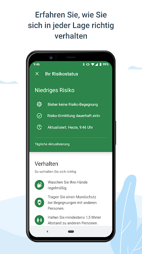
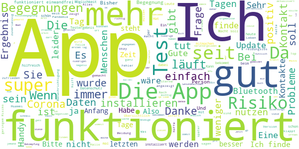
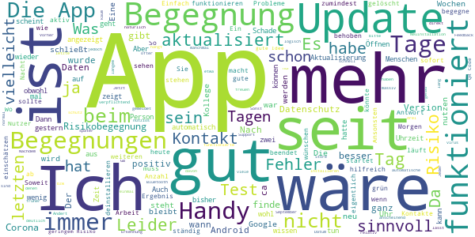
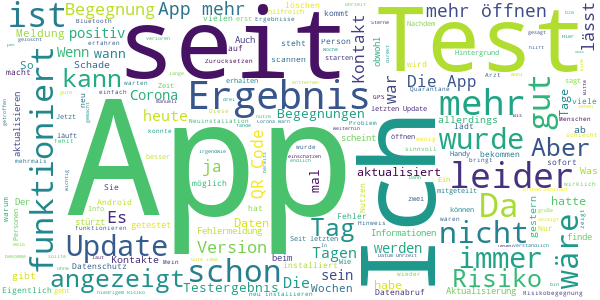
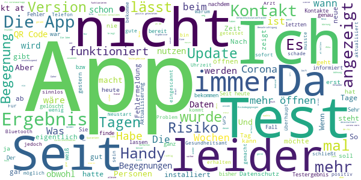
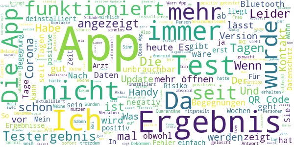

# Corona-Warn-App
App version ``1.6.0``

Analyzed with [covid-apps-observer](http://github.com/covid-apps-observer) project, version ``0.1``

## App overview
| | |
|-------------------------|-------------------------| 
| **Name**&nbsp;&nbsp;&nbsp;&nbsp;&nbsp;&nbsp;&nbsp;&nbsp;&nbsp;&nbsp;&nbsp;&nbsp;&nbsp;&nbsp;&nbsp;&nbsp;&nbsp;&nbsp;&nbsp;&nbsp;&nbsp;&nbsp;&nbsp;&nbsp;&nbsp;&nbsp;&nbsp;&nbsp;&nbsp;&nbsp;&nbsp;&nbsp;&nbsp;&nbsp;&nbsp;&nbsp;&nbsp;&nbsp;&nbsp;&nbsp;  | Corona-Warn-App |
| **Unique identifier** | de.rki.coronawarnapp |
| **Link to Google Play** | [https://play.google.com/store/apps/details?id=de.rki.coronawarnapp](https://play.google.com/store/apps/details?id=de.rki.coronawarnapp) |
| **Summary**  | Gemeinsam Corona bekämpfen |
| **Privacy policy** | [https://www.coronawarn.app/assets/documents/cwa-privacy-notice-de.pdf](https://www.coronawarn.app/assets/documents/cwa-privacy-notice-de.pdf) |
| **Latest version** | 1.6.0 |
| **Last update** | 2020-11-09 20:11:10 |
| **Recent changes** | Mit diesem Update stehen Ihnen Fehlerbehebungen und verbesserte Texte und Fehlermeldungen zur Verfügung. Beim Wechsel des Risikostatus von Rot auf Grün informiert Sie die App über den Grund dieser Änderung. Mit Statusmeldungen informiert Sie die App, wenn gerade Daten heruntergeladen werden oder die Risiko-Überprüfung läuft. |
| **Installs**  | 10.000.000+ |
| **Category** | Gesundheit & Fitness |
| **First release** | 12.06.2020 |
| **Size**  | 33M |
| **Supported Android version**  | 6.0 oder höher |

### Description
> Das Robert Koch-Institut (RKI) als zentrale Einrichtung des Bundes im Bereich der Öffentlichen Gesundheit und als nationales Public-Health-Institut veröffentlicht die Corona-Warn-App für die deutsche Bundesregierung und für die Bundesrepublik Deutschland. Die App fungiert als digitale Ergänzung zu Abstandhalten, Hygiene und Alltagsmaske. Wer sie nutzt, hilft, Infektionsketten schnell nachzuverfolgen und zu durchbrechen. Die App merkt sich dezentral unsere Begegnungen mit anderen und informiert uns digital, wenn wir Begegnungen mit nachweislich infizierten Personen hatten. Dabei sammelt sie jedoch zu keiner Zeit Informationen zur Identität ihrer Nutzerinnen und Nutzer. Wer wir sind und wo wir sind, bleibt geheim – und unsere Privatsphäre bestens geschützt.
 WIE DIE APP FUNKTIONIERT
 Sind wir unterwegs, sollte die Risiko-Ermittlung immer aktiviert sein. Denn sie ist das Herzstück der Software. Wann immer sich Nutzerinnen und Nutzer begegnen, tauschen ihre Smartphones über Bluetooth verschlüsselte Zufallscodes aus. 
 Diese geben nur Auskunft darüber, über welche Dauer und mit welchem Abstand eine Begegnung stattfand. Welche Person sich hinter einem Code verbirgt, ist für niemanden nachvollziehbar. Die Corona-Warn-App erhebt keine Informationen über den Ort der Begegnung oder den Standort der Nutzerinnen und Nutzer.
 Entsprechend der maximalen Corona-Inkubationszeit werden alle Zufallscodes, die unser Smartphone sammelt, für 14 Tage auf dem Smartphone gespeichert – und dann gelöscht. 
 Nur wenn eine Person sich über die App freiwillig als nachweislich infiziert meldet, erhalten daraufhin alle früheren Begegnungen eine Warnung auf ihr Smartphone. 
 Niemand erfährt, wann, wo oder mit wem eine entsprechende Risiko-Begegnung stattfand. Die infizierte Person bleibt anonym.
 Mit der Benachrichtigung erhalten die betroffenen Nutzer/-innen klare Handlungsempfehlungen. Wichtig: Auch die Daten der Benachrichtigten sind zu keiner Zeit einsehbar.
 WIE DIE DATEN SICHER BLEIBEN
 Die Corona-Warn-App soll uns zwar täglich begleiten. Sie wird uns jedoch nie kennenlernen. Dadurch kann sie niemandem verraten, wer wir sind. Der Datenschutz bleibt über die gesamte Nutzungsdauer zu 100 Prozent gewahrt.
 • Keine Anmeldung: Es müssen keine E-Mail-Adresse und kein Name hinterlegt werden.
 • Keine Rückschlüsse auf Identitäten: Bei einer Begegnung mit einem anderen Menschen tauschen die Smartphones nur Zufallscodes aus. Diese messen, über welche Dauer und mit welchem Abstand ein Kontakt stattfand. Sie lassen aber keine Rückschlüsse auf Personen und Standorte zu. 
 • Dezentrale Speicherung: Die Daten werden nur auf dem Smartphone gespeichert und nach 14 Tagen gelöscht.
 • Keine Einsicht für Dritte: Sowohl die Personen, die eine nachgewiesene Infektion melden, als auch die Benachrichtigten sind nicht nachverfolgbar – nicht für die Bundesregierung, nicht für das Robert Koch-Institut, nicht für andere User und auch nicht für die Betreiber der App-Stores.
 Diese App ist nicht zum Gebrauch außerhalb Deutschlands bestimmt. Die Corona-Warn-App ist die zentrale COVID-19 App für Deutschland und sie ist an das deutsche Gesundheitssystem angeschlossen. Trotzdem ist die Corona-Warn-App auch in diesem Land verfügbar. Sie ist gedacht für alle, die in Deutschland leben, arbeiten, Urlaub machen oder sich regelmäßig oder über längere Zeit in Deutschland aufhalten.
 Es gelten die Nutzungsbedingungen der Corona-Warn-App: https://www.coronawarn.app/assets/documents/cwa-eula-de.pdf. Durch die Installation und Nutzung dieser App stimmen Sie den Nutzungsbedingungen zu.

### User interface
The developers of the app provide the following screenshots in the Google play store.
| | | |
|:-------------------------:|:-------------------------:|:-------------------------:|
 |   |   |   | 
 |   |   |   | 
 |   |  

## Development team
In the following we report the main information provided by the development team in the Google play store.

| | |
|-------------------------|-------------------------|
| **Developer**  | Robert Koch-Institut |
| **Website**  | [https://www.coronawarn.app](https://www.coronawarn.app) |
| **Email** | CoronaWarnApp@rki.de |
| **Physical address**  | [Robert Koch-Institut Nordufer 20 13353 Berlin](https://www.google.com/maps/search/Robert%20Koch-Institut%20Nordufer%2020%2013353%20Berlin) (Google Maps) |
| **Other developed apps**  | [https://play.google.com/store/apps/developer?id=Robert+Koch-Institut](https://play.google.com/store/apps/developer?id=Robert+Koch-Institut) |

## Android support

| | |
|-------------------------|-------------------------|
| **Declared target Android version**  | Android10, version 10 (API level 29) |
| **Effective target Android version**  | Android10, version 10 (API level 29) |
| **Minimum supported Android version**  | Marshmallow, version 6.0 (API level 23) |
| **Maximum target Android version**  | - |

The larger the difference between the minimum and maximum supported Android versions, the better. A larger difference means a wider audience. For example, old phones have a very low Android version, so a high minimum supported Android version means that the app cannot be used by users with old phones, thus leading to accessibility problems. 

## Requested permissions

In the following we report the complete list of the permissions requested by the app. 

| **Permission** | **Protection level** | **Description** | 
|-------------------------|-------------------------|-------------------------|
 **android.permission ACCESS_NETWORK_STATE** | Normal | Allows applications to access information about networks. 
 **android.permission BLUETOOTH** | Normal | Allows applications to connect to paired bluetooth devices. 
 **android.permission CAMERA** | :warning:**Dangerous** | Required to be able to access the camera device. 
 **android.permission FOREGROUND_SERVICE** | Normal | Allows a regular application to use Service.startForeground. 
 **android.permission INTERNET** | Normal | Allows applications to open network sockets. 
 **android.permission RECEIVE_BOOT_COMPLETED** | Normal | Allows an application to receive the Intent.ACTION_BOOT_COMPLETED that is broadcast after the system finishes booting. 
 **android.permission REQUEST_IGNORE_BATTERY_OPTIMIZATIONS** | Normal | Permission an application must hold in order to use Settings.ACTION_REQUEST_IGNORE_BATTERY_OPTIMIZATIONS. 
 **android.permission WAKE_LOCK** | Normal | Allows using PowerManager WakeLocks to keep processor from sleeping or screen from dimming. 

## Mentioned servers

| **Server** | **Registrant** | **Registrant country** | **Creation date** | 
|-------------------------|-------------------------|-------------------------|-------------------------|
 | google.com | Google LLC | :us: US | 1997-09-15 04:00:00 |

## Security analysis 

Below we report the main security warnings raised by our execution of the [Androwarn](https://github.com/maaaaz/androwarn) security analysis tool.

**Connection interfaces exfiltration**
> - This application reads details about the currently active data network 
> - This application tries to find out if the currently active data network is metered 

**Telephony services abuse**
> - This application makes phone calls 

**Suspicious connection establishment**
> - This application opens a Socket and connects it to the remote address '; port is out of range' on the 'N/A' port  
> - This application opens a Socket and connects it to the remote address 'Lcom/android/tools/r8/GeneratedOutlineSupport;->outline18(Ljava/lang/String;)Ljava/lang/StringBuilder;' on the 'N/A' port  
> - This application opens a Socket and connects it to the remote address 'Ljava/net/Proxy;->type()Ljava/net/Proxy$Type;' on the 'N/A' port  
> - This application opens a Socket and connects it to the remote address 'Method sendUrgentData() is not supported.' on the 'N/A' port  
> - This application opens a Socket and connects it to the remote address 'Method setHandshakeTimeout() is not supported.' on the 'N/A' port  
> - This application opens a Socket and connects it to the remote address 'Method setOOBInline() is not supported.' on the 'N/A' port  
> - This application opens a Socket and connects it to the remote address 'Method setSoWriteTimeout() is not supported.' on the 'N/A' port  
> - This application opens a Socket and connects it to the remote address 'Socket closed' on the 'N/A' port  
> - This application opens a Socket and connects it to the remote address 'Socket is closed' on the 'N/A' port  
> - This application opens a Socket and connects it to the remote address 'Socket is closed.' on the 'N/A' port  
> - This application opens a Socket and connects it to the remote address 'Socket is not connected.' on the 'N/A' port  
> - This application opens a Socket and connects it to the remote address 'socket is closed' on the 'N/A' port  
> - This application opens a Socket and connects it to the remote address 'timeout' on the 'N/A' port  

**Code execution**
> - This application loads a native library 
> - This application loads a native library: 'conscrypt_gmscore_jni' 
> - This application loads a native library: 'conscrypt_jni' 

## User ratings and reviews

Below we provide information about how end users are reacting to the app in terms of ratings and reviews in the Google Play store.

### Ratings

The Corona-Warn-App app has been installed by more than **10000000** times. At this time, **92532** rated the app and its average score is **3.0145688**. Below we show the distribution of the ratings across the usual star-based rating of Google Play

:star::star::star::star::star:: 33402

:star::star::star::star:: 8563

:star::star::star:: 9533

:star::star:: 8049

:star:: 32985

### Reviews 

#### 5-star reviews

> Tut was sie soll ohne meine Daten für andere verwertbar zu speichern, sehr zufrieden daher. Denn wo ein Trog, da kommen Schweine  :date: __2020-11-16 10:57:55__

> Läuft und erfüllt ihren Zweck.  :date: __2020-11-16 10:48:34__

> Soweit ist die App gut. Allerdings werden andere verbundene Blootooth Geräte immer wieder getrennt. Ca. 1x pro Stunde Nach dem neusten Update lässt sich die App nicht mehr öffnen. Nach Ausführung aller empfohlenen Schritte zeigt sich keine Änderung.  :date: __2020-11-16 10:44:10__

> Die APP hilft uns ein etwas normaleres Leben führen zu können. Aber dazu sollte sie auf fast jedem Handy sein. Also bitte mitmachen, die Gemeinschaft braucht jeden.  :date: __2020-11-16 09:46:36__

> Auch wenn man selbst nicht getestet ist, ist sie nützlich. Da ich mich in der Nähe eines positiv Erfassten aufgehalten haben muss, habe ich jetzt ein erhöhtes Risiko...also Fazit.... installieren, reinschauen, handeln....  :date: __2020-11-16 08:42:27__

> Ein must-have der Saison!  :date: __2020-11-16 07:28:36__

> Find ich super. Barcode scannen und Ergebnis abwarten, hat bei meinen 2 Tests wunderbar geklappt. Nach jeweils 24 Std. hatte ich die Info über mein Ergebnis. Ich finde es schade dass die App nicht mehr Zustimmung in der Bevölkerung findet.  :date: __2020-11-16 03:25:30__

> Eine sher gute idee, nur leider benutzen noch nicht genügend Personen diese App oder tragen das Ergebniss nicht ein. Ich hoffe das mehr Leute sich dazu entscheiden die App zu holen um die ausbreitung ein zu dämmen.  :date: __2020-11-16 00:32:22__

> Ganz ehrlich die app läuft ohne Probleme und wenn wir wieder normal leben wollen sollten wir alle was dafür tun. Also sollte jeder der in der Lage ist sich auch die App herunterladen.  :date: __2020-11-15 23:46:34__

> Sehr geehrtes Robert Koch Institut,bei mir steht manchmal im grünen Bereich Kontakt kurze Zeit mit niedrigen Risiko eine 1.Nachsten Tag stehtda eine 0 Personen.Resettet die App sich selbstständig? Ansonsten gefällt mir die App.  :date: __2020-11-15 23:33:36__

#### 4-star reviews

> Ich habe diese App noch nicht lang, aber ich würde mir wünschen das diese App etwas öfter aktualisiert weil ich dann später um so ca. 10 Uhr woanders befinde und die Aktualisierung war um 7 Uhr. Die letzte also das würde ich mir wünschen. Das die App häufiger aktualisiert wird.  :date: __2020-11-16 10:35:43__

> Update: Es wäre sinnvoll, wenn man wenigstens wüsste, wann genau man einen positiv getesteten Menschen getroffen hat! Endlich nach langem Warten funktioniert die App und die Inhalte sind logisch und verständlich. Es war eine schwere Geburt unter Schmerzen und hat viele Nutzer verschreckt! Schade, denn die App könnte die Gesundheitsämter deutlich entlasten. Ich gebe jetzt 5*, vielleicht überlegt es sich ja der eine oder andere Mensch nochmal?  :date: __2020-11-16 08:35:45__

> Einen schönen guten Morgen. Seit 4 Tagen steht bei mir : 1 Begegnung mit geringem Risiko, was jedoch nicht sein kann. Hlchstens einmal, aber nicht viermal. Wenn ich niemanden begegne, kann es wohl kaum sein????  :date: __2020-11-16 08:30:24__

> Einfach zu installieren. Macht wofür sie ursprünglich entwickelt wurde - warnt bei mittleren und hohen Risiko Begegnungen. Datenschutz wackelt jedoch, wenn man auf Pilosophen und Andere hört und ein tracking nachträglich eingebaut wird.  :date: __2020-11-16 06:08:30__

> Leider startete die App heute zum erstenmal nicht mehr, sondern verschwand direkt nach dem Aufruf wieder vom Display. Handy neu starten brachte nichts. Nach Deinstallation und anschließender Neuinstallation geht es wieder, nur fängt die Risikobewertung jetzt natürlich neu an....  :date: __2020-11-15 23:14:43__

> Nachdem man sich einmal positiv gemeldet hat, kann man die App nicht mehr normal nutzen, obwohl die Gefahr einer Neuinfektion besteht. Ändert sich das im Laufe der Zeit noch oder bleibt die App nutzlos, es ist nun schon drei Wochen her, das ich mich in der App positiv gemeldet habe. Ich würde mich sehr über ein Feedback freuen. Freundliche Grüße an den Support.  :date: __2020-11-15 19:58:34__

> Der Akku verbrauch ist relativ hoch, da Bluetooth permanent eingeschaltet sein muss. Sonst aber sinnvoll und top.  :date: __2020-11-15 15:38:20__

> Leider schaltet sich die automatische Risiko Erkennung und Aktualisierung immer aus. Ich schalte es an, die App wieder aus.. ich glaube so macht das wenig Sinn. 😕 RedMi Note 7 Update 10.2020 Jetzt scheint es zu funktionieren. Kontrollieren kann man das ja leider nicht.  :date: __2020-11-15 15:06:05__

> Müßte mehr können  :date: __2020-11-15 13:10:53__

> Seit gestern schließt die App, wenn ich sie aufrufe, automatisch...Version 1.6 ist auf dem Handy vorhanden.  :date: __2020-11-15 12:55:15__

#### 3-star reviews

> Egänzung: bei aller Würdigung datenschutzrechtlicher Bedenken zeigt sich hier auch gleichzeitig die größte Schwäche der App. Während Millionen Leute keine Bedenken bei WhatsApp und Co haben, lähmt die Furcht vor Inakzeptanz einer mächtigeren App die Wirksamkeit. Warnmeldungen sind diffus und nicht immer hilfreich, dass RKI hat keinen epidemiologischen Nutzen durch Appdaten. Verbraucht wenig Leistung und arbeitet prima im Hintergrund. Preis Leistung sprengt jedoch meine urteilskraft  :date: __2020-11-16 10:38:38__

> Wie kann es denn sein, dass nicht angezeigt wird wo und wann genau ich eine Risiko Begegnung hatte...Nur mit dieser Information kann ich und nicht die app das Risiko RICHTIG einschätzen...  :date: __2020-11-16 10:14:59__

> Sinnvoll, aber nach letztem update konnte ich sie nur noch 1x öffnen. Da wurde mir die Kooperation mit anderen Ländern angezeigt. Jetzt wird sie immer sofort wieder beendet. Sie scheint aber im Hintergrund weiter zu laufen. Das kann ich aber nicht 100%ig bestätigen.  :date: __2020-11-16 09:59:41__

> Datenschutz geht leider vor Gesundheitsschutz. Von daher erfährt man bei Begegnungen mit geringem Risiko leider nicht, an welchem Tag und zu welcher Uhrzeit das war. Schade, man hätte deutlich mehr aus der App machen können.  :date: __2020-11-16 09:54:10__

> Funktioniert tadellos, Akkulaufzeit leidet kaum wahrnehmbar. Was soll ich mit dem Hinweis anfangen, dass ich eine Begegnung mit niedrigem Risiko hatte? Ohne die Informationen, wann und wo die Begegnung stattgefunden hat, ist dieser Hinweis sinnfrei.  :date: __2020-11-16 09:41:37__

> In der Hoffnung hier eine Antwort zu bekommen. Kann eine Corona positiv geteste Person (die seinen status in die App eingetragen hat) zu mehreren Begegnungen führen? - Zusammenhang: Mein Nachbar ist positiv, unser Bad und sein Balkon liegen direkt nebeneinander (Ich habe ihn seit er krank ist nicht gesehen). Ich habe 9 Begegnungen, wüsste aber von keiner anderen Person mit der ich lange genug zsm. war, dass die App mir sagt, dass ich ein "erhöhtes Risiko" hätte. *Edit: Die Kachel ist rot.  :date: __2020-11-16 09:39:24__

> Läuft zumindest. Aber mehr Informationen wären nett. Wann war der Kontakt, auch bei geringem Risiko.  :date: __2020-11-16 09:30:04__

> Die Idee der App ist gut und richtig. Sie muss nur am besten zügig besser werden. Gewisse Kreise in Deutschland werden hiermit nur weiter bestätigt. 1. Das einscannen der Positiv Ergebnisse muss beim ersten mal funktionieren. 2. Mehrmals am Tag aktualisieren 3. Uhrzeit des Kontakts 4. Wo ist eigentlich egal, bis gestern kann jeder zurück denken.  :date: __2020-11-16 09:27:24__

> Gute Idee. Aber die Eingabe von Testergebnissen ist ja voll kompliziert, warum gibt es nicht einfach einen positiv Button oder so :P  :date: __2020-11-16 09:22:21__

> Die App ist ausbaufähig. Z. Bsp. sagt mir die App das ich auf Grund einer kurzen Begegnung ein niedriges Risiko habe. Gut wäre dazu die Info über Datum und Uhrzeit damit ich ungefähr darüber nachdenken kann wo das war. So weiß ich nichts, ob das so wünschenswert ist? So ein Unsinn, wenn ich das schon lese, Datenschutzgründe. Wenn die App mir die Uhrzeiten der Begegnung zeigen würde wüsste ich wo ich wann war. Was soll dieses gesülze von Datenschutz wenn es Infos VON mir FÜR mich sind?  :date: __2020-11-16 09:19:41__

#### 2-star reviews

> Die App ist sicherlich noch nicht ausgereift. Im Verhältnis zu den Entwicklungskosten eher fragwürdig, ungefähr so wie der BER...  :date: __2020-11-16 10:38:28__

> \*\**Update am 16.11.: seit heute läuft die Warn-App (Version 1.6.0.) bei mir nicht mehr. Das Programm kann nicht gestartet werden, auf Bildschirm steht nur "diese App wird wiederholt beendet"... Ich drücke weiter die Daumen, dass das Problem bald behoben wird🤞  :date: __2020-11-16 09:56:55__

> Läuft stabil. Hoffe, es bringt was. Update 16.11.20: Informierte leider nicht zuverlässig über positiven Befund in Kontakten  :date: __2020-11-16 08:43:42__

> Für uns nicht zu gebrauchen! Ich habe zwei Codes eingescannt, da mein Kind und ich getestet wurden. Dies war noch möglich. Als ich erneut meinen Test, welcher als erstes eingescannt wurde, scannen wollte stand dort "dieser Code wurde bereits gespannt..." und ich konnte nicht noch einmal darauf zugreifen. Dementsprechend auch nicht schauen ob mein Testergebnis hinterlegt wurde. Daher für uns unbrauchbar!  :date: __2020-11-16 08:25:51__

> Hatte vergangenen Mittwoch eine Risikobegegnung, bei der die Handys über mehrere Stunden zusammen auf einem Tisch lagen. Die App zeigt mir nichts an (außer meiner anderen geringen Risikobegegnungen), was echt ungünstig ist, da ich durch meine Wohnsituation gerne einen Test machen möchte, aber das Gesundheitsamt sich nicht meldet und ich auch durch die fehlende Warnung nicht berechtigt bin, mich kostenfrei testen zu lassen.  :date: __2020-11-16 08:17:39__

> App am 19.10.20 installiert und Kontaktverfolgung aktiviert. Zum Start gibt's erstmal 3 Sterne. Nachtrag 2.11.: Deutschland im Lockdown! Trotz Inzidenz von 200 in meinem Kreis zeigt die App grün "geringes Risiko". Alles nur Panikmache?  :date: __2020-11-16 06:07:59__

> Testzenter Gießen ist organisatorisch nicht in der Lage mit der App zu arbeiten...App zieht trotz aller Aussagen Akku ohne Ende. Kenne keinen Menschen der diese App ausser mir installiert hat.  :date: __2020-11-16 05:34:38__

> Ich weiss nicht was ich von der app halten soll. ich bin sehr vorsichtig und ausschliesslich im homeoffice. jetzt sah ich dass ich angeblich 2 begegnungen mit einem positiv getesteten hatte. im protokoll sah ich beide angeblichen begegnungen. alle begegnungen der letzten wochen waren zwischen 1 uhr bis 6 uhr nachts. in dieser zeit war ich definitiv alleine in meiner wohnung. falls ein nachbar auf einer anderen etage erfasst wurde stellt sich die frage warum der nur nachts erfasst wurde.  :date: __2020-11-16 04:28:44__

> Wie kann es sein ,das man mir 5 kontakt Personen mit leicht Bedenklich angezeigt wird,obwohl ich die ganze Zeit zuhause bin und Keinen Besuch hatte ? 🤔 Da ich unter hoch Risiko von den Ärzten eingestuft wurde ! Rezepte werden Telefonisch bestellt und direkt zur Apotheke geschickt !  :date: __2020-11-16 02:12:32__

> Es ist traurig zu sehen das eine App die Nachverfolgbarkeit verbessern soll und man als möglicher Patient noch nicht mal mitgeteilt bekommt an welchem Tag man eine Begegnung gehabt hat. Mittwoch 2 angezeigt Samstag 9, da wüsste ich schon gern wann die Begegnungen waren. Ich kann mich ja angesteckt haben und das Virus dann verbreiten, auch wenn ich wenig Kontakte habe. Hoffentlich werden wenigstens die Daten richtig behandelt. Und der Witz hat Millionen gekostet.  :date: __2020-11-16 01:39:58__

#### 1-star reviews

> Die App lässt sich nicht mehr öffnen. Wird sofort mit einer Fehlermeldung wieder beendet. Neustart des Smartphones half nicht. Moto E4 Android 7. Nachtrag: Cache und Daten löschen half auch nicht. Nach einer kompletten Neuinstallation geht es wieder, aber die Risikoermittlung geht wieder von vorne los. Und das für über 50 Millionen Euro Investitionskosten.  :date: __2020-11-16 10:59:51__

> Nutzlos ,absolut sinnlos ,hilft nicht einmal dem Gesundheitsminister  :date: __2020-11-16 10:54:46__

> Das letzte Update (1.6.0?) funktiert nicht. Die App stürzt ab. Vorher lief sie. Gibt's ein Downgrade?  :date: __2020-11-16 10:54:45__

> Kein Stern. Lässt sich nicht mehr aufrufen. Unbrauchbar. Antwort: Was ist an meinen Worten unklar?  :date: __2020-11-16 10:43:30__

> Bei meinem Test steht: Wird aktualisiert, passiert aber seit Wochen nichts. Kann nicht mal den test entfernen. EDIT: Danke für die antwort. Habe in der App unter Einstellungen die Anwendung zurückgesetzt, nun sind all meine Begegnungen mit positiven leuten weg und mein Status ist wieder Unbekannt. Vielen dank für nichts... Wieso fügt man nicht eine Option ein den test manuell zu entfernen???  :date: __2020-11-16 10:39:48__

> 16.11.2020 - 30.07.2020 Version 1.6.0. Sehr fragwürdiges Ergebnis! Habe ein Tablet mit LTE/SIM Karte und habe auch dort die "Corona-Warn App" installiert. Dieses Tablett war immer im Büro bzw. Zuhause und auch niemand war in den letzten 3-4 Wochen im Büro. Trotzdem zeigt dies App auf dem Tablet "2 Begegnungen mit niedrigem Risiko" und auf dem Handy, dies habe ich immer dabei, "Bisher keine Risiko-Begegnungen"! Da dies "Beides" unmöglich sein kann, das Tablet war immer zuhause, ist dies nicht zu verstehen und die "Corona-Warn App" wird immer unglaubwürdiger!  :date: __2020-11-16 10:32:08__

> Haben auf das Testergebnis meiner Frau ganze 11 Tage gewartet. Zum Glück war der Test Negativ. In dieser Zeit hätte Sie wer weiß wie viele Menschen anstecken können. Meine Warn-App habe ich deswegen deinstalliert. Überlegt doch mal was einem so eine App nutzen soll wenn die Ergebnisse noch nicht einmal nach 1-2 Tagen vorliegen. Außerdem liegt es auch noch im Sinne des Betrachters ob ich überhaupt ein Positives Ergebnis in meiner App angebe.  :date: __2020-11-16 10:28:34__

> Die App funktioniert auch nach einer Neuinstallation nicht mehr. Das Testergebnis wird nicht mitgeteilt. Wie kann so etwas behoben werden?  :date: __2020-11-16 10:17:41__

> Nachdem auf meinem iPhone im vergangenen Monat schon die gesamte Risiko-Ermittlung gelöscht wurde, kann auf meinem Android-Smartphone der Risiko-Status seit mehreren Tagen auch nicht mehr aktualisiert werden. Ich soll auf Version 1.5 aktualisieren, wobei ich schon seit Tagen auf Version 1.6 gewechselt bin. Vielleicht ist es ja ein Google Schnittstellen-Problem, aber wenn man 68 Millionen Euro an Steuergeldern erhält, kann man schon eine funktionierende App erwarten...  :date: __2020-11-16 10:15:31__

> Die Fallzahlen werden mit der Anzahl und dem PCR-Ct-Wert der Tests sowie auch mit dieser App manipuliert. Die testbeteiligten Firmen/Labore sind sicher nicht an einem Rückgang interessiert. Drosten arbeitet weiter sein verletztes Ego auf. Ein Ermächtigungsgesetz ist verabschiedet. Zweifler an der Coronalehre sollen in die Psychiatrie. Die islamische Eroberung und Ersetzungsmigration läuft. Der Einheimische ohne Leibwächter meidet einfach den islamischen Kopfabschneider. Alles im grünen Bereich.  :date: __2020-11-16 09:54:48__

