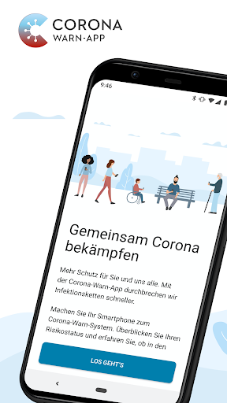
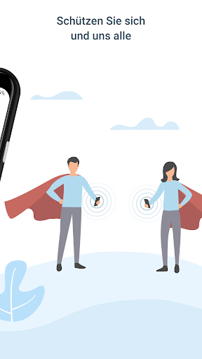
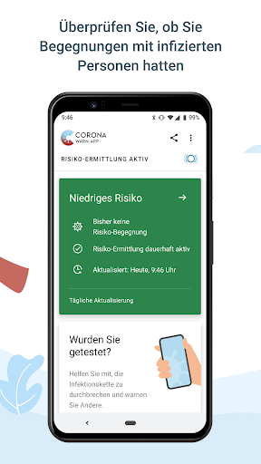
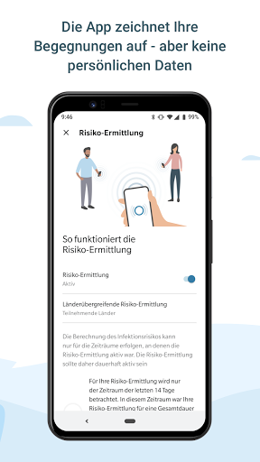
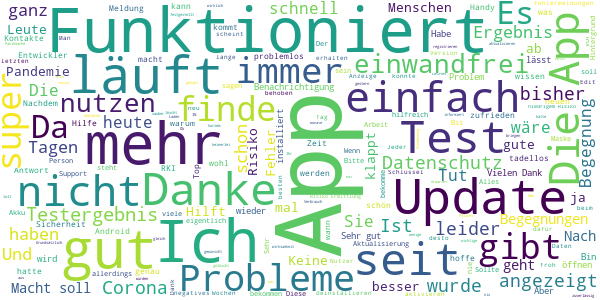
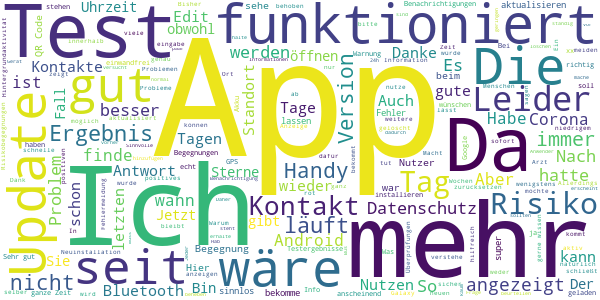
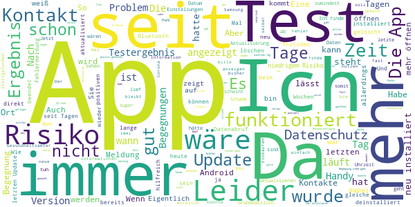
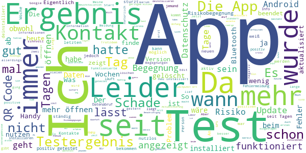
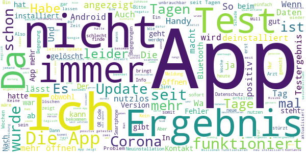

# Corona-Warn-App
App version ``1.6.1``

Analyzed with [covid-apps-observer](http://github.com/covid-apps-observer) project, version ``0.1``

## App overview
| | |
|-------------------------|-------------------------| 
| **Name**&nbsp;&nbsp;&nbsp;&nbsp;&nbsp;&nbsp;&nbsp;&nbsp;&nbsp;&nbsp;&nbsp;&nbsp;&nbsp;&nbsp;&nbsp;&nbsp;&nbsp;&nbsp;&nbsp;&nbsp;&nbsp;&nbsp;&nbsp;&nbsp;&nbsp;&nbsp;&nbsp;&nbsp;&nbsp;&nbsp;&nbsp;&nbsp;&nbsp;&nbsp;&nbsp;&nbsp;&nbsp;&nbsp;&nbsp;&nbsp;  | Corona-Warn-App |
| **Unique identifier** | de.rki.coronawarnapp |
| **Link to Google Play** | [https://play.google.com/store/apps/details?id=de.rki.coronawarnapp](https://play.google.com/store/apps/details?id=de.rki.coronawarnapp) |
| **Summary**  | Gemeinsam Corona bekämpfen |
| **Privacy policy** | [https://www.coronawarn.app/assets/documents/cwa-privacy-notice-de.pdf](https://www.coronawarn.app/assets/documents/cwa-privacy-notice-de.pdf) |
| **Latest version** | 1.6.1 |
| **Last update** | 2020-11-16 20:31:53 |
| **Recent changes** | Dieses Update behebt das mit Version 1.6.0 vereinzelt aufgetretene Problem, dass die App nach dem Start direkt wieder beendet wird. |
| **Installs**  | 10.000.000+ |
| **Category** | Gesundheit & Fitness |
| **First release** | 12.06.2020 |
| **Size**  | 33M |
| **Supported Android version**  | 6.0 oder höher |

### Description
> Das Robert Koch-Institut (RKI) als zentrale Einrichtung des Bundes im Bereich der Öffentlichen Gesundheit und als nationales Public-Health-Institut veröffentlicht die Corona-Warn-App für die deutsche Bundesregierung und für die Bundesrepublik Deutschland. Die App fungiert als digitale Ergänzung zu Abstandhalten, Hygiene und Alltagsmaske. Wer sie nutzt, hilft, Infektionsketten schnell nachzuverfolgen und zu durchbrechen. Die App merkt sich dezentral unsere Begegnungen mit anderen und informiert uns digital, wenn wir Begegnungen mit nachweislich infizierten Personen hatten. Dabei sammelt sie jedoch zu keiner Zeit Informationen zur Identität ihrer Nutzerinnen und Nutzer. Wer wir sind und wo wir sind, bleibt geheim – und unsere Privatsphäre bestens geschützt.
 WIE DIE APP FUNKTIONIERT
 Sind wir unterwegs, sollte die Risiko-Ermittlung immer aktiviert sein. Denn sie ist das Herzstück der Software. Wann immer sich Nutzerinnen und Nutzer begegnen, tauschen ihre Smartphones über Bluetooth verschlüsselte Zufallscodes aus. 
 Diese geben nur Auskunft darüber, über welche Dauer und mit welchem Abstand eine Begegnung stattfand. Welche Person sich hinter einem Code verbirgt, ist für niemanden nachvollziehbar. Die Corona-Warn-App erhebt keine Informationen über den Ort der Begegnung oder den Standort der Nutzerinnen und Nutzer.
 Entsprechend der maximalen Corona-Inkubationszeit werden alle Zufallscodes, die unser Smartphone sammelt, für 14 Tage auf dem Smartphone gespeichert – und dann gelöscht. 
 Nur wenn eine Person sich über die App freiwillig als nachweislich infiziert meldet, erhalten daraufhin alle früheren Begegnungen eine Warnung auf ihr Smartphone. 
 Niemand erfährt, wann, wo oder mit wem eine entsprechende Risiko-Begegnung stattfand. Die infizierte Person bleibt anonym.
 Mit der Benachrichtigung erhalten die betroffenen Nutzer/-innen klare Handlungsempfehlungen. Wichtig: Auch die Daten der Benachrichtigten sind zu keiner Zeit einsehbar.
 WIE DIE DATEN SICHER BLEIBEN
 Die Corona-Warn-App soll uns zwar täglich begleiten. Sie wird uns jedoch nie kennenlernen. Dadurch kann sie niemandem verraten, wer wir sind. Der Datenschutz bleibt über die gesamte Nutzungsdauer zu 100 Prozent gewahrt.
 • Keine Anmeldung: Es müssen keine E-Mail-Adresse und kein Name hinterlegt werden.
 • Keine Rückschlüsse auf Identitäten: Bei einer Begegnung mit einem anderen Menschen tauschen die Smartphones nur Zufallscodes aus. Diese messen, über welche Dauer und mit welchem Abstand ein Kontakt stattfand. Sie lassen aber keine Rückschlüsse auf Personen und Standorte zu. 
 • Dezentrale Speicherung: Die Daten werden nur auf dem Smartphone gespeichert und nach 14 Tagen gelöscht.
 • Keine Einsicht für Dritte: Sowohl die Personen, die eine nachgewiesene Infektion melden, als auch die Benachrichtigten sind nicht nachverfolgbar – nicht für die Bundesregierung, nicht für das Robert Koch-Institut, nicht für andere User und auch nicht für die Betreiber der App-Stores.
 Diese App ist nicht zum Gebrauch außerhalb Deutschlands bestimmt. Die Corona-Warn-App ist die zentrale COVID-19 App für Deutschland und sie ist an das deutsche Gesundheitssystem angeschlossen. Trotzdem ist die Corona-Warn-App auch in diesem Land verfügbar. Sie ist gedacht für alle, die in Deutschland leben, arbeiten, Urlaub machen oder sich regelmäßig oder über längere Zeit in Deutschland aufhalten.
 Es gelten die Nutzungsbedingungen der Corona-Warn-App: https://www.coronawarn.app/assets/documents/cwa-eula-de.pdf. Durch die Installation und Nutzung dieser App stimmen Sie den Nutzungsbedingungen zu.

### User interface
The developers of the app provide the following screenshots in the Google play store.
| | | |
|:-------------------------:|:-------------------------:|:-------------------------:|
 |   |   |   | 
 |   |   |   | 
 |   |  

## Development team
In the following we report the main information provided by the development team in the Google play store.

| | |
|-------------------------|-------------------------|
| **Developer**  | Robert Koch-Institut |
| **Website**  | [https://www.coronawarn.app](https://www.coronawarn.app) |
| **Email** | CoronaWarnApp@rki.de |
| **Physical address**  | [Robert Koch-Institut Nordufer 20 13353 Berlin](https://www.google.com/maps/search/Robert%20Koch-Institut%20Nordufer%2020%2013353%20Berlin) (Google Maps) |
| **Other developed apps**  | [https://play.google.com/store/apps/developer?id=Robert+Koch-Institut](https://play.google.com/store/apps/developer?id=Robert+Koch-Institut) |

## Android support

| | |
|-------------------------|-------------------------|
| **Declared target Android version**  | Android10, version 10 (API level 29) |
| **Effective target Android version**  | Android10, version 10 (API level 29) |
| **Minimum supported Android version**  | Marshmallow, version 6.0 (API level 23) |
| **Maximum target Android version**  | - |

The larger the difference between the minimum and maximum supported Android versions, the better. A larger difference means a wider audience. For example, old phones have a very low Android version, so a high minimum supported Android version means that the app cannot be used by users with old phones, thus leading to accessibility problems. 

## Requested permissions

In the following we report the complete list of the permissions requested by the app. 

| **Permission** | **Protection level** | **Description** | 
|-------------------------|-------------------------|-------------------------|
 **android.permission ACCESS_NETWORK_STATE** | Normal | Allows applications to access information about networks. 
 **android.permission BLUETOOTH** | Normal | Allows applications to connect to paired bluetooth devices. 
 **android.permission CAMERA** | :warning:**Dangerous** | Required to be able to access the camera device. 
 **android.permission FOREGROUND_SERVICE** | Normal | Allows a regular application to use Service.startForeground. 
 **android.permission INTERNET** | Normal | Allows applications to open network sockets. 
 **android.permission RECEIVE_BOOT_COMPLETED** | Normal | Allows an application to receive the Intent.ACTION_BOOT_COMPLETED that is broadcast after the system finishes booting. 
 **android.permission REQUEST_IGNORE_BATTERY_OPTIMIZATIONS** | Normal | Permission an application must hold in order to use Settings.ACTION_REQUEST_IGNORE_BATTERY_OPTIMIZATIONS. 
 **android.permission WAKE_LOCK** | Normal | Allows using PowerManager WakeLocks to keep processor from sleeping or screen from dimming. 

## Mentioned servers

| **Server** | **Registrant** | **Registrant country** | **Creation date** | 
|-------------------------|-------------------------|-------------------------|-------------------------|
 | google.com | Google LLC | :us: US | 1997-09-15 04:00:00 |

## Security analysis 

Below we report the main security warnings raised by our execution of the [Androwarn](https://github.com/maaaaz/androwarn) security analysis tool.

**Connection interfaces exfiltration**
> - This application reads details about the currently active data network 
> - This application tries to find out if the currently active data network is metered 

**Telephony services abuse**
> - This application makes phone calls 

**Suspicious connection establishment**
> - This application opens a Socket and connects it to the remote address '; port is out of range' on the 'N/A' port  
> - This application opens a Socket and connects it to the remote address 'Lcom/android/tools/r8/GeneratedOutlineSupport;->outline18(Ljava/lang/String;)Ljava/lang/StringBuilder;' on the 'N/A' port  
> - This application opens a Socket and connects it to the remote address 'Ljava/net/Proxy;->type()Ljava/net/Proxy$Type;' on the 'N/A' port  
> - This application opens a Socket and connects it to the remote address 'Method sendUrgentData() is not supported.' on the 'N/A' port  
> - This application opens a Socket and connects it to the remote address 'Method setHandshakeTimeout() is not supported.' on the 'N/A' port  
> - This application opens a Socket and connects it to the remote address 'Method setOOBInline() is not supported.' on the 'N/A' port  
> - This application opens a Socket and connects it to the remote address 'Method setSoWriteTimeout() is not supported.' on the 'N/A' port  
> - This application opens a Socket and connects it to the remote address 'Socket closed' on the 'N/A' port  
> - This application opens a Socket and connects it to the remote address 'Socket is closed' on the 'N/A' port  
> - This application opens a Socket and connects it to the remote address 'Socket is closed.' on the 'N/A' port  
> - This application opens a Socket and connects it to the remote address 'Socket is not connected.' on the 'N/A' port  
> - This application opens a Socket and connects it to the remote address 'socket is closed' on the 'N/A' port  
> - This application opens a Socket and connects it to the remote address 'timeout' on the 'N/A' port  

**Code execution**
> - This application loads a native library 
> - This application loads a native library: 'conscrypt_gmscore_jni' 
> - This application loads a native library: 'conscrypt_jni' 

## User ratings and reviews

Below we provide information about how end users are reacting to the app in terms of ratings and reviews in the Google Play store.

### Ratings

The Corona-Warn-App app has been installed by more than **10000000** times. At this time, **94114** rated the app and its average score is **2.9416187**. Below we show the distribution of the ratings across the usual star-based rating of Google Play

:star::star::star::star::star:: 31965

:star::star::star::star:: 8482

:star::star::star:: 10301

:star::star:: 8826

:star:: 34540

### Reviews 

#### 5-star reviews

> Seit heute kein Update mehr. Letztes Update gestern 7 Uhr. Keine Fehlermeldung oder ähnliches 🤷‍♂️  :date: __2020-11-23 10:49:34__

> Macht was sie soll, einfach zu bedienen. Datenschutz und Freiwilligkeit sind sauber umgesetzt.  :date: __2020-11-23 10:30:15__

> Es läuft alles gut habe ein Nidriges Risiko  :date: __2020-11-23 10:19:49__

> Ich finds super!  :date: __2020-11-23 10:16:08__

> Hat immer gut funktioniert nie Probleme gehabt, sollte Pflicht werden  :date: __2020-11-23 10:03:22__

> Funktioniert bei mir Top  :date: __2020-11-23 09:46:15__

> Ich finde es gut aber nicht genau soll noch einbischen verbessert werden  :date: __2020-11-23 07:54:33__

> App ist sehr gut bedienbar. Keine Mängel festzustellen. 👍  :date: __2020-11-23 06:25:45__

> Läuft auf meinem Huawei P20 lite mit Android 9 einwandfrei! Eine wichtige App, die hoffentlich viele nutzen.  :date: __2020-11-23 06:23:20__

> Danke für diese App und ihren Beitrag zur Eindämmung der Pandemie. Ich bin zwar immer noch sauer, dass bis in den April hinein das effektivste mittel gegen die Pandemie (MASKEN TRAGEN IN ENGEN SITUATIONEN) seitens RKI runter diskutiert wurde, aber die App ist super. Solch eine Agilität und neue digitale Flexibilität des RKI, wäre auch VOR der Pandemie sehr toll gewesen. Vielleicht bekommen wir ja zukünftige Grippewellen nun auch besser in den Griff.  :date: __2020-11-22 23:14:16__

#### 4-star reviews

> Der alte Test ist nicht mehr entfernbar, es lädt die ganze Zeit. So ist die App natürlich sinnlos. Nach Antwort der Entwickler setze ich die App zurück da mir versichert wurde mein Infektionsrisiko wäre 24h wieder korrekt. Leider ist dies nicht Fall!  :date: __2020-11-23 09:39:32__

> Sehr gut leider bekomme ich sie nicht mehr.  :date: __2020-11-23 09:36:19__

> Ich habe mich vor vier Wochen testen lassen und den Test danach nicht gelöscht. Jetzt versucht die App das Ergebnis zu aktualisieren und hängt. Ich kann dadurch weder einen neuen Test hinzufügen, noch das Ergebnis löschen. Den Fehler bitte beheben. Ansonsten bin ich sehr zufrieden.  :date: __2020-11-23 07:55:44__

> Finde die App ansich gut, problem ist: Immer wenn ich Musik höre (Über meine Bluetooth Kopfhörer) ist das Signal so schlecht, obwohl ich das Handy direkt an meine Ohren halte. Am meisten ist das in Bus und Bahn, da wo viele Menschen sind. Bevor ich die App hatte, war das nicht so.  :date: __2020-11-23 07:23:38__

> Super App  :date: __2020-11-23 06:10:17__

> Unter Android 7 1 1 stürzt die App ständig ab. Auch nach Neuinstallation. Gerät Gome  :date: __2020-11-23 06:04:06__

> Danke für die App. Mir fehlen allerdings wichtige Informationen. Die Benachrichtigung über Kontakte zu "später positiven" sollte wenigstens um die Information der Uhrzeit erweitert werden. So könnte man seine Lage selber noch besser beurteilen. Dieser App würde weniger Datenschutz gut tun! Entwickeln Sie bitte eine weitere Version, die dem Anwender erlaubt auf den Datenschutz partiell oder sogar komplett zu verzichten! 1000 Dank! Beste Grüße und bleibt gesund! Andreas  :date: __2020-11-23 04:31:21__

> Die App leistet einen tollen Beitrag zur schnelleren Nachverfolgung. Leider erhalte ich keine Benachrichtigungen von der App, obwohl alle Berechtigungen erteilt sind. Daher muss ich jeden Tag die App öffnen, was etwas mühsam ist. Aber kaum relevant im Vergleich zum Nutzen. Wäre nur besser, wenn es klappen würde.  :date: __2020-11-22 23:46:02__

> Finde die App super! Jeder sollte sie zur Eindämmung von Corona Installieren. Sie funktioniert auch einwandfrei. Verbraucht auch nicht mehr Akku. Eine Frage: ist es normal das der Standort seit neusten immer an sein muss??  :date: __2020-11-22 22:34:18__

> Läuft! Aber sehr hoher Akkuverbrauch! Ich mache Bluetooth & GPS nur an wenn ich im ÖVP oder in Läden bin. Das GPS wird das meiste an Strom benötigen.  :date: __2020-11-22 21:26:37__

#### 3-star reviews

> nach 2.installation.22.11.20 zeigt app nur grau an.a50 ffo.  :date: __2020-11-23 08:27:06__

> Seid gestern Morgen steht die App auf Rot (letzter Kontakt vor 5Tagen) und ich verhalte mich natürlich entsprechend. Heute Morgen dann die Nachricht, das es eine Aktualisierung meines Risikos gibt und dieses wieder niedrig ist, da die letzte Begegnung 14 Tage her ist. Die App ist immer noch Rot. Und ich bin verwirrt, welche Infos nun die richtigen sind.  :date: __2020-11-23 08:06:21__

> Die App ist gut aber seit 2 Tagen immer Fehlermeldung und keine Aktualität. Der Part mit Testergebnis ist seit 5 Tagen in dauerschleife zum aktualisieren  :date: __2020-11-23 07:50:45__

> Meine App wird immer wieder automatisch beendet. Kein Öffnen möglich.  :date: __2020-11-23 07:26:02__

> An sich eine gute App aber ich hätte wenn ich Kontakt hatte gerne mehr Informationen ohne halt den Datenschutz zu missachten zum Beispiel wie lange hatte ich wirklich Kontakt wie nah war er ich lasse mich davon nicht verrückt machen wenn steht geringes risko da ich weiß das ich unterwegs immer meine Maske trage aber ein paar mehr Informationen wären meiner Meinung nach schön  :date: __2020-11-23 07:21:34__

> Eine ganze Weile lief die app problemlos, aber seit Tagen lässt sie sich nicht mehr öffnen auf meinem sony xperia mit android 7.1.1  :date: __2020-11-22 23:36:01__

> Ich fände es auch sehr viel besser, wenn die Aktualisierungen mehrmals täglich erfolgen würden. Auch fände ich gut, etwas genauer zu erfahren, wann die Risikokontakte stattgefunden haben.  :date: __2020-11-22 23:20:59__

> Hab schon seit mehreren Tagen mein Ergebnis vom Test, aber in der App wird immer noch angezeigt, dass mein Ergebnis noch nicht da ist  :date: __2020-11-22 22:22:46__

> Hallo ich wollt eigentlich melden aber ich kann ned sagen Abstand und so bei johanniskirche wo bei schule und studieren bei s-bahn tragen fast keine Masken und kein Abstand kannst du nachschauen es geht immer um 16³⁰ Treffpunkt...  :date: __2020-11-22 20:21:08__

> Mehrer mal ein Hinweis auf Kontakte, aber jedes Mal mit geringen Risiko, man muss sich keine Sorgen machen und nichts tun. Dann kann dieser Hinweis auch entfallen  :date: __2020-11-22 20:09:46__

#### 2-star reviews

> App beendet sich weiterhin nach Start. Bugfix hat keine Funktion. Aktuelle Version ist installiert. Feedback über das Formular wurde übermittelt.  :date: __2020-11-23 10:56:21__

> Test eingetragen. Auch nach 2 Wochen immer noch keine Benachrichtigung, obwohl wir schon lange das Ergebnis vom testzentrum haben.  :date: __2020-11-23 10:42:23__

> I'm Moment stört ständig die Info das google play Dienste aktualisiert werden soll und obwohl beide Apps aktualisiert sind, taucht trotzdem die Meldung auf. Das stört mich.  :date: __2020-11-23 10:10:19__

> Die App war gut, solange sie funktionierte. Seit gestern stürzt sie dauerhaft beim Start ab. LG X Power 3, Android 8.0.0 .  :date: __2020-11-23 09:25:38__

> Leider musste ich nun bereits zum dritten Mal die App deinstallieren und wieder installieren, diesmal weil sie tagelang sich nicht mehr öffnen lies. Vorher z.b. weil sie das Bluetooth meines Auto Telefons blockierte. Nein (zur Antwort), ich habe Android 7.0!  :date: __2020-11-23 08:43:12__

> Gut gemeint, aber nicht gut umgesetzt. Durch Zufall habe in der App gesehen das ich mit einer später positiv getesteten Person Kontakt hatte....!!! Nur hat sich die App nicht von alleine gemeldet......das sollte Sie doch ....oder?  :date: __2020-11-23 08:18:09__

> Ich halte die App im Grunde für sinnvoll und habe im Umfeld ihren Nutzen durch Warnhinweise auch schon erfahren, allerdings erfolgt das Abrufen der Testergebnisse stark verzögert. Ich habe beim letzten Test sowohl den QR Code für die App als auch einen Link zum Abruf erhalten. Während in der App auch nach der Aktualisierung angegeben wird "Ergebnis liegt noch nicht vor", ist mein (negatives) Ergebnis seit über 24h online abrufbar. Das sollte besser klappen! App ist auf dem aktuellsten Stand.  :date: __2020-11-23 08:15:08__

> An sich gut. Ich habe schon mehrere Risikobegegnungen mit geringem Risiko angezeigt bekommen. Allerdings habe ich das Problem, dass der QR-Code vom September noch immer versucht die Daten abzurufen. Der Test war negativ, aber ich kann nun keinen neuen Code scannen, da ich den alten nicht entfernen kann. Bei einer Inkompatibilität mit dem Labor sollte das Entfernen jedoch möglich sein.  :date: __2020-11-23 06:59:59__

> Die App zeigt am Abend dass ich Kontakt mit niedrigem Risiko hatte. Aber leider nicht wann, somit kann ich es nicht nachvollziehen. Am nächsten Morgen ist das niedrige Risiko wieder weg. Am Abend wieder da???? Ist das der gleiche Kontakt. Leider kann man es nicht verfolgen. Frage mich dann wo der Sinn der App besteht, wenn ich es nicht ungefähr einschätzen kann.  :date: __2020-11-23 05:56:23__

> App am 19.10.20 installiert und Kontaktverfolgung aktiviert. Zum Start gibt's erstmal 3 Sterne. Nachtrag 2.11.: Deutschland im Lockdown! Trotz Inzidenz von 200 in meinem Kreis zeigt die App grün "geringes Risiko". Alles nur Panikmache?  :date: __2020-11-23 05:31:08__

#### 1-star reviews

> Es gibt keine Übersterblichkeit. Vermeldete Fallzahlen werden mit Anzahl und Ct-Wert der PCR-Tests und auch dieser App gesteuert. Corona ist Goldesel für beteiligte Firmen/Labore. Drosten arbeitet verletztes Ego auf. Machtergreifungsgesetz ist verabschiedet. Zweifler an der Coronalehre sind Nazis/Rechte, ab in die Psychiatrie. Schäuble will Räte-Republik, totale TransferEUnion, H2o-Werfer gegen Demonstranten. Danke Merkel & Co. für Drecks-Islam, Terror, Clans, Eroberungs- u. Ersetzungsmigration.  :date: __2020-11-23 11:01:13__

> Kein Stern. Lässt sich nicht mehr aufrufen. Unbrauchbar. Antwort: Was ist an meinen Worten unklar? Antwort 2: Die App ließ sich nach dem Update nicht mehr öffnen. Kurzes Zeigen des Icons und dann weg. Neuinstallation funktioniert, aber die gesammelten Daten sind weg. Vielleicht sollte nicht nur der Praktikant programmieren. Neuer Versuch: "Die App wurde beendet." Ich werde sie jetzt deinstallieren. Erneuter Versuch: Stürzt immer noch ab. UNBRAUCHBAR! 1.6.1 verhält sich genau so. Kein Fortschritt  :date: __2020-11-23 10:59:01__

> Die App ist zu 90% überflüssig. "Sie haben erhöhtes Risiko?" Das wusste ich auch schon vorher. Die Millionen Dafür hätte man lieber in Medizinische Ausrüstung oder das Pflegepersonal investieren sollen. App wurde sofort wieder Deinstalliert.  :date: __2020-11-23 10:48:42__

> Absoluter Müll. Man soll das Ergebnis einer Testung in dieser App angezeigt bekommen doch nix ist. Erst nach Telefonieren und schauen auf der Internetseite bekommt man ein Ergebniss . In der App steht noch immer kein Ergebnis. Mann sollte diese mal überarbeiten.  :date: __2020-11-23 10:34:21__

> Datenabruf in Endlosschleife kann keinen Test mehr scannen. Bitte beheben  :date: __2020-11-23 10:33:49__

> Knapp 70 Millonen Kosten für die App. Wert gleich 0. Beim Artzt lag Ergebnis nach zwei Tagen vor... die App zeigt nach 4 Tagen noch immer kein Ergebnis an. Absolut sinnlos.  :date: __2020-11-23 10:22:58__

> 48 Stunden nach Testergebnis wird immer noch angezeigt "Ergebnis liegt noch nicht vor"! Datenerfassung, QR-Code usw erscheint alles als o.k., also keinerlei Hinweis auf irgendwelche Probleme. Das ist nicht akzeptabel und da hilft auch nicht der Hinweis: App zurücksetzen. Wenn alles o.k. angezeigt wird, woher soll der Nutzer wisse dass er wie auch immer eingreifen muß? Und wenn die Ergebnisübermittlung nicht funktioniert, wird auch die Kontakterfassung fragwürdig. App wird gelöscht.  :date: __2020-11-23 10:20:16__

> Bei mir sprang die App an einen einzigen Tag auf acht Begegnungen, laut Erklärung habe es dich immer um eine Person gehandelt. Nachdem der Kontakt zu der Person eingestellt wurde, zählte die App zunächst täglich rückwärts. Dann plötzlich wurden wieder zwei Kontakte hinzu gefügt, obwohl nachweislich in diesem Zeitraum kein Kontakt zustande gekommen ist. Wenig vertrauenswürdig! Ein Schelm wer böses dabei denkt.  :date: __2020-11-23 10:18:34__

> Was nützt eine APP, die mir nicht mitteilt, wo und wann eine Risikobegegnung stattgefunden hat! Fast jeder teilt, z. B. bei Google den Ort. Bei dieser Manie beim Datenschutz ist diese APP völlig nutzlos!  :date: __2020-11-23 09:43:53__

> Die App lässt sich nicht aktivieren weil ich noch nicht erkrankt bin und somit auch entsprechende Test Scanns glücklicherweise NICHT habe . Die Co App sollte doch rein theoretisch Gesunde warnen, oder ? Ja Supi ! Nun haben vermutlich meine Nachbarn die Corona Warn App unwissentlich installiert. Nur ich nicht ! Mein Gerät, mit dem ich hier schreibe, Samsung J 7 , funktionierte bis zum Sept. update. Neu Installation zeigt mir dank moderner Medien Technik alle möglichen Geräte aus der Nachbarschaft an ! Nur mein Gerät NICHT !  :date: __2020-11-23 09:40:53__

