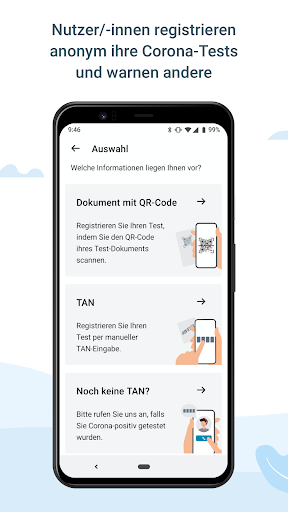

# Corona-Warn-App
App version ``1.7.1``

Analyzed with [covid-apps-observer](http://github.com/covid-apps-observer) project, version ``0.1``

## App overview
| | |
|-------------------------|-------------------------| 
| **Name**&nbsp;&nbsp;&nbsp;&nbsp;&nbsp;&nbsp;&nbsp;&nbsp;&nbsp;&nbsp;&nbsp;&nbsp;&nbsp;&nbsp;&nbsp;&nbsp;&nbsp;&nbsp;&nbsp;&nbsp;&nbsp;&nbsp;&nbsp;&nbsp;&nbsp;&nbsp;&nbsp;&nbsp;&nbsp;&nbsp;&nbsp;&nbsp;&nbsp;&nbsp;&nbsp;&nbsp;&nbsp;&nbsp;&nbsp;&nbsp;  | Corona-Warn-App |
| **Unique identifier** | de.rki.coronawarnapp |
| **Link to Google Play** | [https://play.google.com/store/apps/details?id=de.rki.coronawarnapp](https://play.google.com/store/apps/details?id=de.rki.coronawarnapp) |
| **Summary**  | Gemeinsam Corona bekämpfen |
| **Privacy policy** | [https://www.coronawarn.app/assets/documents/cwa-privacy-notice-de.pdf](https://www.coronawarn.app/assets/documents/cwa-privacy-notice-de.pdf) |
| **Latest version** | 1.7.1 |
| **Last update** | 2020-11-26 18:56:16 |
| **Recent changes** | Dieses Update behebt die Ursache für die nach dem Update auf 1.7.0 vereinzelt auftretenden Abstürze der App. |
| **Installs**  | 10.000.000+ |
| **Category** | Gesundheit & Fitness |
| **First release** | 12.06.2020 |
| **Size**  | 22M |
| **Supported Android version**  | 6.0 oder höher |

### Description
> Das Robert Koch-Institut (RKI) als zentrale Einrichtung des Bundes im Bereich der Öffentlichen Gesundheit und als nationales Public-Health-Institut veröffentlicht die Corona-Warn-App für die deutsche Bundesregierung und für die Bundesrepublik Deutschland. Die App fungiert als digitale Ergänzung zu Abstandhalten, Hygiene und Alltagsmaske. Wer sie nutzt, hilft, Infektionsketten schnell nachzuverfolgen und zu durchbrechen. Die App merkt sich dezentral unsere Begegnungen mit anderen und informiert uns digital, wenn wir Begegnungen mit nachweislich infizierten Personen hatten. Dabei sammelt sie jedoch zu keiner Zeit Informationen zur Identität ihrer Nutzerinnen und Nutzer. Wer wir sind und wo wir sind, bleibt geheim – und unsere Privatsphäre bestens geschützt.
 WIE DIE APP FUNKTIONIERT
 Sind wir unterwegs, sollte die Risiko-Ermittlung immer aktiviert sein. Denn sie ist das Herzstück der Software. Wann immer sich Nutzerinnen und Nutzer begegnen, tauschen ihre Smartphones über Bluetooth verschlüsselte Zufallscodes aus. 
 Diese geben nur Auskunft darüber, über welche Dauer und mit welchem Abstand eine Begegnung stattfand. Welche Person sich hinter einem Code verbirgt, ist für niemanden nachvollziehbar. Die Corona-Warn-App erhebt keine Informationen über den Ort der Begegnung oder den Standort der Nutzerinnen und Nutzer.
 Entsprechend der maximalen Corona-Inkubationszeit werden alle Zufallscodes, die unser Smartphone sammelt, für 14 Tage auf dem Smartphone gespeichert – und dann gelöscht. 
 Nur wenn eine Person sich über die App freiwillig als nachweislich infiziert meldet, erhalten daraufhin alle früheren Begegnungen eine Warnung auf ihr Smartphone. 
 Niemand erfährt, wann, wo oder mit wem eine entsprechende Risiko-Begegnung stattfand. Die infizierte Person bleibt anonym.
 Mit der Benachrichtigung erhalten die betroffenen Nutzer/-innen klare Handlungsempfehlungen. Wichtig: Auch die Daten der Benachrichtigten sind zu keiner Zeit einsehbar.
 WIE DIE DATEN SICHER BLEIBEN
 Die Corona-Warn-App soll uns zwar täglich begleiten. Sie wird uns jedoch nie kennenlernen. Dadurch kann sie niemandem verraten, wer wir sind. Der Datenschutz bleibt über die gesamte Nutzungsdauer zu 100 Prozent gewahrt.
 • Keine Anmeldung: Es müssen keine E-Mail-Adresse und kein Name hinterlegt werden.
 • Keine Rückschlüsse auf Identitäten: Bei einer Begegnung mit einem anderen Menschen tauschen die Smartphones nur Zufallscodes aus. Diese messen, über welche Dauer und mit welchem Abstand ein Kontakt stattfand. Sie lassen aber keine Rückschlüsse auf Personen und Standorte zu. 
 • Dezentrale Speicherung: Die Daten werden nur auf dem Smartphone gespeichert und nach 14 Tagen gelöscht.
 • Keine Einsicht für Dritte: Sowohl die Personen, die eine nachgewiesene Infektion melden, als auch die Benachrichtigten sind nicht nachverfolgbar – nicht für die Bundesregierung, nicht für das Robert Koch-Institut, nicht für andere User und auch nicht für die Betreiber der App-Stores.
 Diese App ist nicht zum Gebrauch außerhalb Deutschlands bestimmt. Die Corona-Warn-App ist die zentrale COVID-19 App für Deutschland und sie ist an das deutsche Gesundheitssystem angeschlossen. Trotzdem ist die Corona-Warn-App auch in diesem Land verfügbar. Sie ist gedacht für alle, die in Deutschland leben, arbeiten, Urlaub machen oder sich regelmäßig oder über längere Zeit in Deutschland aufhalten.
 Es gelten die Nutzungsbedingungen der Corona-Warn-App: https://www.coronawarn.app/assets/documents/cwa-eula-de.pdf. Durch die Installation und Nutzung dieser App stimmen Sie den Nutzungsbedingungen zu.

### User interface
The developers of the app provide the following screenshots in the Google play store.
| | | |
|:-------------------------:|:-------------------------:|:-------------------------:|
 |   |   |   | 
 |   |   |   | 
 |   |  

## Development team
In the following we report the main information provided by the development team in the Google play store.

| | |
|-------------------------|-------------------------|
| **Developer**  | Robert Koch-Institut |
| **Website**  | [https://www.coronawarn.app](https://www.coronawarn.app) |
| **Email** | CoronaWarnApp@rki.de |
| **Physical address**  | [Robert Koch-Institut Nordufer 20 13353 Berlin](https://www.google.com/maps/search/Robert%20Koch-Institut%20Nordufer%2020%2013353%20Berlin) (Google Maps) |
| **Other developed apps**  | [https://play.google.com/store/apps/developer?id=Robert+Koch-Institut](https://play.google.com/store/apps/developer?id=Robert+Koch-Institut) |

## Android support

| | |
|-------------------------|-------------------------|
| **Declared target Android version**  | Android10, version 10 (API level 29) |
| **Effective target Android version**  | Android10, version 10 (API level 29) |
| **Minimum supported Android version**  | Marshmallow, version 6.0 (API level 23) |
| **Maximum target Android version**  | - |

The larger the difference between the minimum and maximum supported Android versions, the better. A larger difference means a wider audience. For example, old phones have a very low Android version, so a high minimum supported Android version means that the app cannot be used by users with old phones, thus leading to accessibility problems. 

## Requested permissions

In the following we report the complete list of the permissions requested by the app. 

| **Permission** | **Protection level** | **Description** | 
|-------------------------|-------------------------|-------------------------|
 **android.permission ACCESS_NETWORK_STATE** | Normal | Allows applications to access information about networks. 
 **android.permission BLUETOOTH** | Normal | Allows applications to connect to paired bluetooth devices. 
 **android.permission CAMERA** | :warning:**Dangerous** | Required to be able to access the camera device. 
 **android.permission FOREGROUND_SERVICE** | Normal | Allows a regular application to use Service.startForeground. 
 **android.permission INTERNET** | Normal | Allows applications to open network sockets. 
 **android.permission RECEIVE_BOOT_COMPLETED** | Normal | Allows an application to receive the Intent.ACTION_BOOT_COMPLETED that is broadcast after the system finishes booting. 
 **android.permission REQUEST_IGNORE_BATTERY_OPTIMIZATIONS** | Normal | Permission an application must hold in order to use Settings.ACTION_REQUEST_IGNORE_BATTERY_OPTIMIZATIONS. 
 **android.permission WAKE_LOCK** | Normal | Allows using PowerManager WakeLocks to keep processor from sleeping or screen from dimming. 

## Mentioned servers

| **Server** | **Registrant** | **Registrant country** | **Creation date** | 
|-------------------------|-------------------------|-------------------------|-------------------------|
 | google.com | Google LLC | :us: US | 1997-09-15 04:00:00 |

## Security analysis 

Below we report the main security warnings raised by our execution of the [Androwarn](https://github.com/maaaaz/androwarn) security analysis tool.

**Connection interfaces exfiltration**
> - This application reads details about the currently active data network 
> - This application tries to find out if the currently active data network is metered 

**Telephony services abuse**
> - This application makes phone calls 

**Suspicious connection establishment**
> - This application opens a Socket and connects it to the remote address '; port is out of range' on the 'N/A' port  
> - This application opens a Socket and connects it to the remote address 'Lcom/android/tools/r8/GeneratedOutlineSupport;->outline21(Ljava/lang/String;)Ljava/lang/StringBuilder;' on the 'N/A' port  
> - This application opens a Socket and connects it to the remote address 'Ljava/net/Proxy;->type()Ljava/net/Proxy$Type;' on the 'N/A' port  
> - This application opens a Socket and connects it to the remote address 'Method sendUrgentData() is not supported.' on the 'N/A' port  
> - This application opens a Socket and connects it to the remote address 'Method setHandshakeTimeout() is not supported.' on the 'N/A' port  
> - This application opens a Socket and connects it to the remote address 'Method setOOBInline() is not supported.' on the 'N/A' port  
> - This application opens a Socket and connects it to the remote address 'Method setSoWriteTimeout() is not supported.' on the 'N/A' port  
> - This application opens a Socket and connects it to the remote address 'Socket closed' on the 'N/A' port  
> - This application opens a Socket and connects it to the remote address 'Socket is closed' on the 'N/A' port  
> - This application opens a Socket and connects it to the remote address 'Socket is closed.' on the 'N/A' port  
> - This application opens a Socket and connects it to the remote address 'Socket is not connected.' on the 'N/A' port  
> - This application opens a Socket and connects it to the remote address 'socket is closed' on the 'N/A' port  
> - This application opens a Socket and connects it to the remote address 'timeout' on the 'N/A' port  

**Code execution**
> - This application loads a native library 
> - This application loads a native library: 'conscrypt_gmscore_jni' 
> - This application loads a native library: 'conscrypt_jni' 

## User ratings and reviews

Below we provide information about how end users are reacting to the app in terms of ratings and reviews in the Google Play store.

### Ratings

The Corona-Warn-App app has been installed by more than **10000000** times. At this time, **97384** rated the app and its average score is **3.0680912**. Below we show the distribution of the ratings across the usual star-based rating of Google Play

:star::star::star::star::star:: 35107

:star::star::star::star:: 9837

:star::star::star:: 11031

:star::star:: 9399

:star:: 32010

### Reviews 

#### 5-star reviews

> Bei mir läuft die App seit Veröffentlichung reibungslos. Monatelang funktioniert sie bereits gut, keinerlei Störungen oder Fehlermeldung. Keine Ahnung was andere Nutzer für Problene haben, aber an der App selbst kann es dann ja nicht liegen.  :date: __2020-11-30 12:44:22__

> Diese App ist richtig und wichtig. Seit Erscheinen hatte ich niemals Probleme mit ihr. 2 Begegnungen mit niedrigem Risiko zeigte sie mir auch an was ich für sehr wichtig halte.  :date: __2020-11-30 12:30:51__

> Neue Version 1.7 nicht im playstore für Android, alle bekannten mit iPhones haben die neue Version schon. So macht es keinen Sinn. Nach Update und schneller Rückmeldung jetzt 5 Sterne!  :date: __2020-11-30 12:28:25__

> Trotz immer mal wieder kleiner Fehler eine super Möglichkeit und Unterstützung die Verbreitung des Virus kurzfristiger zu unterbrechen. Hier wurde und wird viel Energie zur Anpassung hineingesteckt. Der Updateservice wird zeitnah umgesetzt um kleine Bugs zu beseitigen und Erweiterungen voranzutreiben. Weiter so! Herausragender Service auch an der technischen Hotline! Danke dafür.  :date: __2020-11-30 12:19:00__

> Ist sehr hilfreich  :date: __2020-11-30 12:12:43__

> Für mich ist diese App ein muss! Ich wünschte mir, dass die App von allen Handynutzern installiert werden würde!  :date: __2020-11-30 12:12:30__

> Ich finde es gut aber nicht genau soll noch einbischen verbessert werden  :date: __2020-11-30 10:48:51__

> Edit 30.11.2020 Endlich! Seit 1.7.x funktioniert die Hintergrundaktualisierung zuverlässig. Daher gibt es jetzt auch die 5 Sterne. Danke! ////// <1.7: Die Hintergrundaktualisierung funktioniert nicht.  :date: __2020-11-30 10:37:09__

> \*\**Update am 30.11.: Die neue Version 1.7.1 funktioniert einwandfrei. Vielen Dank! || Das Programm kann wieder nicht gestartet werden. Ich drücke weiter die Daumen, dass das Problem bald behoben wird🤞  :date: __2020-11-30 10:03:40__

> Sehr gut  :date: __2020-11-30 09:38:40__

#### 4-star reviews

> Seit dem neuerlichen Update auf Version 1.7.1 funktioniert die App wieder und stürzt nicht mehr ständig ab. Das hat aber einige Tage gedauert, in denen eine Nachverfolgung von Kontakten nicht möglich war. Updates sollte man erstmal testen, zumindest die Funktion sollte geprüft werden!  :date: __2020-11-30 12:56:06__

> Nach dem neuesten Update habe ich seit gestern WIEDER das Problem, dass der Risikostatus nicht aktualisiert wird. Letzte Aktualisierung: Gestern, 2:35.  :date: __2020-11-30 12:08:54__

> Seit der Version 1.7.0 stürzt die App laufend ab. Habe Android 7.1.1 Update: Version 1.7.1 behebt das Problem.  :date: __2020-11-30 09:05:01__

> Angaben zum Kontakt-Zeitraum oder zum Ort wären nützlich. Ansonsten bewerte ich sie als "gut". Die App lebt nun mal vom Mitmachen...  :date: __2020-11-30 07:59:32__

> Nach Update auf Version 1.7.1 klappen die täglichen Aktualisierungen nicht mehr. Ich habe ein Samsung Galaxy S5  :date: __2020-11-30 05:40:26__

> Die App läuft eigendlich sehr gut. Nur es ist schon ein hoher Akkuverbrauch. Ich habe die App auf dem alten Handy drauf und nehme es nur mit wenn ich z.b Einkaufen gehe oder da wo mehrere Leute sind weil beim Radfahren macht das ja nicht wirklich sinn. Ich hoffe die funktioniert deshalb auch ohne Sim Karte wenn es mal zu einer Begegnung kommt... Ansonsten alles Top!  :date: __2020-11-30 04:10:27__

> So weit so gut. Mittlerweile läuft die App und tut, soweit ich das beurteilen kann, ihren Dienst  :date: __2020-11-29 22:25:09__

> Der Leistungsumfang der App ist vor allem durch die Physik beschränkt, aber das was geht, scheint sie gut umzusetzen. Wünschen würde ich mir noch eine Zeitangabe zu relevanten Begegnungen.  :date: __2020-11-29 22:02:04__

> "Risikoermittlung nicht möglich. Seit mehr als 24 Stunden keine Aktualisierung mehr möglich." Also auch nicht mehr nützlich. UPDATE, LÄUFT WIEDER.  :date: __2020-11-29 20:37:36__

> Die App kann nicht geöffnet werden. Auch in Hintergrund stürzt sie immer wieder ab. Die App bleibt einige Zeit auf den Splash-Screen stehen und verschwindet dann. Wenn ich mehrfach versuche sie zu starten bekomme ich irgendwann die Systemmeldung, dass die App wiederholt gecrasht sei. Ich hoffe dass hilft weiter. Bis vor 2 Wochen ca. Gab es keine Probleme. Ich habe jetzt neu installiert und jetzt geht es wieder. 2 Wochen Daten sind halt "vergessen", bin aber gesund da durch gekommen.  :date: __2020-11-29 19:45:46__

#### 3-star reviews

> Schützt Daten, aber nicht die Gesundheit! Gute Grundidee, aber solange ich durch den strikten Datenschutz, auf den ich nicht einmal freiwillig in den Einstellungen verzichten kann. So finde ich bei einer Begegnung mit geringem Risiko die lediglich vage Nachricht, daß in den letzten 14 Tagen ein anderer Mensch in Europa Corona hat, ungenügend. Das entlastet die Gesundheitsämter nicht. Man müßte schon erfahren, wann und wo eine potentiell gefährliche Begegnung stattgefunden hat.  :date: __2020-11-30 13:05:39__

> Die App stürzt neuerdings immer wieder ab. Auch nach mehreren Neuinstallationen.  :date: __2020-11-30 12:04:17__

> Die App läuft Störungsfrei, macht also garnichts Zeigt nicht mal an dass ich zu einer positiv getesteten Person kontakt hatte. Ein paar Fakten um 22:00 Uhr wurde das positive Testergebnis geladen. Jetzt ist der Folge Tag und immer noch keine Meldung. Macht Software Sinn?  :date: __2020-11-30 12:01:19__

> Die App ist sinnvoll, wenn möglichst viele sie benutzen. Ich bekomme aber keine Rückmeldung, wie viele Kontakte ich an einem Tag hatte. Somit bleibt man im Unklaren über den Nutzen. Diese Angabe wäre auch datenschutzrechtlich vertretbar. Dass GPS für die Nutzung aktiv sein muss, liegt zwar nicht an der App, ist aber nicht förderlich für eine vermehrte Nutzung der App.  :date: __2020-11-30 11:35:52__

> Ich find die App gut, aber Version 1.7.1 hat leider weiter das Problem, dass die App sich nicht starten lässt (Android 7.0, Wiko Lenny 4). Das Problem wurde also nicht behoben :(  :date: __2020-11-30 11:26:48__

> Haben einen Test machen müssen diesen auch über die App gescannt leider ist da kein Ergebnis hinterlegt. Musste paarmal beim Gesundheitsamt anrufen damit ich ein Ergebnis erhalte  :date: __2020-11-30 10:56:38__

> Ansich ist die App nicht verkehrt...allerdings ärgert mich, dass sie unsere Testergebnisse nicht anzeigt! Am 11.11. wurde der Test eingescannt - auf Empfehlung der an der Teststrecke erhaltenen Weisung mit der Aussage, dass wir dort dann unser Ergebnis erhalten. Leider zeigt es bis heute an: "Ergebnis liegt noch nicht vor" Hätte uns das Labor nicht angerufen,...naja, bitte einfach nochmal überdenken, denn laut mehreren Aussagen soll die App ja auch die Gesundheitsämter entlasten....  :date: __2020-11-30 09:51:57__

> Die App erfordert während der Installation zu viele manuelle Eingriffe, z.B. muss für die priorisierte Hintergrundüberwachung die Energieüberwachung der App durch Android manuell deaktiviert werden, was von den meisten Endanwendern mangels Kenntnisse und Verständnis nicht vorgenommen wird. Ebenso lässt die App zu, die Risikoermittlung zu deaktivieren. Wenn man sich für die App entscheidet, dann ohne wenn und aber. Das sollte bei der Installation automatisch funktionieren.  :date: __2020-11-30 09:44:18__

> Seit dem letzten Update bricht die App immer kurz nach dem Aufruf ab und meldet: Corona warn wurde beendet. Betriebssystem ist Android 8.0.0  :date: __2020-11-30 09:41:12__

> Update musste selber geladen werden ...  :date: __2020-11-30 09:12:15__

#### 2-star reviews

> Ich finde es gut das Jetzt Ab Version 1.7 6 mal am Tag die Risikobegegnung Aktuallisiert Wird was ich schlecht finde das nur im W-LAN die Risikobegegnung 6 mal am Tag Aktuallisiert wird und im Mobilfunk nur 1 mal am Tag unterwegs hat man nicht immer W-Lanür mich macht das kein Sin ansonsten Funktioniert die app bis Jetzt gut auf mein Samsung Galaxy A5 die app muss noch noch Deutlich verbessert wei so bringt die app nicht so viel  :date: __2020-11-30 12:52:23__

> Habe heute einen test machen müssen, leider funktioniert der QR-code scanner nicht.. Warum weiß ich nicht  :date: __2020-11-30 12:00:17__

> Information erfolgt zu spät und kann nicht mehr nachvollzogen werden  :date: __2020-11-30 11:49:07__

> Ich stehe Grad für einen neuen Abstrich an und mein 5 Tage alter Abstrich ist laut App immer noch nicht fertig 🤣 Notiz am Rande der alte Abstrich war auf der Homepage negativ! Hoffentlich funktioniert des mit positiven Ergebnissen besser. Des weiteren ist Gefühlt die Hälfte meiner Kollegen seit letzter Woche positiv, ich bin aber immer noch grün und ohne Begegnung. Ganz komisch. Die Idee ist super aber offensichtlich noch ausbaufähig...  :date: __2020-11-30 10:52:18__

> version 1.7.1 - funktioniert immer noch nicht richtig: wird beim öffnen direkt wieder beendet (ulefone S7, android 7.0).  :date: __2020-11-30 10:48:36__

> Habe Android 10, aber nichts geht, keine Aktualisierung, hatte eine Fehlermeldung wegen Google Schnittstelle  :date: __2020-11-30 10:12:24__

> Leider stürzt die App seit zwei Tagen ab, nachdem ich sie gestartet habe versucht sie zu laden und stürzt ab. Schlecht weil ich mich seit zwei Tagen krank fühle...PS.: hat sonst immer funktioniert, habe Android 8.1.0  :date: __2020-11-30 09:44:58__

> Ich habe die neuen Updates 1.7.1, zeigt mir an das ich Kontakt hatte mit einer Person die einen Test hatte und positiv war aber nur ein geringes Risiko vor liegt. Ich bin aber seit Donnerstag nicht mehr unter wegs gewesen wegen einer Verletzung nur meine Lebensgefährtin ist da und die hatte keinen Kontakt . Finde ich nicht so gut Leute können verängstigt werden. Wohl doch noch Fehler in der App. Meine Partnerin hat die App schon 4 mal neu installiert weil sie nicht aktualisiert seit bestehen.  :date: __2020-11-30 09:30:24__

> Es wäre gut, wenn die Begegnungen datiert (Tag:Uhrzeit) werden, damit man sehen kann, ob es sich um neue oder um alte Begegnungen handelt. Ich hab jetzt mehrere Wochen 2 Risikolose Begegnungen und ich weiss nicht, ob die App hängt, oder es neue Begegnungen sind. Da sich die App nicht in Echtzeit aktualisiert, sollte das auch vereinbar mit dem Datenschutz sein. Außerdem würde es trotzdem leichter fallen, die Infektionskette rückzuverfolgen!  :date: __2020-11-30 07:57:02__

> Bewertung betrifft Einstellung: Der Button für die Aktivierung der Hintergrundaktivität fehlt bei mir. Nur nach längerer Zeitspanne war es mir möglich, über den Umweg der Akkusparfunktionen meines Smartphones die Hintergrundaktivität der App zu aktivieren. Das kann's nicht sein! Diese App habe ich vor kaum einer Woche - Galaxy S10 - installiert. Nachtrag auf Entwicklerantwort: Höchstens aus schon fahrlässig zu bezeichnendem Versehen - nicht vorstellbar. App nach Weiterleitung nicht gelistet.  :date: __2020-11-30 07:51:26__

#### 1-star reviews

> Neue Version ändert gar nichts. App schaltet sich weiterhin automatisch ab.  :date: __2020-11-30 12:44:47__

> gute idee aber funktioniert überhapt nicht Ich hatte das Problem das ich Kontakt mi einer corona infizierten Patient hatte und mir die app das erst nach 1 Woche sie Nachricht bekommen habe es daher zu meiner Oma geschleppt und deswegen ist sie jetzt tot  :date: __2020-11-30 12:41:10__

> Es gibt keine Übersterblichkeit. Verkündete Fallzahlen werden mit Anzahl u. Ct-Wert der PCR-Tests gesteuert. Corona ist Goldesel für beteiligte Firmen, Labore und dem Hobbit. Sie wird mit diesen Tests bis zum Impfangebot, welches man nicht ablehnen kann, "am Leben" erhalten. Kritiker der Coronalehre sind jetzt Antisemiten. Schäuble, Merkel & Mittäter aus CDU, CSU, SPD, FDP, LINKE, GRÜNE, EKD, KKD stehen mit ihrer SAntifa für Islamsozialismus, Ersetzungsmigration, wirtsch. Niedergang, Blackouts.  :date: __2020-11-30 12:40:56__

> Absolut überflüssig. Bin am Donnerstag getestet worden, hab gerade einen Anruf meiner Ärztin bekommen, kann aber das Ergebnis hier nicht eingeben. Ich habe keinen Code und keine TAN. Dann eben nicht und ich lösche die App wieder...  :date: __2020-11-30 12:27:59__

> Version 1.7.1 behebt das Problem mit den Abstürzen leider nicht. Nicht besonders hilfreich in der aktuellen Situation. Interessant, dass Rezensionen offensichtlich nicht richtig gelesen werden. Das Problem mit älteren Android Modelle besteht auch in der Version 1.7.1.  :date: __2020-11-30 12:27:46__

> Auch nach dem neuen Update stürzt die App beim Start immer wieder ab. Die früheren Versionen liefen stabil. Auch Version 1.6.1 stürzt nach dem Start ab. Die App lässt sich einen Tag lang starten. Am nächsten Tag sieht man kurz den Startbildschirm und danach Absturz. Die App muss dann täglich neu installiert werden. 29.11.20 : Und auch Version 1.7.0 stürzt wieder ab. Ist es wirklich so schwierig die App sauber zu programmieren? Übrigens Version 1.5.x läuft stabil und ohne Abstürze. Elephone P8  :date: __2020-11-30 12:25:08__

> Da wird man genötigt, die App runterzuladen um an sein Testergebnis zu kommen und nach 5 Tagen liegt immer noch kein Ergebnis vor. Komm mir echt verarscht vor.  :date: __2020-11-30 12:24:17__

> Bei mir geht der Risikostatus immer aus wenn das so weiter geht lösch ich die App bringt dann nix  :date: __2020-11-30 12:05:29__

> Nach der neuesten Aktualisierung hat es ein paar Tage funktioniert, seit heute stürzt die App ständig kurz nach dem öffnen ab  :date: __2020-11-30 12:05:28__

> Wie kann es denn sein, daß ich seit 2 Aktualisierungen 1 Begegnung habe, wo ich doch zuhause war und nur mein Mann um mich herum hatte? 🤔 Sorry, aber da müsst ihr noch nachrüsten.  :date: __2020-11-30 11:52:58__

