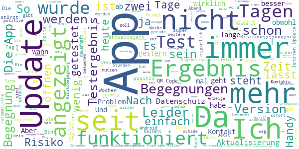

# Corona-Warn-App
App version ``1.7.1``

Analyzed with [covid-apps-observer](http://github.com/covid-apps-observer) project, version ``0.1``

## App overview
| | |
|-------------------------|-------------------------| 
| **Name**&nbsp;&nbsp;&nbsp;&nbsp;&nbsp;&nbsp;&nbsp;&nbsp;&nbsp;&nbsp;&nbsp;&nbsp;&nbsp;&nbsp;&nbsp;&nbsp;&nbsp;&nbsp;&nbsp;&nbsp;&nbsp;&nbsp;&nbsp;&nbsp;&nbsp;&nbsp;&nbsp;&nbsp;&nbsp;&nbsp;&nbsp;&nbsp;&nbsp;&nbsp;&nbsp;&nbsp;&nbsp;&nbsp;&nbsp;&nbsp;  | Corona-Warn-App |
| **Unique identifier** | de.rki.coronawarnapp |
| **Link to Google Play** | [https://play.google.com/store/apps/details?id=de.rki.coronawarnapp](https://play.google.com/store/apps/details?id=de.rki.coronawarnapp) |
| **Summary**  | Gemeinsam Corona bekämpfen |
| **Privacy policy** | [https://www.coronawarn.app/assets/documents/cwa-privacy-notice-de.pdf](https://www.coronawarn.app/assets/documents/cwa-privacy-notice-de.pdf) |
| **Latest version** | 1.7.1 |
| **Last update** | 2020-11-26 18:56:16 |
| **Recent changes** | Dieses Update behebt die Ursache für die nach dem Update auf 1.7.0 vereinzelt auftretenden Abstürze der App. |
| **Installs**  | 10.000.000+ |
| **Category** | Gesundheit & Fitness |
| **First release** | 12.06.2020 |
| **Size**  | 22M |
| **Supported Android version**  | 6.0 oder höher |

### Description
> Das Robert Koch-Institut (RKI) als zentrale Einrichtung des Bundes im Bereich der Öffentlichen Gesundheit und als nationales Public-Health-Institut veröffentlicht die Corona-Warn-App für die deutsche Bundesregierung und für die Bundesrepublik Deutschland. Die App fungiert als digitale Ergänzung zu Abstandhalten, Hygiene und Alltagsmaske. Wer sie nutzt, hilft, Infektionsketten schnell nachzuverfolgen und zu durchbrechen. Die App merkt sich dezentral unsere Begegnungen mit anderen und informiert uns digital, wenn wir Begegnungen mit nachweislich infizierten Personen hatten. Dabei sammelt sie jedoch zu keiner Zeit Informationen zur Identität ihrer Nutzerinnen und Nutzer. Wer wir sind und wo wir sind, bleibt geheim – und unsere Privatsphäre bestens geschützt.
 WIE DIE APP FUNKTIONIERT
 Sind wir unterwegs, sollte die Risiko-Ermittlung immer aktiviert sein. Denn sie ist das Herzstück der Software. Wann immer sich Nutzerinnen und Nutzer begegnen, tauschen ihre Smartphones über Bluetooth verschlüsselte Zufallscodes aus. 
 Diese geben nur Auskunft darüber, über welche Dauer und mit welchem Abstand eine Begegnung stattfand. Welche Person sich hinter einem Code verbirgt, ist für niemanden nachvollziehbar. Die Corona-Warn-App erhebt keine Informationen über den Ort der Begegnung oder den Standort der Nutzerinnen und Nutzer.
 Entsprechend der maximalen Corona-Inkubationszeit werden alle Zufallscodes, die unser Smartphone sammelt, für 14 Tage auf dem Smartphone gespeichert – und dann gelöscht. 
 Nur wenn eine Person sich über die App freiwillig als nachweislich infiziert meldet, erhalten daraufhin alle früheren Begegnungen eine Warnung auf ihr Smartphone. 
 Niemand erfährt, wann, wo oder mit wem eine entsprechende Risiko-Begegnung stattfand. Die infizierte Person bleibt anonym.
 Mit der Benachrichtigung erhalten die betroffenen Nutzer/-innen klare Handlungsempfehlungen. Wichtig: Auch die Daten der Benachrichtigten sind zu keiner Zeit einsehbar.
 WIE DIE DATEN SICHER BLEIBEN
 Die Corona-Warn-App soll uns zwar täglich begleiten. Sie wird uns jedoch nie kennenlernen. Dadurch kann sie niemandem verraten, wer wir sind. Der Datenschutz bleibt über die gesamte Nutzungsdauer zu 100 Prozent gewahrt.
 • Keine Anmeldung: Es müssen keine E-Mail-Adresse und kein Name hinterlegt werden.
 • Keine Rückschlüsse auf Identitäten: Bei einer Begegnung mit einem anderen Menschen tauschen die Smartphones nur Zufallscodes aus. Diese messen, über welche Dauer und mit welchem Abstand ein Kontakt stattfand. Sie lassen aber keine Rückschlüsse auf Personen und Standorte zu. 
 • Dezentrale Speicherung: Die Daten werden nur auf dem Smartphone gespeichert und nach 14 Tagen gelöscht.
 • Keine Einsicht für Dritte: Sowohl die Personen, die eine nachgewiesene Infektion melden, als auch die Benachrichtigten sind nicht nachverfolgbar – nicht für die Bundesregierung, nicht für das Robert Koch-Institut, nicht für andere User und auch nicht für die Betreiber der App-Stores.
 Diese App ist nicht zum Gebrauch außerhalb Deutschlands bestimmt. Die Corona-Warn-App ist die zentrale COVID-19 App für Deutschland und sie ist an das deutsche Gesundheitssystem angeschlossen. Trotzdem ist die Corona-Warn-App auch in diesem Land verfügbar. Sie ist gedacht für alle, die in Deutschland leben, arbeiten, Urlaub machen oder sich regelmäßig oder über längere Zeit in Deutschland aufhalten.
 Es gelten die Nutzungsbedingungen der Corona-Warn-App: https://www.coronawarn.app/assets/documents/cwa-eula-de.pdf. Durch die Installation und Nutzung dieser App stimmen Sie den Nutzungsbedingungen zu.

### User interface
The developers of the app provide the following screenshots in the Google play store.
| | | |
|:-------------------------:|:-------------------------:|:-------------------------:|
 |   |   |   | 
 |   |   |   | 
 |   |  

## Development team
In the following we report the main information provided by the development team in the Google play store.

| | |
|-------------------------|-------------------------|
| **Developer**  | Robert Koch-Institut |
| **Website**  | [https://www.coronawarn.app](https://www.coronawarn.app) |
| **Email** | CoronaWarnApp@rki.de |
| **Physical address**  | [Robert Koch-Institut Nordufer 20 13353 Berlin](https://www.google.com/maps/search/Robert%20Koch-Institut%20Nordufer%2020%2013353%20Berlin) (Google Maps) |
| **Other developed apps**  | [https://play.google.com/store/apps/developer?id=Robert+Koch-Institut](https://play.google.com/store/apps/developer?id=Robert+Koch-Institut) |

## Android support

| | |
|-------------------------|-------------------------|
| **Declared target Android version**  | Android10, version 10 (API level 29) |
| **Effective target Android version**  | Android10, version 10 (API level 29) |
| **Minimum supported Android version**  | Marshmallow, version 6.0 (API level 23) |
| **Maximum target Android version**  | - |

The larger the difference between the minimum and maximum supported Android versions, the better. A larger difference means a wider audience. For example, old phones have a very low Android version, so a high minimum supported Android version means that the app cannot be used by users with old phones, thus leading to accessibility problems. 

## Requested permissions

In the following we report the complete list of the permissions requested by the app. 

| **Permission** | **Protection level** | **Description** | 
|-------------------------|-------------------------|-------------------------|
 **android.permission ACCESS_NETWORK_STATE** | Normal | Allows applications to access information about networks. 
 **android.permission BLUETOOTH** | Normal | Allows applications to connect to paired bluetooth devices. 
 **android.permission CAMERA** | :warning:**Dangerous** | Required to be able to access the camera device. 
 **android.permission FOREGROUND_SERVICE** | Normal | Allows a regular application to use Service.startForeground. 
 **android.permission INTERNET** | Normal | Allows applications to open network sockets. 
 **android.permission RECEIVE_BOOT_COMPLETED** | Normal | Allows an application to receive the Intent.ACTION_BOOT_COMPLETED that is broadcast after the system finishes booting. 
 **android.permission REQUEST_IGNORE_BATTERY_OPTIMIZATIONS** | Normal | Permission an application must hold in order to use Settings.ACTION_REQUEST_IGNORE_BATTERY_OPTIMIZATIONS. 
 **android.permission WAKE_LOCK** | Normal | Allows using PowerManager WakeLocks to keep processor from sleeping or screen from dimming. 

## Mentioned servers

| **Server** | **Registrant** | **Registrant country** | **Creation date** | 
|-------------------------|-------------------------|-------------------------|-------------------------|
 | google.com | Google LLC | :us: US | 1997-09-15 04:00:00 |

## Security analysis 

Below we report the main security warnings raised by our execution of the [Androwarn](https://github.com/maaaaz/androwarn) security analysis tool.

**Connection interfaces exfiltration**
> - This application reads details about the currently active data network 
> - This application tries to find out if the currently active data network is metered 

**Telephony services abuse**
> - This application makes phone calls 

**Suspicious connection establishment**
> - This application opens a Socket and connects it to the remote address '; port is out of range' on the 'N/A' port  
> - This application opens a Socket and connects it to the remote address 'Lcom/android/tools/r8/GeneratedOutlineSupport;->outline21(Ljava/lang/String;)Ljava/lang/StringBuilder;' on the 'N/A' port  
> - This application opens a Socket and connects it to the remote address 'Ljava/net/Proxy;->type()Ljava/net/Proxy$Type;' on the 'N/A' port  
> - This application opens a Socket and connects it to the remote address 'Method sendUrgentData() is not supported.' on the 'N/A' port  
> - This application opens a Socket and connects it to the remote address 'Method setHandshakeTimeout() is not supported.' on the 'N/A' port  
> - This application opens a Socket and connects it to the remote address 'Method setOOBInline() is not supported.' on the 'N/A' port  
> - This application opens a Socket and connects it to the remote address 'Method setSoWriteTimeout() is not supported.' on the 'N/A' port  
> - This application opens a Socket and connects it to the remote address 'Socket closed' on the 'N/A' port  
> - This application opens a Socket and connects it to the remote address 'Socket is closed' on the 'N/A' port  
> - This application opens a Socket and connects it to the remote address 'Socket is closed.' on the 'N/A' port  
> - This application opens a Socket and connects it to the remote address 'Socket is not connected.' on the 'N/A' port  
> - This application opens a Socket and connects it to the remote address 'socket is closed' on the 'N/A' port  
> - This application opens a Socket and connects it to the remote address 'timeout' on the 'N/A' port  

**Code execution**
> - This application loads a native library 
> - This application loads a native library: 'conscrypt_gmscore_jni' 
> - This application loads a native library: 'conscrypt_jni' 

## User ratings and reviews

Below we provide information about how end users are reacting to the app in terms of ratings and reviews in the Google Play store.

### Ratings

The Corona-Warn-App app has been installed by more than **10000000** times. At this time, **97384** rated the app and its average score is **3.0680912**. Below we show the distribution of the ratings across the usual star-based rating of Google Play

:star::star::star::star::star:: 35107

:star::star::star::star:: 9837

:star::star::star:: 11031

:star::star:: 9399

:star:: 32010

### Reviews 

#### 5-star reviews

> Hilft mir sehr. Und funktioniert.  :date: __2020-12-13 20:39:03__

> Gute App  :date: __2020-12-13 20:30:23__

> Seit letzten Donnerstag keine Risikoermittlung mehr möglich. Ich werde aufgefordert Risikoermittlung einzuschalten. Ist eingeschaltet, in der App sowie auch in den allgemeinen Einstellungen. Gerät: Redmi Note 8 Pro, Android 10. Update: Funktioniert wieder, darum auch wieder 5 Sterne.  :date: __2020-12-13 20:08:40__

> Hallo. Ich verwende die App seit dem ersten Tag und die App hält was sie verspricht. Ich rege mich nicht darüber auf, dass mir nicht angezeigt wird wann und wo ein möglicher Kontakt stattgefunden hat, da genau diese Datenspeicherung viele im Vorfeld ja nicht wollten. Wenn man sich also vor dem Herunterladen der App mit dieser beschäftigt, dann kann dies auch kein Negativkriterium in den Rezensionen sein. Fakt ist, die App bringt mehr, je mehr Personen sie verwenden. Danke für das nicht Speichern  :date: __2020-12-13 18:48:39__

> OK  :date: __2020-12-13 16:07:02__

> Finde die App sehr sinnvoll. Finde es wichtig sie während dee Pandemie zu nutzen. Viele sagen, dass sie nicht aktualisiert oder ähnliches. Bei mir funktioniert alles super! 5/5  :date: __2020-12-13 15:57:03__

> wir wollen Gesund bleiben zusammen arbeit schaffen das für Zukunft ist wichtig  :date: __2020-12-13 14:30:14__

> Die App ist gut. Sie fordert keine unnötigen Berechtigungen alles ist gut erklärt. Nur warum bitte kann ich nicht sehen wo ich meine Begegnung hatte. Ich will ja gar nicht wissen wer es war, aber wo es war!!???  :date: __2020-12-13 13:36:54__

> In den letzten Tagen läuft die Aktualisierung des Risikostatus wieder zügig und problemlos. Danke für die schnelle Problemlösung.  :date: __2020-12-13 12:22:12__

> Die Funktion mit dem QR Code ist einwandfrei. 👍🏻👍🏻👍🏻 Und auch die App an sich ist top.  :date: __2020-12-13 12:13:01__

#### 4-star reviews

> An sich ist die App gut und alle, die rumheulen wegen Bluetooth und so weiter, sind einfach affig drauf... Verbesserungsvorschlag wäre, dass man Coronatests, die nicht vom Gesundheitsamt durchgeführt werden, sondern vom Hausarzt o.ä. auch in die App eingeben könnte und dann ggf. selber angeben kann, ob das Ergebnis positiv odernegativ ist  :date: __2020-12-13 17:37:28__

> Bei aktivierter Funktion leidet leider die Musik über Bluetooth Kopfhörer leider stark unter aussetztern.  :date: __2020-12-13 17:16:50__

> Stuertzt ständig ab. Lief in der ruhigen Zeit der Pandemie ohne Probleme. Seit November - wo sie echt von Nutzen sein könnte - versagt sie ihren Dienst. Was für ein Ärgernis. Updatemurks? Nachtrag: Die Antwort wird seit 6 Wochen Textbausteinig wiederholt und erhöht nur noch den Ärger. Ist das Probleme lesbar oder kann ich die App in den Wind schießen und meine Zeit besser verbringen.  :date: __2020-12-13 17:06:59__

> Läuft stabil, Wäre schön, wenn man essen, arzt, kfz usw.... Einen code eingeben könnte oder scannen, das man vor ort war und nicht immer alles mühselig in listen eintragen muss. Erst recht die wollen ja alles wissen name, Email, tel, adresse....  :date: __2020-12-13 17:04:09__

> Funktioniert soweit alles gut  :date: __2020-12-13 15:21:03__

> Die Aktualisierung nach meinem Ergebnis dauerte etwas lange.  :date: __2020-12-13 13:35:49__

> Leider kann ich bei meinem Samsung Galaxy A5 (2017) nicht die COVID-19-Benachrichtigungen über Einstellungen > Suche abrufen. Ansonsten funktioniert die App seit gut 2 Monaten einwandfrei auf dem Smartphone, nur das Anzeigen der möglichen Begegnungen funktioniert halt nicht, was aber wünschenswert wäre.  :date: __2020-12-13 12:00:49__

> Funktioniert... aber ein Witz, dass die App nicht kontinuierlich um weitere nützliche Funktionen erweitert wird, die vielleicht auch die Nutzungsrate erhöhen.  :date: __2020-12-13 10:54:33__

> Nach dem update auf 1.7.0 macht die App was sie soll. Seit 2 Tagen (11.12.) meldet die App die Meldungen auf mögliche Risikobegnungen nicht korrekt. Als letzte Aktualisierung wird der 11.12. angezeigt. Wenn ich im Google Konto nachschaue gibt es 15 Meldungen und auch Meldungen für den 12.12. und 13.12. Die Anzeige auf der app ist grün. Ich hoffe hier braut sich nicht das nächste Problem zusammen. (Samsung Galaxy note 4; Android 6.0.1)  :date: __2020-12-13 10:34:23__

> Hallo zusammen, Die App liefert sehr schnell Testergebnisse, man weiß es vor der Praxis und dem Gesundheitsamt. Das ist super, leider kommt man erst aus der Quarantäne wenn man das Ergebnis mit Namen vorlegen kann! Wäre es nicht möglich, den Testergebnissen den Namen und ggf. das Geburtsdatum hinzuzufügen? Dem Gesundheitsamt hätte dann ein Screenshot gereicht, um die Quarantäne aufzuheben. Da Freitag kein Ergebnis vorlag, müssen wir bis Montag in Quarantäne bleiben. Beste Grüße  :date: __2020-12-13 10:02:43__

#### 3-star reviews

> Funktioniert nicht  :date: __2020-12-13 20:06:54__

> Hallo wie kann ich die App auch auf meinem Huawei p40 lite runterladen? Ich habe eine Version runtergeladen, da wird mir angezeigt, dass meinem Handy die Funktion,, Covid 19 Benachrichtigung" fehlt.  :date: __2020-12-13 19:27:34__

> ich würde mir wünschen das man auf einer MAP sieht wann und wo man jemanden Begegnet ist, auch eine Aktive Benachrichtigung im fall der fälle wäre toll. Die App frisst zudem auch anscheinend einiges an Akku leistung. Bleibt nur zu hoffen das die App nicht auf Rot umspringt irgendwann :|  :date: __2020-12-13 14:56:21__

> Ursprünglich mal 5 Sterne, finde ich die Funktionen mittlerweile für die vergangenene Zeit viel zu schwach: Warum kann man nicht die für den aktuellen Standort aktuell gültigen Beschränkungen anzeigen? Warum kann man die aktuellen Statistiken des RKI mit Erklärung der grundsätzlichen Messgrößen nicht integrieren und am besten auch standortbezogen anzeigen? Warum kann man keine Statistiken zu eigenen Risikobegegnungen sehen? Simpleshows, Wikis usw. Da wäre so viel mehr möglich.  :date: __2020-12-13 14:46:06__

> Bisher gute Erfahrungen mit der App gemacht. Seit einigen Tagen kann ich sie aber nicht mehr benutzen. Wenn ich auf das icon drücke friert der Startbildschirm für ca 5 Sekunden ein, dann stürzt die App ab. Sehr schade. Bitte fixen, um mich und andere zu schützen  :date: __2020-12-13 11:26:13__

> Ich schalte mein Smartphone nachts aus. Wenn ich es morgens dann wieder einschalte, ist die App wieder auf Akku-Sparmodus und daher die dauerhafte Risikoermittlung nur manuell abrufbar und nicht automatisch. Das müsste dringend dahingehend geändert werden, dass die Nutzereinstellung dauerhaft beibehalten wird.  :date: __2020-12-13 10:32:37__

> Ich bekomme plötzlich den wöchentlichen Bericht nicht mehr. Außerdem erfolgt auch keine Warnung mehr, wenn ich in den Flugmodus umschalte. Schön wäre außerdem, wenn es Statistiken gäbe, mit wievielen Geräten ein Abgleich erfolgt ist. So könnte gezielt erkannt werden, wo man mit vielen Leuten unbewusst in Kontakt war und das Verhalten entsprechend anpassen.  :date: __2020-12-13 10:21:07__

> Im Moment finde ich die App als überflüssig. Wenn ich erst 4_5 Tage spâter, nach einem nâheren Kontakt informiert werde nützt mir das gar nichts, denn ich weiss nicht wo und wann der nâhere Kontakt war.  :date: __2020-12-13 10:18:06__

> Heute musste ich die App erneut installieren, da sich die App nicht öffnen ließ. Mein Mobiltelephon läuft auf Android 7. Daher vermute ich, daß die Fehlfunktion auf dem Ihnen schon bekannten Problem beruht. Bis vor wenigen Wochen lief die App einwandfrei.  :date: __2020-12-13 08:49:39__

> Ich habe Android 6.0.1 und ständig Probleme mit der Warn-App. Die App wurde bei mir auf die Version 7. 0.1. aktualisiert. Dauerhaft macht sie keinen Abgleich der Daten, nun schon seit 10 Tagen! War bei den vorherigen Versionen das gleiche Problem. Bitte bemüht euch, noch will ich nicht deinstallieren!  :date: __2020-12-13 08:22:05__

#### 2-star reviews

> Update vom 13.12: App geht noch immer nicht. 29.11...Nicht mehr nutzbar. Stürzt seit ein paar Tagen immer ab. Neue Installation löst das Problem nicht. Xiaomi Mi5s mit Android 8.  :date: __2020-12-13 19:35:13__

> Der QR Scanner der App geht nicht. Was mach ich jetzt?  :date: __2020-12-13 18:51:50__

> Hätte Pflicht sein müssen zu wenig Teilnehmer  :date: __2020-12-13 17:19:31__

> Also als Sanitäter, der jede Woche mit mehreren bestätigten Fällen Kontakt hat, zeigte mir die App bisher keinerlei Risikobegegnungen an. Funktioniert also super. 🤷🏼‍♂️  :date: __2020-12-13 16:02:48__

> Monate lang lief die App einwandfrei! Doch jetzt wird mir ständig gemeldet, "die App wurde (wiederholt) beendet", obwohl ich nichts an der Einstellung geändert habe. Nach fast einer Woche mich entschieden, die App zu löschen und neu zu installieren, doch jetzt nach einer Woche bekomme ich wieder diese Fehlermeldung.  :date: __2020-12-13 14:23:47__

> Die App meldete schon mehrfach "Kontakte mit geringen Risiko". Das ist nutzlos, da ich mein Verhalten mangels fehlender Zusatzinfornationen nicht verbessern kann. Zumindest sollt Tag und Uhrzeit des Kontaktes angegen werden.  :date: __2020-12-13 11:44:38__

> Leider ging der Datenschutz über alles. Eine ca zuordnung, wann und wo man ein Kontakt hat fehlt. Dies hätte vielleicht als freiwillige Option hinzugefügt werden können. Desweitern gibt es null Informationen zu den aktuellen Verordnung. Hier könnte man das, was die App nina kann vielleicht mit ergänzen. Also eine offizielle Karte vom rki und die jeweiligen Verordnungen.  :date: __2020-12-13 11:14:19__

> Alles schön und gut mit dieser APP und von selbst Schutz ist nicht vorhanden oder gegeben da müsste man noch vieles überarbeiten. Wäre sinnvoller gewesen wenn z.b. Name und Anschrift bei dieser oder mereren Personen anzeigen würde, das man gleich die Personen von der Zentrale aus über das Handy ermitteln könnte, oder das man selbst beim Gesundheitsamt das meldet. Bei einer schweren Betrohung mit Personen in der Nähe dann wäre diese APP wirklich ein Schutz für alle. Aber so doch nicht.  :date: __2020-12-13 10:20:38__

> Diese App macht wenig Sinn, wenn nicht wenigstens die Uhrzeit dabei steht und da kann mir Keiner erzählen, der Datenschutz würde das verhindern. Ich bekomme eine Info über Risikokontakte und weiß nicht mal, ob ich zu dem Zeitpunkt nicht gerade sogar geschützt Kontakt hatte. Meiner Meinung nach ist das wichtig für die eigene Risiko Einordnung.  :date: __2020-12-13 08:35:03__

> Seit 01.07. Risikoermittlung nicht möglich wg. Fehlermeldung "Ursache: 3". Update (13.12.2020): Sie Risikoermittlung scheint zu funktionieren; jedoch wurden meine Risikobegegnungen seit dem 28.11.2020 nicht mehr aktualisiert. Und ja, ich habe die App zwischendurch länger als 24Std. geschlossen gehalten.  :date: __2020-12-13 07:46:35__

#### 1-star reviews

> Die App läuft leider nicht stabil. Ich kann sie schon wieder nicht öffnen. Nach ca. 5 Tagen schmiert die App ab und muss neu installiert werden. Zumindest erklärt das die hohen Downloadzahlen.  :date: __2020-12-13 20:42:25__

> Wie ich bereits in vorherigen kommentaren lesen konnte funktioniert die Testergebnis Information nicht was bringt sie dann das man es eintragen soll seit 4 Tagen warte ich auf das Ergebnis damit ich montag wieder arbeiten kann! Aber ich muss wohl bis Montag warten bis mir mein Hausarzt das Ergebnis mitteilt da hier nichts passiert! Traurig da es eigentlich nicht so schwer sein kann und somit wird die app als unnütz abgestempelt und wieder gelöscht!  :date: __2020-12-13 20:36:41__

> Hatte ein positives Testergebnis und seit dem steht in der App nur ein Vielen Dank! Und zeigt nix mehr an keine Warnung nix. Wenn das so bleibt kann ich die App jetzt deinstallieren da sie mir nix mehr bringt ausser das mein Akku 3mal so schnell leer ist wie normalerweise.  :date: __2020-12-13 20:32:46__

> Teuer ohne großen Nutzen. Schade, gibt es doch eine andere Apps aus Deutschland, die in anderen kleinen Ländern eine gute Unterstützung zur Pandemiebekämpfung ist, ohne große Kosten  :date: __2020-12-13 20:27:52__

> Katastrophe  :date: __2020-12-13 20:17:18__

> Funktioniert leider noch nicht mehr. Bekomme Nachricht bitte denk dran regelmäßig zu aktualisieren. Tut die App aber nicht mehr. Nachtrag. Natürlich hab ich die App geöffnet. Hab das Smartphone neu gestartet. Hab die App deinstalliert und neu installiert. Für die Antwort noch ein Stern weniger  :date: __2020-12-13 20:14:34__

> Komplett umsonst. Aktualisiert keine Tests, Risikobegegnungen werden NICHT registriert.  :date: __2020-12-13 20:05:24__

> Eigentlich eine wichtige und gute App. Nur leider wird mir nicht angezeigt, dass mein Partner positiv getestet wurde, obwohl wir zusammen wohnen. Etwas komisch... nur weil er seinen Standort nicht teilte bevor er positiv getestet wurde? Wo ist der Sinn, wenn nur über Bluetooth kommuniziert werden soll, und ich es nicht angezeigt bekommen obwohl sein Handy nie weiter als 10 Meter von mir entfernt war?  :date: __2020-12-13 20:05:12__

> Habe die App jetzt dreimal neu installiert, da sie immer wieder nach zehn Sekunden schließt. Nach jeder Deinstallation sind die Daten gelöscht. Macht nicht wirklich Sinn. Schade/ okay, jetzt zum viertenmal installiert. Danach gebe ich auf👎 13.12. wieder beendet. Gebe auf. Völlig nutzlos diese App 👎  :date: __2020-12-13 20:02:12__

> Die Versionen 1.6.0 und 1.6.1 funktionierten bei mir nicht. Das Update 1.7.0 funktionierte zunächst. Jetzt, ca. 14 Tage später, stürzt sie nur noch ab, trotz Telefon-Neustarts.  :date: __2020-12-13 19:58:50__

