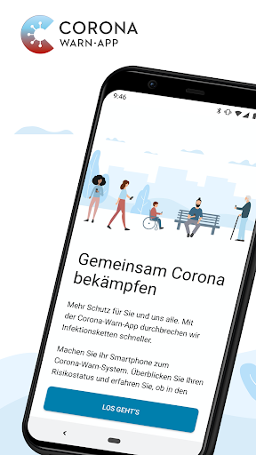
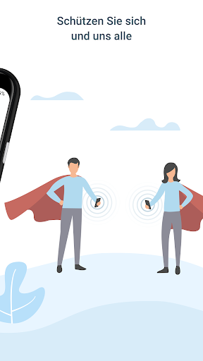
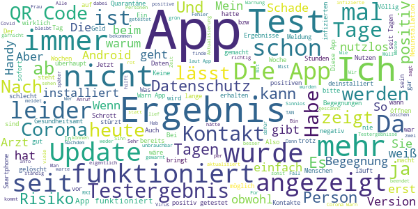

# Corona-Warn-App
App version ``1.7.1``

Analyzed with [covid-apps-observer](http://github.com/covid-apps-observer) project, version ``0.1``

## App overview
| | |
|-------------------------|-------------------------| 
| **Name**&nbsp;&nbsp;&nbsp;&nbsp;&nbsp;&nbsp;&nbsp;&nbsp;&nbsp;&nbsp;&nbsp;&nbsp;&nbsp;&nbsp;&nbsp;&nbsp;&nbsp;&nbsp;&nbsp;&nbsp;&nbsp;&nbsp;&nbsp;&nbsp;&nbsp;&nbsp;&nbsp;&nbsp;&nbsp;&nbsp;&nbsp;&nbsp;&nbsp;&nbsp;&nbsp;&nbsp;&nbsp;&nbsp;&nbsp;&nbsp;  | Corona-Warn-App |
| **Unique identifier** | de.rki.coronawarnapp |
| **Link to Google Play** | [https://play.google.com/store/apps/details?id=de.rki.coronawarnapp](https://play.google.com/store/apps/details?id=de.rki.coronawarnapp) |
| **Summary**  | Gemeinsam Corona bekämpfen |
| **Privacy policy** | [https://www.coronawarn.app/assets/documents/cwa-privacy-notice-de.pdf](https://www.coronawarn.app/assets/documents/cwa-privacy-notice-de.pdf) |
| **Latest version** | 1.7.1 |
| **Last update** | 2020-11-26 18:56:16 |
| **Recent changes** | Dieses Update behebt die Ursache für die nach dem Update auf 1.7.0 vereinzelt auftretenden Abstürze der App. |
| **Installs**  | 10.000.000+ |
| **Category** | Gesundheit & Fitness |
| **First release** | 12.06.2020 |
| **Size**  | 22M |
| **Supported Android version**  | 6.0 oder höher |

### Description
> Das Robert Koch-Institut (RKI) als zentrale Einrichtung des Bundes im Bereich der Öffentlichen Gesundheit und als nationales Public-Health-Institut veröffentlicht die Corona-Warn-App für die deutsche Bundesregierung und für die Bundesrepublik Deutschland. Die App fungiert als digitale Ergänzung zu Abstandhalten, Hygiene und Alltagsmaske. Wer sie nutzt, hilft, Infektionsketten schnell nachzuverfolgen und zu durchbrechen. Die App merkt sich dezentral unsere Begegnungen mit anderen und informiert uns digital, wenn wir Begegnungen mit nachweislich infizierten Personen hatten. Dabei sammelt sie jedoch zu keiner Zeit Informationen zur Identität ihrer Nutzerinnen und Nutzer. Wer wir sind und wo wir sind, bleibt geheim – und unsere Privatsphäre bestens geschützt.
 WIE DIE APP FUNKTIONIERT
 Sind wir unterwegs, sollte die Risiko-Ermittlung immer aktiviert sein. Denn sie ist das Herzstück der Software. Wann immer sich Nutzerinnen und Nutzer begegnen, tauschen ihre Smartphones über Bluetooth verschlüsselte Zufallscodes aus. 
 Diese geben nur Auskunft darüber, über welche Dauer und mit welchem Abstand eine Begegnung stattfand. Welche Person sich hinter einem Code verbirgt, ist für niemanden nachvollziehbar. Die Corona-Warn-App erhebt keine Informationen über den Ort der Begegnung oder den Standort der Nutzerinnen und Nutzer.
 Entsprechend der maximalen Corona-Inkubationszeit werden alle Zufallscodes, die unser Smartphone sammelt, für 14 Tage auf dem Smartphone gespeichert – und dann gelöscht. 
 Nur wenn eine Person sich über die App freiwillig als nachweislich infiziert meldet, erhalten daraufhin alle früheren Begegnungen eine Warnung auf ihr Smartphone. 
 Niemand erfährt, wann, wo oder mit wem eine entsprechende Risiko-Begegnung stattfand. Die infizierte Person bleibt anonym.
 Mit der Benachrichtigung erhalten die betroffenen Nutzer/-innen klare Handlungsempfehlungen. Wichtig: Auch die Daten der Benachrichtigten sind zu keiner Zeit einsehbar.
 WIE DIE DATEN SICHER BLEIBEN
 Die Corona-Warn-App soll uns zwar täglich begleiten. Sie wird uns jedoch nie kennenlernen. Dadurch kann sie niemandem verraten, wer wir sind. Der Datenschutz bleibt über die gesamte Nutzungsdauer zu 100 Prozent gewahrt.
 • Keine Anmeldung: Es müssen keine E-Mail-Adresse und kein Name hinterlegt werden.
 • Keine Rückschlüsse auf Identitäten: Bei einer Begegnung mit einem anderen Menschen tauschen die Smartphones nur Zufallscodes aus. Diese messen, über welche Dauer und mit welchem Abstand ein Kontakt stattfand. Sie lassen aber keine Rückschlüsse auf Personen und Standorte zu. 
 • Dezentrale Speicherung: Die Daten werden nur auf dem Smartphone gespeichert und nach 14 Tagen gelöscht.
 • Keine Einsicht für Dritte: Sowohl die Personen, die eine nachgewiesene Infektion melden, als auch die Benachrichtigten sind nicht nachverfolgbar – nicht für die Bundesregierung, nicht für das Robert Koch-Institut, nicht für andere User und auch nicht für die Betreiber der App-Stores.
 Diese App ist nicht zum Gebrauch außerhalb Deutschlands bestimmt. Die Corona-Warn-App ist die zentrale COVID-19 App für Deutschland und sie ist an das deutsche Gesundheitssystem angeschlossen. Trotzdem ist die Corona-Warn-App auch in diesem Land verfügbar. Sie ist gedacht für alle, die in Deutschland leben, arbeiten, Urlaub machen oder sich regelmäßig oder über längere Zeit in Deutschland aufhalten.
 Es gelten die Nutzungsbedingungen der Corona-Warn-App: https://www.coronawarn.app/assets/documents/cwa-eula-de.pdf. Durch die Installation und Nutzung dieser App stimmen Sie den Nutzungsbedingungen zu.

### User interface
The developers of the app provide the following screenshots in the Google play store.
| | | |
|:-------------------------:|:-------------------------:|:-------------------------:|
 |   |   |   | 
 |   |   |   | 
 |   |  

## Development team
In the following we report the main information provided by the development team in the Google play store.

| | |
|-------------------------|-------------------------|
| **Developer**  | Robert Koch-Institut |
| **Website**  | [https://www.coronawarn.app](https://www.coronawarn.app) |
| **Email** | CoronaWarnApp@rki.de |
| **Physical address**  | [Robert Koch-Institut Nordufer 20 13353 Berlin](https://www.google.com/maps/search/Robert%20Koch-Institut%20Nordufer%2020%2013353%20Berlin) (Google Maps) |
| **Other developed apps**  | [https://play.google.com/store/apps/developer?id=Robert+Koch-Institut](https://play.google.com/store/apps/developer?id=Robert+Koch-Institut) |

## Android support

| | |
|-------------------------|-------------------------|
| **Declared target Android version**  | Android10, version 10 (API level 29) |
| **Effective target Android version**  | Android10, version 10 (API level 29) |
| **Minimum supported Android version**  | Marshmallow, version 6.0 (API level 23) |
| **Maximum target Android version**  | - |

The larger the difference between the minimum and maximum supported Android versions, the better. A larger difference means a wider audience. For example, old phones have a very low Android version, so a high minimum supported Android version means that the app cannot be used by users with old phones, thus leading to accessibility problems. 

## Requested permissions

In the following we report the complete list of the permissions requested by the app. 

| **Permission** | **Protection level** | **Description** | 
|-------------------------|-------------------------|-------------------------|
 **android.permission ACCESS_NETWORK_STATE** | Normal | Allows applications to access information about networks. 
 **android.permission BLUETOOTH** | Normal | Allows applications to connect to paired bluetooth devices. 
 **android.permission CAMERA** | :warning:**Dangerous** | Required to be able to access the camera device. 
 **android.permission FOREGROUND_SERVICE** | Normal | Allows a regular application to use Service.startForeground. 
 **android.permission INTERNET** | Normal | Allows applications to open network sockets. 
 **android.permission RECEIVE_BOOT_COMPLETED** | Normal | Allows an application to receive the Intent.ACTION_BOOT_COMPLETED that is broadcast after the system finishes booting. 
 **android.permission REQUEST_IGNORE_BATTERY_OPTIMIZATIONS** | Normal | Permission an application must hold in order to use Settings.ACTION_REQUEST_IGNORE_BATTERY_OPTIMIZATIONS. 
 **android.permission WAKE_LOCK** | Normal | Allows using PowerManager WakeLocks to keep processor from sleeping or screen from dimming. 

## Mentioned servers

| **Server** | **Registrant** | **Registrant country** | **Creation date** | 
|-------------------------|-------------------------|-------------------------|-------------------------|
 | google.com | Google LLC | :us: US | 1997-09-15 04:00:00 |

## Security analysis 

Below we report the main security warnings raised by our execution of the [Androwarn](https://github.com/maaaaz/androwarn) security analysis tool.

**Connection interfaces exfiltration**
> - This application reads details about the currently active data network 
> - This application tries to find out if the currently active data network is metered 

**Telephony services abuse**
> - This application makes phone calls 

**Suspicious connection establishment**
> - This application opens a Socket and connects it to the remote address '; port is out of range' on the 'N/A' port  
> - This application opens a Socket and connects it to the remote address 'Lcom/android/tools/r8/GeneratedOutlineSupport;->outline21(Ljava/lang/String;)Ljava/lang/StringBuilder;' on the 'N/A' port  
> - This application opens a Socket and connects it to the remote address 'Ljava/net/Proxy;->type()Ljava/net/Proxy$Type;' on the 'N/A' port  
> - This application opens a Socket and connects it to the remote address 'Method sendUrgentData() is not supported.' on the 'N/A' port  
> - This application opens a Socket and connects it to the remote address 'Method setHandshakeTimeout() is not supported.' on the 'N/A' port  
> - This application opens a Socket and connects it to the remote address 'Method setOOBInline() is not supported.' on the 'N/A' port  
> - This application opens a Socket and connects it to the remote address 'Method setSoWriteTimeout() is not supported.' on the 'N/A' port  
> - This application opens a Socket and connects it to the remote address 'Socket closed' on the 'N/A' port  
> - This application opens a Socket and connects it to the remote address 'Socket is closed' on the 'N/A' port  
> - This application opens a Socket and connects it to the remote address 'Socket is closed.' on the 'N/A' port  
> - This application opens a Socket and connects it to the remote address 'Socket is not connected.' on the 'N/A' port  
> - This application opens a Socket and connects it to the remote address 'socket is closed' on the 'N/A' port  
> - This application opens a Socket and connects it to the remote address 'timeout' on the 'N/A' port  

**Code execution**
> - This application loads a native library 
> - This application loads a native library: 'conscrypt_gmscore_jni' 
> - This application loads a native library: 'conscrypt_jni' 

## User ratings and reviews

Below we provide information about how end users are reacting to the app in terms of ratings and reviews in the Google Play store.

### Ratings

The Corona-Warn-App app has been installed by more than **10000000** times. At this time, **97384** rated the app and its average score is **3.0680912**. Below we show the distribution of the ratings across the usual star-based rating of Google Play

:star::star::star::star::star:: 35107

:star::star::star::star:: 9837

:star::star::star:: 11031

:star::star:: 9399

:star:: 32010

### Reviews 

#### 5-star reviews

> Immer wieder mal Fehler in der App, die aber schnell behoben werden. Insbesondere ältere Firmware betroffen. Ansonsten tut sie, was sie soll.Insbesonder wegen der schnellen Fehlerbehebung gibt es weiterhin 5 Sterne.  :date: __2020-12-20 20:19:12__

> top!  :date: __2020-12-20 20:17:09__

> Nutze die App taeglich  :date: __2020-12-20 19:06:11__

> Klasse. Seit ich die App nutze: Keine Infekte mehr! Topp!!!!  :date: __2020-12-20 18:43:49__

> Seit der Installation vor paar Monaten funktioniert sie, hab zwischen 0 und 7 Begegnungen mit niedrigem Infektionsrisiko registriert. Studiere von zuhause aus und bin selten unterwegs, aber dann mit dem Fahrrad.  :date: __2020-12-20 18:41:24__

> Corona Warn App heruntergeladen installiert ohne Probleme. Die App funktioniert weiterhin gut.  :date: __2020-12-20 18:38:23__

> Ich bin froh daß wir so ein gutes Instrument im Kampf gegen Corona zu haben, danke den Entwicklern  :date: __2020-12-20 18:05:19__

> Sehr einfache Bedienung. Jetzt schon das 2. Update und die Entwickler haben es immer noch nicht geschafft die Anwender zu informieren. Aus der Presse erfährt man vom Update.  :date: __2020-12-20 17:57:43__

> Neubewertung KW 51: Mittlerweile läuft die App stabil, auch die Übertragung des Testergebnis funktionierte super.  :date: __2020-12-20 17:43:31__

> 👍  :date: __2020-12-20 16:44:16__

#### 4-star reviews

> Gibt es überhaupt ein english Version?  :date: __2020-12-20 19:50:07__

> Nachtrag: Danke :-). Die App läuft seit dem letzten Update wieder! Ursprüngliche Nachricht: Hallo! Bis zum letzten Update ,hat die App bis auf am Anfang gut funktioniert. Leider geht nichts mehr seit dem letzten Update. Die App lädt und stürzt dann immer wieder ab. Eine Neuinstallation konnte das Problem nicht beheben. Ich habe das Android 8 Betriebssystem. Mit der nächsten Aktualisierung hoffe sehr, dass der Fehler behoben werden kann. MfG  :date: __2020-12-20 17:45:31__

> Die App ist okay. Viel Erfolg! Wo bleibt die Version 1.9? 😭  :date: __2020-12-20 17:00:45__

> Wie andere hier schon beschrieben haben, hängt die Funktion "Test anzeigen" gerade in einer Dauerschleife (Datenabruf - Das Ergebnis wird aktualisiert). Der letzte freiwillige Test ist schon eine Weile her, ein nächster noch nicht in Sicht. Aber ich könnte ihn derzeit nicht einscannen. Wenn ich den Anweisungen "Einstellung - Anwendung zurücksetzen" folge, kommt die Warnung, dass Risikobegegnungen für andere Anwender und mich nicht mehr angezeigt werden. Wenig vertrauenerweckend!  :date: __2020-12-20 16:40:05__

> Top  :date: __2020-12-20 15:33:18__

> Jetzt wieder 4 Sterne, anstatt wie vorher nur 1 Stern. Die Version 1.7.1 hatte schon mehrere Tage lang die Risiko-Ermittlung nicht mehr aktualisiert. Mir Version 1.9.1 geht es wieder : -)  :date: __2020-12-20 13:54:01__

> Sagt mir nicht alles an  :date: __2020-12-20 13:27:42__

> Wo ist das Kontakt Tagebuch??????  :date: __2020-12-20 13:19:12__

> Zieht durch die dauerhafte Standort und Bluetooth Einstellung leider unglaublich viel Akku bei meinem Huawei Mate 20 Pro....  :date: __2020-12-20 12:37:14__

> Die App ist auf jeden Fall hilfreich, trotz der einen oder anderen Schwäche!!  :date: __2020-12-20 11:09:07__

#### 3-star reviews

> Schade das keine Informationen zum aktuellen Infektionsgeschehen ( Inzidenzen, Todesfälle, Trends etc ) in meiner aktuellen Region angezeigt werden. Dies würde den Nutzen der App massiv erhöhen und ließe sich extrem einfach umsetzen, aber leider war die Weiterentwicklung der App für den Nutzer kaum zu bemerken und nicht wirklich neue Funktionen gebracht... Hier wurde leider viel Potential verschenkt um möglichst viele Nutzer mit einer hilfreichen App zu erreichen.  :date: __2020-12-20 18:55:27__

> Was denn nun? Am Wochenende nach dem Update eine rote Warnung. Heute ist sie plötzlich weg. Und damit soll man sich dann beim Arzt melden oder wie? Mehr Verwirrung geht ja nun wirklich nicht mehr.  :date: __2020-12-20 18:01:49__

> Ich bin 2 mal getestet worden. Test in der App registriert und die Ergebnisse wurden NIE angezeigt.... Immer die Meldung Testergebnis liegt nie vor.  :date: __2020-12-20 17:01:06__

> Wow... ich hatte 8 Begegnungen mit niedrigem Risiko, nun sind diese nach dem Update verschwunden. Was soll man davon halten? Ich nehme diese Begegnungen schon ernst und gerade jetzt zu der Zeit, finde ich es um so wichtiger, noch mehr darauf zu achten. Jetzt fange ich also wieder von vorne an zu "sammeln" und das in dieser kritischen Zeit. Ich muss leider arbeiten und kann kein Home Office machen! Wirklich sehr, sehr schade!  :date: __2020-12-20 16:54:06__

> Gutes Design, übersichtliche Hilfeseiten. Die schlichte Angabe der Begegnungsanzahl ist wenig hilfreich. Wann war die Begegnung?  :date: __2020-12-20 16:38:40__

> Insgesamt eine sehr gute und unterstützenswerte Sache. Ich habe dennoch den Eindruck, dass der Datenschutz höher angesiedelt ist als der Gesundheitsschutz. Ich hatte gestern die Nachricht bekommen, dass ich eine Begegnung mit geringem Risiko hatte. Warum bitte kann die Information nicht preisgegeben werden, wann diese stattgefunden hatte. Das hilft z.B. im eigenen Haushalt, wenn man zu Angehörigen zusätzlich während der durchschnittlichen Inkubationszeit mehr Abstand halten kann.  :date: __2020-12-20 16:02:52__

> Nach dem aktuellen Update funktioniert die Risikoermittlung gerade nicht mehr: Fehler # 10. Neustart des Telefons hilft nicht. Wäre super, wenn das schnell behoben würde... - Danke: Es hat den Risikostatus jetzt aktualisiert (mit 3 Stunden Verspätung).  :date: __2020-12-20 15:23:37__

> Die Idee ist zwar gut, aber die Ausführung ist noch ausbaufähig. Ich war vor 4 Wochen leider erkrankt und habe es der App gemeldet. Leider steht immer noch in meiner App, dass ich positiv bin. Generell, wenn man positiv war, kann man danach nicht viel machen. Man könnte genau reinschreiben, welche Symptome und wann sie eintreten. Denn mittlerweile sind die Symptome sehr unterschiedlich. Das weiß ich, weil ich im Krankenhaus arbeite.  :date: __2020-12-20 14:45:07__

> Ich bin gestern auf die App gegangen... Da wurde mir 1 Begegnung angezeigt mit geringem Risiko. Heute ist diese Nachricht weg und es steht keine Begegnung. Zudem habe ich auch keine Nachricht indem Sinne erhalten. Sondern musste ich erst drauf gehen.. Wenn man das mal vergisst zu überprüfen ist das net gut  :date: __2020-12-20 13:10:57__

> Icon verschwindet manchmal vom Startbildschirm. Scheint immer zu passieren wenn "das Handy gesichert" wird.  :date: __2020-12-20 12:42:23__

#### 2-star reviews

> Ständig wird eine Fehlermeldung gezeigt, Ermittlung gestoppt, abgebrochen. Diese App wird nicht durch energiesparende Einstellungen eingeschränkt. Da dies in Berichten, immer wieder erwähnt wird.  :date: __2020-12-20 19:42:48__

> Hi, ist zwar eine gute Idee, solch eine App auf den Markt zu holen, aber was bringt es mir zu wissen, dass ich Risikobegegnungen hatte und nicht weiß, wo diese waren. Schlechte Umsetzung einfach...  :date: __2020-12-20 19:39:28__

> Ich kann mein Testergebnis nicht mehr abrufen da sich das vielen Dank fenster nicht schließen lässt, Nokia 8.1 🤔 und die Übertragung der Ergebnisse dauert viel zu lange. Und kein Download des ergebnisses möglich, Nachweis wird aber benötigt, wie komme ich da nun ran? Ct wert ebenfalls nicht zu sehen! Nicht bis zum Ende durchdacht, traurig! Kein Wunder daß man nicht weiß wo man sich den Schei... Geholt hat trotz Einhaltung aller Aha+ regeln!  :date: __2020-12-20 19:03:16__

> Seit meiner Übermittlung eines positiven Tests( vor 2 Wochen) passiert nichts mehr, es steht nur noch : Vielen Dank das sie....Sie werden vom Gesundheitsamt angerufen...etc..Aber ich erfuhr das Ergebnis per App vor meinem Arzt... vielleicht klappt es wieder nach einem Update??  :date: __2020-12-20 18:40:24__

> Am Freitag getestet worden, QR-Code eingescannt. Am Samstagabend ruft mein Hausarzt an und sagt mir mein Ergebnis. Am Sonntag Nachmittag ist das Ergebnis immer noch nicht in der App. Ich frage mich wie so Kontaktpersonen rechtzeitig gewarnt werden können wenn das so lange dauert.  :date: __2020-12-20 17:41:49__

> Naja, das Datum meines Covid Tests wird immer tagesaktuell angezeigt, was soll das, der Test war vor einer Woche, nicht heute! Mit der neuen Version wird zum Testergebnis garkein Datum mehr angezeigt... echt tolle App.  :date: __2020-12-20 17:15:19__

> Ich würde diese App gerne dauerhaft eingeschaltet haben. Da meine mobile Datennutzung allerdings bei aktivierter App nur sehr eingeschränkt funktioniert, ist die App bei mir die meiste Zeit deaktiviert. Eigentlich schade.  :date: __2020-12-20 17:04:13__

> Leider stürzt die App seit zwei Tagen ab, nachdem ich sie gestartet habe versucht sie zu laden und stürzt ab. Schlecht weil ich mich seit zwei Tagen krank fühle...PS.: hat sonst immer funktioniert, habe Android 8.1.0 Nachtrag.: Seit dem neuen Update funktioniert es wieder, ich hoffe es bleibt so. Leider hatte ich alle Daten gelöscht, sodass ich jetzt wieder 14 Tage sammeln muss.  :date: __2020-12-20 16:19:40__

> Die Risiko Ermittlung funktioniert leider nicht mehr. Es wird mir angeboten, diese manuell zu starten, schlägt aber auch fehl.  :date: __2020-12-20 15:43:05__

> Die App an sich ist nicht schlecht. Aber leider fehlen ein paar weitere Infos wenn die App Alarm schlägt. Uhrzeit und Tag wären sehr hilfreich. So das man mehr Infos das gefahren Potenzial besser zu beurteilen. 3 Risiko Begegnungen gehabt. Und wenn die Ämter überlastet sind und keiner ans Telefon geht ist auch keine weitere Hilfe.  :date: __2020-12-20 13:36:39__

#### 1-star reviews

> Gut gemeint und schlecht gemacht. Seit Wochen keine Mitteilungen, nach dem Update keine Anzeige auf dem Bildschirm. Ich hab die App jetzt gelöscht  :date: __2020-12-20 20:13:06__

> Die App ist nicht mal einen Stern wert  :date: __2020-12-20 20:06:14__

> Für was ist diese App? Selbst nach drei Tagen immer noch kein Ergebnis. Dient nur zur Überwachung? Wird sofort wieder gelöscht!  :date: __2020-12-20 19:56:36__

> Ich weiss nicht wie man so beschränkt sein kann und es einfach nicht hinbekommt eine funktionierende App zu programmieren  :date: __2020-12-20 19:54:28__

> Einfach sinnlose App könnt men sich nicht auf verlassen, Verlässt dich auf dir selbst: Trag dein Maske Richtig, Wäsche deine Hände regelmässig, Nimmt desinfektion mittel mit fur unterwegs, Und halt de vorgeschrieben Abstand ein! Und men braucht diese App nicht.  :date: __2020-12-20 19:45:19__

> Schäuble, Merkel, CDU, CSU, SPD, FDP, SED, B90G haben den Sommer lang gepennt. Jetzt sollen die Alten für erste Impfversuche herhalten. Laut Wieler (RKI) sind diese auch noch selbst schuld, wenn sie nach der IMPFUNG siechen, sterben. Med.Personal weigert sich die erste "Versuchsratte" zu sein. Corona wird bis zum nicht ablehnbaren IMPFANGEBOT "am Leben" erhalten. EKD, KKD, ÖR, AAS, AStAs, Drecks-Antifa uog. stehen für Sozialismus, wirtsch. Niedergang, Blackouts, Ersetzungsmigration, Islamterror.  :date: __2020-12-20 19:32:35__

> Klasse Beispiel dafür, wie der Steuerzahler für eine Nichtleistung geschröpft wird ohne dass jemals einer zur Rechenschaft gezogen werden wird. Das sage ich als jemand, der eigentlich einen starken Staat befürwortet. Die Idee ist gut, aber der Product Owner / die Kontrollinstanz hat vollkommen versagt. Wenn ich schon "ClassCastException" lese. Alter Schwede.  :date: __2020-12-20 19:25:43__

> Miserabler service ohne jede Prüfmöglichkeit  :date: __2020-12-20 18:23:21__

> Ich finde die App überhaupt nicht OK. Ich habe sie jetzt schon ne zeitlang und ich komme viel rum, aber bis jetzt hat es noch gar nichts angezeigt, obwohl ja eigentlich so viele infiziert sind. Ich finde die App ist schmarn.  :date: __2020-12-20 18:22:27__

> Wozu braucht man diese App, wenn beinahe ALLE doch unter Quarantäne sind?  :date: __2020-12-20 18:12:46__

