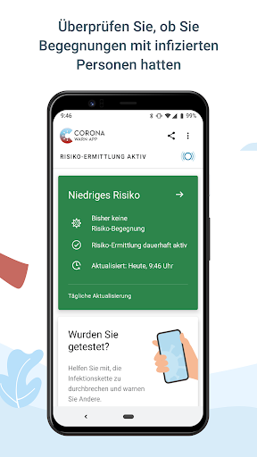
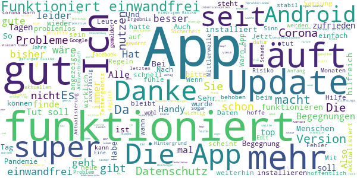
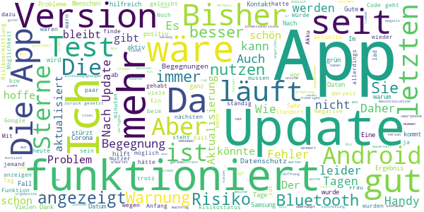
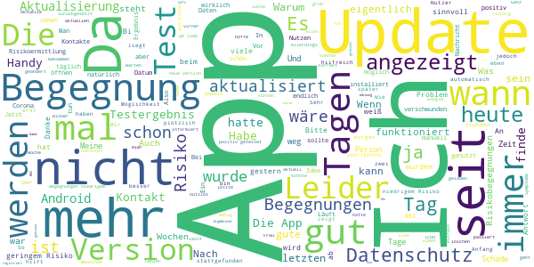

# Corona-Warn-App
App version ``1.7.1``

Analyzed with [covid-apps-observer](http://github.com/covid-apps-observer) project, version ``0.1``

## App overview
| | |
|-------------------------|-------------------------| 
| **Name**&nbsp;&nbsp;&nbsp;&nbsp;&nbsp;&nbsp;&nbsp;&nbsp;&nbsp;&nbsp;&nbsp;&nbsp;&nbsp;&nbsp;&nbsp;&nbsp;&nbsp;&nbsp;&nbsp;&nbsp;&nbsp;&nbsp;&nbsp;&nbsp;&nbsp;&nbsp;&nbsp;&nbsp;&nbsp;&nbsp;&nbsp;&nbsp;&nbsp;&nbsp;&nbsp;&nbsp;&nbsp;&nbsp;&nbsp;&nbsp;  | Corona-Warn-App |
| **Unique identifier** | de.rki.coronawarnapp |
| **Link to Google Play** | [https://play.google.com/store/apps/details?id=de.rki.coronawarnapp](https://play.google.com/store/apps/details?id=de.rki.coronawarnapp) |
| **Summary**  | Gemeinsam Corona bekämpfen |
| **Privacy policy** | [https://www.coronawarn.app/assets/documents/cwa-privacy-notice-de.pdf](https://www.coronawarn.app/assets/documents/cwa-privacy-notice-de.pdf) |
| **Latest version** | 1.7.1 |
| **Last update** | 2020-11-26 18:56:16 |
| **Recent changes** | Dieses Update behebt die Ursache für die nach dem Update auf 1.7.0 vereinzelt auftretenden Abstürze der App. |
| **Installs**  | 10.000.000+ |
| **Category** | Gesundheit & Fitness |
| **First release** | 12.06.2020 |
| **Size**  | 22M |
| **Supported Android version**  | 6.0 oder höher |

### Description
> Das Robert Koch-Institut (RKI) als zentrale Einrichtung des Bundes im Bereich der Öffentlichen Gesundheit und als nationales Public-Health-Institut veröffentlicht die Corona-Warn-App für die deutsche Bundesregierung und für die Bundesrepublik Deutschland. Die App fungiert als digitale Ergänzung zu Abstandhalten, Hygiene und Alltagsmaske. Wer sie nutzt, hilft, Infektionsketten schnell nachzuverfolgen und zu durchbrechen. Die App merkt sich dezentral unsere Begegnungen mit anderen und informiert uns digital, wenn wir Begegnungen mit nachweislich infizierten Personen hatten. Dabei sammelt sie jedoch zu keiner Zeit Informationen zur Identität ihrer Nutzerinnen und Nutzer. Wer wir sind und wo wir sind, bleibt geheim – und unsere Privatsphäre bestens geschützt.
 WIE DIE APP FUNKTIONIERT
 Sind wir unterwegs, sollte die Risiko-Ermittlung immer aktiviert sein. Denn sie ist das Herzstück der Software. Wann immer sich Nutzerinnen und Nutzer begegnen, tauschen ihre Smartphones über Bluetooth verschlüsselte Zufallscodes aus. 
 Diese geben nur Auskunft darüber, über welche Dauer und mit welchem Abstand eine Begegnung stattfand. Welche Person sich hinter einem Code verbirgt, ist für niemanden nachvollziehbar. Die Corona-Warn-App erhebt keine Informationen über den Ort der Begegnung oder den Standort der Nutzerinnen und Nutzer.
 Entsprechend der maximalen Corona-Inkubationszeit werden alle Zufallscodes, die unser Smartphone sammelt, für 14 Tage auf dem Smartphone gespeichert – und dann gelöscht. 
 Nur wenn eine Person sich über die App freiwillig als nachweislich infiziert meldet, erhalten daraufhin alle früheren Begegnungen eine Warnung auf ihr Smartphone. 
 Niemand erfährt, wann, wo oder mit wem eine entsprechende Risiko-Begegnung stattfand. Die infizierte Person bleibt anonym.
 Mit der Benachrichtigung erhalten die betroffenen Nutzer/-innen klare Handlungsempfehlungen. Wichtig: Auch die Daten der Benachrichtigten sind zu keiner Zeit einsehbar.
 WIE DIE DATEN SICHER BLEIBEN
 Die Corona-Warn-App soll uns zwar täglich begleiten. Sie wird uns jedoch nie kennenlernen. Dadurch kann sie niemandem verraten, wer wir sind. Der Datenschutz bleibt über die gesamte Nutzungsdauer zu 100 Prozent gewahrt.
 • Keine Anmeldung: Es müssen keine E-Mail-Adresse und kein Name hinterlegt werden.
 • Keine Rückschlüsse auf Identitäten: Bei einer Begegnung mit einem anderen Menschen tauschen die Smartphones nur Zufallscodes aus. Diese messen, über welche Dauer und mit welchem Abstand ein Kontakt stattfand. Sie lassen aber keine Rückschlüsse auf Personen und Standorte zu. 
 • Dezentrale Speicherung: Die Daten werden nur auf dem Smartphone gespeichert und nach 14 Tagen gelöscht.
 • Keine Einsicht für Dritte: Sowohl die Personen, die eine nachgewiesene Infektion melden, als auch die Benachrichtigten sind nicht nachverfolgbar – nicht für die Bundesregierung, nicht für das Robert Koch-Institut, nicht für andere User und auch nicht für die Betreiber der App-Stores.
 Diese App ist nicht zum Gebrauch außerhalb Deutschlands bestimmt. Die Corona-Warn-App ist die zentrale COVID-19 App für Deutschland und sie ist an das deutsche Gesundheitssystem angeschlossen. Trotzdem ist die Corona-Warn-App auch in diesem Land verfügbar. Sie ist gedacht für alle, die in Deutschland leben, arbeiten, Urlaub machen oder sich regelmäßig oder über längere Zeit in Deutschland aufhalten.
 Es gelten die Nutzungsbedingungen der Corona-Warn-App: https://www.coronawarn.app/assets/documents/cwa-eula-de.pdf. Durch die Installation und Nutzung dieser App stimmen Sie den Nutzungsbedingungen zu.

### User interface
The developers of the app provide the following screenshots in the Google play store.
| | | |
|:-------------------------:|:-------------------------:|:-------------------------:|
 |   |   |   | 
 |   |   |   | 
 |   |  

## Development team
In the following we report the main information provided by the development team in the Google play store.

| | |
|-------------------------|-------------------------|
| **Developer**  | Robert Koch-Institut |
| **Website**  | [https://www.coronawarn.app](https://www.coronawarn.app) |
| **Email** | CoronaWarnApp@rki.de |
| **Physical address**  | [Robert Koch-Institut Nordufer 20 13353 Berlin](https://www.google.com/maps/search/Robert%20Koch-Institut%20Nordufer%2020%2013353%20Berlin) (Google Maps) |
| **Other developed apps**  | [https://play.google.com/store/apps/developer?id=Robert+Koch-Institut](https://play.google.com/store/apps/developer?id=Robert+Koch-Institut) |

## Android support

| | |
|-------------------------|-------------------------|
| **Declared target Android version**  | Android10, version 10 (API level 29) |
| **Effective target Android version**  | Android10, version 10 (API level 29) |
| **Minimum supported Android version**  | Marshmallow, version 6.0 (API level 23) |
| **Maximum target Android version**  | - |

The larger the difference between the minimum and maximum supported Android versions, the better. A larger difference means a wider audience. For example, old phones have a very low Android version, so a high minimum supported Android version means that the app cannot be used by users with old phones, thus leading to accessibility problems. 

## Requested permissions

In the following we report the complete list of the permissions requested by the app. 

| **Permission** | **Protection level** | **Description** | 
|-------------------------|-------------------------|-------------------------|
 **android.permission ACCESS_NETWORK_STATE** | Normal | Allows applications to access information about networks. 
 **android.permission BLUETOOTH** | Normal | Allows applications to connect to paired bluetooth devices. 
 **android.permission CAMERA** | :warning:**Dangerous** | Required to be able to access the camera device. 
 **android.permission FOREGROUND_SERVICE** | Normal | Allows a regular application to use Service.startForeground. 
 **android.permission INTERNET** | Normal | Allows applications to open network sockets. 
 **android.permission RECEIVE_BOOT_COMPLETED** | Normal | Allows an application to receive the Intent.ACTION_BOOT_COMPLETED that is broadcast after the system finishes booting. 
 **android.permission REQUEST_IGNORE_BATTERY_OPTIMIZATIONS** | Normal | Permission an application must hold in order to use Settings.ACTION_REQUEST_IGNORE_BATTERY_OPTIMIZATIONS. 
 **android.permission WAKE_LOCK** | Normal | Allows using PowerManager WakeLocks to keep processor from sleeping or screen from dimming. 

## Mentioned servers

| **Server** | **Registrant** | **Registrant country** | **Creation date** | 
|-------------------------|-------------------------|-------------------------|-------------------------|
 | google.com | Google LLC | :us: US | 1997-09-15 04:00:00 |

## Security analysis 

Below we report the main security warnings raised by our execution of the [Androwarn](https://github.com/maaaaz/androwarn) security analysis tool.

**Connection interfaces exfiltration**
> - This application reads details about the currently active data network 
> - This application tries to find out if the currently active data network is metered 

**Telephony services abuse**
> - This application makes phone calls 

**Suspicious connection establishment**
> - This application opens a Socket and connects it to the remote address '; port is out of range' on the 'N/A' port  
> - This application opens a Socket and connects it to the remote address 'Lcom/android/tools/r8/GeneratedOutlineSupport;->outline21(Ljava/lang/String;)Ljava/lang/StringBuilder;' on the 'N/A' port  
> - This application opens a Socket and connects it to the remote address 'Ljava/net/Proxy;->type()Ljava/net/Proxy$Type;' on the 'N/A' port  
> - This application opens a Socket and connects it to the remote address 'Method sendUrgentData() is not supported.' on the 'N/A' port  
> - This application opens a Socket and connects it to the remote address 'Method setHandshakeTimeout() is not supported.' on the 'N/A' port  
> - This application opens a Socket and connects it to the remote address 'Method setOOBInline() is not supported.' on the 'N/A' port  
> - This application opens a Socket and connects it to the remote address 'Method setSoWriteTimeout() is not supported.' on the 'N/A' port  
> - This application opens a Socket and connects it to the remote address 'Socket closed' on the 'N/A' port  
> - This application opens a Socket and connects it to the remote address 'Socket is closed' on the 'N/A' port  
> - This application opens a Socket and connects it to the remote address 'Socket is closed.' on the 'N/A' port  
> - This application opens a Socket and connects it to the remote address 'Socket is not connected.' on the 'N/A' port  
> - This application opens a Socket and connects it to the remote address 'socket is closed' on the 'N/A' port  
> - This application opens a Socket and connects it to the remote address 'timeout' on the 'N/A' port  

**Code execution**
> - This application loads a native library 
> - This application loads a native library: 'conscrypt_gmscore_jni' 
> - This application loads a native library: 'conscrypt_jni' 

## User ratings and reviews

Below we provide information about how end users are reacting to the app in terms of ratings and reviews in the Google Play store.

### Ratings

The Corona-Warn-App app has been installed by more than **10000000** times. At this time, **97384** rated the app and its average score is **3.0680912**. Below we show the distribution of the ratings across the usual star-based rating of Google Play

:star::star::star::star::star:: 35107

:star::star::star::star:: 9837

:star::star::star:: 11031

:star::star:: 9399

:star:: 32010

### Reviews 

#### 5-star reviews

> Ich bin sehr zufrieden, das es so etwas wie die Corona App gibt. Natürlich ist das alles nicht so schön, gerade in dieser Weihnachtszeit. Aber ich denke die Hoffnung stirbt zuletzt. An alle da draußen trotzdem wir eine schwierige Zeit durch machen ein schönes gesundes Weihnachtsfest. LG.Doris  :date: __2020-12-05 17:41:46__

> macht genau das was sie soll kann ich nur jedem empfehlen  :date: __2020-12-05 16:35:31__

> Die App läuft echt super bin sehr zu Frieden  :date: __2020-12-05 15:09:53__

> Super. Vorbildlich entwickelt, Datenschutz wird groß geschrieben. Edit: ich habe einen Test gescannt. Am Tag danach habe ich von meinem Arzt erfahren, dass der Test negativ ist. In der App ist das Ergebnis auch heute, drei Tage später "nicht verfügbar". Was soll das denn bitte?  :date: __2020-12-05 14:07:56__

> 👍🏻  :date: __2020-12-05 13:54:12__

> Funktioniert und wird verbessert  :date: __2020-12-05 12:02:14__

> sie ist sehr hilfreich  :date: __2020-12-05 11:41:35__

> Wenn die Labore auch das Häkchen bei den Test nicht vergessen, wären sxhneller die Ergebnisse vorhanden. Habe 3 x im Labor nachfragen müssen für das Ergebnis.  :date: __2020-12-05 10:22:33__

> Also ich hätte da eine frage ich bin mittlerweile in Quarantäne weil meine schwester Corona hat und ich wollte fragen ob ich nach 10 tagen einen schnelltest machen kann und wenn er negativ ist kann ich wieder raus?  :date: __2020-12-05 08:50:44__

> Funktioniert anstandslos auf dem Smartphone Samsung Galaxy Note8. Fragen: Wie funktioniert die App bei einer Smartwatch .. z.B. Samsung Galaxy Watch3? Wie bekomme ich die App auf die Smartwatch?  :date: __2020-12-05 08:41:56__

#### 4-star reviews

> Ich habe den QR Code nach einem Test eingescannt. Leider funktioniert es nicht das man das Ergebnis bekommt. Ich habe es erfahren, nach dem ich beim Gesundheitsamt angerufen habe. In dem Fall taugt die App nicht wirklich was.  :date: __2020-12-05 17:53:43__

> Meine App ist 14 Tage bei grün warum geht. das nicht neu 14 Tage los ? 🎅🙋  :date: __2020-12-05 15:28:48__

> Funktioniert leider nicht immer.  :date: __2020-12-05 12:58:01__

> Funktioniert einfach nicht, immer wieder Fehlermeldungen. Hab die App nun neu installiert, ein paar Tage ging alles gut. Nun wieder der Fehler 9002. Hab die App noch mal installiert, nun funktioniert sie seid ca. 4 Wochen einwandfrei.  :date: __2020-12-05 11:26:18__

> Hallo wieso funktioniert seit dem Update meine Risikoermittlung nicht mehr. Die ist gestoppt und lässt sich nicht mehr aktivieren. Auch mit löschen und neu installieren, sowie auch in System Einstellungen nicht. Danke  :date: __2020-12-05 09:33:32__

> Mit der neuesten Version ist der: Fehler 3 (39508) nicht mehr aufgetreten - leider aber nun seit 30. Nov. neue Version alter Fehler, keine Aktualisierung mehr? Ist hier bei der neuen Version ein altes Problem wieder importiert worden? Schade!  :date: __2020-12-05 08:28:44__

> Läuft mittlerweile sehr Zuverlässig. Danke  :date: __2020-12-05 08:01:25__

> problemlos, wäre schön, sie würde noch mehr genutzt werden. Bei einer Freundin schaltet die app immer wieder von rot nach grün und zurück. Erst kam eine Meldung eines 6 Tage alten Kontakts, dann Entwarnung, der Kontakt liege mehr als 14 Tage zurück, dann wieder 7 Tage alter Kontakt usf. Da hat sich wohl ein Fehler eingeschlichen.  :date: __2020-12-04 21:38:46__

> Mit P8lite und Android 6 funktioniert es nicht. Stundenlanges lesen in faq, Einstellungen nachgeschaut und techn. Hotline .... die APP läuft nicht. Das war es dann .... deinstalliert. Ich gebe auf. Inzwischen habe ich die APP erneut installiert. Jetzt bekomme ich den Fehler 9002. 22.10. läuft nicht. 4.12. Seit 14 Tagen läuft die APP einwandfrei.  :date: __2020-12-04 18:25:38__

> Nachtrag 26.11.2020 App stürzt sofort oder nach wenigen Minuten ab und läßt sich nicht mehr starten.de und neuistall, Cache leeren, Neustart des handy bringt keine besserung. 27.11.2020 läuft wieder, danke. Nachtrag 04.12.2020 wieder das selbe Problem. Erste Einrichtung läuft, am nächsten Tag wieder Abstürze. Habe testhalber Akkuoptimierung abgestellt.  :date: __2020-12-04 11:08:28__

#### 3-star reviews

> Ich halte die Corona-Warn-App für ein wichtiges Werkzeug im Kampf gegen die Corona-Pandemie. Nur leider funktioniert sie seit dem letzten Update nicht mehr: Nach dem Start passiert eine Weile nichts, dann erscheint die Meldung "Corona-Warn wurde beendet". Ich hatte dann jedes Mal auf den Button "Melden" gedrückt. Ob es etwas gebracht hat? Auch eine Neuinstallation war zwecklos. Wieder kam die o.g. Meldung. Bis zum Update lief die App übrigens problemlos. Was bringt die Warn-App, wenn sie nicht mehr läuft? Ich würde mich sehr freuen, wenn das RKI möglichst schnell nachbessern würde. Drei Sterne, weil sie bis zum Update keine Probleme machte. (Ach ja: Es handelt sich um ein Smartphone auf mit Android 8.0.0)  :date: __2020-12-05 16:07:27__

> App ist gut wenn sie sich nicht andauernd selber beenden würde. Wie soll ich da wissen ob oder ob jemand C. hat oder nicht das ist wirklich nicht hilfreich  :date: __2020-12-05 15:24:31__

> Der Nachteil ist halt das viele Leute die App nicht nutzen... Ich hatte bereits engen Kontakt zu 3 corona positiv getesteten Personen und die App sagt alles grün...  :date: __2020-12-05 13:35:08__

> Schade das sie nicht mit der französischen App kommunizieren kann. Für mich als Pendlerin in Frankreich wohnend,in Deutschland arbeitend wäre es eine Bereicherung zumal ich den öffentlichen Nahverkehr nutzen muss.  :date: __2020-12-05 13:18:51__

> Manchmal Probleme mit dem Datenabgleich der Infizierten. Ansonsten solide und sicher umgesetzt (bezüglich Datenschutz). Hoffentlich verwenden viele Menschen diese App, damit trotz menschlicher Dummheit Infektionsketten besser verfolgt werden können. V 1.7 stürzte bei mir ab, V 1.7.1 hat das Problem vorübergehend behoben. Nachtrag 1.12.2020: App stürzt wieder ab! 2 Sterne Abzug! P.S.: Nach der Installation/Update lässt sich der Fehler nicht reproduzieren (bitte Info an QA geben).  :date: __2020-12-05 12:14:35__

> An sich ist die App sehr hilfreich...Finde es ein bisschen schade, dass sie nur wenn GPS an ist auch läuft bei Android, obwohl die App eigentlich nur über Bluetooth zugreift:( Zudem finde ich sollte es bei hohem Risiko die Möglichkeit geben, dass man sich kostenlos testen darf, da nicht jeder einfach in Selbstquarantäne gehen kann oder das Geld für einen Coronatest aufbringen kann! (Ich hatte allerdings bis jetzt keine Erfahrungen mit hohem Risiko oder mit dem Eintragen des Testergebnis)  :date: __2020-12-05 11:58:58__

> Ich hab die app auch und was ist mein ergebnis weiß ich nur mündlich und in der app wird es mir nicht angezeigt seltsam.  :date: __2020-12-05 11:52:54__

> App an sich gut aber nützt letztendlich nichts wenn ich mit den Nerven dann blank liege und nicht aussagekräftige Hilfe bekomme Meldung von 2 Risikobegegnungen in den letzten 7 Tagen mit einem Schlag, nur Auskünfte machen sie das was die App sagt oder Test nur wenn ich sage das ich Schnupfen habe und so weiter und so fort. Nachdenken wo und wann das gewesen sein könnte Dafür brauche ich die App nicht und lebe ruhiger und entspannter Vielleicht doch mal ein Update mit genauem Tag  :date: __2020-12-05 11:14:20__

> Meine App aktualisiert nicht mehr, obwohl ich die neueste Version 1.7.1 habe. Neustart des Smartphones hat nichts genützt. Ich benutze ein Samsung Galaxy mit der Androidversion 10. Was soll ich tun? Löschen und Neuinstallation ? App zurücksetzen und was dann ?  :date: __2020-12-05 10:42:32__

> Die App lässt sich wieder nicht mehr öffnen, auch das zweite Update hat nur kurz funktioniert.  :date: __2020-12-05 09:28:47__

#### 2-star reviews

> ist ok  :date: __2020-12-05 16:21:17__

> Seit dem letzten Update bekomme ich immer wieder den Hinweis, dass die App zu viel Akku verbraucht. Die Meldung kommt vom Android Betriebssystem.  :date: __2020-12-05 15:28:58__

> ob sie ihren Dienst tut oder nicht, weiß man nicht. Dass das Ding 20Millionen Euro gekostet hat, ist unverschämt, insbesondere dass das noch kein Bißchen weiterentwickelt wurde. Warum kann einem die App z.B. nicht sagen, welche Coronabestimmungen an dem Ort gelten, an dem ich mich gerade befinde… ? Einfachste Funktionen werden nicht integriert. Jeder Informatikstudent im Vierten Semester programmiert dieses Ding mal schnell in der Mittagspause…  :date: __2020-12-05 15:24:53__

> Ich hatte - allein auf Arbeit- mit mindestens 30 Positive Kontakt. Die App meldete mir insgesamt 3. So macht diese App keinen Sinn.  :date: __2020-12-05 14:30:54__

> Hallo! Bis zum letzten Update ,hat die App bis auf am Anfang gut funktioniert. Leider geht nichts mehr seit dem letzten Update. Die App lädt und stürzt dann immer wieder ab. Eine Neuinstallation konnte das Problem nicht beheben. Ich habe das Android 8 Betriebssystem. Mit der nächsten Aktualisierung hoffe sehr, dass der Fehler behoben werden kann. MfG  :date: __2020-12-05 13:57:07__

> Wieder einmal, trotz neuestem Update !! zählt die App nur bis zum 13.Tag. Tagelang schon!!! Musste sie davor neu installieren, da sie sich überhaupt nicht mehr öffnen lies. Traurig, das es immer und immer wieder solche Probleme gibt. Zuverlässig geht anders....  :date: __2020-12-05 12:17:23__

> Letzte Aktualisierung 27.11. Seitdem nicht mehr  :date: __2020-12-05 11:21:23__

> Corona Test gemacht und in der App registriert. Das (zum Glück negative) Ergebnis wurde mir vorgestern vom Hausarzt mitgeteilt. In der App wird weiterhin angezeigt, dass das Ergebnis noch nicht vorläge. Wenn die Testergebnisse erst sehr verspätet oder gar nicht angezeigt werden und für Kontaktpersonen entsprechend keine risikobegegnungen angezeigt werden, wird der Sinn einfach verfehlt...  :date: __2020-12-05 11:15:48__

> Nicht immer verfügbar.  :date: __2020-12-05 10:54:46__

> Die App stürzt immer nach dem Start direkt ab. Keine Möglichkeit mehr nachzuvollziehen, ob ich Risikokontakte hätte.  :date: __2020-12-05 10:27:14__

#### 1-star reviews

> Die App lässt sich schon wieder nicht öffnen. Im November gab es das Problem schonmal. Ich musste dann die App neu installieren, um die neueste Version nach der Fehlerbehebung zu erhalten. Alle Kontakte waren somit verloren. Jetzt lässt sie sich schon wieder nicht öffnen. Wenn ich jetzt wieder neu installieren, sind meine Kontakte der letzten Woche wieder weg. So macht die App absolut keinen Sinn  :date: __2020-12-05 17:49:21__

> So nach wochen der Abstinenz die app neu geladen ! Jetzt lässt sie sich nicht öffnen ! Wird beim öffnen automatich ausgeschaltet !  :date: __2020-12-05 16:42:04__

> Halloooopüp4hinzuzufügen  :date: __2020-12-05 16:23:13__

> Leider nicht nützlich, da ich meinen positiven Befund nicht eintragen kann. Habe keinen QR-Code und keine TAN. Bis der Brief vom Gesundheitsamt kommt, ist die Quarantäne vermutlich vorbei. Weiterhin kann der positive Test meines Sohnes nicht berücksichtigt werden, da er kein eigenes Handy besitzt (ist 14 Monate alt).  :date: __2020-12-05 16:20:44__

> Seit dem letzten Update am 09.11.2020 stürzt die APP auf meinem Smartphone (Wileyfox Smart +) direkt nach dem Start ab. Eine Deinstallation geht auch nicht, die APP wird zwar in den Einstellungen nicht mehr angezeigt, der Google Play Store behauptet aber weiterhin, sie sei noch installiert. In diesem Zustand ist die APP unbrauchbar. Nachtrag am 19.11.2020: Auch nach dem Update auf Version 1.6.1 hat sich das Verhalten der APP nicht geändert. 05.12.2020: Auch Version 1.7.1 geht nicht.  :date: __2020-12-05 16:18:57__

> Nr 4. Dreimal habt ihr meine Bewertung schon gelöscht! So bekommt man immer eine Bessere Bewertung! Es ist immer noch ein Akkufresser....  :date: __2020-12-05 16:09:14__

> Ein Armutszeugnis wie oft die Aktualisierung nicht funktioniert  :date: __2020-12-05 16:08:51__

> Nach mehr als 3 Wochen ist das Testergebnis noch immer nicht in der App angekommen... Lediglich über den Hilfzettel kann das Ergebnis abgerufen werden.  :date: __2020-12-05 15:39:42__

> Alles propaganda...  :date: __2020-12-05 15:23:37__

> Soll das ein Witz sein? Drei Updates, jedesmal funktionierte die App nicht. Wird jetzt endgültig deinstalliert.  :date: __2020-12-05 14:59:16__

