# Corona-Warn-App
App version ``1.9.1``

Analyzed with [covid-apps-observer](http://github.com/covid-apps-observer) project, version ``0.1``

## App overview
| | |
|-------------------------|-------------------------| 
| **Name**&nbsp;&nbsp;&nbsp;&nbsp;&nbsp;&nbsp;&nbsp;&nbsp;&nbsp;&nbsp;&nbsp;&nbsp;&nbsp;&nbsp;&nbsp;&nbsp;&nbsp;&nbsp;&nbsp;&nbsp;&nbsp;&nbsp;&nbsp;&nbsp;&nbsp;&nbsp;&nbsp;&nbsp;&nbsp;&nbsp;&nbsp;&nbsp;&nbsp;&nbsp;&nbsp;&nbsp;&nbsp;&nbsp;&nbsp;&nbsp;  | Corona-Warn-App |
| **Unique identifier** | de.rki.coronawarnapp |
| **Link to Google Play** | [https://play.google.com/store/apps/details?id=de.rki.coronawarnapp](https://play.google.com/store/apps/details?id=de.rki.coronawarnapp) |
| **Summary**  | Gemeinsam Corona bekämpfen |
| **Privacy policy** | [https://www.coronawarn.app/assets/documents/cwa-privacy-notice-de.pdf](https://www.coronawarn.app/assets/documents/cwa-privacy-notice-de.pdf) |
| **Latest version** | 1.9.1 |
| **Last update** | 2020-12-17 12:33:50 |
| **Recent changes** | Dieses Update enthält Fehlerbehebungen und Textanpassungen sowie folgende Änderungen:  - Umstellung auf Version 2.0 des Exposure Notification Frameworks von Google - Geänderte Darstellung auf der Risikokarte: Die rote Karte zeigt die Anzahl Tage mit Begegnungen mit erhöhtem Risiko sowie den Tag (Datum) der letzten dieser Begegnungen, die grüne Karte die Anzahl Tage mit Begegnungen mit niedrigem Risiko. - Die Funktion zum Teilen eines positiven Testergebnisses wurde überarbeitet. |
| **Installs**  | 10.000.000+ |
| **Category** | Gesundheit & Fitness |
| **First release** | 12.06.2020 |
| **Size**  | 21M |
| **Supported Android version**  | 6.0 oder höher |

### Description
> Das Robert Koch-Institut (RKI) als zentrale Einrichtung des Bundes im Bereich der Öffentlichen Gesundheit und als nationales Public-Health-Institut veröffentlicht die Corona-Warn-App für die deutsche Bundesregierung und für die Bundesrepublik Deutschland. Die App fungiert als digitale Ergänzung zu Abstandhalten, Hygiene und Alltagsmaske. Wer sie nutzt, hilft, Infektionsketten schnell nachzuverfolgen und zu durchbrechen. Die App merkt sich dezentral unsere Begegnungen mit anderen und informiert uns digital, wenn wir Begegnungen mit nachweislich infizierten Personen hatten. Dabei sammelt sie jedoch zu keiner Zeit Informationen zur Identität ihrer Nutzerinnen und Nutzer. Wer wir sind und wo wir sind, bleibt geheim – und unsere Privatsphäre bestens geschützt.
 WIE DIE APP FUNKTIONIERT
 Sind wir unterwegs, sollte die Risiko-Ermittlung immer aktiviert sein. Denn sie ist das Herzstück der Software. Wann immer sich Nutzerinnen und Nutzer begegnen, tauschen ihre Smartphones über Bluetooth verschlüsselte Zufallscodes aus. 
 Diese geben nur Auskunft darüber, über welche Dauer und mit welchem Abstand eine Begegnung stattfand. Welche Person sich hinter einem Code verbirgt, ist für niemanden nachvollziehbar. Die Corona-Warn-App erhebt keine Informationen über den Ort der Begegnung oder den Standort der Nutzerinnen und Nutzer.
 Entsprechend der maximalen Corona-Inkubationszeit werden alle Zufallscodes, die unser Smartphone sammelt, für 14 Tage auf dem Smartphone gespeichert – und dann gelöscht. 
 Nur wenn eine Person sich über die App freiwillig als nachweislich infiziert meldet, erhalten daraufhin alle früheren Begegnungen eine Warnung auf ihr Smartphone. 
 Niemand erfährt, wann, wo oder mit wem eine entsprechende Risiko-Begegnung stattfand. Die infizierte Person bleibt anonym.
 Mit der Benachrichtigung erhalten die betroffenen Nutzer/-innen klare Handlungsempfehlungen. Wichtig: Auch die Daten der Benachrichtigten sind zu keiner Zeit einsehbar.
 WIE DIE DATEN SICHER BLEIBEN
 Die Corona-Warn-App soll uns zwar täglich begleiten. Sie wird uns jedoch nie kennenlernen. Dadurch kann sie niemandem verraten, wer wir sind. Der Datenschutz bleibt über die gesamte Nutzungsdauer zu 100 Prozent gewahrt.
 • Keine Anmeldung: Es müssen keine E-Mail-Adresse und kein Name hinterlegt werden.
 • Keine Rückschlüsse auf Identitäten: Bei einer Begegnung mit einem anderen Menschen tauschen die Smartphones nur Zufallscodes aus. Diese messen, über welche Dauer und mit welchem Abstand ein Kontakt stattfand. Sie lassen aber keine Rückschlüsse auf Personen und Standorte zu. 
 • Dezentrale Speicherung: Die Daten werden nur auf dem Smartphone gespeichert und nach 14 Tagen gelöscht.
 • Keine Einsicht für Dritte: Sowohl die Personen, die eine nachgewiesene Infektion melden, als auch die Benachrichtigten sind nicht nachverfolgbar – nicht für die Bundesregierung, nicht für das Robert Koch-Institut, nicht für andere User und auch nicht für die Betreiber der App-Stores.
 Diese App ist nicht zum Gebrauch außerhalb Deutschlands bestimmt. Die Corona-Warn-App ist die zentrale COVID-19 App für Deutschland und sie ist an das deutsche Gesundheitssystem angeschlossen. Trotzdem ist die Corona-Warn-App auch in diesem Land verfügbar. Sie ist gedacht für alle, die in Deutschland leben, arbeiten, Urlaub machen oder sich regelmäßig oder über längere Zeit in Deutschland aufhalten.
 Es gelten die Nutzungsbedingungen der Corona-Warn-App: https://www.coronawarn.app/assets/documents/cwa-eula-de.pdf. Durch die Installation und Nutzung dieser App stimmen Sie den Nutzungsbedingungen zu.

### User interface
The developers of the app provide the following screenshots in the Google play store.
| | | |
|:-------------------------:|:-------------------------:|:-------------------------:|
 | 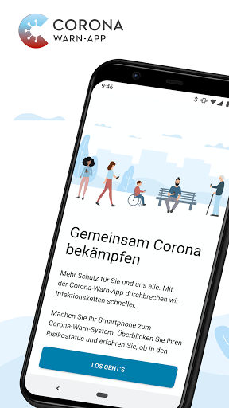  | 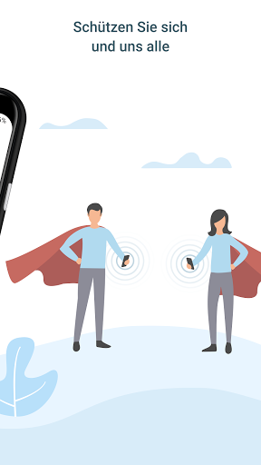  | 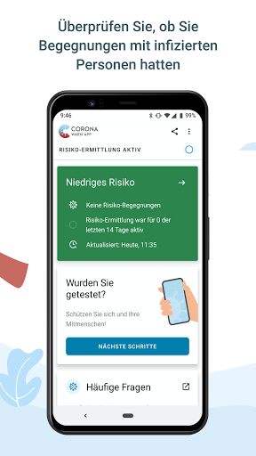  | 
 | 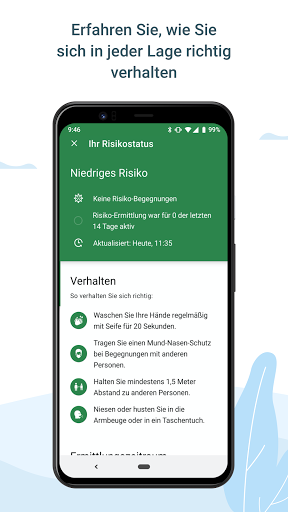  | 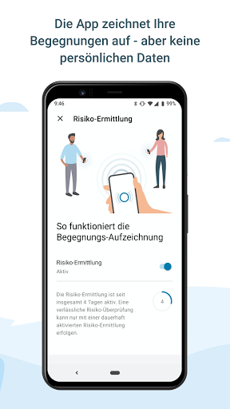  | 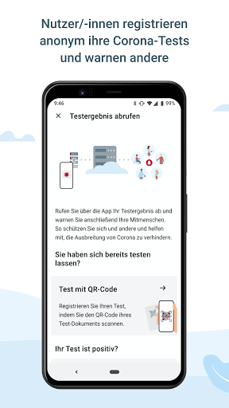  | 
 | 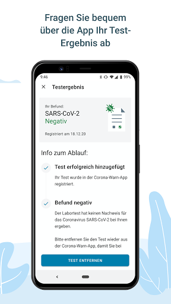  | 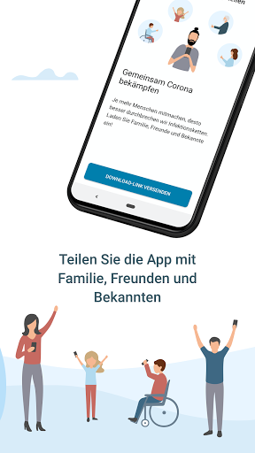 

## Development team
In the following we report the main information provided by the development team in the Google play store.

| | |
|-------------------------|-------------------------|
| **Developer**  | Robert Koch-Institut |
| **Website**  | [https://www.coronawarn.app](https://www.coronawarn.app) |
| **Email** | CoronaWarnApp@rki.de |
| **Physical address**  | [Robert Koch-Institut Nordufer 20 13353 Berlin](https://www.google.com/maps/search/Robert%20Koch-Institut%20Nordufer%2020%2013353%20Berlin) (Google Maps) |
| **Other developed apps**  | [https://play.google.com/store/apps/developer?id=Robert+Koch-Institut](https://play.google.com/store/apps/developer?id=Robert+Koch-Institut) |

## Android support

| | |
|-------------------------|-------------------------|
| **Declared target Android version**  | Android10, version 10 (API level 29) |
| **Effective target Android version**  | Android10, version 10 (API level 29) |
| **Minimum supported Android version**  | Marshmallow, version 6.0 (API level 23) |
| **Maximum target Android version**  | - |

The larger the difference between the minimum and maximum supported Android versions, the better. A larger difference means a wider audience. For example, old phones have a very low Android version, so a high minimum supported Android version means that the app cannot be used by users with old phones, thus leading to accessibility problems. 

## Requested permissions

In the following we report the complete list of the permissions requested by the app. 

| **Permission** | **Protection level** | **Description** | 
|-------------------------|-------------------------|-------------------------|
 **android.permission ACCESS_NETWORK_STATE** | Normal | Allows applications to access information about networks. 
 **android.permission BLUETOOTH** | Normal | Allows applications to connect to paired bluetooth devices. 
 **android.permission CAMERA** | :warning:**Dangerous** | Required to be able to access the camera device. 
 **android.permission FOREGROUND_SERVICE** | Normal | Allows a regular application to use Service.startForeground. 
 **android.permission INTERNET** | Normal | Allows applications to open network sockets. 
 **android.permission RECEIVE_BOOT_COMPLETED** | Normal | Allows an application to receive the Intent.ACTION_BOOT_COMPLETED that is broadcast after the system finishes booting. 
 **android.permission REQUEST_IGNORE_BATTERY_OPTIMIZATIONS** | Normal | Permission an application must hold in order to use Settings.ACTION_REQUEST_IGNORE_BATTERY_OPTIMIZATIONS. 
 **android.permission WAKE_LOCK** | Normal | Allows using PowerManager WakeLocks to keep processor from sleeping or screen from dimming. 

## Mentioned servers

| **Server** | **Registrant** | **Registrant country** | **Creation date** | 
|-------------------------|-------------------------|-------------------------|-------------------------|
 | google.com | Google LLC | :us: US | 1997-09-15 04:00:00 |

## Security analysis 

Below we report the main security warnings raised by our execution of the [Androwarn](https://github.com/maaaaz/androwarn) security analysis tool.

**Connection interfaces exfiltration**
> - This application reads details about the currently active data network 
> - This application tries to find out if the currently active data network is metered 

**Telephony services abuse**
> - This application makes phone calls 

**Suspicious connection establishment**
> - This application opens a Socket and connects it to the remote address '; port is out of range' on the 'N/A' port  
> - This application opens a Socket and connects it to the remote address 'Lcom/android/tools/r8/GeneratedOutlineSupport;->outline20(Ljava/lang/String;)Ljava/lang/StringBuilder;' on the 'N/A' port  
> - This application opens a Socket and connects it to the remote address 'Ljava/net/Proxy;->type()Ljava/net/Proxy$Type;' on the 'N/A' port  
> - This application opens a Socket and connects it to the remote address 'Method sendUrgentData() is not supported.' on the 'N/A' port  
> - This application opens a Socket and connects it to the remote address 'Method setHandshakeTimeout() is not supported.' on the 'N/A' port  
> - This application opens a Socket and connects it to the remote address 'Method setOOBInline() is not supported.' on the 'N/A' port  
> - This application opens a Socket and connects it to the remote address 'Method setSoWriteTimeout() is not supported.' on the 'N/A' port  
> - This application opens a Socket and connects it to the remote address 'Socket closed' on the 'N/A' port  
> - This application opens a Socket and connects it to the remote address 'Socket is closed' on the 'N/A' port  
> - This application opens a Socket and connects it to the remote address 'Socket is closed.' on the 'N/A' port  
> - This application opens a Socket and connects it to the remote address 'Socket is not connected.' on the 'N/A' port  
> - This application opens a Socket and connects it to the remote address 'socket is closed' on the 'N/A' port  
> - This application opens a Socket and connects it to the remote address 'timeout' on the 'N/A' port  

**Code execution**
> - This application loads a native library 
> - This application loads a native library: 'conscrypt_gmscore_jni' 
> - This application loads a native library: 'conscrypt_jni' 

## User ratings and reviews

Below we provide information about how end users are reacting to the app in terms of ratings and reviews in the Google Play store.

### Ratings

The Corona-Warn-App app has been installed by more than **10000000** times. At this time, **103563** rated the app and its average score is **3.0943842**. Below we show the distribution of the ratings across the usual star-based rating of Google Play

:star::star::star::star::star:: 38513

:star::star::star::star:: 10869

:star::star::star:: 10537

:star::star:: 9168

:star:: 34476

### Reviews 

#### 5-star reviews

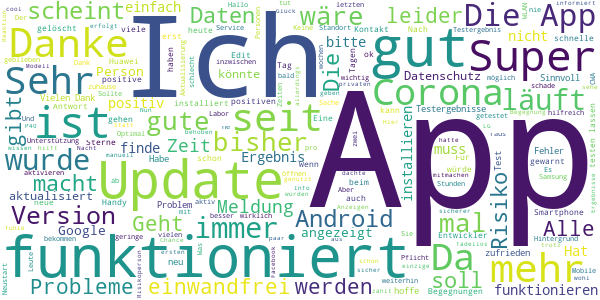

> Nun trotz Version 1.0.4 zählt die App nur 14 von 14 Tagen! Die App wurde am ersten Tag der Verfügbarkeit installiert. Solange sie macht was sie soll ist alles gut.  :date: __2020-12-28 10:35:49__

> Sehr sichere und gut funktionierende App. Sehr gute Übersicht. Mir ist wichtig, dass meine Daten sicher sind und ich entscheide, wie ich mit der Meldung umgehe. Keine falschen Quarantänen.  :date: __2020-12-28 08:50:19__

> Das einzige Manko an dieser App sind die geringen Nutzerzahlen.  :date: __2020-12-28 06:22:12__

> Es erfolgt jeden Tag und Nacht eine Aktualisierung , ich fühle mich daher etwas sicherer. Kay Ahrens  :date: __2020-12-28 03:36:20__

> Super App!  :date: __2020-12-28 01:35:46__

> Sehr gut  :date: __2020-12-28 00:17:19__

> Eine gute Sache!  :date: __2020-12-27 22:56:08__

> Funktioniert.  :date: __2020-12-27 22:18:17__

> Ich habe bisher noch keinerlei Erfahrung bisher noch keinerlei Erfahrung  :date: __2020-12-27 20:23:27__

> Die App hilft davor uns mit dem coronavierus zu infizieren  :date: __2020-12-27 20:02:28__

#### 4-star reviews

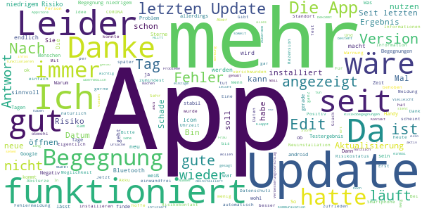

> Insgesamt funktioniert alles, bin soweit zufrieden. Bin zu der Version ohne Google-Implementierung gewechselt. Gibt es um alternativen App-Store 🙂  :date: __2020-12-28 10:20:22__

> Ich habe bis jetzt keine Probleme mit der App gehabt. Verbesserungsvorschlag: Regionale Statistiken nach PLZ oder neue Verordnungen  :date: __2020-12-28 01:41:04__

> Sehr nützlich 👋  :date: __2020-12-27 23:25:21__

> Schwer zu bewerten. Man wäre ja Kontaktperson, wenn man benachrichtigt wird. Wenn die App nichts tut, ist das wohl ein gutes Zeichen. Was leider nicht funktioniert : die Benachrichtigung über ein Testergebnis. Eine Woche später war das Ergebnis per Mail und als Brief da, aber die App behauptete immer noch, das der Test noch nicht ausgewertet sei.  :date: __2020-12-27 21:58:56__

> Klappt gut  :date: __2020-12-27 19:15:20__

> Testergebnis kam prompt über die App und viel schneller als vom Gesundheitsamt. Hilft natürlich nichts, wenn manche die App haben, aber Bluetooth und Standort nicht nutzen wollen, obwohl sie sonst überall bei Online-Käufen ihre Daten nennen, hier aber nicht, dann sind es einfach zu wenig Daten  :date: __2020-12-27 16:12:28__

> EDIT: App funktioniert jetzt wieder normal und hat mehr Funktionen 👍. Verbesserungsvorschlag: Für alle die WOLLEN sollen auch ihren Standort freigeben können sodass man auch herausfinden kann wo die Begegnung stattgefunden hat. Dies soll dann aber nur eine FREIWILLIGE Funktion sein. Außerdem wenn man ein positives Ergebnis bekommt soll dies verpflichtend und automatisch gemeldet werden und nicht so wie jetzt dass der Nutzer entscheiden kann,ob sein Positiv-Ergebnis gepostet wird.  :date: __2020-12-27 15:21:29__

> Nach dem Wiedereinschalten des Smartphones ist das Icon der App verschwunden. Über den Appstore ist sie zwar doch erreichbar. Aber wo ist das Icon? Also wieder mal neu installieren? Das nervt schon..... Und die "Lieschen Müller" werden das nicht tun...  :date: __2020-12-27 14:23:57__

> Klo  :date: __2020-12-27 12:15:09__

> In dieser Zeit sehr nützlich  :date: __2020-12-27 12:12:19__

#### 3-star reviews

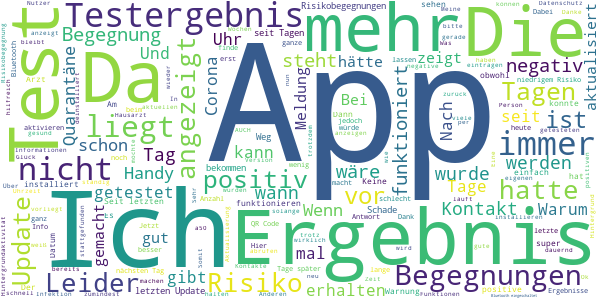

> Die App war eine große Belastung für meinen Akku. Ich musste mein Handy drei mal so häufig laden wie sonst. Über Nacht waren über 30% verbraucht worden.  :date: __2020-12-28 12:17:53__

> Für die testauswertung ist sie Ok,weil man über den Barcode das Testergebnis ziemlich rasch bekommt. Nachdem ich positiv getestet war,konnte ich nichts mehr einsehen. Mein Mann hat die App auch installiert. Bei ihm wurde die ganze Zeit das Infektionsrisiko als niedrig eingestuft,da er 0 Kontakte hatte. Ich war positiv!!!!Und er in Quarantäne. Haben unsere Handys nebeneinander gelegt. Trotzdem kein Risiko. Seltsam. Darum habe ich die App wieder gelöscht  :date: __2020-12-28 12:01:42__

> In der App kann ich die Priorisierte Hintergrundaktivität nicht aktivieren.  :date: __2020-12-28 11:31:15__

> Ist Schrott  :date: __2020-12-28 10:46:22__

> Bis zum Ablauf meiner Quarantäne wegen Infektion war die App für einen selbst gut. Wenn man einmal positiv gemeldet hat zählen nur noch die Anderen und nicht die erkrankte Person die sich auch durchaus erneut anstecken kann. Ganz schwache ethische Umsetzung! Wenn ich die Anwendung zurücksetze kann ich auch keine Anderen mehr warnen. Somit ergibt sich hier die Gretchenfrage, die Anderen oder Ich. Uncool!  :date: __2020-12-28 10:21:51__

> Die App sieht nicht vor, dass man wieder gesund wird und sich evtl. wieder infizieren kann.  :date: __2020-12-28 10:02:57__

> ### PROBIERT (AUCH) LUCA! ### Warnte mich öfter mal, wobei die TATSÄCHLICHE Gefährdung erst mit Abgleich klar wird. Anzeige der ANZAHL von Kontakten mit anderen Corona-Warn-App-Nutzern würde Transparenz, Nachvollziehbarkeit und damit auch Akzeptanz stark erhöhen. Die nicht flächendeckende Anbindung von Gesundheitsämtern ist eine Schande bei den Millionen-Kosten. Adressen auf Zetteln & Faxe aus Gesundheitsämtern sollten durch so eine App ÜBERFLÜSSIG werden! ### PROBIERT (AUCH) LUCA! ###  :date: __2020-12-28 08:10:45__

> Trotz app war ich positiv hat nicht gewarnt kein Risiko Begegnung angezeigt  :date: __2020-12-27 20:09:58__

> In der aktuellen Version wird das Datum des Tests nicht aktualisiert, es wird weiter das Datum eines vorherigen Tests angezeigt.  :date: __2020-12-27 18:38:56__

> Ich wurde am 22.12 getestet und habe am nächsten Tag vom Arzt mein Ergebnis erfahren, laut App liegt mein Ergebnis aber immer noch nicht vor. Wenn mein Arzt mich nicht über das negativ Ergebnis informiert hätte, würde ich immer noch unnötig in Quarantäne sitzen. Sehr schlecht gemacht.  :date: __2020-12-27 17:28:34__

#### 2-star reviews

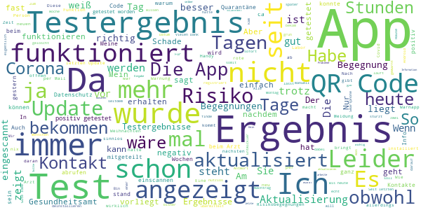

> Meine letzte Aktualisierung des Risiko Updates war vorgestern und seitdem bekomme ich auch immer eine Nachricht ich soll aktualisieren was ich selber aber nicht kann .. schade dass es nicht funktioniert denn ich arbeite systemrelevant und finde das sehr wichtig  :date: __2020-12-28 11:41:38__

> QR Code scanner funktioniert nicht. Ich habe den QR Code direkt vom Zettel, über den PC vergrößert und neu erzeugt abzufotografieren. Kein Erfolg. Eine alternative QR Code App kommt ohne Probleme klar. Es handelt sich dabei konkret um eine Data Matrix Code von Eurofins. Da hinter dem Code schlicht ein Text steht, wäre es sinnvoll, eine manuelle Eingabe zu ermöglichen. Sollte technisch mit dem nächsten Update geliefert werden können. FYI: Leiten Sie diese Information selbst an ihre Mail weiter.  :date: __2020-12-28 09:24:45__

> Seit dem 24.12. wird die App nicht mehr aktualisiert. Einstellungen sind alle ok.  :date: __2020-12-28 08:57:43__

> Es ist noch sehr ausbaufähig. Das die App nach 3 Monaten sagt dass noch kein Ergebnis vom test da ist ( obwohl es am nächsten Tag da war)sagt schon alles. Das passiert leider häufiger bei verschiedenen Leuten. Schade eigentlich  :date: __2020-12-27 22:13:59__

> An sich eine Gute Idee. Aber die App warnt viel zu spät. Teils 4 Tage nach Risikokontakt. In der Zeit ist das Virus schon 50x weitergegeben.  :date: __2020-12-27 21:59:06__

> Heute habe ich eine risiko Begegnung, aber ich bekam keine push up Benachrichtigung. Ja ich habe eine rote Kachel, mit Erhötes Risiko. Nur ich bekam keine push up Benachrichtigung.  :date: __2020-12-27 20:39:27__

> Testergebnis wird nicht angezeigt. Da muss das Gesundheitsamt tatsächlich wieder mit Fax und Telefon ran.  :date: __2020-12-27 20:20:37__

> Leider funktioniert scheinbar die Übermittlung aus den Laboren nicht. Mir wurde nach 24 Stunden das Ergebnis telefonisch mitgeteilt, aber hier stand wochenlang, dass es noch nicht vorliegt. Beim Arzt wurde alles richtig gemacht mit Einverständnis etc., auch das Scannen des QR Codes funktionierte. Schade, ich hatte großes Vertrauen in die App und bin jetzt, nachdem ich die ganzen Kommentare gelesen habe, sehr verunsichert.  :date: __2020-12-27 18:32:14__

> Finde die App grundsätzlich wichtig. Bin jetzt allerdings enttäuscht, dass mein Testergebnis auch 5 Tage nach dem Laborergebnis immer noch nicht angezeigt wird. Es war, zum Glück, negativ. Besonders schlecht wäreces, wenn es positiv gewesen wäre.  :date: __2020-12-27 17:41:57__

> Trotz heutiger Aktualisierung habe ich lt. App-Hinweis das letzte Mal am 8.12. aktualisiert. So ist die App nutzlos.  :date: __2020-12-27 15:10:03__

#### 1-star reviews

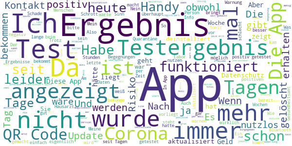

> Getestet wurde am 22.12. bis heute liegt lt. Der App kein Ergebnis vor 🤔😏 heute beim Arzt angerufen, der hat das Ergebnis schon......  :date: __2020-12-28 12:24:49__

> Testergebnis liegt mir bereits per Mail vor. In der App ist selbst nach mehreren Stunden kein Testergebnis anzeigbar.  :date: __2020-12-28 12:20:14__

> Ich habe die App jetzt deinstalliert. Es wird zwar angezeigt, daß man "Kontakt" zu einer positiven Person hatte aber weder wann, noch wo. Das bringt mir nichts. So weiß ich genauso viel, als wenn ich die App nicht hätte.  :date: __2020-12-28 12:11:00__

> Zeigt immernoch krin Testergebnis an obwohl ich schon seit 3 stunden info per telefon bekomm habe  :date: __2020-12-28 12:03:45__

> Sehr langweiliges Spiel... Nach 5 min war die Luft raus und zugeknallt von Werbung.. lohnt nicht der Speicher. Einfach langweiliges spiel  :date: __2020-12-28 11:51:14__

> Leider ist die App nicht brauchbar, hab insgesamt 5 Tage auf mein Testergebnis gewartet, es wurde immer nur angezeigt, dass mein Testergebnis noch nicht vorliegt. Beim Anruf des Hausarztes hatte ich mein Ergebnis sofort....  :date: __2020-12-28 11:26:53__

> App Zeigt kein Test Ergebnis an!! In meinen Augen totale Verschwendung von Steuergeldern!!  :date: __2020-12-28 11:06:09__

> Man wartet eine Woche auf sein Testergebnis, Anruf beim Arzt und es heisst das Ergebnis ist längst da und negativ. Schmerzlichen Dank, die App wird natürlich wieder gelöscht. Viel Erfolg beim eindämmen der Pandemie weiterhin...  :date: __2020-12-28 10:55:03__

> Total blöd diese App! Ich nutze ausschließlich das Handy für alles inkl. E-mail. Jetzt muss ich den QR Code scannen nach dem Test und die App kann diesen Code nicht ablesen, weil es im gleichen Gerät bzw. Bildschirm ist. Viele QR Scanner haben die Möglichkeit auch ein Bild von der Galerie zu übertragen. Ich werde dann meinen positiven Test leider nicht hochladen können. App gelöscht! Aw1: Nein, bin allein zu Hause. Test positiv!! Aw2: Jetzt soll ich den Job für die App erledigen? Nein danke!  :date: __2020-12-28 10:54:51__

> Bewertung wurde vor einigen Wochen von 2,9 auf 3,1 gesetzt und "fixiert". Herdenimmunität wird laut neuer WHO-Definition nur über Impfung erreicht, ... traps, traps. Die ALTEN sind nun ab dem 26.12. die erste Versuchsratten für die Impfung. Der Impfstoff muss irgendwie weg, "Kühlpannen" helfen auch. Alles schon bezahlt. Brexit-MUTATION erfordert neuen Stoff?! Wo sind die Freiwilligen, von denen unsere REGIERUNG spricht? Warten ab bis zum Frühjahr/Sommer?! Da wird es dann Erfolgsmeldungen hageln.  :date: __2020-12-28 10:48:12__

