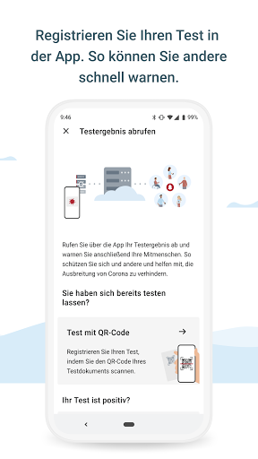
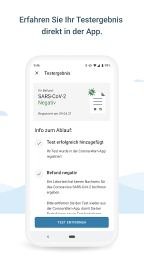
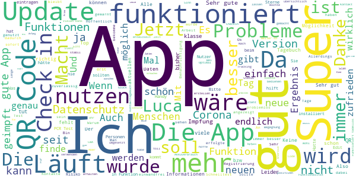
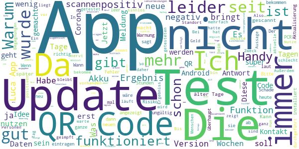

# Corona-Warn-App
App version ``2.0.5``

Analyzed with [covid-apps-observer](http://github.com/covid-apps-observer) project, version ``0.1``

## App overview
| | |
|-------------------------|-------------------------| 
| **Name**&nbsp;&nbsp;&nbsp;&nbsp;&nbsp;&nbsp;&nbsp;&nbsp;&nbsp;&nbsp;&nbsp;&nbsp;&nbsp;&nbsp;&nbsp;&nbsp;&nbsp;&nbsp;&nbsp;&nbsp;&nbsp;&nbsp;&nbsp;&nbsp;&nbsp;&nbsp;&nbsp;&nbsp;&nbsp;&nbsp;&nbsp;&nbsp;&nbsp;&nbsp;&nbsp;&nbsp;&nbsp;&nbsp;&nbsp;&nbsp;  | Corona-Warn-App |
| **Unique identifier** | de.rki.coronawarnapp |
| **Link to Google Play** | [https://play.google.com/store/apps/details?id=de.rki.coronawarnapp](https://play.google.com/store/apps/details?id=de.rki.coronawarnapp) |
| **Summary**  | Gemeinsam Corona bekämpfen |
| **Privacy policy** | [https://www.coronawarn.app/assets/documents/cwa-privacy-notice-de.pdf](https://www.coronawarn.app/assets/documents/cwa-privacy-notice-de.pdf) |
| **Latest version** | 2.0.5 |
| **Last update** | 2021-04-27 18:50:21 |
| **Recent changes** | Mit diesem Update beheben wir einen Fehler. |
| **Installs**  | 10.000.000+ |
| **Category** | Gesundheit & Fitness |
| **First release** | 12.06.2020 |
| **Size**  | 26M |
| **Supported Android version**  | 6.0 oder höher |

### Description
> Das Robert Koch-Institut (RKI) als zentrale Einrichtung des Bundes im Bereich der Öffentlichen Gesundheit und als nationales Public-Health-Institut veröffentlicht die Corona-Warn-App für die deutsche Bundesregierung und für die Bundesrepublik Deutschland. Die App fungiert als digitale Ergänzung zu Abstandhalten, Hygiene und Alltagsmaske. Die App basiert auf Bluetooth-Technologie und der Exposure Notification API von Google. Wer sie nutzt, hilft, Infektionsketten schnell nachzuverfolgen und zu durchbrechen. Die App merkt sich dezentral unsere Begegnungen mit anderen und informiert uns digital, wenn wir Begegnungen mit nachweislich infizierten Personen hatten. Dabei sammelt sie jedoch zu keiner Zeit Informationen zur Identität ihrer Nutzerinnen und Nutzer. Wer wir sind und wo wir sind, bleibt geheim – und unsere Privatsphäre bestens geschützt.
 WIE DIE APP FUNKTIONIERT
 Die Risiko-Ermittlung der App ist das Herzstück der Software und sollte immer aktiviert sein. Wann immer sich Nutzerinnen und Nutzer begegnen, tauschen ihre Smartphones über Bluetooth verschlüsselte Zufalls-IDs aus.
 Diese geben nur Auskunft darüber, über welche Dauer und mit welchem Abstand eine Begegnung stattfand. Welche Person sich hinter einem Code verbirgt, ist für niemanden nachvollziehbar. Die Corona-Warn-App erhebt keine Informationen über den Ort der Begegnung oder den Standort der Nutzerinnen und Nutzer.
 Entsprechend der maximalen Corona-Inkubationszeit werden alle Zufalls-IDs, die unser Smartphone sammelt, für 14 Tage auf dem Smartphone gespeichert – und dann gelöscht.
 Nur wenn eine Person sich über die App freiwillig als nachweislich infiziert meldet, erhalten daraufhin alle früheren Begegnungen eine Warnung auf ihr Smartphone.
 Niemand erfährt, wann, wo oder mit wem eine entsprechende Risiko-Begegnung stattfand. Die infizierte Person bleibt anonym.
 Mit der Benachrichtigung erhalten die betroffenen Nutzer/-innen klare Handlungsempfehlungen. Wichtig: Auch die Daten der Benachrichtigten sind zu keiner Zeit einsehbar.
 WIE DIE DATEN SICHER BLEIBEN
 Die Corona-Warn-App soll uns zwar täglich begleiten, sie wird uns jedoch nie kennenlernen. Dadurch kann sie niemandem verraten, wer wir sind. Der Datenschutz bleibt über die gesamte Nutzungsdauer zu 100 Prozent gewahrt.
 • Keine Anmeldung: Es müssen keine E-Mail-Adresse und kein Name hinterlegt werden.
 • Keine Rückschlüsse auf Identitäten: Bei einer Begegnung mit einem anderen Menschen tauschen die Smartphones nur Zufalls-IDs aus. Diese messen, über welche Dauer und mit welchem Abstand ein Kontakt stattfand. Sie lassen aber keine Rückschlüsse auf Personen und Standorte zu.
 • Dezentrale Speicherung: Die Daten werden nur auf dem Smartphone gespeichert und nach 14 Tagen gelöscht.
 • Keine Einsicht für Dritte: Sowohl die Personen, die eine nachgewiesene Infektion melden, als auch die Benachrichtigten sind nicht nachverfolgbar – nicht für die Bundesregierung, nicht für das Robert Koch-Institut, nicht für andere User und auch nicht für die Betreiber der App-Stores.
 Diese App ist nicht zum Gebrauch außerhalb Deutschlands bestimmt. Die Corona-Warn-App ist die zentrale Corona-App für Deutschland und sie ist an das deutsche Gesundheitssystem angeschlossen. Trotzdem ist die Corona-Warn-App auch in diesem Land verfügbar. Sie ist gedacht für alle, die in Deutschland leben, arbeiten, Urlaub machen oder sich regelmäßig oder über längere Zeit in Deutschland aufhalten.
 Es gelten die Nutzungsbedingungen der Corona-Warn-App: https://www.coronawarn.app/assets/documents/cwa-eula-de.pdf. Durch die Installation und Nutzung dieser App stimmen Sie den Nutzungsbedingungen zu.

### User interface
The developers of the app provide the following screenshots in the Google play store.
| | | |
|:-------------------------:|:-------------------------:|:-------------------------:|
 |   |   |   | 
 |   |   |   | 
 |   |  

## Development team
In the following we report the main information provided by the development team in the Google play store.

| | |
|-------------------------|-------------------------|
| **Developer**  | Robert Koch-Institut |
| **Website**  | [https://www.coronawarn.app](https://www.coronawarn.app) |
| **Email** | CoronaWarnApp@rki.de |
| **Physical address**  | [Robert Koch-Institut Nordufer 20 13353 Berlin](https://www.google.com/maps/search/Robert%20Koch-Institut%20Nordufer%2020%2013353%20Berlin) (Google Maps) |
| **Other developed apps**  | [https://play.google.com/store/apps/developer?id=Robert+Koch-Institut](https://play.google.com/store/apps/developer?id=Robert+Koch-Institut) |

## Android support

| | |
|-------------------------|-------------------------|
| **Declared target Android version**  | Android10, version 10 (API level 29) |
| **Effective target Android version**  | Android10, version 10 (API level 29) |
| **Minimum supported Android version**  | Marshmallow, version 6.0 (API level 23) |
| **Maximum target Android version**  | - |

The larger the difference between the minimum and maximum supported Android versions, the better. A larger difference means a wider audience. For example, old phones have a very low Android version, so a high minimum supported Android version means that the app cannot be used by users with old phones, thus leading to accessibility problems. 

## Requested permissions

In the following we report the complete list of the permissions requested by the app. 

| **Permission** | **Protection level** | **Description** | 
|-------------------------|-------------------------|-------------------------|
 **android.permission ACCESS_NETWORK_STATE** | Normal | Allows applications to access information about networks. 
 **android.permission BLUETOOTH** | Normal | Allows applications to connect to paired bluetooth devices. 
 **android.permission CAMERA** | :warning:**Dangerous** | Required to be able to access the camera device. 
 **android.permission FOREGROUND_SERVICE** | Normal | Allows a regular application to use Service.startForeground. 
 **android.permission INTERNET** | Normal | Allows applications to open network sockets. 
 **android.permission RECEIVE_BOOT_COMPLETED** | Normal | Allows an application to receive the Intent.ACTION_BOOT_COMPLETED that is broadcast after the system finishes booting. 
 **android.permission REQUEST_IGNORE_BATTERY_OPTIMIZATIONS** | Normal | Permission an application must hold in order to use Settings.ACTION_REQUEST_IGNORE_BATTERY_OPTIMIZATIONS. 
 **android.permission WAKE_LOCK** | Normal | Allows using PowerManager WakeLocks to keep processor from sleeping or screen from dimming. 

## Mentioned servers

| **Server** | **Registrant** | **Registrant country** | **Creation date** | 
|-------------------------|-------------------------|-------------------------|-------------------------|
 | google.com | Google LLC | :us: US | 1997-09-15 04:00:00 |
 | android.com | Google LLC | :us: US | 1997-06-23 04:00:00 |

## Security analysis 

Below we report the main security warnings raised by our execution of the [Androwarn](https://github.com/maaaaz/androwarn) security analysis tool.

**Connection interfaces exfiltration**
> - This application reads details about the currently active data network 
> - This application tries to find out if the currently active data network is metered 

**Telephony services abuse**
> - This application makes phone calls 

**Suspicious connection establishment**
> - This application opens a Socket and connects it to the remote address '; port is out of range' on the 'N/A' port  
> - This application opens a Socket and connects it to the remote address 'Lcom/android/tools/r8/GeneratedOutlineSupport;->outline26(Ljava/lang/String;)Ljava/lang/StringBuilder;' on the 'N/A' port  
> - This application opens a Socket and connects it to the remote address 'Ljava/net/Proxy;->type()Ljava/net/Proxy$Type;' on the 'N/A' port  
> - This application opens a Socket and connects it to the remote address 'Method sendUrgentData() is not supported.' on the 'N/A' port  
> - This application opens a Socket and connects it to the remote address 'Method setHandshakeTimeout() is not supported.' on the 'N/A' port  
> - This application opens a Socket and connects it to the remote address 'Method setOOBInline() is not supported.' on the 'N/A' port  
> - This application opens a Socket and connects it to the remote address 'Method setSoWriteTimeout() is not supported.' on the 'N/A' port  
> - This application opens a Socket and connects it to the remote address 'Socket closed' on the 'N/A' port  
> - This application opens a Socket and connects it to the remote address 'Socket is closed' on the 'N/A' port  
> - This application opens a Socket and connects it to the remote address 'Socket is closed.' on the 'N/A' port  
> - This application opens a Socket and connects it to the remote address 'Socket is not connected.' on the 'N/A' port  
> - This application opens a Socket and connects it to the remote address 'socket is closed' on the 'N/A' port  
> - This application opens a Socket and connects it to the remote address 'timeout' on the 'N/A' port  

**Code execution**
> - This application loads a native library 
> - This application loads a native library: 'conscrypt_gmscore_jni' 
> - This application loads a native library: 'conscrypt_jni' 

## User ratings and reviews

Below we provide information about how end users are reacting to the app in terms of ratings and reviews in the Google Play store.

### Ratings

The Corona-Warn-App app has been installed by more than **10000000** times. At this time, **119277** rated the app and its average score is **2.9861364**. Below we show the distribution of the ratings across the usual star-based rating of Google Play

:star::star::star::star::star:: 42241

:star::star::star::star:: 12278

:star::star::star:: 10773

:star::star:: 9555

:star:: 44430

### Reviews 

#### 5-star reviews

> Also generell befürworte ich die App absolut und sie funktioniert auch von Anfang an in allen bisher erschienenen Versionen tadellos. Danke, daß mein Wunsch, das Tagebuch mit persönlichen Ergänzungen zu erweitern, umgesetzt wurde. Die App wird von Update zu Update besser. 👍👍👍Testergebnis wurde über den QR-Scan (nach ca. 36Std.) Problemlos übermittelt. Risikowarnung nach Kontakt funktionierte Prima.  :date: __2021-05-01 19:00:15__

> Sehr gerte fane Kelmendi. Ich möchte Ihnen von.. ich versuche anzumelden da bekomme ich nicht Rhein.... Da bekomme ich nicht online reinzugehen  :date: __2021-05-01 17:37:37__

> Absolut empfehlenswert Bin super zufrieden  :date: __2021-05-01 17:13:10__

> Dachte in der corona app sei ein impfpass...kommt das noch?  :date: __2021-05-01 16:30:29__

> Ich bin bisher noch nicht gewarnt worden!  :date: __2021-05-01 16:12:57__

> Jetzt ist auch ein Scan des QR codes möglich, danke. Bei begativem Ergebnis wird man auch im status darauf hingewiesen :)  :date: __2021-05-01 16:06:10__

> Wird immer besser. Sollte auch den Status "geimpft" erfassen. Ein Hinweis an andere Kontakte muss ja nicht nur "Risikobegegnungen" enthalten.  :date: __2021-05-01 14:03:39__

> Eine Möglichkeit, beim Thema COVID-19 zu helfen!  :date: __2021-05-01 13:45:31__

> Xxx  :date: __2021-05-01 13:13:20__

> Diese App ist sehr gut, ich brauche sie aber nicht mehr, ich wurde vor 10 Tage zum 2. mal geimpft.  :date: __2021-05-01 12:33:46__

#### 4-star reviews

> Es sind Fehler bei Überprüfung kontakte warum kommt immer wieder diese Meldung  :date: __2021-05-01 12:04:30__

> Bin positiv überrascht bzgl Tagebuch find ich super jetzt wünsche ich mir die Erfassung von Schnelltests dann wäre dies sehr schön  :date: __2021-05-01 10:23:47__

> Neu 1.5.21 - Tagebuch praktisch. Weitere Erweiterung wäre aktuell gültige Richtlinien der Region anzeigen lassen können. Da Landkreise verschiedene Regeln haben blickt man kaum durch. Hier wäre es gut Manuel den Ort einzugeben und dann die rechtliche Regelungen zu sehen. Oder wer mag Standort basiert automatisch.  :date: __2021-05-01 10:22:13__

> Könnte verbessert werden aber trotzdem gut  :date: __2021-05-01 00:11:06__

> Ich benutze die "Corona-Warn-App" nun seit ca. 1 Monat und wurde diese Woche sogar zum ersten Mal über "eine Begegnung mit niedrigem Risiko" informiert. Das zeigt, dass die App auf jeden Fall irgendwie funktioniert. Jedoch hätte ich die App beinahe deinstalliert, da ich den "13 von 14 Tage-Bug" habe und dachte, die App zeichnet keine Begegnungen mehr auf. Vielleicht könnte man Fehler direkt in der App auflisten. Vorschlag: Einen "Wie-fühlen-Sie-sich-Fragebogen" wie bei österr. App "Stopp Corona"  :date: __2021-04-30 18:26:47__

> Ich nutze die App von Anfang an. Seit es das Kontakttagebuch gibt, sogar noch viel lieber als zuvor!! Hier noch einen Tipp für eine Verbesserung. Kann man in das Tagebuch einen Option für einen durchgeführten Schnell- oder Selbsttest mit einfügen? Bisher mache ich das über "Ort" mit zusätzlicher Notiz. Aber es wäre sicher hilfreich, wenn man sich das ebenfalls als Gedankenstütze dort notieren könnte.  :date: __2021-04-30 18:04:33__

> Rundum tolle App, was mir aus beruflicher Sicht noch fehlt ist eine Vorlage von Events (wie bei der Diacy App). Das ist besonders im Unterricht praktisch, denn jeden Tag 3-4x jeweils 15 bis 25 Schüler:innen je Klasse neu hinzufügen ist echt unpraktisch. Auch fehlt mir wie bei der Diacy App eine Startuhrzeit und eine Dauer für ein Event. >>> Update 30.4.: Events die ein Start und Enddatum + Uhrzeit haben, sollten die Dauer in Minuten entweder selbst errechnen oder dies nicht als Pflichtfeld haben  :date: __2021-04-30 17:16:26__

> Eine Benachrichtigung erfolgt in grün oder rot. Bislang ohne Befund positiv  :date: __2021-04-30 16:23:18__

> Funktioniert bisher gut. Man sich testen lassen und den QR-Code einscannen um in Geschäfte zu gehen. Aber was ist mit den geimpften Personen. Sollen die sich auch noch testen lassen oder gibt es da auch noch einen Code oder ein Symbolbild?  :date: __2021-04-30 14:12:08__

> Die App ist mit Einführung des Tagebuchs für mich nutzbar geworden, jedoch fände ich es sinnvoll die Personen zu den Orten zuordnen zu können und Zeiten eingeben zu können, wann ich diese Personen getroffen habe ( also beim Anlegen der Person oder des Ortes automatisch die Zeit erfassen). Die App wird trotzdem immer besser. Update: und da direkt auf die Vorschläge reagiert wird gibt's noch einen Punkt dazu 👍  :date: __2021-04-30 11:54:47__

#### 3-star reviews

> Langsam entwickelt sich diese App , war ja auch teuer genug !!  :date: __2021-05-01 19:41:37__

> Sollte die Impfung des Nutzers nicht vll. vermerkt werden?  :date: __2021-05-01 19:31:12__

> Warum kann man nicht eintragen, dass man eine Impfung bekommen hat?  :date: __2021-05-01 19:15:26__

> Seit dem letzten Update kann ich keine Personendaten mehr eintragen 🤔  :date: __2021-05-01 12:41:32__

> Benutze die Corona-Warn-App schon lange auf meinem Smartphone es gibt die Fehlermeldung bei der Risiko-Überprüfung da heißt es ,,Der Abgleich der Zufall-IDs mit dem Server ist fehlgeschlagen,, dieses Problem habe seit der neusten Version 2.0.5 von der Corona Warn App macht bitte das dieses Problem behoben werden kann, weil das stört.  :date: __2021-05-01 12:26:09__

> Erst Standort und dann auch noch Bluetooth?!!! Ne  :date: __2021-05-01 10:51:15__

> nette Idee das mit dem Einchecken in selbst erstellbare Events... nur ziemlich unprofessionell gemacht, wenn die eigenen Events und QR-Codes selbst kaum wieder zu finden sind, weil ein entsprechender Menüeintrag vergessen wurde🤔... unter "QR-Code erstellen" auf der Infoseite sucht man das jedenfalls nicht, "erwartungskonform" im Sinne der Grundprinzipien der Software-Ergonomie ist das leider gar nicht! 😵😥😖 bitte nachbessern!... ist ja auch aus dem letzten Jahrhundert😇  :date: __2021-05-01 10:20:25__

> Warum kann man keine Ergebnisse von Schnelltests eintragen? Dadurch würde wirklich wertvolle Zeit eingespart.  :date: __2021-05-01 08:53:48__

> Am 13.4. War eine hohe Risikomeldung. Am 30.4. War sie immer noch da, obwohl ich negativ. Bin  :date: __2021-04-30 23:18:15__

> Bisher funktioniert es für mich gut jedoch bietet die App keinerlei Möglichkeit anzugeben dass man bereits die 1. IMPFUNG erhalten hat. Dieses Feedback finde ich sehr wichtig und sollte auch berücksichtigt werden, vor allem nach der 2. Impfung wäre das sehr wichtig zur Risikobewertung. Warum werden die Impfungen nicht berücksichtigt? Danke  :date: __2021-04-30 22:26:55__

#### 2-star reviews

> Nein, funktioniert Immer noch nicht  :date: __2021-05-01 18:22:20__

> Bis vor 4 Wochen alles super. Von einem auf den anderen Tag Fehler Ursache 3# Google Schnittstelle 8. App läuft seitdem nicht auf Android 7. Keine info über Hotline. Update 01.05. Fehler liegt nach wie vor vor. So ist die App keine Hilfe.  :date: __2021-05-01 14:52:56__

> Seit dem letzten Update sind keine "Personen" mehr vorhanden!  :date: __2021-05-01 12:30:15__

> Update: Danke für die Antwort, hilft aber 0 weiter. Bis vor 1 (oder 2?) Wochen auch keine Probleme gehabt. Android/Huawei Update gab es nicht, daher habe ich die App in Verdacht. ### Akku-Fresser! Mein Handy sagt mir seit einigen Tagen mehrfach täglich, das ich die Akku Optimierung für die App aktivieren soll, da sie ungewöhnlich viel Strom verbraucht. Mittags ist mittlerweile schon der habe Akku meines Handys leer, ohne das ich es groß in der Hand hatte. Bitte der Sache auf den Grund gehen!  :date: __2021-05-01 12:19:39__

> Abruf von Testergebniss funktioniert nicht  :date: __2021-05-01 09:39:36__

> Diese App erfüllt nur ihren Zweck wenn sie von allen Benutzt wird, 10 Mio Downloads auf die tatsächliche Bewohner Anzahl in Deutschland ist zu wenig. Die meisten haben diese nicht einmal in Gebrauch. Außerdem bekomme ich immer Anforderungen mein GPS sn zu machen, was mich sehr stört. Fazit, die Regierung hat viel Geld für die App ausgegeben und finanziert diese weiter, leider erfüllt sie ihren Zweck nicht. Meiner Seits werde ich diese deinstallieren  :date: __2021-05-01 06:59:43__

> Vor einer Woche wurde mir ein erhöhtes Risiko angezeigt. Schnelltest war negativ. Muss ich diesen abscannen, damit die Anzeige weg geht?  :date: __2021-04-30 21:54:48__

> Keine Kompatibilität zum QR-Code anderer Apps. Warum kann man in Vorbereitung auf einen digitalen Impfpass nicht auch eine Impfung eintragen? Wäre vielleicht bei der Bewertung des persönlichen Infektionsrisikos eine wichtige Größe.  :date: __2021-04-30 21:05:10__

> Man könnte die App etwas aufwerten, wenn man infos wie "sie sind jetzt im Landkreis xy, hier gibt es x infektionen, x genesene" Dafür müsste die app allerdings auf den Standort zugreifen dürfen Ich wurde im Januar 21 positiv getestet. PCR-Test war positiv. Kaum Nebenerscheinungen. Ich bin also ein "Genesener". Wo kann ich das eintragen??  :date: __2021-04-30 20:14:38__

> Nun hab ich mir diese App runtergeladen...wollte ich immer nicht...tat es auch nur, da ich Kontakt zu einem positiven getesteten hatte....pcr durchgeführt...qr Code....usw....also der Anruf bei meinem Hausarzt war dann schneller....das Ergebnis bekam ich dann....die app sagt immer noch " kein Ergebnis da"....  :date: __2021-04-30 11:52:14__

#### 1-star reviews

> Immer mehr Geschäfte wollen ein Coronatest um ins Geschäft zu kommen hat man aber eine Coronaimpfung geht das auch leider muss man immer sein Impfpass mitnehmen um ins Geschäft zu kommen war schön wenn endlich ein digitale Lösung kommen würde damit man nicht immer den Impfpass mitnehmen muss. Man braucht in jetzt und nicht erst in Monaten. PS könnte ja auch mal verloren gehen das wäre echt mies.  :date: __2021-05-01 18:05:35__

> Gegen einen voll gefressen Hustenvirus gibts keinen Impfstoff  :date: __2021-05-01 17:23:56__

> Zum zweiten Mal hat die App lautlos ihren Dienst quittiert. Die 5 Coronainfizierten Kollegen wurden somit nicht erkannt. Völlig sinnlose App. Nein, ich habe keine Fehlermeldung erhalten.  :date: __2021-05-01 17:03:13__

> Nach 6 Tage sagt die App immer noch, dass mein Testergebnis noch nicht vorliegt. Völlig nutzlos. Wird umgehend wieder deinstalliert.  :date: __2021-05-01 16:58:18__

> Man kann ja einen QR Code von seinem Coronatest einscannen und sollte das Ergebnis positiv sein, können direkt alle Kontaktpersonen benachrichtigt werden. So die Theorie: Mein Ergebnis ist seit Tagen da. Diese App sagt immernoch "noch kein Ergebnis"! Viele viele Millionen Euro für die eh schon dicken Fische und das Ergebnis ist so ein defekter Schrott. Was ihr hier zusammengeschustert habt ist eine absolute Frechheit nicht nur für mich als Entwickler sondern auch für jeden einzelnen Steuerzahler  :date: __2021-05-01 16:39:20__

> Völlig wertlose App!!!  :date: __2021-05-01 16:22:50__

> Am 27.4. wurde ich getestet. Am 28.4. bekam ich über die App "Mein Laborergebnis" das (negative) Ergebnis. In dieser App Stand jetzt (1.5.) immer noch "Testergebnis liegt noch nicht vor ". Kopfschüttel.  :date: __2021-05-01 13:25:18__

> Frage mich warum ich mir so ein Mist aufs Handy geladen hab . Mittwoch gestet worden. Ergebnis sollte schon da sein . Letztes Mal war es so das ich 6 Wochen nichts angezeigt bekam . Aerztin meinte wuerde jetzt funktionieren ... So eine sch ...... App nützt überhaupt rein gar nichts . Werde loeschen und garantiert nicht mehr runter laden  :date: __2021-05-01 13:14:49__

> Dreck  :date: __2021-05-01 12:51:31__

> Absolut witzlos...weder Zeit noch Ort der Begegnung werden angezeigt.  :date: __2021-05-01 12:36:15__

